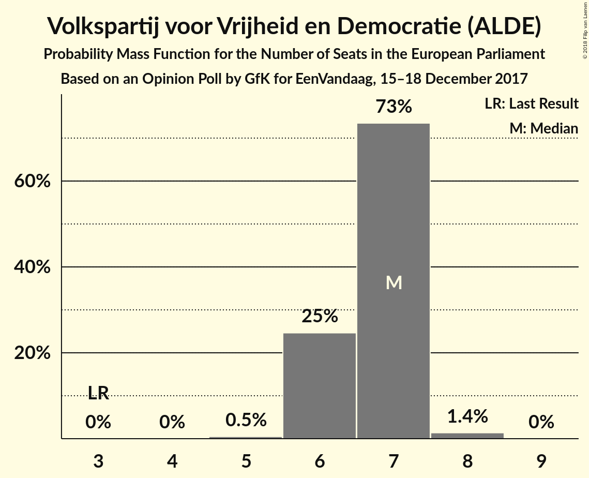
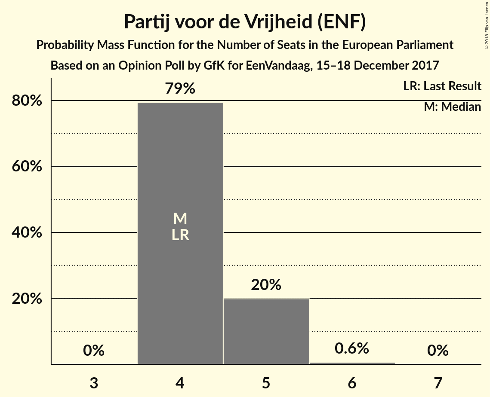
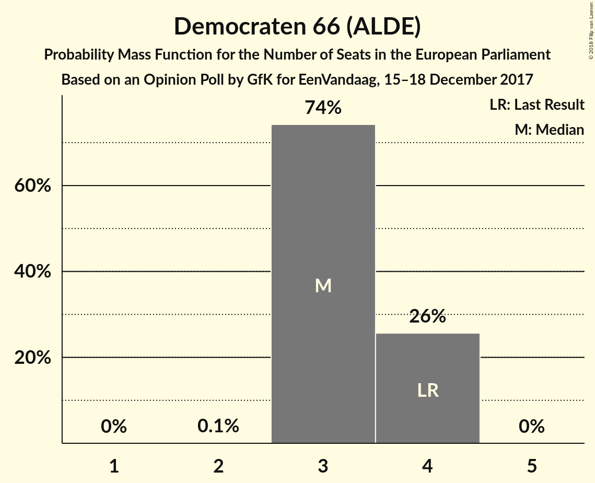
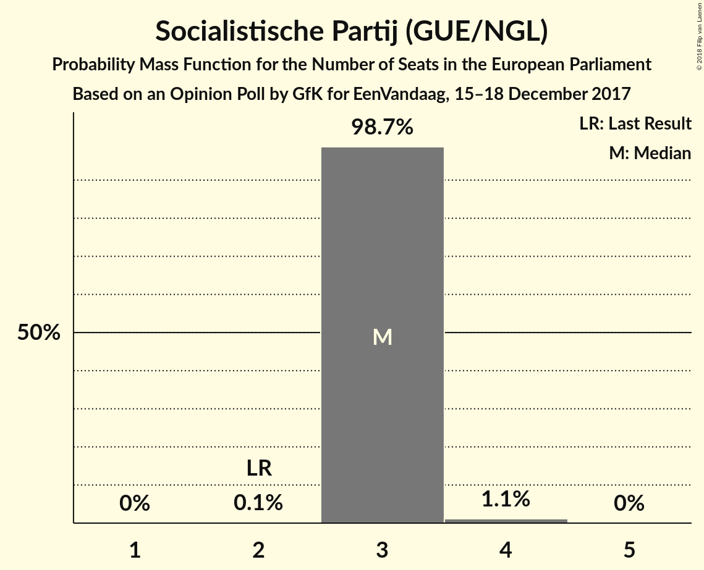
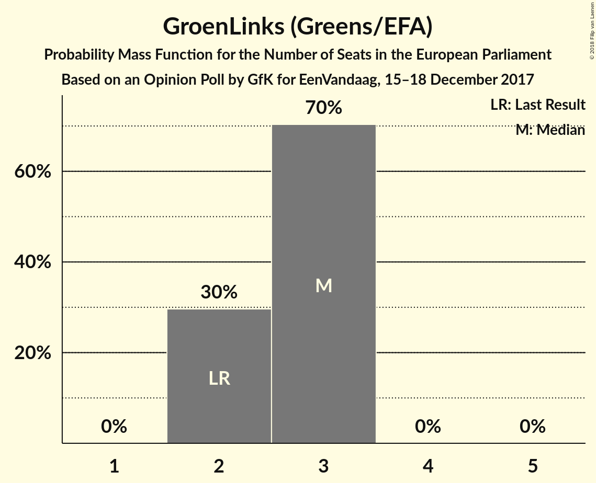
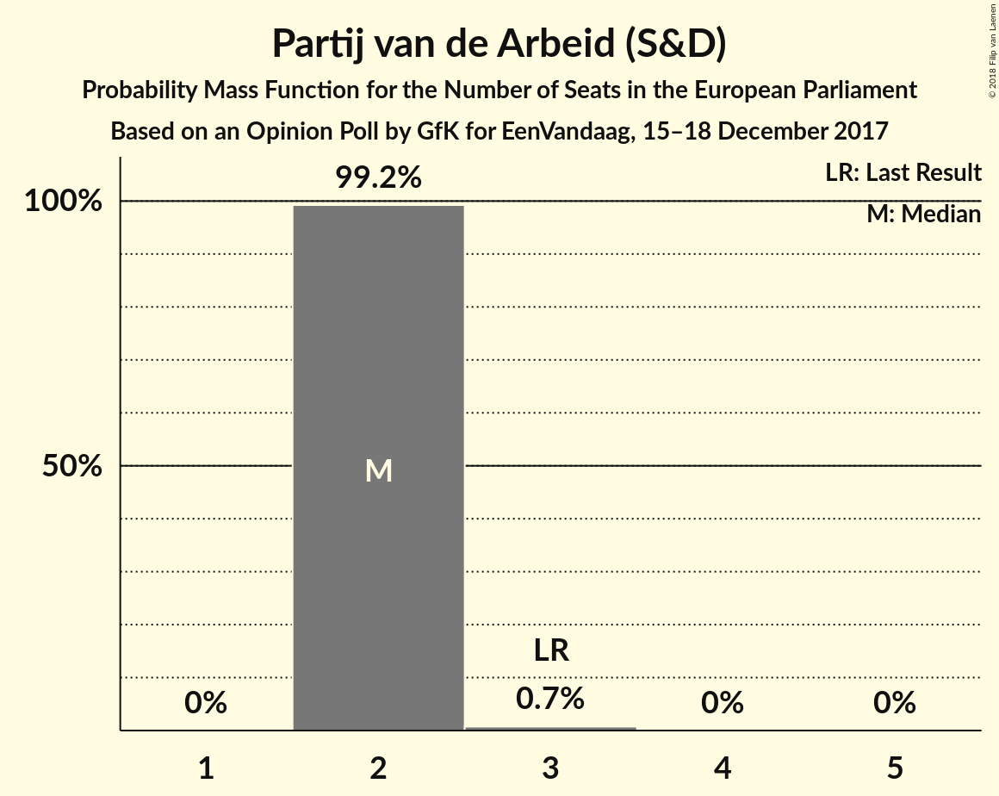
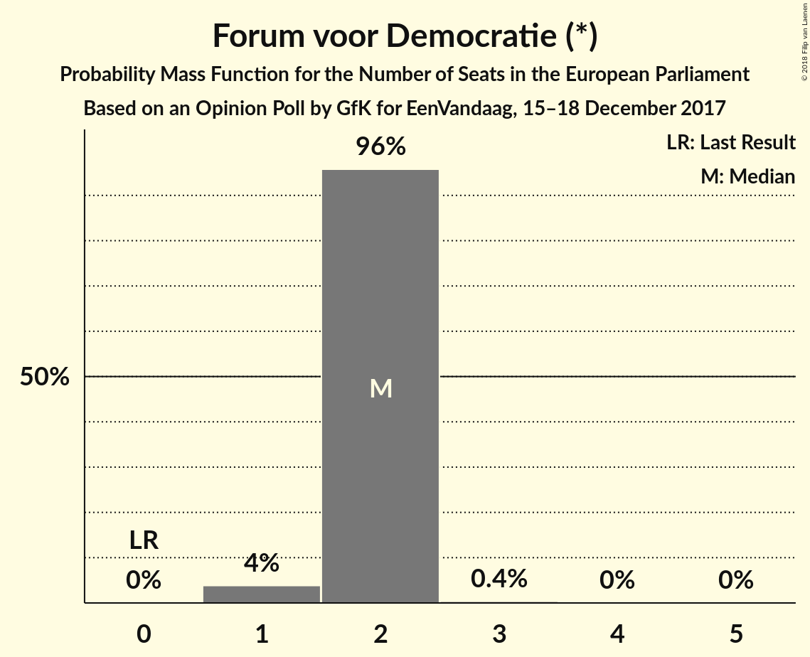
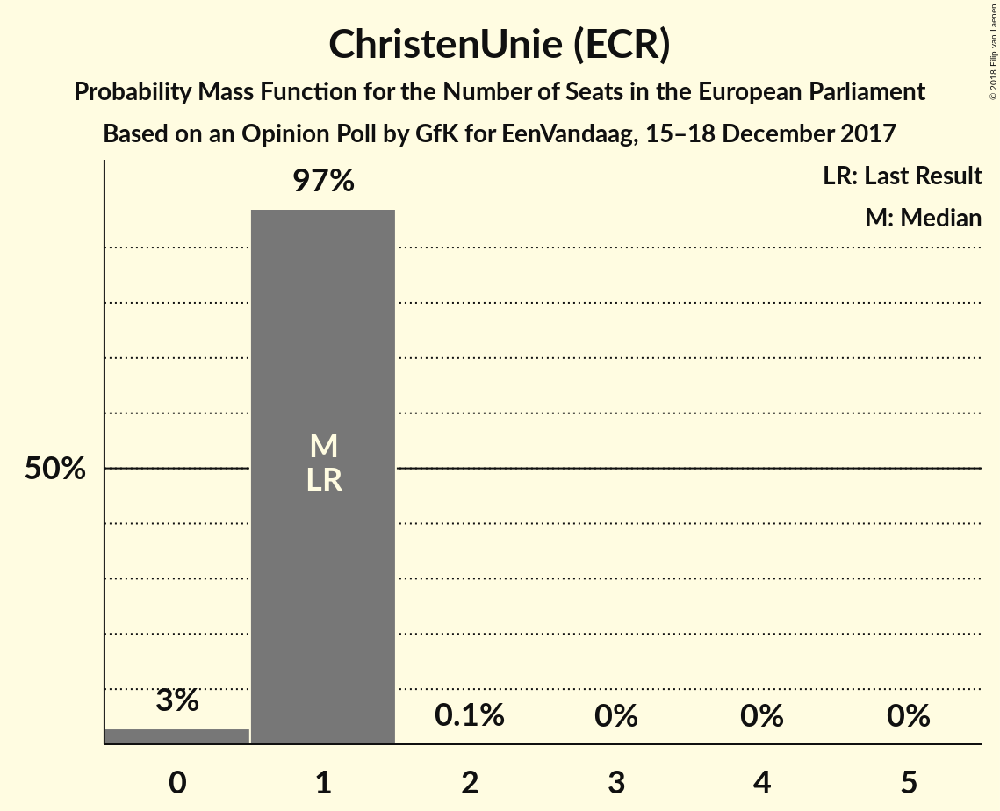
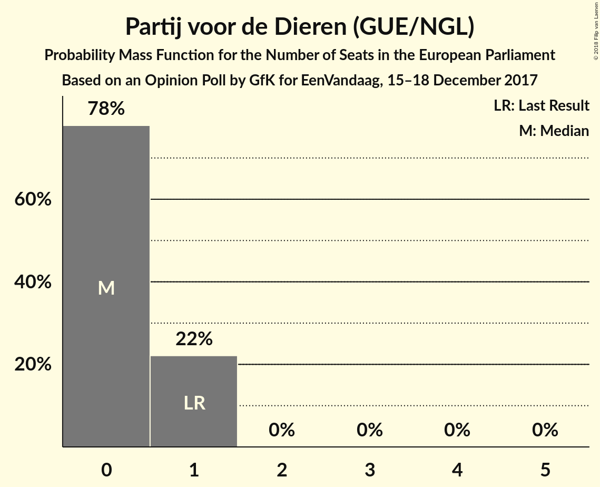

# Opinion Poll by GfK for EenVandaag, 15–18 December 2017

<a href="#voting-intentions">Voting Intentions</a> | <a href="#seats">Seats</a> | <a href="#coalitions">Coalitions</a> | <a href="#technical-information">Technical Information</a>

## Voting Intentions

### Confidence Intervals

| Party | Last Result | Poll Result | 80% Confidence Interval | 90% Confidence Interval | 95% Confidence Interval | 99% Confidence Interval |
|:-----:|:-----------:|:-----------:|:-----------------------:|:-----------------------:|:-----------------------:|:-----------------------:|
| Volkspartij voor Vrijheid en Democratie (ALDE) | 12.0% | 19.3% | 18.2–20.5% |17.9–20.9% |17.6–21.2% |17.1–21.7% |
| Partij voor de Vrijheid (ENF) | 13.3% | 14.0% | 13.0–15.1% |12.8–15.4% |12.5–15.7% |12.1–16.2% |
| Christen-Democratisch Appèl (EPP) | 15.2% | 10.0% | 9.2–11.0% |8.9–11.2% |8.7–11.5% |8.4–11.9% |
| Democraten 66 (ALDE) | 15.5% | 10.0% | 9.2–11.0% |8.9–11.2% |8.7–11.5% |8.4–11.9% |
| Socialistische Partij (GUE/NGL) | 9.6% | 10.0% | 9.2–11.0% |8.9–11.2% |8.7–11.5% |8.4–11.9% |
| GroenLinks (Greens/EFA) | 7.0% | 8.7% | 7.9–9.5% |7.7–9.8% |7.5–10.0% |7.1–10.5% |
| Partij van de Arbeid (S&D) | 9.4% | 7.3% | 6.6–8.2% |6.4–8.4% |6.2–8.6% |5.9–9.0% |
| Forum voor Democratie (*) | 0.0% | 6.7% | 6.0–7.5% |5.8–7.7% |5.6–7.9% |5.3–8.3% |
| ChristenUnie (ECR) | 7.7% | 4.0% | 3.5–4.6% |3.3–4.8% |3.2–5.0% |3.0–5.3% |
| Partij voor de Dieren (GUE/NGL) | 4.2% | 3.4% | 2.9–4.0% |2.7–4.1% |2.6–4.3% |2.4–4.6% |
| 50Plus (ALDE) | 3.7% | 3.4% | 2.9–4.0% |2.7–4.1% |2.6–4.3% |2.4–4.6% |
| Staatkundig Gereformeerde Partij (ECR) | 7.7% | 2.0% | 1.6–2.5% |1.5–2.6% |1.4–2.7% |1.3–3.0% |
| Denk (*) | 0.0% | 1.3% | 1.0–1.7% |0.9–1.8% |0.9–1.9% |0.8–2.1% |

*Note:* The poll result column reflects the actual value used in the calculations. Published results may vary slightly, and in addition be rounded to fewer digits.

## Seats

### Confidence Intervals

| Party | Last Result | Median | 80% Confidence Interval | 90% Confidence Interval | 95% Confidence Interval | 99% Confidence Interval |
|:-----:|:-----------:|:------:|:-----------------------:|:-----------------------:|:-----------------------:|:-----------------------:|
| <a href="#volkspartij-voor-vrijheid-en-democratie-(alde)">Volkspartij voor Vrijheid en Democratie (ALDE)</a> | 3 | 6 | 5–6 |5–6 |5–6 |5–6 |
| <a href="#partij-voor-de-vrijheid-(enf)">Partij voor de Vrijheid (ENF)</a> | 4 | 5 | 4–5 |4–5 |4–5 |4–5 |
| <a href="#christen-democratisch-appèl-(epp)">Christen-Democratisch Appèl (EPP)</a> | 5 | 4 | 3–4 |3–4 |3–4 |2–4 |
| <a href="#democraten-66-(alde)">Democraten 66 (ALDE)</a> | 4 | 3 | 3 |3 |3 |3 |
| <a href="#socialistische-partij-(gue/ngl)">Socialistische Partij (GUE/NGL)</a> | 2 | 3 | 3 |3 |3 |3–4 |
| <a href="#groenlinks-(greens/efa)">GroenLinks (Greens/EFA)</a> | 2 | 2 | 2–4 |2–4 |2–4 |2–4 |
| <a href="#partij-van-de-arbeid-(s&d)">Partij van de Arbeid (S&D)</a> | 3 | 2 | 2–3 |2–3 |2–3 |2–3 |
| <a href="#forum-voor-democratie-(*)">Forum voor Democratie (*)</a> | 0 | 2 | 2 |2 |2 |1–2 |
| <a href="#christenunie-(ecr)">ChristenUnie (ECR)</a> | 1 | 0 | 0–1 |0–1 |0–1 |0–2 |
| <a href="#partij-voor-de-dieren-(gue/ngl)">Partij voor de Dieren (GUE/NGL)</a> | 1 | 1 | 0–1 |0–1 |0–1 |0–1 |
| <a href="#50plus-(alde)">50Plus (ALDE)</a> | 0 | 1 | 1 |1 |0–1 |0–1 |
| <a href="#staatkundig-gereformeerde-partij-(ecr)">Staatkundig Gereformeerde Partij (ECR)</a> | 1 | 0 | 0 |0 |0 |0 |
| <a href="#denk-(*)">Denk (*)</a> | 0 | 0 | 0 |0 |0 |0 |

### Volkspartij voor Vrijheid en Democratie (ALDE)

*For a full overview of the results for this party, see the [Volkspartij voor Vrijheid en Democratie (ALDE)](party-volkspartijvoorvrijheidendemocratiealde.html) page.*

| Number of Seats | Probability | Accumulated | Special Marks |
|:---------------:|:-----------:|:-----------:|:-------------:|
| 3 | 0% | 100% | Last Result |
| 4 | 0% | 100% |  |
| 5 | 29% | 100% |  |
| 6 | 71% | 71% | Median |
| 7 | 0.3% | 0.3% |  |
| 8 | 0% | 0% |  |

### Partij voor de Vrijheid (ENF)

*For a full overview of the results for this party, see the [Partij voor de Vrijheid (ENF)](party-partijvoordevrijheidenf.html) page.*

| Number of Seats | Probability | Accumulated | Special Marks |
|:---------------:|:-----------:|:-----------:|:-------------:|
| 4 | 31% | 100% | Last Result |
| 5 | 69% | 69% | Median |
| 6 | 0% | 0% |  |

### Christen-Democratisch Appèl (EPP)

*For a full overview of the results for this party, see the [Christen-Democratisch Appèl (EPP)](party-christen-democratischappèlepp.html) page.*

| Number of Seats | Probability | Accumulated | Special Marks |
|:---------------:|:-----------:|:-----------:|:-------------:|
| 2 | 2% | 100% |  |
| 3 | 31% | 98% |  |
| 4 | 67% | 67% | Median |
| 5 | 0% | 0% | Last Result |

### Democraten 66 (ALDE)

*For a full overview of the results for this party, see the [Democraten 66 (ALDE)](party-democraten66alde.html) page.*

| Number of Seats | Probability | Accumulated | Special Marks |
|:---------------:|:-----------:|:-----------:|:-------------:|
| 2 | 0.3% | 100% |  |
| 3 | 99.7% | 99.7% | Median |
| 4 | 0% | 0% | Last Result |

### Socialistische Partij (GUE/NGL)

*For a full overview of the results for this party, see the [Socialistische Partij (GUE/NGL)](party-socialistischepartijguengl.html) page.*

| Number of Seats | Probability | Accumulated | Special Marks |
|:---------------:|:-----------:|:-----------:|:-------------:|
| 2 | 0.1% | 100% | Last Result |
| 3 | 98.6% | 99.9% | Median |
| 4 | 1.3% | 1.3% |  |
| 5 | 0% | 0% |  |

### GroenLinks (Greens/EFA)

*For a full overview of the results for this party, see the [GroenLinks (Greens/EFA)](party-groenlinksgreensefa.html) page.*

| Number of Seats | Probability | Accumulated | Special Marks |
|:---------------:|:-----------:|:-----------:|:-------------:|
| 2 | 66% | 100% | Last Result, Median |
| 3 | 21% | 34% |  |
| 4 | 13% | 13% |  |
| 5 | 0% | 0% |  |

### Partij van de Arbeid (S&D)

*For a full overview of the results for this party, see the [Partij van de Arbeid (S&D)](party-partijvandearbeidsd.html) page.*

| Number of Seats | Probability | Accumulated | Special Marks |
|:---------------:|:-----------:|:-----------:|:-------------:|
| 2 | 70% | 100% | Median |
| 3 | 30% | 30% | Last Result |
| 4 | 0% | 0% |  |

### Forum voor Democratie (*)

*For a full overview of the results for this party, see the [Forum voor Democratie (*)](party-forumvoordemocratie.html) page.*

| Number of Seats | Probability | Accumulated | Special Marks |
|:---------------:|:-----------:|:-----------:|:-------------:|
| 0 | 0% | 100% | Last Result |
| 1 | 2% | 100% |  |
| 2 | 98% | 98% | Median |
| 3 | 0.3% | 0.3% |  |
| 4 | 0% | 0% |  |

### ChristenUnie (ECR)

*For a full overview of the results for this party, see the [ChristenUnie (ECR)](party-christenunieecr.html) page.*

| Number of Seats | Probability | Accumulated | Special Marks |
|:---------------:|:-----------:|:-----------:|:-------------:|
| 0 | 68% | 100% | Median |
| 1 | 31% | 32% | Last Result |
| 2 | 0.9% | 0.9% |  |
| 3 | 0% | 0% |  |

### Partij voor de Dieren (GUE/NGL)

*For a full overview of the results for this party, see the [Partij voor de Dieren (GUE/NGL)](party-partijvoordedierenguengl.html) page.*

| Number of Seats | Probability | Accumulated | Special Marks |
|:---------------:|:-----------:|:-----------:|:-------------:|
| 0 | 13% | 100% |  |
| 1 | 87% | 87% | Last Result, Median |
| 2 | 0% | 0% |  |

### 50Plus (ALDE)

*For a full overview of the results for this party, see the [50Plus (ALDE)](party-50plusalde.html) page.*

| Number of Seats | Probability | Accumulated | Special Marks |
|:---------------:|:-----------:|:-----------:|:-------------:|
| 0 | 3% | 100% | Last Result |
| 1 | 97% | 97% | Median |
| 2 | 0% | 0% |  |

### Staatkundig Gereformeerde Partij (ECR)

*For a full overview of the results for this party, see the [Staatkundig Gereformeerde Partij (ECR)](party-staatkundiggereformeerdepartijecr.html) page.*

| Number of Seats | Probability | Accumulated | Special Marks |
|:---------------:|:-----------:|:-----------:|:-------------:|
| 0 | 100% | 100% | Median |
| 1 | 0% | 0% | Last Result |

### Denk (*)

*For a full overview of the results for this party, see the [Denk (*)](party-denk.html) page.*

| Number of Seats | Probability | Accumulated | Special Marks |
|:---------------:|:-----------:|:-----------:|:-------------:|
| 0 | 100% | 100% | Last Result, Median |

## Coalitions

### Confidence Intervals

| Coalition | Last Result | Median | Majority? | 80% Confidence Interval | 90% Confidence Interval | 95% Confidence Interval | 99% Confidence Interval |
|:---------:|:-----------:|:------:|:---------:|:-----------------------:|:-----------------------:|:-----------------------:|:-----------------------:|
| Volkspartij voor Vrijheid en Democratie (ALDE) – Democraten 66 (ALDE) – 50Plus (ALDE) | 7 | 10 | 0% | 9–10 | 9–10 | 9–10 | 9–10 |
| Partij voor de Vrijheid (ENF) | 4 | 5 | 0% | 4–5 | 4–5 | 4–5 | 4–5 |
| Christen-Democratisch Appèl (EPP) | 5 | 4 | 0% | 3–4 | 3–4 | 3–4 | 2–4 |
| Socialistische Partij (GUE/NGL) – Partij voor de Dieren (GUE/NGL) | 3 | 4 | 0% | 3–4 | 3–4 | 3–4 | 3–5 |
| Partij van de Arbeid (S&D) | 3 | 2 | 0% | 2–3 | 2–3 | 2–3 | 2–3 |
| ChristenUnie (ECR) – Staatkundig Gereformeerde Partij (ECR) | 2 | 0 | 0% | 0–1 | 0–1 | 0–1 | 0–2 |

### Volkspartij voor Vrijheid en Democratie (ALDE) – Democraten 66 (ALDE) – 50Plus (ALDE)

| Number of Seats | Probability | Accumulated | Special Marks |
|:---------------:|:-----------:|:-----------:|:-------------:|
| 7 | 0% | 100% | Last Result |
| 8 | 0.1% | 100% |  |
| 9 | 31% | 99.9% |  |
| 10 | 68% | 68% | Median |
| 11 | 0% | 0% |  |

### Partij voor de Vrijheid (ENF)

| Number of Seats | Probability | Accumulated | Special Marks |
|:---------------:|:-----------:|:-----------:|:-------------:|
| 4 | 31% | 100% | Last Result |
| 5 | 69% | 69% | Median |
| 6 | 0% | 0% |  |

### Christen-Democratisch Appèl (EPP)

| Number of Seats | Probability | Accumulated | Special Marks |
|:---------------:|:-----------:|:-----------:|:-------------:|
| 2 | 2% | 100% |  |
| 3 | 31% | 98% |  |
| 4 | 67% | 67% | Median |
| 5 | 0% | 0% | Last Result |

### Socialistische Partij (GUE/NGL) – Partij voor de Dieren (GUE/NGL)

| Number of Seats | Probability | Accumulated | Special Marks |
|:---------------:|:-----------:|:-----------:|:-------------:|
| 3 | 13% | 100% | Last Result |
| 4 | 86% | 87% | Median |
| 5 | 1.2% | 1.2% |  |
| 6 | 0% | 0% |  |

### Partij van de Arbeid (S&D)

| Number of Seats | Probability | Accumulated | Special Marks |
|:---------------:|:-----------:|:-----------:|:-------------:|
| 2 | 70% | 100% | Median |
| 3 | 30% | 30% | Last Result |
| 4 | 0% | 0% |  |

### ChristenUnie (ECR) – Staatkundig Gereformeerde Partij (ECR)

| Number of Seats | Probability | Accumulated | Special Marks |
|:---------------:|:-----------:|:-----------:|:-------------:|
| 0 | 68% | 100% | Median |
| 1 | 31% | 32% |  |
| 2 | 0.9% | 0.9% | Last Result |
| 3 | 0% | 0% |  |

## Technical Information

### Opinion Poll

+ **Polling firm:** GfK
+ **Commissioner(s):** EenVandaag
+ **Fieldwork period:** 15–18 December 2017

### Calculations

+ **Sample size:** 1906
+ **Simulations done:** 1,024
+ **Error estimate:** 2.36%

