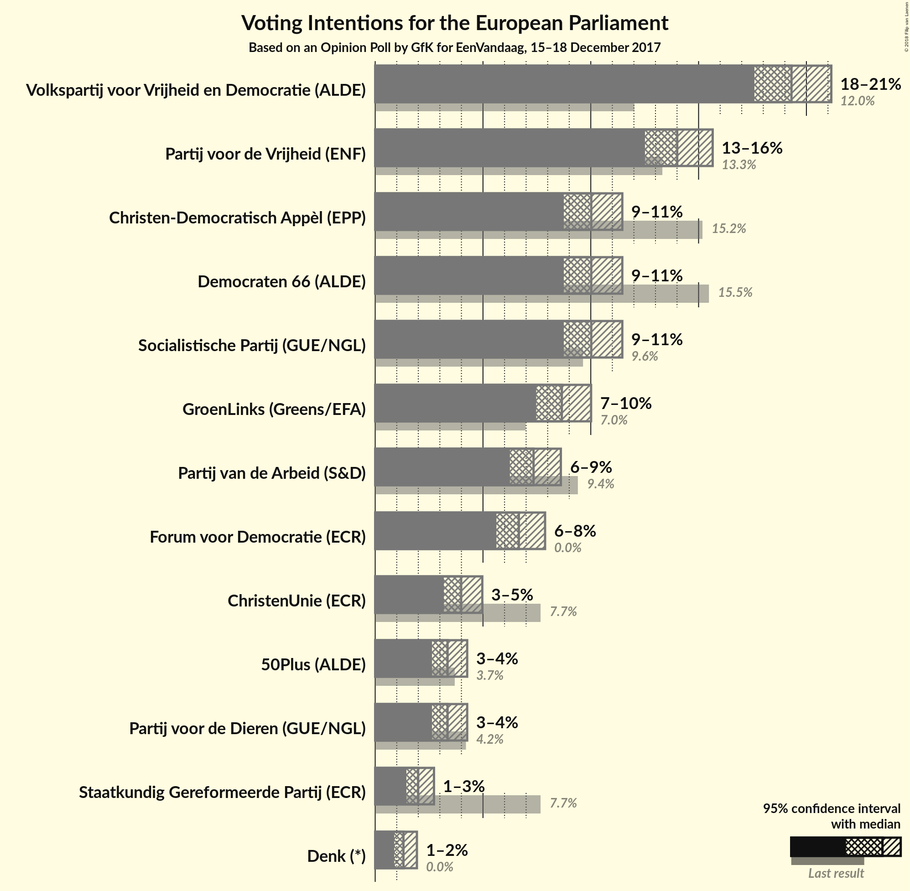

# Opinion Poll by GfK for EenVandaag, 15–18 December 2017

<a href="#voting-intentions">Voting Intentions</a> | <a href="#seats">Seats</a> | <a href="#coalitions">Coalitions</a> | <a href="#technical-information">Technical Information</a>

## Voting Intentions

### Confidence Intervals

| Party | Last Result | Poll Result | 80% Confidence Interval | 90% Confidence Interval | 95% Confidence Interval | 99% Confidence Interval |
|:-----:|:-----------:|:-----------:|:-----------------------:|:-----------------------:|:-----------------------:|:-----------------------:|
| Volkspartij voor Vrijheid en Democratie (ALDE) | 12.0% | 19.3% | 18.2–20.5% |17.9–20.9% |17.6–21.2% |17.1–21.7% |
| Partij voor de Vrijheid (ENF) | 13.3% | 14.0% | 13.0–15.1% |12.8–15.4% |12.5–15.7% |12.1–16.2% |
| Christen-Democratisch Appèl (EPP) | 15.2% | 10.0% | 9.2–11.0% |8.9–11.2% |8.7–11.5% |8.4–11.9% |
| Democraten 66 (ALDE) | 15.5% | 10.0% | 9.2–11.0% |8.9–11.2% |8.7–11.5% |8.4–11.9% |
| Socialistische Partij (GUE/NGL) | 9.6% | 10.0% | 9.2–11.0% |8.9–11.2% |8.7–11.5% |8.4–11.9% |
| GroenLinks (Greens/EFA) | 7.0% | 8.7% | 7.9–9.5% |7.7–9.8% |7.5–10.0% |7.1–10.5% |
| Partij van de Arbeid (S&D) | 9.4% | 7.3% | 6.6–8.2% |6.4–8.4% |6.2–8.6% |5.9–9.0% |
| Forum voor Democratie (*) | 0.0% | 6.7% | N/A |N/A |N/A |N/A |
| ChristenUnie (ECR) | 7.7% | 4.0% | 3.5–4.6% |3.3–4.8% |3.2–5.0% |3.0–5.3% |
| Partij voor de Dieren (GUE/NGL) | 4.2% | 3.4% | 2.9–4.0% |2.7–4.1% |2.6–4.3% |2.4–4.6% |
| 50Plus (ALDE) | 3.7% | 3.4% | 2.9–4.0% |2.7–4.1% |2.6–4.3% |2.4–4.6% |
| Staatkundig Gereformeerde Partij (ECR) | 7.7% | 2.0% | 1.6–2.5% |1.5–2.6% |1.4–2.7% |1.3–3.0% |
| Denk (*) | 0.0% | 1.3% | N/A |N/A |N/A |N/A |

*Note:* The poll result column reflects the actual value used in the calculations. Published results may vary slightly, and in addition be rounded to fewer digits.

## Seats

### Confidence Intervals

| Party | Last Result | Median | 80% Confidence Interval | 90% Confidence Interval | 95% Confidence Interval | 99% Confidence Interval |
|:-----:|:-----------:|:------:|:-----------------------:|:-----------------------:|:-----------------------:|:-----------------------:|
| <a href="#volkspartij-voor-vrijheid-en-democratie-(alde)">Volkspartij voor Vrijheid en Democratie (ALDE)</a> | 3 | 7 | 6–7 |6–7 |6–7 |5–8 |
| <a href="#partij-voor-de-vrijheid-(enf)">Partij voor de Vrijheid (ENF)</a> | 4 | 4 | 4–5 |4–5 |4–5 |4–6 |
| <a href="#christen-democratisch-appèl-(epp)">Christen-Democratisch Appèl (EPP)</a> | 5 | 3 | 3–4 |3–4 |3–4 |3–4 |
| <a href="#democraten-66-(alde)">Democraten 66 (ALDE)</a> | 4 | 3 | 3–4 |3–4 |3–4 |3–4 |
| <a href="#socialistische-partij-(gue/ngl)">Socialistische Partij (GUE/NGL)</a> | 2 | 3 | 3 |3 |3 |3–4 |
| <a href="#groenlinks-(greens/efa)">GroenLinks (Greens/EFA)</a> | 2 | 3 | 2–3 |2–3 |2–3 |2–3 |
| <a href="#partij-van-de-arbeid-(s&d)">Partij van de Arbeid (S&D)</a> | 3 | 2 | 2 |2 |2 |2–3 |
| <a href="#forum-voor-democratie-(*)">Forum voor Democratie (*)</a> | 0 | N/A | N/A |N/A |N/A |N/A |
| <a href="#christenunie-(ecr)">ChristenUnie (ECR)</a> | 1 | 1 | 1 |1 |0–1 |0–1 |
| <a href="#partij-voor-de-dieren-(gue/ngl)">Partij voor de Dieren (GUE/NGL)</a> | 1 | 0 | 0–1 |0–1 |0–1 |0–1 |
| <a href="#50plus-(alde)">50Plus (ALDE)</a> | 0 | 1 | 0–1 |0–1 |0–1 |0–1 |
| <a href="#staatkundig-gereformeerde-partij-(ecr)">Staatkundig Gereformeerde Partij (ECR)</a> | 1 | 0 | 0 |0 |0 |0 |
| <a href="#denk-(*)">Denk (*)</a> | 0 | N/A | N/A |N/A |N/A |N/A |

