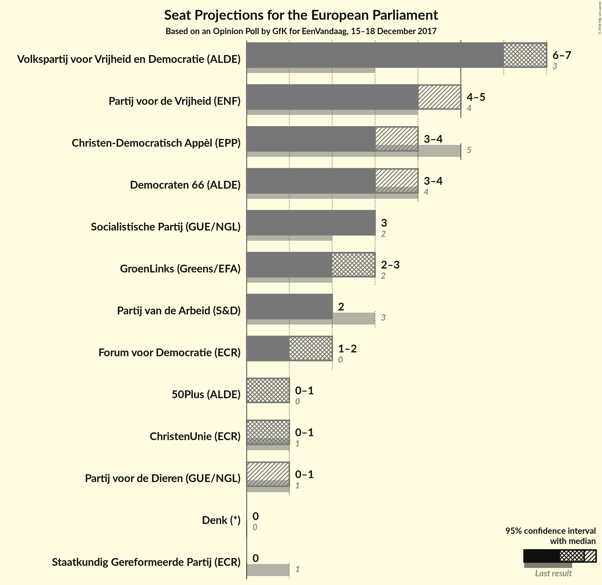
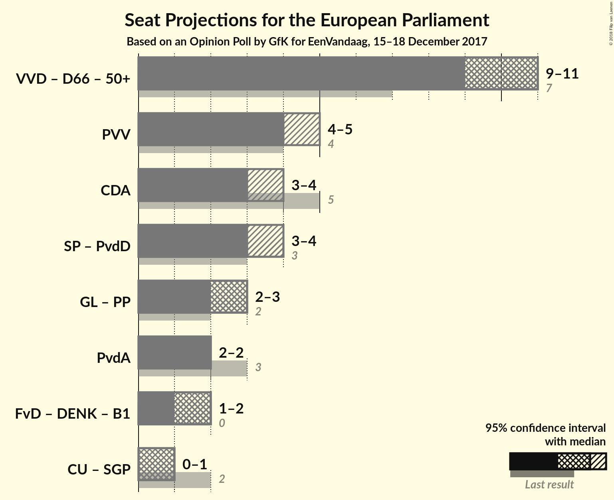

# Opinion Poll by GfK for EenVandaag, 15–18 December 2017

<a href="#voting-intentions">Voting Intentions</a> | <a href="#seats">Seats</a> | <a href="#coalitions">Coalitions</a> | <a href="#technical-information">Technical Information</a>

## Voting Intentions

### Confidence Intervals

| Party | Last Result | Poll Result | 80% Confidence Interval | 90% Confidence Interval | 95% Confidence Interval | 99% Confidence Interval |
|:-----:|:-----------:|:-----------:|:-----------------------:|:-----------------------:|:-----------------------:|:-----------------------:|
| Volkspartij voor Vrijheid en Democratie (ALDE) | 12.0% | 19.3% | N/A |N/A |N/A |N/A |
| Partij voor de Vrijheid (ENF) | 13.3% | 14.0% | N/A |N/A |N/A |N/A |
| Christen-Democratisch Appèl (EPP) | 15.2% | 10.0% | N/A |N/A |N/A |N/A |
| Democraten 66 (ALDE) | 15.5% | 10.0% | N/A |N/A |N/A |N/A |
| Socialistische Partij (GUE/NGL) | 9.6% | 10.0% | N/A |N/A |N/A |N/A |
| GroenLinks (Greens/EFA) | 7.0% | 8.7% | N/A |N/A |N/A |N/A |
| Partij van de Arbeid (S&D) | 9.4% | 7.3% | N/A |N/A |N/A |N/A |
| Forum voor Democratie (—) | 0.0% | 6.7% | N/A |N/A |N/A |N/A |
| ChristenUnie (ECR) | 7.7% | 4.0% | N/A |N/A |N/A |N/A |
| Partij voor de Dieren (GUE/NGL) | 4.2% | 3.4% | N/A |N/A |N/A |N/A |
| 50Plus (ALDE) | 3.7% | 3.4% | N/A |N/A |N/A |N/A |
| Staatkundig Gereformeerde Partij (ECR) | 7.7% | 2.0% | N/A |N/A |N/A |N/A |
| Denk (—) | 0.0% | 1.3% | N/A |N/A |N/A |N/A |

*Note:* The poll result column reflects the actual value used in the calculations. Published results may vary slightly, and in addition be rounded to fewer digits.

## Seats

### Confidence Intervals

| Party | Last Result | Median | 80% Confidence Interval | 90% Confidence Interval | 95% Confidence Interval | 99% Confidence Interval |
|:-----:|:-----------:|:------:|:-----------------------:|:-----------------------:|:-----------------------:|:-----------------------:|
| <a href="#volkspartij-voor-vrijheid-en-democratie-(alde)">Volkspartij voor Vrijheid en Democratie (ALDE)</a> | 3 | N/A | N/A |N/A |N/A |N/A |
| <a href="#partij-voor-de-vrijheid-(enf)">Partij voor de Vrijheid (ENF)</a> | 4 | N/A | N/A |N/A |N/A |N/A |
| <a href="#christen-democratisch-appèl-(epp)">Christen-Democratisch Appèl (EPP)</a> | 5 | N/A | N/A |N/A |N/A |N/A |
| <a href="#democraten-66-(alde)">Democraten 66 (ALDE)</a> | 4 | N/A | N/A |N/A |N/A |N/A |
| <a href="#socialistische-partij-(gue/ngl)">Socialistische Partij (GUE/NGL)</a> | 2 | N/A | N/A |N/A |N/A |N/A |
| <a href="#groenlinks-(greens/efa)">GroenLinks (Greens/EFA)</a> | 2 | N/A | N/A |N/A |N/A |N/A |
| <a href="#partij-van-de-arbeid-(s&d)">Partij van de Arbeid (S&D)</a> | 3 | N/A | N/A |N/A |N/A |N/A |
| <a href="#forum-voor-democratie-(—)">Forum voor Democratie (—)</a> | 0 | N/A | N/A |N/A |N/A |N/A |
| <a href="#christenunie-(ecr)">ChristenUnie (ECR)</a> | 1 | N/A | N/A |N/A |N/A |N/A |
| <a href="#partij-voor-de-dieren-(gue/ngl)">Partij voor de Dieren (GUE/NGL)</a> | 1 | N/A | N/A |N/A |N/A |N/A |
| <a href="#50plus-(alde)">50Plus (ALDE)</a> | 0 | N/A | N/A |N/A |N/A |N/A |
| <a href="#staatkundig-gereformeerde-partij-(ecr)">Staatkundig Gereformeerde Partij (ECR)</a> | 1 | N/A | N/A |N/A |N/A |N/A |
| <a href="#denk-(—)">Denk (—)</a> | 0 | N/A | N/A |N/A |N/A |N/A |

## Coalitions

## Technical Information

### Opinion Poll

+ **Polling firm:** GfK
+ **Commissioner(s):** EenVandaag
+ **Fieldwork period:** 15–18 December 2017

### Calculations

+ **Sample size:** 1906
+ **Simulations done:** 0
+ **Error estimate:** 100.00%

