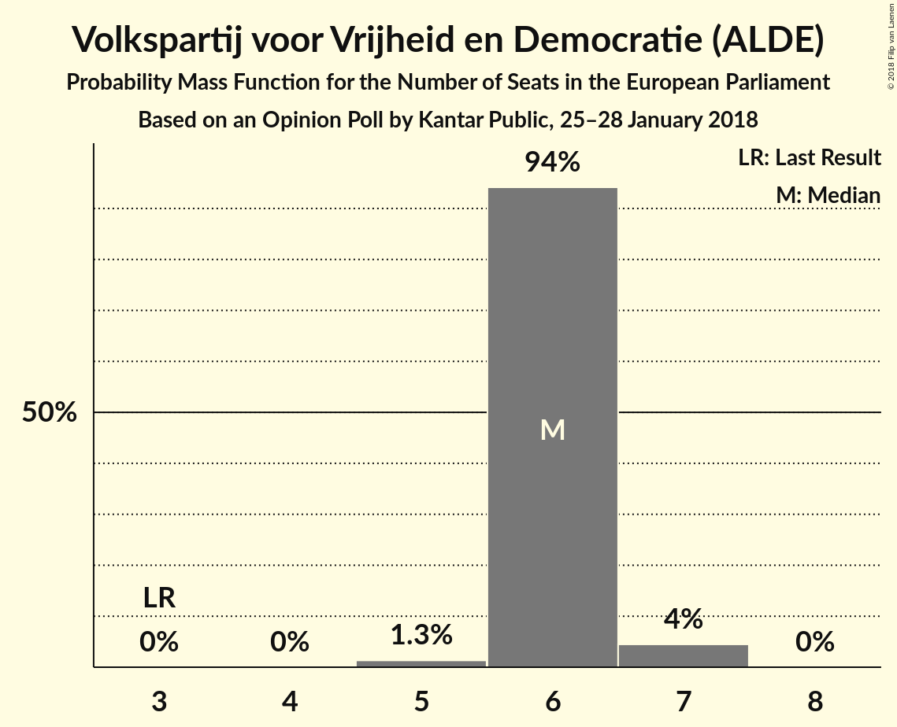
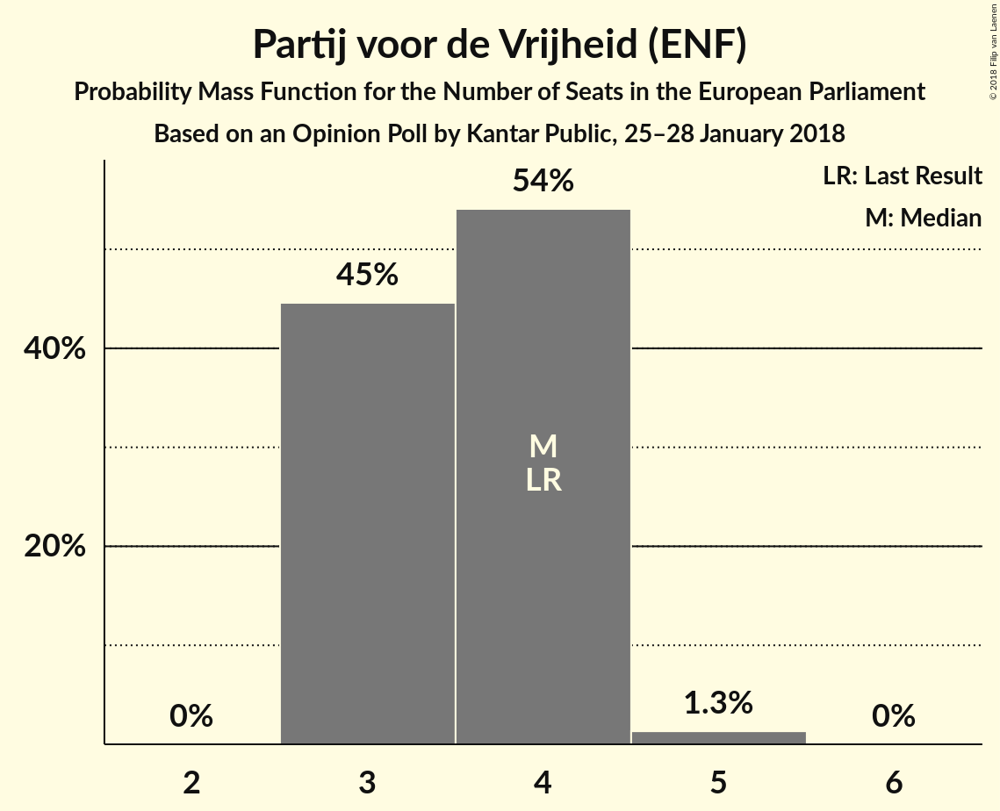
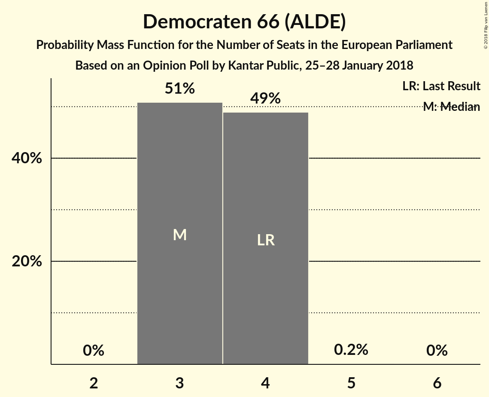
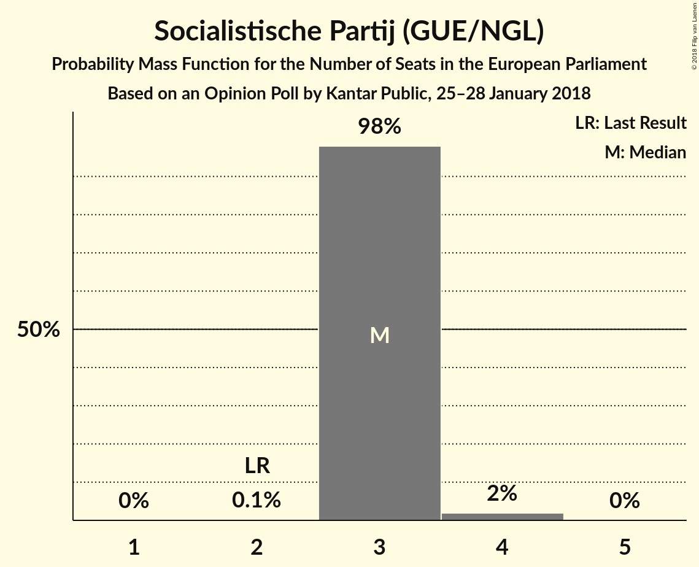
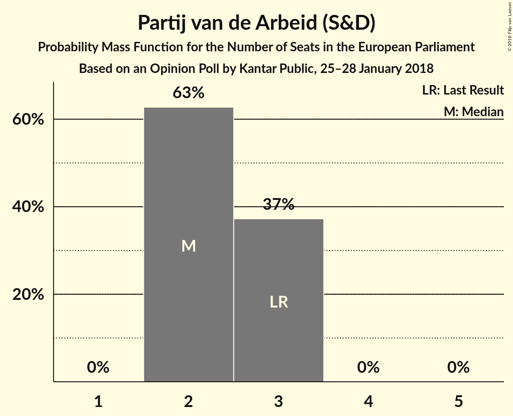
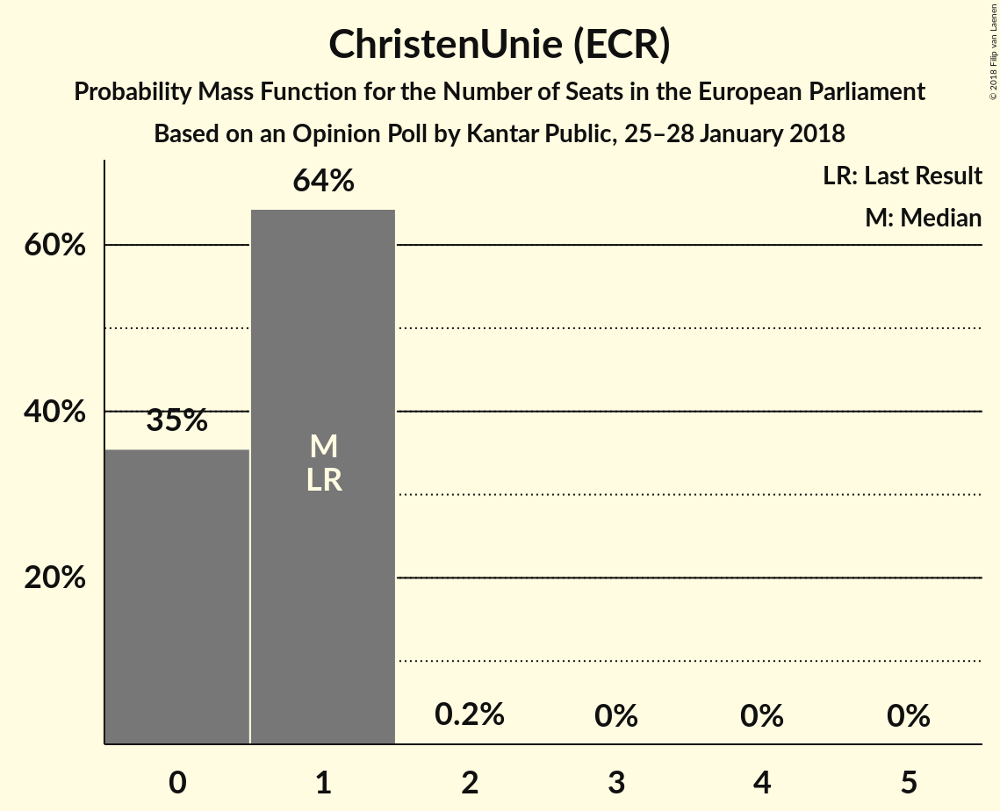
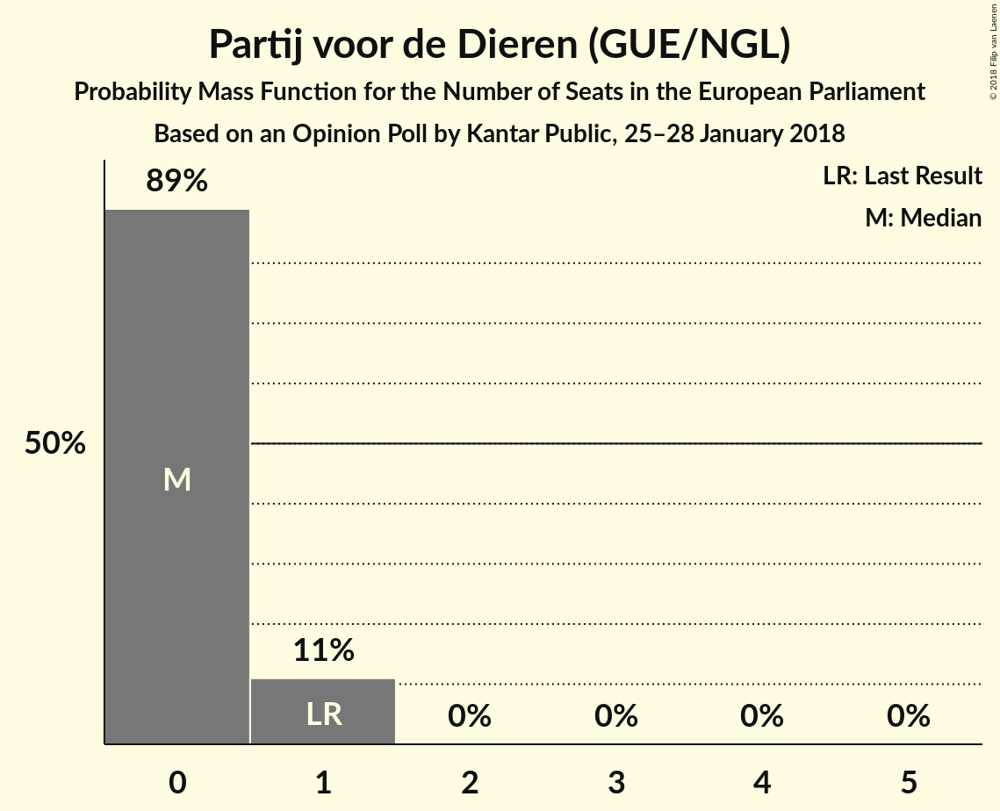
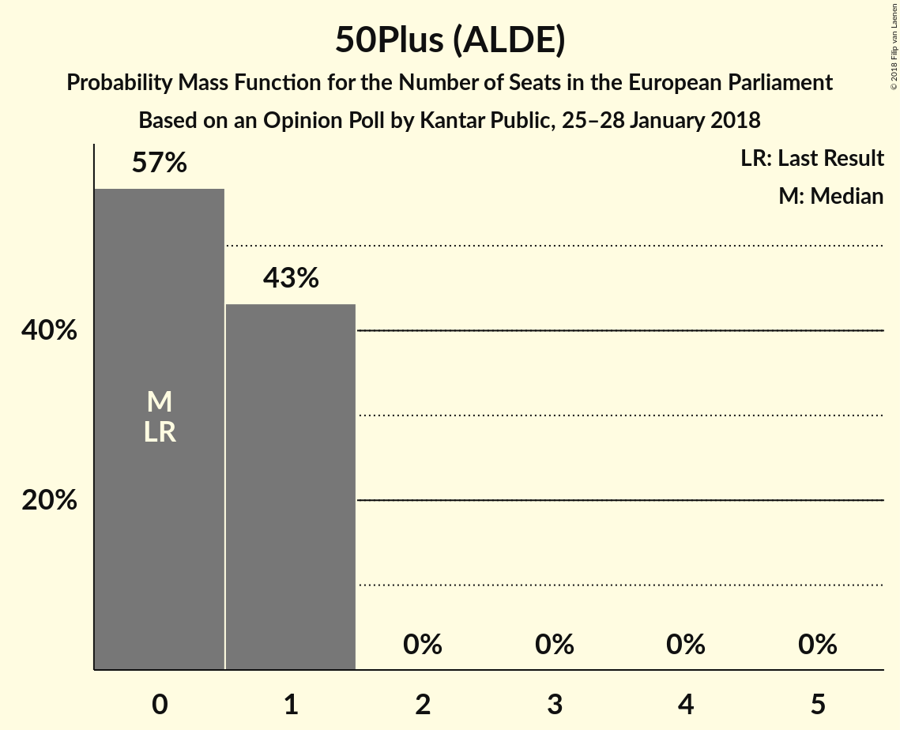
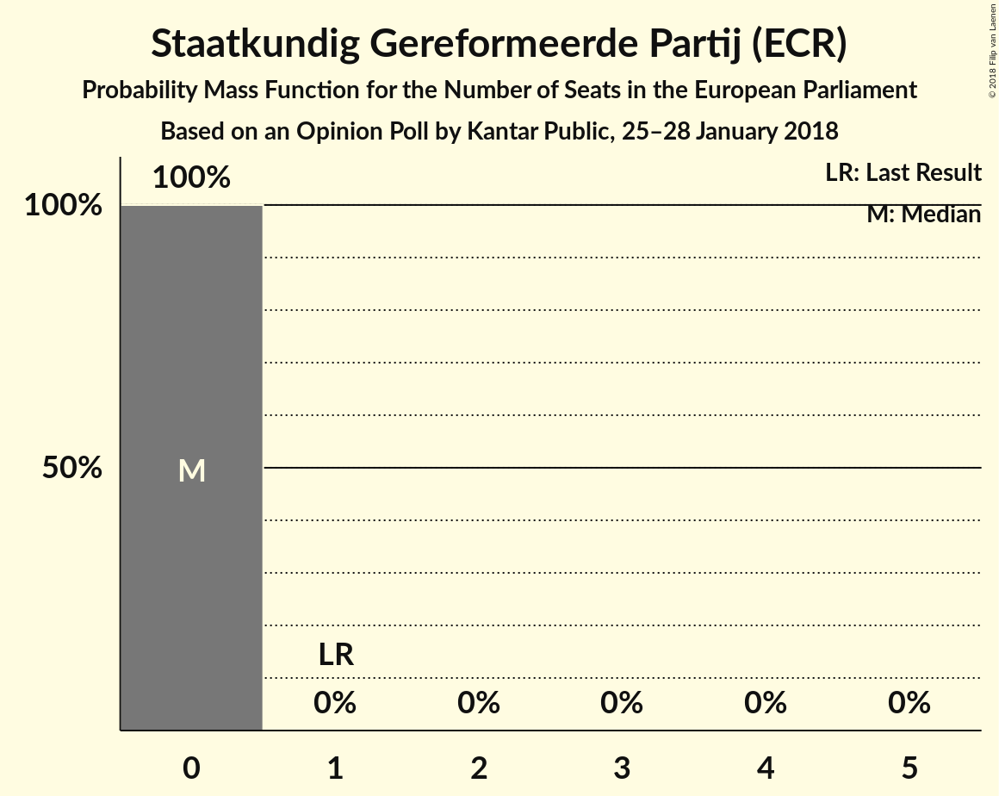
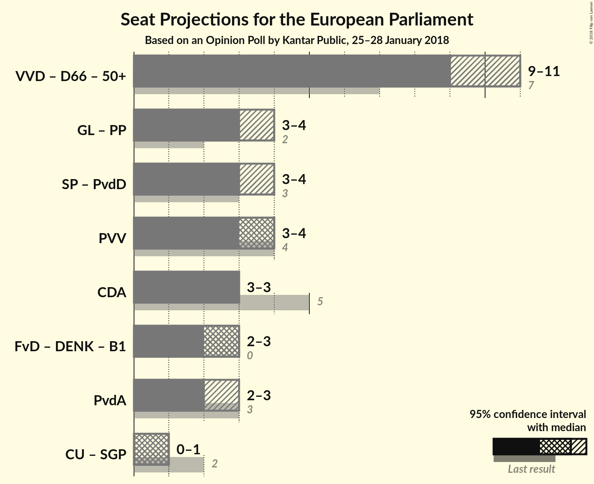

# Opinion Poll by Kantar Public, 25–28 January 2018

<a href="#voting-intentions">Voting Intentions</a> | <a href="#seats">Seats</a> | <a href="#coalitions">Coalitions</a> | <a href="#technical-information">Technical Information</a>

## Voting Intentions

### Confidence Intervals

| Party | Last Result | Poll Result | 80% Confidence Interval | 90% Confidence Interval | 95% Confidence Interval | 99% Confidence Interval |
|:-----:|:-----------:|:-----------:|:-----------------------:|:-----------------------:|:-----------------------:|:-----------------------:|
| Volkspartij voor Vrijheid en Democratie (ALDE) | 12.0% | 18.7% | 17.3–20.2% |16.9–20.7% |16.5–21.0% |15.9–21.8% |
| Partij voor de Vrijheid (ENF) | 13.3% | 12.0% | 10.9–13.3% |10.5–13.7% |10.3–14.0% |9.7–14.7% |
| Democraten 66 (ALDE) | 15.5% | 11.3% | 10.2–12.6% |9.9–13.0% |9.6–13.3% |9.1–13.9% |
| GroenLinks (Greens/EFA) | 7.0% | 10.6% | 9.6–11.9% |9.3–12.3% |9.0–12.6% |8.5–13.2% |
| Socialistische Partij (GUE/NGL) | 9.6% | 10.0% | 9.0–11.3% |8.7–11.6% |8.4–11.9% |7.9–12.5% |
| Christen-Democratisch Appèl (EPP) | 15.2% | 9.3% | 8.3–10.5% |8.0–10.9% |7.8–11.2% |7.3–11.8% |
| Forum voor Democratie (*) | 0.0% | 8.0% | 7.0–9.1% |6.8–9.4% |6.5–9.7% |6.1–10.2% |
| Partij van de Arbeid (S&D) | 9.4% | 7.4% | 6.4–8.4% |6.2–8.7% |6.0–9.0% |5.6–9.6% |
| ChristenUnie (ECR) | 7.7% | 4.0% | 3.3–4.8% |3.1–5.1% |3.0–5.3% |2.7–5.7% |
| Partij voor de Dieren (GUE/NGL) | 4.2% | 2.7% | 2.2–3.4% |2.0–3.6% |1.9–3.8% |1.7–4.2% |
| 50Plus (ALDE) | 3.7% | 2.7% | 2.2–3.4% |2.0–3.6% |1.9–3.8% |1.7–4.2% |
| Staatkundig Gereformeerde Partij (ECR) | 7.7% | 2.0% | 1.6–2.6% |1.4–2.8% |1.3–3.0% |1.1–3.3% |
| Denk (*) | 0.0% | 1.3% | 1.0–1.8% |0.9–2.0% |0.8–2.1% |0.7–2.4% |

*Note:* The poll result column reflects the actual value used in the calculations. Published results may vary slightly, and in addition be rounded to fewer digits.

## Seats

### Confidence Intervals

| Party | Last Result | Median | 80% Confidence Interval | 90% Confidence Interval | 95% Confidence Interval | 99% Confidence Interval |
|:-----:|:-----------:|:------:|:-----------------------:|:-----------------------:|:-----------------------:|:-----------------------:|
| <a href="#volkspartij-voor-vrijheid-en-democratie-(alde)">Volkspartij voor Vrijheid en Democratie (ALDE)</a> | 3 | 7 | 6–7 |6–7 |6–7 |6–7 |
| <a href="#partij-voor-de-vrijheid-(enf)">Partij voor de Vrijheid (ENF)</a> | 4 | 3 | 3–4 |3–4 |3–4 |3–4 |
| <a href="#democraten-66-(alde)">Democraten 66 (ALDE)</a> | 4 | 3 | 3–4 |3–4 |3–4 |3–4 |
| <a href="#groenlinks-(greens/efa)">GroenLinks (Greens/EFA)</a> | 2 | 4 | 3–4 |3–4 |3–4 |3–4 |
| <a href="#socialistische-partij-(gue/ngl)">Socialistische Partij (GUE/NGL)</a> | 2 | 4 | 3–4 |3–4 |3–4 |3–4 |
| <a href="#christen-democratisch-appèl-(epp)">Christen-Democratisch Appèl (EPP)</a> | 5 | 2 | 2–3 |2–3 |2–3 |2–3 |
| <a href="#forum-voor-democratie-(*)">Forum voor Democratie (*)</a> | 0 | 2 | 2 |2–3 |2–3 |2–3 |
| <a href="#partij-van-de-arbeid-(s&d)">Partij van de Arbeid (S&D)</a> | 3 | 2 | 2 |2 |2–3 |2–3 |
| <a href="#christenunie-(ecr)">ChristenUnie (ECR)</a> | 1 | 2 | 1–2 |1–2 |1–2 |0–2 |
| <a href="#partij-voor-de-dieren-(gue/ngl)">Partij voor de Dieren (GUE/NGL)</a> | 1 | 0 | 0 |0 |0–1 |0–1 |
| <a href="#50plus-(alde)">50Plus (ALDE)</a> | 0 | 0 | 0 |0–1 |0–1 |0–1 |
| <a href="#staatkundig-gereformeerde-partij-(ecr)">Staatkundig Gereformeerde Partij (ECR)</a> | 1 | 0 | 0 |0 |0 |0 |
| <a href="#denk-(*)">Denk (*)</a> | 0 | 0 | 0 |0 |0 |0 |

### Volkspartij voor Vrijheid en Democratie (ALDE)

*For a full overview of the results for this party, see the [Volkspartij voor Vrijheid en Democratie (ALDE)](party-volkspartijvoorvrijheidendemocratiealde.html) page.*

| Number of Seats | Probability | Accumulated | Special Marks |
|:---------------:|:-----------:|:-----------:|:-------------:|
| 3 | 0% | 100% | Last Result |
| 4 | 0% | 100% |  |
| 5 | 0.3% | 100% |  |
| 6 | 11% | 99.7% |  |
| 7 | 89% | 89% | Median |
| 8 | 0.1% | 0.1% |  |
| 9 | 0% | 0% |  |

### Partij voor de Vrijheid (ENF)

*For a full overview of the results for this party, see the [Partij voor de Vrijheid (ENF)](party-partijvoordevrijheidenf.html) page.*

| Number of Seats | Probability | Accumulated | Special Marks |
|:---------------:|:-----------:|:-----------:|:-------------:|
| 3 | 88% | 100% | Median |
| 4 | 12% | 12% | Last Result |
| 5 | 0.3% | 0.3% |  |
| 6 | 0% | 0% |  |

### Democraten 66 (ALDE)

*For a full overview of the results for this party, see the [Democraten 66 (ALDE)](party-democraten66alde.html) page.*

| Number of Seats | Probability | Accumulated | Special Marks |
|:---------------:|:-----------:|:-----------:|:-------------:|
| 3 | 89% | 100% | Median |
| 4 | 11% | 11% | Last Result |
| 5 | 0.1% | 0.1% |  |
| 6 | 0% | 0% |  |

### GroenLinks (Greens/EFA)

*For a full overview of the results for this party, see the [GroenLinks (Greens/EFA)](party-groenlinksgreensefa.html) page.*

| Number of Seats | Probability | Accumulated | Special Marks |
|:---------------:|:-----------:|:-----------:|:-------------:|
| 2 | 0.4% | 100% | Last Result |
| 3 | 10% | 99.6% |  |
| 4 | 89% | 90% | Median |
| 5 | 0.1% | 0.1% |  |
| 6 | 0% | 0% |  |

### Socialistische Partij (GUE/NGL)

*For a full overview of the results for this party, see the [Socialistische Partij (GUE/NGL)](party-socialistischepartijguengl.html) page.*

| Number of Seats | Probability | Accumulated | Special Marks |
|:---------------:|:-----------:|:-----------:|:-------------:|
| 2 | 0.4% | 100% | Last Result |
| 3 | 15% | 99.6% |  |
| 4 | 85% | 85% | Median |
| 5 | 0.1% | 0.1% |  |
| 6 | 0% | 0% |  |

### Christen-Democratisch Appèl (EPP)

*For a full overview of the results for this party, see the [Christen-Democratisch Appèl (EPP)](party-christen-democratischappèlepp.html) page.*

| Number of Seats | Probability | Accumulated | Special Marks |
|:---------------:|:-----------:|:-----------:|:-------------:|
| 2 | 87% | 100% | Median |
| 3 | 12% | 13% |  |
| 4 | 0.4% | 0.4% |  |
| 5 | 0% | 0% | Last Result |

### Forum voor Democratie (*)

*For a full overview of the results for this party, see the [Forum voor Democratie (*)](party-forumvoordemocratie.html) page.*

| Number of Seats | Probability | Accumulated | Special Marks |
|:---------------:|:-----------:|:-----------:|:-------------:|
| 0 | 0% | 100% | Last Result |
| 1 | 0% | 100% |  |
| 2 | 95% | 100% | Median |
| 3 | 5% | 5% |  |
| 4 | 0.1% | 0.1% |  |
| 5 | 0% | 0% |  |

### Partij van de Arbeid (S&D)

*For a full overview of the results for this party, see the [Partij van de Arbeid (S&D)](party-partijvandearbeidsd.html) page.*

| Number of Seats | Probability | Accumulated | Special Marks |
|:---------------:|:-----------:|:-----------:|:-------------:|
| 2 | 95% | 100% | Median |
| 3 | 5% | 5% | Last Result |
| 4 | 0% | 0% |  |

### ChristenUnie (ECR)

*For a full overview of the results for this party, see the [ChristenUnie (ECR)](party-christenunieecr.html) page.*

| Number of Seats | Probability | Accumulated | Special Marks |
|:---------------:|:-----------:|:-----------:|:-------------:|
| 0 | 0.7% | 100% |  |
| 1 | 19% | 99.3% | Last Result |
| 2 | 81% | 81% | Median |
| 3 | 0% | 0% |  |

### Partij voor de Dieren (GUE/NGL)

*For a full overview of the results for this party, see the [Partij voor de Dieren (GUE/NGL)](party-partijvoordedierenguengl.html) page.*

| Number of Seats | Probability | Accumulated | Special Marks |
|:---------------:|:-----------:|:-----------:|:-------------:|
| 0 | 96% | 100% | Median |
| 1 | 4% | 4% | Last Result |
| 2 | 0% | 0% |  |

### 50Plus (ALDE)

*For a full overview of the results for this party, see the [50Plus (ALDE)](party-50plusalde.html) page.*

| Number of Seats | Probability | Accumulated | Special Marks |
|:---------------:|:-----------:|:-----------:|:-------------:|
| 0 | 93% | 100% | Last Result, Median |
| 1 | 7% | 7% |  |
| 2 | 0% | 0% |  |

### Staatkundig Gereformeerde Partij (ECR)

*For a full overview of the results for this party, see the [Staatkundig Gereformeerde Partij (ECR)](party-staatkundiggereformeerdepartijecr.html) page.*

| Number of Seats | Probability | Accumulated | Special Marks |
|:---------------:|:-----------:|:-----------:|:-------------:|
| 0 | 100% | 100% | Median |
| 1 | 0% | 0% | Last Result |

### Denk (*)

*For a full overview of the results for this party, see the [Denk (*)](party-denk.html) page.*

| Number of Seats | Probability | Accumulated | Special Marks |
|:---------------:|:-----------:|:-----------:|:-------------:|
| 0 | 100% | 100% | Last Result, Median |

## Coalitions

### Confidence Intervals

| Coalition | Last Result | Median | Majority? | 80% Confidence Interval | 90% Confidence Interval | 95% Confidence Interval | 99% Confidence Interval |
|:---------:|:-----------:|:------:|:---------:|:-----------------------:|:-----------------------:|:-----------------------:|:-----------------------:|
| Volkspartij voor Vrijheid en Democratie (ALDE) – Democraten 66 (ALDE) – 50Plus (ALDE) | 7 | 10 | 0% | 10–11 | 9–11 | 9–11 | 9–12 |
| Socialistische Partij (GUE/NGL) – Partij voor de Dieren (GUE/NGL) | 3 | 4 | 0% | 3–4 | 3–4 | 3–5 | 3–5 |
| Partij voor de Vrijheid (ENF) | 4 | 3 | 0% | 3–4 | 3–4 | 3–4 | 3–4 |
| Christen-Democratisch Appèl (EPP) | 5 | 2 | 0% | 2–3 | 2–3 | 2–3 | 2–3 |
| Partij van de Arbeid (S&D) | 3 | 2 | 0% | 2 | 2 | 2–3 | 2–3 |
| ChristenUnie (ECR) – Staatkundig Gereformeerde Partij (ECR) | 2 | 2 | 0% | 1–2 | 1–2 | 1–2 | 0–2 |

### Volkspartij voor Vrijheid en Democratie (ALDE) – Democraten 66 (ALDE) – 50Plus (ALDE)

| Number of Seats | Probability | Accumulated | Special Marks |
|:---------------:|:-----------:|:-----------:|:-------------:|
| 7 | 0% | 100% | Last Result |
| 8 | 0.3% | 100% |  |
| 9 | 5% | 99.7% |  |
| 10 | 85% | 95% | Median |
| 11 | 9% | 10% |  |
| 12 | 1.4% | 1.5% |  |
| 13 | 0% | 0% |  |

### Socialistische Partij (GUE/NGL) – Partij voor de Dieren (GUE/NGL)

| Number of Seats | Probability | Accumulated | Special Marks |
|:---------------:|:-----------:|:-----------:|:-------------:|
| 2 | 0.3% | 100% |  |
| 3 | 15% | 99.7% | Last Result |
| 4 | 81% | 85% | Median |
| 5 | 4% | 4% |  |
| 6 | 0.1% | 0.1% |  |
| 7 | 0% | 0% |  |

### Partij voor de Vrijheid (ENF)

| Number of Seats | Probability | Accumulated | Special Marks |
|:---------------:|:-----------:|:-----------:|:-------------:|
| 3 | 88% | 100% | Median |
| 4 | 12% | 12% | Last Result |
| 5 | 0.3% | 0.3% |  |
| 6 | 0% | 0% |  |

### Christen-Democratisch Appèl (EPP)

| Number of Seats | Probability | Accumulated | Special Marks |
|:---------------:|:-----------:|:-----------:|:-------------:|
| 2 | 87% | 100% | Median |
| 3 | 12% | 13% |  |
| 4 | 0.4% | 0.4% |  |
| 5 | 0% | 0% | Last Result |

### Partij van de Arbeid (S&D)

| Number of Seats | Probability | Accumulated | Special Marks |
|:---------------:|:-----------:|:-----------:|:-------------:|
| 2 | 95% | 100% | Median |
| 3 | 5% | 5% | Last Result |
| 4 | 0% | 0% |  |

### ChristenUnie (ECR) – Staatkundig Gereformeerde Partij (ECR)

| Number of Seats | Probability | Accumulated | Special Marks |
|:---------------:|:-----------:|:-----------:|:-------------:|
| 0 | 0.7% | 100% |  |
| 1 | 19% | 99.3% |  |
| 2 | 81% | 81% | Last Result, Median |
| 3 | 0% | 0% |  |

## Technical Information

### Opinion Poll

+ **Polling firm:** Kantar Public
+ **Commissioner(s):** —
+ **Fieldwork period:** 25–28 January 2018

### Calculations

+ **Sample size:** 1156
+ **Simulations done:** 16,384
+ **Error estimate:** 2.32%

