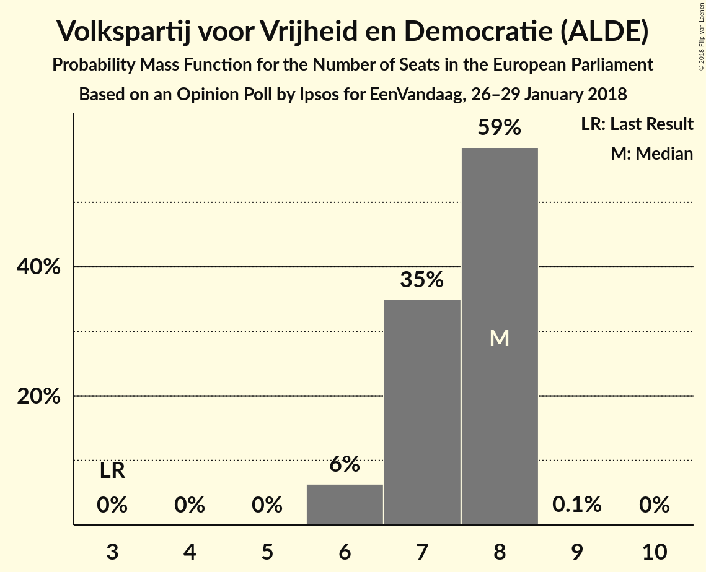
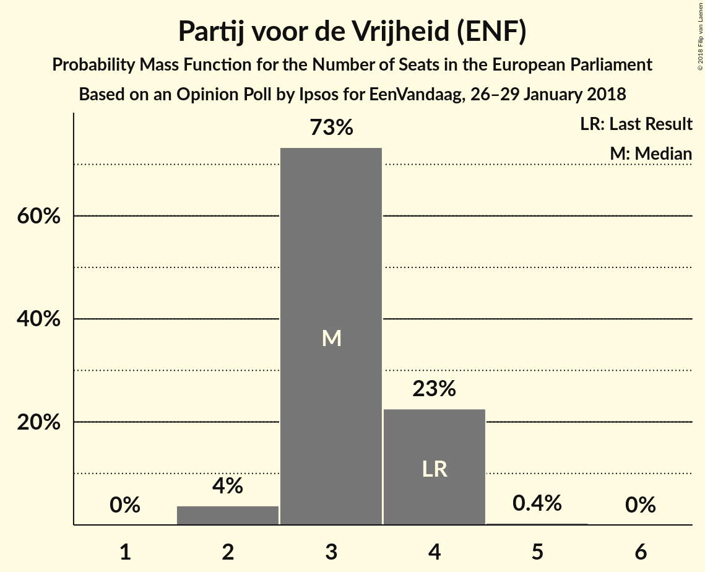
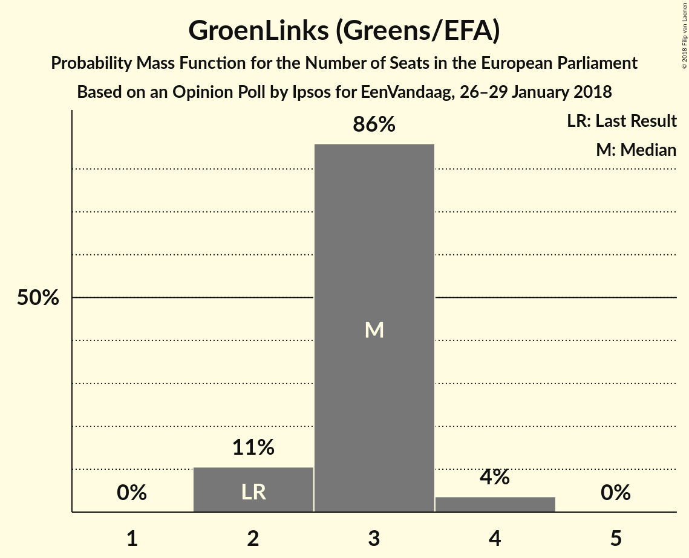
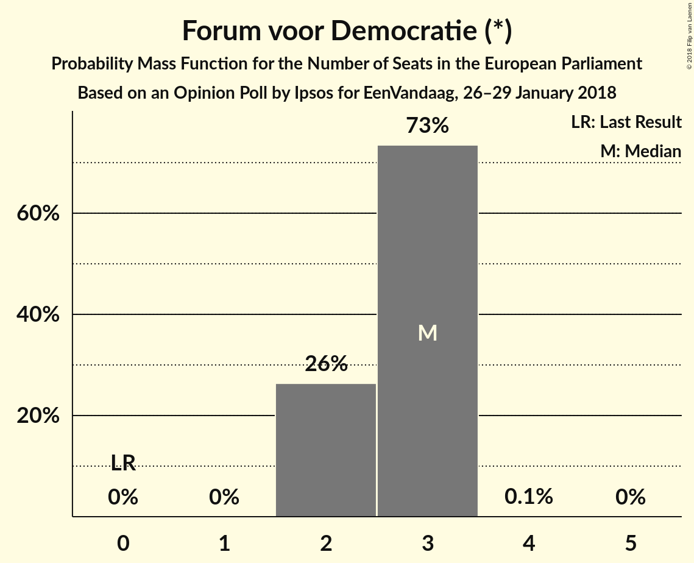
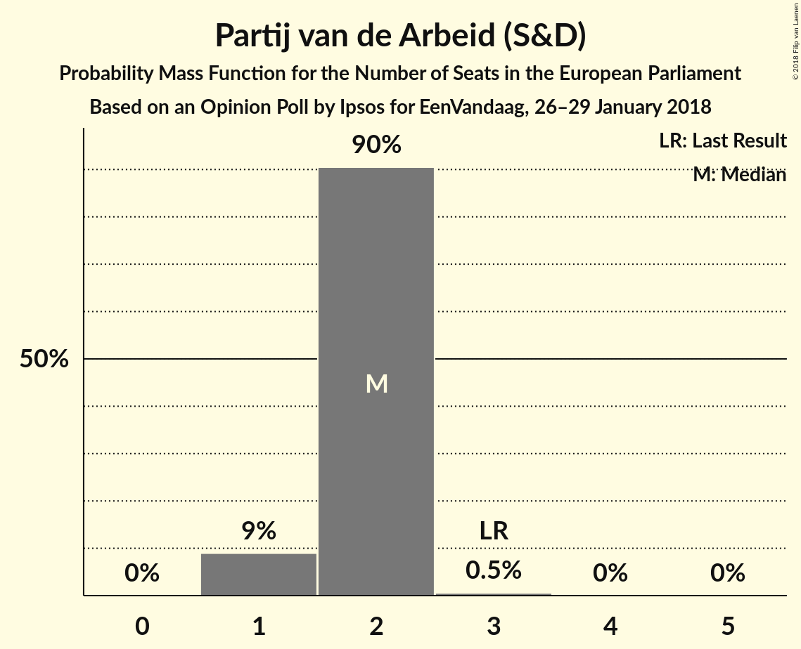
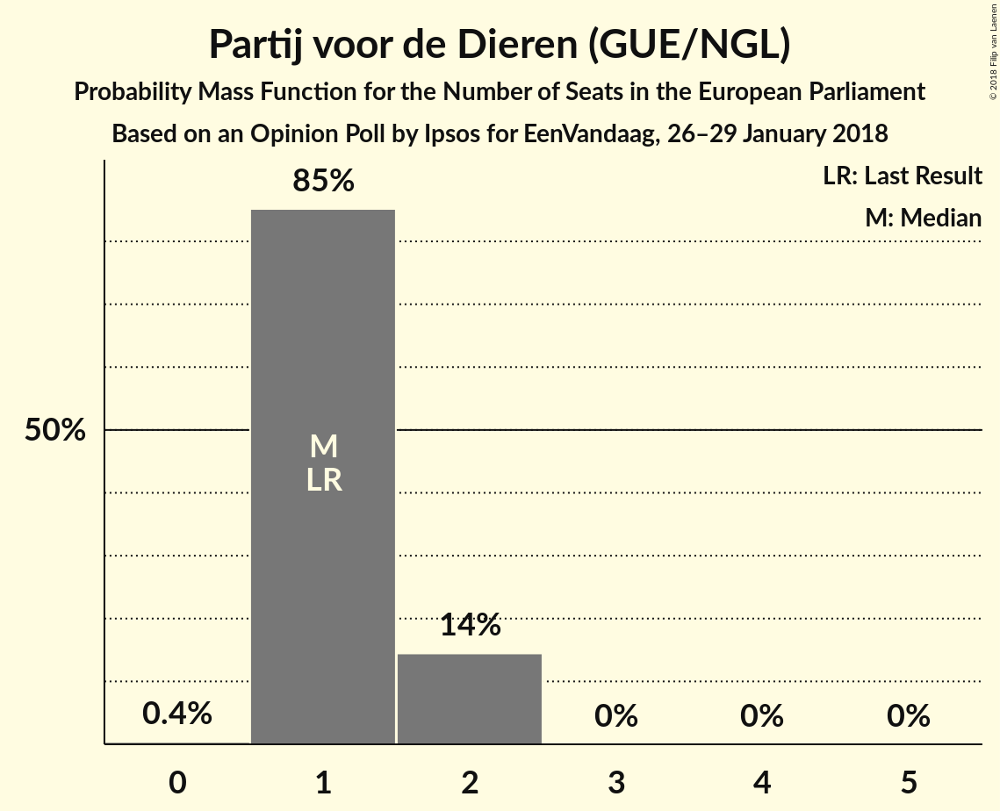
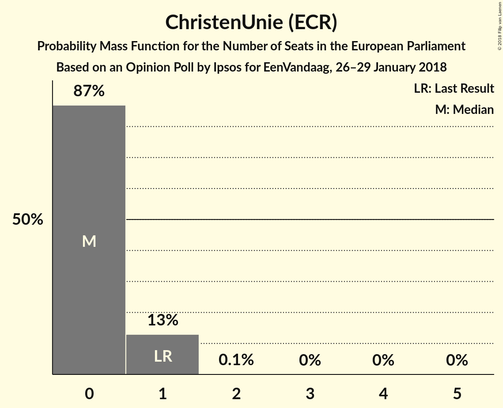
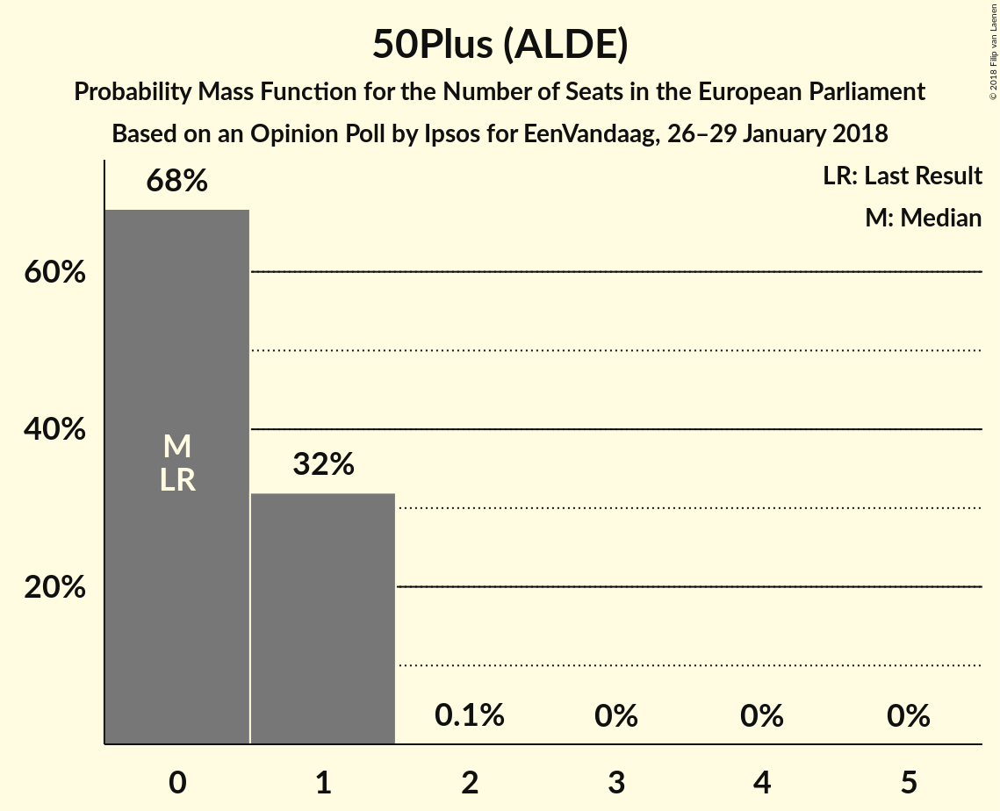
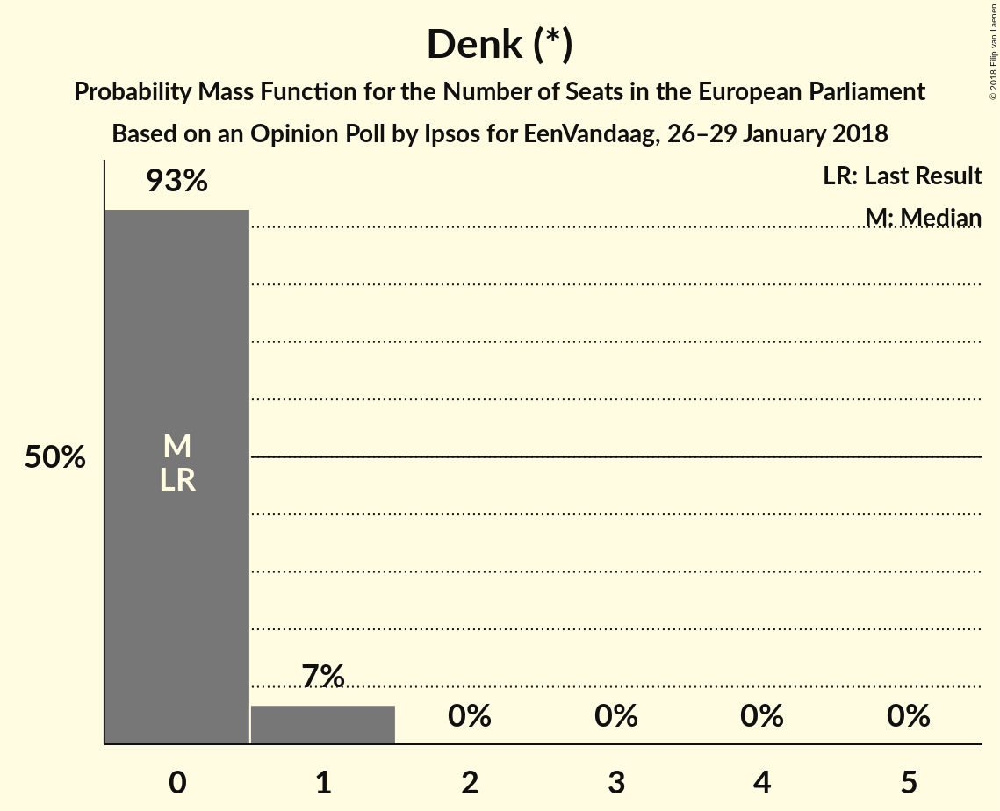
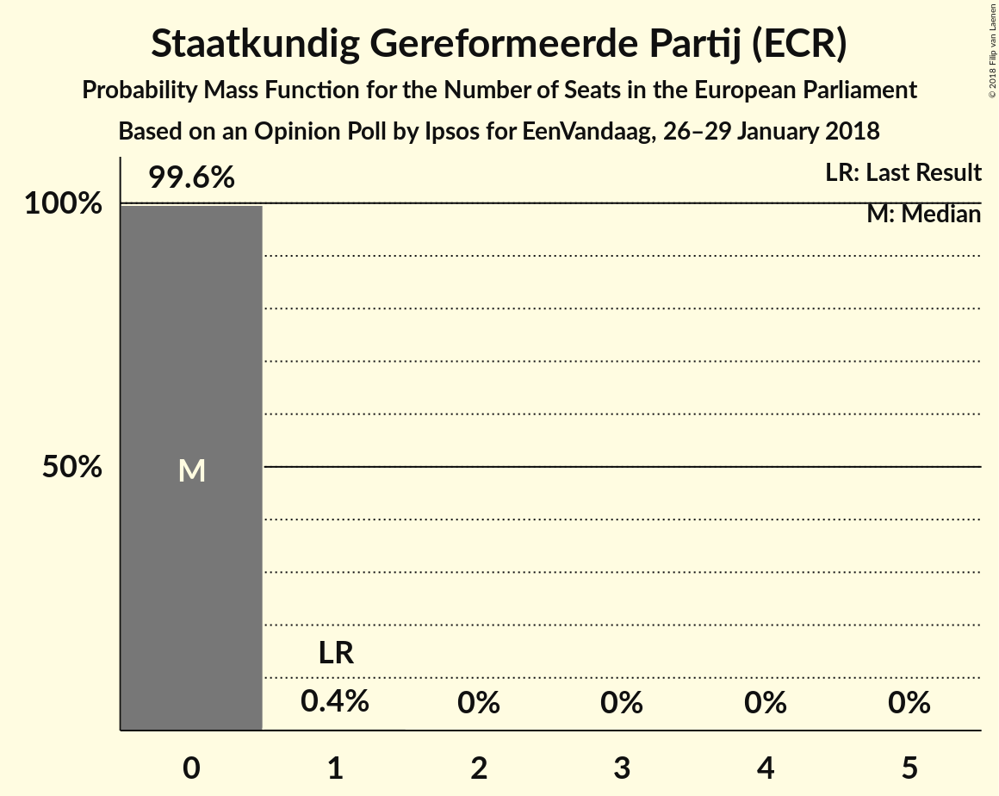

# Opinion Poll by Ipsos for EenVandaag, 26–29 January 2018

<a href="#voting-intentions">Voting Intentions</a> | <a href="#seats">Seats</a> | <a href="#coalitions">Coalitions</a> | <a href="#technical-information">Technical Information</a>

## Voting Intentions

### Confidence Intervals

| Party | Last Result | Poll Result | 80% Confidence Interval | 90% Confidence Interval | 95% Confidence Interval | 99% Confidence Interval |
|:-----:|:-----------:|:-----------:|:-----------------------:|:-----------------------:|:-----------------------:|:-----------------------:|
| Volkspartij voor Vrijheid en Democratie (ALDE) | 12.0% | 20.7% | 19.1–22.3% |18.7–22.8% |18.3–23.2% |17.6–24.1% |
| Partij voor de Vrijheid (ENF) | 13.3% | 10.7% | 9.5–12.0% |9.2–12.4% |8.9–12.7% |8.4–13.4% |
| Democraten 66 (ALDE) | 15.5% | 10.7% | 9.5–12.0% |9.2–12.4% |8.9–12.7% |8.4–13.4% |
| Christen-Democratisch Appèl (EPP) | 15.2% | 10.0% | 8.9–11.3% |8.6–11.6% |8.3–12.0% |7.8–12.6% |
| GroenLinks (Greens/EFA) | 7.0% | 9.3% | 8.2–10.6% |8.0–10.9% |7.7–11.2% |7.2–11.9% |
| Socialistische Partij (GUE/NGL) | 9.6% | 8.6% | 7.6–9.9% |7.3–10.2% |7.1–10.5% |6.6–11.1% |
| Forum voor Democratie (*) | 0.0% | 8.0% | 7.0–9.2% |6.7–9.5% |6.5–9.8% |6.0–10.4% |
| Partij van de Arbeid (S&D) | 9.4% | 6.0% | 5.1–7.0% |4.9–7.3% |4.7–7.6% |4.3–8.1% |
| Partij voor de Dieren (GUE/NGL) | 4.2% | 4.7% | 4.0–5.7% |3.7–5.9% |3.6–6.2% |3.2–6.7% |
| ChristenUnie (ECR) | 7.7% | 3.4% | 2.7–4.2% |2.6–4.4% |2.4–4.6% |2.2–5.1% |
| 50Plus (ALDE) | 3.7% | 3.4% | 2.7–4.2% |2.6–4.4% |2.4–4.6% |2.2–5.1% |
| Denk (*) | 0.0% | 2.7% | 2.1–3.5% |2.0–3.7% |1.9–3.9% |1.6–4.3% |
| Staatkundig Gereformeerde Partij (ECR) | 7.7% | 2.0% | 1.6–2.7% |1.4–2.9% |1.3–3.1% |1.1–3.4% |

*Note:* The poll result column reflects the actual value used in the calculations. Published results may vary slightly, and in addition be rounded to fewer digits.

## Seats

### Confidence Intervals

| Party | Last Result | Median | 80% Confidence Interval | 90% Confidence Interval | 95% Confidence Interval | 99% Confidence Interval |
|:-----:|:-----------:|:------:|:-----------------------:|:-----------------------:|:-----------------------:|:-----------------------:|
| <a href="#volkspartij-voor-vrijheid-en-democratie-(alde)">Volkspartij voor Vrijheid en Democratie (ALDE)</a> | 3 | 8 | 7–8 |6–8 |6–8 |6–8 |
| <a href="#partij-voor-de-vrijheid-(enf)">Partij voor de Vrijheid (ENF)</a> | 4 | 3 | 3–4 |3–4 |2–4 |2–4 |
| <a href="#democraten-66-(alde)">Democraten 66 (ALDE)</a> | 4 | 3 | 3–4 |3–4 |3–4 |3–4 |
| <a href="#christen-democratisch-appèl-(epp)">Christen-Democratisch Appèl (EPP)</a> | 5 | 3 | 3–4 |3–4 |2–4 |2–4 |
| <a href="#groenlinks-(greens/efa)">GroenLinks (Greens/EFA)</a> | 2 | 3 | 2–3 |2–3 |2–4 |2–4 |
| <a href="#socialistische-partij-(gue/ngl)">Socialistische Partij (GUE/NGL)</a> | 2 | 3 | 2–3 |2–3 |2–3 |2–4 |
| <a href="#forum-voor-democratie-(*)">Forum voor Democratie (*)</a> | 0 | 3 | 2–3 |2–3 |2–3 |2–3 |
| <a href="#partij-van-de-arbeid-(s&d)">Partij van de Arbeid (S&D)</a> | 3 | 2 | 2 |1–2 |1–2 |1–3 |
| <a href="#partij-voor-de-dieren-(gue/ngl)">Partij voor de Dieren (GUE/NGL)</a> | 1 | 1 | 1–2 |1–2 |1–2 |1–2 |
| <a href="#christenunie-(ecr)">ChristenUnie (ECR)</a> | 1 | 0 | 0–1 |0–1 |0–1 |0–1 |
| <a href="#50plus-(alde)">50Plus (ALDE)</a> | 0 | 0 | 0–1 |0–1 |0–1 |0–1 |
| <a href="#denk-(*)">Denk (*)</a> | 0 | 0 | 0 |0–1 |0–1 |0–1 |
| <a href="#staatkundig-gereformeerde-partij-(ecr)">Staatkundig Gereformeerde Partij (ECR)</a> | 1 | 0 | 0 |0 |0 |0 |

### Volkspartij voor Vrijheid en Democratie (ALDE)

*For a full overview of the results for this party, see the [Volkspartij voor Vrijheid en Democratie (ALDE)](party-volkspartijvoorvrijheidendemocratiealde.html) page.*

| Number of Seats | Probability | Accumulated | Special Marks |
|:---------------:|:-----------:|:-----------:|:-------------:|
| 3 | 0% | 100% | Last Result |
| 4 | 0% | 100% |  |
| 5 | 0% | 100% |  |
| 6 | 6% | 100% |  |
| 7 | 35% | 94% |  |
| 8 | 59% | 59% | Median |
| 9 | 0.1% | 0.1% |  |
| 10 | 0% | 0% |  |

### Partij voor de Vrijheid (ENF)

*For a full overview of the results for this party, see the [Partij voor de Vrijheid (ENF)](party-partijvoordevrijheidenf.html) page.*

| Number of Seats | Probability | Accumulated | Special Marks |
|:---------------:|:-----------:|:-----------:|:-------------:|
| 2 | 4% | 100% |  |
| 3 | 73% | 96% | Median |
| 4 | 23% | 23% | Last Result |
| 5 | 0.4% | 0.4% |  |
| 6 | 0% | 0% |  |

### Democraten 66 (ALDE)

*For a full overview of the results for this party, see the [Democraten 66 (ALDE)](party-democraten66alde.html) page.*

| Number of Seats | Probability | Accumulated | Special Marks |
|:---------------:|:-----------:|:-----------:|:-------------:|
| 2 | 0.1% | 100% |  |
| 3 | 86% | 99.9% | Median |
| 4 | 14% | 14% | Last Result |
| 5 | 0.1% | 0.1% |  |
| 6 | 0% | 0% |  |

### Christen-Democratisch Appèl (EPP)

*For a full overview of the results for this party, see the [Christen-Democratisch Appèl (EPP)](party-christen-democratischappèlepp.html) page.*

| Number of Seats | Probability | Accumulated | Special Marks |
|:---------------:|:-----------:|:-----------:|:-------------:|
| 2 | 3% | 100% |  |
| 3 | 85% | 97% | Median |
| 4 | 12% | 12% |  |
| 5 | 0% | 0% | Last Result |

### GroenLinks (Greens/EFA)

*For a full overview of the results for this party, see the [GroenLinks (Greens/EFA)](party-groenlinksgreensefa.html) page.*

| Number of Seats | Probability | Accumulated | Special Marks |
|:---------------:|:-----------:|:-----------:|:-------------:|
| 2 | 11% | 100% | Last Result |
| 3 | 86% | 89% | Median |
| 4 | 4% | 4% |  |
| 5 | 0% | 0% |  |

### Socialistische Partij (GUE/NGL)

*For a full overview of the results for this party, see the [Socialistische Partij (GUE/NGL)](party-socialistischepartijguengl.html) page.*

| Number of Seats | Probability | Accumulated | Special Marks |
|:---------------:|:-----------:|:-----------:|:-------------:|
| 2 | 21% | 100% | Last Result |
| 3 | 78% | 79% | Median |
| 4 | 1.2% | 1.2% |  |
| 5 | 0% | 0% |  |

### Forum voor Democratie (*)

*For a full overview of the results for this party, see the [Forum voor Democratie (*)](party-forumvoordemocratie.html) page.*

| Number of Seats | Probability | Accumulated | Special Marks |
|:---------------:|:-----------:|:-----------:|:-------------:|
| 0 | 0% | 100% | Last Result |
| 1 | 0% | 100% |  |
| 2 | 26% | 100% |  |
| 3 | 73% | 74% | Median |
| 4 | 0.1% | 0.1% |  |
| 5 | 0% | 0% |  |

### Partij van de Arbeid (S&D)

*For a full overview of the results for this party, see the [Partij van de Arbeid (S&D)](party-partijvandearbeidsd.html) page.*

| Number of Seats | Probability | Accumulated | Special Marks |
|:---------------:|:-----------:|:-----------:|:-------------:|
| 1 | 9% | 100% |  |
| 2 | 90% | 91% | Median |
| 3 | 0.5% | 0.5% | Last Result |
| 4 | 0% | 0% |  |

### Partij voor de Dieren (GUE/NGL)

*For a full overview of the results for this party, see the [Partij voor de Dieren (GUE/NGL)](party-partijvoordedierenguengl.html) page.*

| Number of Seats | Probability | Accumulated | Special Marks |
|:---------------:|:-----------:|:-----------:|:-------------:|
| 0 | 0.4% | 100% |  |
| 1 | 85% | 99.6% | Last Result, Median |
| 2 | 14% | 14% |  |
| 3 | 0% | 0% |  |

### ChristenUnie (ECR)

*For a full overview of the results for this party, see the [ChristenUnie (ECR)](party-christenunieecr.html) page.*

| Number of Seats | Probability | Accumulated | Special Marks |
|:---------------:|:-----------:|:-----------:|:-------------:|
| 0 | 87% | 100% | Median |
| 1 | 13% | 13% | Last Result |
| 2 | 0.1% | 0.1% |  |
| 3 | 0% | 0% |  |

### 50Plus (ALDE)

*For a full overview of the results for this party, see the [50Plus (ALDE)](party-50plusalde.html) page.*

| Number of Seats | Probability | Accumulated | Special Marks |
|:---------------:|:-----------:|:-----------:|:-------------:|
| 0 | 68% | 100% | Last Result, Median |
| 1 | 32% | 32% |  |
| 2 | 0.1% | 0.1% |  |
| 3 | 0% | 0% |  |

### Denk (*)

*For a full overview of the results for this party, see the [Denk (*)](party-denk.html) page.*

| Number of Seats | Probability | Accumulated | Special Marks |
|:---------------:|:-----------:|:-----------:|:-------------:|
| 0 | 93% | 100% | Last Result, Median |
| 1 | 7% | 7% |  |
| 2 | 0% | 0% |  |

### Staatkundig Gereformeerde Partij (ECR)

*For a full overview of the results for this party, see the [Staatkundig Gereformeerde Partij (ECR)](party-staatkundiggereformeerdepartijecr.html) page.*

| Number of Seats | Probability | Accumulated | Special Marks |
|:---------------:|:-----------:|:-----------:|:-------------:|
| 0 | 99.6% | 100% | Median |
| 1 | 0.4% | 0.4% | Last Result |
| 2 | 0% | 0% |  |

## Coalitions

### Confidence Intervals

| Coalition | Last Result | Median | Majority? | 80% Confidence Interval | 90% Confidence Interval | 95% Confidence Interval | 99% Confidence Interval |
|:---------:|:-----------:|:------:|:---------:|:-----------------------:|:-----------------------:|:-----------------------:|:-----------------------:|
| Volkspartij voor Vrijheid en Democratie (ALDE) – Democraten 66 (ALDE) – 50Plus (ALDE) | 7 | 11 | 0% | 10–11 | 10–12 | 10–12 | 9–13 |
| Socialistische Partij (GUE/NGL) – Partij voor de Dieren (GUE/NGL) | 3 | 4 | 0% | 3–4 | 3–5 | 3–5 | 3–5 |
| Christen-Democratisch Appèl (EPP) | 5 | 3 | 0% | 3–4 | 3–4 | 2–4 | 2–4 |
| Partij voor de Vrijheid (ENF) | 4 | 3 | 0% | 3–4 | 3–4 | 2–4 | 2–4 |
| Partij van de Arbeid (S&D) | 3 | 2 | 0% | 2 | 1–2 | 1–2 | 1–3 |
| ChristenUnie (ECR) – Staatkundig Gereformeerde Partij (ECR) | 2 | 0 | 0% | 0–1 | 0–1 | 0–1 | 0–1 |

### Volkspartij voor Vrijheid en Democratie (ALDE) – Democraten 66 (ALDE) – 50Plus (ALDE)

| Number of Seats | Probability | Accumulated | Special Marks |
|:---------------:|:-----------:|:-----------:|:-------------:|
| 7 | 0% | 100% | Last Result |
| 8 | 0% | 100% |  |
| 9 | 1.3% | 100% |  |
| 10 | 9% | 98.7% |  |
| 11 | 80% | 90% | Median |
| 12 | 9% | 9% |  |
| 13 | 0.7% | 0.7% |  |
| 14 | 0% | 0% |  |

### Socialistische Partij (GUE/NGL) – Partij voor de Dieren (GUE/NGL)

| Number of Seats | Probability | Accumulated | Special Marks |
|:---------------:|:-----------:|:-----------:|:-------------:|
| 3 | 16% | 100% | Last Result |
| 4 | 75% | 84% | Median |
| 5 | 10% | 10% |  |
| 6 | 0% | 0% |  |

### Christen-Democratisch Appèl (EPP)

| Number of Seats | Probability | Accumulated | Special Marks |
|:---------------:|:-----------:|:-----------:|:-------------:|
| 2 | 3% | 100% |  |
| 3 | 85% | 97% | Median |
| 4 | 12% | 12% |  |
| 5 | 0% | 0% | Last Result |

### Partij voor de Vrijheid (ENF)

| Number of Seats | Probability | Accumulated | Special Marks |
|:---------------:|:-----------:|:-----------:|:-------------:|
| 2 | 4% | 100% |  |
| 3 | 73% | 96% | Median |
| 4 | 23% | 23% | Last Result |
| 5 | 0.4% | 0.4% |  |
| 6 | 0% | 0% |  |

### Partij van de Arbeid (S&D)

| Number of Seats | Probability | Accumulated | Special Marks |
|:---------------:|:-----------:|:-----------:|:-------------:|
| 1 | 9% | 100% |  |
| 2 | 90% | 91% | Median |
| 3 | 0.5% | 0.5% | Last Result |
| 4 | 0% | 0% |  |

### ChristenUnie (ECR) – Staatkundig Gereformeerde Partij (ECR)

| Number of Seats | Probability | Accumulated | Special Marks |
|:---------------:|:-----------:|:-----------:|:-------------:|
| 0 | 87% | 100% | Median |
| 1 | 13% | 13% |  |
| 2 | 0.3% | 0.3% | Last Result |
| 3 | 0% | 0% |  |

## Technical Information

### Opinion Poll

+ **Polling firm:** Ipsos
+ **Commissioner(s):** EenVandaag
+ **Fieldwork period:** 26–29 January 2018

### Calculations

+ **Sample size:** 1041
+ **Simulations done:** 1,048,576
+ **Error estimate:** 2.06%

