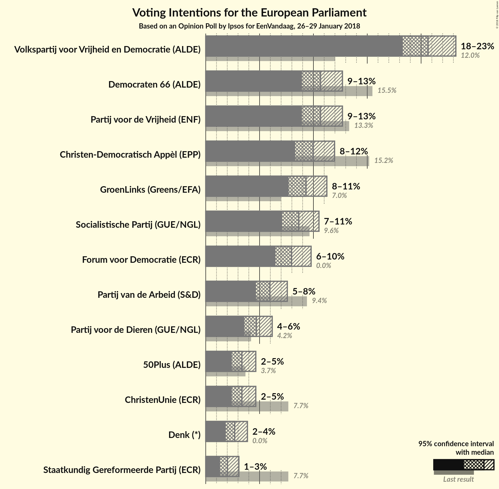
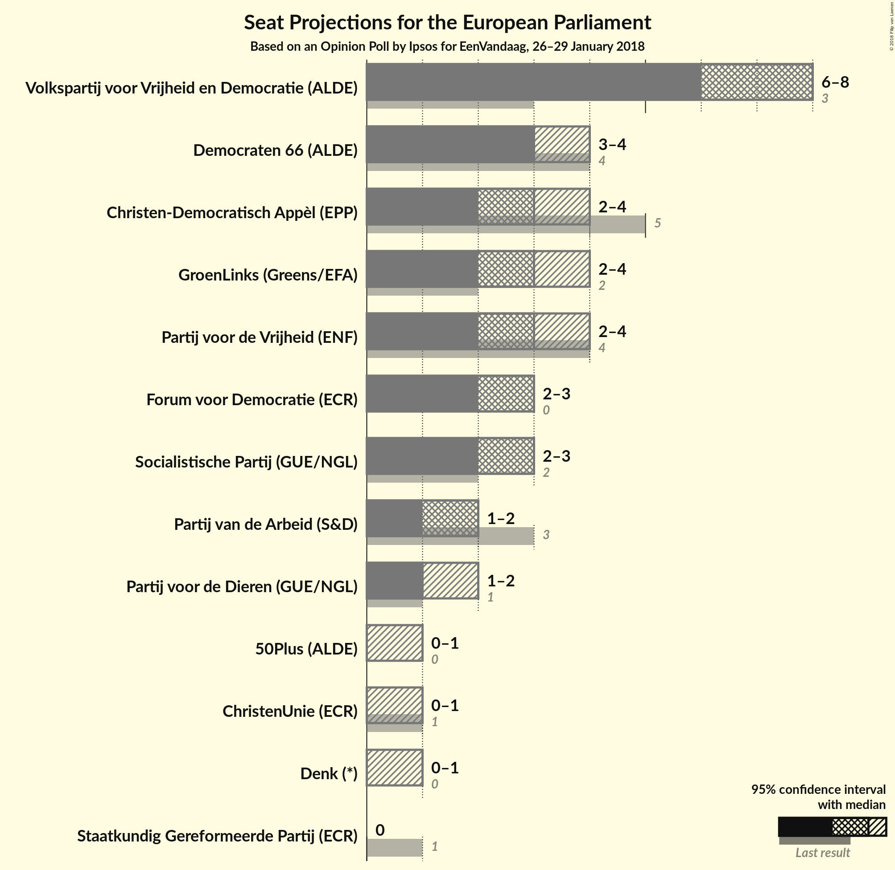

# Opinion Poll by Ipsos for EenVandaag, 26–29 January 2018

<a href="#voting-intentions">Voting Intentions</a> | <a href="#seats">Seats</a> | <a href="#coalitions">Coalitions</a> | <a href="#technical-information">Technical Information</a>

## Voting Intentions

### Confidence Intervals

| Party | Last Result | Poll Result | 80% Confidence Interval | 90% Confidence Interval | 95% Confidence Interval | 99% Confidence Interval |
|:-----:|:-----------:|:-----------:|:-----------------------:|:-----------------------:|:-----------------------:|:-----------------------:|
| Volkspartij voor Vrijheid en Democratie (ALDE) | 12.0% | 20.7% | 19.1–22.3% |18.7–22.8% |18.3–23.2% |17.6–24.1% |
| Partij voor de Vrijheid (ENF) | 13.3% | 10.7% | 9.5–12.0% |9.2–12.4% |8.9–12.7% |8.4–13.4% |
| Democraten 66 (ALDE) | 15.5% | 10.7% | 9.5–12.0% |9.2–12.4% |8.9–12.7% |8.4–13.4% |
| Christen-Democratisch Appèl (EPP) | 15.2% | 10.0% | 8.9–11.3% |8.6–11.6% |8.3–12.0% |7.8–12.6% |
| GroenLinks (Greens/EFA) | 7.0% | 9.3% | 8.2–10.6% |8.0–10.9% |7.7–11.2% |7.2–11.9% |
| Socialistische Partij (GUE/NGL) | 9.6% | 8.6% | 7.6–9.9% |7.3–10.2% |7.1–10.5% |6.6–11.1% |
| Forum voor Democratie (*) | 0.0% | 8.0% | N/A |N/A |N/A |N/A |
| Partij van de Arbeid (S&D) | 9.4% | 6.0% | 5.1–7.0% |4.9–7.3% |4.7–7.6% |4.3–8.1% |
| Partij voor de Dieren (GUE/NGL) | 4.2% | 4.7% | 4.0–5.7% |3.7–5.9% |3.6–6.2% |3.2–6.7% |
| ChristenUnie (ECR) | 7.7% | 3.4% | 2.7–4.2% |2.6–4.4% |2.4–4.6% |2.2–5.1% |
| 50Plus (ALDE) | 3.7% | 3.4% | 2.7–4.2% |2.6–4.4% |2.4–4.6% |2.2–5.1% |
| Denk (*) | 0.0% | 2.7% | N/A |N/A |N/A |N/A |
| Staatkundig Gereformeerde Partij (ECR) | 7.7% | 2.0% | 1.6–2.7% |1.4–2.9% |1.3–3.1% |1.1–3.4% |

*Note:* The poll result column reflects the actual value used in the calculations. Published results may vary slightly, and in addition be rounded to fewer digits.

## Seats

### Confidence Intervals

| Party | Last Result | Median | 80% Confidence Interval | 90% Confidence Interval | 95% Confidence Interval | 99% Confidence Interval |
|:-----:|:-----------:|:------:|:-----------------------:|:-----------------------:|:-----------------------:|:-----------------------:|
| <a href="#volkspartij-voor-vrijheid-en-democratie-(alde)">Volkspartij voor Vrijheid en Democratie (ALDE)</a> | 3 | 8 | 7–8 |6–8 |6–8 |6–8 |
| <a href="#partij-voor-de-vrijheid-(enf)">Partij voor de Vrijheid (ENF)</a> | 4 | 3 | 3–4 |3–4 |2–4 |2–4 |
| <a href="#democraten-66-(alde)">Democraten 66 (ALDE)</a> | 4 | 3 | 3–4 |3–4 |3–4 |3–4 |
| <a href="#christen-democratisch-appèl-(epp)">Christen-Democratisch Appèl (EPP)</a> | 5 | 3 | 3–4 |3–4 |2–4 |2–4 |
| <a href="#groenlinks-(greens/efa)">GroenLinks (Greens/EFA)</a> | 2 | 3 | 2–3 |2–3 |2–4 |2–4 |
| <a href="#socialistische-partij-(gue/ngl)">Socialistische Partij (GUE/NGL)</a> | 2 | 3 | 2–3 |2–3 |2–3 |2–4 |
| <a href="#forum-voor-democratie-(*)">Forum voor Democratie (*)</a> | 0 | N/A | N/A |N/A |N/A |N/A |
| <a href="#partij-van-de-arbeid-(s&d)">Partij van de Arbeid (S&D)</a> | 3 | 2 | 2 |1–2 |1–2 |1–3 |
| <a href="#partij-voor-de-dieren-(gue/ngl)">Partij voor de Dieren (GUE/NGL)</a> | 1 | 1 | 1–2 |1–2 |1–2 |1–2 |
| <a href="#christenunie-(ecr)">ChristenUnie (ECR)</a> | 1 | 0 | 0–1 |0–1 |0–1 |0–1 |
| <a href="#50plus-(alde)">50Plus (ALDE)</a> | 0 | 0 | 0–1 |0–1 |0–1 |0–1 |
| <a href="#denk-(*)">Denk (*)</a> | 0 | N/A | N/A |N/A |N/A |N/A |
| <a href="#staatkundig-gereformeerde-partij-(ecr)">Staatkundig Gereformeerde Partij (ECR)</a> | 1 | 0 | 0 |0 |0 |0 |

