# Opinion Poll by I&O Research, 2–6 February 2018

<a href="#voting-intentions">Voting Intentions</a> | <a href="#seats">Seats</a> | <a href="#coalitions">Coalitions</a> | <a href="#technical-information">Technical Information</a>

## Voting Intentions

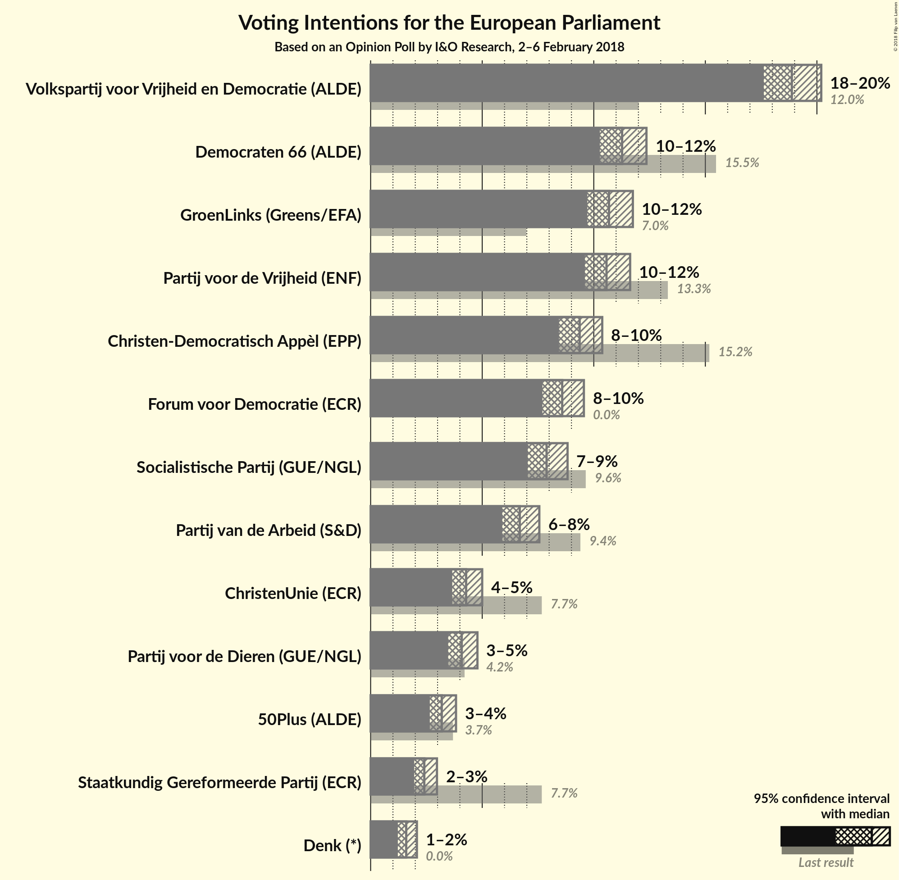

### Confidence Intervals

| Party | Last Result | Poll Result | 80% Confidence Interval | 90% Confidence Interval | 95% Confidence Interval | 99% Confidence Interval |
|:-----:|:-----------:|:-----------:|:-----------------------:|:-----------------------:|:-----------------------:|:-----------------------:|
| Volkspartij voor Vrijheid en Democratie (ALDE) | 12.0% | 18.9% | 18.0–19.7% |17.8–20.0% |17.6–20.2% |17.2–20.6% |
| Democraten 66 (ALDE) | 15.5% | 11.3% | 10.6–12.0% |10.4–12.2% |10.3–12.4% |10.0–12.7% |
| GroenLinks (Greens/EFA) | 7.0% | 10.7% | 10.0–11.4% |9.9–11.6% |9.7–11.8% |9.4–12.1% |
| Partij voor de Vrijheid (ENF) | 13.3% | 10.6% | 9.9–11.3% |9.8–11.5% |9.6–11.6% |9.3–12.0% |
| Christen-Democratisch Appèl (EPP) | 15.2% | 9.4% | 8.8–10.0% |8.6–10.2% |8.4–10.4% |8.2–10.7% |
| Forum voor Democratie (—) | 0.0% | 8.6% | 8.0–9.2% |7.8–9.4% |7.7–9.6% |7.4–9.9% |
| Socialistische Partij (GUE/NGL) | 9.6% | 7.9% | 7.3–8.5% |7.2–8.7% |7.0–8.8% |6.8–9.1% |
| Partij van de Arbeid (S&D) | 9.4% | 6.7% | 6.2–7.3% |6.0–7.4% |5.9–7.6% |5.7–7.8% |
| ChristenUnie (ECR) | 7.7% | 4.3% | 3.9–4.8% |3.7–4.9% |3.7–5.0% |3.5–5.2% |
| Partij voor de Dieren (GUE/NGL) | 4.2% | 4.1% | 3.7–4.5% |3.6–4.7% |3.5–4.8% |3.3–5.0% |
| 50Plus (ALDE) | 3.7% | 3.2% | 2.8–3.6% |2.7–3.7% |2.7–3.8% |2.5–4.0% |
| Staatkundig Gereformeerde Partij (ECR) | 7.7% | 2.4% | 2.1–2.8% |2.0–2.9% |2.0–3.0% |1.8–3.2% |
| Denk (—) | 0.0% | 1.6% | 1.4–1.9% |1.3–2.0% |1.2–2.1% |1.1–2.2% |

*Note:* The poll result column reflects the actual value used in the calculations. Published results may vary slightly, and in addition be rounded to fewer digits.

## Seats

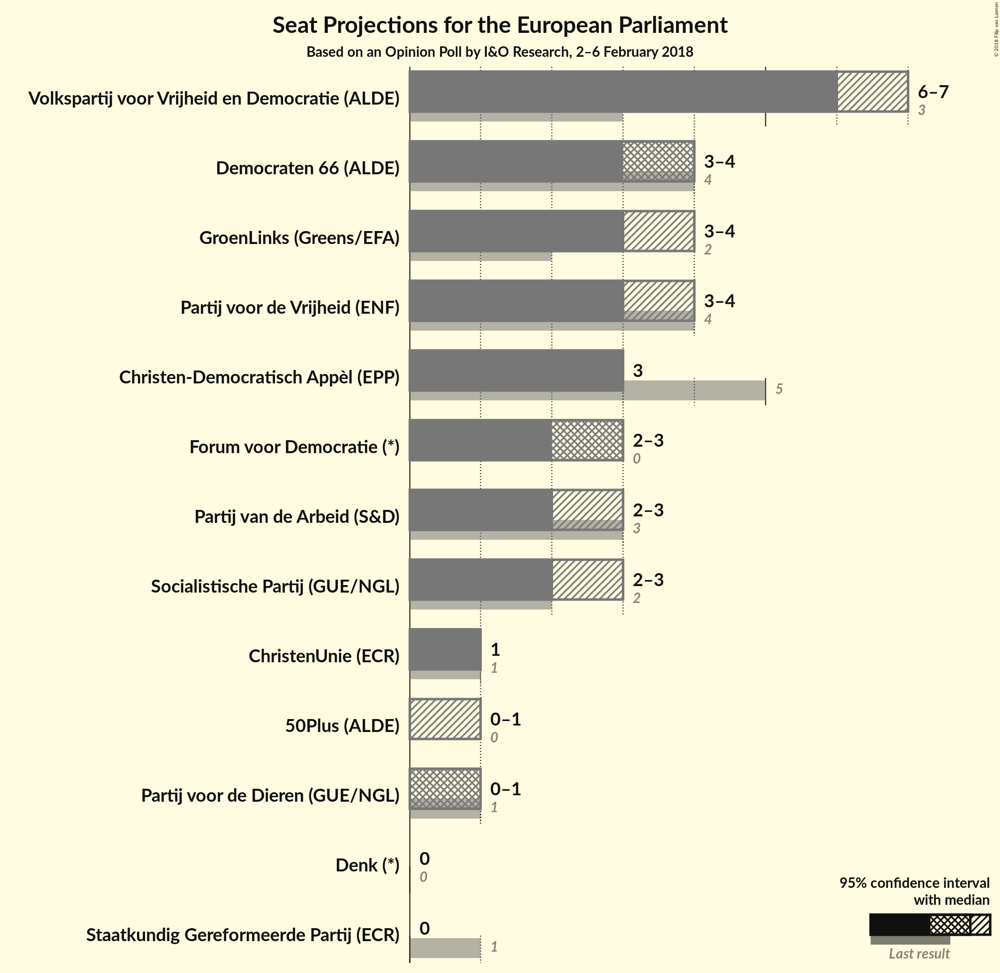

### Confidence Intervals

| Party | Last Result | Median | 80% Confidence Interval | 90% Confidence Interval | 95% Confidence Interval | 99% Confidence Interval |
|:-----:|:-----------:|:------:|:-----------------------:|:-----------------------:|:-----------------------:|:-----------------------:|
| <a href="#volkspartij-voor-vrijheid-en-democratie-(alde)">Volkspartij voor Vrijheid en Democratie (ALDE)</a> | 3 | 6 | 5–6 |5–6 |5–6 |5–7 |
| <a href="#democraten-66-(alde)">Democraten 66 (ALDE)</a> | 4 | 3 | 3–4 |3–4 |3–4 |3–4 |
| <a href="#groenlinks-(greens/efa)">GroenLinks (Greens/EFA)</a> | 2 | 3 | 3–4 |3–4 |3–4 |3–4 |
| <a href="#partij-voor-de-vrijheid-(enf)">Partij voor de Vrijheid (ENF)</a> | 4 | 3 | 3–4 |3–4 |3–4 |3–4 |
| <a href="#christen-democratisch-appèl-(epp)">Christen-Democratisch Appèl (EPP)</a> | 5 | 3 | 2–3 |2–3 |2–3 |2–3 |
| <a href="#forum-voor-democratie-(—)">Forum voor Democratie (—)</a> | 0 | 2 | 2–3 |2–3 |2–3 |2–3 |
| <a href="#socialistische-partij-(gue/ngl)">Socialistische Partij (GUE/NGL)</a> | 2 | 2 | 2 |2 |2–3 |2–3 |
| <a href="#partij-van-de-arbeid-(s&d)">Partij van de Arbeid (S&D)</a> | 3 | 2 | 2 |2 |1–2 |1–2 |
| <a href="#christenunie-(ecr)">ChristenUnie (ECR)</a> | 1 | 1 | 1 |0–1 |0–1 |0–1 |
| <a href="#partij-voor-de-dieren-(gue/ngl)">Partij voor de Dieren (GUE/NGL)</a> | 1 | 1 | 0–1 |0–1 |0–1 |0–1 |
| <a href="#50plus-(alde)">50Plus (ALDE)</a> | 0 | 0 | 0 |0 |0 |0–1 |
| <a href="#staatkundig-gereformeerde-partij-(ecr)">Staatkundig Gereformeerde Partij (ECR)</a> | 1 | 0 | 0 |0 |0 |0 |
| <a href="#denk-(—)">Denk (—)</a> | 0 | 0 | 0 |0 |0 |0 |

### Volkspartij voor Vrijheid en Democratie (ALDE)

*For a full overview of the results for this party, see the [Volkspartij voor Vrijheid en Democratie (ALDE)](party-volkspartijvoorvrijheidendemocratiealde.html) page.*

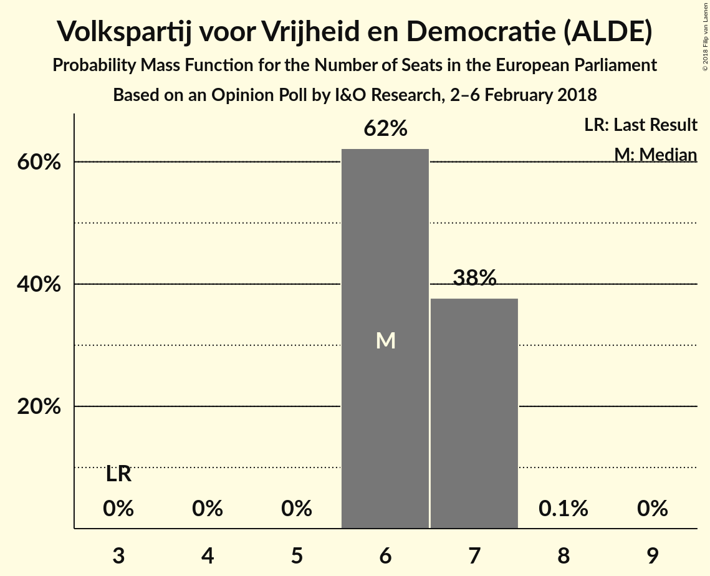

| Number of Seats | Probability | Accumulated | Special Marks |
|:---------------:|:-----------:|:-----------:|:-------------:|
| 3 | 0% | 100% | Last Result |
| 4 | 0% | 100% |  |
| 5 | 12% | 100% |  |
| 6 | 87% | 88% | Median |
| 7 | 0.6% | 0.6% |  |
| 8 | 0% | 0% |  |

### Democraten 66 (ALDE)

*For a full overview of the results for this party, see the [Democraten 66 (ALDE)](party-democraten66alde.html) page.*

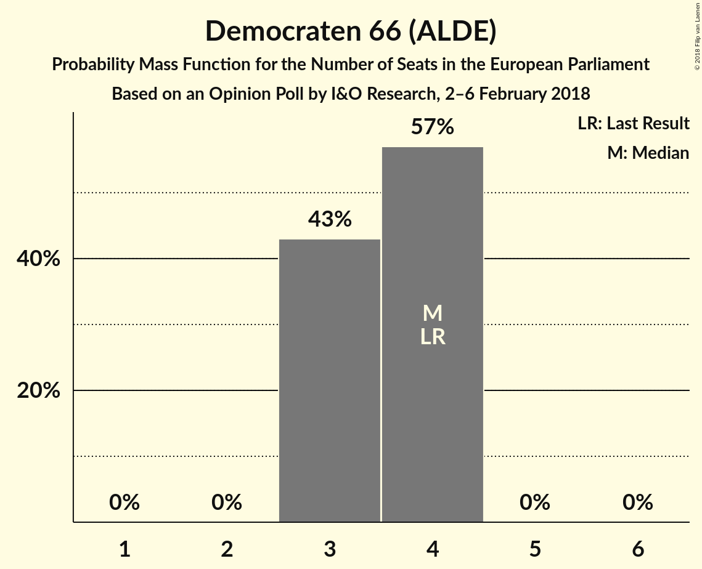

| Number of Seats | Probability | Accumulated | Special Marks |
|:---------------:|:-----------:|:-----------:|:-------------:|
| 3 | 90% | 100% | Median |
| 4 | 10% | 10% | Last Result |
| 5 | 0% | 0% |  |

### GroenLinks (Greens/EFA)

*For a full overview of the results for this party, see the [GroenLinks (Greens/EFA)](party-groenlinksgreensefa.html) page.*

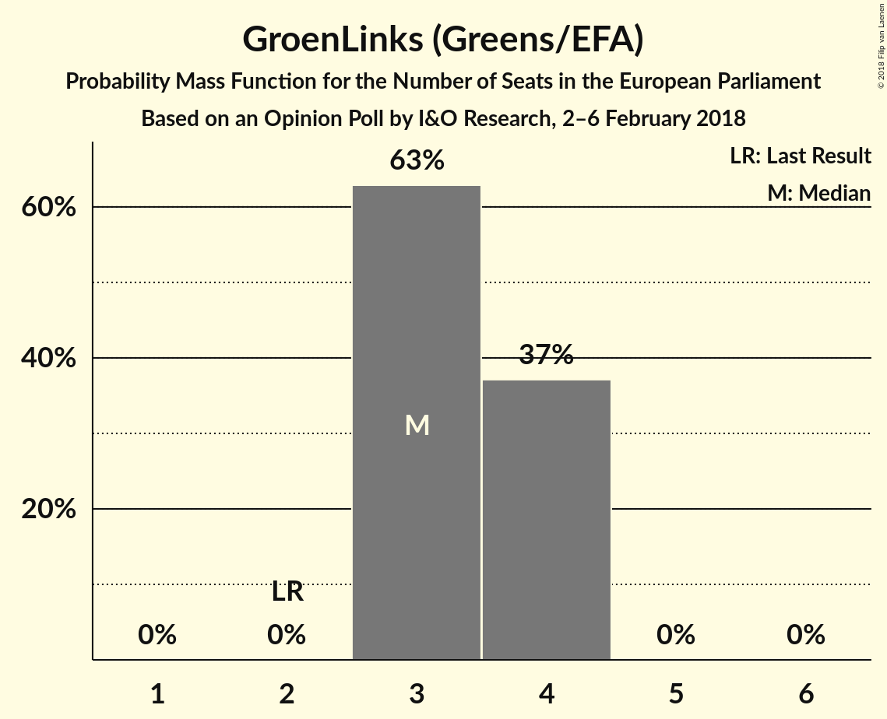

| Number of Seats | Probability | Accumulated | Special Marks |
|:---------------:|:-----------:|:-----------:|:-------------:|
| 2 | 0.1% | 100% | Last Result |
| 3 | 88% | 99.9% | Median |
| 4 | 12% | 12% |  |
| 5 | 0% | 0% |  |

### Partij voor de Vrijheid (ENF)

*For a full overview of the results for this party, see the [Partij voor de Vrijheid (ENF)](party-partijvoordevrijheidenf.html) page.*

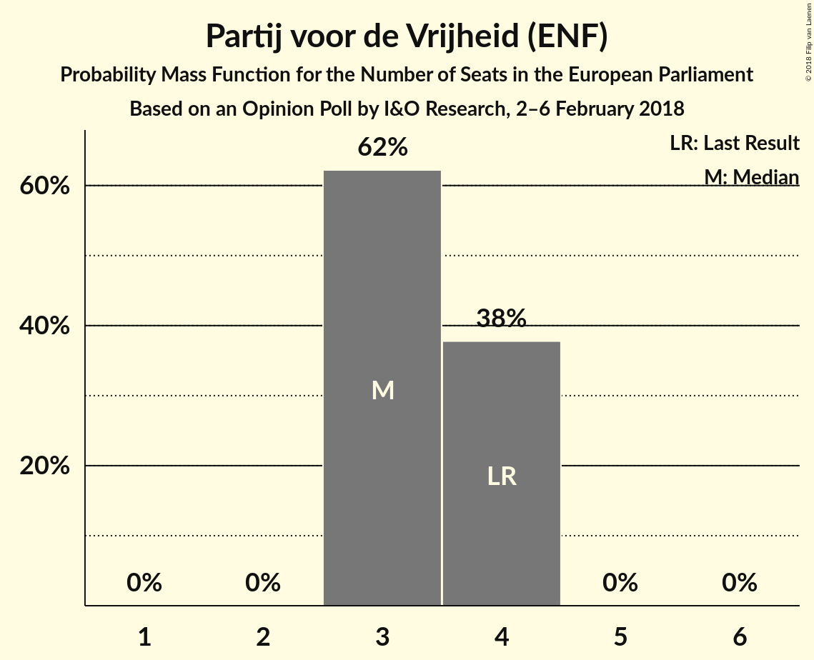

| Number of Seats | Probability | Accumulated | Special Marks |
|:---------------:|:-----------:|:-----------:|:-------------:|
| 2 | 0.1% | 100% |  |
| 3 | 88% | 99.9% | Median |
| 4 | 11% | 11% | Last Result |
| 5 | 0% | 0% |  |

### Christen-Democratisch Appèl (EPP)

*For a full overview of the results for this party, see the [Christen-Democratisch Appèl (EPP)](party-christen-democratischappèlepp.html) page.*

| Number of Seats | Probability | Accumulated | Special Marks |
|:---------------:|:-----------:|:-----------:|:-------------:|
| 2 | 12% | 100% |  |
| 3 | 88% | 88% | Median |
| 4 | 0% | 0% |  |
| 5 | 0% | 0% | Last Result |

### Forum voor Democratie (—)

*For a full overview of the results for this party, see the [Forum voor Democratie (—)](party-forumvoordemocratie—.html) page.*

| Number of Seats | Probability | Accumulated | Special Marks |
|:---------------:|:-----------:|:-----------:|:-------------:|
| 0 | 0% | 100% | Last Result |
| 1 | 0% | 100% |  |
| 2 | 72% | 100% | Median |
| 3 | 28% | 28% |  |
| 4 | 0% | 0% |  |

### Socialistische Partij (GUE/NGL)

*For a full overview of the results for this party, see the [Socialistische Partij (GUE/NGL)](party-socialistischepartijguengl.html) page.*

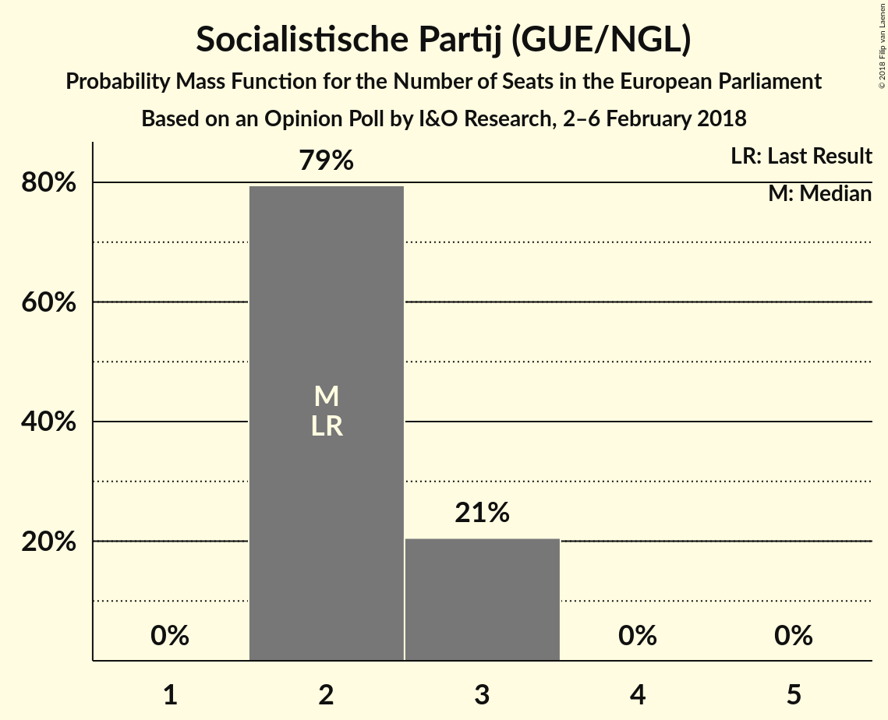

| Number of Seats | Probability | Accumulated | Special Marks |
|:---------------:|:-----------:|:-----------:|:-------------:|
| 2 | 96% | 100% | Last Result, Median |
| 3 | 4% | 4% |  |
| 4 | 0% | 0% |  |

### Partij van de Arbeid (S&D)

*For a full overview of the results for this party, see the [Partij van de Arbeid (S&D)](party-partijvandearbeidsd.html) page.*

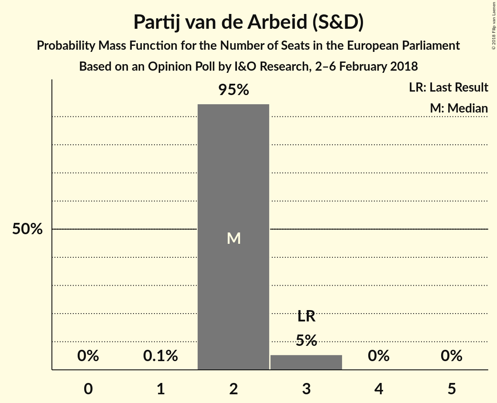

| Number of Seats | Probability | Accumulated | Special Marks |
|:---------------:|:-----------:|:-----------:|:-------------:|
| 1 | 3% | 100% |  |
| 2 | 97% | 97% | Median |
| 3 | 0% | 0% | Last Result |

### ChristenUnie (ECR)

*For a full overview of the results for this party, see the [ChristenUnie (ECR)](party-christenunieecr.html) page.*

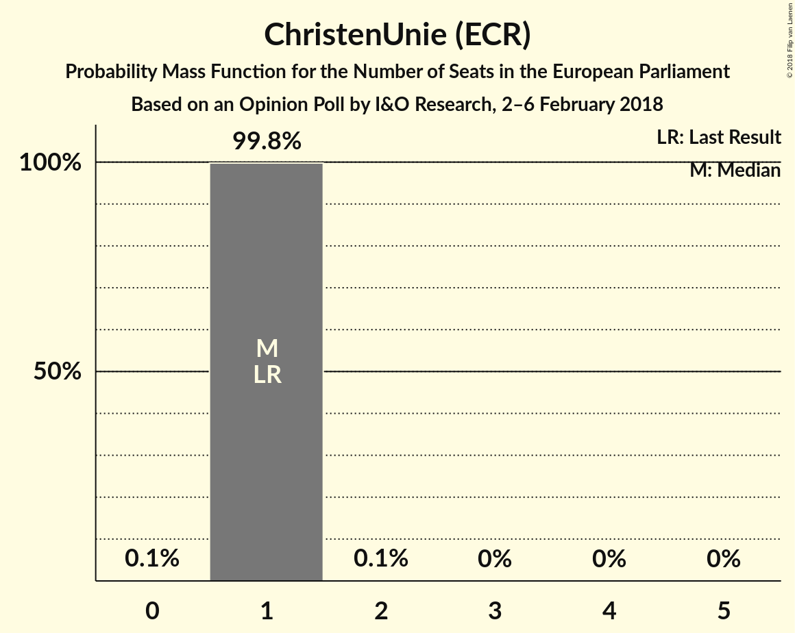

| Number of Seats | Probability | Accumulated | Special Marks |
|:---------------:|:-----------:|:-----------:|:-------------:|
| 0 | 5% | 100% |  |
| 1 | 95% | 95% | Last Result, Median |
| 2 | 0% | 0% |  |

### Partij voor de Dieren (GUE/NGL)

*For a full overview of the results for this party, see the [Partij voor de Dieren (GUE/NGL)](party-partijvoordedierenguengl.html) page.*

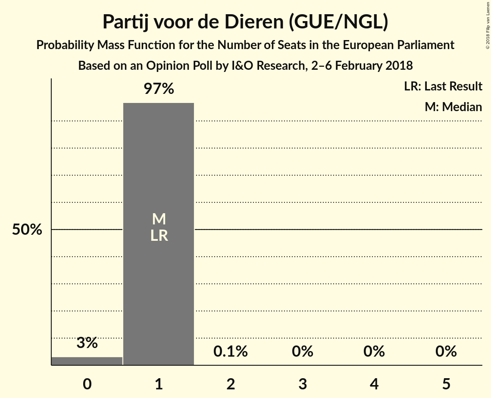

| Number of Seats | Probability | Accumulated | Special Marks |
|:---------------:|:-----------:|:-----------:|:-------------:|
| 0 | 36% | 100% |  |
| 1 | 64% | 64% | Last Result, Median |
| 2 | 0% | 0% |  |

### 50Plus (ALDE)

*For a full overview of the results for this party, see the [50Plus (ALDE)](party-50plusalde.html) page.*

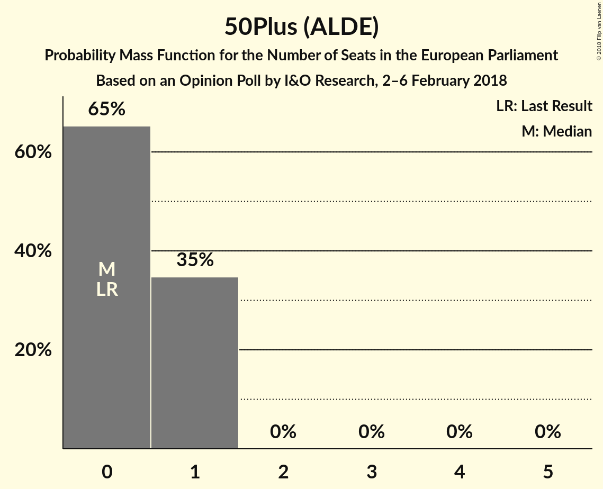

| Number of Seats | Probability | Accumulated | Special Marks |
|:---------------:|:-----------:|:-----------:|:-------------:|
| 0 | 98% | 100% | Last Result, Median |
| 1 | 2% | 2% |  |
| 2 | 0% | 0% |  |

### Staatkundig Gereformeerde Partij (ECR)

*For a full overview of the results for this party, see the [Staatkundig Gereformeerde Partij (ECR)](party-staatkundiggereformeerdepartijecr.html) page.*

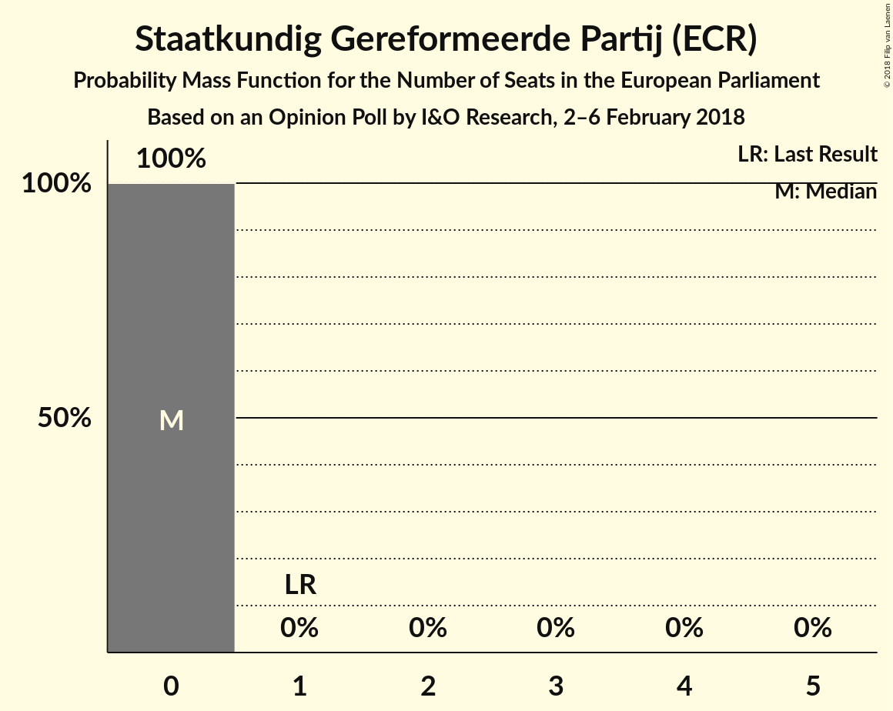

| Number of Seats | Probability | Accumulated | Special Marks |
|:---------------:|:-----------:|:-----------:|:-------------:|
| 0 | 100% | 100% | Median |
| 1 | 0% | 0% | Last Result |

### Denk (—)

*For a full overview of the results for this party, see the [Denk (—)](party-denk—.html) page.*

| Number of Seats | Probability | Accumulated | Special Marks |
|:---------------:|:-----------:|:-----------:|:-------------:|
| 0 | 100% | 100% | Last Result, Median |

## Coalitions

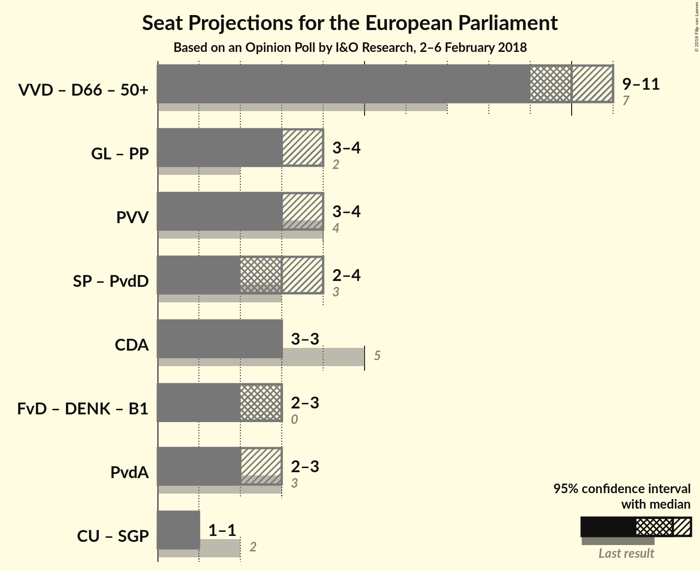

### Confidence Intervals

| Coalition | Last Result | Median | Majority? | 80% Confidence Interval | 90% Confidence Interval | 95% Confidence Interval | 99% Confidence Interval |
|:---------:|:-----------:|:------:|:---------:|:-----------------------:|:-----------------------:|:-----------------------:|:-----------------------:|
| Volkspartij voor Vrijheid en Democratie (ALDE) – Democraten 66 (ALDE) – 50Plus (ALDE) | 7 | 9 | 0% | 8–10 | 8–10 | 8–10 | 8–10 |
| Partij voor de Vrijheid (ENF) | 4 | 3 | 0% | 3–4 | 3–4 | 3–4 | 3–4 |
| Christen-Democratisch Appèl (EPP) | 5 | 3 | 0% | 2–3 | 2–3 | 2–3 | 2–3 |
| Socialistische Partij (GUE/NGL) – Partij voor de Dieren (GUE/NGL) | 3 | 3 | 0% | 2–3 | 2–3 | 2–3 | 2–4 |
| Partij van de Arbeid (S&D) | 3 | 2 | 0% | 2 | 2 | 1–2 | 1–2 |
| ChristenUnie (ECR) – Staatkundig Gereformeerde Partij (ECR) | 2 | 1 | 0% | 1 | 0–1 | 0–1 | 0–1 |

### Volkspartij voor Vrijheid en Democratie (ALDE) – Democraten 66 (ALDE) – 50Plus (ALDE)

| Number of Seats | Probability | Accumulated | Special Marks |
|:---------------:|:-----------:|:-----------:|:-------------:|
| 7 | 0% | 100% | Last Result |
| 8 | 11% | 100% |  |
| 9 | 77% | 89% | Median |
| 10 | 12% | 12% |  |
| 11 | 0.1% | 0.1% |  |
| 12 | 0% | 0% |  |

### Partij voor de Vrijheid (ENF)

| Number of Seats | Probability | Accumulated | Special Marks |
|:---------------:|:-----------:|:-----------:|:-------------:|
| 2 | 0.1% | 100% |  |
| 3 | 88% | 99.9% | Median |
| 4 | 11% | 11% | Last Result |
| 5 | 0% | 0% |  |

### Christen-Democratisch Appèl (EPP)

| Number of Seats | Probability | Accumulated | Special Marks |
|:---------------:|:-----------:|:-----------:|:-------------:|
| 2 | 12% | 100% |  |
| 3 | 88% | 88% | Median |
| 4 | 0% | 0% |  |
| 5 | 0% | 0% | Last Result |

### Socialistische Partij (GUE/NGL) – Partij voor de Dieren (GUE/NGL)

| Number of Seats | Probability | Accumulated | Special Marks |
|:---------------:|:-----------:|:-----------:|:-------------:|
| 2 | 33% | 100% |  |
| 3 | 66% | 67% | Last Result, Median |
| 4 | 0.6% | 0.6% |  |
| 5 | 0% | 0% |  |

### Partij van de Arbeid (S&D)

| Number of Seats | Probability | Accumulated | Special Marks |
|:---------------:|:-----------:|:-----------:|:-------------:|
| 1 | 3% | 100% |  |
| 2 | 97% | 97% | Median |
| 3 | 0% | 0% | Last Result |

### ChristenUnie (ECR) – Staatkundig Gereformeerde Partij (ECR)

| Number of Seats | Probability | Accumulated | Special Marks |
|:---------------:|:-----------:|:-----------:|:-------------:|
| 0 | 5% | 100% |  |
| 1 | 95% | 95% | Median |
| 2 | 0% | 0% | Last Result |

## Technical Information

### Opinion Poll

+ **Polling firm:** I&O Research
+ **Commissioner(s):** —
+ **Fieldwork period:** 2–6 February 2018

### Calculations

+ **Sample size:** 3576
+ **Simulations done:** 1,048,576
+ **Error estimate:** 2.27%

