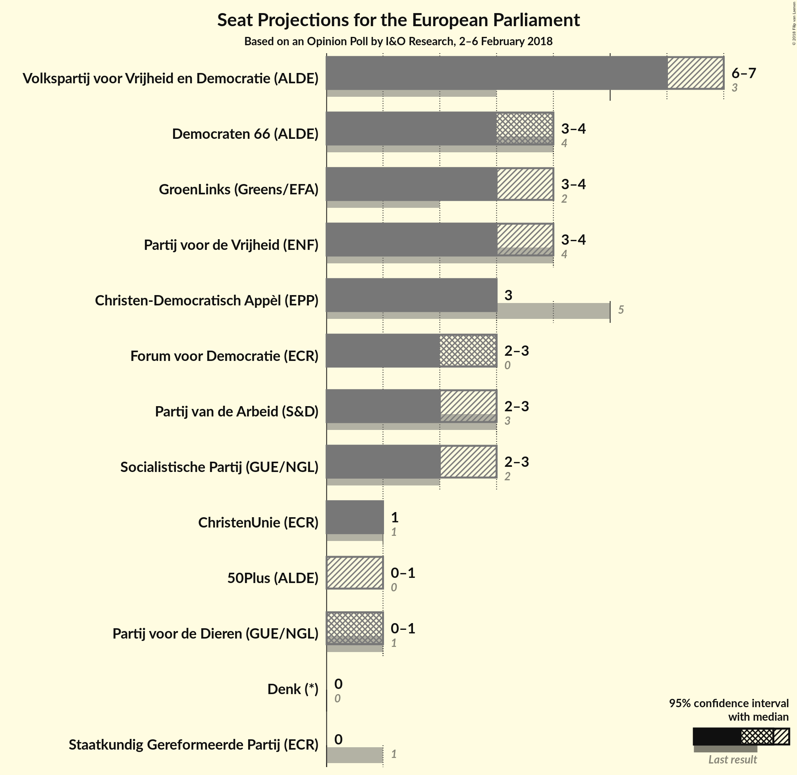

# Opinion Poll by I&O Research, 2–6 February 2018

<a href="#voting-intentions">Voting Intentions</a> | <a href="#seats">Seats</a> | <a href="#coalitions">Coalitions</a> | <a href="#technical-information">Technical Information</a>

## Voting Intentions

### Confidence Intervals

| Party | Last Result | Poll Result | 80% Confidence Interval | 90% Confidence Interval | 95% Confidence Interval | 99% Confidence Interval |
|:-----:|:-----------:|:-----------:|:-----------------------:|:-----------------------:|:-----------------------:|:-----------------------:|
| Volkspartij voor Vrijheid en Democratie (ALDE) | 12.0% | 18.9% | 18.0–19.7% |17.8–20.0% |17.6–20.2% |17.2–20.6% |
| Democraten 66 (ALDE) | 15.5% | 11.3% | 10.6–12.0% |10.4–12.2% |10.3–12.4% |10.0–12.7% |
| GroenLinks (Greens/EFA) | 7.0% | 10.7% | 10.0–11.4% |9.9–11.6% |9.7–11.8% |9.4–12.1% |
| Partij voor de Vrijheid (ENF) | 13.3% | 10.6% | 9.9–11.3% |9.8–11.5% |9.6–11.6% |9.3–12.0% |
| Christen-Democratisch Appèl (EPP) | 15.2% | 9.4% | 8.8–10.0% |8.6–10.2% |8.4–10.4% |8.2–10.7% |
| Forum voor Democratie (*) | 0.0% | 8.6% | N/A |N/A |N/A |N/A |
| Socialistische Partij (GUE/NGL) | 9.6% | 7.9% | 7.3–8.5% |7.2–8.7% |7.0–8.8% |6.8–9.1% |
| Partij van de Arbeid (S&D) | 9.4% | 6.7% | 6.2–7.3% |6.0–7.4% |5.9–7.6% |5.7–7.8% |
| ChristenUnie (ECR) | 7.7% | 4.3% | 3.9–4.8% |3.7–4.9% |3.7–5.0% |3.5–5.2% |
| Partij voor de Dieren (GUE/NGL) | 4.2% | 4.1% | 3.7–4.5% |3.6–4.7% |3.5–4.8% |3.3–5.0% |
| 50Plus (ALDE) | 3.7% | 3.2% | 2.8–3.6% |2.7–3.7% |2.7–3.8% |2.5–4.0% |
| Staatkundig Gereformeerde Partij (ECR) | 7.7% | 2.4% | 2.1–2.8% |2.0–2.9% |2.0–3.0% |1.8–3.2% |
| Denk (*) | 0.0% | 1.6% | N/A |N/A |N/A |N/A |

*Note:* The poll result column reflects the actual value used in the calculations. Published results may vary slightly, and in addition be rounded to fewer digits.

## Seats

### Confidence Intervals

| Party | Last Result | Median | 80% Confidence Interval | 90% Confidence Interval | 95% Confidence Interval | 99% Confidence Interval |
|:-----:|:-----------:|:------:|:-----------------------:|:-----------------------:|:-----------------------:|:-----------------------:|
| <a href="#volkspartij-voor-vrijheid-en-democratie-(alde)">Volkspartij voor Vrijheid en Democratie (ALDE)</a> | 3 | 6 | 6–7 |6–7 |6–7 |6–7 |
| <a href="#democraten-66-(alde)">Democraten 66 (ALDE)</a> | 4 | 4 | 3–4 |3–4 |3–4 |3–4 |
| <a href="#groenlinks-(greens/efa)">GroenLinks (Greens/EFA)</a> | 2 | 3 | 3–4 |3–4 |3–4 |3–4 |
| <a href="#partij-voor-de-vrijheid-(enf)">Partij voor de Vrijheid (ENF)</a> | 4 | 3 | 3–4 |3–4 |3–4 |3–4 |
| <a href="#christen-democratisch-appèl-(epp)">Christen-Democratisch Appèl (EPP)</a> | 5 | 3 | 3 |3 |3 |2–3 |
| <a href="#forum-voor-democratie-(*)">Forum voor Democratie (*)</a> | 0 | N/A | N/A |N/A |N/A |N/A |
| <a href="#socialistische-partij-(gue/ngl)">Socialistische Partij (GUE/NGL)</a> | 2 | 2 | 2–3 |2–3 |2–3 |2–3 |
| <a href="#partij-van-de-arbeid-(s&d)">Partij van de Arbeid (S&D)</a> | 3 | 2 | 2 |2–3 |2–3 |2–3 |
| <a href="#christenunie-(ecr)">ChristenUnie (ECR)</a> | 1 | 1 | 1 |1 |1 |1 |
| <a href="#partij-voor-de-dieren-(gue/ngl)">Partij voor de Dieren (GUE/NGL)</a> | 1 | 1 | 1 |1 |0–1 |0–1 |
| <a href="#50plus-(alde)">50Plus (ALDE)</a> | 0 | 0 | 0–1 |0–1 |0–1 |0–1 |
| <a href="#staatkundig-gereformeerde-partij-(ecr)">Staatkundig Gereformeerde Partij (ECR)</a> | 1 | 0 | 0 |0 |0 |0 |
| <a href="#denk-(*)">Denk (*)</a> | 0 | N/A | N/A |N/A |N/A |N/A |

