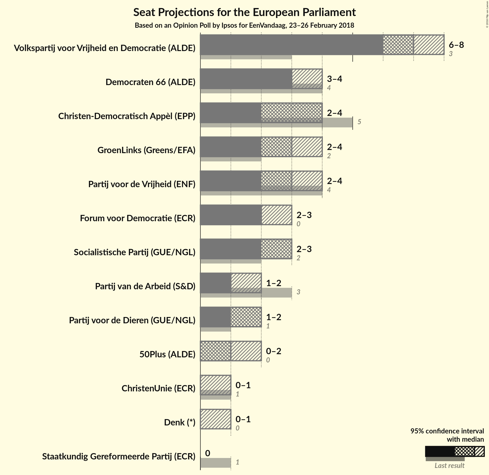

# Opinion Poll by Ipsos for EenVandaag, 23–26 February 2018

<a href="#voting-intentions">Voting Intentions</a> | <a href="#seats">Seats</a> | <a href="#coalitions">Coalitions</a> | <a href="#technical-information">Technical Information</a>

## Voting Intentions

### Confidence Intervals

| Party | Last Result | Poll Result | 80% Confidence Interval | 90% Confidence Interval | 95% Confidence Interval | 99% Confidence Interval |
|:-----:|:-----------:|:-----------:|:-----------------------:|:-----------------------:|:-----------------------:|:-----------------------:|
| Volkspartij voor Vrijheid en Democratie (ALDE) | 12.0% | 19.9% | 18.4–21.6% |17.9–22.0% |17.5–22.5% |16.8–23.3% |
| Democraten 66 (ALDE) | 15.5% | 10.4% | 9.3–11.8% |9.0–12.1% |8.7–12.5% |8.2–13.1% |
| Christen-Democratisch Appèl (EPP) | 15.2% | 10.1% | 9.0–11.4% |8.7–11.8% |8.4–12.1% |7.9–12.8% |
| Partij voor de Vrijheid (ENF) | 13.3% | 9.7% | 8.6–11.0% |8.3–11.4% |8.1–11.7% |7.6–12.4% |
| GroenLinks (Greens/EFA) | 7.0% | 9.3% | 8.2–10.5% |7.9–10.9% |7.6–11.2% |7.1–11.8% |
| Socialistische Partij (GUE/NGL) | 9.6% | 8.3% | 7.3–9.5% |7.0–9.8% |6.8–10.1% |6.3–10.7% |
| Forum voor Democratie (*) | 0.0% | 7.7% | N/A |N/A |N/A |N/A |
| Partij voor de Dieren (GUE/NGL) | 4.2% | 5.2% | 4.4–6.2% |4.1–6.4% |4.0–6.7% |3.6–7.2% |
| Partij van de Arbeid (S&D) | 9.4% | 5.1% | 4.3–6.1% |4.1–6.3% |3.9–6.6% |3.5–7.1% |
| 50Plus (ALDE) | 3.7% | 4.0% | 3.3–4.9% |3.1–5.2% |3.0–5.4% |2.7–5.9% |
| ChristenUnie (ECR) | 7.7% | 3.6% | 3.0–4.5% |2.8–4.7% |2.6–4.9% |2.3–5.4% |
| Denk (*) | 0.0% | 3.1% | N/A |N/A |N/A |N/A |
| Staatkundig Gereformeerde Partij (ECR) | 7.7% | 2.3% | 1.8–3.1% |1.7–3.3% |1.6–3.5% |1.4–3.8% |

*Note:* The poll result column reflects the actual value used in the calculations. Published results may vary slightly, and in addition be rounded to fewer digits.

## Seats

### Confidence Intervals

| Party | Last Result | Median | 80% Confidence Interval | 90% Confidence Interval | 95% Confidence Interval | 99% Confidence Interval |
|:-----:|:-----------:|:------:|:-----------------------:|:-----------------------:|:-----------------------:|:-----------------------:|
| <a href="#volkspartij-voor-vrijheid-en-democratie-(alde)">Volkspartij voor Vrijheid en Democratie (ALDE)</a> | 3 | 7 | 6–7 |6–8 |6–8 |6–8 |
| <a href="#democraten-66-(alde)">Democraten 66 (ALDE)</a> | 4 | 3 | 3–4 |3–4 |3–4 |3–4 |
| <a href="#christen-democratisch-appèl-(epp)">Christen-Democratisch Appèl (EPP)</a> | 5 | 4 | 3–4 |2–4 |2–4 |2–4 |
| <a href="#partij-voor-de-vrijheid-(enf)">Partij voor de Vrijheid (ENF)</a> | 4 | 3 | 3–4 |2–4 |2–4 |2–4 |
| <a href="#groenlinks-(greens/efa)">GroenLinks (Greens/EFA)</a> | 2 | 3 | 3 |2–4 |2–4 |2–4 |
| <a href="#socialistische-partij-(gue/ngl)">Socialistische Partij (GUE/NGL)</a> | 2 | 3 | 2–3 |2–3 |2–3 |2–4 |
| <a href="#forum-voor-democratie-(*)">Forum voor Democratie (*)</a> | 0 | N/A | N/A |N/A |N/A |N/A |
| <a href="#partij-voor-de-dieren-(gue/ngl)">Partij voor de Dieren (GUE/NGL)</a> | 1 | 2 | 1–2 |1–2 |1–2 |1–2 |
| <a href="#partij-van-de-arbeid-(s&d)">Partij van de Arbeid (S&D)</a> | 3 | 1 | 1–2 |1–2 |1–2 |1–2 |
| <a href="#50plus-(alde)">50Plus (ALDE)</a> | 0 | 1 | 0–1 |0–1 |0–2 |0–2 |
| <a href="#christenunie-(ecr)">ChristenUnie (ECR)</a> | 1 | 0 | 0–1 |0–1 |0–1 |0–1 |
| <a href="#denk-(*)">Denk (*)</a> | 0 | N/A | N/A |N/A |N/A |N/A |
| <a href="#staatkundig-gereformeerde-partij-(ecr)">Staatkundig Gereformeerde Partij (ECR)</a> | 1 | 0 | 0 |0 |0 |0–1 |

