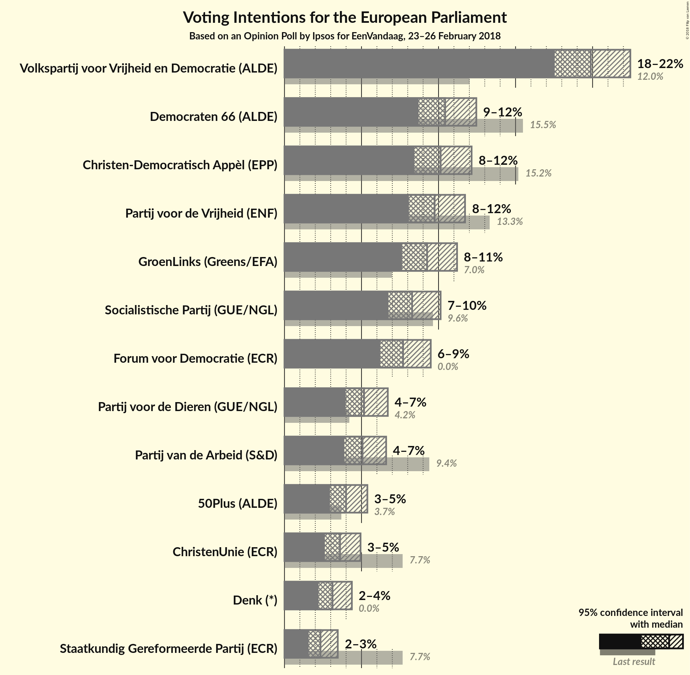
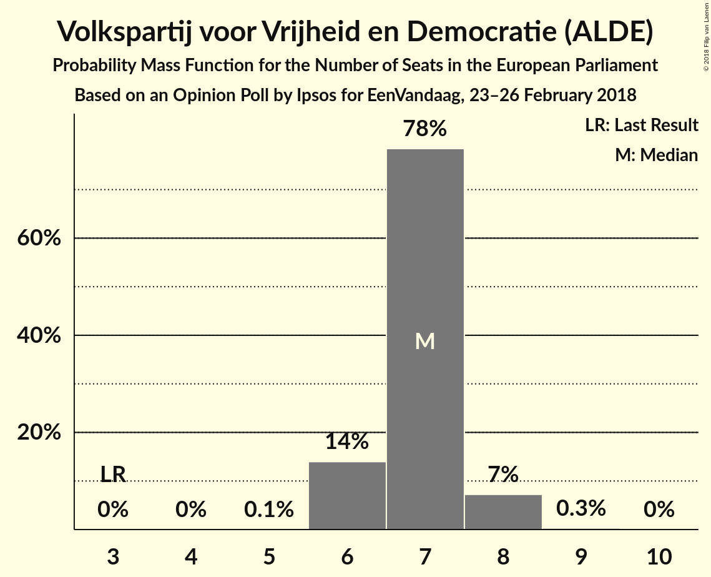
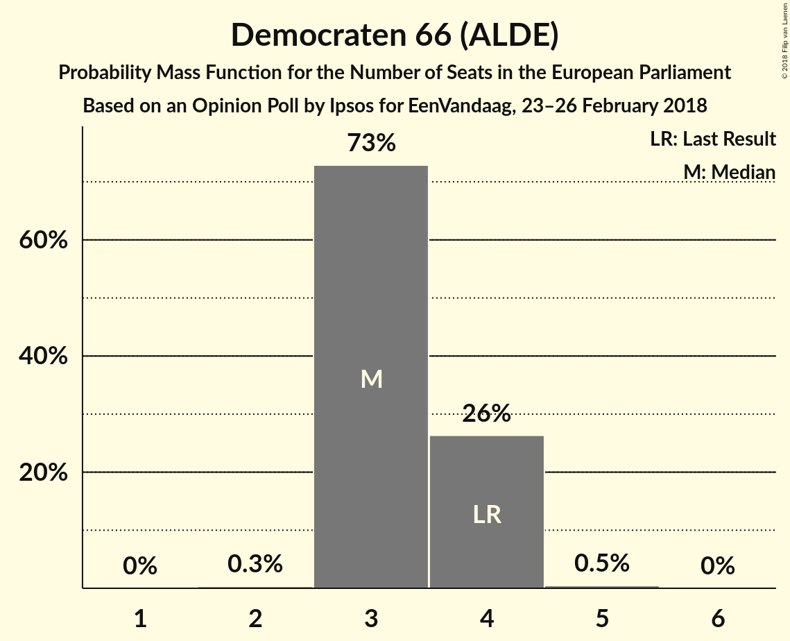
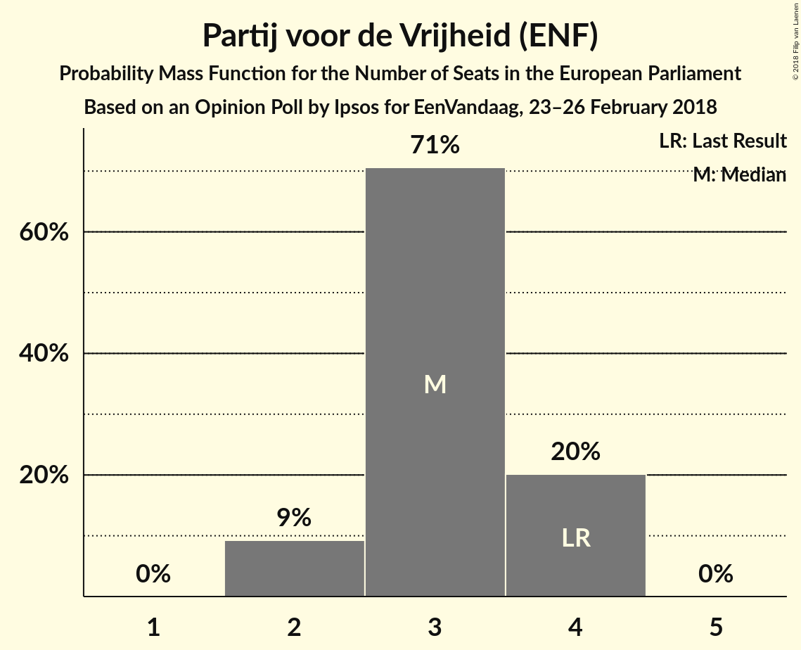
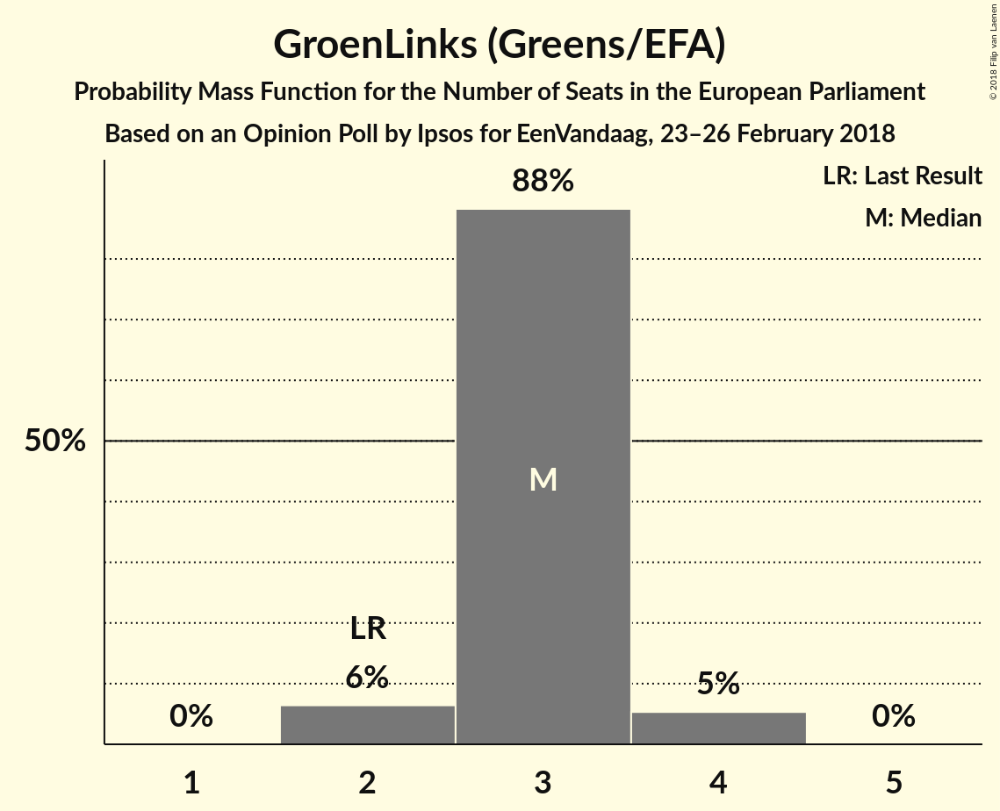
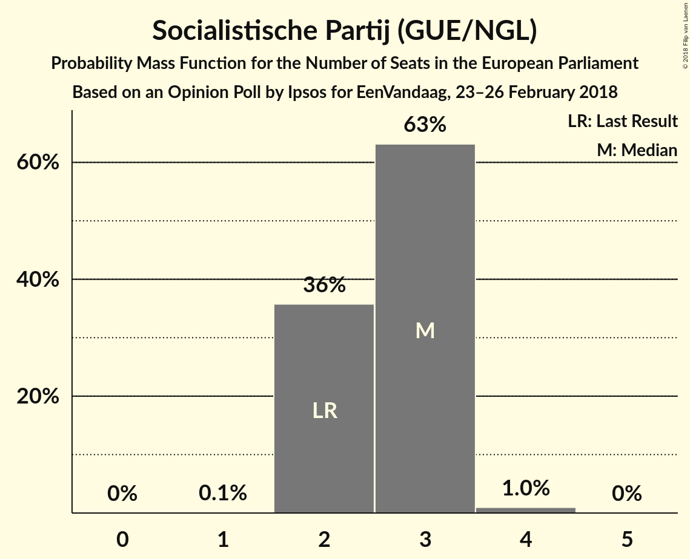
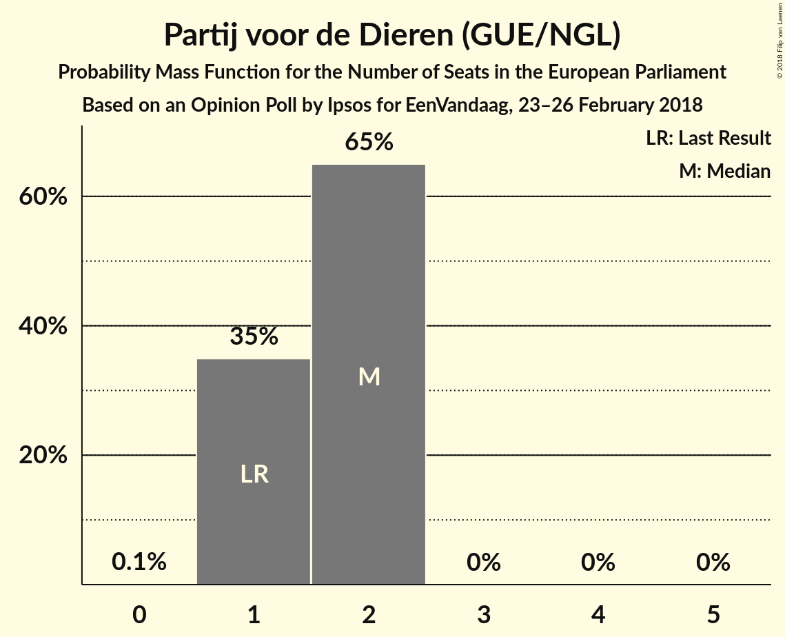
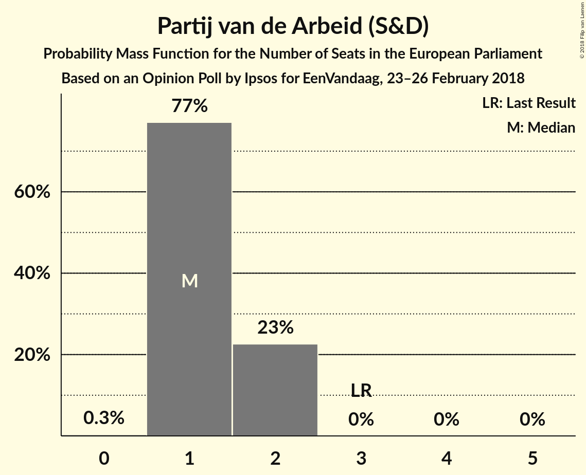
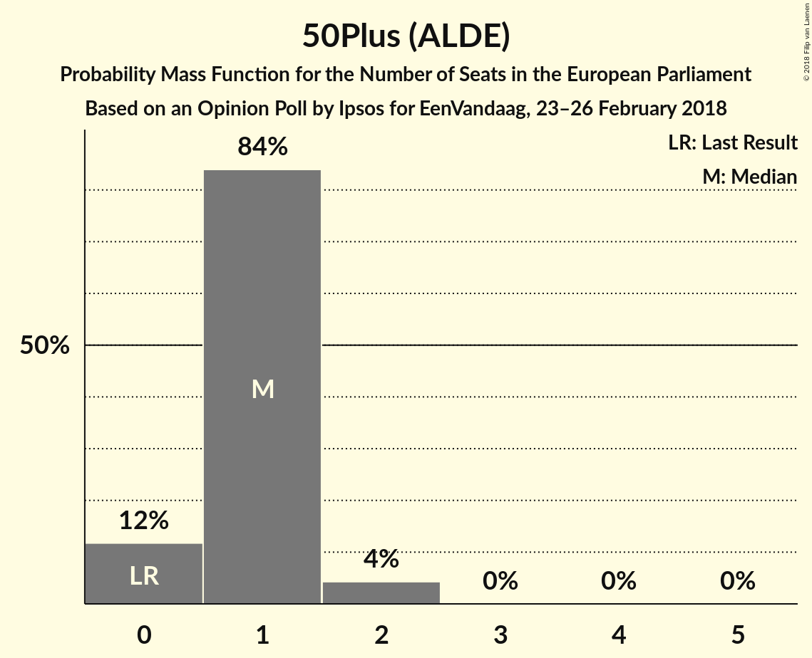

# Opinion Poll by Ipsos for EenVandaag, 23–26 February 2018

<a href="#voting-intentions">Voting Intentions</a> | <a href="#seats">Seats</a> | <a href="#coalitions">Coalitions</a> | <a href="#technical-information">Technical Information</a>

## Voting Intentions

### Confidence Intervals

| Party | Last Result | Poll Result | 80% Confidence Interval | 90% Confidence Interval | 95% Confidence Interval | 99% Confidence Interval |
|:-----:|:-----------:|:-----------:|:-----------------------:|:-----------------------:|:-----------------------:|:-----------------------:|
| Volkspartij voor Vrijheid en Democratie (ALDE) | 12.0% | 19.9% | 18.4–21.6% |17.9–22.0% |17.5–22.5% |16.8–23.3% |
| Democraten 66 (ALDE) | 15.5% | 10.4% | 9.3–11.8% |9.0–12.1% |8.7–12.5% |8.2–13.1% |
| Christen-Democratisch Appèl (EPP) | 15.2% | 10.1% | 9.0–11.4% |8.7–11.8% |8.4–12.1% |7.9–12.8% |
| Partij voor de Vrijheid (ENF) | 13.3% | 9.7% | 8.6–11.0% |8.3–11.4% |8.1–11.7% |7.6–12.4% |
| GroenLinks (Greens/EFA) | 7.0% | 9.3% | 8.2–10.5% |7.9–10.9% |7.6–11.2% |7.1–11.8% |
| Socialistische Partij (GUE/NGL) | 9.6% | 8.3% | 7.3–9.5% |7.0–9.8% |6.8–10.1% |6.3–10.7% |
| Forum voor Democratie (—) | 0.0% | 7.7% | 6.7–8.9% |6.4–9.2% |6.2–9.5% |5.8–10.1% |
| Partij voor de Dieren (GUE/NGL) | 4.2% | 5.2% | 4.4–6.2% |4.1–6.4% |4.0–6.7% |3.6–7.2% |
| Partij van de Arbeid (S&D) | 9.4% | 5.1% | 4.3–6.1% |4.1–6.3% |3.9–6.6% |3.5–7.1% |
| 50Plus (ALDE) | 3.7% | 4.0% | 3.3–4.9% |3.1–5.2% |3.0–5.4% |2.7–5.9% |
| ChristenUnie (ECR) | 7.7% | 3.6% | 3.0–4.5% |2.8–4.7% |2.6–4.9% |2.3–5.4% |
| Denk (—) | 0.0% | 3.1% | 2.5–3.9% |2.3–4.2% |2.2–4.4% |2.0–4.8% |
| Staatkundig Gereformeerde Partij (ECR) | 7.7% | 2.3% | 1.8–3.1% |1.7–3.3% |1.6–3.5% |1.4–3.8% |

*Note:* The poll result column reflects the actual value used in the calculations. Published results may vary slightly, and in addition be rounded to fewer digits.

## Seats

### Confidence Intervals

| Party | Last Result | Median | 80% Confidence Interval | 90% Confidence Interval | 95% Confidence Interval | 99% Confidence Interval |
|:-----:|:-----------:|:------:|:-----------------------:|:-----------------------:|:-----------------------:|:-----------------------:|
| <a href="#volkspartij-voor-vrijheid-en-democratie-(alde)">Volkspartij voor Vrijheid en Democratie (ALDE)</a> | 3 | 7 | 7 |5–7 |5–7 |5–7 |
| <a href="#democraten-66-(alde)">Democraten 66 (ALDE)</a> | 4 | 4 | 3–4 |3–4 |3–4 |3–4 |
| <a href="#christen-democratisch-appèl-(epp)">Christen-Democratisch Appèl (EPP)</a> | 5 | 4 | 2–4 |2–4 |2–4 |2–4 |
| <a href="#partij-voor-de-vrijheid-(enf)">Partij voor de Vrijheid (ENF)</a> | 4 | 3 | 3 |3 |3 |3 |
| <a href="#groenlinks-(greens/efa)">GroenLinks (Greens/EFA)</a> | 2 | 3 | 3 |3–4 |3–4 |3–4 |
| <a href="#socialistische-partij-(gue/ngl)">Socialistische Partij (GUE/NGL)</a> | 2 | 3 | 2–3 |2–3 |2–3 |2–3 |
| <a href="#forum-voor-democratie-(—)">Forum voor Democratie (—)</a> | 0 | 2 | 2 |2–3 |2–3 |2–3 |
| <a href="#partij-voor-de-dieren-(gue/ngl)">Partij voor de Dieren (GUE/NGL)</a> | 1 | 1 | 1–2 |1–2 |1–2 |1–2 |
| <a href="#partij-van-de-arbeid-(s&d)">Partij van de Arbeid (S&D)</a> | 3 | 1 | 1 |1 |1 |1 |
| <a href="#50plus-(alde)">50Plus (ALDE)</a> | 0 | 1 | 1 |1 |1 |1 |
| <a href="#christenunie-(ecr)">ChristenUnie (ECR)</a> | 1 | 0 | 0–1 |0–1 |0–1 |0–1 |
| <a href="#denk-(—)">Denk (—)</a> | 0 | 0 | 0–1 |0–1 |0–1 |0–1 |
| <a href="#staatkundig-gereformeerde-partij-(ecr)">Staatkundig Gereformeerde Partij (ECR)</a> | 1 | 0 | 0–1 |0–1 |0–1 |0–1 |

### Volkspartij voor Vrijheid en Democratie (ALDE)

*For a full overview of the results for this party, see the [Volkspartij voor Vrijheid en Democratie (ALDE)](party-volkspartijvoorvrijheidendemocratiealde.html) page.*

| Number of Seats | Probability | Accumulated | Special Marks |
|:---------------:|:-----------:|:-----------:|:-------------:|
| 3 | 0% | 100% | Last Result |
| 4 | 0% | 100% |  |
| 5 | 7% | 100% |  |
| 6 | 0.1% | 93% |  |
| 7 | 93% | 93% | Median |
| 8 | 0% | 0% |  |

### Democraten 66 (ALDE)

*For a full overview of the results for this party, see the [Democraten 66 (ALDE)](party-democraten66alde.html) page.*

| Number of Seats | Probability | Accumulated | Special Marks |
|:---------------:|:-----------:|:-----------:|:-------------:|
| 3 | 40% | 100% |  |
| 4 | 60% | 60% | Last Result, Median |
| 5 | 0% | 0% |  |

### Christen-Democratisch Appèl (EPP)

*For a full overview of the results for this party, see the [Christen-Democratisch Appèl (EPP)](party-christen-democratischappèlepp.html) page.*

| Number of Seats | Probability | Accumulated | Special Marks |
|:---------------:|:-----------:|:-----------:|:-------------:|
| 2 | 33% | 100% |  |
| 3 | 0% | 67% |  |
| 4 | 67% | 67% | Median |
| 5 | 0% | 0% | Last Result |

### Partij voor de Vrijheid (ENF)

*For a full overview of the results for this party, see the [Partij voor de Vrijheid (ENF)](party-partijvoordevrijheidenf.html) page.*

| Number of Seats | Probability | Accumulated | Special Marks |
|:---------------:|:-----------:|:-----------:|:-------------:|
| 3 | 100% | 100% | Median |
| 4 | 0% | 0% | Last Result |

### GroenLinks (Greens/EFA)

*For a full overview of the results for this party, see the [GroenLinks (Greens/EFA)](party-groenlinksgreensefa.html) page.*

| Number of Seats | Probability | Accumulated | Special Marks |
|:---------------:|:-----------:|:-----------:|:-------------:|
| 2 | 0% | 100% | Last Result |
| 3 | 93% | 100% | Median |
| 4 | 7% | 7% |  |
| 5 | 0% | 0% |  |

### Socialistische Partij (GUE/NGL)

*For a full overview of the results for this party, see the [Socialistische Partij (GUE/NGL)](party-socialistischepartijguengl.html) page.*

| Number of Seats | Probability | Accumulated | Special Marks |
|:---------------:|:-----------:|:-----------:|:-------------:|
| 2 | 40% | 100% | Last Result |
| 3 | 60% | 60% | Median |
| 4 | 0% | 0% |  |

### Forum voor Democratie (—)

*For a full overview of the results for this party, see the [Forum voor Democratie (—)](party-forumvoordemocratie—.html) page.*

| Number of Seats | Probability | Accumulated | Special Marks |
|:---------------:|:-----------:|:-----------:|:-------------:|
| 0 | 0% | 100% | Last Result |
| 1 | 0% | 100% |  |
| 2 | 93% | 100% | Median |
| 3 | 7% | 7% |  |
| 4 | 0% | 0% |  |

### Partij voor de Dieren (GUE/NGL)

*For a full overview of the results for this party, see the [Partij voor de Dieren (GUE/NGL)](party-partijvoordedierenguengl.html) page.*

| Number of Seats | Probability | Accumulated | Special Marks |
|:---------------:|:-----------:|:-----------:|:-------------:|
| 1 | 67% | 100% | Last Result, Median |
| 2 | 33% | 33% |  |
| 3 | 0% | 0% |  |

### Partij van de Arbeid (S&D)

*For a full overview of the results for this party, see the [Partij van de Arbeid (S&D)](party-partijvandearbeidsd.html) page.*

| Number of Seats | Probability | Accumulated | Special Marks |
|:---------------:|:-----------:|:-----------:|:-------------:|
| 1 | 100% | 100% | Median |
| 2 | 0% | 0% |  |
| 3 | 0% | 0% | Last Result |

### 50Plus (ALDE)

*For a full overview of the results for this party, see the [50Plus (ALDE)](party-50plusalde.html) page.*

| Number of Seats | Probability | Accumulated | Special Marks |
|:---------------:|:-----------:|:-----------:|:-------------:|
| 0 | 0% | 100% | Last Result |
| 1 | 100% | 100% | Median |

### ChristenUnie (ECR)

*For a full overview of the results for this party, see the [ChristenUnie (ECR)](party-christenunieecr.html) page.*

| Number of Seats | Probability | Accumulated | Special Marks |
|:---------------:|:-----------:|:-----------:|:-------------:|
| 0 | 60% | 100% | Median |
| 1 | 40% | 40% | Last Result |
| 2 | 0% | 0% |  |

### Denk (—)

*For a full overview of the results for this party, see the [Denk (—)](party-denk—.html) page.*

| Number of Seats | Probability | Accumulated | Special Marks |
|:---------------:|:-----------:|:-----------:|:-------------:|
| 0 | 60% | 100% | Last Result, Median |
| 1 | 40% | 40% |  |
| 2 | 0% | 0% |  |

### Staatkundig Gereformeerde Partij (ECR)

*For a full overview of the results for this party, see the [Staatkundig Gereformeerde Partij (ECR)](party-staatkundiggereformeerdepartijecr.html) page.*

| Number of Seats | Probability | Accumulated | Special Marks |
|:---------------:|:-----------:|:-----------:|:-------------:|
| 0 | 67% | 100% | Median |
| 1 | 33% | 33% | Last Result |
| 2 | 0% | 0% |  |

## Coalitions

### Confidence Intervals

| Coalition | Last Result | Median | Majority? | 80% Confidence Interval | 90% Confidence Interval | 95% Confidence Interval | 99% Confidence Interval |
|:---------:|:-----------:|:------:|:---------:|:-----------------------:|:-----------------------:|:-----------------------:|:-----------------------:|
| Volkspartij voor Vrijheid en Democratie (ALDE) – Democraten 66 (ALDE) – 50Plus (ALDE) | 7 | 12 | 0% | 11–12 | 9–12 | 9–12 | 9–12 |
| Socialistische Partij (GUE/NGL) – Partij voor de Dieren (GUE/NGL) | 3 | 4 | 0% | 4 | 3–4 | 3–4 | 3–4 |
| Christen-Democratisch Appèl (EPP) | 5 | 4 | 0% | 2–4 | 2–4 | 2–4 | 2–4 |
| Partij voor de Vrijheid (ENF) | 4 | 3 | 0% | 3 | 3 | 3 | 3 |
| ChristenUnie (ECR) – Staatkundig Gereformeerde Partij (ECR) | 2 | 0 | 0% | 0–2 | 0–2 | 0–2 | 0–2 |
| Partij van de Arbeid (S&D) | 3 | 1 | 0% | 1 | 1 | 1 | 1 |

### Volkspartij voor Vrijheid en Democratie (ALDE) – Democraten 66 (ALDE) – 50Plus (ALDE)

| Number of Seats | Probability | Accumulated | Special Marks |
|:---------------:|:-----------:|:-----------:|:-------------:|
| 7 | 0% | 100% | Last Result |
| 8 | 0% | 100% |  |
| 9 | 7% | 100% |  |
| 10 | 0.1% | 93% |  |
| 11 | 33% | 93% |  |
| 12 | 60% | 60% | Median |
| 13 | 0% | 0% |  |

### Socialistische Partij (GUE/NGL) – Partij voor de Dieren (GUE/NGL)

| Number of Seats | Probability | Accumulated | Special Marks |
|:---------------:|:-----------:|:-----------:|:-------------:|
| 3 | 7% | 100% | Last Result |
| 4 | 93% | 93% | Median |
| 5 | 0% | 0% |  |

### Christen-Democratisch Appèl (EPP)

| Number of Seats | Probability | Accumulated | Special Marks |
|:---------------:|:-----------:|:-----------:|:-------------:|
| 2 | 33% | 100% |  |
| 3 | 0% | 67% |  |
| 4 | 67% | 67% | Median |
| 5 | 0% | 0% | Last Result |

### Partij voor de Vrijheid (ENF)

| Number of Seats | Probability | Accumulated | Special Marks |
|:---------------:|:-----------:|:-----------:|:-------------:|
| 3 | 100% | 100% | Median |
| 4 | 0% | 0% | Last Result |

### ChristenUnie (ECR) – Staatkundig Gereformeerde Partij (ECR)

| Number of Seats | Probability | Accumulated | Special Marks |
|:---------------:|:-----------:|:-----------:|:-------------:|
| 0 | 60% | 100% | Median |
| 1 | 7% | 40% |  |
| 2 | 33% | 33% | Last Result |
| 3 | 0% | 0% |  |

### Partij van de Arbeid (S&D)

| Number of Seats | Probability | Accumulated | Special Marks |
|:---------------:|:-----------:|:-----------:|:-------------:|
| 1 | 100% | 100% | Median |
| 2 | 0% | 0% |  |
| 3 | 0% | 0% | Last Result |

## Technical Information

### Opinion Poll

+ **Polling firm:** Ipsos
+ **Commissioner(s):** EenVandaag
+ **Fieldwork period:** 23–26 February 2018

### Calculations

+ **Sample size:** 1026
+ **Simulations done:** 1,024
+ **Error estimate:** 3.98%

