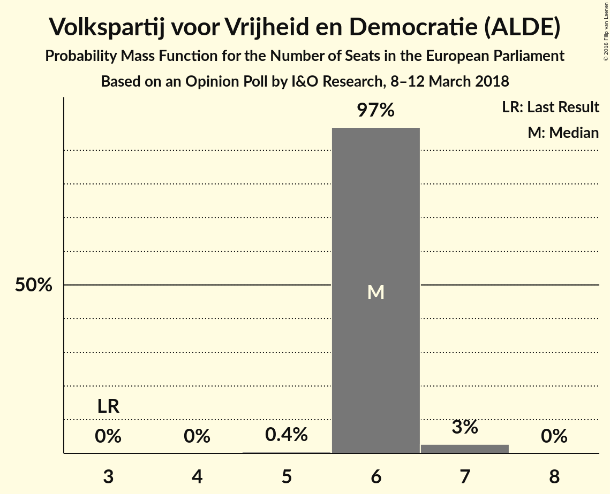
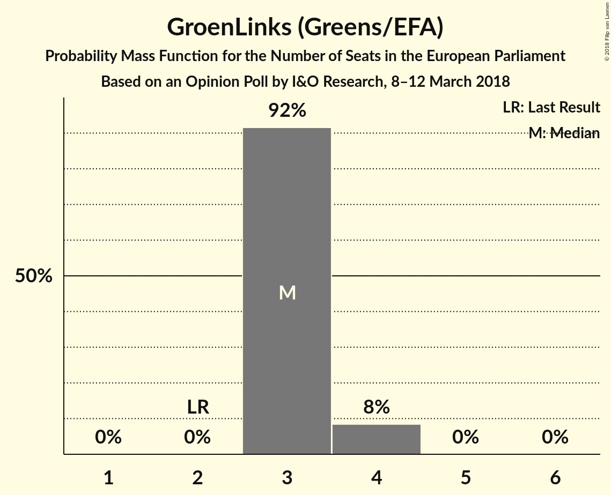
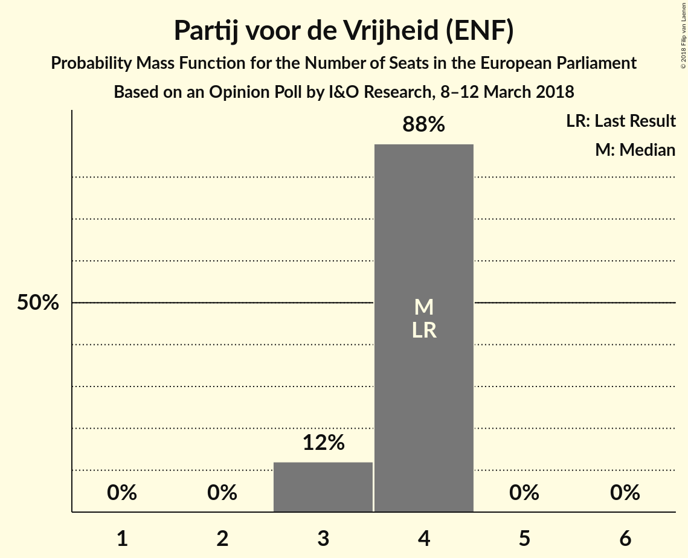
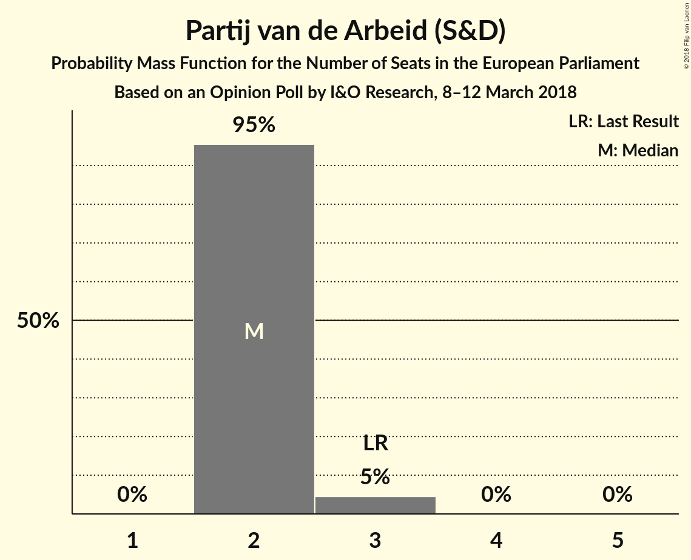
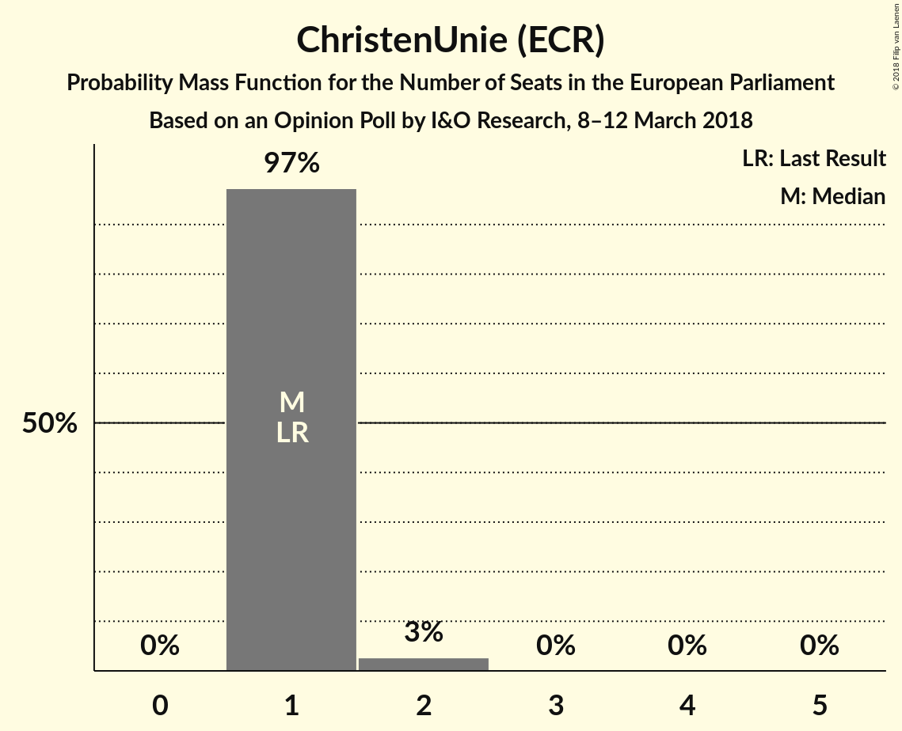
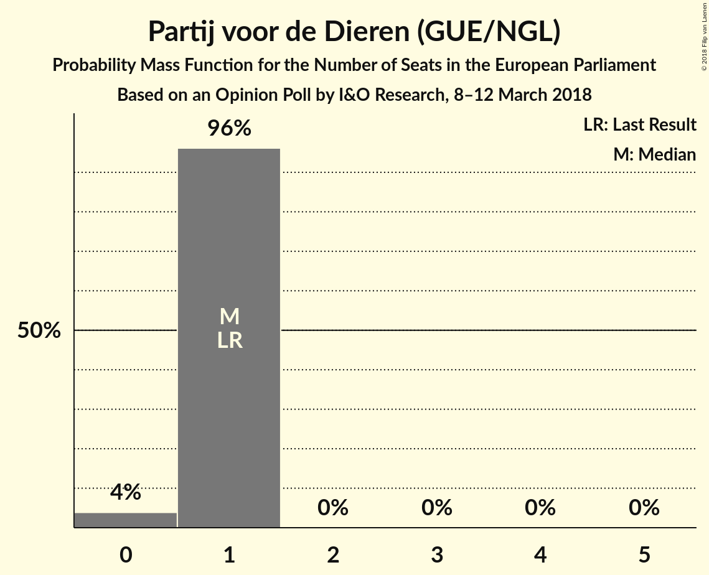
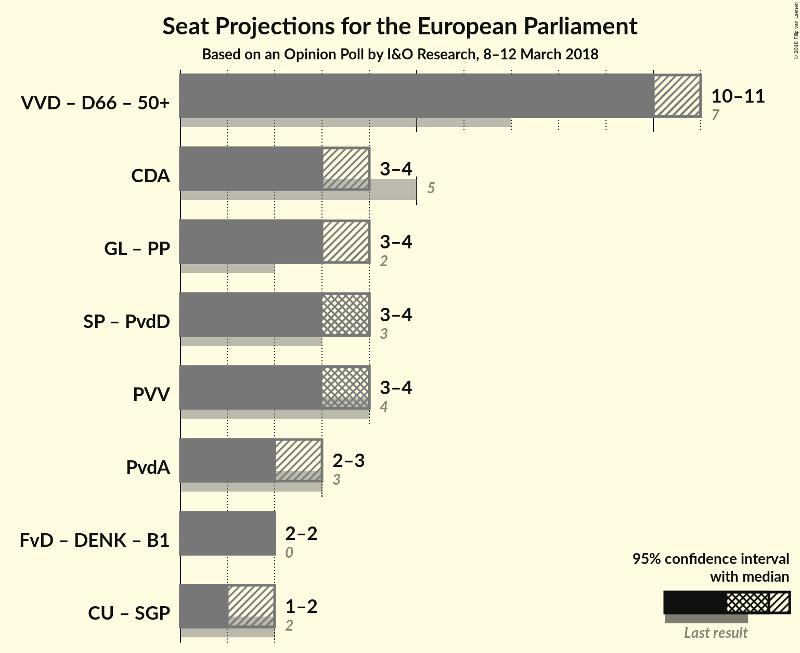

# Opinion Poll by I&O Research, 8–12 March 2018

<a href="#voting-intentions">Voting Intentions</a> | <a href="#seats">Seats</a> | <a href="#coalitions">Coalitions</a> | <a href="#technical-information">Technical Information</a>

## Voting Intentions

### Confidence Intervals

| Party | Last Result | Poll Result | 80% Confidence Interval | 90% Confidence Interval | 95% Confidence Interval | 99% Confidence Interval |
|:-----:|:-----------:|:-----------:|:-----------------------:|:-----------------------:|:-----------------------:|:-----------------------:|
| Volkspartij voor Vrijheid en Democratie (ALDE) | 12.0% | 17.7% | 16.9–18.6% |16.6–18.8% |16.4–19.0% |16.0–19.4% |
| GroenLinks (Greens/EFA) | 7.0% | 10.7% | 10.0–11.4% |9.8–11.6% |9.7–11.8% |9.4–12.1% |
| Partij voor de Vrijheid (ENF) | 13.3% | 10.5% | 9.8–11.2% |9.6–11.4% |9.5–11.6% |9.2–11.9% |
| Christen-Democratisch Appèl (EPP) | 15.2% | 10.5% | 9.8–11.2% |9.6–11.4% |9.5–11.6% |9.2–11.9% |
| Democraten 66 (ALDE) | 15.5% | 10.2% | 9.5–10.9% |9.4–11.1% |9.2–11.3% |8.9–11.6% |
| Socialistische Partij (GUE/NGL) | 9.6% | 8.4% | 7.8–9.1% |7.7–9.3% |7.5–9.4% |7.2–9.7% |
| Partij van de Arbeid (S&D) | 9.4% | 7.6% | 7.1–8.2% |6.9–8.4% |6.8–8.6% |6.5–8.9% |
| Forum voor Democratie (ECR) | 0.0% | 6.8% | 6.3–7.4% |6.1–7.6% |6.0–7.7% |5.8–8.0% |
| ChristenUnie (ECR) | 7.7% | 5.0% | 4.6–5.5% |4.4–5.7% |4.3–5.8% |4.1–6.1% |
| 50Plus (ALDE) | 3.7% | 4.2% | 3.8–4.7% |3.7–4.8% |3.6–5.0% |3.4–5.2% |
| Partij voor de Dieren (GUE/NGL) | 4.2% | 3.6% | 3.2–4.1% |3.1–4.2% |3.0–4.3% |2.9–4.5% |
| Staatkundig Gereformeerde Partij (ECR) | 7.7% | 2.3% | 2.0–2.7% |1.9–2.8% |1.8–2.9% |1.7–3.1% |
| Denk (*) | 0.0% | 2.0% | 1.7–2.4% |1.6–2.5% |1.6–2.6% |1.5–2.7% |

*Note:* The poll result column reflects the actual value used in the calculations. Published results may vary slightly, and in addition be rounded to fewer digits.

## Seats

### Confidence Intervals

| Party | Last Result | Median | 80% Confidence Interval | 90% Confidence Interval | 95% Confidence Interval | 99% Confidence Interval |
|:-----:|:-----------:|:------:|:-----------------------:|:-----------------------:|:-----------------------:|:-----------------------:|
| <a href="#volkspartij-voor-vrijheid-en-democratie-(alde)">Volkspartij voor Vrijheid en Democratie (ALDE)</a> | 3 | 6 | 6 |6 |6–7 |6–7 |
| <a href="#groenlinks-(greens/efa)">GroenLinks (Greens/EFA)</a> | 2 | 3 | 3 |3–4 |3–4 |3–4 |
| <a href="#partij-voor-de-vrijheid-(enf)">Partij voor de Vrijheid (ENF)</a> | 4 | 4 | 3–4 |3–4 |3–4 |3–4 |
| <a href="#christen-democratisch-appèl-(epp)">Christen-Democratisch Appèl (EPP)</a> | 5 | 3 | 3 |3 |3–4 |3–4 |
| <a href="#democraten-66-(alde)">Democraten 66 (ALDE)</a> | 4 | 3 | 3 |3 |3 |3–4 |
| <a href="#socialistische-partij-(gue/ngl)">Socialistische Partij (GUE/NGL)</a> | 2 | 3 | 3 |2–3 |2–3 |2–3 |
| <a href="#partij-van-de-arbeid-(s&d)">Partij van de Arbeid (S&D)</a> | 3 | 2 | 2 |2 |2–3 |2–3 |
| <a href="#forum-voor-democratie-(ecr)">Forum voor Democratie (ECR)</a> | 0 | 2 | 2 |2 |2 |2 |
| <a href="#christenunie-(ecr)">ChristenUnie (ECR)</a> | 1 | 1 | 1 |1 |1–2 |1–2 |
| <a href="#50plus-(alde)">50Plus (ALDE)</a> | 0 | 1 | 1 |1 |1 |0–1 |
| <a href="#partij-voor-de-dieren-(gue/ngl)">Partij voor de Dieren (GUE/NGL)</a> | 1 | 1 | 1 |1 |0–1 |0–1 |
| <a href="#staatkundig-gereformeerde-partij-(ecr)">Staatkundig Gereformeerde Partij (ECR)</a> | 1 | 0 | 0 |0 |0 |0 |
| <a href="#denk-(*)">Denk (*)</a> | 0 | 0 | 0 |0 |0 |0 |

### Volkspartij voor Vrijheid en Democratie (ALDE)

*For a full overview of the results for this party, see the [Volkspartij voor Vrijheid en Democratie (ALDE)](party-volkspartijvoorvrijheidendemocratiealde.html) page.*

| Number of Seats | Probability | Accumulated | Special Marks |
|:---------------:|:-----------:|:-----------:|:-------------:|
| 3 | 0% | 100% | Last Result |
| 4 | 0% | 100% |  |
| 5 | 0.4% | 100% |  |
| 6 | 97% | 99.6% | Median |
| 7 | 3% | 3% |  |
| 8 | 0% | 0% |  |

### GroenLinks (Greens/EFA)

*For a full overview of the results for this party, see the [GroenLinks (Greens/EFA)](party-groenlinksgreensefa.html) page.*

| Number of Seats | Probability | Accumulated | Special Marks |
|:---------------:|:-----------:|:-----------:|:-------------:|
| 2 | 0% | 100% | Last Result |
| 3 | 92% | 100% | Median |
| 4 | 8% | 8% |  |
| 5 | 0% | 0% |  |

### Partij voor de Vrijheid (ENF)

*For a full overview of the results for this party, see the [Partij voor de Vrijheid (ENF)](party-partijvoordevrijheidenf.html) page.*

| Number of Seats | Probability | Accumulated | Special Marks |
|:---------------:|:-----------:|:-----------:|:-------------:|
| 3 | 12% | 100% |  |
| 4 | 88% | 88% | Last Result, Median |
| 5 | 0% | 0% |  |

### Christen-Democratisch Appèl (EPP)

*For a full overview of the results for this party, see the [Christen-Democratisch Appèl (EPP)](party-christen-democratischappèlepp.html) page.*

| Number of Seats | Probability | Accumulated | Special Marks |
|:---------------:|:-----------:|:-----------:|:-------------:|
| 3 | 97% | 100% | Median |
| 4 | 3% | 3% |  |
| 5 | 0% | 0% | Last Result |

### Democraten 66 (ALDE)

*For a full overview of the results for this party, see the [Democraten 66 (ALDE)](party-democraten66alde.html) page.*

| Number of Seats | Probability | Accumulated | Special Marks |
|:---------------:|:-----------:|:-----------:|:-------------:|
| 3 | 98.7% | 100% | Median |
| 4 | 1.3% | 1.3% | Last Result |
| 5 | 0% | 0% |  |

### Socialistische Partij (GUE/NGL)

*For a full overview of the results for this party, see the [Socialistische Partij (GUE/NGL)](party-socialistischepartijguengl.html) page.*

| Number of Seats | Probability | Accumulated | Special Marks |
|:---------------:|:-----------:|:-----------:|:-------------:|
| 2 | 6% | 100% | Last Result |
| 3 | 94% | 94% | Median |
| 4 | 0% | 0% |  |

### Partij van de Arbeid (S&D)

*For a full overview of the results for this party, see the [Partij van de Arbeid (S&D)](party-partijvandearbeidsd.html) page.*

| Number of Seats | Probability | Accumulated | Special Marks |
|:---------------:|:-----------:|:-----------:|:-------------:|
| 2 | 95% | 100% | Median |
| 3 | 5% | 5% | Last Result |
| 4 | 0% | 0% |  |

### Forum voor Democratie (ECR)

*For a full overview of the results for this party, see the [Forum voor Democratie (ECR)](party-forumvoordemocratieecr.html) page.*

| Number of Seats | Probability | Accumulated | Special Marks |
|:---------------:|:-----------:|:-----------:|:-------------:|
| 0 | 0% | 100% | Last Result |
| 1 | 0% | 100% |  |
| 2 | 99.8% | 100% | Median |
| 3 | 0.1% | 0.1% |  |
| 4 | 0% | 0% |  |

### ChristenUnie (ECR)

*For a full overview of the results for this party, see the [ChristenUnie (ECR)](party-christenunieecr.html) page.*

| Number of Seats | Probability | Accumulated | Special Marks |
|:---------------:|:-----------:|:-----------:|:-------------:|
| 1 | 97% | 100% | Last Result, Median |
| 2 | 3% | 3% |  |
| 3 | 0% | 0% |  |

### 50Plus (ALDE)

*For a full overview of the results for this party, see the [50Plus (ALDE)](party-50plusalde.html) page.*

| Number of Seats | Probability | Accumulated | Special Marks |
|:---------------:|:-----------:|:-----------:|:-------------:|
| 0 | 0.5% | 100% | Last Result |
| 1 | 99.4% | 99.5% | Median |
| 2 | 0% | 0% |  |

### Partij voor de Dieren (GUE/NGL)

*For a full overview of the results for this party, see the [Partij voor de Dieren (GUE/NGL)](party-partijvoordedierenguengl.html) page.*

| Number of Seats | Probability | Accumulated | Special Marks |
|:---------------:|:-----------:|:-----------:|:-------------:|
| 0 | 4% | 100% |  |
| 1 | 96% | 96% | Last Result, Median |
| 2 | 0% | 0% |  |

### Staatkundig Gereformeerde Partij (ECR)

*For a full overview of the results for this party, see the [Staatkundig Gereformeerde Partij (ECR)](party-staatkundiggereformeerdepartijecr.html) page.*

| Number of Seats | Probability | Accumulated | Special Marks |
|:---------------:|:-----------:|:-----------:|:-------------:|
| 0 | 100% | 100% | Median |
| 1 | 0% | 0% | Last Result |

### Denk (*)

*For a full overview of the results for this party, see the [Denk (*)](party-denk.html) page.*

| Number of Seats | Probability | Accumulated | Special Marks |
|:---------------:|:-----------:|:-----------:|:-------------:|
| 0 | 100% | 100% | Last Result, Median |

## Coalitions

### Confidence Intervals

| Coalition | Last Result | Median | Majority? | 80% Confidence Interval | 90% Confidence Interval | 95% Confidence Interval | 99% Confidence Interval |
|:---------:|:-----------:|:------:|:---------:|:-----------------------:|:-----------------------:|:-----------------------:|:-----------------------:|
| Volkspartij voor Vrijheid en Democratie (ALDE) – Democraten 66 (ALDE) – 50Plus (ALDE) | 7 | 10 | 0% | 10 | 10 | 10–11 | 9–11 |
| Christen-Democratisch Appèl (EPP) | 5 | 3 | 0% | 3 | 3 | 3–4 | 3–4 |
| Socialistische Partij (GUE/NGL) – Partij voor de Dieren (GUE/NGL) | 3 | 4 | 0% | 4 | 3–4 | 3–4 | 2–4 |
| Partij voor de Vrijheid (ENF) | 4 | 4 | 0% | 3–4 | 3–4 | 3–4 | 3–4 |
| Partij van de Arbeid (S&D) | 3 | 2 | 0% | 2 | 2 | 2–3 | 2–3 |
| ChristenUnie (ECR) – Staatkundig Gereformeerde Partij (ECR) | 2 | 1 | 0% | 1 | 1 | 1–2 | 1–2 |

### Volkspartij voor Vrijheid en Democratie (ALDE) – Democraten 66 (ALDE) – 50Plus (ALDE)

| Number of Seats | Probability | Accumulated | Special Marks |
|:---------------:|:-----------:|:-----------:|:-------------:|
| 7 | 0% | 100% | Last Result |
| 8 | 0% | 100% |  |
| 9 | 0.9% | 100% |  |
| 10 | 95% | 99.1% | Median |
| 11 | 3% | 4% |  |
| 12 | 0.3% | 0.3% |  |
| 13 | 0% | 0% |  |

### Christen-Democratisch Appèl (EPP)

| Number of Seats | Probability | Accumulated | Special Marks |
|:---------------:|:-----------:|:-----------:|:-------------:|
| 3 | 97% | 100% | Median |
| 4 | 3% | 3% |  |
| 5 | 0% | 0% | Last Result |

### Socialistische Partij (GUE/NGL) – Partij voor de Dieren (GUE/NGL)

| Number of Seats | Probability | Accumulated | Special Marks |
|:---------------:|:-----------:|:-----------:|:-------------:|
| 2 | 0.7% | 100% |  |
| 3 | 8% | 99.3% | Last Result |
| 4 | 91% | 91% | Median |
| 5 | 0% | 0% |  |

### Partij voor de Vrijheid (ENF)

| Number of Seats | Probability | Accumulated | Special Marks |
|:---------------:|:-----------:|:-----------:|:-------------:|
| 3 | 12% | 100% |  |
| 4 | 88% | 88% | Last Result, Median |
| 5 | 0% | 0% |  |

### Partij van de Arbeid (S&D)

| Number of Seats | Probability | Accumulated | Special Marks |
|:---------------:|:-----------:|:-----------:|:-------------:|
| 2 | 95% | 100% | Median |
| 3 | 5% | 5% | Last Result |
| 4 | 0% | 0% |  |

### ChristenUnie (ECR) – Staatkundig Gereformeerde Partij (ECR)

| Number of Seats | Probability | Accumulated | Special Marks |
|:---------------:|:-----------:|:-----------:|:-------------:|
| 1 | 97% | 100% | Median |
| 2 | 3% | 3% | Last Result |
| 3 | 0% | 0% |  |

## Technical Information

### Opinion Poll

+ **Polling firm:** I&O Research
+ **Commissioner(s):** —
+ **Fieldwork period:** 8–12 March 2018

### Calculations

+ **Sample size:** 3375
+ **Simulations done:** 1,048,576
+ **Error estimate:** 1.28%

