# Opinion Poll by Ipsos for EenVandaag, 19 March 2018

<a href="#voting-intentions">Voting Intentions</a> | <a href="#seats">Seats</a> | <a href="#coalitions">Coalitions</a> | <a href="#technical-information">Technical Information</a>

## Voting Intentions

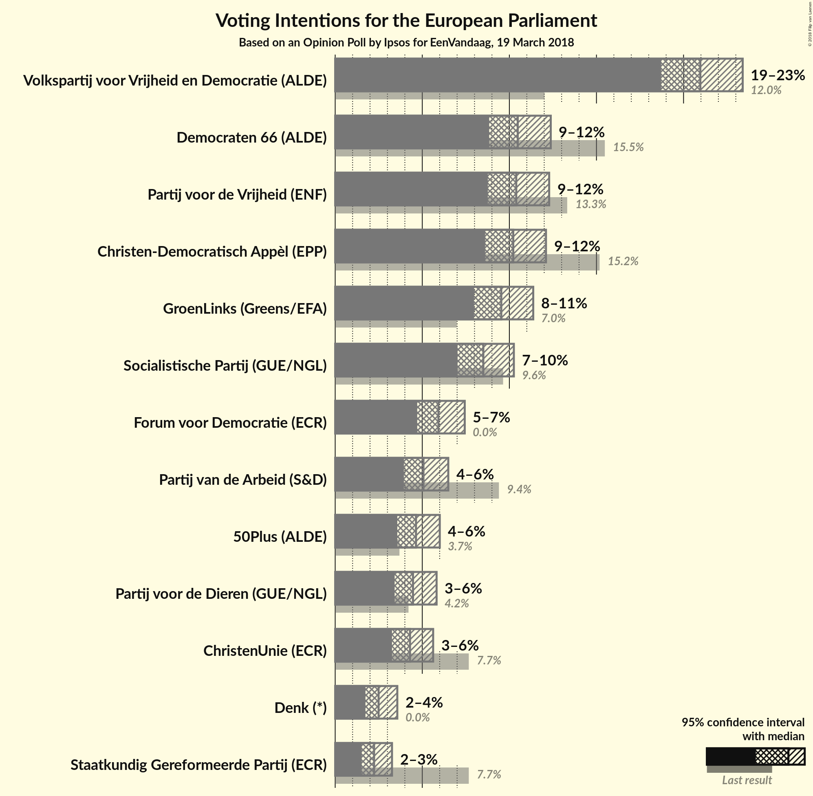

### Confidence Intervals

| Party | Last Result | Poll Result | 80% Confidence Interval | 90% Confidence Interval | 95% Confidence Interval | 99% Confidence Interval |
|:-----:|:-----------:|:-----------:|:-----------------------:|:-----------------------:|:-----------------------:|:-----------------------:|
| Volkspartij voor Vrijheid en Democratie (ALDE) | 12.0% | 21.0% | 19.5–22.6% |19.1–23.0% |18.7–23.4% |18.0–24.2% |
| Democraten 66 (ALDE) | 15.5% | 10.5% | 9.4–11.7% |9.1–12.1% |8.8–12.4% |8.4–13.0% |
| Partij voor de Vrijheid (ENF) | 13.3% | 10.4% | 9.3–11.6% |9.0–12.0% |8.8–12.3% |8.3–12.9% |
| Christen-Democratisch Appèl (EPP) | 15.2% | 10.2% | 9.2–11.4% |8.9–11.8% |8.6–12.1% |8.1–12.7% |
| GroenLinks (Greens/EFA) | 7.0% | 9.5% | 8.5–10.7% |8.2–11.1% |8.0–11.4% |7.5–12.0% |
| Socialistische Partij (GUE/NGL) | 9.6% | 8.5% | 7.5–9.6% |7.3–10.0% |7.0–10.3% |6.6–10.8% |
| Forum voor Democratie (*) | 0.0% | 5.9% | 5.1–6.9% |4.9–7.2% |4.7–7.4% |4.3–7.9% |
| Partij van de Arbeid (S&D) | 9.4% | 5.1% | 4.3–6.0% |4.1–6.3% |3.9–6.5% |3.6–7.0% |
| 50Plus (ALDE) | 3.7% | 4.6% | 3.9–5.5% |3.7–5.8% |3.6–6.0% |3.3–6.5% |
| Partij voor de Dieren (GUE/NGL) | 4.2% | 4.5% | 3.8–5.3% |3.6–5.6% |3.4–5.8% |3.1–6.3% |
| ChristenUnie (ECR) | 7.7% | 4.3% | 3.6–5.2% |3.4–5.4% |3.3–5.6% |3.0–6.1% |
| Denk (*) | 0.0% | 2.5% | 2.0–3.2% |1.9–3.4% |1.7–3.6% |1.5–3.9% |
| Staatkundig Gereformeerde Partij (ECR) | 7.7% | 2.2% | 1.8–2.9% |1.6–3.1% |1.5–3.3% |1.3–3.6% |

*Note:* The poll result column reflects the actual value used in the calculations. Published results may vary slightly, and in addition be rounded to fewer digits.

## Seats

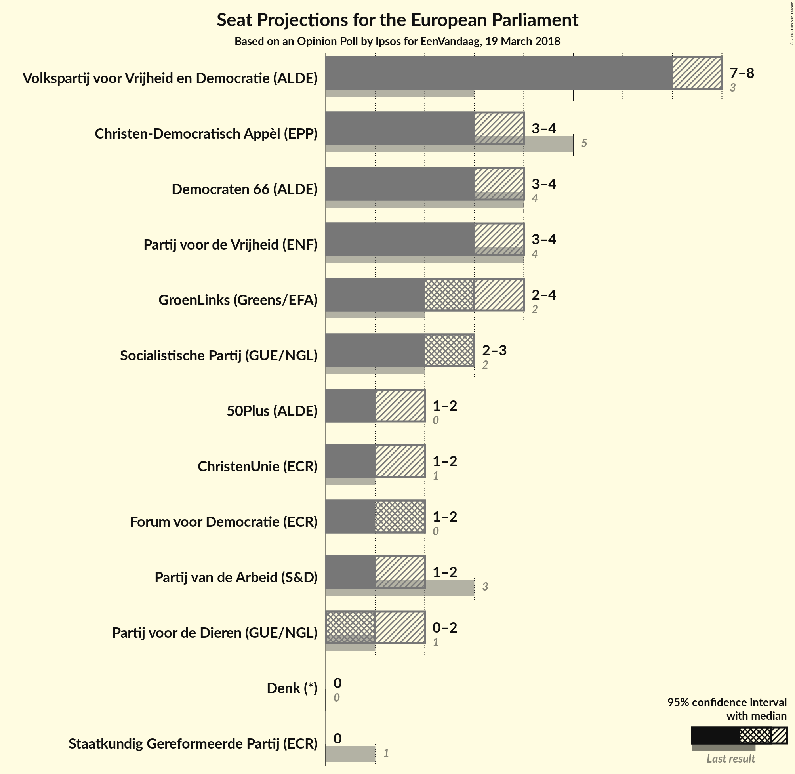

### Confidence Intervals

| Party | Last Result | Median | 80% Confidence Interval | 90% Confidence Interval | 95% Confidence Interval | 99% Confidence Interval |
|:-----:|:-----------:|:------:|:-----------------------:|:-----------------------:|:-----------------------:|:-----------------------:|
| <a href="#volkspartij-voor-vrijheid-en-democratie-(alde)">Volkspartij voor Vrijheid en Democratie (ALDE)</a> | 3 | 7 | 7–8 |7–8 |7–8 |6–8 |
| <a href="#democraten-66-(alde)">Democraten 66 (ALDE)</a> | 4 | 3 | 3–4 |3–4 |3–4 |3–4 |
| <a href="#partij-voor-de-vrijheid-(enf)">Partij voor de Vrijheid (ENF)</a> | 4 | 3 | 3–4 |3–4 |3–4 |3–4 |
| <a href="#christen-democratisch-appèl-(epp)">Christen-Democratisch Appèl (EPP)</a> | 5 | 3 | 3–4 |3–4 |3–4 |2–4 |
| <a href="#groenlinks-(greens/efa)">GroenLinks (Greens/EFA)</a> | 2 | 3 | 3–4 |2–4 |2–4 |2–4 |
| <a href="#socialistische-partij-(gue/ngl)">Socialistische Partij (GUE/NGL)</a> | 2 | 3 | 2–3 |2–3 |2–3 |2–4 |
| <a href="#forum-voor-democratie-(*)">Forum voor Democratie (*)</a> | 0 | 2 | 1–2 |1–2 |1–2 |1–3 |
| <a href="#partij-van-de-arbeid-(s&d)">Partij van de Arbeid (S&D)</a> | 3 | 1 | 1–2 |1–2 |1–2 |1–2 |
| <a href="#50plus-(alde)">50Plus (ALDE)</a> | 0 | 1 | 1 |1–2 |1–2 |0–2 |
| <a href="#partij-voor-de-dieren-(gue/ngl)">Partij voor de Dieren (GUE/NGL)</a> | 1 | 1 | 1 |1–2 |0–2 |0–2 |
| <a href="#christenunie-(ecr)">ChristenUnie (ECR)</a> | 1 | 1 | 1 |1–2 |1–2 |0–2 |
| <a href="#denk-(*)">Denk (*)</a> | 0 | 0 | 0 |0 |0 |0–1 |
| <a href="#staatkundig-gereformeerde-partij-(ecr)">Staatkundig Gereformeerde Partij (ECR)</a> | 1 | 0 | 0 |0 |0 |0 |

### Volkspartij voor Vrijheid en Democratie (ALDE)

*For a full overview of the results for this party, see the [Volkspartij voor Vrijheid en Democratie (ALDE)](party-volkspartijvoorvrijheidendemocratiealde.html) page.*

| Number of Seats | Probability | Accumulated | Special Marks |
|:---------------:|:-----------:|:-----------:|:-------------:|
| 3 | 0% | 100% | Last Result |
| 4 | 0% | 100% |  |
| 5 | 0% | 100% |  |
| 6 | 1.4% | 100% |  |
| 7 | 86% | 98.6% | Median |
| 8 | 13% | 13% |  |
| 9 | 0.2% | 0.2% |  |
| 10 | 0% | 0% |  |

### Democraten 66 (ALDE)

*For a full overview of the results for this party, see the [Democraten 66 (ALDE)](party-democraten66alde.html) page.*

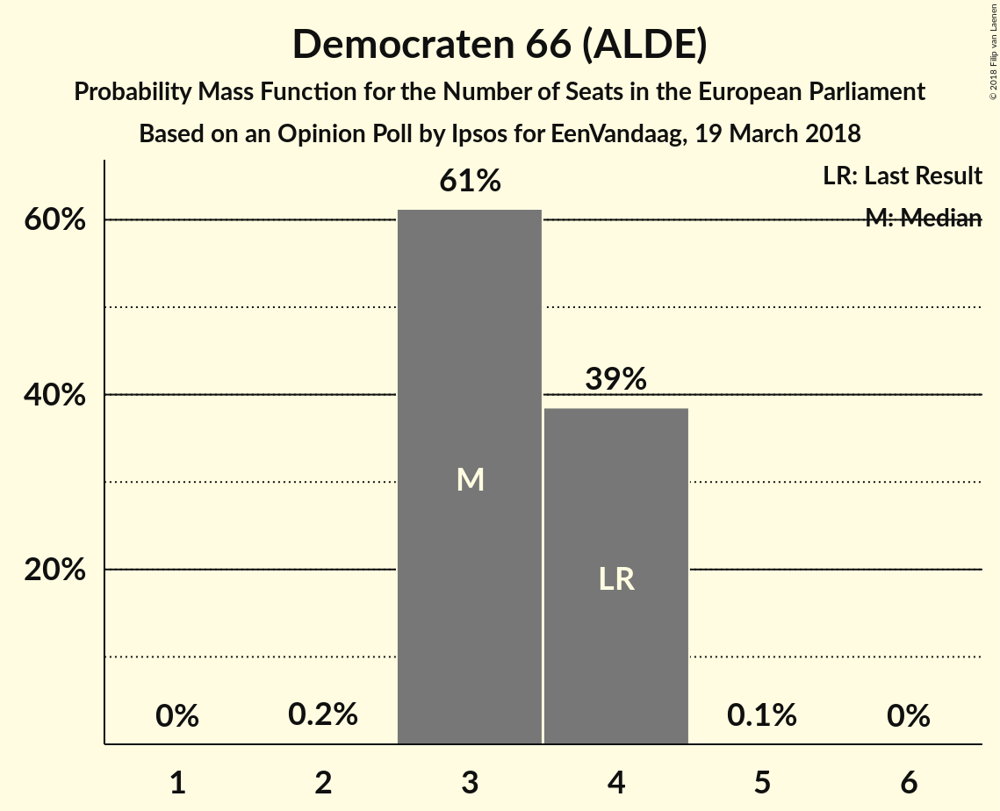

| Number of Seats | Probability | Accumulated | Special Marks |
|:---------------:|:-----------:|:-----------:|:-------------:|
| 2 | 0.2% | 100% |  |
| 3 | 61% | 99.8% | Median |
| 4 | 39% | 39% | Last Result |
| 5 | 0.1% | 0.1% |  |
| 6 | 0% | 0% |  |

### Partij voor de Vrijheid (ENF)

*For a full overview of the results for this party, see the [Partij voor de Vrijheid (ENF)](party-partijvoordevrijheidenf.html) page.*

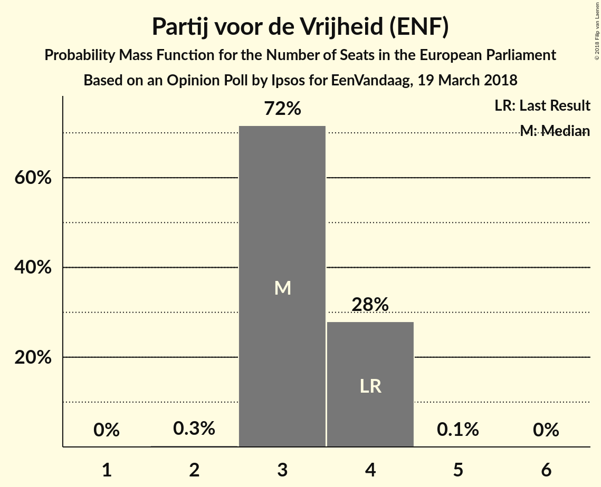

| Number of Seats | Probability | Accumulated | Special Marks |
|:---------------:|:-----------:|:-----------:|:-------------:|
| 2 | 0.3% | 100% |  |
| 3 | 72% | 99.7% | Median |
| 4 | 28% | 28% | Last Result |
| 5 | 0.1% | 0.1% |  |
| 6 | 0% | 0% |  |

### Christen-Democratisch Appèl (EPP)

*For a full overview of the results for this party, see the [Christen-Democratisch Appèl (EPP)](party-christen-democratischappèlepp.html) page.*

| Number of Seats | Probability | Accumulated | Special Marks |
|:---------------:|:-----------:|:-----------:|:-------------:|
| 2 | 0.5% | 100% |  |
| 3 | 84% | 99.5% | Median |
| 4 | 15% | 15% |  |
| 5 | 0% | 0% | Last Result |

### GroenLinks (Greens/EFA)

*For a full overview of the results for this party, see the [GroenLinks (Greens/EFA)](party-groenlinksgreensefa.html) page.*

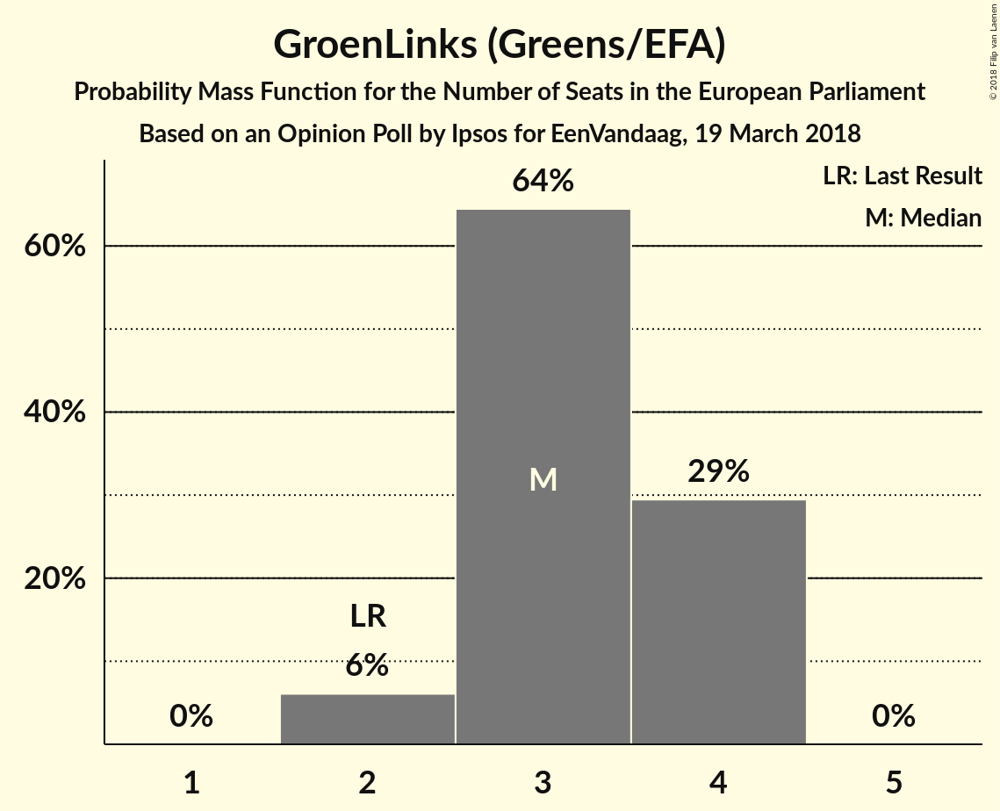

| Number of Seats | Probability | Accumulated | Special Marks |
|:---------------:|:-----------:|:-----------:|:-------------:|
| 2 | 6% | 100% | Last Result |
| 3 | 64% | 94% | Median |
| 4 | 29% | 29% |  |
| 5 | 0% | 0% |  |

### Socialistische Partij (GUE/NGL)

*For a full overview of the results for this party, see the [Socialistische Partij (GUE/NGL)](party-socialistischepartijguengl.html) page.*

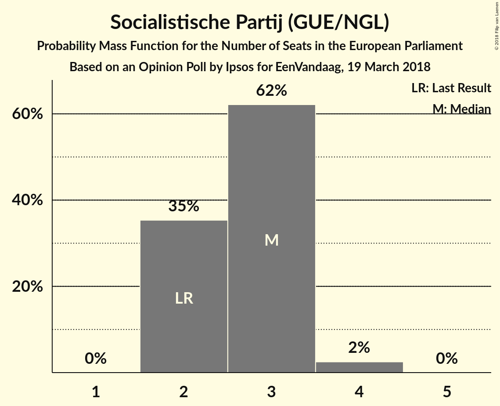

| Number of Seats | Probability | Accumulated | Special Marks |
|:---------------:|:-----------:|:-----------:|:-------------:|
| 2 | 35% | 100% | Last Result |
| 3 | 62% | 65% | Median |
| 4 | 2% | 2% |  |
| 5 | 0% | 0% |  |

### Forum voor Democratie (*)

*For a full overview of the results for this party, see the [Forum voor Democratie (*)](party-forumvoordemocratie.html) page.*

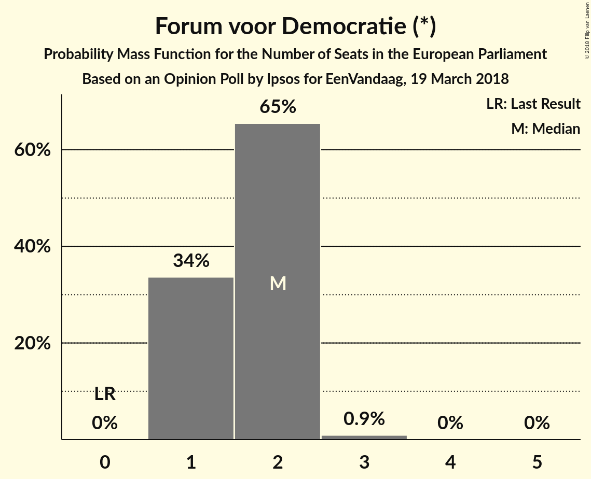

| Number of Seats | Probability | Accumulated | Special Marks |
|:---------------:|:-----------:|:-----------:|:-------------:|
| 0 | 0% | 100% | Last Result |
| 1 | 34% | 100% |  |
| 2 | 65% | 66% | Median |
| 3 | 0.9% | 0.9% |  |
| 4 | 0% | 0% |  |

### Partij van de Arbeid (S&D)

*For a full overview of the results for this party, see the [Partij van de Arbeid (S&D)](party-partijvandearbeidsd.html) page.*

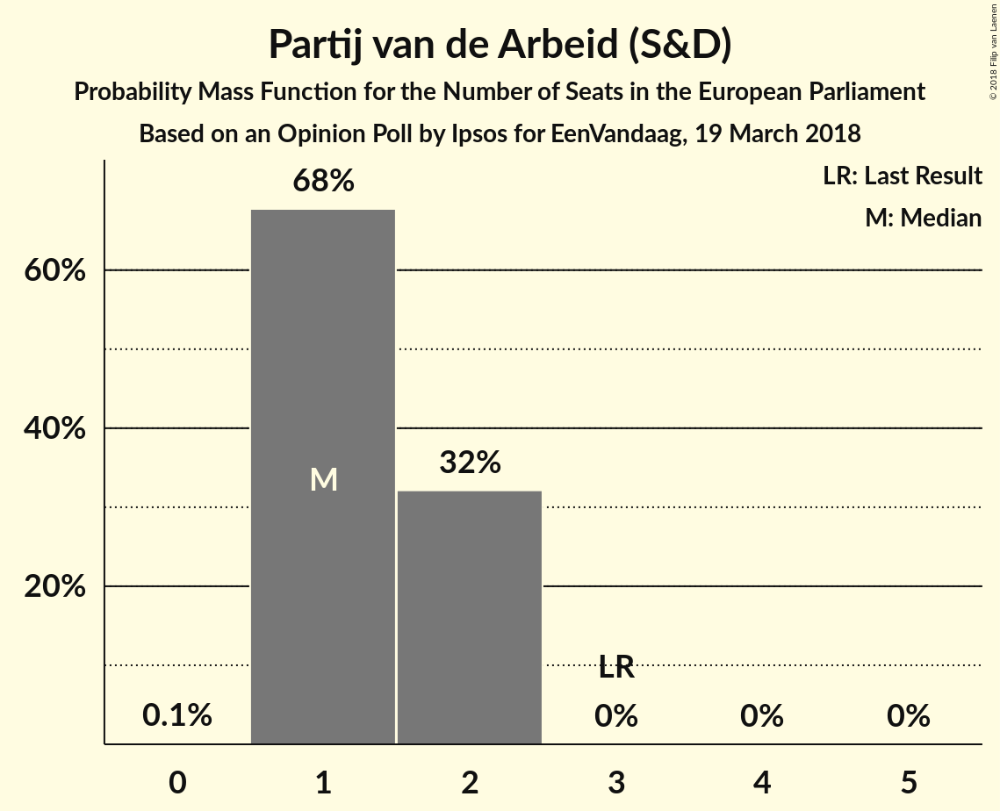

| Number of Seats | Probability | Accumulated | Special Marks |
|:---------------:|:-----------:|:-----------:|:-------------:|
| 0 | 0.1% | 100% |  |
| 1 | 68% | 99.9% | Median |
| 2 | 32% | 32% |  |
| 3 | 0% | 0% | Last Result |

### 50Plus (ALDE)

*For a full overview of the results for this party, see the [50Plus (ALDE)](party-50plusalde.html) page.*

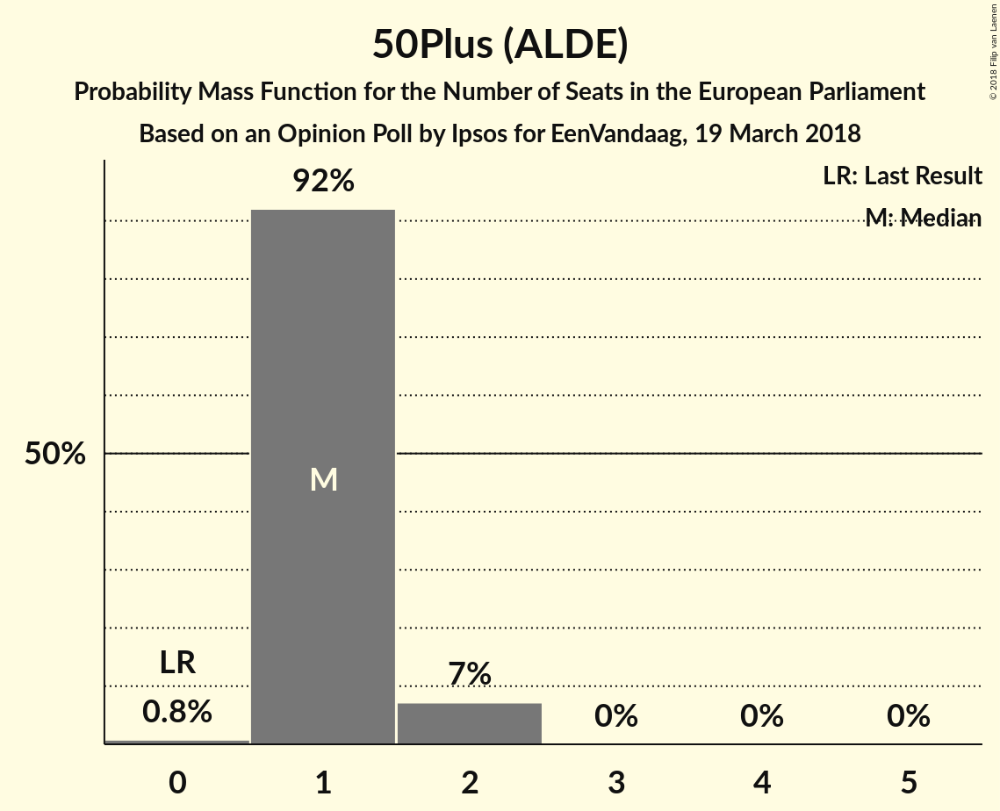

| Number of Seats | Probability | Accumulated | Special Marks |
|:---------------:|:-----------:|:-----------:|:-------------:|
| 0 | 0.8% | 100% | Last Result |
| 1 | 92% | 99.2% | Median |
| 2 | 7% | 7% |  |
| 3 | 0% | 0% |  |

### Partij voor de Dieren (GUE/NGL)

*For a full overview of the results for this party, see the [Partij voor de Dieren (GUE/NGL)](party-partijvoordedierenguengl.html) page.*

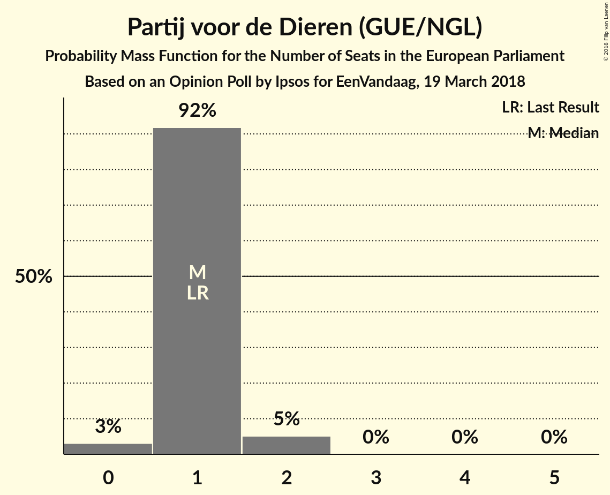

| Number of Seats | Probability | Accumulated | Special Marks |
|:---------------:|:-----------:|:-----------:|:-------------:|
| 0 | 3% | 100% |  |
| 1 | 92% | 97% | Last Result, Median |
| 2 | 5% | 5% |  |
| 3 | 0% | 0% |  |

### ChristenUnie (ECR)

*For a full overview of the results for this party, see the [ChristenUnie (ECR)](party-christenunieecr.html) page.*

| Number of Seats | Probability | Accumulated | Special Marks |
|:---------------:|:-----------:|:-----------:|:-------------:|
| 0 | 2% | 100% |  |
| 1 | 90% | 98% | Last Result, Median |
| 2 | 8% | 8% |  |
| 3 | 0% | 0% |  |

### Denk (*)

*For a full overview of the results for this party, see the [Denk (*)](party-denk.html) page.*

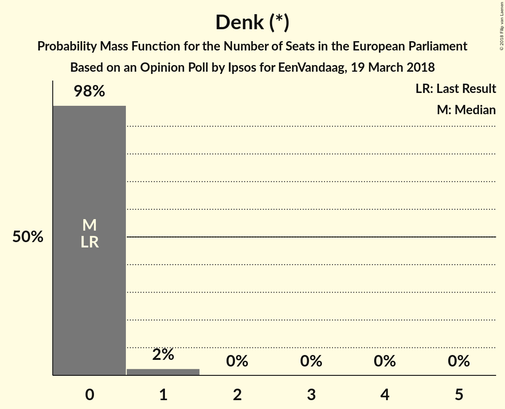

| Number of Seats | Probability | Accumulated | Special Marks |
|:---------------:|:-----------:|:-----------:|:-------------:|
| 0 | 98% | 100% | Last Result, Median |
| 1 | 2% | 2% |  |
| 2 | 0% | 0% |  |

### Staatkundig Gereformeerde Partij (ECR)

*For a full overview of the results for this party, see the [Staatkundig Gereformeerde Partij (ECR)](party-staatkundiggereformeerdepartijecr.html) page.*

| Number of Seats | Probability | Accumulated | Special Marks |
|:---------------:|:-----------:|:-----------:|:-------------:|
| 0 | 99.8% | 100% | Median |
| 1 | 0.2% | 0.2% | Last Result |
| 2 | 0% | 0% |  |

## Coalitions

### Confidence Intervals

| Coalition | Last Result | Median | Majority? | 80% Confidence Interval | 90% Confidence Interval | 95% Confidence Interval | 99% Confidence Interval |
|:---------:|:-----------:|:------:|:---------:|:-----------------------:|:-----------------------:|:-----------------------:|:-----------------------:|
| Volkspartij voor Vrijheid en Democratie (ALDE) – Democraten 66 (ALDE) – 50Plus (ALDE) | 7 | 12 | 0% | 11–12 | 11–13 | 11–13 | 10–13 |
| Socialistische Partij (GUE/NGL) – Partij voor de Dieren (GUE/NGL) | 3 | 4 | 0% | 3–4 | 3–4 | 3–5 | 3–5 |
| Christen-Democratisch Appèl (EPP) | 5 | 3 | 0% | 3–4 | 3–4 | 3–4 | 2–4 |
| Partij voor de Vrijheid (ENF) | 4 | 3 | 0% | 3–4 | 3–4 | 3–4 | 3–4 |
| ChristenUnie (ECR) – Staatkundig Gereformeerde Partij (ECR) | 2 | 1 | 0% | 1 | 1–2 | 1–2 | 0–2 |
| Partij van de Arbeid (S&D) | 3 | 1 | 0% | 1–2 | 1–2 | 1–2 | 1–2 |

### Volkspartij voor Vrijheid en Democratie (ALDE) – Democraten 66 (ALDE) – 50Plus (ALDE)

| Number of Seats | Probability | Accumulated | Special Marks |
|:---------------:|:-----------:|:-----------:|:-------------:|
| 7 | 0% | 100% | Last Result |
| 8 | 0% | 100% |  |
| 9 | 0% | 100% |  |
| 10 | 0.7% | 100% |  |
| 11 | 48% | 99.3% | Median |
| 12 | 46% | 52% |  |
| 13 | 6% | 6% |  |
| 14 | 0.1% | 0.1% |  |
| 15 | 0% | 0% | Majority |

### Socialistische Partij (GUE/NGL) – Partij voor de Dieren (GUE/NGL)

| Number of Seats | Probability | Accumulated | Special Marks |
|:---------------:|:-----------:|:-----------:|:-------------:|
| 2 | 0.3% | 100% |  |
| 3 | 33% | 99.7% | Last Result |
| 4 | 63% | 66% | Median |
| 5 | 3% | 3% |  |
| 6 | 0% | 0% |  |

### Christen-Democratisch Appèl (EPP)

| Number of Seats | Probability | Accumulated | Special Marks |
|:---------------:|:-----------:|:-----------:|:-------------:|
| 2 | 0.5% | 100% |  |
| 3 | 84% | 99.5% | Median |
| 4 | 15% | 15% |  |
| 5 | 0% | 0% | Last Result |

### Partij voor de Vrijheid (ENF)

| Number of Seats | Probability | Accumulated | Special Marks |
|:---------------:|:-----------:|:-----------:|:-------------:|
| 2 | 0.3% | 100% |  |
| 3 | 72% | 99.7% | Median |
| 4 | 28% | 28% | Last Result |
| 5 | 0.1% | 0.1% |  |
| 6 | 0% | 0% |  |

### ChristenUnie (ECR) – Staatkundig Gereformeerde Partij (ECR)

| Number of Seats | Probability | Accumulated | Special Marks |
|:---------------:|:-----------:|:-----------:|:-------------:|
| 0 | 2% | 100% |  |
| 1 | 90% | 98% | Median |
| 2 | 8% | 8% | Last Result |
| 3 | 0% | 0% |  |

### Partij van de Arbeid (S&D)

| Number of Seats | Probability | Accumulated | Special Marks |
|:---------------:|:-----------:|:-----------:|:-------------:|
| 0 | 0.1% | 100% |  |
| 1 | 68% | 99.9% | Median |
| 2 | 32% | 32% |  |
| 3 | 0% | 0% | Last Result |

## Technical Information

### Opinion Poll

+ **Polling firm:** Ipsos
+ **Commissioner(s):** EenVandaag
+ **Fieldwork period:** 19 March 2018

### Calculations

+ **Sample size:** 1164
+ **Simulations done:** 1,048,576
+ **Error estimate:** 2.58%

