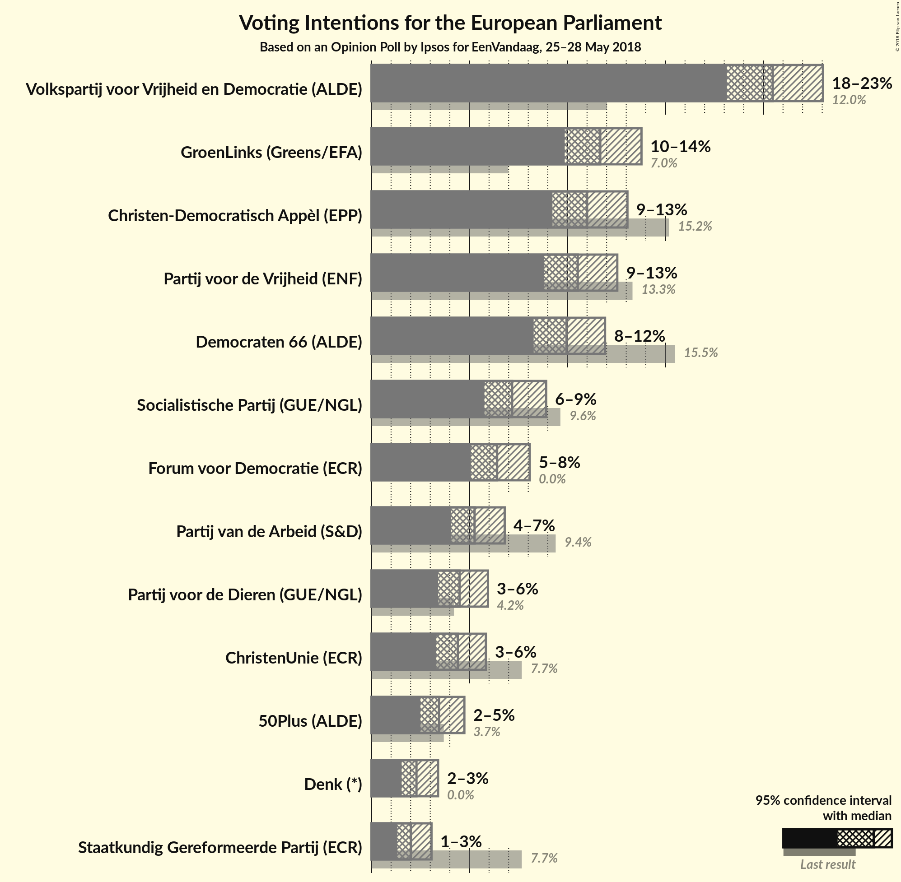
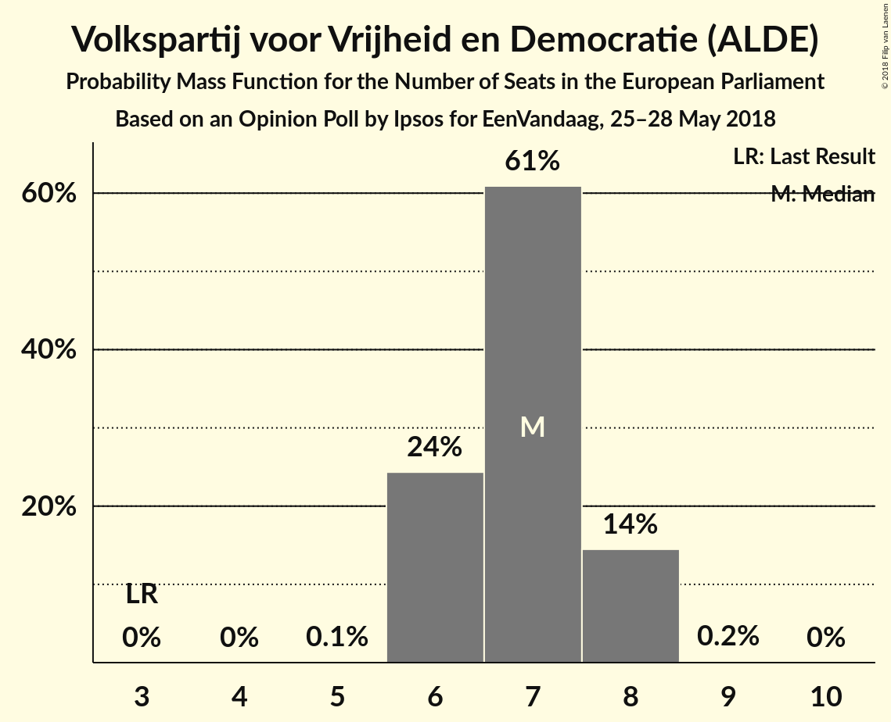
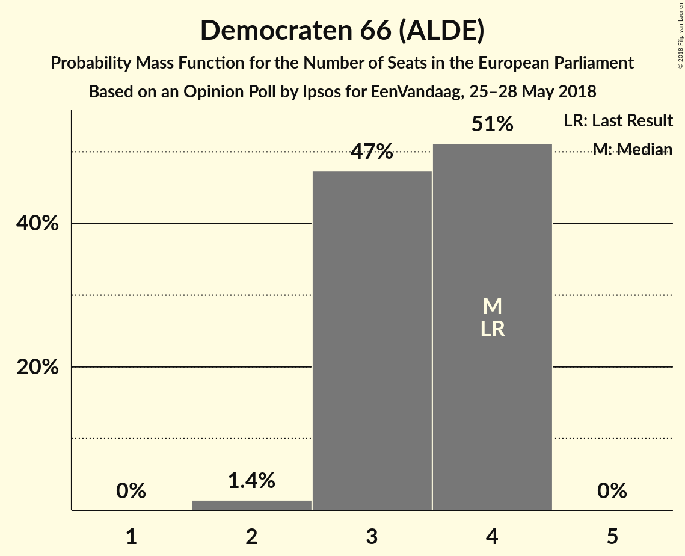
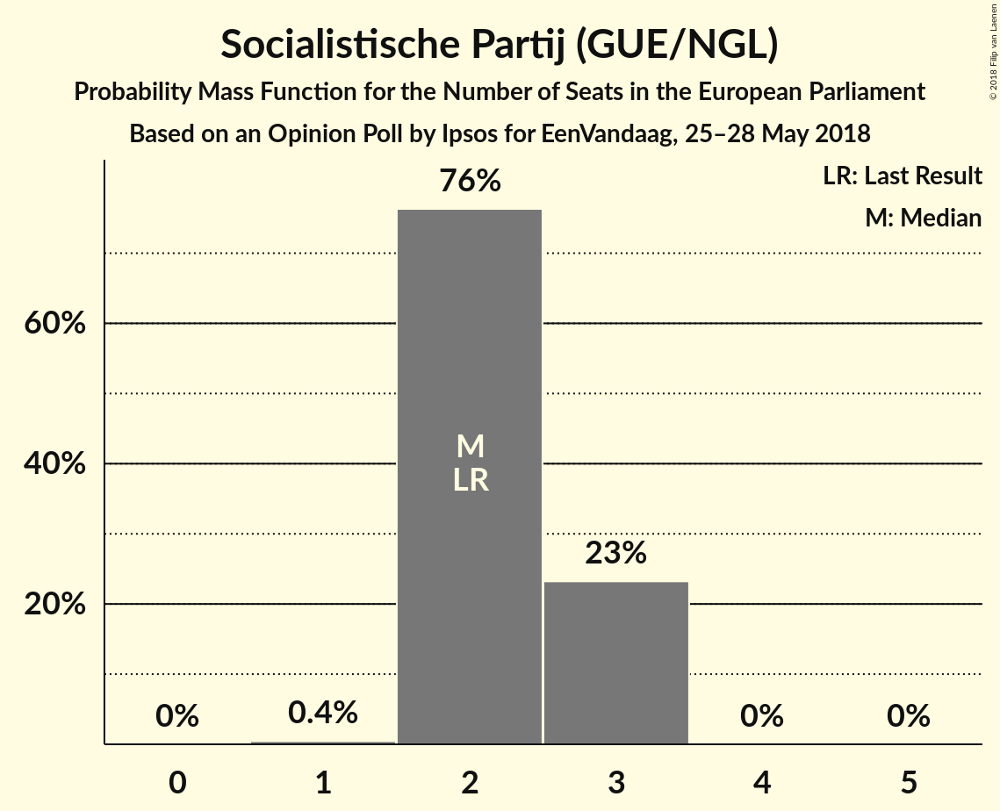
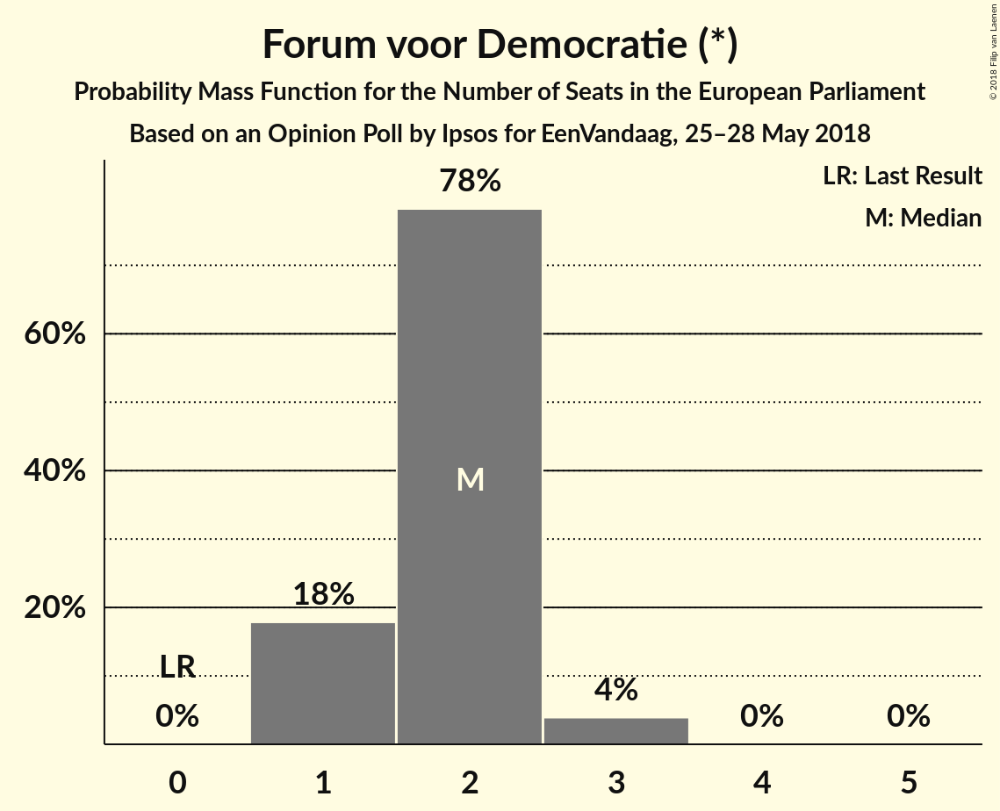
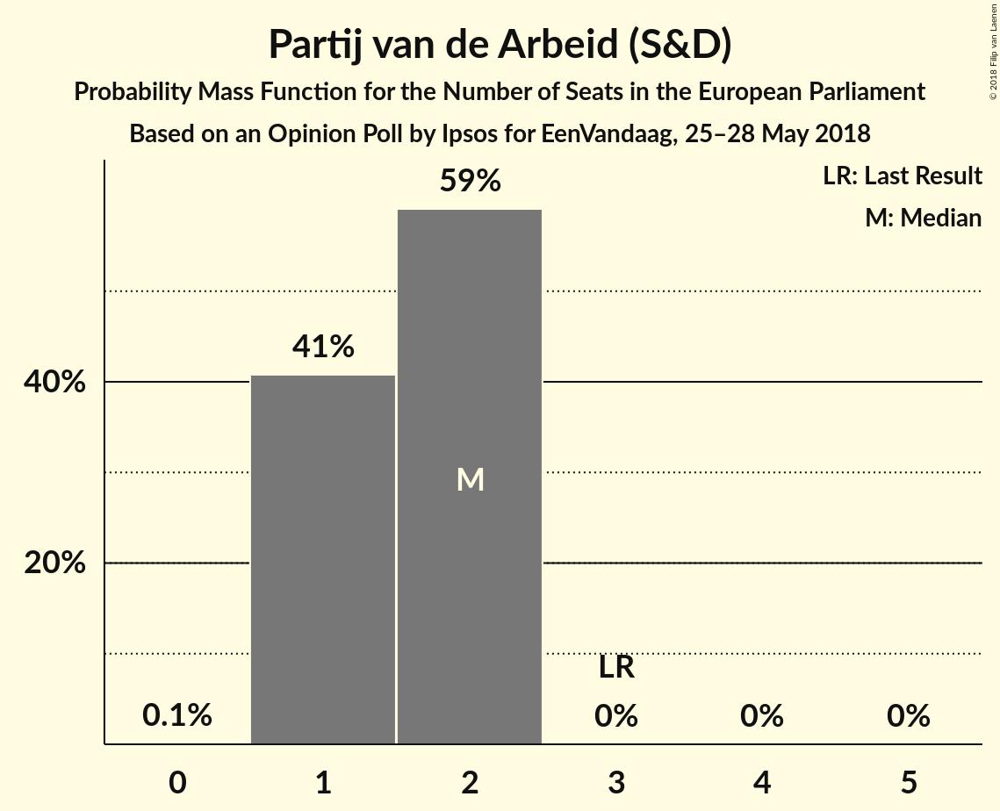
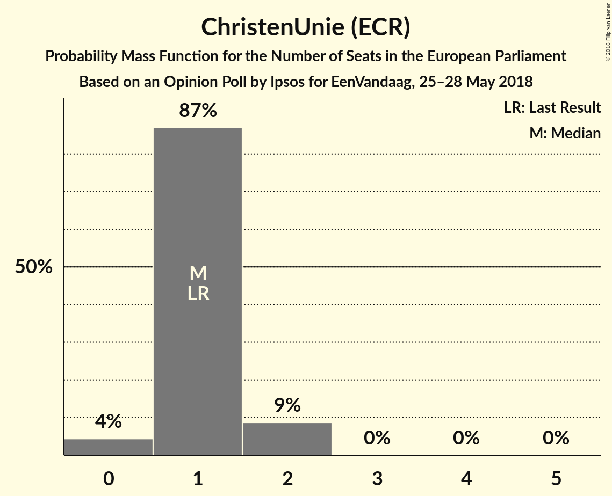
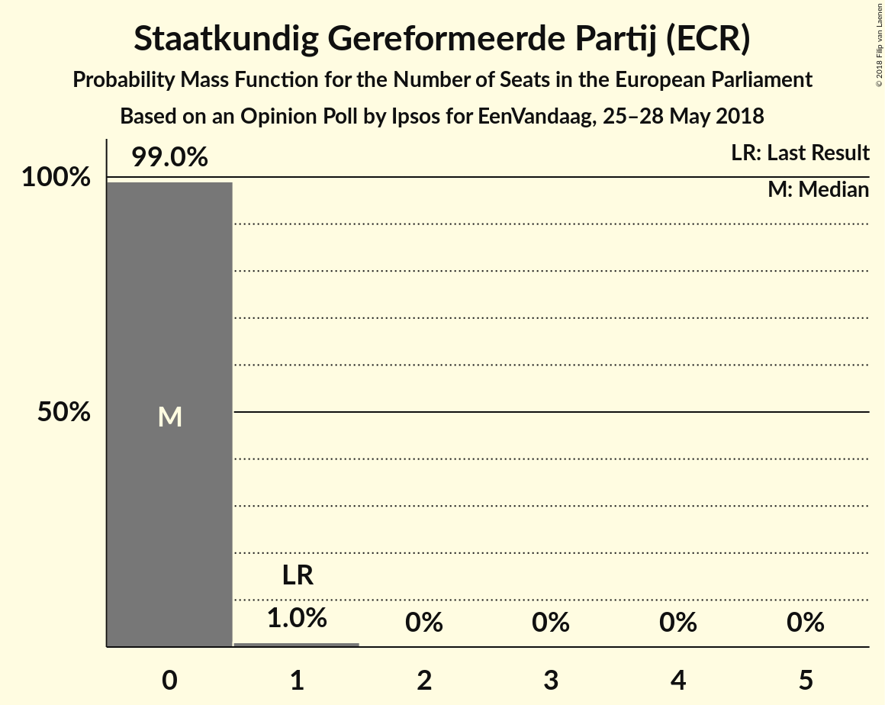
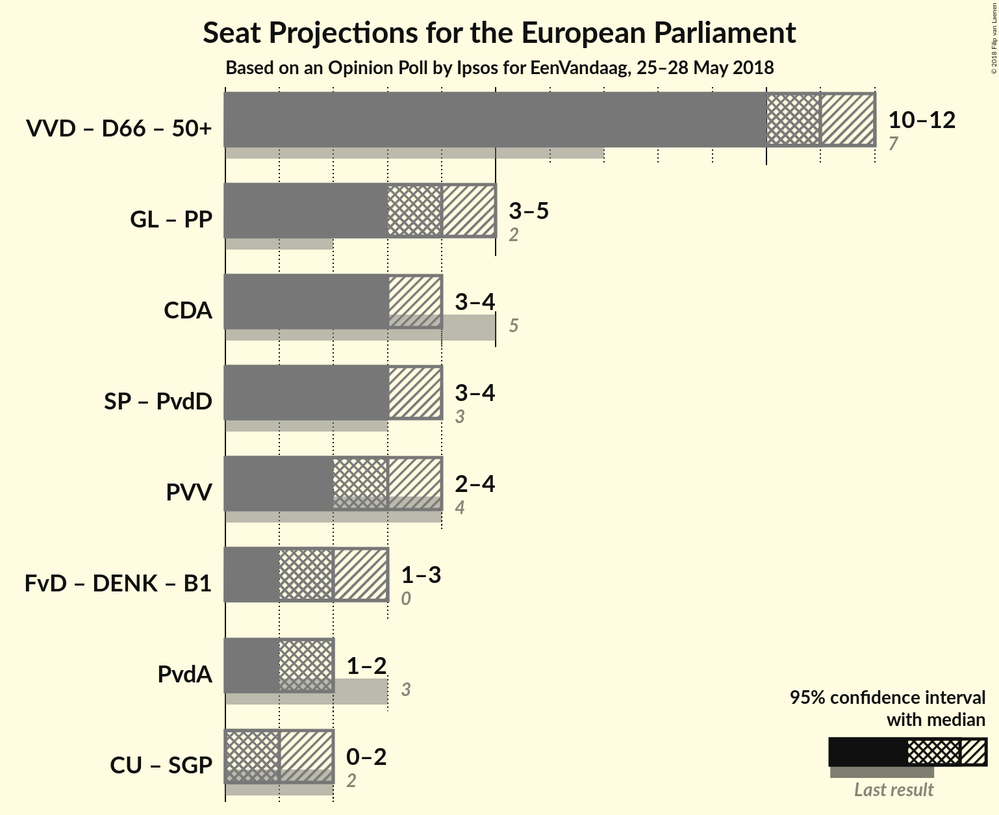

# Opinion Poll by Ipsos for EenVandaag, 25–28 May 2018

<a href="#voting-intentions">Voting Intentions</a> | <a href="#seats">Seats</a> | <a href="#coalitions">Coalitions</a> | <a href="#technical-information">Technical Information</a>

## Voting Intentions

### Confidence Intervals

| Party | Last Result | Poll Result | 80% Confidence Interval | 90% Confidence Interval | 95% Confidence Interval | 99% Confidence Interval |
|:-----:|:-----------:|:-----------:|:-----------------------:|:-----------------------:|:-----------------------:|:-----------------------:|
| Volkspartij voor Vrijheid en Democratie (ALDE) | 12.0% | 20.5% | 18.9–22.1% |18.5–22.6% |18.1–23.0% |17.4–23.9% |
| GroenLinks (Greens/EFA) | 7.0% | 11.7% | 10.5–13.0% |10.2–13.4% |9.9–13.8% |9.3–14.4% |
| Christen-Democratisch Appèl (EPP) | 15.2% | 11.0% | 9.8–12.3% |9.5–12.7% |9.2–13.1% |8.7–13.7% |
| Partij voor de Vrijheid (ENF) | 13.3% | 10.5% | 9.4–11.8% |9.1–12.2% |8.8–12.5% |8.3–13.2% |
| Democraten 66 (ALDE) | 15.5% | 10.0% | 8.9–11.2% |8.5–11.6% |8.3–11.9% |7.8–12.6% |
| Socialistische Partij (GUE/NGL) | 9.6% | 7.2% | 6.2–8.3% |6.0–8.6% |5.8–8.9% |5.3–9.5% |
| Forum voor Democratie (*) | 0.0% | 6.4% | 5.5–7.5% |5.3–7.8% |5.1–8.1% |4.7–8.6% |
| Partij van de Arbeid (S&D) | 9.4% | 5.3% | 4.5–6.3% |4.3–6.5% |4.1–6.8% |3.7–7.3% |
| Partij voor de Dieren (GUE/NGL) | 4.2% | 4.5% | 3.8–5.4% |3.6–5.7% |3.4–5.9% |3.1–6.4% |
| ChristenUnie (ECR) | 7.7% | 4.4% | 3.7–5.3% |3.5–5.6% |3.3–5.8% |3.0–6.3% |
| 50Plus (ALDE) | 3.7% | 3.4% | 2.8–4.3% |2.6–4.5% |2.5–4.7% |2.2–5.2% |
| Denk (*) | 0.0% | 2.3% | 1.8–3.0% |1.7–3.2% |1.5–3.4% |1.3–3.8% |
| Staatkundig Gereformeerde Partij (ECR) | 7.7% | 2.0% | 1.6–2.7% |1.4–2.9% |1.3–3.1% |1.1–3.4% |

*Note:* The poll result column reflects the actual value used in the calculations. Published results may vary slightly, and in addition be rounded to fewer digits.

## Seats

### Confidence Intervals

| Party | Last Result | Median | 80% Confidence Interval | 90% Confidence Interval | 95% Confidence Interval | 99% Confidence Interval |
|:-----:|:-----------:|:------:|:-----------------------:|:-----------------------:|:-----------------------:|:-----------------------:|
| <a href="#volkspartij-voor-vrijheid-en-democratie-(alde)">Volkspartij voor Vrijheid en Democratie (ALDE)</a> | 3 | 7 | 6–8 |6–8 |6–8 |6–8 |
| <a href="#groenlinks-(greens/efa)">GroenLinks (Greens/EFA)</a> | 2 | 4 | 3–4 |3–4 |3–5 |3–5 |
| <a href="#christen-democratisch-appèl-(epp)">Christen-Democratisch Appèl (EPP)</a> | 5 | 3 | 3–4 |3–4 |3–4 |3–5 |
| <a href="#partij-voor-de-vrijheid-(enf)">Partij voor de Vrijheid (ENF)</a> | 4 | 3 | 3–4 |3–4 |2–4 |2–4 |
| <a href="#democraten-66-(alde)">Democraten 66 (ALDE)</a> | 4 | 4 | 3–4 |3–4 |3–4 |2–4 |
| <a href="#socialistische-partij-(gue/ngl)">Socialistische Partij (GUE/NGL)</a> | 2 | 2 | 2–3 |2–3 |2–3 |2–3 |
| <a href="#forum-voor-democratie-(*)">Forum voor Democratie (*)</a> | 0 | 2 | 1–2 |1–2 |1–3 |1–3 |
| <a href="#partij-van-de-arbeid-(s&d)">Partij van de Arbeid (S&D)</a> | 3 | 2 | 1–2 |1–2 |1–2 |1–2 |
| <a href="#partij-voor-de-dieren-(gue/ngl)">Partij voor de Dieren (GUE/NGL)</a> | 1 | 1 | 1–2 |1–2 |0–2 |0–2 |
| <a href="#christenunie-(ecr)">ChristenUnie (ECR)</a> | 1 | 1 | 1 |1–2 |0–2 |0–2 |
| <a href="#50plus-(alde)">50Plus (ALDE)</a> | 0 | 0 | 0–1 |0–1 |0–1 |0–1 |
| <a href="#denk-(*)">Denk (*)</a> | 0 | 0 | 0 |0 |0–1 |0–1 |
| <a href="#staatkundig-gereformeerde-partij-(ecr)">Staatkundig Gereformeerde Partij (ECR)</a> | 1 | 0 | 0 |0 |0 |0–1 |

### Volkspartij voor Vrijheid en Democratie (ALDE)

*For a full overview of the results for this party, see the [Volkspartij voor Vrijheid en Democratie (ALDE)](party-volkspartijvoorvrijheidendemocratiealde.html) page.*

| Number of Seats | Probability | Accumulated | Special Marks |
|:---------------:|:-----------:|:-----------:|:-------------:|
| 3 | 0% | 100% | Last Result |
| 4 | 0% | 100% |  |
| 5 | 0.1% | 100% |  |
| 6 | 24% | 99.9% |  |
| 7 | 61% | 76% | Median |
| 8 | 14% | 15% |  |
| 9 | 0.2% | 0.2% |  |
| 10 | 0% | 0% |  |

### GroenLinks (Greens/EFA)

*For a full overview of the results for this party, see the [GroenLinks (Greens/EFA)](party-groenlinksgreensefa.html) page.*

| Number of Seats | Probability | Accumulated | Special Marks |
|:---------------:|:-----------:|:-----------:|:-------------:|
| 2 | 0% | 100% | Last Result |
| 3 | 23% | 100% |  |
| 4 | 74% | 77% | Median |
| 5 | 3% | 3% |  |
| 6 | 0% | 0% |  |

### Christen-Democratisch Appèl (EPP)

*For a full overview of the results for this party, see the [Christen-Democratisch Appèl (EPP)](party-christen-democratischappèlepp.html) page.*

| Number of Seats | Probability | Accumulated | Special Marks |
|:---------------:|:-----------:|:-----------:|:-------------:|
| 2 | 0.1% | 100% |  |
| 3 | 68% | 99.9% | Median |
| 4 | 31% | 32% |  |
| 5 | 0.9% | 0.9% | Last Result |
| 6 | 0% | 0% |  |

### Partij voor de Vrijheid (ENF)

*For a full overview of the results for this party, see the [Partij voor de Vrijheid (ENF)](party-partijvoordevrijheidenf.html) page.*

| Number of Seats | Probability | Accumulated | Special Marks |
|:---------------:|:-----------:|:-----------:|:-------------:|
| 2 | 3% | 100% |  |
| 3 | 72% | 97% | Median |
| 4 | 25% | 25% | Last Result |
| 5 | 0.1% | 0.1% |  |
| 6 | 0% | 0% |  |

### Democraten 66 (ALDE)

*For a full overview of the results for this party, see the [Democraten 66 (ALDE)](party-democraten66alde.html) page.*

| Number of Seats | Probability | Accumulated | Special Marks |
|:---------------:|:-----------:|:-----------:|:-------------:|
| 2 | 1.4% | 100% |  |
| 3 | 47% | 98.6% |  |
| 4 | 51% | 51% | Last Result, Median |
| 5 | 0% | 0% |  |

### Socialistische Partij (GUE/NGL)

*For a full overview of the results for this party, see the [Socialistische Partij (GUE/NGL)](party-socialistischepartijguengl.html) page.*

| Number of Seats | Probability | Accumulated | Special Marks |
|:---------------:|:-----------:|:-----------:|:-------------:|
| 1 | 0.4% | 100% |  |
| 2 | 76% | 99.6% | Last Result, Median |
| 3 | 23% | 23% |  |
| 4 | 0% | 0% |  |

### Forum voor Democratie (*)

*For a full overview of the results for this party, see the [Forum voor Democratie (*)](party-forumvoordemocratie.html) page.*

| Number of Seats | Probability | Accumulated | Special Marks |
|:---------------:|:-----------:|:-----------:|:-------------:|
| 0 | 0% | 100% | Last Result |
| 1 | 18% | 100% |  |
| 2 | 78% | 82% | Median |
| 3 | 4% | 4% |  |
| 4 | 0% | 0% |  |

### Partij van de Arbeid (S&D)

*For a full overview of the results for this party, see the [Partij van de Arbeid (S&D)](party-partijvandearbeidsd.html) page.*

| Number of Seats | Probability | Accumulated | Special Marks |
|:---------------:|:-----------:|:-----------:|:-------------:|
| 0 | 0.1% | 100% |  |
| 1 | 41% | 99.9% |  |
| 2 | 59% | 59% | Median |
| 3 | 0% | 0% | Last Result |

### Partij voor de Dieren (GUE/NGL)

*For a full overview of the results for this party, see the [Partij voor de Dieren (GUE/NGL)](party-partijvoordedierenguengl.html) page.*

| Number of Seats | Probability | Accumulated | Special Marks |
|:---------------:|:-----------:|:-----------:|:-------------:|
| 0 | 4% | 100% |  |
| 1 | 80% | 96% | Last Result, Median |
| 2 | 16% | 16% |  |
| 3 | 0% | 0% |  |

### ChristenUnie (ECR)

*For a full overview of the results for this party, see the [ChristenUnie (ECR)](party-christenunieecr.html) page.*

| Number of Seats | Probability | Accumulated | Special Marks |
|:---------------:|:-----------:|:-----------:|:-------------:|
| 0 | 4% | 100% |  |
| 1 | 87% | 96% | Last Result, Median |
| 2 | 9% | 9% |  |
| 3 | 0% | 0% |  |

### 50Plus (ALDE)

*For a full overview of the results for this party, see the [50Plus (ALDE)](party-50plusalde.html) page.*

| Number of Seats | Probability | Accumulated | Special Marks |
|:---------------:|:-----------:|:-----------:|:-------------:|
| 0 | 64% | 100% | Last Result, Median |
| 1 | 36% | 36% |  |
| 2 | 0% | 0% |  |

### Denk (*)

*For a full overview of the results for this party, see the [Denk (*)](party-denk.html) page.*

| Number of Seats | Probability | Accumulated | Special Marks |
|:---------------:|:-----------:|:-----------:|:-------------:|
| 0 | 97% | 100% | Last Result, Median |
| 1 | 3% | 3% |  |
| 2 | 0% | 0% |  |

### Staatkundig Gereformeerde Partij (ECR)

*For a full overview of the results for this party, see the [Staatkundig Gereformeerde Partij (ECR)](party-staatkundiggereformeerdepartijecr.html) page.*

| Number of Seats | Probability | Accumulated | Special Marks |
|:---------------:|:-----------:|:-----------:|:-------------:|
| 0 | 99.0% | 100% | Median |
| 1 | 1.0% | 1.0% | Last Result |
| 2 | 0% | 0% |  |

## Coalitions

### Confidence Intervals

| Coalition | Last Result | Median | Majority? | 80% Confidence Interval | 90% Confidence Interval | 95% Confidence Interval | 99% Confidence Interval |
|:---------:|:-----------:|:------:|:---------:|:-----------------------:|:-----------------------:|:-----------------------:|:-----------------------:|
| Volkspartij voor Vrijheid en Democratie (ALDE) – Democraten 66 (ALDE) – 50Plus (ALDE) | 7 | 11 | 0% | 10–12 | 10–12 | 10–12 | 9–13 |
| Christen-Democratisch Appèl (EPP) | 5 | 3 | 0% | 3–4 | 3–4 | 3–4 | 3–5 |
| Socialistische Partij (GUE/NGL) – Partij voor de Dieren (GUE/NGL) | 3 | 3 | 0% | 3–4 | 3–4 | 3–4 | 2–5 |
| Partij voor de Vrijheid (ENF) | 4 | 3 | 0% | 3–4 | 3–4 | 2–4 | 2–4 |
| Partij van de Arbeid (S&D) | 3 | 2 | 0% | 1–2 | 1–2 | 1–2 | 1–2 |
| ChristenUnie (ECR) – Staatkundig Gereformeerde Partij (ECR) | 2 | 1 | 0% | 1 | 1–2 | 0–2 | 0–2 |

### Volkspartij voor Vrijheid en Democratie (ALDE) – Democraten 66 (ALDE) – 50Plus (ALDE)

| Number of Seats | Probability | Accumulated | Special Marks |
|:---------------:|:-----------:|:-----------:|:-------------:|
| 7 | 0% | 100% | Last Result |
| 8 | 0% | 100% |  |
| 9 | 1.0% | 100% |  |
| 10 | 33% | 99.0% |  |
| 11 | 55% | 66% | Median |
| 12 | 10% | 11% |  |
| 13 | 0.7% | 0.7% |  |
| 14 | 0% | 0% |  |

### Christen-Democratisch Appèl (EPP)

| Number of Seats | Probability | Accumulated | Special Marks |
|:---------------:|:-----------:|:-----------:|:-------------:|
| 2 | 0.1% | 100% |  |
| 3 | 68% | 99.9% | Median |
| 4 | 31% | 32% |  |
| 5 | 0.9% | 0.9% | Last Result |
| 6 | 0% | 0% |  |

### Socialistische Partij (GUE/NGL) – Partij voor de Dieren (GUE/NGL)

| Number of Seats | Probability | Accumulated | Special Marks |
|:---------------:|:-----------:|:-----------:|:-------------:|
| 2 | 2% | 100% |  |
| 3 | 63% | 98% | Last Result, Median |
| 4 | 34% | 35% |  |
| 5 | 1.1% | 1.1% |  |
| 6 | 0% | 0% |  |

### Partij voor de Vrijheid (ENF)

| Number of Seats | Probability | Accumulated | Special Marks |
|:---------------:|:-----------:|:-----------:|:-------------:|
| 2 | 3% | 100% |  |
| 3 | 72% | 97% | Median |
| 4 | 25% | 25% | Last Result |
| 5 | 0.1% | 0.1% |  |
| 6 | 0% | 0% |  |

### Partij van de Arbeid (S&D)

| Number of Seats | Probability | Accumulated | Special Marks |
|:---------------:|:-----------:|:-----------:|:-------------:|
| 0 | 0.1% | 100% |  |
| 1 | 41% | 99.9% |  |
| 2 | 59% | 59% | Median |
| 3 | 0% | 0% | Last Result |

### ChristenUnie (ECR) – Staatkundig Gereformeerde Partij (ECR)

| Number of Seats | Probability | Accumulated | Special Marks |
|:---------------:|:-----------:|:-----------:|:-------------:|
| 0 | 4% | 100% |  |
| 1 | 86% | 96% | Median |
| 2 | 9% | 10% | Last Result |
| 3 | 0.1% | 0.1% |  |
| 4 | 0% | 0% |  |

## Technical Information

### Opinion Poll

+ **Polling firm:** Ipsos
+ **Commissioner(s):** EenVandaag
+ **Fieldwork period:** 25–28 May 2018

### Calculations

+ **Sample size:** 1045
+ **Simulations done:** 1,048,576
+ **Error estimate:** 2.03%

