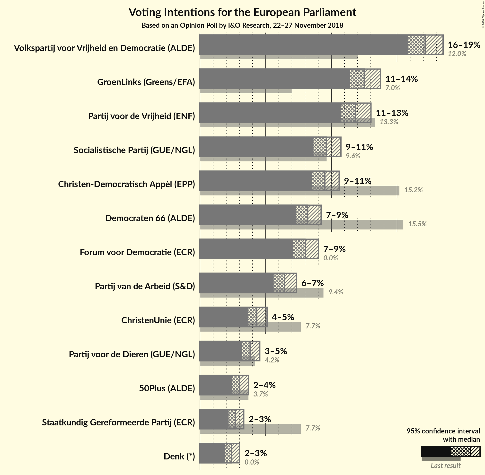
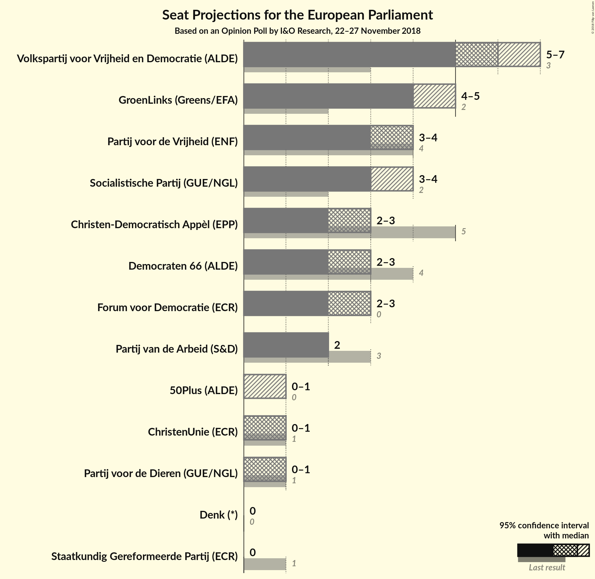
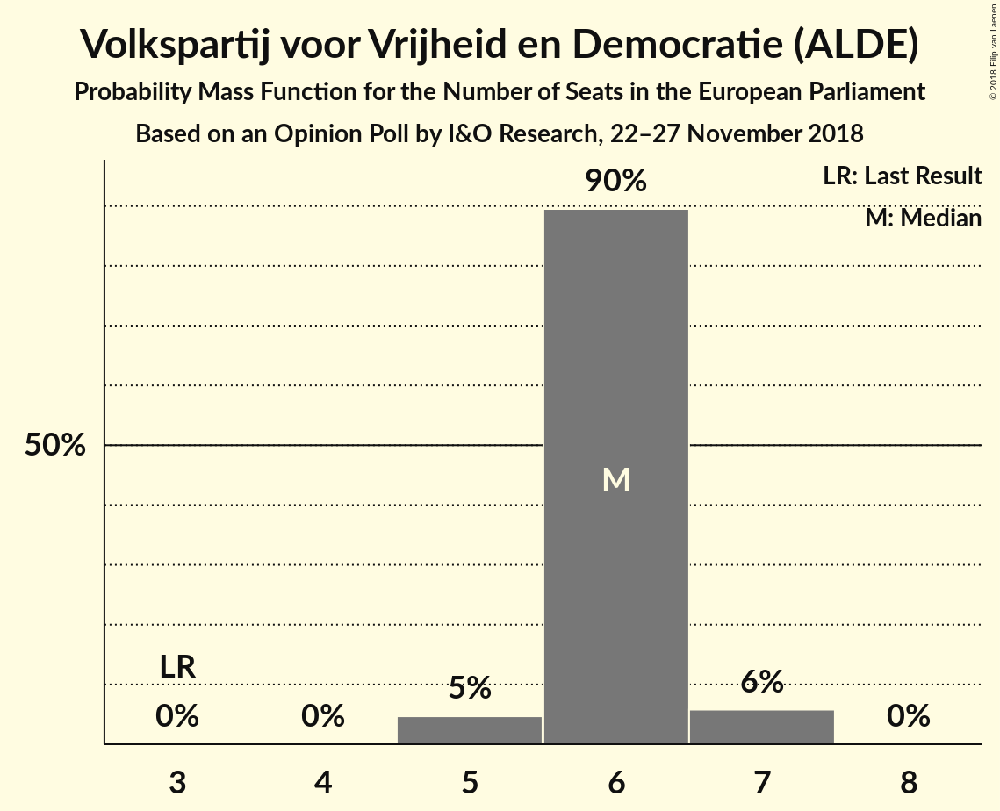
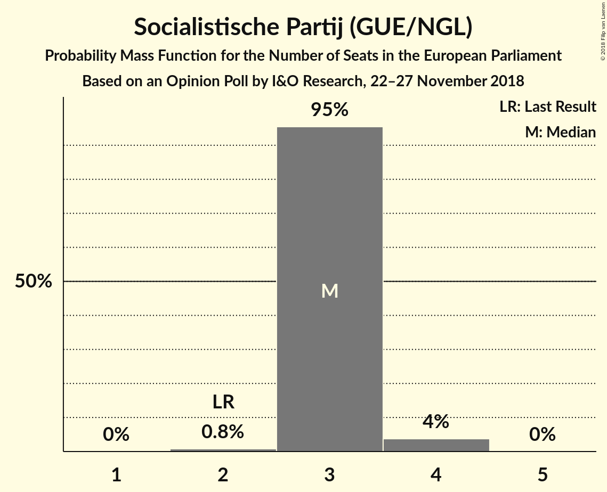
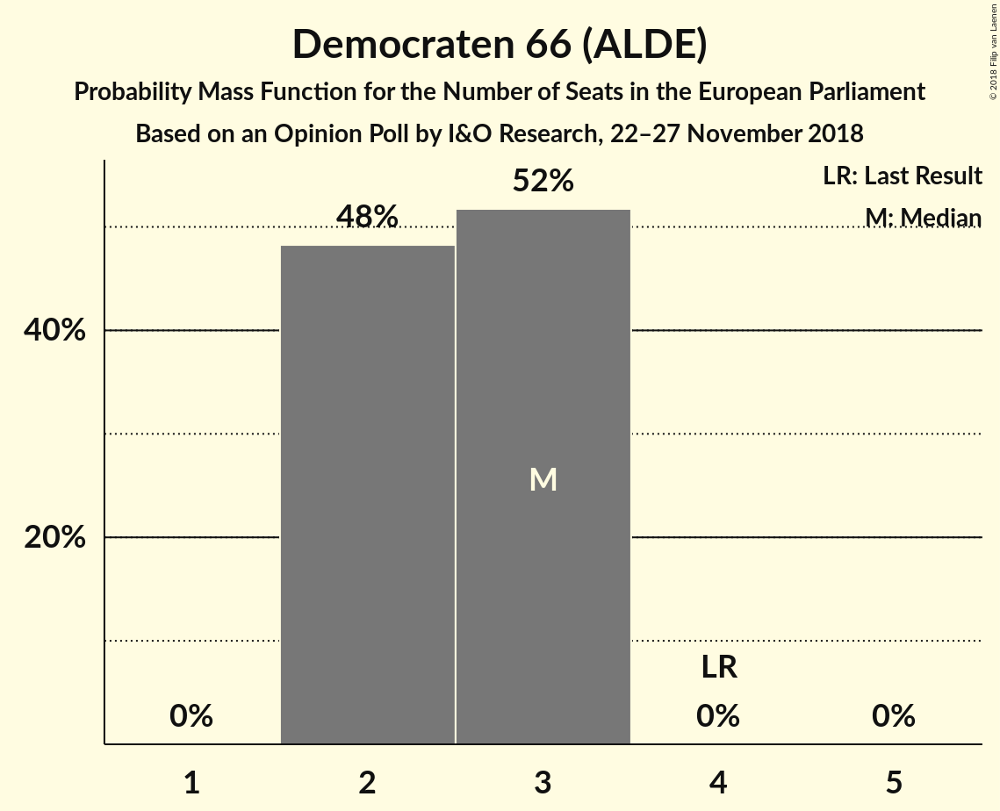
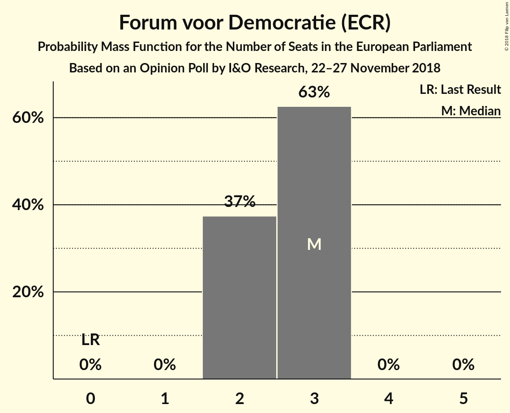
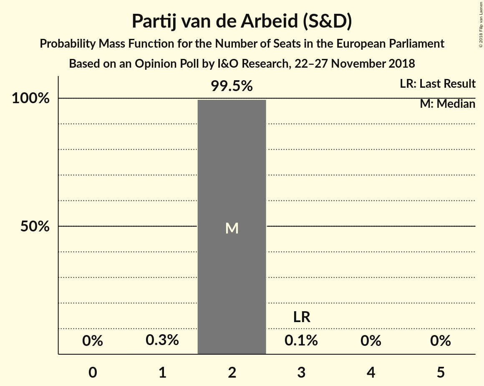
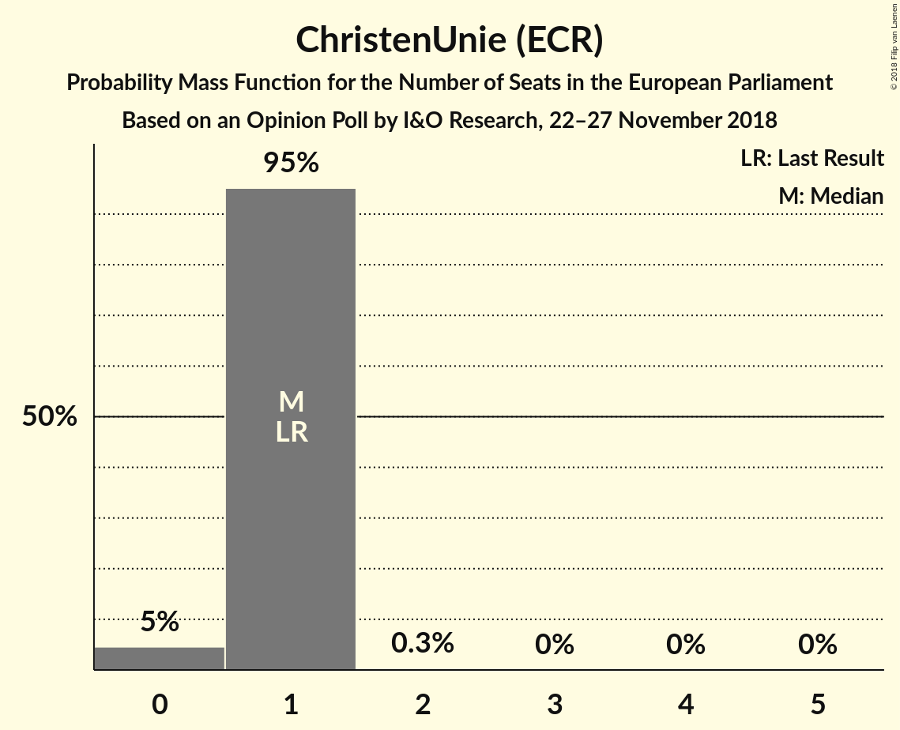
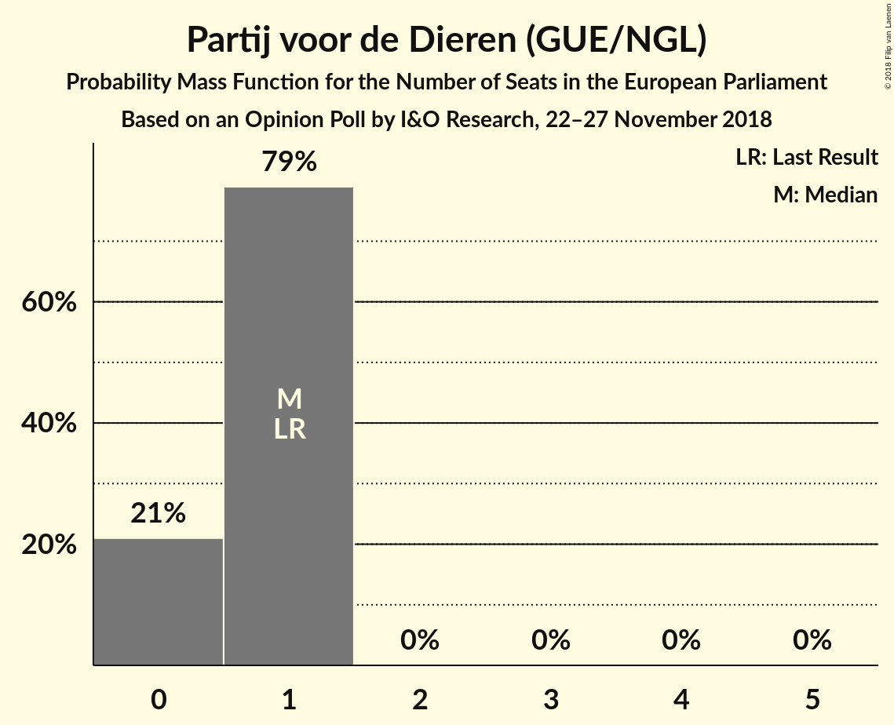
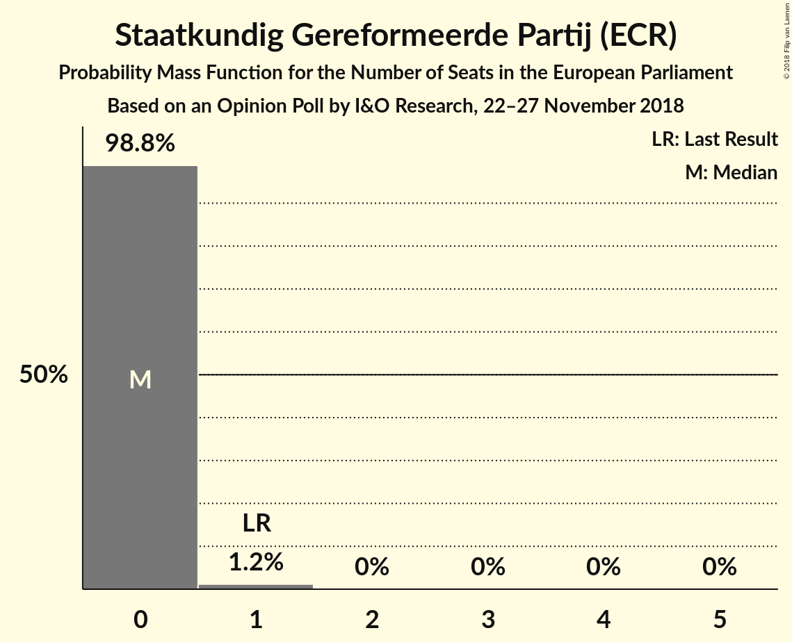

# Opinion Poll by I&O Research, 22–27 November 2018

<a href="#voting-intentions">Voting Intentions</a> | <a href="#seats">Seats</a> | <a href="#coalitions">Coalitions</a> | <a href="#technical-information">Technical Information</a>

## Voting Intentions

### Confidence Intervals

| Party | Last Result | Poll Result | 80% Confidence Interval | 90% Confidence Interval | 95% Confidence Interval | 99% Confidence Interval |
|:-----:|:-----------:|:-----------:|:-----------------------:|:-----------------------:|:-----------------------:|:-----------------------:|
| Volkspartij voor Vrijheid en Democratie (ALDE) | 12.0% | 17.1% | 16.3–18.0% |16.1–18.3% |15.9–18.5% |15.5–18.9% |
| GroenLinks (Greens/EFA) | 7.0% | 12.5% | 11.8–13.3% |11.6–13.5% |11.4–13.7% |11.1–14.1% |
| Partij voor de Vrijheid (ENF) | 13.3% | 11.8% | 11.1–12.6% |10.9–12.8% |10.7–13.0% |10.4–13.4% |
| Socialistische Partij (GUE/NGL) | 9.6% | 9.6% | 9.0–10.3% |8.8–10.5% |8.6–10.7% |8.4–11.1% |
| Christen-Democratisch Appèl (EPP) | 15.2% | 9.5% | 8.9–10.2% |8.7–10.4% |8.5–10.6% |8.2–10.9% |
| Democraten 66 (ALDE) | 15.5% | 8.2% | 7.6–8.9% |7.4–9.1% |7.3–9.2% |7.0–9.5% |
| Forum voor Democratie (ECR) | 0.0% | 8.0% | 7.4–8.7% |7.3–8.9% |7.1–9.0% |6.8–9.3% |
| Partij van de Arbeid (S&D) | 9.4% | 6.4% | 5.9–7.0% |5.7–7.2% |5.6–7.3% |5.4–7.6% |
| ChristenUnie (ECR) | 7.7% | 4.3% | 3.9–4.8% |3.8–5.0% |3.7–5.1% |3.5–5.3% |
| Partij voor de Dieren (GUE/NGL) | 4.2% | 3.8% | 3.4–4.3% |3.3–4.4% |3.2–4.6% |3.0–4.8% |
| 50Plus (ALDE) | 3.7% | 3.0% | 2.7–3.5% |2.6–3.6% |2.5–3.7% |2.3–3.9% |
| Staatkundig Gereformeerde Partij (ECR) | 7.7% | 2.7% | 2.4–3.1% |2.3–3.2% |2.2–3.3% |2.0–3.6% |
| Denk (*) | 0.0% | 2.4% | 2.1–2.8% |2.0–2.9% |1.9–3.0% |1.8–3.2% |

*Note:* The poll result column reflects the actual value used in the calculations. Published results may vary slightly, and in addition be rounded to fewer digits.

## Seats

### Confidence Intervals

| Party | Last Result | Median | 80% Confidence Interval | 90% Confidence Interval | 95% Confidence Interval | 99% Confidence Interval |
|:-----:|:-----------:|:------:|:-----------------------:|:-----------------------:|:-----------------------:|:-----------------------:|
| <a href="#volkspartij-voor-vrijheid-en-democratie-(alde)">Volkspartij voor Vrijheid en Democratie (ALDE)</a> | 3 | 6 | 6 |5–6 |5–6 |5–7 |
| <a href="#groenlinks-(greens/efa)">GroenLinks (Greens/EFA)</a> | 2 | 4 | 4 |4 |4 |3–5 |
| <a href="#partij-voor-de-vrijheid-(enf)">Partij voor de Vrijheid (ENF)</a> | 4 | 4 | 4 |3–4 |3–4 |3–5 |
| <a href="#socialistische-partij-(gue/ngl)">Socialistische Partij (GUE/NGL)</a> | 2 | 3 | 3–4 |3–4 |3–4 |3–4 |
| <a href="#christen-democratisch-appèl-(epp)">Christen-Democratisch Appèl (EPP)</a> | 5 | 3 | 2–3 |2–3 |2–3 |2–3 |
| <a href="#democraten-66-(alde)">Democraten 66 (ALDE)</a> | 4 | 2 | 2–3 |2–3 |2–3 |2–3 |
| <a href="#forum-voor-democratie-(ecr)">Forum voor Democratie (ECR)</a> | 0 | 3 | 2–3 |2–3 |2–3 |2–3 |
| <a href="#partij-van-de-arbeid-(s&d)">Partij van de Arbeid (S&D)</a> | 3 | 2 | 2 |2 |2 |2 |
| <a href="#christenunie-(ecr)">ChristenUnie (ECR)</a> | 1 | 1 | 1 |1 |1 |1–2 |
| <a href="#partij-voor-de-dieren-(gue/ngl)">Partij voor de Dieren (GUE/NGL)</a> | 1 | 1 | 1 |0–1 |0–1 |0–1 |
| <a href="#50plus-(alde)">50Plus (ALDE)</a> | 0 | 0 | 0–1 |0–1 |0–1 |0–1 |
| <a href="#staatkundig-gereformeerde-partij-(ecr)">Staatkundig Gereformeerde Partij (ECR)</a> | 1 | 0 | 0 |0 |0 |0–1 |
| <a href="#denk-(*)">Denk (*)</a> | 0 | 0 | 0 |0 |0 |0 |

### Volkspartij voor Vrijheid en Democratie (ALDE)

*For a full overview of the results for this party, see the [Volkspartij voor Vrijheid en Democratie (ALDE)](party-volkspartijvoorvrijheidendemocratiealde.html) page.*

| Number of Seats | Probability | Accumulated | Special Marks |
|:---------------:|:-----------:|:-----------:|:-------------:|
| 3 | 0% | 100% | Last Result |
| 4 | 0% | 100% |  |
| 5 | 7% | 100% |  |
| 6 | 92% | 93% | Median |
| 7 | 0.9% | 0.9% |  |
| 8 | 0% | 0% |  |

### GroenLinks (Greens/EFA)

*For a full overview of the results for this party, see the [GroenLinks (Greens/EFA)](party-groenlinksgreensefa.html) page.*

| Number of Seats | Probability | Accumulated | Special Marks |
|:---------------:|:-----------:|:-----------:|:-------------:|
| 2 | 0% | 100% | Last Result |
| 3 | 0.5% | 100% |  |
| 4 | 98% | 99.5% | Median |
| 5 | 2% | 2% |  |
| 6 | 0% | 0% |  |

### Partij voor de Vrijheid (ENF)

*For a full overview of the results for this party, see the [Partij voor de Vrijheid (ENF)](party-partijvoordevrijheidenf.html) page.*

| Number of Seats | Probability | Accumulated | Special Marks |
|:---------------:|:-----------:|:-----------:|:-------------:|
| 3 | 5% | 100% |  |
| 4 | 94% | 95% | Last Result, Median |
| 5 | 0.6% | 0.6% |  |
| 6 | 0% | 0% |  |

### Socialistische Partij (GUE/NGL)

*For a full overview of the results for this party, see the [Socialistische Partij (GUE/NGL)](party-socialistischepartijguengl.html) page.*

| Number of Seats | Probability | Accumulated | Special Marks |
|:---------------:|:-----------:|:-----------:|:-------------:|
| 2 | 0.2% | 100% | Last Result |
| 3 | 68% | 99.8% | Median |
| 4 | 32% | 32% |  |
| 5 | 0% | 0% |  |

### Christen-Democratisch Appèl (EPP)

*For a full overview of the results for this party, see the [Christen-Democratisch Appèl (EPP)](party-christen-democratischappèlepp.html) page.*

| Number of Seats | Probability | Accumulated | Special Marks |
|:---------------:|:-----------:|:-----------:|:-------------:|
| 2 | 32% | 100% |  |
| 3 | 67% | 68% | Median |
| 4 | 0.2% | 0.2% |  |
| 5 | 0% | 0% | Last Result |

### Democraten 66 (ALDE)

*For a full overview of the results for this party, see the [Democraten 66 (ALDE)](party-democraten66alde.html) page.*

| Number of Seats | Probability | Accumulated | Special Marks |
|:---------------:|:-----------:|:-----------:|:-------------:|
| 2 | 56% | 100% | Median |
| 3 | 44% | 44% |  |
| 4 | 0% | 0% | Last Result |

### Forum voor Democratie (ECR)

*For a full overview of the results for this party, see the [Forum voor Democratie (ECR)](party-forumvoordemocratieecr.html) page.*

| Number of Seats | Probability | Accumulated | Special Marks |
|:---------------:|:-----------:|:-----------:|:-------------:|
| 0 | 0% | 100% | Last Result |
| 1 | 0% | 100% |  |
| 2 | 40% | 100% |  |
| 3 | 60% | 60% | Median |
| 4 | 0% | 0% |  |

### Partij van de Arbeid (S&D)

*For a full overview of the results for this party, see the [Partij van de Arbeid (S&D)](party-partijvandearbeidsd.html) page.*

| Number of Seats | Probability | Accumulated | Special Marks |
|:---------------:|:-----------:|:-----------:|:-------------:|
| 1 | 0.1% | 100% |  |
| 2 | 99.8% | 99.9% | Median |
| 3 | 0% | 0% | Last Result |

### ChristenUnie (ECR)

*For a full overview of the results for this party, see the [ChristenUnie (ECR)](party-christenunieecr.html) page.*

| Number of Seats | Probability | Accumulated | Special Marks |
|:---------------:|:-----------:|:-----------:|:-------------:|
| 0 | 0.1% | 100% |  |
| 1 | 99.0% | 99.9% | Last Result, Median |
| 2 | 0.9% | 0.9% |  |
| 3 | 0% | 0% |  |

### Partij voor de Dieren (GUE/NGL)

*For a full overview of the results for this party, see the [Partij voor de Dieren (GUE/NGL)](party-partijvoordedierenguengl.html) page.*

| Number of Seats | Probability | Accumulated | Special Marks |
|:---------------:|:-----------:|:-----------:|:-------------:|
| 0 | 6% | 100% |  |
| 1 | 94% | 94% | Last Result, Median |
| 2 | 0% | 0% |  |

### 50Plus (ALDE)

*For a full overview of the results for this party, see the [50Plus (ALDE)](party-50plusalde.html) page.*

| Number of Seats | Probability | Accumulated | Special Marks |
|:---------------:|:-----------:|:-----------:|:-------------:|
| 0 | 89% | 100% | Last Result, Median |
| 1 | 11% | 11% |  |
| 2 | 0% | 0% |  |

### Staatkundig Gereformeerde Partij (ECR)

*For a full overview of the results for this party, see the [Staatkundig Gereformeerde Partij (ECR)](party-staatkundiggereformeerdepartijecr.html) page.*

| Number of Seats | Probability | Accumulated | Special Marks |
|:---------------:|:-----------:|:-----------:|:-------------:|
| 0 | 99.2% | 100% | Median |
| 1 | 0.8% | 0.8% | Last Result |
| 2 | 0% | 0% |  |

### Denk (*)

*For a full overview of the results for this party, see the [Denk (*)](party-denk.html) page.*

| Number of Seats | Probability | Accumulated | Special Marks |
|:---------------:|:-----------:|:-----------:|:-------------:|
| 0 | 99.9% | 100% | Last Result, Median |
| 1 | 0.1% | 0.1% |  |
| 2 | 0% | 0% |  |

## Coalitions

### Confidence Intervals

| Coalition | Last Result | Median | Majority? | 80% Confidence Interval | 90% Confidence Interval | 95% Confidence Interval | 99% Confidence Interval |
|:---------:|:-----------:|:------:|:---------:|:-----------------------:|:-----------------------:|:-----------------------:|:-----------------------:|
| Volkspartij voor Vrijheid en Democratie (ALDE) – Democraten 66 (ALDE) – 50Plus (ALDE) | 7 | 8 | 0% | 8–9 | 8–9 | 8–10 | 7–10 |
| Socialistische Partij (GUE/NGL) – Partij voor de Dieren (GUE/NGL) | 3 | 4 | 0% | 4–5 | 3–5 | 3–5 | 3–5 |
| Forum voor Democratie (ECR) – ChristenUnie (ECR) – Staatkundig Gereformeerde Partij (ECR) | 2 | 4 | 0% | 3–4 | 3–4 | 3–4 | 3–5 |
| Partij voor de Vrijheid (ENF) | 4 | 4 | 0% | 4 | 3–4 | 3–4 | 3–5 |
| Christen-Democratisch Appèl (EPP) | 5 | 3 | 0% | 2–3 | 2–3 | 2–3 | 2–3 |
| Partij van de Arbeid (S&D) | 3 | 2 | 0% | 2 | 2 | 2 | 2 |

### Volkspartij voor Vrijheid en Democratie (ALDE) – Democraten 66 (ALDE) – 50Plus (ALDE)

| Number of Seats | Probability | Accumulated | Special Marks |
|:---------------:|:-----------:|:-----------:|:-------------:|
| 7 | 0.6% | 100% | Last Result |
| 8 | 55% | 99.4% | Median |
| 9 | 39% | 44% |  |
| 10 | 5% | 5% |  |
| 11 | 0% | 0% |  |

### Socialistische Partij (GUE/NGL) – Partij voor de Dieren (GUE/NGL)

| Number of Seats | Probability | Accumulated | Special Marks |
|:---------------:|:-----------:|:-----------:|:-------------:|
| 3 | 6% | 100% | Last Result |
| 4 | 62% | 94% | Median |
| 5 | 32% | 32% |  |
| 6 | 0% | 0% |  |

### Forum voor Democratie (ECR) – ChristenUnie (ECR) – Staatkundig Gereformeerde Partij (ECR)

| Number of Seats | Probability | Accumulated | Special Marks |
|:---------------:|:-----------:|:-----------:|:-------------:|
| 2 | 0% | 100% | Last Result |
| 3 | 39% | 100% |  |
| 4 | 60% | 61% | Median |
| 5 | 0.6% | 0.6% |  |
| 6 | 0% | 0% |  |

### Partij voor de Vrijheid (ENF)

| Number of Seats | Probability | Accumulated | Special Marks |
|:---------------:|:-----------:|:-----------:|:-------------:|
| 3 | 5% | 100% |  |
| 4 | 94% | 95% | Last Result, Median |
| 5 | 0.6% | 0.6% |  |
| 6 | 0% | 0% |  |

### Christen-Democratisch Appèl (EPP)

| Number of Seats | Probability | Accumulated | Special Marks |
|:---------------:|:-----------:|:-----------:|:-------------:|
| 2 | 32% | 100% |  |
| 3 | 67% | 68% | Median |
| 4 | 0.2% | 0.2% |  |
| 5 | 0% | 0% | Last Result |

### Partij van de Arbeid (S&D)

| Number of Seats | Probability | Accumulated | Special Marks |
|:---------------:|:-----------:|:-----------:|:-------------:|
| 1 | 0.1% | 100% |  |
| 2 | 99.8% | 99.9% | Median |
| 3 | 0% | 0% | Last Result |

## Technical Information

### Opinion Poll

+ **Polling firm:** I&O Research
+ **Commissioner(s):** —
+ **Fieldwork period:** 22–27 November 2018

### Calculations

+ **Sample size:** 3145
+ **Simulations done:** 131,072
+ **Error estimate:** 1.71%

