# Opinion Poll by Ipsos for EenVandaag, 22–24 February 2019

<a href="#voting-intentions">Voting Intentions</a> | <a href="#seats">Seats</a> | <a href="#coalitions">Coalitions</a> | <a href="#technical-information">Technical Information</a>

## Voting Intentions

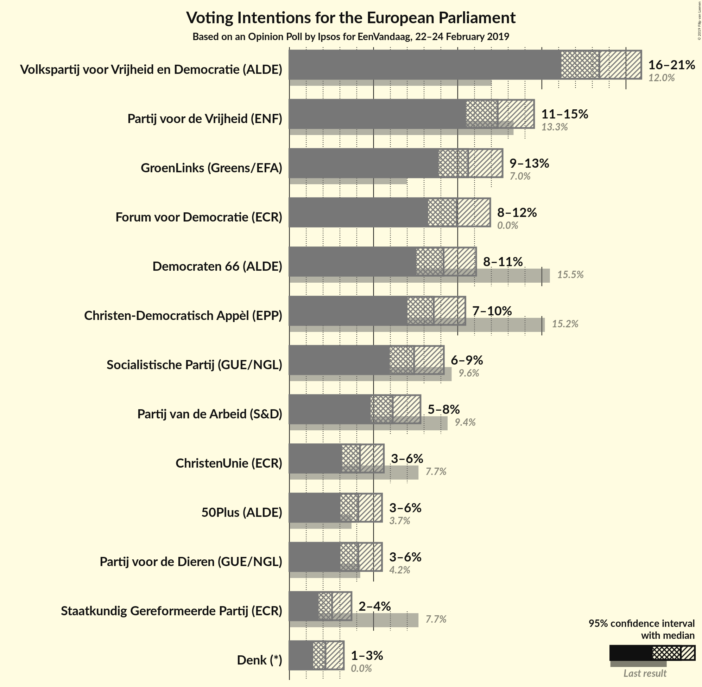

### Confidence Intervals

| Party | Last Result | Poll Result | 80% Confidence Interval | 90% Confidence Interval | 95% Confidence Interval | 99% Confidence Interval |
|:-----:|:-----------:|:-----------:|:-----------------------:|:-----------------------:|:-----------------------:|:-----------------------:|
| Volkspartij voor Vrijheid en Democratie (ALDE) | 12.0% | 18.4% | 16.9–20.1% |16.5–20.5% |16.2–20.9% |15.5–21.7% |
| Partij voor de Vrijheid (EAPN) | 13.3% | 12.4% | 11.1–13.8% |10.8–14.2% |10.5–14.5% |9.9–15.2% |
| GroenLinks (Greens/EFA) | 7.0% | 10.6% | 9.5–12.0% |9.1–12.3% |8.9–12.7% |8.4–13.3% |
| Forum voor Democratie (ECR) | 0.0% | 9.9% | 8.8–11.2% |8.5–11.6% |8.2–11.9% |7.7–12.6% |
| Democraten 66 (ALDE) | 15.5% | 9.2% | 8.1–10.4% |7.8–10.8% |7.5–11.1% |7.1–11.7% |
| Christen-Democratisch Appèl (EPP) | 15.2% | 8.6% | 7.5–9.8% |7.3–10.2% |7.0–10.5% |6.5–11.1% |
| Socialistische Partij (GUE/NGL) | 9.6% | 7.4% | 6.4–8.6% |6.2–8.9% |6.0–9.2% |5.5–9.8% |
| Partij van de Arbeid (S&D) | 9.4% | 6.1% | 5.3–7.2% |5.0–7.5% |4.8–7.8% |4.4–8.3% |
| ChristenUnie (ECR) | 7.7% | 4.2% | 3.5–5.1% |3.3–5.4% |3.1–5.6% |2.8–6.1% |
| Partij voor de Dieren (GUE/NGL) | 4.2% | 4.1% | 3.4–5.0% |3.2–5.3% |3.0–5.5% |2.7–6.0% |
| 50Plus (*) | 3.7% | 4.1% | 3.4–5.0% |3.2–5.3% |3.0–5.5% |2.7–6.0% |
| Staatkundig Gereformeerde Partij (ECR) | 7.7% | 2.5% | 2.0–3.3% |1.9–3.5% |1.7–3.7% |1.5–4.1% |
| Denk (*) | 0.0% | 2.1% | 1.7–2.9% |1.5–3.0% |1.4–3.2% |1.2–3.6% |

*Note:* The poll result column reflects the actual value used in the calculations. Published results may vary slightly, and in addition be rounded to fewer digits.

## Seats

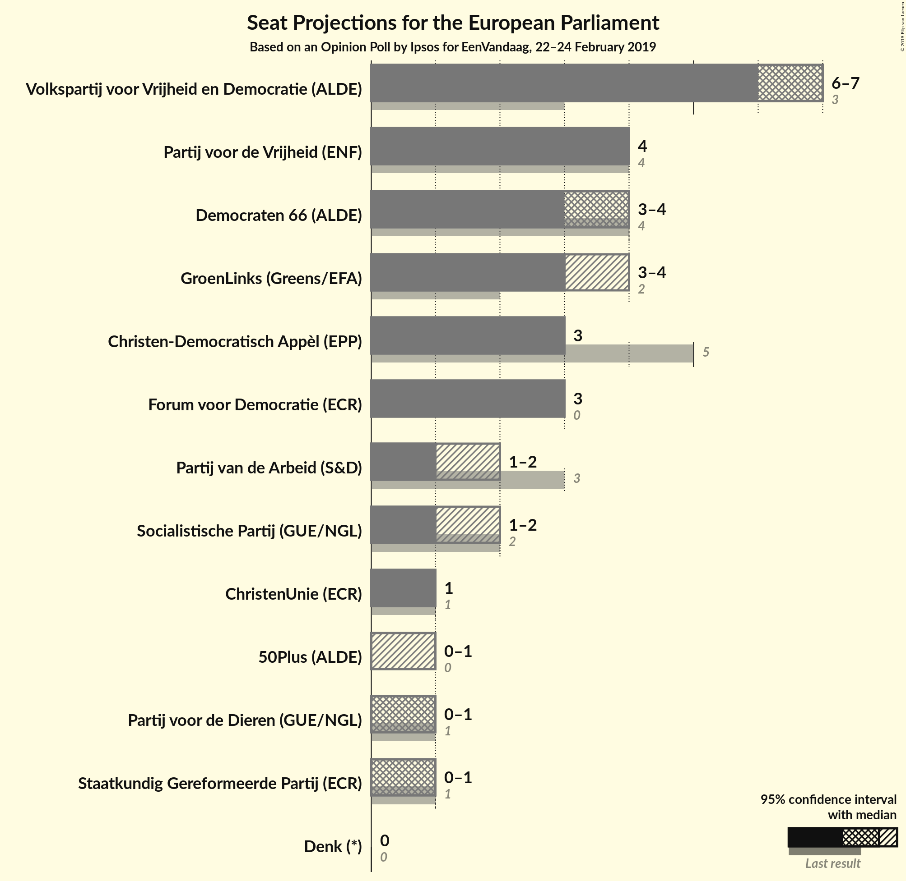

### Confidence Intervals

| Party | Last Result | Median | 80% Confidence Interval | 90% Confidence Interval | 95% Confidence Interval | 99% Confidence Interval |
|:-----:|:-----------:|:------:|:-----------------------:|:-----------------------:|:-----------------------:|:-----------------------:|
| <a href="#volkspartij-voor-vrijheid-en-democratie-(alde)">Volkspartij voor Vrijheid en Democratie (ALDE)</a> | 3 | 5 | 5–6 |5–6 |5–6 |5–7 |
| <a href="#partij-voor-de-vrijheid-(eapn)">Partij voor de Vrijheid (EAPN)</a> | 4 | 3 | 3–4 |3–4 |3–4 |3–4 |
| <a href="#groenlinks-(greens/efa)">GroenLinks (Greens/EFA)</a> | 2 | 3 | 3 |3–4 |2–4 |2–4 |
| <a href="#forum-voor-democratie-(ecr)">Forum voor Democratie (ECR)</a> | 0 | 3 | 3–4 |3–4 |2–4 |2–4 |
| <a href="#democraten-66-(alde)">Democraten 66 (ALDE)</a> | 4 | 2 | 2–3 |2–3 |2–3 |2–3 |
| <a href="#christen-democratisch-appèl-(epp)">Christen-Democratisch Appèl (EPP)</a> | 5 | 3 | 2–3 |2–3 |2–3 |2–3 |
| <a href="#socialistische-partij-(gue/ngl)">Socialistische Partij (GUE/NGL)</a> | 2 | 2 | 2 |2 |2–3 |2–3 |
| <a href="#partij-van-de-arbeid-(s&d)">Partij van de Arbeid (S&D)</a> | 3 | 2 | 1–2 |1–2 |1–2 |1–2 |
| <a href="#christenunie-(ecr)">ChristenUnie (ECR)</a> | 1 | 1 | 1 |0–1 |0–1 |0–1 |
| <a href="#partij-voor-de-dieren-(gue/ngl)">Partij voor de Dieren (GUE/NGL)</a> | 1 | 1 | 0–1 |0–1 |0–1 |0–1 |
| <a href="#50plus-(*)">50Plus (*)</a> | 0 | 1 | 0–1 |0–1 |0–2 |0–2 |
| <a href="#staatkundig-gereformeerde-partij-(ecr)">Staatkundig Gereformeerde Partij (ECR)</a> | 1 | 0 | 0 |0 |0 |0 |
| <a href="#denk-(*)">Denk (*)</a> | 0 | 0 | 0 |0 |0 |0 |

### Volkspartij voor Vrijheid en Democratie (ALDE)

*For a full overview of the results for this party, see the [Volkspartij voor Vrijheid en Democratie (ALDE)](party-volkspartijvoorvrijheidendemocratiealde.html) page.*

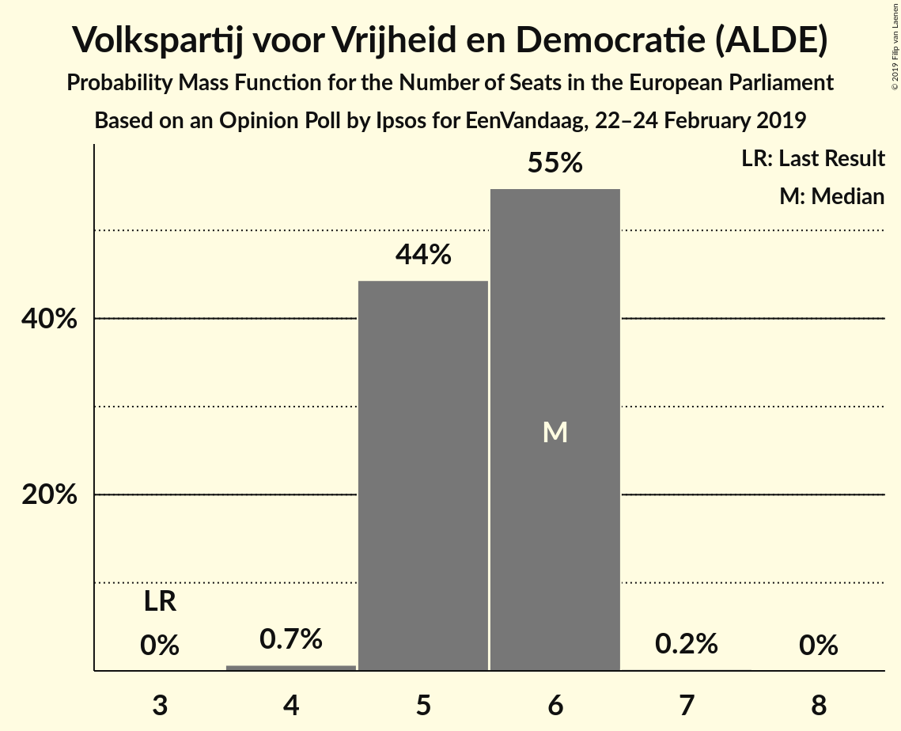

| Number of Seats | Probability | Accumulated | Special Marks |
|:---------------:|:-----------:|:-----------:|:-------------:|
| 3 | 0% | 100% | Last Result |
| 4 | 0% | 100% |  |
| 5 | 83% | 100% | Median |
| 6 | 15% | 17% |  |
| 7 | 2% | 2% |  |
| 8 | 0% | 0% |  |

### Partij voor de Vrijheid (EAPN)

*For a full overview of the results for this party, see the [Partij voor de Vrijheid (EAPN)](party-partijvoordevrijheideapn.html) page.*

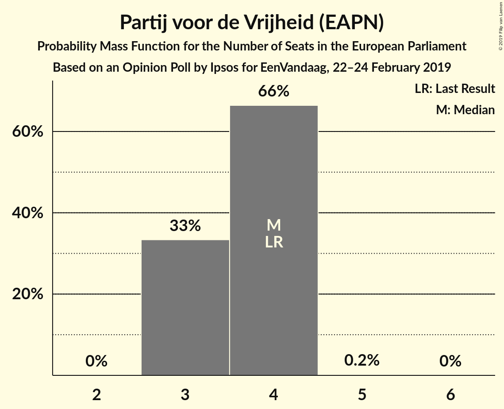

| Number of Seats | Probability | Accumulated | Special Marks |
|:---------------:|:-----------:|:-----------:|:-------------:|
| 3 | 70% | 100% | Median |
| 4 | 30% | 30% | Last Result |
| 5 | 0.2% | 0.2% |  |
| 6 | 0% | 0% |  |

### GroenLinks (Greens/EFA)

*For a full overview of the results for this party, see the [GroenLinks (Greens/EFA)](party-groenlinksgreensefa.html) page.*

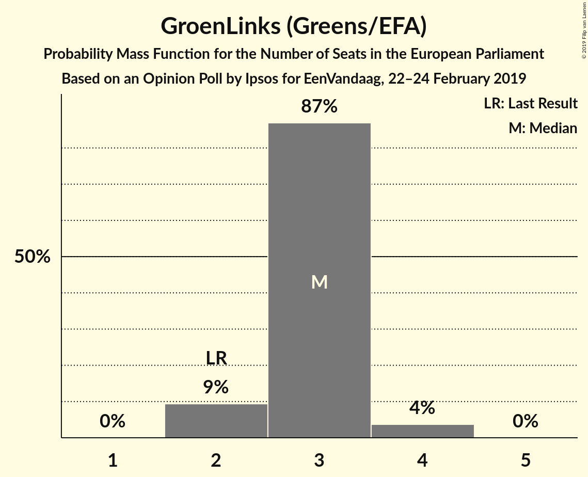

| Number of Seats | Probability | Accumulated | Special Marks |
|:---------------:|:-----------:|:-----------:|:-------------:|
| 2 | 4% | 100% | Last Result |
| 3 | 87% | 96% | Median |
| 4 | 9% | 9% |  |
| 5 | 0% | 0% |  |

### Forum voor Democratie (ECR)

*For a full overview of the results for this party, see the [Forum voor Democratie (ECR)](party-forumvoordemocratieecr.html) page.*

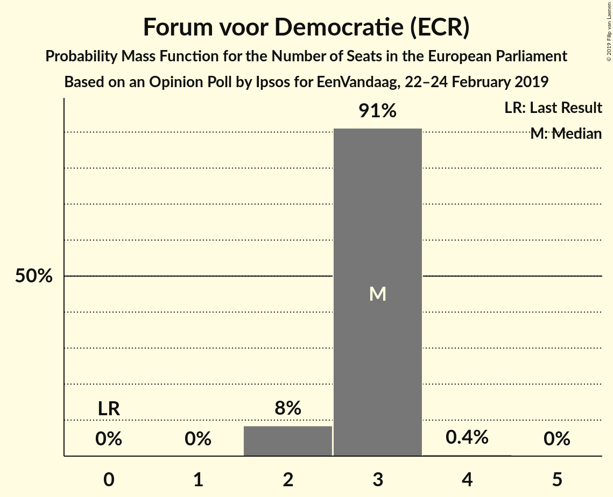

| Number of Seats | Probability | Accumulated | Special Marks |
|:---------------:|:-----------:|:-----------:|:-------------:|
| 0 | 0% | 100% | Last Result |
| 1 | 0% | 100% |  |
| 2 | 5% | 100% |  |
| 3 | 83% | 95% | Median |
| 4 | 13% | 13% |  |
| 5 | 0% | 0% |  |

### Democraten 66 (ALDE)

*For a full overview of the results for this party, see the [Democraten 66 (ALDE)](party-democraten66alde.html) page.*

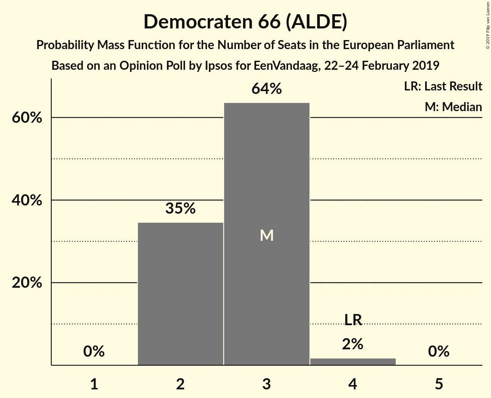

| Number of Seats | Probability | Accumulated | Special Marks |
|:---------------:|:-----------:|:-----------:|:-------------:|
| 2 | 69% | 100% | Median |
| 3 | 31% | 31% |  |
| 4 | 0.2% | 0.2% | Last Result |
| 5 | 0% | 0% |  |

### Christen-Democratisch Appèl (EPP)

*For a full overview of the results for this party, see the [Christen-Democratisch Appèl (EPP)](party-christen-democratischappèlepp.html) page.*

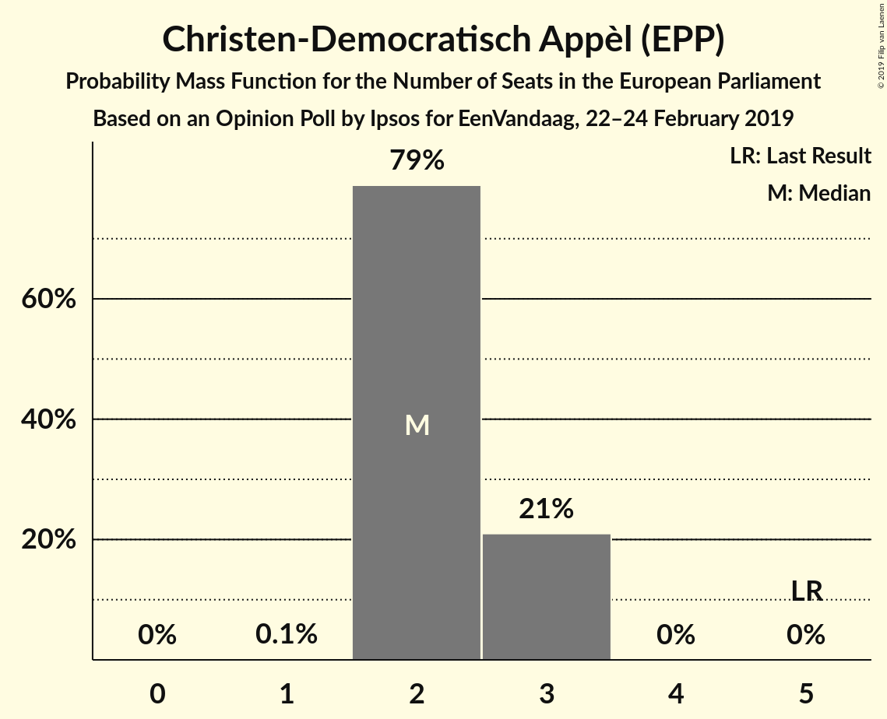

| Number of Seats | Probability | Accumulated | Special Marks |
|:---------------:|:-----------:|:-----------:|:-------------:|
| 2 | 31% | 100% |  |
| 3 | 69% | 69% | Median |
| 4 | 0% | 0% |  |
| 5 | 0% | 0% | Last Result |

### Socialistische Partij (GUE/NGL)

*For a full overview of the results for this party, see the [Socialistische Partij (GUE/NGL)](party-socialistischepartijguengl.html) page.*

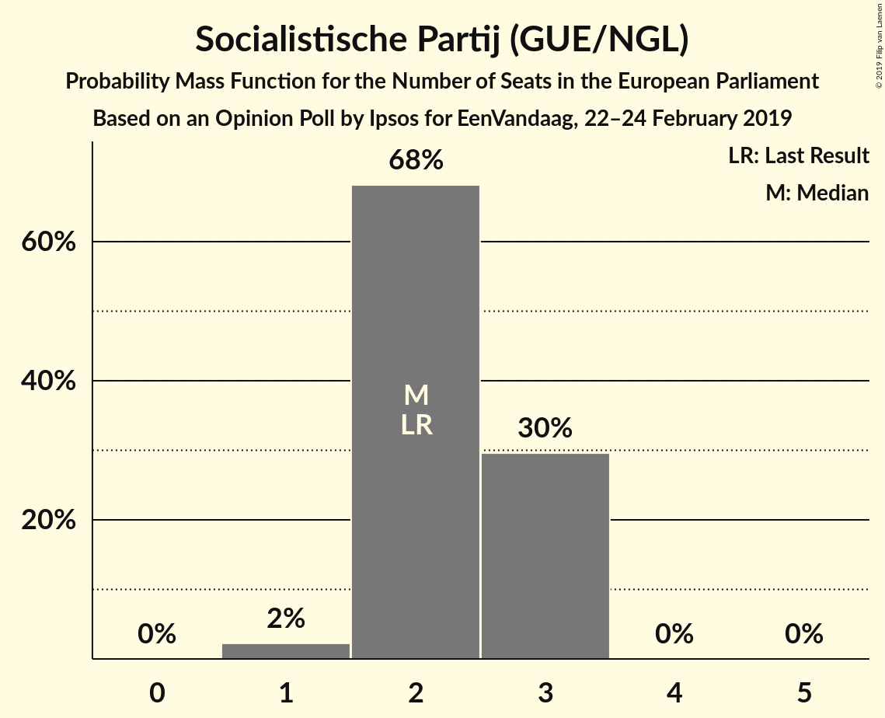

| Number of Seats | Probability | Accumulated | Special Marks |
|:---------------:|:-----------:|:-----------:|:-------------:|
| 1 | 0.2% | 100% |  |
| 2 | 96% | 99.8% | Last Result, Median |
| 3 | 3% | 3% |  |
| 4 | 0% | 0% |  |

### Partij van de Arbeid (S&D)

*For a full overview of the results for this party, see the [Partij van de Arbeid (S&D)](party-partijvandearbeidsd.html) page.*

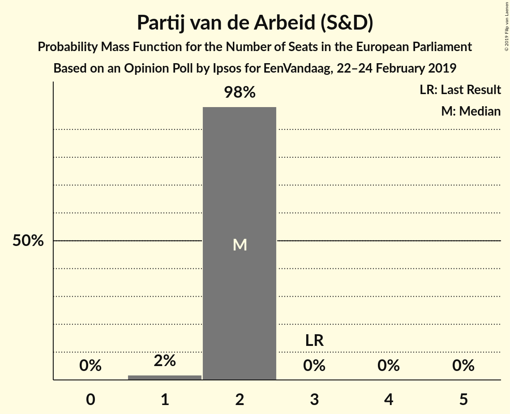

| Number of Seats | Probability | Accumulated | Special Marks |
|:---------------:|:-----------:|:-----------:|:-------------:|
| 1 | 24% | 100% |  |
| 2 | 76% | 76% | Median |
| 3 | 0% | 0% | Last Result |

### ChristenUnie (ECR)

*For a full overview of the results for this party, see the [ChristenUnie (ECR)](party-christenunieecr.html) page.*

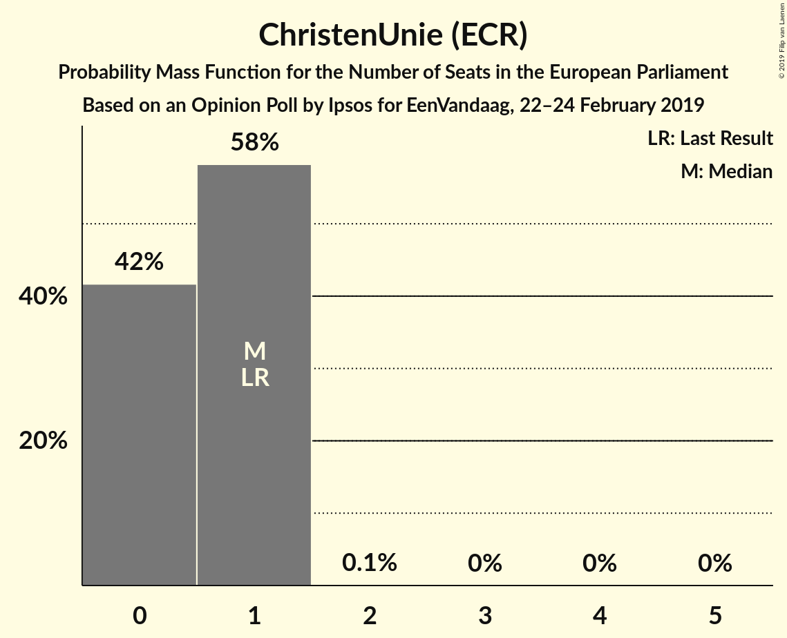

| Number of Seats | Probability | Accumulated | Special Marks |
|:---------------:|:-----------:|:-----------:|:-------------:|
| 0 | 7% | 100% |  |
| 1 | 93% | 93% | Last Result, Median |
| 2 | 0.1% | 0.1% |  |
| 3 | 0% | 0% |  |

### Partij voor de Dieren (GUE/NGL)

*For a full overview of the results for this party, see the [Partij voor de Dieren (GUE/NGL)](party-partijvoordedierenguengl.html) page.*

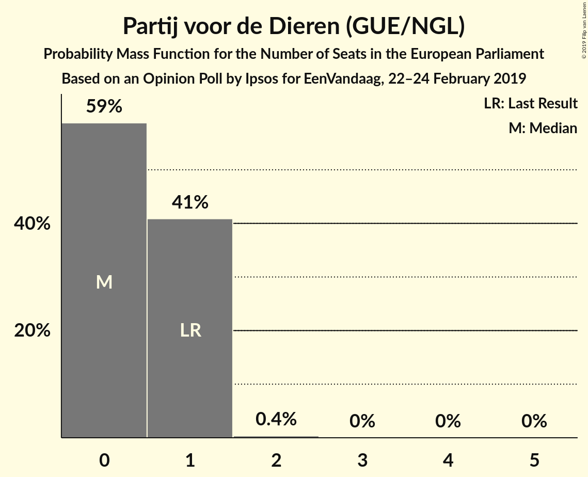

| Number of Seats | Probability | Accumulated | Special Marks |
|:---------------:|:-----------:|:-----------:|:-------------:|
| 0 | 22% | 100% |  |
| 1 | 78% | 78% | Last Result, Median |
| 2 | 0% | 0% |  |

### 50Plus (*)

*For a full overview of the results for this party, see the [50Plus (*)](party-50plus.html) page.*

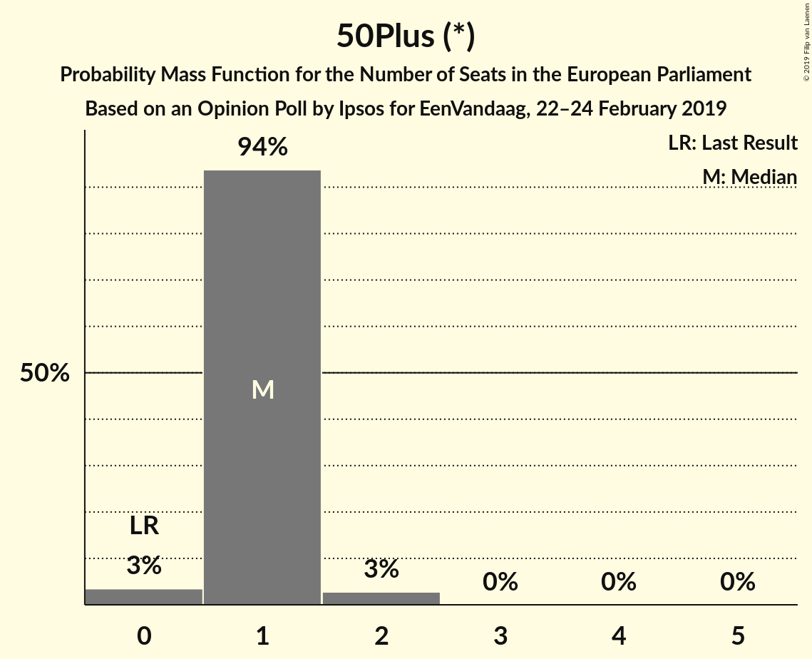

| Number of Seats | Probability | Accumulated | Special Marks |
|:---------------:|:-----------:|:-----------:|:-------------:|
| 0 | 18% | 100% | Last Result |
| 1 | 79% | 82% | Median |
| 2 | 3% | 3% |  |
| 3 | 0% | 0% |  |

### Staatkundig Gereformeerde Partij (ECR)

*For a full overview of the results for this party, see the [Staatkundig Gereformeerde Partij (ECR)](party-staatkundiggereformeerdepartijecr.html) page.*

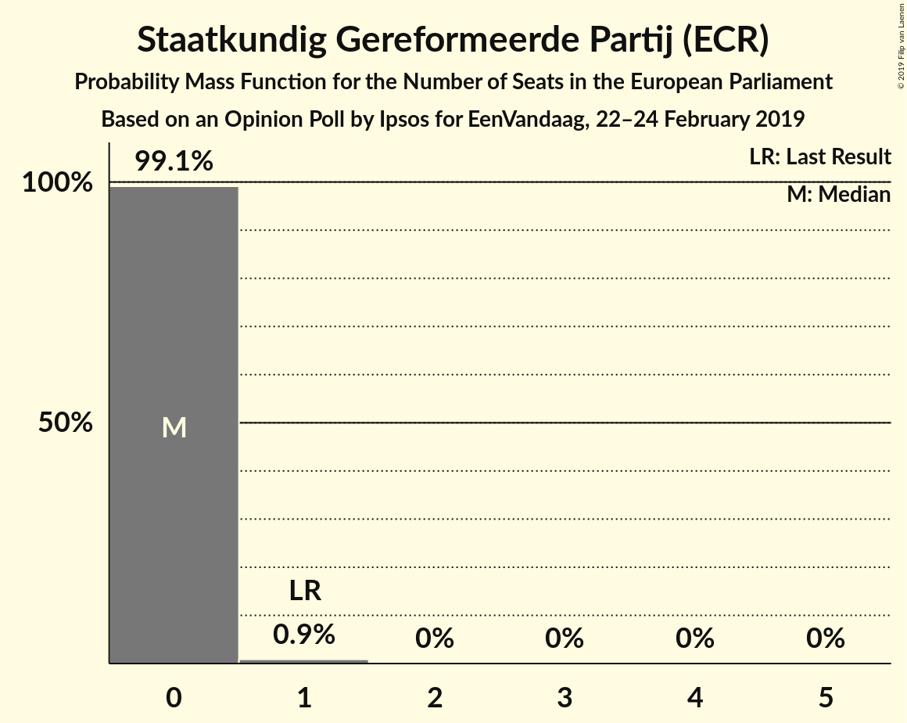

| Number of Seats | Probability | Accumulated | Special Marks |
|:---------------:|:-----------:|:-----------:|:-------------:|
| 0 | 99.8% | 100% | Median |
| 1 | 0.2% | 0.2% | Last Result |
| 2 | 0% | 0% |  |

### Denk (*)

*For a full overview of the results for this party, see the [Denk (*)](party-denk.html) page.*

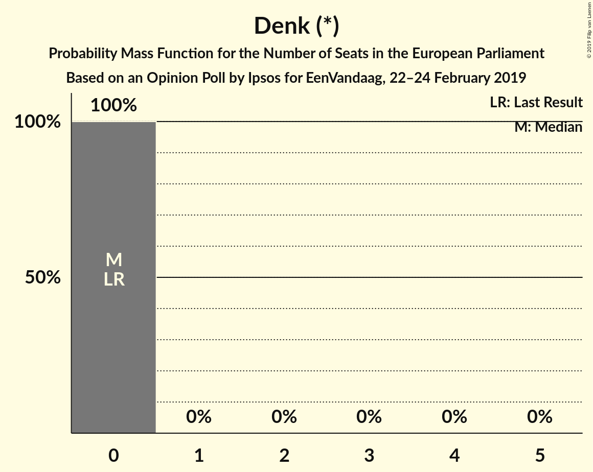

| Number of Seats | Probability | Accumulated | Special Marks |
|:---------------:|:-----------:|:-----------:|:-------------:|
| 0 | 100% | 100% | Last Result, Median |

## Coalitions

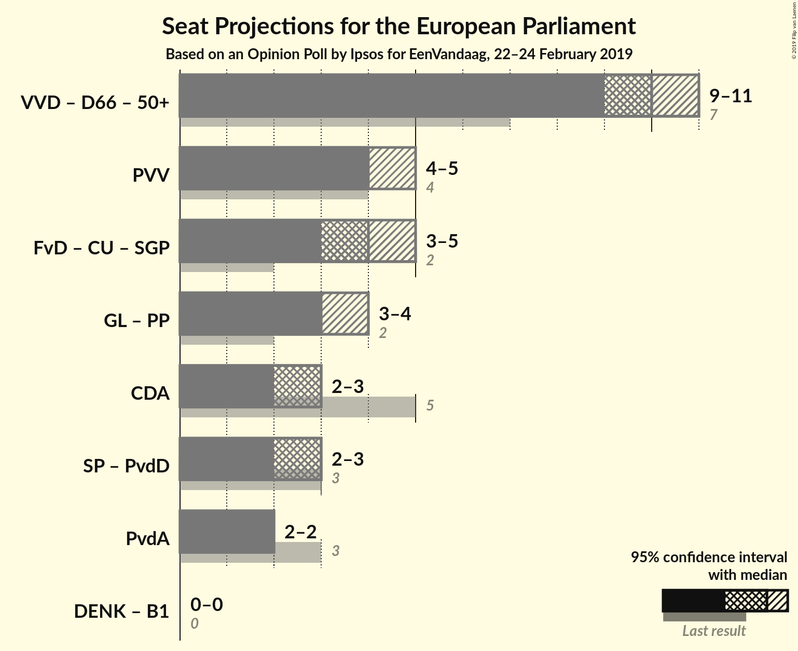

### Confidence Intervals

| Coalition | Last Result | Median | Majority? | 80% Confidence Interval | 90% Confidence Interval | 95% Confidence Interval | 99% Confidence Interval |
|:---------:|:-----------:|:------:|:---------:|:-----------------------:|:-----------------------:|:-----------------------:|:-----------------------:|
| Volkspartij voor Vrijheid en Democratie (ALDE) – Democraten 66 (ALDE) | 7 | 7 | 0% | 7–9 | 7–9 | 7–9 | 7–10 |
| Forum voor Democratie (ECR) – ChristenUnie (ECR) – Staatkundig Gereformeerde Partij (ECR) | 2 | 4 | 0% | 4–5 | 3–5 | 3–5 | 2–5 |
| Partij voor de Vrijheid (EAPN) | 4 | 3 | 0% | 3–4 | 3–4 | 3–4 | 3–4 |
| GroenLinks (Greens/EFA) | 2 | 3 | 0% | 3 | 3–4 | 2–4 | 2–4 |
| Christen-Democratisch Appèl (EPP) | 5 | 3 | 0% | 2–3 | 2–3 | 2–3 | 2–3 |
| Socialistische Partij (GUE/NGL) – Partij voor de Dieren (GUE/NGL) | 3 | 3 | 0% | 2–3 | 2–3 | 2–3 | 2–4 |
| Partij van de Arbeid (S&D) | 3 | 2 | 0% | 1–2 | 1–2 | 1–2 | 1–2 |

### Volkspartij voor Vrijheid en Democratie (ALDE) – Democraten 66 (ALDE)

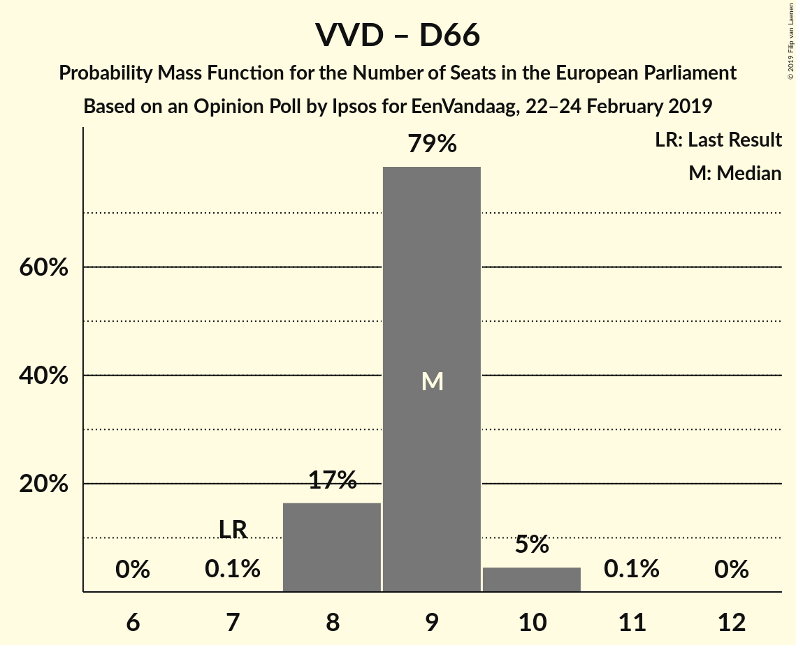

| Number of Seats | Probability | Accumulated | Special Marks |
|:---------------:|:-----------:|:-----------:|:-------------:|
| 7 | 63% | 100% | Last Result, Median |
| 8 | 25% | 37% |  |
| 9 | 10% | 12% |  |
| 10 | 2% | 2% |  |
| 11 | 0% | 0% |  |

### Forum voor Democratie (ECR) – ChristenUnie (ECR) – Staatkundig Gereformeerde Partij (ECR)

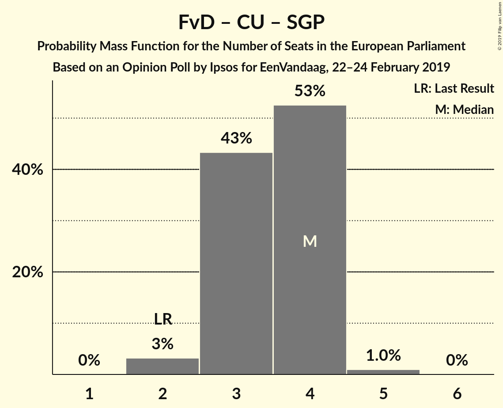

| Number of Seats | Probability | Accumulated | Special Marks |
|:---------------:|:-----------:|:-----------:|:-------------:|
| 2 | 1.4% | 100% | Last Result |
| 3 | 8% | 98.6% |  |
| 4 | 78% | 90% | Median |
| 5 | 13% | 13% |  |
| 6 | 0% | 0% |  |

### Partij voor de Vrijheid (EAPN)

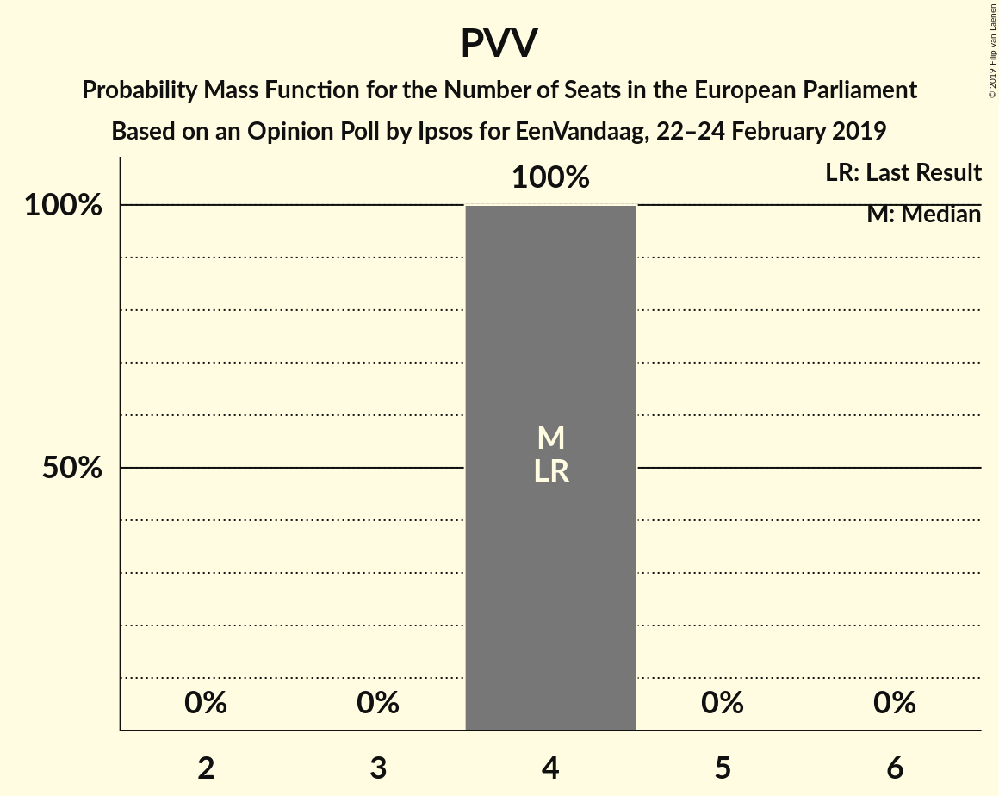

| Number of Seats | Probability | Accumulated | Special Marks |
|:---------------:|:-----------:|:-----------:|:-------------:|
| 3 | 70% | 100% | Median |
| 4 | 30% | 30% | Last Result |
| 5 | 0.2% | 0.2% |  |
| 6 | 0% | 0% |  |

### GroenLinks (Greens/EFA)

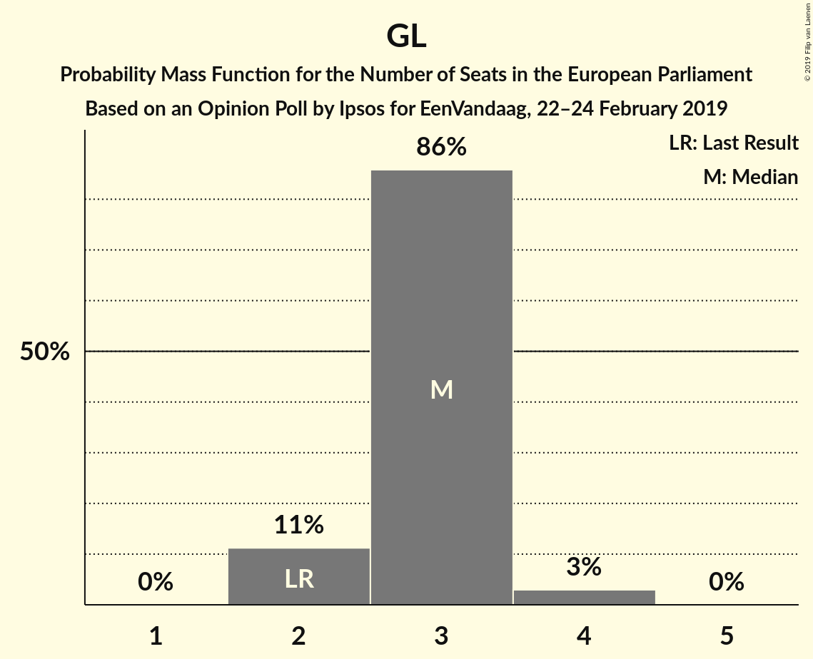

| Number of Seats | Probability | Accumulated | Special Marks |
|:---------------:|:-----------:|:-----------:|:-------------:|
| 2 | 4% | 100% | Last Result |
| 3 | 87% | 96% | Median |
| 4 | 9% | 9% |  |
| 5 | 0% | 0% |  |

### Christen-Democratisch Appèl (EPP)

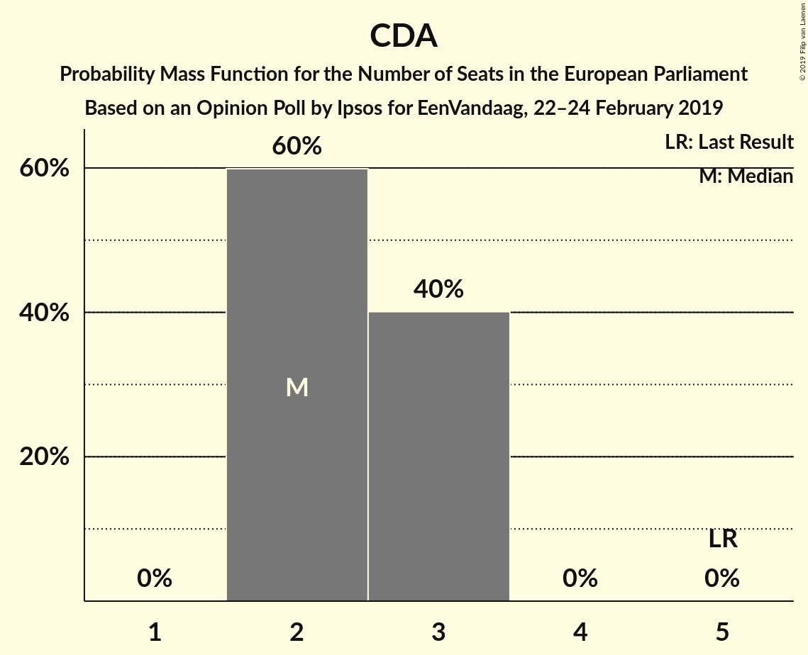

| Number of Seats | Probability | Accumulated | Special Marks |
|:---------------:|:-----------:|:-----------:|:-------------:|
| 2 | 31% | 100% |  |
| 3 | 69% | 69% | Median |
| 4 | 0% | 0% |  |
| 5 | 0% | 0% | Last Result |

### Socialistische Partij (GUE/NGL) – Partij voor de Dieren (GUE/NGL)

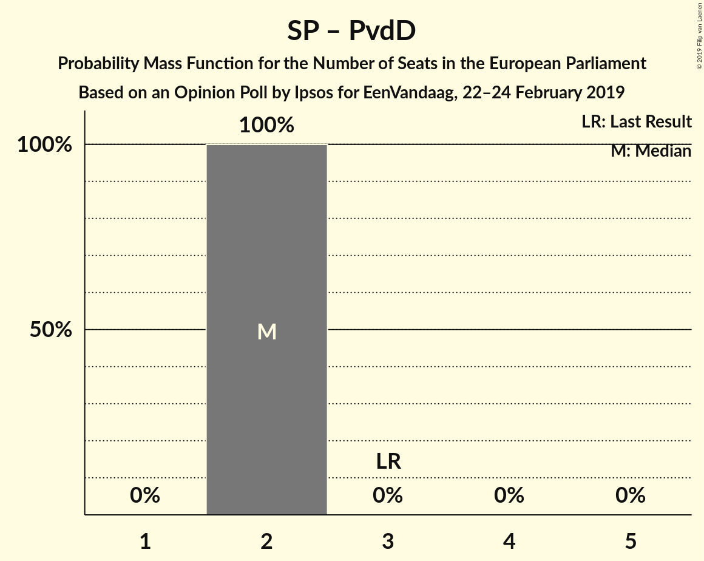

| Number of Seats | Probability | Accumulated | Special Marks |
|:---------------:|:-----------:|:-----------:|:-------------:|
| 2 | 19% | 100% |  |
| 3 | 80% | 81% | Last Result, Median |
| 4 | 1.0% | 1.0% |  |
| 5 | 0% | 0% |  |

### Partij van de Arbeid (S&D)

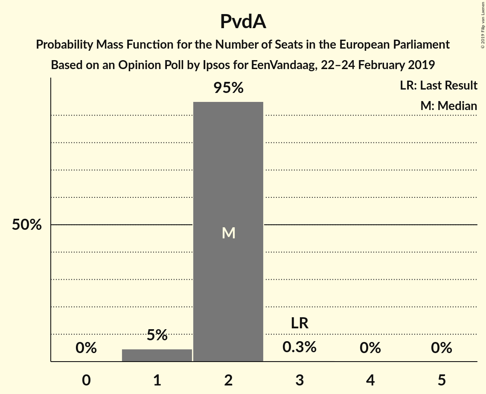

| Number of Seats | Probability | Accumulated | Special Marks |
|:---------------:|:-----------:|:-----------:|:-------------:|
| 1 | 24% | 100% |  |
| 2 | 76% | 76% | Median |
| 3 | 0% | 0% | Last Result |

## Technical Information

### Opinion Poll

+ **Polling firm:** Ipsos
+ **Commissioner(s):** EenVandaag
+ **Fieldwork period:** 22–24 February 2019

### Calculations

+ **Sample size:** 1026
+ **Simulations done:** 524,288
+ **Error estimate:** 2.56%

