# Opinion Poll by I&O Research, 8–12 March 2019

<a href="#voting-intentions">Voting Intentions</a> | <a href="#seats">Seats</a> | <a href="#coalitions">Coalitions</a> | <a href="#technical-information">Technical Information</a>

## Voting Intentions

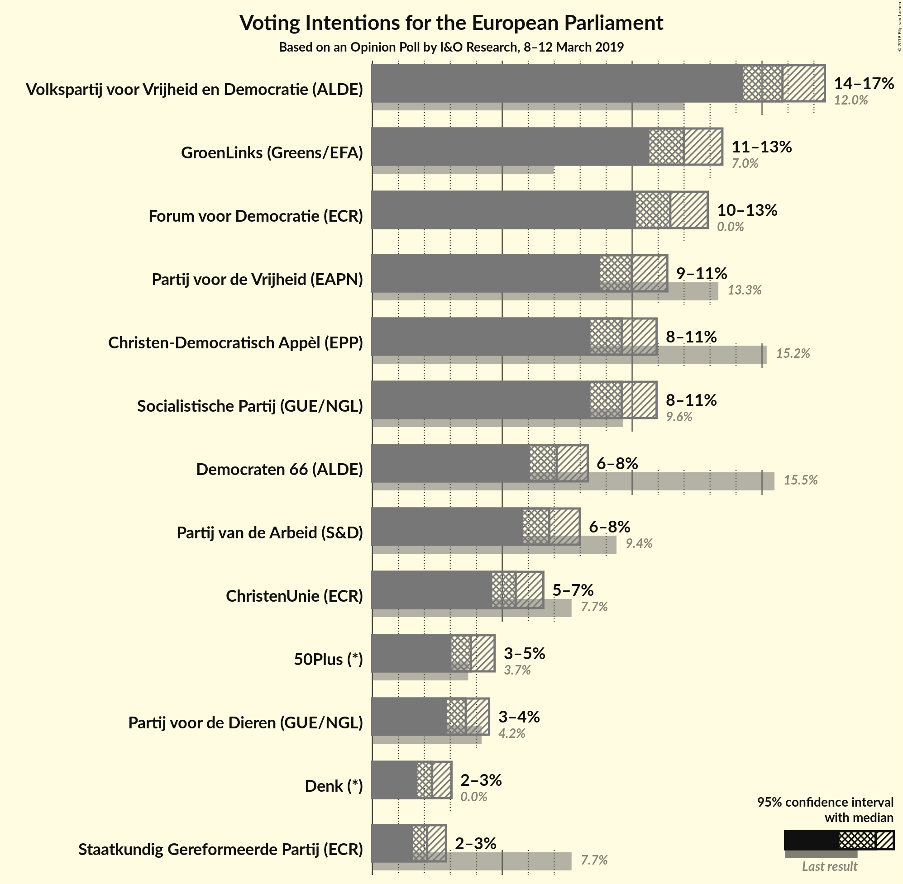

### Confidence Intervals

| Party | Last Result | Poll Result | 80% Confidence Interval | 90% Confidence Interval | 95% Confidence Interval | 99% Confidence Interval |
|:-----:|:-----------:|:-----------:|:-----------------------:|:-----------------------:|:-----------------------:|:-----------------------:|
| Volkspartij voor Vrijheid en Democratie (ALDE) | 12.0% | 15.8% | 14.8–16.9% |14.5–17.2% |14.3–17.4% |13.8–17.9% |
| GroenLinks (Greens/EFA) | 7.0% | 12.0% | 11.1–13.0% |10.9–13.2% |10.7–13.5% |10.3–13.9% |
| Forum voor Democratie (ECR) | 0.0% | 11.5% | 10.6–12.4% |10.4–12.7% |10.2–12.9% |9.8–13.4% |
| Partij voor de Vrijheid (ENF) | 13.3% | 10.0% | 9.2–10.9% |8.9–11.1% |8.8–11.4% |8.4–11.8% |
| Christen-Democratisch Appèl (EPP) | 15.2% | 9.6% | 8.8–10.5% |8.6–10.7% |8.4–10.9% |8.0–11.4% |
| Socialistische Partij (GUE/NGL) | 9.6% | 9.6% | 8.8–10.5% |8.6–10.7% |8.4–10.9% |8.0–11.4% |
| Democraten 66 (ALDE) | 15.5% | 7.1% | 6.4–7.9% |6.2–8.1% |6.1–8.3% |5.8–8.7% |
| Partij van de Arbeid (S&D) | 9.4% | 6.8% | 6.1–7.6% |6.0–7.8% |5.8–8.0% |5.5–8.4% |
| ChristenUnie (ECR) | 7.7% | 5.5% | 4.9–6.2% |4.8–6.4% |4.6–6.6% |4.3–6.9% |
| 50Plus (*) | 3.7% | 3.8% | 3.3–4.4% |3.2–4.6% |3.0–4.7% |2.8–5.0% |
| Partij voor de Dieren (GUE/NGL) | 4.2% | 3.6% | 3.1–4.2% |3.0–4.3% |2.9–4.5% |2.7–4.8% |
| Denk (*) | 0.0% | 2.3% | 1.9–2.8% |1.8–2.9% |1.7–3.0% |1.6–3.3% |
| Staatkundig Gereformeerde Partij (ECR) | 7.7% | 2.1% | 1.8–2.6% |1.7–2.7% |1.6–2.8% |1.4–3.1% |

*Note:* The poll result column reflects the actual value used in the calculations. Published results may vary slightly, and in addition be rounded to fewer digits.

## Seats

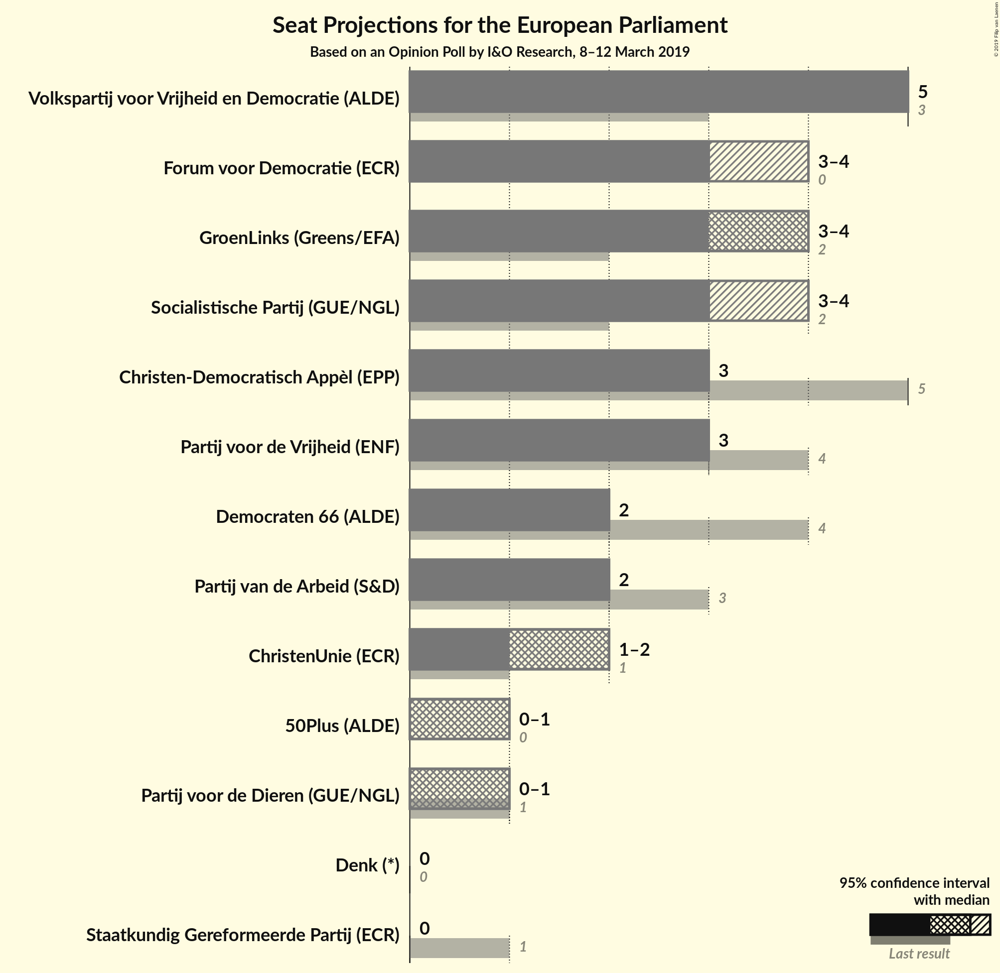

### Confidence Intervals

| Party | Last Result | Median | 80% Confidence Interval | 90% Confidence Interval | 95% Confidence Interval | 99% Confidence Interval |
|:-----:|:-----------:|:------:|:-----------------------:|:-----------------------:|:-----------------------:|:-----------------------:|
| <a href="#volkspartij-voor-vrijheid-en-democratie-(alde)">Volkspartij voor Vrijheid en Democratie (ALDE)</a> | 3 | 5 | 5 |5 |5 |5–6 |
| <a href="#groenlinks-(greens/efa)">GroenLinks (Greens/EFA)</a> | 2 | 4 | 4 |4 |3–4 |3–4 |
| <a href="#forum-voor-democratie-(ecr)">Forum voor Democratie (ECR)</a> | 0 | 4 | 3–4 |3–4 |3–4 |3–4 |
| <a href="#partij-voor-de-vrijheid-(enf)">Partij voor de Vrijheid (ENF)</a> | 4 | 3 | 3–4 |3–4 |3–4 |3–4 |
| <a href="#christen-democratisch-appèl-(epp)">Christen-Democratisch Appèl (EPP)</a> | 5 | 3 | 3 |3 |3–4 |2–4 |
| <a href="#socialistische-partij-(gue/ngl)">Socialistische Partij (GUE/NGL)</a> | 2 | 3 | 3 |3 |3–4 |3–4 |
| <a href="#democraten-66-(alde)">Democraten 66 (ALDE)</a> | 4 | 2 | 2 |2 |2 |2–3 |
| <a href="#partij-van-de-arbeid-(s&d)">Partij van de Arbeid (S&D)</a> | 3 | 2 | 2 |2 |2 |2–3 |
| <a href="#christenunie-(ecr)">ChristenUnie (ECR)</a> | 1 | 2 | 1–2 |1–2 |1–2 |1–2 |
| <a href="#50plus-(*)">50Plus (*)</a> | 0 | 1 | 0–1 |0–1 |0–1 |0–1 |
| <a href="#partij-voor-de-dieren-(gue/ngl)">Partij voor de Dieren (GUE/NGL)</a> | 1 | 1 | 1 |0–1 |0–1 |0–1 |
| <a href="#denk-(*)">Denk (*)</a> | 0 | 0 | 0 |0 |0 |0 |
| <a href="#staatkundig-gereformeerde-partij-(ecr)">Staatkundig Gereformeerde Partij (ECR)</a> | 1 | 0 | 0 |0 |0 |0 |

### Volkspartij voor Vrijheid en Democratie (ALDE)

*For a full overview of the results for this party, see the [Volkspartij voor Vrijheid en Democratie (ALDE)](party-volkspartijvoorvrijheidendemocratiealde.html) page.*

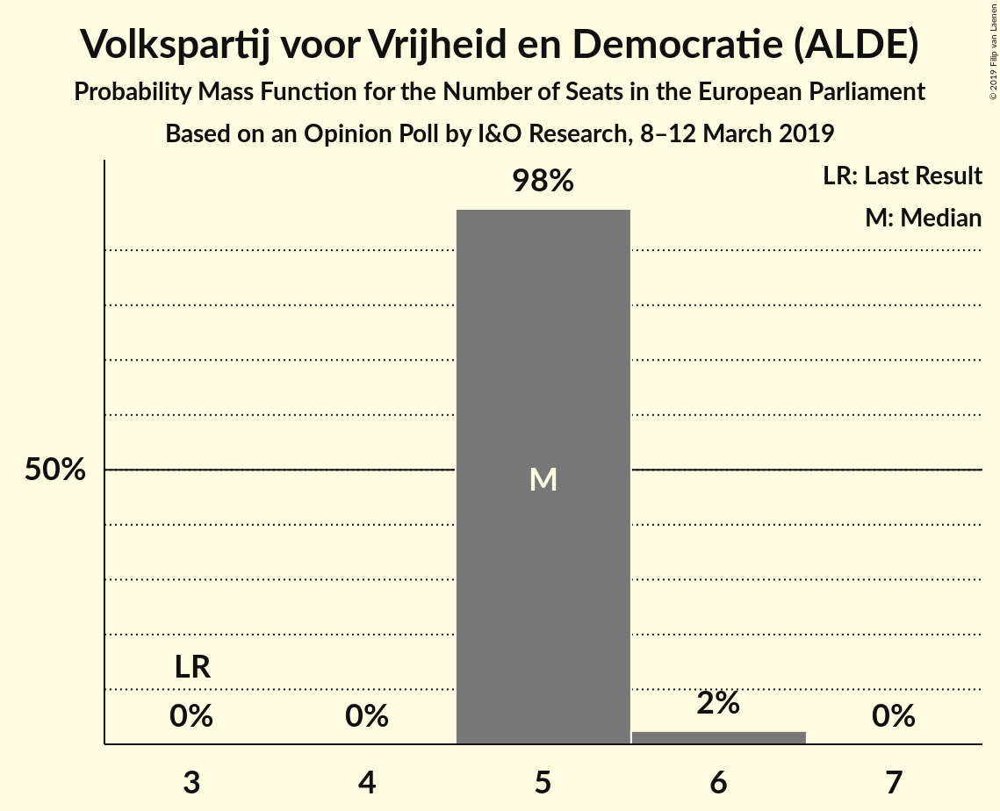

| Number of Seats | Probability | Accumulated | Special Marks |
|:---------------:|:-----------:|:-----------:|:-------------:|
| 3 | 0% | 100% | Last Result |
| 4 | 0% | 100% |  |
| 5 | 98% | 100% | Median |
| 6 | 2% | 2% |  |
| 7 | 0% | 0% |  |

### GroenLinks (Greens/EFA)

*For a full overview of the results for this party, see the [GroenLinks (Greens/EFA)](party-groenlinksgreensefa.html) page.*

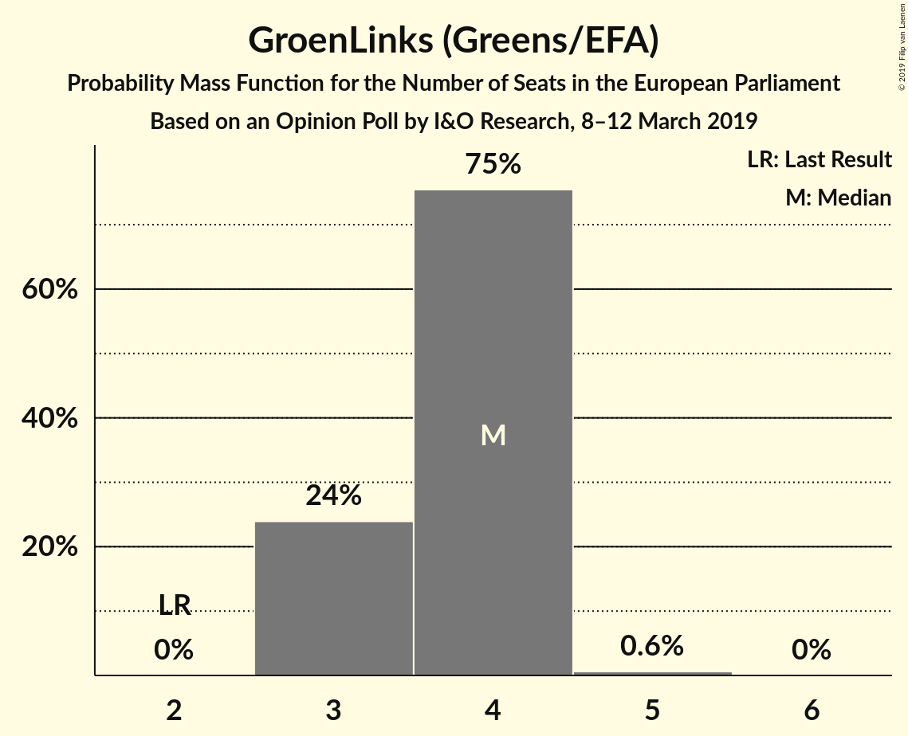

| Number of Seats | Probability | Accumulated | Special Marks |
|:---------------:|:-----------:|:-----------:|:-------------:|
| 2 | 0% | 100% | Last Result |
| 3 | 3% | 100% |  |
| 4 | 96% | 97% | Median |
| 5 | 0.3% | 0.3% |  |
| 6 | 0% | 0% |  |

### Forum voor Democratie (ECR)

*For a full overview of the results for this party, see the [Forum voor Democratie (ECR)](party-forumvoordemocratieecr.html) page.*

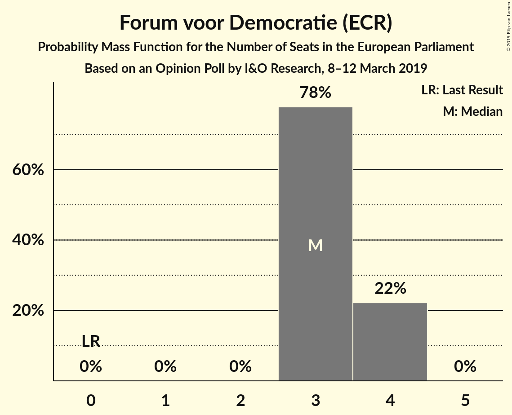

| Number of Seats | Probability | Accumulated | Special Marks |
|:---------------:|:-----------:|:-----------:|:-------------:|
| 0 | 0% | 100% | Last Result |
| 1 | 0% | 100% |  |
| 2 | 0% | 100% |  |
| 3 | 48% | 100% |  |
| 4 | 52% | 52% | Median |
| 5 | 0.1% | 0.1% |  |
| 6 | 0% | 0% |  |

### Partij voor de Vrijheid (ENF)

*For a full overview of the results for this party, see the [Partij voor de Vrijheid (ENF)](party-partijvoordevrijheidenf.html) page.*

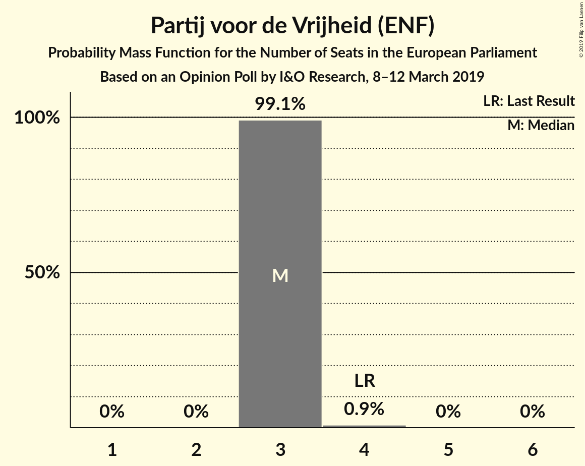

| Number of Seats | Probability | Accumulated | Special Marks |
|:---------------:|:-----------:|:-----------:|:-------------:|
| 3 | 58% | 100% | Median |
| 4 | 42% | 42% | Last Result |
| 5 | 0% | 0% |  |

### Christen-Democratisch Appèl (EPP)

*For a full overview of the results for this party, see the [Christen-Democratisch Appèl (EPP)](party-christen-democratischappèlepp.html) page.*

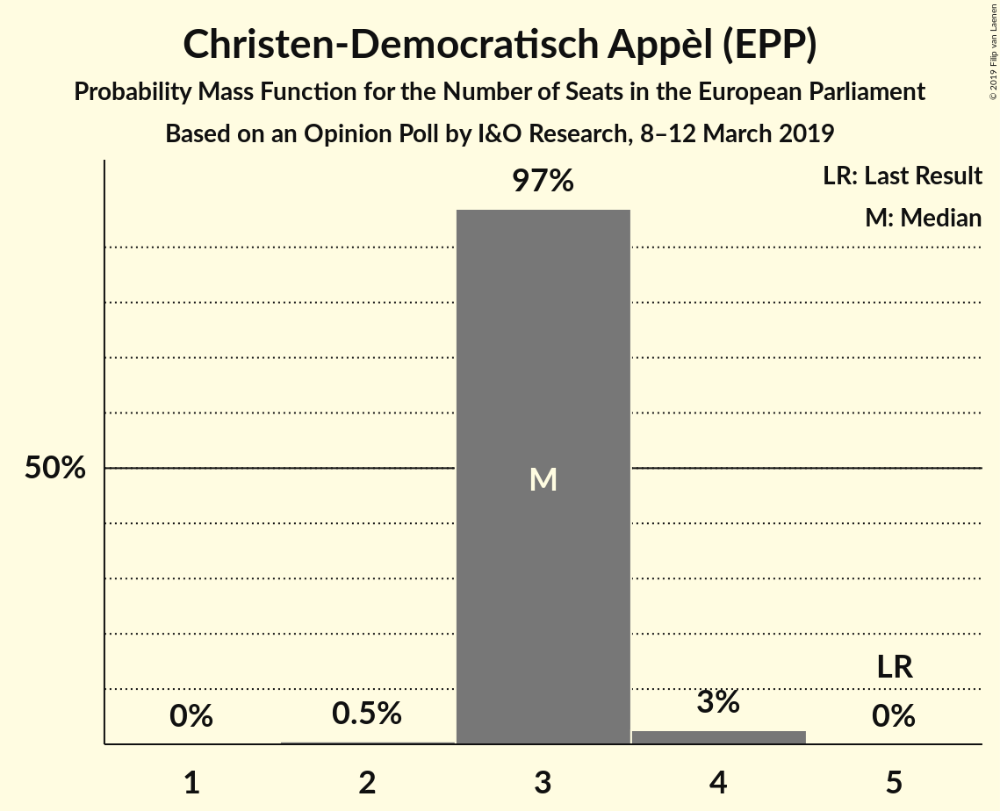

| Number of Seats | Probability | Accumulated | Special Marks |
|:---------------:|:-----------:|:-----------:|:-------------:|
| 2 | 0.5% | 100% |  |
| 3 | 97% | 99.5% | Median |
| 4 | 3% | 3% |  |
| 5 | 0% | 0% | Last Result |

### Socialistische Partij (GUE/NGL)

*For a full overview of the results for this party, see the [Socialistische Partij (GUE/NGL)](party-socialistischepartijguengl.html) page.*

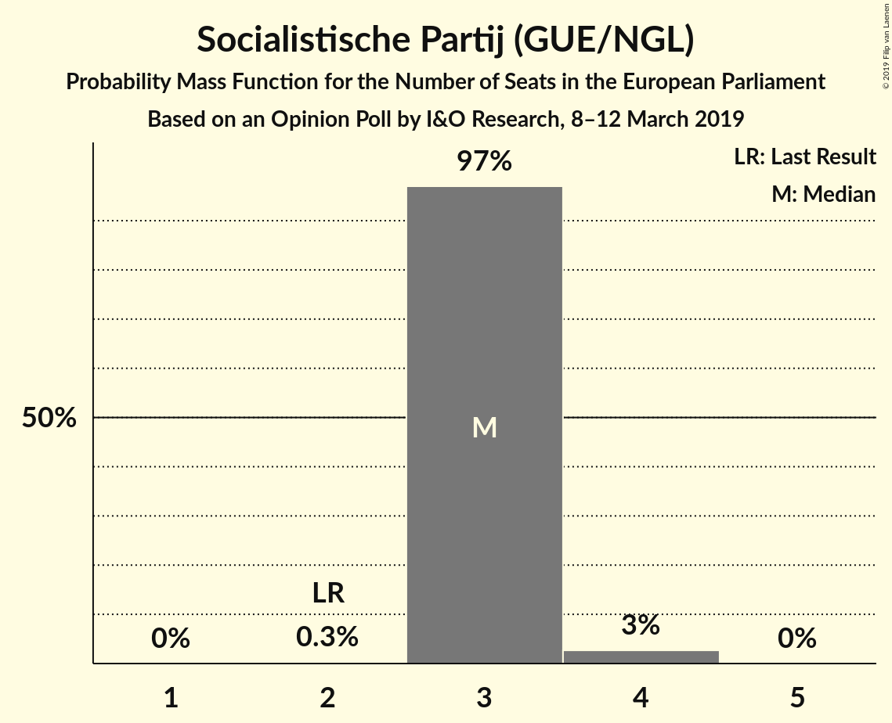

| Number of Seats | Probability | Accumulated | Special Marks |
|:---------------:|:-----------:|:-----------:|:-------------:|
| 2 | 0.3% | 100% | Last Result |
| 3 | 97% | 99.7% | Median |
| 4 | 3% | 3% |  |
| 5 | 0% | 0% |  |

### Democraten 66 (ALDE)

*For a full overview of the results for this party, see the [Democraten 66 (ALDE)](party-democraten66alde.html) page.*

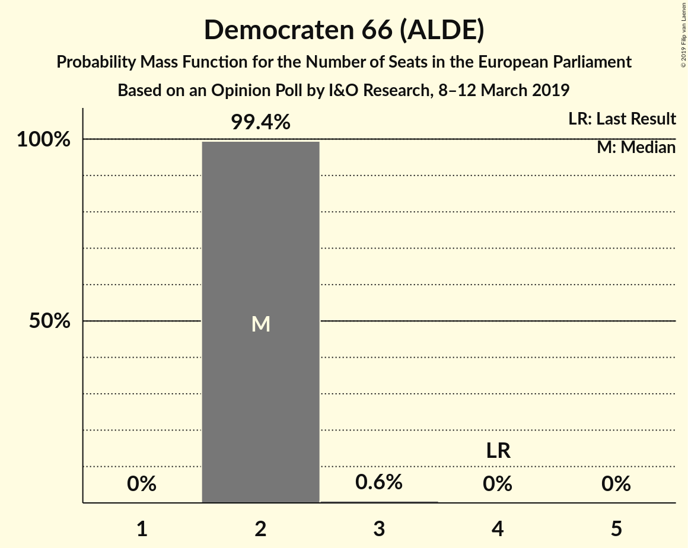

| Number of Seats | Probability | Accumulated | Special Marks |
|:---------------:|:-----------:|:-----------:|:-------------:|
| 2 | 99.4% | 100% | Median |
| 3 | 0.6% | 0.6% |  |
| 4 | 0% | 0% | Last Result |

### Partij van de Arbeid (S&D)

*For a full overview of the results for this party, see the [Partij van de Arbeid (S&D)](party-partijvandearbeidsd.html) page.*

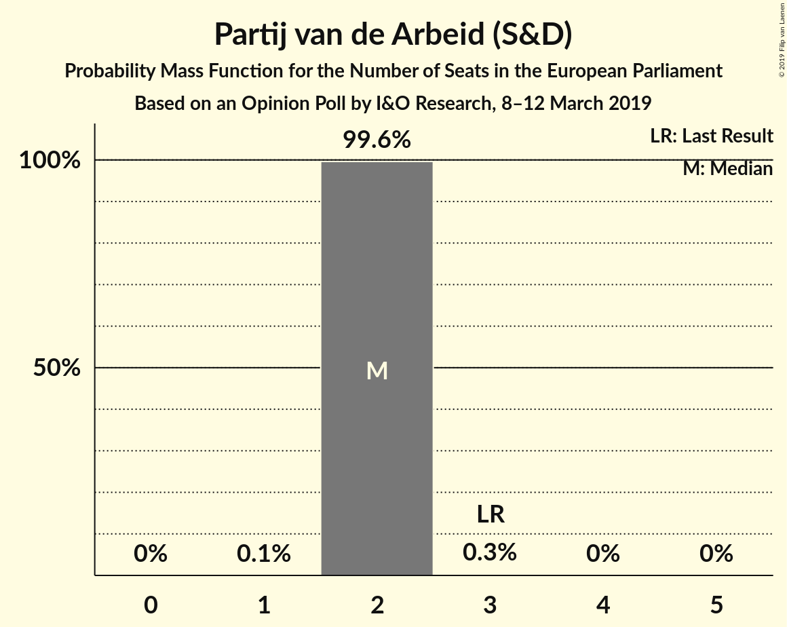

| Number of Seats | Probability | Accumulated | Special Marks |
|:---------------:|:-----------:|:-----------:|:-------------:|
| 1 | 0.1% | 100% |  |
| 2 | 98% | 99.9% | Median |
| 3 | 2% | 2% | Last Result |
| 4 | 0% | 0% |  |

### ChristenUnie (ECR)

*For a full overview of the results for this party, see the [ChristenUnie (ECR)](party-christenunieecr.html) page.*

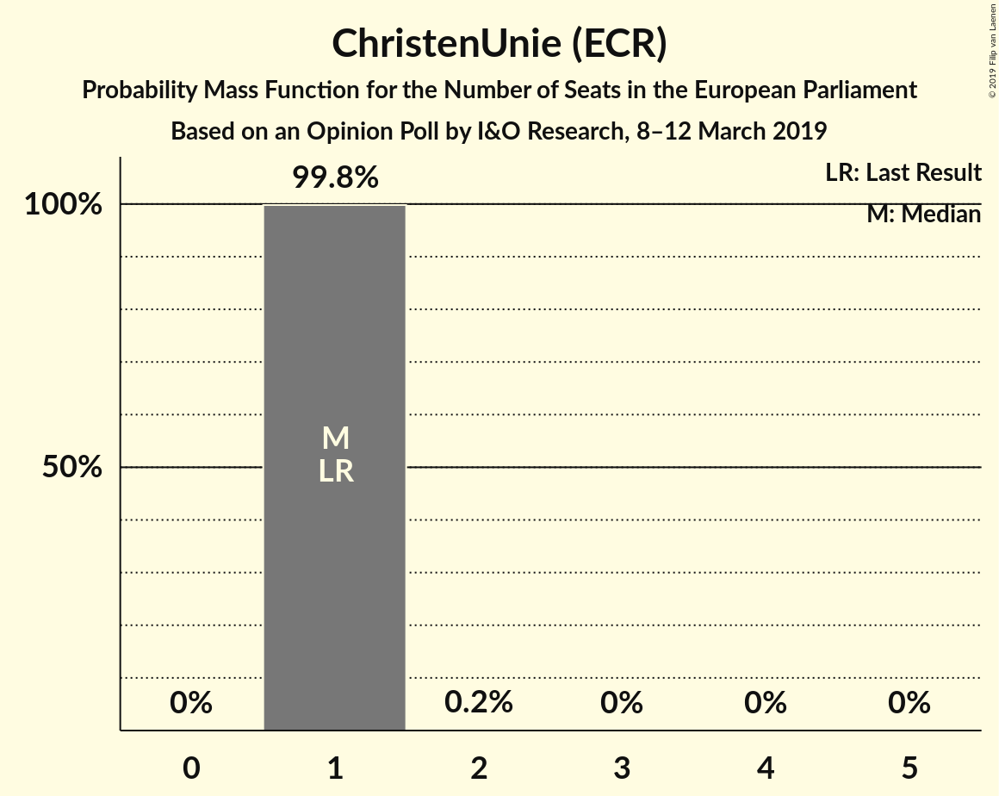

| Number of Seats | Probability | Accumulated | Special Marks |
|:---------------:|:-----------:|:-----------:|:-------------:|
| 1 | 49% | 100% | Last Result |
| 2 | 51% | 51% | Median |
| 3 | 0% | 0% |  |

### 50Plus (*)

*For a full overview of the results for this party, see the [50Plus (*)](party-50plus.html) page.*

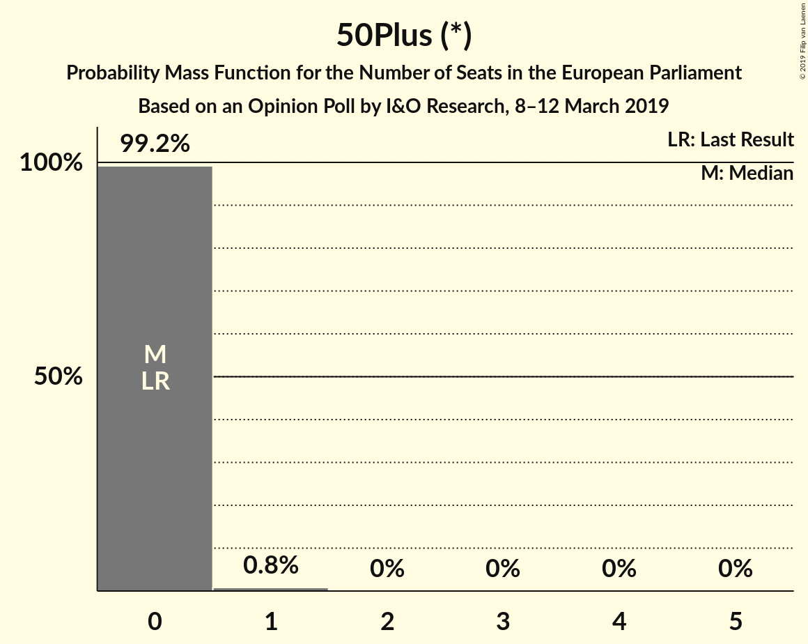

| Number of Seats | Probability | Accumulated | Special Marks |
|:---------------:|:-----------:|:-----------:|:-------------:|
| 0 | 44% | 100% | Last Result |
| 1 | 56% | 56% | Median |
| 2 | 0% | 0% |  |

### Partij voor de Dieren (GUE/NGL)

*For a full overview of the results for this party, see the [Partij voor de Dieren (GUE/NGL)](party-partijvoordedierenguengl.html) page.*

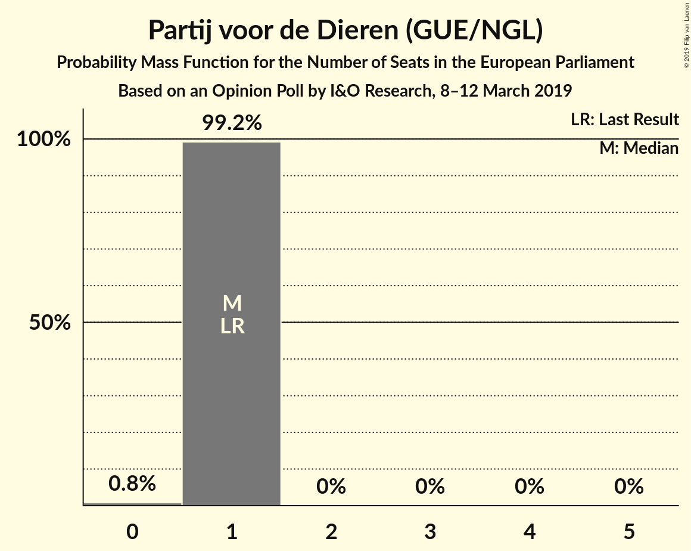

| Number of Seats | Probability | Accumulated | Special Marks |
|:---------------:|:-----------:|:-----------:|:-------------:|
| 0 | 6% | 100% |  |
| 1 | 94% | 94% | Last Result, Median |
| 2 | 0% | 0% |  |

### Denk (*)

*For a full overview of the results for this party, see the [Denk (*)](party-denk.html) page.*

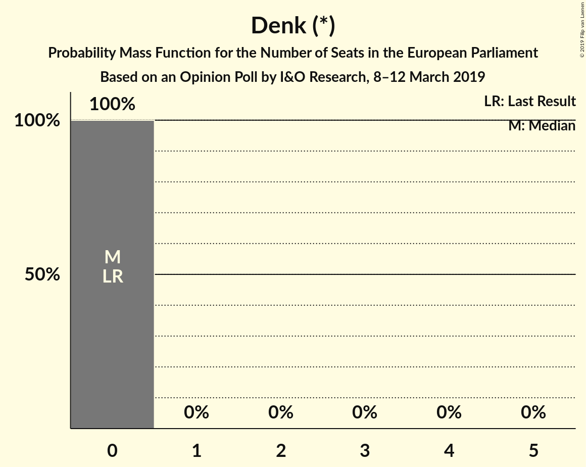

| Number of Seats | Probability | Accumulated | Special Marks |
|:---------------:|:-----------:|:-----------:|:-------------:|
| 0 | 100% | 100% | Last Result, Median |

### Staatkundig Gereformeerde Partij (ECR)

*For a full overview of the results for this party, see the [Staatkundig Gereformeerde Partij (ECR)](party-staatkundiggereformeerdepartijecr.html) page.*

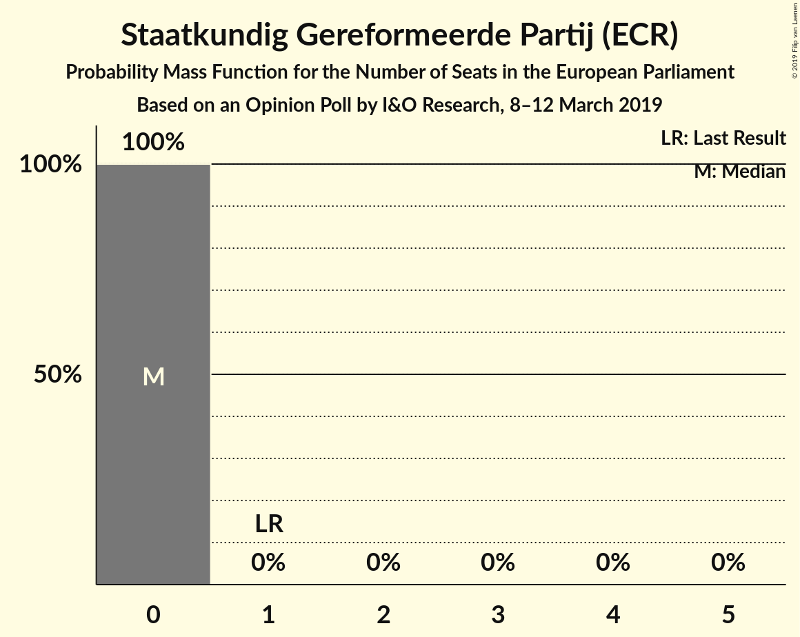

| Number of Seats | Probability | Accumulated | Special Marks |
|:---------------:|:-----------:|:-----------:|:-------------:|
| 0 | 100% | 100% | Median |
| 1 | 0% | 0% | Last Result |

## Coalitions

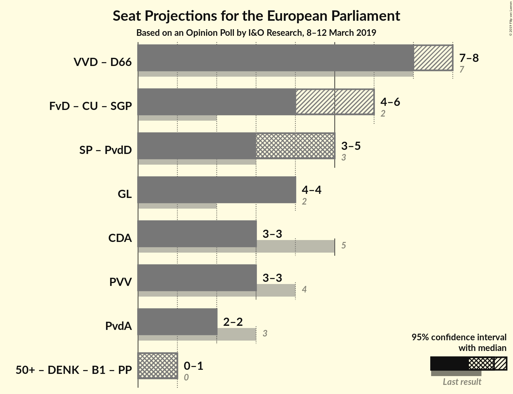

### Confidence Intervals

| Coalition | Last Result | Median | Majority? | 80% Confidence Interval | 90% Confidence Interval | 95% Confidence Interval | 99% Confidence Interval |
|:---------:|:-----------:|:------:|:---------:|:-----------------------:|:-----------------------:|:-----------------------:|:-----------------------:|
| Volkspartij voor Vrijheid en Democratie (ALDE) – Democraten 66 (ALDE) | 7 | 7 | 0% | 7 | 7 | 7–8 | 7–8 |
| Forum voor Democratie (ECR) – ChristenUnie (ECR) – Staatkundig Gereformeerde Partij (ECR) | 2 | 5 | 0% | 5 | 5 | 5–6 | 4–6 |
| Christen-Democratisch Appèl (EPP) | 5 | 3 | 0% | 3 | 3 | 3–4 | 2–4 |
| GroenLinks (Greens/EFA) | 2 | 4 | 0% | 4 | 4 | 3–4 | 3–4 |
| Socialistische Partij (GUE/NGL) – Partij voor de Dieren (GUE/NGL) | 3 | 4 | 0% | 4 | 3–4 | 3–4 | 3–5 |
| Partij voor de Vrijheid (ENF) | 4 | 3 | 0% | 3–4 | 3–4 | 3–4 | 3–4 |
| Partij van de Arbeid (S&D) | 3 | 2 | 0% | 2 | 2 | 2 | 2–3 |

### Volkspartij voor Vrijheid en Democratie (ALDE) – Democraten 66 (ALDE)

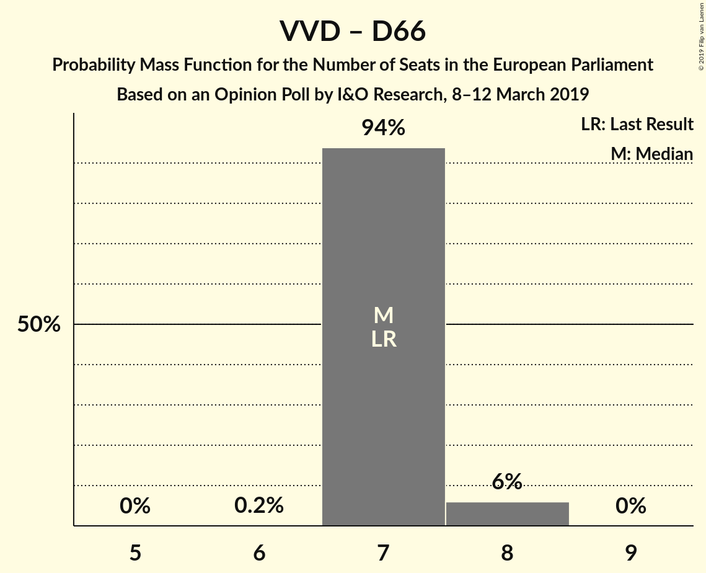

| Number of Seats | Probability | Accumulated | Special Marks |
|:---------------:|:-----------:|:-----------:|:-------------:|
| 7 | 97% | 100% | Last Result, Median |
| 8 | 2% | 3% |  |
| 9 | 0.3% | 0.3% |  |
| 10 | 0% | 0% |  |

### Forum voor Democratie (ECR) – ChristenUnie (ECR) – Staatkundig Gereformeerde Partij (ECR)

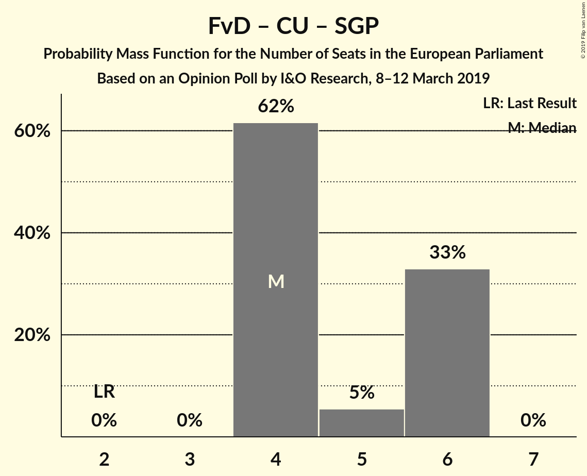

| Number of Seats | Probability | Accumulated | Special Marks |
|:---------------:|:-----------:|:-----------:|:-------------:|
| 2 | 0% | 100% | Last Result |
| 3 | 0% | 100% |  |
| 4 | 2% | 100% |  |
| 5 | 94% | 98% |  |
| 6 | 4% | 5% | Median |
| 7 | 0% | 0% |  |

### Christen-Democratisch Appèl (EPP)

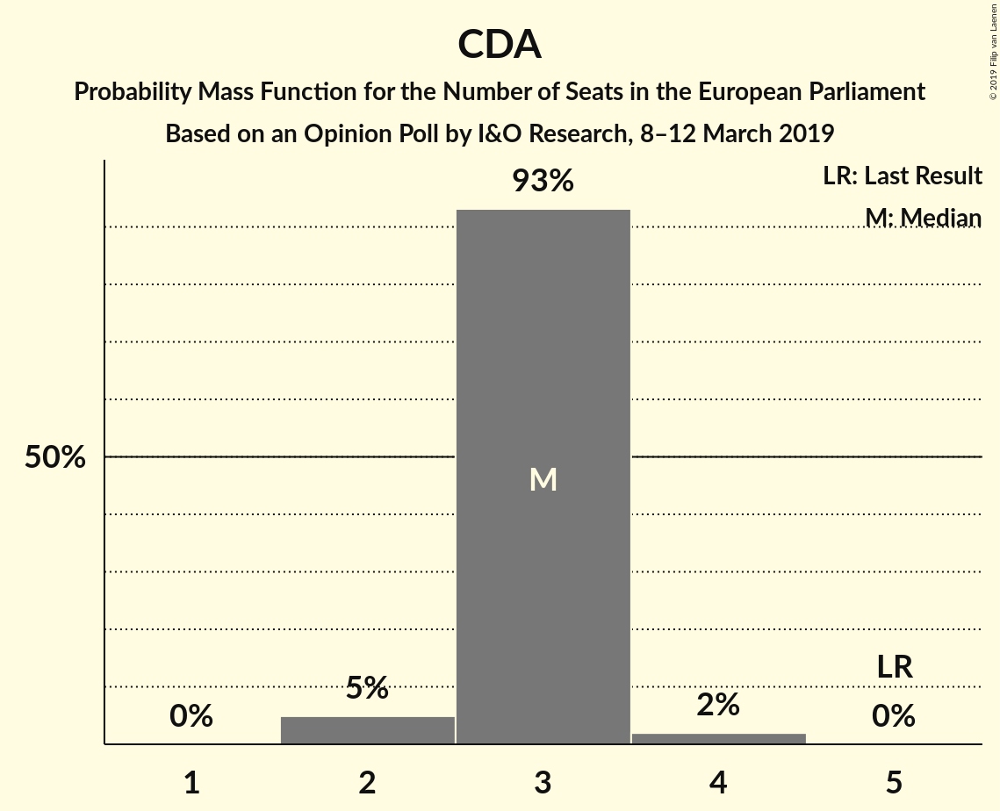

| Number of Seats | Probability | Accumulated | Special Marks |
|:---------------:|:-----------:|:-----------:|:-------------:|
| 2 | 0.5% | 100% |  |
| 3 | 97% | 99.5% | Median |
| 4 | 3% | 3% |  |
| 5 | 0% | 0% | Last Result |

### GroenLinks (Greens/EFA)

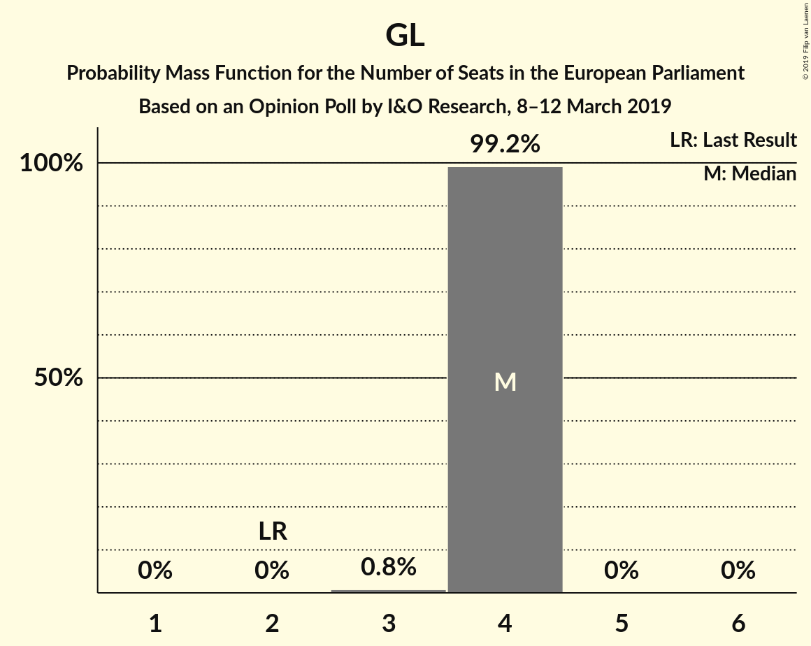

| Number of Seats | Probability | Accumulated | Special Marks |
|:---------------:|:-----------:|:-----------:|:-------------:|
| 2 | 0% | 100% | Last Result |
| 3 | 3% | 100% |  |
| 4 | 96% | 97% | Median |
| 5 | 0.3% | 0.3% |  |
| 6 | 0% | 0% |  |

### Socialistische Partij (GUE/NGL) – Partij voor de Dieren (GUE/NGL)

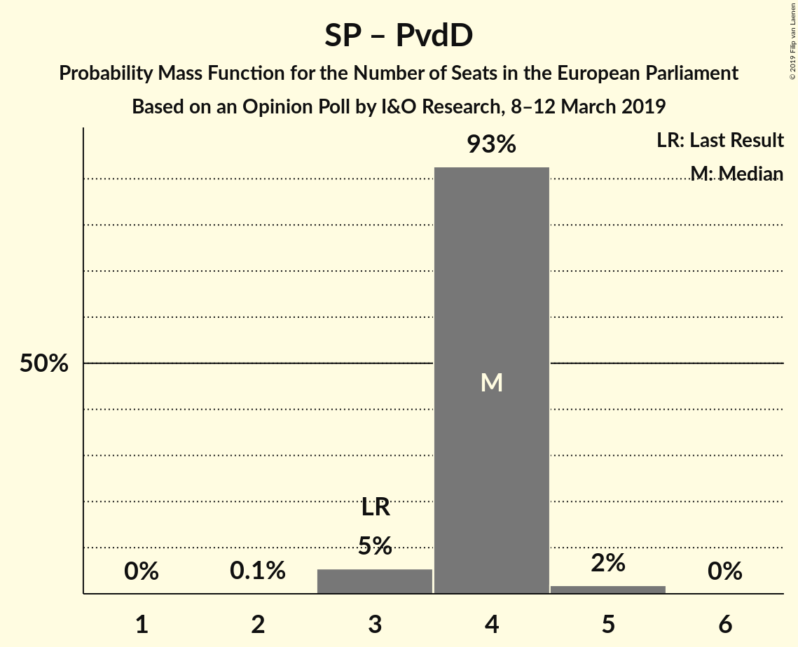

| Number of Seats | Probability | Accumulated | Special Marks |
|:---------------:|:-----------:|:-----------:|:-------------:|
| 2 | 0.1% | 100% |  |
| 3 | 5% | 99.9% | Last Result |
| 4 | 93% | 94% | Median |
| 5 | 2% | 2% |  |
| 6 | 0% | 0% |  |

### Partij voor de Vrijheid (ENF)

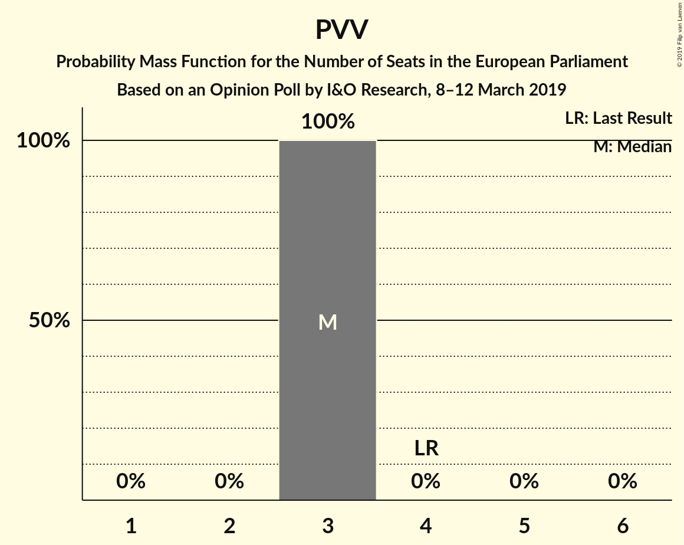

| Number of Seats | Probability | Accumulated | Special Marks |
|:---------------:|:-----------:|:-----------:|:-------------:|
| 3 | 58% | 100% | Median |
| 4 | 42% | 42% | Last Result |
| 5 | 0% | 0% |  |

### Partij van de Arbeid (S&D)

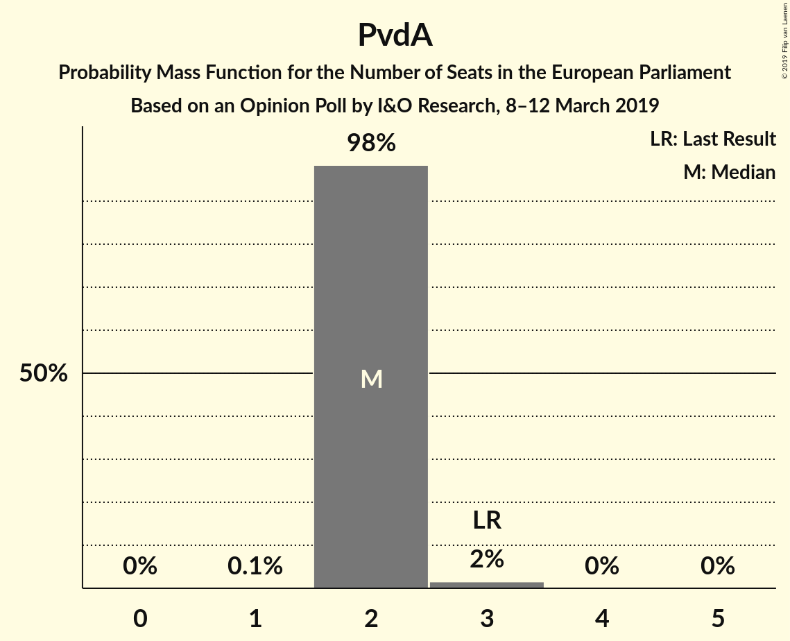

| Number of Seats | Probability | Accumulated | Special Marks |
|:---------------:|:-----------:|:-----------:|:-------------:|
| 1 | 0.1% | 100% |  |
| 2 | 98% | 99.9% | Median |
| 3 | 2% | 2% | Last Result |
| 4 | 0% | 0% |  |

## Technical Information

### Opinion Poll

+ **Polling firm:** I&O Research
+ **Commissioner(s):** —
+ **Fieldwork period:** 8–12 March 2019

### Calculations

+ **Sample size:** 2084
+ **Simulations done:** 524,288
+ **Error estimate:** 2.09%

