# Opinion Poll by Peil.nl, 11–17 March 2019

<a href="#voting-intentions">Voting Intentions</a> | <a href="#seats">Seats</a> | <a href="#coalitions">Coalitions</a> | <a href="#technical-information">Technical Information</a>

## Voting Intentions

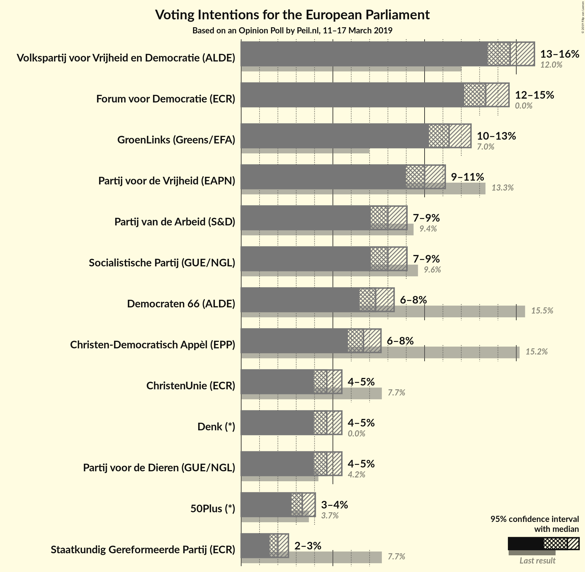

### Confidence Intervals

| Party | Last Result | Poll Result | 80% Confidence Interval | 90% Confidence Interval | 95% Confidence Interval | 99% Confidence Interval |
|:-----:|:-----------:|:-----------:|:-----------------------:|:-----------------------:|:-----------------------:|:-----------------------:|
| Volkspartij voor Vrijheid en Democratie (ALDE) | 12.0% | 14.7% | 13.9–15.5% |13.6–15.8% |13.4–16.0% |13.1–16.4% |
| Forum voor Democratie (ECR) | 0.0% | 13.3% | 12.6–14.2% |12.3–14.4% |12.2–14.6% |11.8–15.0% |
| GroenLinks (Greens/EFA) | 7.0% | 11.3% | 10.6–12.1% |10.4–12.3% |10.2–12.5% |9.9–12.9% |
| Partij voor de Vrijheid (ENF) | 13.3% | 10.0% | 9.3–10.7% |9.1–10.9% |9.0–11.1% |8.7–11.5% |
| Socialistische Partij (GUE/NGL) | 9.6% | 8.0% | 7.4–8.7% |7.2–8.9% |7.1–9.0% |6.8–9.4% |
| Partij van de Arbeid (S&D) | 9.4% | 8.0% | 7.4–8.7% |7.2–8.9% |7.1–9.0% |6.8–9.4% |
| Democraten 66 (ALDE) | 15.5% | 7.3% | 6.8–8.0% |6.6–8.2% |6.4–8.3% |6.2–8.6% |
| Christen-Democratisch Appèl (EPP) | 15.2% | 6.7% | 6.1–7.3% |6.0–7.5% |5.8–7.6% |5.6–7.9% |
| ChristenUnie (ECR) | 7.7% | 4.7% | 4.2–5.2% |4.1–5.3% |4.0–5.5% |3.7–5.8% |
| Partij voor de Dieren (GUE/NGL) | 4.2% | 4.7% | 4.2–5.2% |4.1–5.3% |4.0–5.5% |3.7–5.8% |
| Denk (*) | 0.0% | 4.7% | 4.2–5.2% |4.1–5.3% |4.0–5.5% |3.7–5.8% |
| 50Plus (*) | 3.7% | 3.3% | 2.9–3.8% |2.8–3.9% |2.7–4.0% |2.6–4.3% |
| Staatkundig Gereformeerde Partij (ECR) | 7.7% | 2.0% | 1.7–2.4% |1.6–2.5% |1.6–2.6% |1.4–2.8% |

*Note:* The poll result column reflects the actual value used in the calculations. Published results may vary slightly, and in addition be rounded to fewer digits.

## Seats

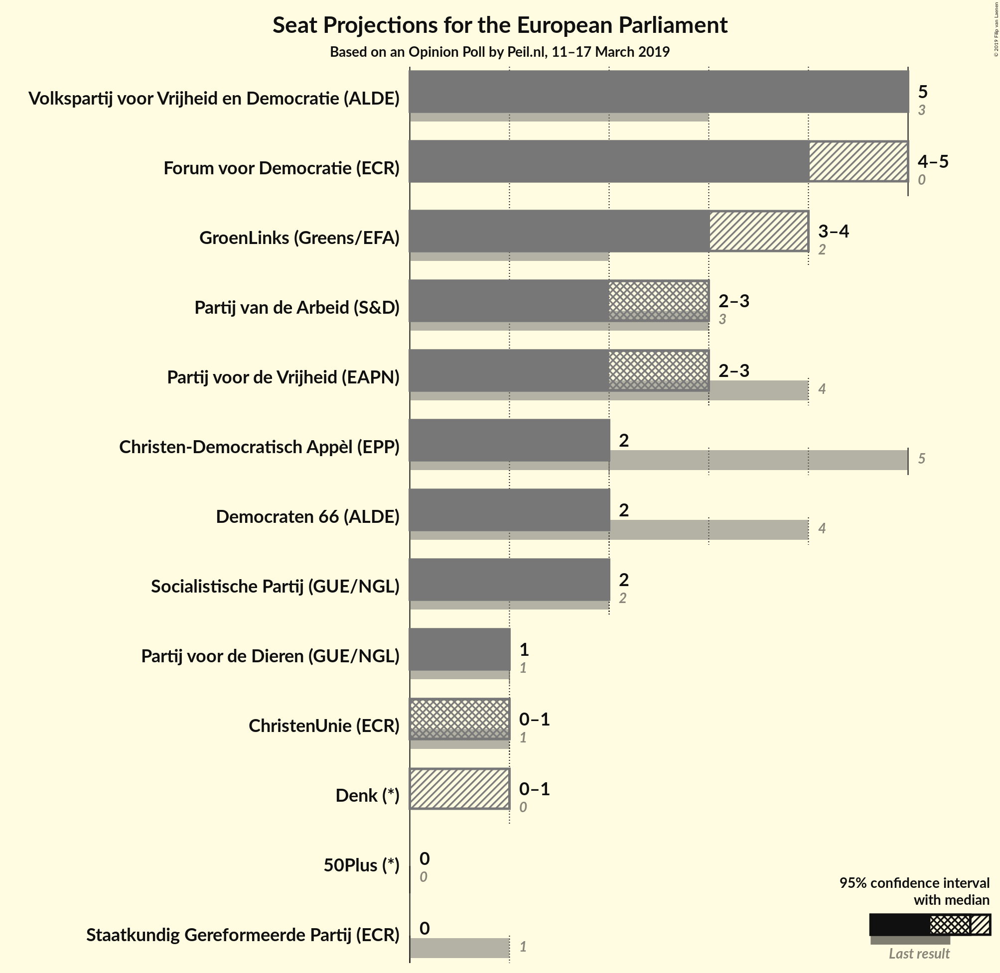

### Confidence Intervals

| Party | Last Result | Median | 80% Confidence Interval | 90% Confidence Interval | 95% Confidence Interval | 99% Confidence Interval |
|:-----:|:-----------:|:------:|:-----------------------:|:-----------------------:|:-----------------------:|:-----------------------:|
| <a href="#volkspartij-voor-vrijheid-en-democratie-(alde)">Volkspartij voor Vrijheid en Democratie (ALDE)</a> | 3 | 5 | 5 |5 |4–5 |4–6 |
| <a href="#forum-voor-democratie-(ecr)">Forum voor Democratie (ECR)</a> | 0 | 4 | 4–5 |4–5 |4–5 |4–5 |
| <a href="#groenlinks-(greens/efa)">GroenLinks (Greens/EFA)</a> | 2 | 4 | 3–4 |3–4 |3–4 |3–4 |
| <a href="#partij-voor-de-vrijheid-(enf)">Partij voor de Vrijheid (ENF)</a> | 4 | 3 | 3–4 |3–4 |3–4 |3–4 |
| <a href="#socialistische-partij-(gue/ngl)">Socialistische Partij (GUE/NGL)</a> | 2 | 3 | 2–3 |2–3 |2–3 |2–3 |
| <a href="#partij-van-de-arbeid-(s&d)">Partij van de Arbeid (S&D)</a> | 3 | 2 | 2–3 |2–3 |2–3 |2–3 |
| <a href="#democraten-66-(alde)">Democraten 66 (ALDE)</a> | 4 | 2 | 2 |2–3 |2–3 |2–3 |
| <a href="#christen-democratisch-appèl-(epp)">Christen-Democratisch Appèl (EPP)</a> | 5 | 2 | 2 |2 |2 |2 |
| <a href="#christenunie-(ecr)">ChristenUnie (ECR)</a> | 1 | 1 | 1 |1 |1–2 |1–2 |
| <a href="#partij-voor-de-dieren-(gue/ngl)">Partij voor de Dieren (GUE/NGL)</a> | 1 | 1 | 1 |1 |1 |1–2 |
| <a href="#denk-(*)">Denk (*)</a> | 0 | 1 | 1 |1 |1 |1–2 |
| <a href="#50plus-(*)">50Plus (*)</a> | 0 | 1 | 0–1 |0–1 |0–1 |0–1 |
| <a href="#staatkundig-gereformeerde-partij-(ecr)">Staatkundig Gereformeerde Partij (ECR)</a> | 1 | 0 | 0 |0 |0 |0 |

### Volkspartij voor Vrijheid en Democratie (ALDE)

*For a full overview of the results for this party, see the [Volkspartij voor Vrijheid en Democratie (ALDE)](party-volkspartijvoorvrijheidendemocratiealde.html) page.*

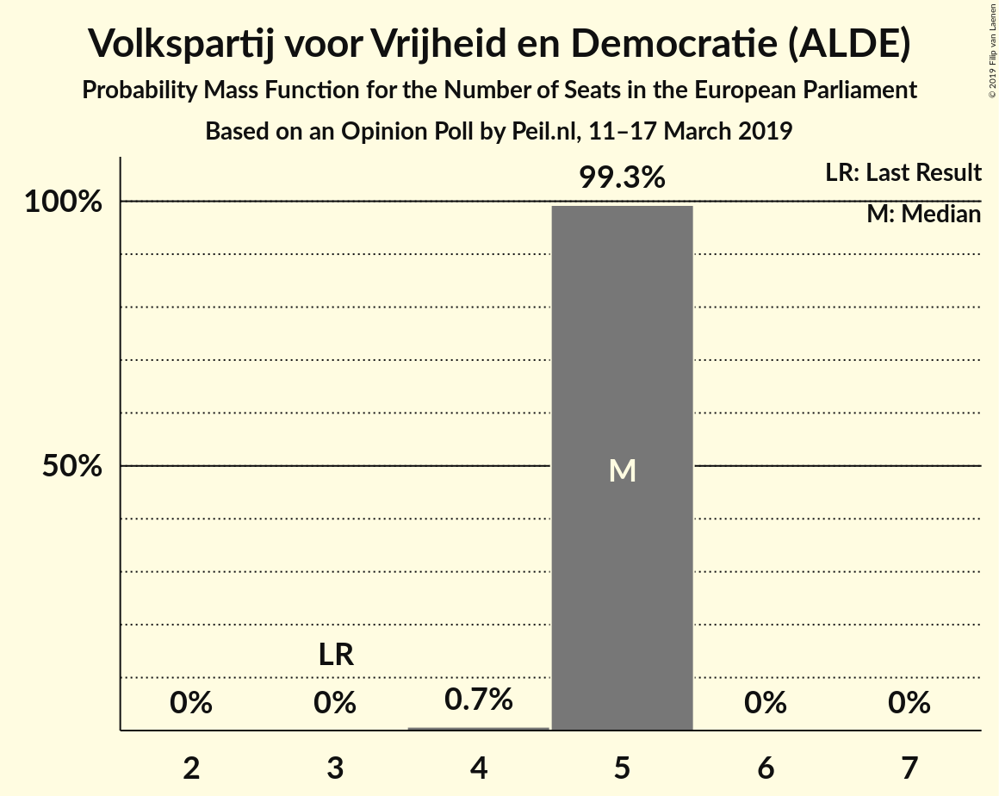

| Number of Seats | Probability | Accumulated | Special Marks |
|:---------------:|:-----------:|:-----------:|:-------------:|
| 3 | 0% | 100% | Last Result |
| 4 | 4% | 100% |  |
| 5 | 94% | 96% | Median |
| 6 | 1.3% | 1.3% |  |
| 7 | 0% | 0% |  |

### Forum voor Democratie (ECR)

*For a full overview of the results for this party, see the [Forum voor Democratie (ECR)](party-forumvoordemocratieecr.html) page.*

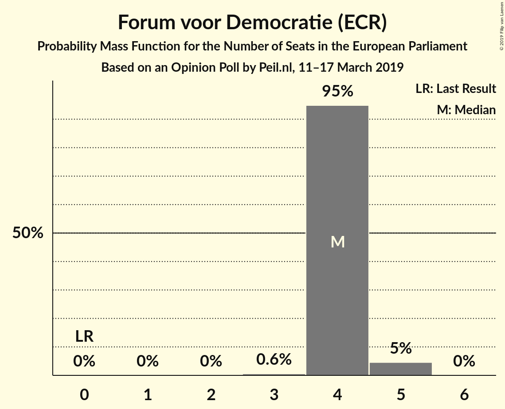

| Number of Seats | Probability | Accumulated | Special Marks |
|:---------------:|:-----------:|:-----------:|:-------------:|
| 0 | 0% | 100% | Last Result |
| 1 | 0% | 100% |  |
| 2 | 0% | 100% |  |
| 3 | 0% | 100% |  |
| 4 | 82% | 100% | Median |
| 5 | 18% | 18% |  |
| 6 | 0% | 0% |  |

### GroenLinks (Greens/EFA)

*For a full overview of the results for this party, see the [GroenLinks (Greens/EFA)](party-groenlinksgreensefa.html) page.*

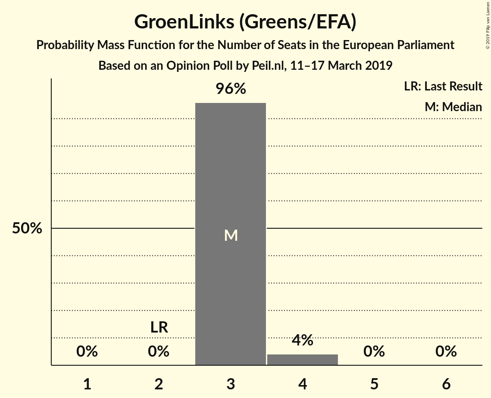

| Number of Seats | Probability | Accumulated | Special Marks |
|:---------------:|:-----------:|:-----------:|:-------------:|
| 2 | 0% | 100% | Last Result |
| 3 | 21% | 100% |  |
| 4 | 79% | 79% | Median |
| 5 | 0.1% | 0.1% |  |
| 6 | 0% | 0% |  |

### Partij voor de Vrijheid (ENF)

*For a full overview of the results for this party, see the [Partij voor de Vrijheid (ENF)](party-partijvoordevrijheidenf.html) page.*

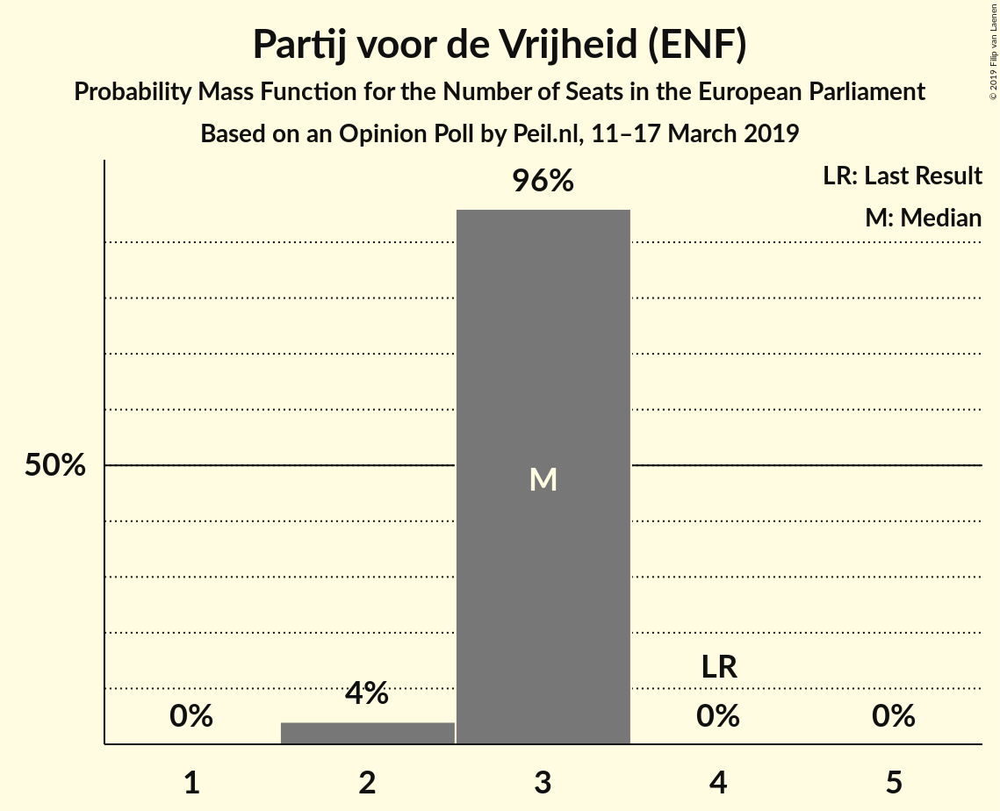

| Number of Seats | Probability | Accumulated | Special Marks |
|:---------------:|:-----------:|:-----------:|:-------------:|
| 3 | 63% | 100% | Median |
| 4 | 37% | 37% | Last Result |
| 5 | 0% | 0% |  |

### Socialistische Partij (GUE/NGL)

*For a full overview of the results for this party, see the [Socialistische Partij (GUE/NGL)](party-socialistischepartijguengl.html) page.*

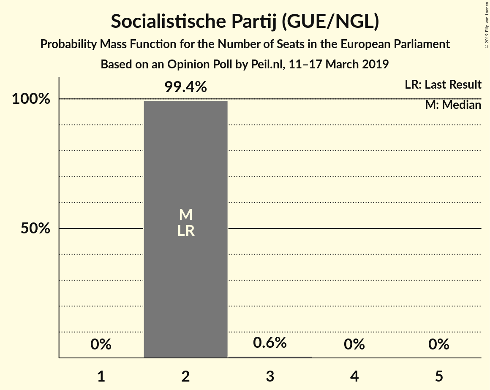

| Number of Seats | Probability | Accumulated | Special Marks |
|:---------------:|:-----------:|:-----------:|:-------------:|
| 2 | 34% | 100% | Last Result |
| 3 | 66% | 66% | Median |
| 4 | 0% | 0% |  |

### Partij van de Arbeid (S&D)

*For a full overview of the results for this party, see the [Partij van de Arbeid (S&D)](party-partijvandearbeidsd.html) page.*

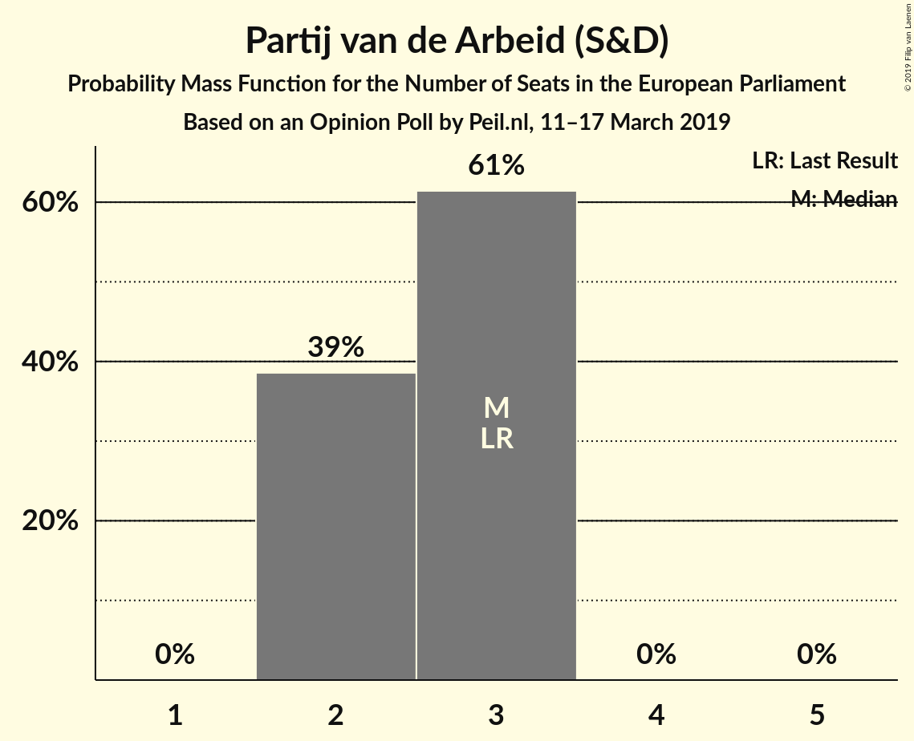

| Number of Seats | Probability | Accumulated | Special Marks |
|:---------------:|:-----------:|:-----------:|:-------------:|
| 2 | 60% | 100% | Median |
| 3 | 40% | 40% | Last Result |
| 4 | 0% | 0% |  |

### Democraten 66 (ALDE)

*For a full overview of the results for this party, see the [Democraten 66 (ALDE)](party-democraten66alde.html) page.*

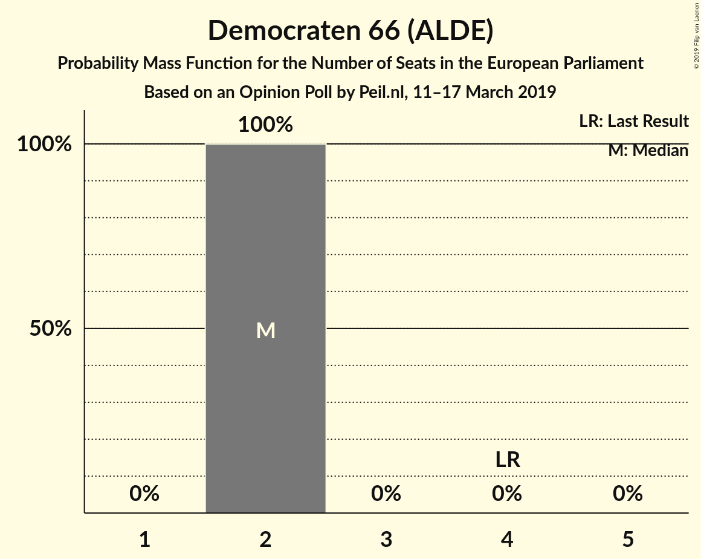

| Number of Seats | Probability | Accumulated | Special Marks |
|:---------------:|:-----------:|:-----------:|:-------------:|
| 2 | 95% | 100% | Median |
| 3 | 5% | 5% |  |
| 4 | 0% | 0% | Last Result |

### Christen-Democratisch Appèl (EPP)

*For a full overview of the results for this party, see the [Christen-Democratisch Appèl (EPP)](party-christen-democratischappèlepp.html) page.*

| Number of Seats | Probability | Accumulated | Special Marks |
|:---------------:|:-----------:|:-----------:|:-------------:|
| 1 | 0.1% | 100% |  |
| 2 | 99.8% | 99.9% | Median |
| 3 | 0.1% | 0.1% |  |
| 4 | 0% | 0% |  |
| 5 | 0% | 0% | Last Result |

### ChristenUnie (ECR)

*For a full overview of the results for this party, see the [ChristenUnie (ECR)](party-christenunieecr.html) page.*

| Number of Seats | Probability | Accumulated | Special Marks |
|:---------------:|:-----------:|:-----------:|:-------------:|
| 1 | 97% | 100% | Last Result, Median |
| 2 | 3% | 3% |  |
| 3 | 0% | 0% |  |

### Partij voor de Dieren (GUE/NGL)

*For a full overview of the results for this party, see the [Partij voor de Dieren (GUE/NGL)](party-partijvoordedierenguengl.html) page.*

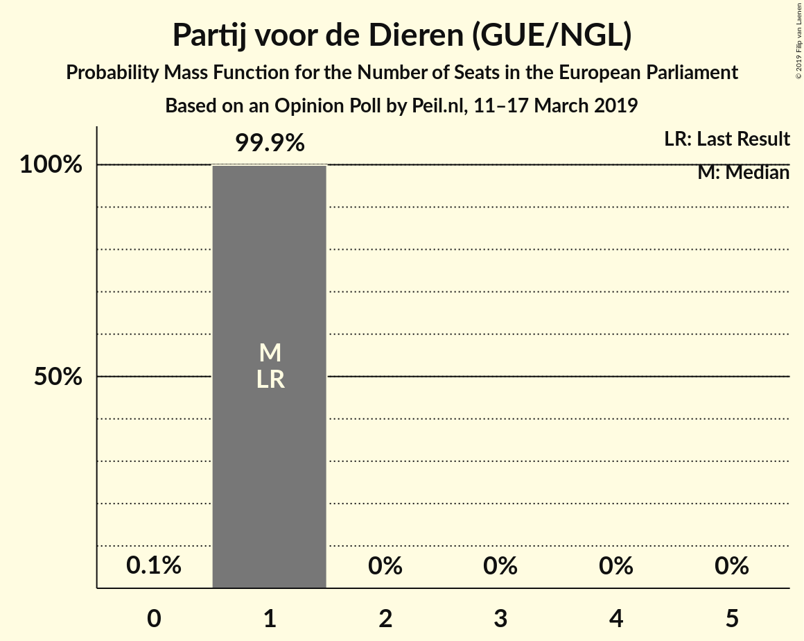

| Number of Seats | Probability | Accumulated | Special Marks |
|:---------------:|:-----------:|:-----------:|:-------------:|
| 1 | 98.8% | 100% | Last Result, Median |
| 2 | 1.2% | 1.2% |  |
| 3 | 0% | 0% |  |

### Denk (*)

*For a full overview of the results for this party, see the [Denk (*)](party-denk.html) page.*

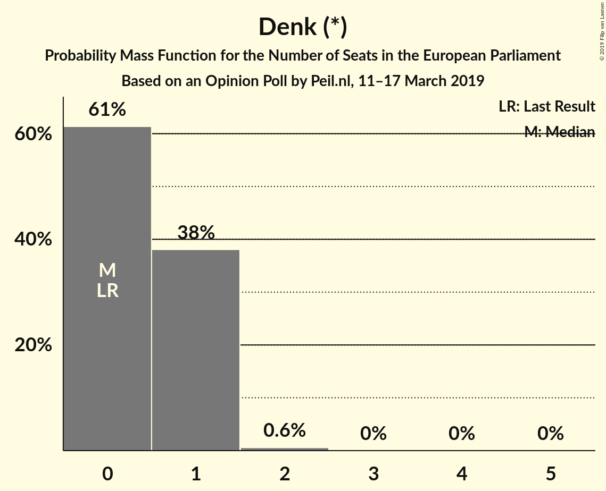

| Number of Seats | Probability | Accumulated | Special Marks |
|:---------------:|:-----------:|:-----------:|:-------------:|
| 0 | 0% | 100% | Last Result |
| 1 | 98% | 100% | Median |
| 2 | 2% | 2% |  |
| 3 | 0% | 0% |  |

### 50Plus (*)

*For a full overview of the results for this party, see the [50Plus (*)](party-50plus.html) page.*

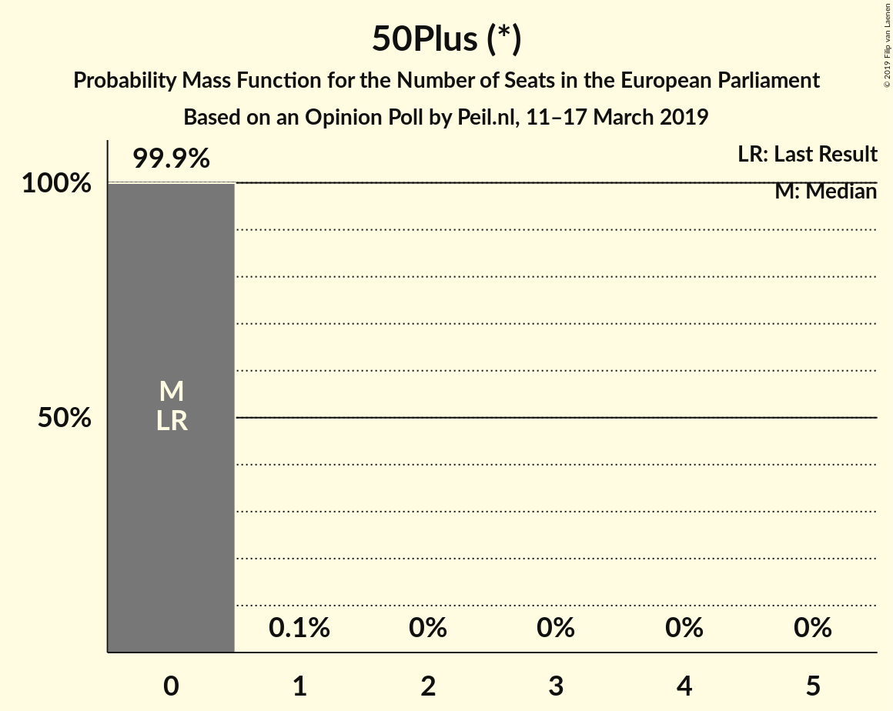

| Number of Seats | Probability | Accumulated | Special Marks |
|:---------------:|:-----------:|:-----------:|:-------------:|
| 0 | 49% | 100% | Last Result |
| 1 | 51% | 51% | Median |
| 2 | 0% | 0% |  |

### Staatkundig Gereformeerde Partij (ECR)

*For a full overview of the results for this party, see the [Staatkundig Gereformeerde Partij (ECR)](party-staatkundiggereformeerdepartijecr.html) page.*

| Number of Seats | Probability | Accumulated | Special Marks |
|:---------------:|:-----------:|:-----------:|:-------------:|
| 0 | 100% | 100% | Median |
| 1 | 0% | 0% | Last Result |

## Coalitions

### Confidence Intervals

| Coalition | Last Result | Median | Majority? | 80% Confidence Interval | 90% Confidence Interval | 95% Confidence Interval | 99% Confidence Interval |
|:---------:|:-----------:|:------:|:---------:|:-----------------------:|:-----------------------:|:-----------------------:|:-----------------------:|
| Volkspartij voor Vrijheid en Democratie (ALDE) – Democraten 66 (ALDE) | 7 | 7 | 0% | 7 | 7 | 7–8 | 6–8 |
| Forum voor Democratie (ECR) – ChristenUnie (ECR) – Staatkundig Gereformeerde Partij (ECR) | 2 | 5 | 0% | 5–6 | 5–6 | 5–6 | 5–6 |
| GroenLinks (Greens/EFA) | 2 | 4 | 0% | 3–4 | 3–4 | 3–4 | 3–4 |
| Socialistische Partij (GUE/NGL) – Partij voor de Dieren (GUE/NGL) | 3 | 4 | 0% | 3–4 | 3–4 | 3–4 | 3–4 |
| Partij voor de Vrijheid (ENF) | 4 | 3 | 0% | 3–4 | 3–4 | 3–4 | 3–4 |
| Partij van de Arbeid (S&D) | 3 | 2 | 0% | 2–3 | 2–3 | 2–3 | 2–3 |
| Christen-Democratisch Appèl (EPP) | 5 | 2 | 0% | 2 | 2 | 2 | 2 |

### Volkspartij voor Vrijheid en Democratie (ALDE) – Democraten 66 (ALDE)

| Number of Seats | Probability | Accumulated | Special Marks |
|:---------------:|:-----------:|:-----------:|:-------------:|
| 6 | 1.3% | 100% |  |
| 7 | 95% | 98.7% | Last Result, Median |
| 8 | 4% | 4% |  |
| 9 | 0% | 0% |  |

### Forum voor Democratie (ECR) – ChristenUnie (ECR) – Staatkundig Gereformeerde Partij (ECR)

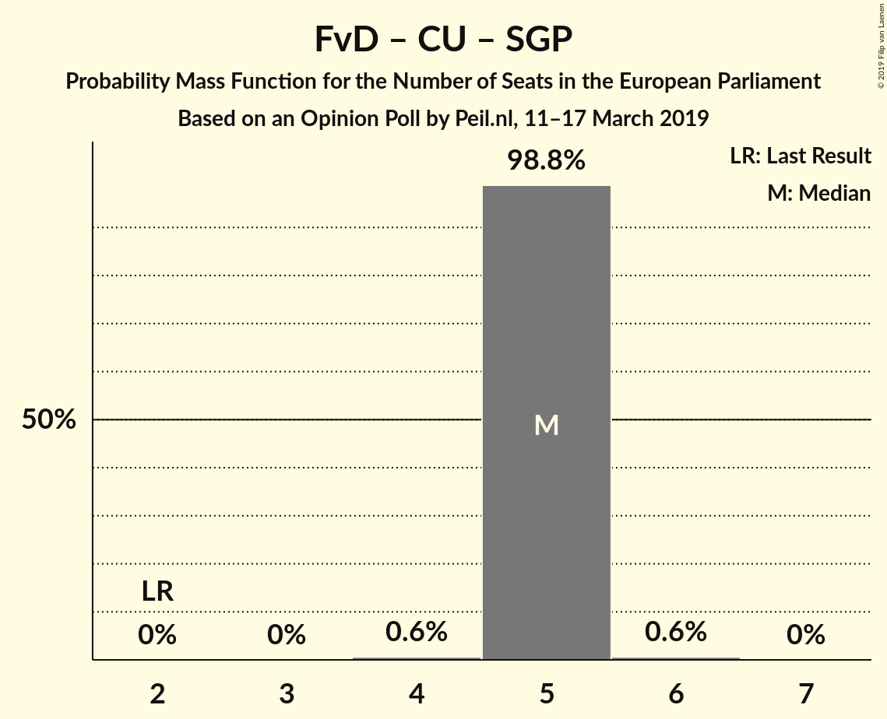

| Number of Seats | Probability | Accumulated | Special Marks |
|:---------------:|:-----------:|:-----------:|:-------------:|
| 2 | 0% | 100% | Last Result |
| 3 | 0% | 100% |  |
| 4 | 0% | 100% |  |
| 5 | 79% | 100% | Median |
| 6 | 21% | 21% |  |
| 7 | 0.1% | 0.1% |  |
| 8 | 0% | 0% |  |

### GroenLinks (Greens/EFA)

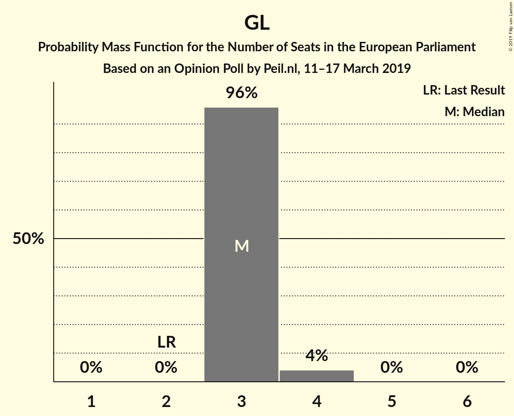

| Number of Seats | Probability | Accumulated | Special Marks |
|:---------------:|:-----------:|:-----------:|:-------------:|
| 2 | 0% | 100% | Last Result |
| 3 | 21% | 100% |  |
| 4 | 79% | 79% | Median |
| 5 | 0.1% | 0.1% |  |
| 6 | 0% | 0% |  |

### Socialistische Partij (GUE/NGL) – Partij voor de Dieren (GUE/NGL)

| Number of Seats | Probability | Accumulated | Special Marks |
|:---------------:|:-----------:|:-----------:|:-------------:|
| 3 | 34% | 100% | Last Result |
| 4 | 66% | 66% | Median |
| 5 | 0.4% | 0.4% |  |
| 6 | 0% | 0% |  |

### Partij voor de Vrijheid (ENF)

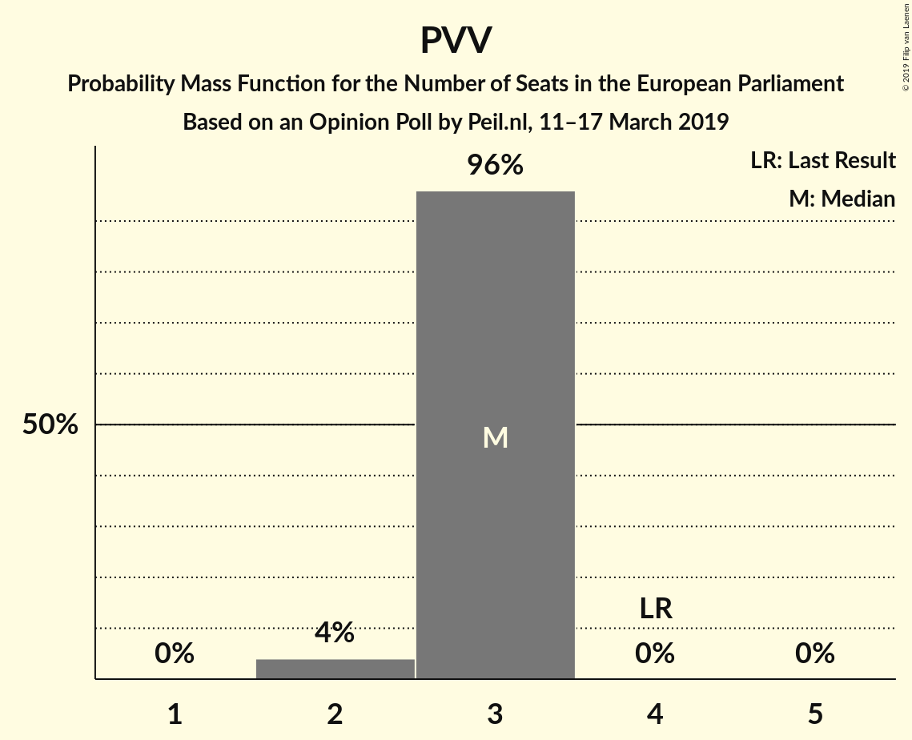

| Number of Seats | Probability | Accumulated | Special Marks |
|:---------------:|:-----------:|:-----------:|:-------------:|
| 3 | 63% | 100% | Median |
| 4 | 37% | 37% | Last Result |
| 5 | 0% | 0% |  |

### Partij van de Arbeid (S&D)

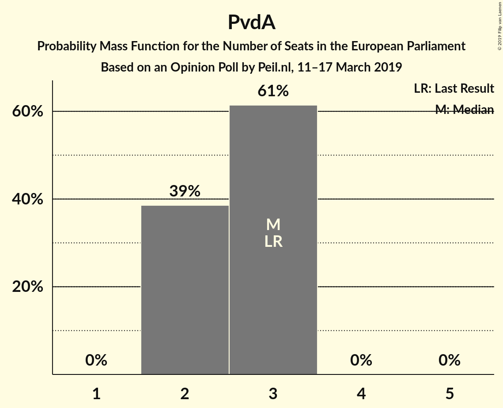

| Number of Seats | Probability | Accumulated | Special Marks |
|:---------------:|:-----------:|:-----------:|:-------------:|
| 2 | 60% | 100% | Median |
| 3 | 40% | 40% | Last Result |
| 4 | 0% | 0% |  |

### Christen-Democratisch Appèl (EPP)

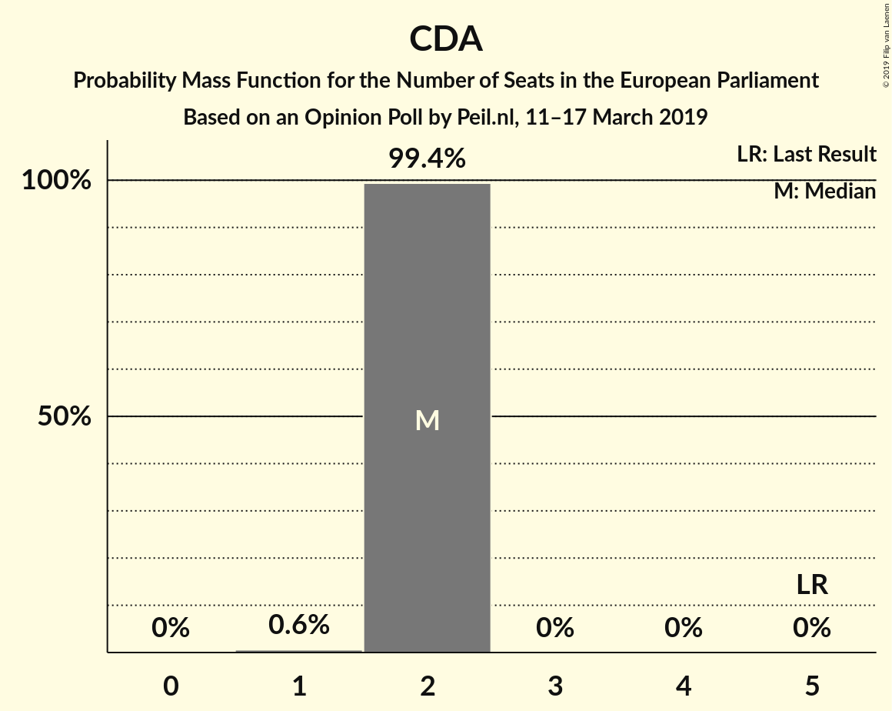

| Number of Seats | Probability | Accumulated | Special Marks |
|:---------------:|:-----------:|:-----------:|:-------------:|
| 1 | 0.1% | 100% |  |
| 2 | 99.8% | 99.9% | Median |
| 3 | 0.1% | 0.1% |  |
| 4 | 0% | 0% |  |
| 5 | 0% | 0% | Last Result |

## Technical Information

### Opinion Poll

+ **Polling firm:** Peil.nl
+ **Commissioner(s):** —
+ **Fieldwork period:** 11–17 March 2019

### Calculations

+ **Sample size:** 3000
+ **Simulations done:** 1,048,576
+ **Error estimate:** 2.06%

