# Opinion Poll by Ipsos for EenVandaag, 26–29 April 2019

<a href="#voting-intentions">Voting Intentions</a> | <a href="#seats">Seats</a> | <a href="#coalitions">Coalitions</a> | <a href="#technical-information">Technical Information</a>

## Voting Intentions

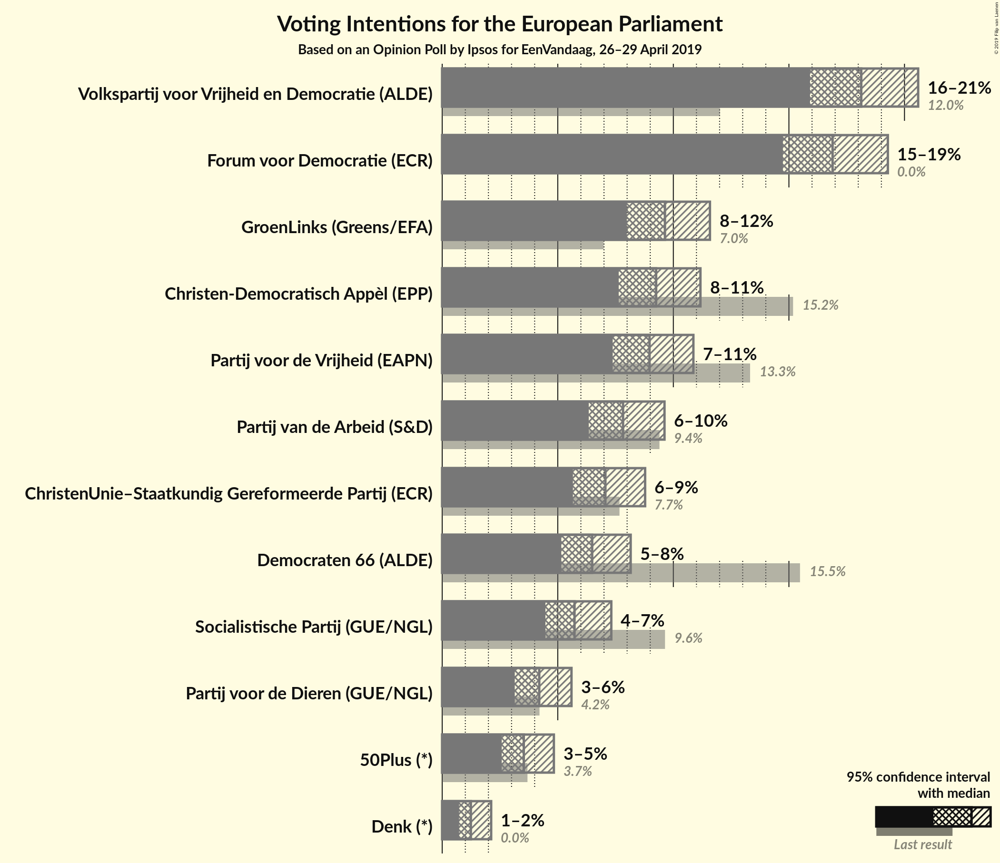

### Confidence Intervals

| Party | Last Result | Poll Result | 80% Confidence Interval | 90% Confidence Interval | 95% Confidence Interval | 99% Confidence Interval |
|:-----:|:-----------:|:-----------:|:-----------------------:|:-----------------------:|:-----------------------:|:-----------------------:|
| Volkspartij voor Vrijheid en Democratie (ALDE) | 12.0% | 18.1% | 16.7–19.7% |16.3–20.2% |15.9–20.6% |15.2–21.4% |
| Forum voor Democratie (ECR) | 0.0% | 16.9% | 15.5–18.5% |15.1–18.9% |14.7–19.3% |14.1–20.1% |
| GroenLinks (Greens/EFA) | 7.0% | 9.6% | 8.6–10.9% |8.2–11.3% |8.0–11.6% |7.5–12.2% |
| Christen-Democratisch Appèl (EPP) | 15.2% | 9.3% | 8.2–10.5% |7.9–10.9% |7.6–11.2% |7.2–11.8% |
| Partij voor de Vrijheid (EAPN) | 13.3% | 9.0% | 7.9–10.2% |7.6–10.5% |7.4–10.9% |6.9–11.5% |
| Partij van de Arbeid (S&D) | 9.4% | 7.8% | 6.8–9.0% |6.6–9.3% |6.3–9.6% |5.9–10.2% |
| ChristenUnie–Staatkundig Gereformeerde Partij (ECR) | 7.7% | 7.1% | 6.1–8.2% |5.9–8.5% |5.7–8.8% |5.2–9.3% |
| Democraten 66 (ALDE) | 15.5% | 6.5% | 5.6–7.6% |5.3–7.9% |5.2–8.2% |4.8–8.7% |
| Socialistische Partij (GUE/NGL) | 9.6% | 5.7% | 4.9–6.8% |4.7–7.1% |4.5–7.3% |4.1–7.8% |
| Partij voor de Dieren (GUE/NGL) | 4.2% | 4.2% | 3.5–5.1% |3.3–5.4% |3.1–5.6% |2.8–6.1% |
| 50Plus (*) | 3.7% | 3.5% | 2.9–4.4% |2.7–4.6% |2.6–4.8% |2.3–5.3% |
| Denk (*) | 0.0% | 1.2% | 0.9–1.8% |0.8–2.0% |0.7–2.1% |0.6–2.4% |

*Note:* The poll result column reflects the actual value used in the calculations. Published results may vary slightly, and in addition be rounded to fewer digits.

## Seats

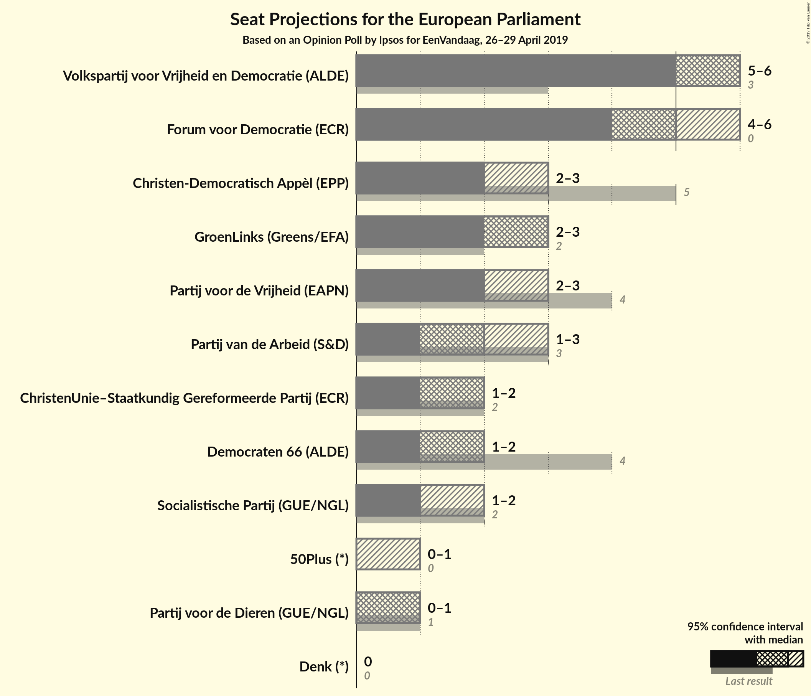

### Confidence Intervals

| Party | Last Result | Median | 80% Confidence Interval | 90% Confidence Interval | 95% Confidence Interval | 99% Confidence Interval |
|:-----:|:-----------:|:------:|:-----------------------:|:-----------------------:|:-----------------------:|:-----------------------:|
| <a href="#volkspartij-voor-vrijheid-en-democratie-(alde)">Volkspartij voor Vrijheid en Democratie (ALDE)</a> | 3 | 6 | 5–6 |5–6 |5–6 |5–6 |
| <a href="#forum-voor-democratie-(ecr)">Forum voor Democratie (ECR)</a> | 0 | 5 | 4–5 |4–5 |4–6 |4–6 |
| <a href="#groenlinks-(greens/efa)">GroenLinks (Greens/EFA)</a> | 2 | 3 | 2–3 |2–3 |2–3 |2–3 |
| <a href="#christen-democratisch-appèl-(epp)">Christen-Democratisch Appèl (EPP)</a> | 5 | 2 | 2–3 |2–3 |2–3 |2–3 |
| <a href="#partij-voor-de-vrijheid-(eapn)">Partij voor de Vrijheid (EAPN)</a> | 4 | 2 | 2–3 |2–3 |2–3 |2–3 |
| <a href="#partij-van-de-arbeid-(s&d)">Partij van de Arbeid (S&D)</a> | 3 | 2 | 2 |2 |1–3 |1–3 |
| <a href="#christenunie–staatkundig-gereformeerde-partij-(ecr)">ChristenUnie–Staatkundig Gereformeerde Partij (ECR)</a> | 2 | 2 | 1–2 |1–2 |1–2 |1–2 |
| <a href="#democraten-66-(alde)">Democraten 66 (ALDE)</a> | 4 | 2 | 1–2 |1–2 |1–2 |1–2 |
| <a href="#socialistische-partij-(gue/ngl)">Socialistische Partij (GUE/NGL)</a> | 2 | 1 | 1–2 |1–2 |1–2 |1–2 |
| <a href="#partij-voor-de-dieren-(gue/ngl)">Partij voor de Dieren (GUE/NGL)</a> | 1 | 1 | 0–1 |0–1 |0–1 |0–2 |
| <a href="#50plus-(*)">50Plus (*)</a> | 0 | 0 | 0–1 |0–1 |0–1 |0–1 |
| <a href="#denk-(*)">Denk (*)</a> | 0 | 0 | 0 |0 |0 |0 |

### Volkspartij voor Vrijheid en Democratie (ALDE)

*For a full overview of the results for this party, see the [Volkspartij voor Vrijheid en Democratie (ALDE)](party-volkspartijvoorvrijheidendemocratiealde.html) page.*

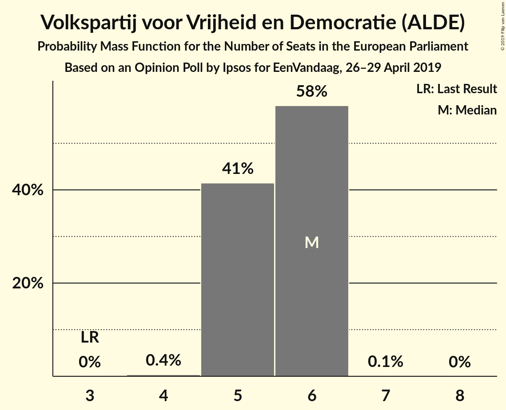

| Number of Seats | Probability | Accumulated | Special Marks |
|:---------------:|:-----------:|:-----------:|:-------------:|
| 3 | 0% | 100% | Last Result |
| 4 | 0.4% | 100% |  |
| 5 | 41% | 99.6% |  |
| 6 | 58% | 58% | Median |
| 7 | 0.1% | 0.1% |  |
| 8 | 0% | 0% |  |

### Forum voor Democratie (ECR)

*For a full overview of the results for this party, see the [Forum voor Democratie (ECR)](party-forumvoordemocratieecr.html) page.*

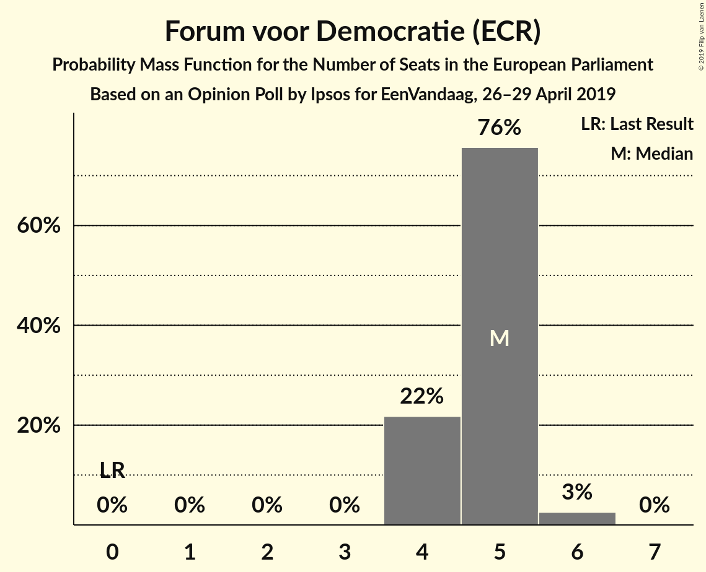

| Number of Seats | Probability | Accumulated | Special Marks |
|:---------------:|:-----------:|:-----------:|:-------------:|
| 0 | 0% | 100% | Last Result |
| 1 | 0% | 100% |  |
| 2 | 0% | 100% |  |
| 3 | 0% | 100% |  |
| 4 | 22% | 100% |  |
| 5 | 76% | 78% | Median |
| 6 | 3% | 3% |  |
| 7 | 0% | 0% |  |

### GroenLinks (Greens/EFA)

*For a full overview of the results for this party, see the [GroenLinks (Greens/EFA)](party-groenlinksgreensefa.html) page.*

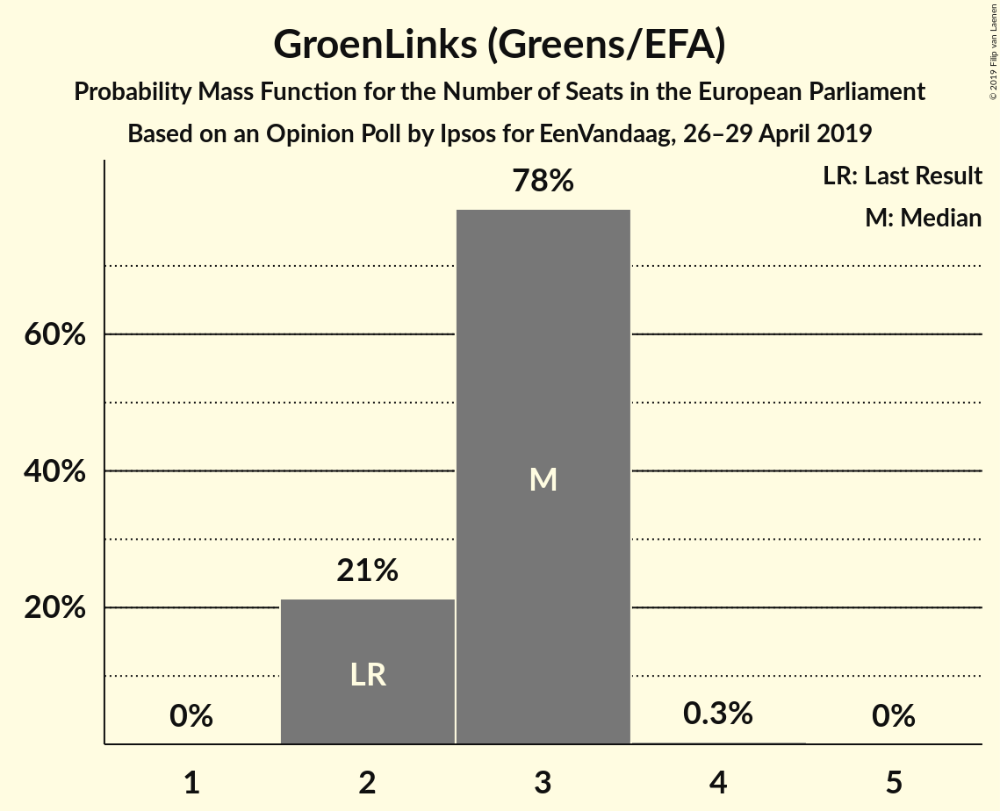

| Number of Seats | Probability | Accumulated | Special Marks |
|:---------------:|:-----------:|:-----------:|:-------------:|
| 2 | 21% | 100% | Last Result |
| 3 | 78% | 79% | Median |
| 4 | 0.3% | 0.3% |  |
| 5 | 0% | 0% |  |

### Christen-Democratisch Appèl (EPP)

*For a full overview of the results for this party, see the [Christen-Democratisch Appèl (EPP)](party-christen-democratischappèlepp.html) page.*

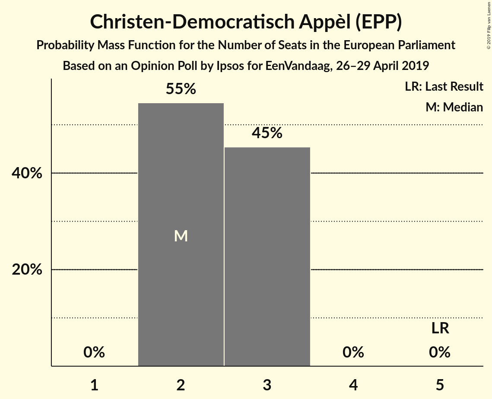

| Number of Seats | Probability | Accumulated | Special Marks |
|:---------------:|:-----------:|:-----------:|:-------------:|
| 2 | 55% | 100% | Median |
| 3 | 45% | 45% |  |
| 4 | 0% | 0% |  |
| 5 | 0% | 0% | Last Result |

### Partij voor de Vrijheid (EAPN)

*For a full overview of the results for this party, see the [Partij voor de Vrijheid (EAPN)](party-partijvoordevrijheideapn.html) page.*

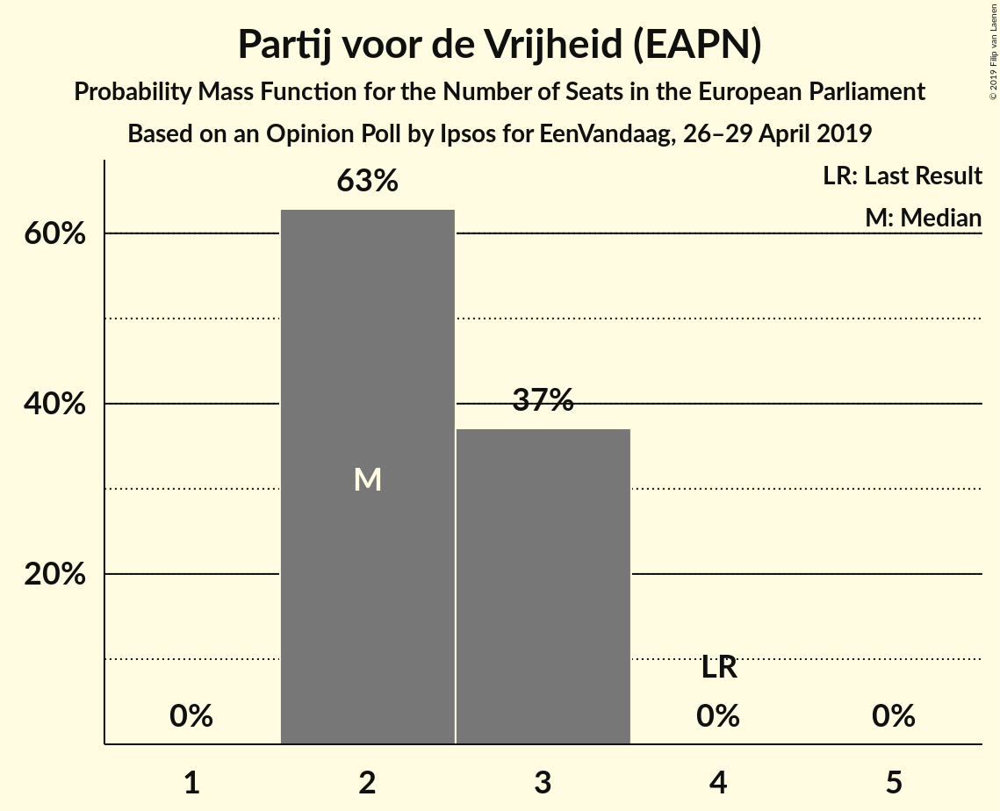

| Number of Seats | Probability | Accumulated | Special Marks |
|:---------------:|:-----------:|:-----------:|:-------------:|
| 2 | 63% | 100% | Median |
| 3 | 37% | 37% |  |
| 4 | 0% | 0% | Last Result |

### Partij van de Arbeid (S&D)

*For a full overview of the results for this party, see the [Partij van de Arbeid (S&D)](party-partijvandearbeidsd.html) page.*

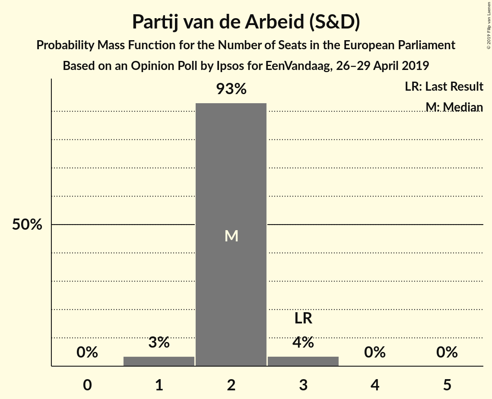

| Number of Seats | Probability | Accumulated | Special Marks |
|:---------------:|:-----------:|:-----------:|:-------------:|
| 1 | 3% | 100% |  |
| 2 | 93% | 97% | Median |
| 3 | 4% | 4% | Last Result |
| 4 | 0% | 0% |  |

### ChristenUnie–Staatkundig Gereformeerde Partij (ECR)

*For a full overview of the results for this party, see the [ChristenUnie–Staatkundig Gereformeerde Partij (ECR)](party-christenunie–staatkundiggereformeerdepartijecr.html) page.*

| Number of Seats | Probability | Accumulated | Special Marks |
|:---------------:|:-----------:|:-----------:|:-------------:|
| 1 | 10% | 100% |  |
| 2 | 89% | 90% | Last Result, Median |
| 3 | 0.4% | 0.4% |  |
| 4 | 0% | 0% |  |

### Democraten 66 (ALDE)

*For a full overview of the results for this party, see the [Democraten 66 (ALDE)](party-democraten66alde.html) page.*

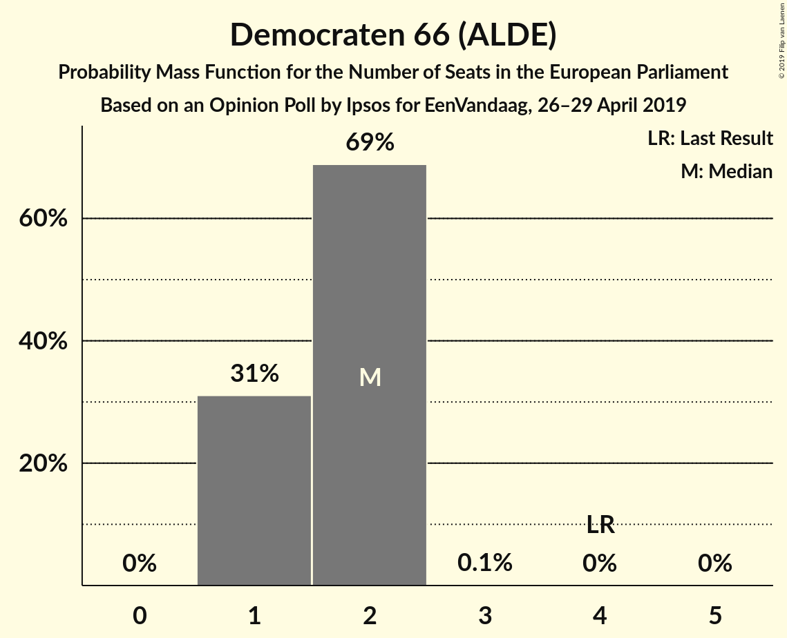

| Number of Seats | Probability | Accumulated | Special Marks |
|:---------------:|:-----------:|:-----------:|:-------------:|
| 1 | 31% | 100% |  |
| 2 | 69% | 69% | Median |
| 3 | 0.1% | 0.1% |  |
| 4 | 0% | 0% | Last Result |

### Socialistische Partij (GUE/NGL)

*For a full overview of the results for this party, see the [Socialistische Partij (GUE/NGL)](party-socialistischepartijguengl.html) page.*

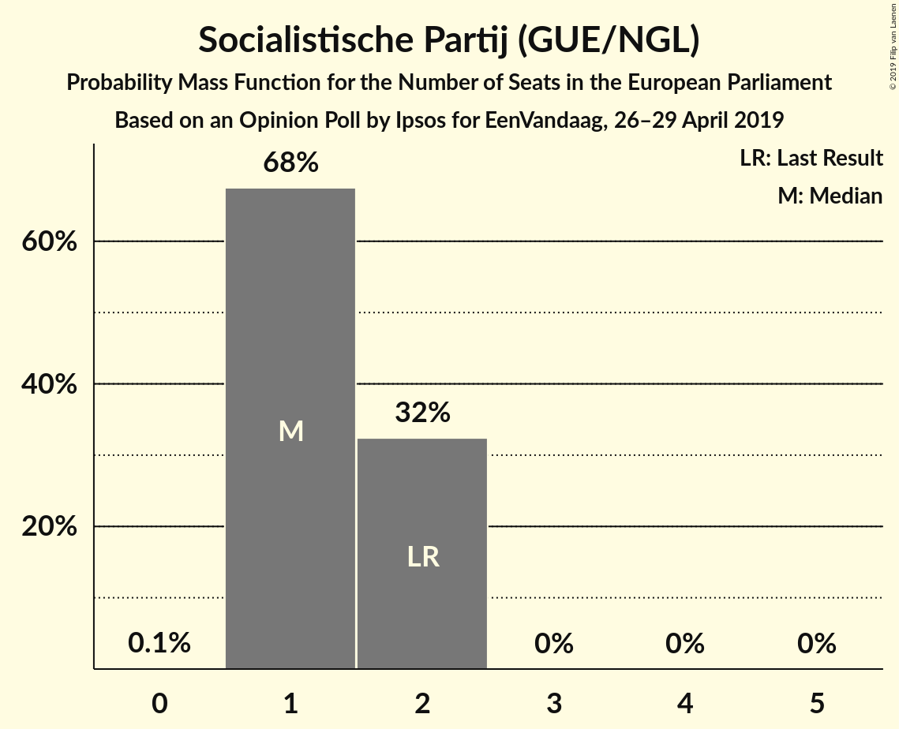

| Number of Seats | Probability | Accumulated | Special Marks |
|:---------------:|:-----------:|:-----------:|:-------------:|
| 0 | 0.1% | 100% |  |
| 1 | 68% | 99.9% | Median |
| 2 | 32% | 32% | Last Result |
| 3 | 0% | 0% |  |

### Partij voor de Dieren (GUE/NGL)

*For a full overview of the results for this party, see the [Partij voor de Dieren (GUE/NGL)](party-partijvoordedierenguengl.html) page.*

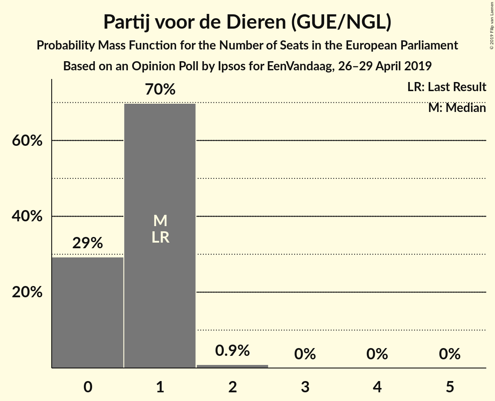

| Number of Seats | Probability | Accumulated | Special Marks |
|:---------------:|:-----------:|:-----------:|:-------------:|
| 0 | 29% | 100% |  |
| 1 | 70% | 71% | Last Result, Median |
| 2 | 0.9% | 0.9% |  |
| 3 | 0% | 0% |  |

### 50Plus (*)

*For a full overview of the results for this party, see the [50Plus (*)](party-50plus.html) page.*

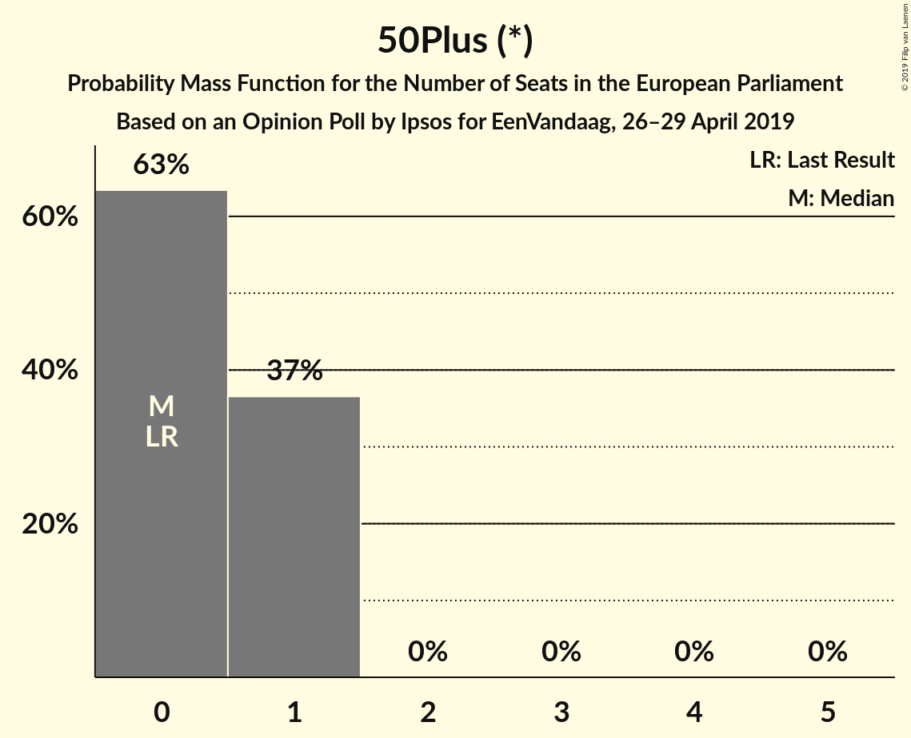

| Number of Seats | Probability | Accumulated | Special Marks |
|:---------------:|:-----------:|:-----------:|:-------------:|
| 0 | 63% | 100% | Last Result, Median |
| 1 | 37% | 37% |  |
| 2 | 0% | 0% |  |

### Denk (*)

*For a full overview of the results for this party, see the [Denk (*)](party-denk.html) page.*

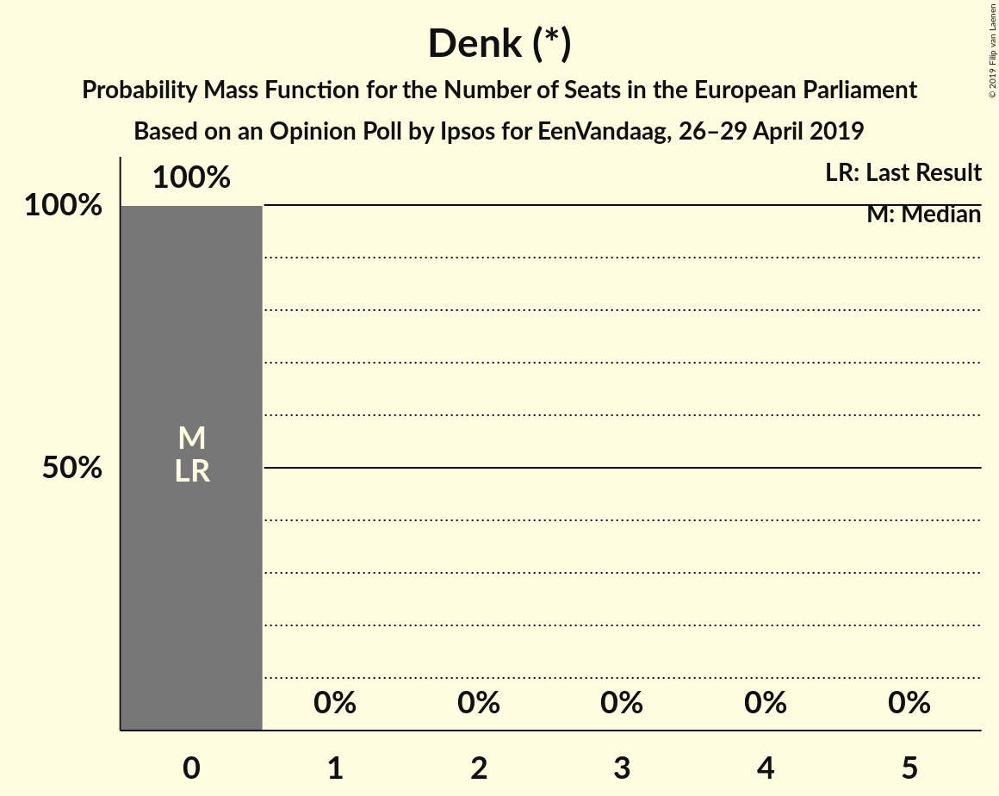

| Number of Seats | Probability | Accumulated | Special Marks |
|:---------------:|:-----------:|:-----------:|:-------------:|
| 0 | 100% | 100% | Last Result, Median |

## Coalitions

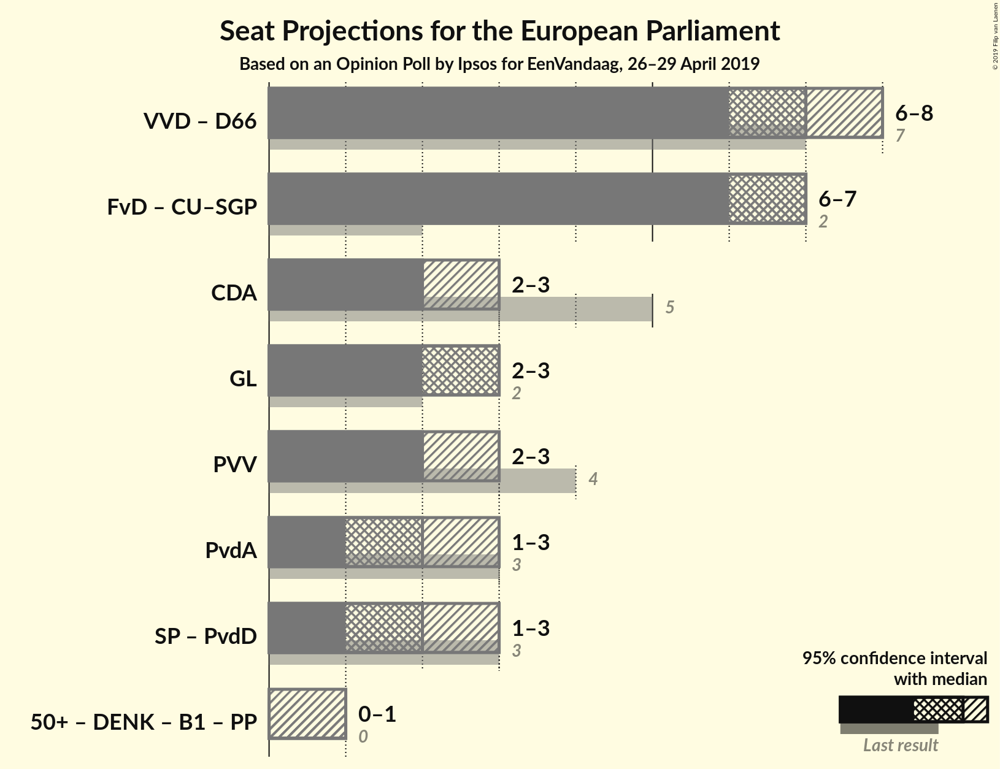

### Confidence Intervals

| Coalition | Last Result | Median | Majority? | 80% Confidence Interval | 90% Confidence Interval | 95% Confidence Interval | 99% Confidence Interval |
|:---------:|:-----------:|:------:|:---------:|:-----------------------:|:-----------------------:|:-----------------------:|:-----------------------:|
| Volkspartij voor Vrijheid en Democratie (ALDE) – Democraten 66 (ALDE) | 7 | 7 | 0% | 7–8 | 7–8 | 6–8 | 6–8 |
| Forum voor Democratie (ECR) – ChristenUnie–Staatkundig Gereformeerde Partij (ECR) | 2 | 7 | 0% | 6–7 | 6–7 | 6–7 | 6–8 |
| Christen-Democratisch Appèl (EPP) | 5 | 2 | 0% | 2–3 | 2–3 | 2–3 | 2–3 |
| GroenLinks (Greens/EFA) | 2 | 3 | 0% | 2–3 | 2–3 | 2–3 | 2–3 |
| Partij voor de Vrijheid (EAPN) | 4 | 2 | 0% | 2–3 | 2–3 | 2–3 | 2–3 |
| Partij van de Arbeid (S&D) | 3 | 2 | 0% | 2 | 2 | 1–3 | 1–3 |
| Socialistische Partij (GUE/NGL) – Partij voor de Dieren (GUE/NGL) | 3 | 2 | 0% | 1–3 | 1–3 | 1–3 | 1–3 |

### Volkspartij voor Vrijheid en Democratie (ALDE) – Democraten 66 (ALDE)

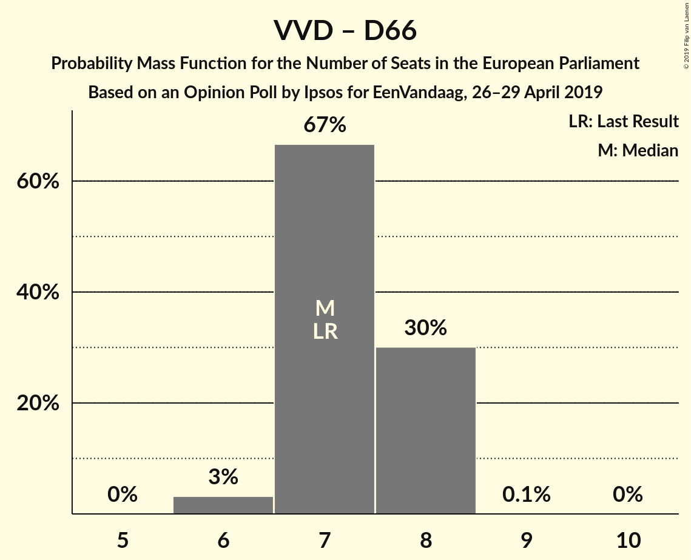

| Number of Seats | Probability | Accumulated | Special Marks |
|:---------------:|:-----------:|:-----------:|:-------------:|
| 6 | 3% | 100% |  |
| 7 | 67% | 97% | Last Result |
| 8 | 30% | 30% | Median |
| 9 | 0.1% | 0.1% |  |
| 10 | 0% | 0% |  |

### Forum voor Democratie (ECR) – ChristenUnie–Staatkundig Gereformeerde Partij (ECR)

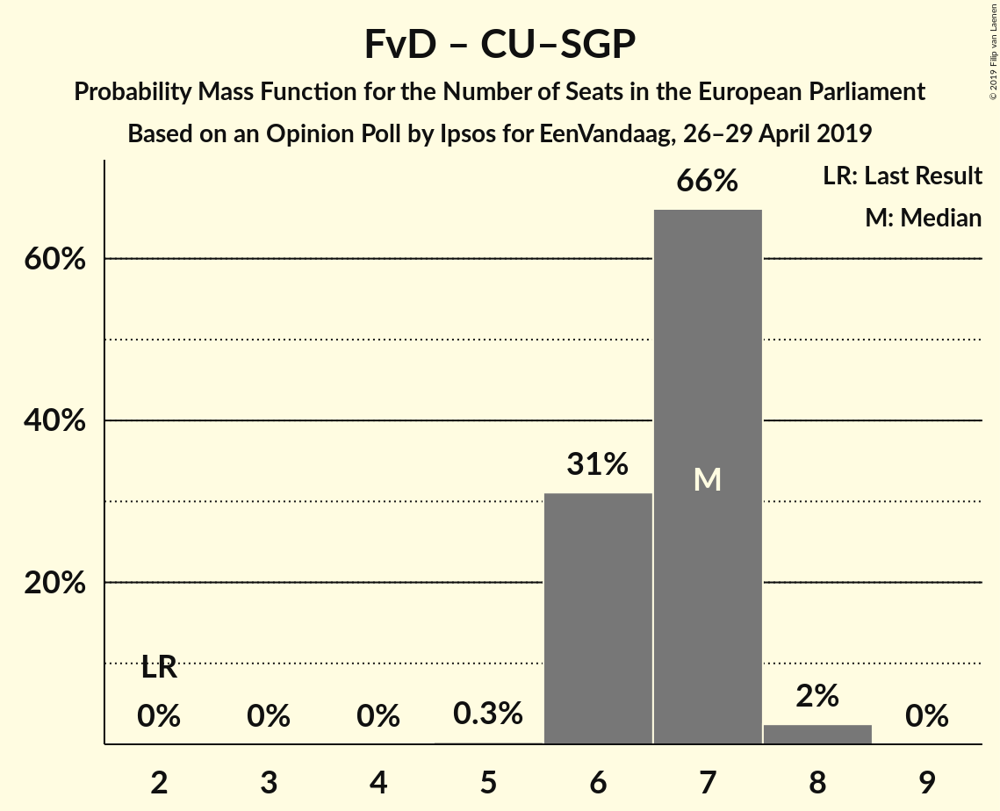

| Number of Seats | Probability | Accumulated | Special Marks |
|:---------------:|:-----------:|:-----------:|:-------------:|
| 2 | 0% | 100% | Last Result |
| 3 | 0% | 100% |  |
| 4 | 0% | 100% |  |
| 5 | 0.3% | 100% |  |
| 6 | 31% | 99.7% |  |
| 7 | 66% | 69% | Median |
| 8 | 2% | 2% |  |
| 9 | 0% | 0% |  |

### Christen-Democratisch Appèl (EPP)

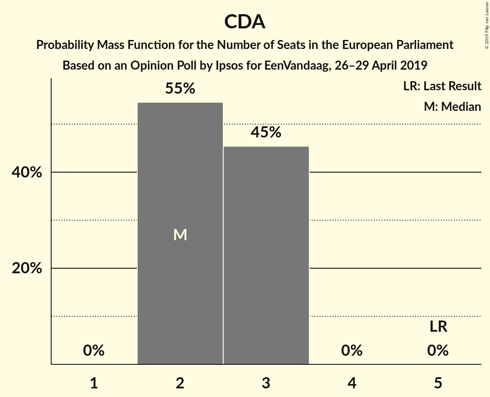

| Number of Seats | Probability | Accumulated | Special Marks |
|:---------------:|:-----------:|:-----------:|:-------------:|
| 2 | 55% | 100% | Median |
| 3 | 45% | 45% |  |
| 4 | 0% | 0% |  |
| 5 | 0% | 0% | Last Result |

### GroenLinks (Greens/EFA)

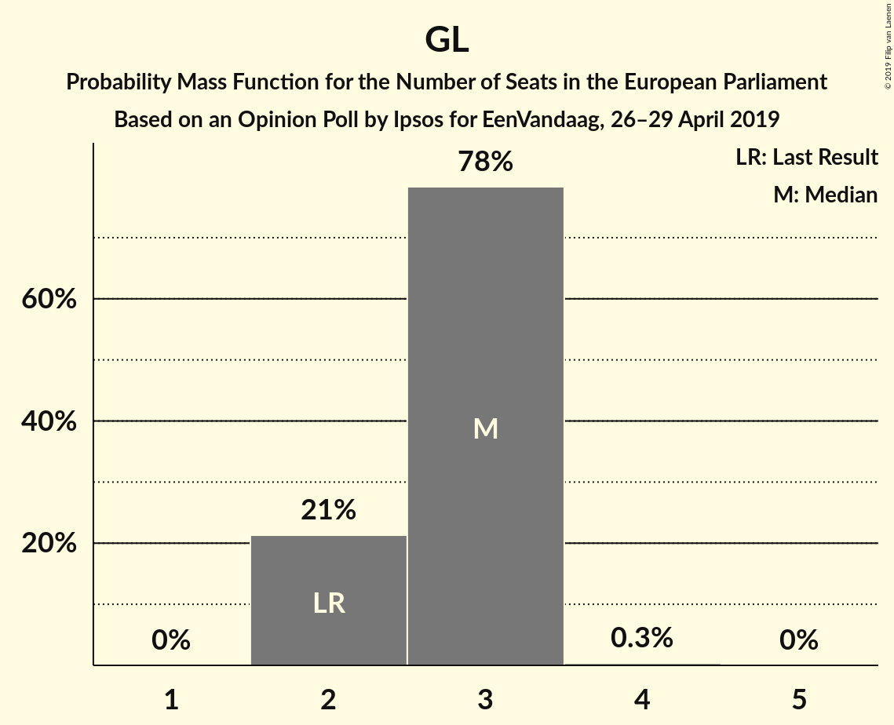

| Number of Seats | Probability | Accumulated | Special Marks |
|:---------------:|:-----------:|:-----------:|:-------------:|
| 2 | 21% | 100% | Last Result |
| 3 | 78% | 79% | Median |
| 4 | 0.3% | 0.3% |  |
| 5 | 0% | 0% |  |

### Partij voor de Vrijheid (EAPN)

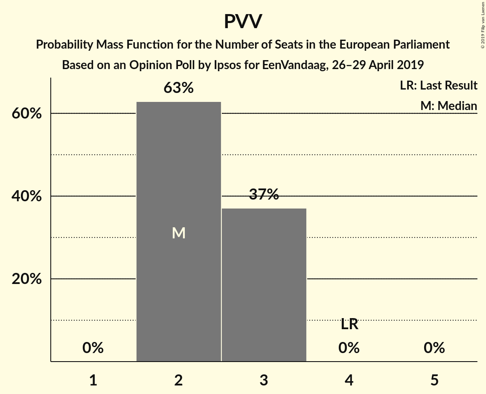

| Number of Seats | Probability | Accumulated | Special Marks |
|:---------------:|:-----------:|:-----------:|:-------------:|
| 2 | 63% | 100% | Median |
| 3 | 37% | 37% |  |
| 4 | 0% | 0% | Last Result |

### Partij van de Arbeid (S&D)

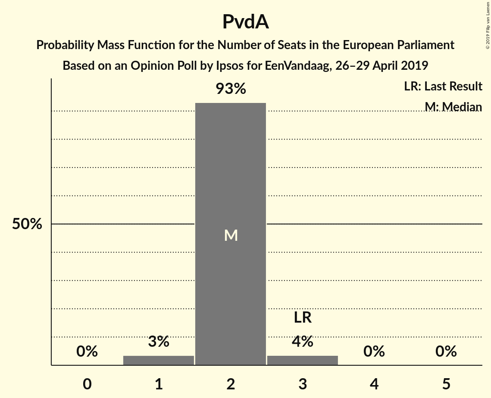

| Number of Seats | Probability | Accumulated | Special Marks |
|:---------------:|:-----------:|:-----------:|:-------------:|
| 1 | 3% | 100% |  |
| 2 | 93% | 97% | Median |
| 3 | 4% | 4% | Last Result |
| 4 | 0% | 0% |  |

### Socialistische Partij (GUE/NGL) – Partij voor de Dieren (GUE/NGL)

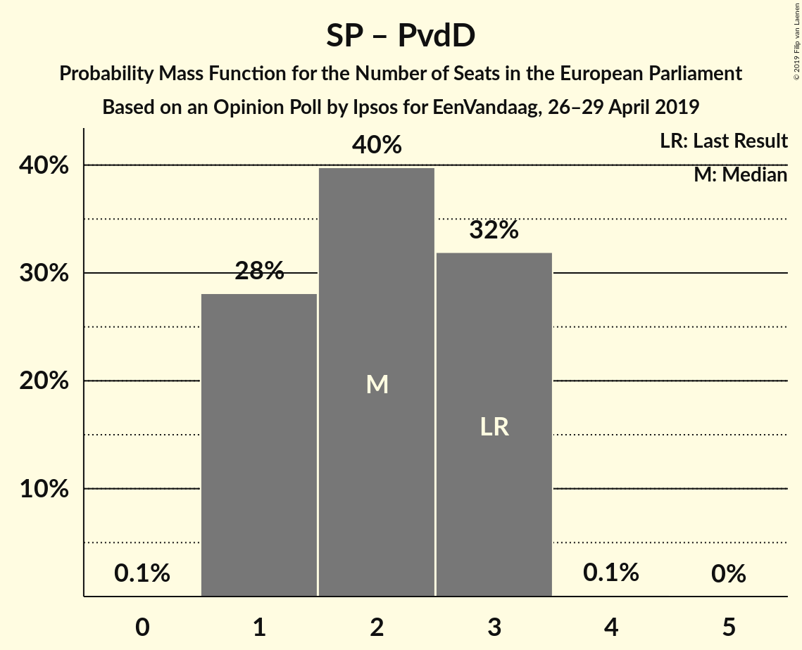

| Number of Seats | Probability | Accumulated | Special Marks |
|:---------------:|:-----------:|:-----------:|:-------------:|
| 0 | 0.1% | 100% |  |
| 1 | 28% | 99.9% |  |
| 2 | 40% | 72% | Median |
| 3 | 32% | 32% | Last Result |
| 4 | 0.1% | 0.1% |  |
| 5 | 0% | 0% |  |

## Technical Information

### Opinion Poll

+ **Polling firm:** Ipsos
+ **Commissioner(s):** EenVandaag
+ **Fieldwork period:** 26–29 April 2019

### Calculations

+ **Sample size:** 1048
+ **Simulations done:** 1,048,576
+ **Error estimate:** 1.86%

