# Opinion Poll by Peil.nl, 29 April–5 May 2019

<a href="#voting-intentions">Voting Intentions</a> | <a href="#seats">Seats</a> | <a href="#coalitions">Coalitions</a> | <a href="#technical-information">Technical Information</a>

## Voting Intentions

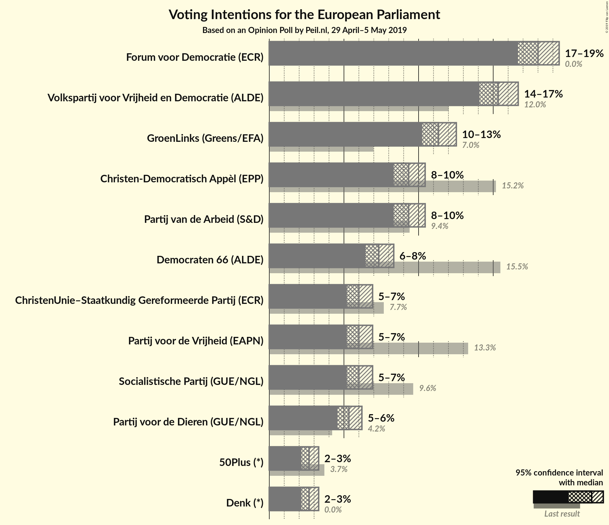

### Confidence Intervals

| Party | Last Result | Poll Result | 80% Confidence Interval | 90% Confidence Interval | 95% Confidence Interval | 99% Confidence Interval |
|:-----:|:-----------:|:-----------:|:-----------------------:|:-----------------------:|:-----------------------:|:-----------------------:|
| Forum voor Democratie (ECR) | 0.0% | 18.0% | 17.1–18.9% |16.9–19.2% |16.7–19.4% |16.2–19.9% |
| Volkspartij voor Vrijheid en Democratie (ALDE) | 12.0% | 15.3% | 14.5–16.2% |14.3–16.5% |14.1–16.7% |13.7–17.1% |
| GroenLinks (Greens/EFA) | 7.0% | 11.3% | 10.6–12.1% |10.4–12.3% |10.2–12.5% |9.9–12.9% |
| Christen-Democratisch Appèl (EPP) | 15.2% | 9.3% | 8.7–10.1% |8.5–10.3% |8.3–10.4% |8.0–10.8% |
| Partij van de Arbeid (S&D) | 9.4% | 9.3% | 8.7–10.1% |8.5–10.3% |8.3–10.4% |8.0–10.8% |
| Democraten 66 (ALDE) | 15.5% | 7.3% | 6.8–8.0% |6.6–8.2% |6.4–8.3% |6.2–8.6% |
| Partij voor de Vrijheid (EAPN) | 13.3% | 6.0% | 5.5–6.6% |5.3–6.8% |5.2–6.9% |5.0–7.2% |
| Socialistische Partij (GUE/NGL) | 9.6% | 6.0% | 5.5–6.6% |5.3–6.8% |5.2–6.9% |5.0–7.2% |
| ChristenUnie–Staatkundig Gereformeerde Partij (ECR) | 7.7% | 6.0% | 5.5–6.6% |5.3–6.8% |5.2–6.9% |5.0–7.2% |
| Partij voor de Dieren (GUE/NGL) | 4.2% | 5.3% | 4.8–5.9% |4.7–6.1% |4.6–6.2% |4.4–6.5% |
| 50Plus (*) | 3.7% | 2.7% | 2.3–3.1% |2.2–3.2% |2.1–3.3% |2.0–3.5% |
| Denk (*) | 0.0% | 2.7% | 2.3–3.1% |2.2–3.2% |2.1–3.3% |2.0–3.5% |

*Note:* The poll result column reflects the actual value used in the calculations. Published results may vary slightly, and in addition be rounded to fewer digits.

## Seats

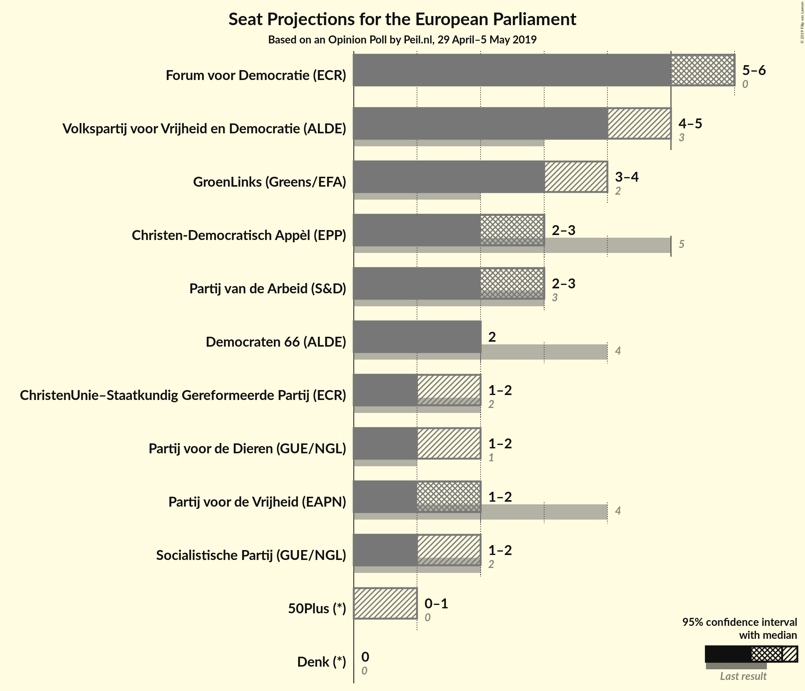

### Confidence Intervals

| Party | Last Result | Median | 80% Confidence Interval | 90% Confidence Interval | 95% Confidence Interval | 99% Confidence Interval |
|:-----:|:-----------:|:------:|:-----------------------:|:-----------------------:|:-----------------------:|:-----------------------:|
| <a href="#forum-voor-democratie-(ecr)">Forum voor Democratie (ECR)</a> | 0 | 6 | 5–6 |5–6 |5–6 |5–6 |
| <a href="#volkspartij-voor-vrijheid-en-democratie-(alde)">Volkspartij voor Vrijheid en Democratie (ALDE)</a> | 3 | 4 | 4–5 |4–5 |4–5 |4–5 |
| <a href="#groenlinks-(greens/efa)">GroenLinks (Greens/EFA)</a> | 2 | 3 | 3–4 |3–4 |3–4 |3–4 |
| <a href="#christen-democratisch-appèl-(epp)">Christen-Democratisch Appèl (EPP)</a> | 5 | 3 | 2–3 |2–3 |2–3 |2–3 |
| <a href="#partij-van-de-arbeid-(s&d)">Partij van de Arbeid (S&D)</a> | 3 | 3 | 2–3 |2–3 |2–3 |2–3 |
| <a href="#democraten-66-(alde)">Democraten 66 (ALDE)</a> | 4 | 2 | 2 |2 |2 |1–2 |
| <a href="#partij-voor-de-vrijheid-(eapn)">Partij voor de Vrijheid (EAPN)</a> | 4 | 2 | 1–2 |1–2 |1–2 |1–2 |
| <a href="#socialistische-partij-(gue/ngl)">Socialistische Partij (GUE/NGL)</a> | 2 | 1 | 1–2 |1–2 |1–2 |1–2 |
| <a href="#christenunie–staatkundig-gereformeerde-partij-(ecr)">ChristenUnie–Staatkundig Gereformeerde Partij (ECR)</a> | 2 | 1 | 1–2 |1–2 |1–2 |1–2 |
| <a href="#partij-voor-de-dieren-(gue/ngl)">Partij voor de Dieren (GUE/NGL)</a> | 1 | 1 | 1 |1–2 |1–2 |1–2 |
| <a href="#50plus-(*)">50Plus (*)</a> | 0 | 0 | 0 |0–1 |0–1 |0–1 |
| <a href="#denk-(*)">Denk (*)</a> | 0 | 0 | 0 |0 |0 |0 |

### Forum voor Democratie (ECR)

*For a full overview of the results for this party, see the [Forum voor Democratie (ECR)](party-forumvoordemocratieecr.html) page.*

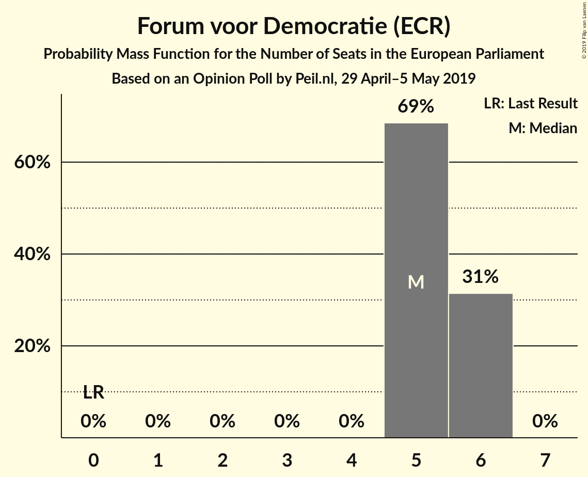

| Number of Seats | Probability | Accumulated | Special Marks |
|:---------------:|:-----------:|:-----------:|:-------------:|
| 0 | 0% | 100% | Last Result |
| 1 | 0% | 100% |  |
| 2 | 0% | 100% |  |
| 3 | 0% | 100% |  |
| 4 | 0% | 100% |  |
| 5 | 31% | 100% |  |
| 6 | 69% | 69% | Median |
| 7 | 0% | 0% |  |

### Volkspartij voor Vrijheid en Democratie (ALDE)

*For a full overview of the results for this party, see the [Volkspartij voor Vrijheid en Democratie (ALDE)](party-volkspartijvoorvrijheidendemocratiealde.html) page.*

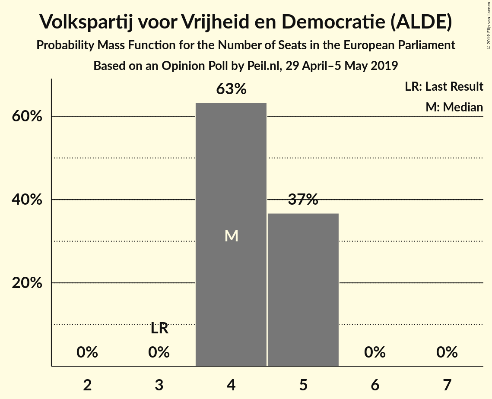

| Number of Seats | Probability | Accumulated | Special Marks |
|:---------------:|:-----------:|:-----------:|:-------------:|
| 3 | 0% | 100% | Last Result |
| 4 | 62% | 100% | Median |
| 5 | 38% | 38% |  |
| 6 | 0% | 0% |  |

### GroenLinks (Greens/EFA)

*For a full overview of the results for this party, see the [GroenLinks (Greens/EFA)](party-groenlinksgreensefa.html) page.*

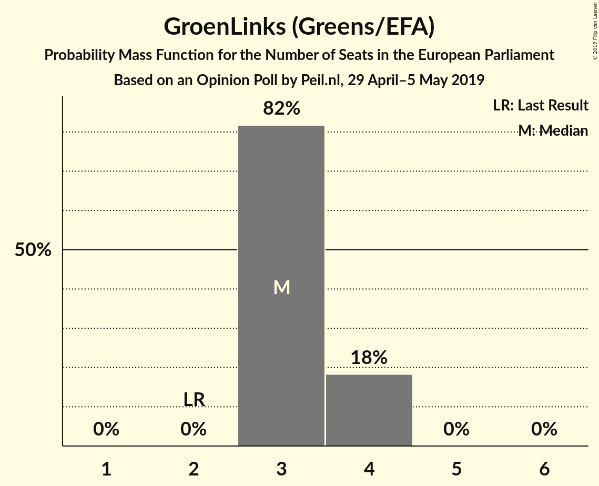

| Number of Seats | Probability | Accumulated | Special Marks |
|:---------------:|:-----------:|:-----------:|:-------------:|
| 2 | 0% | 100% | Last Result |
| 3 | 82% | 100% | Median |
| 4 | 18% | 18% |  |
| 5 | 0% | 0% |  |

### Christen-Democratisch Appèl (EPP)

*For a full overview of the results for this party, see the [Christen-Democratisch Appèl (EPP)](party-christen-democratischappèlepp.html) page.*

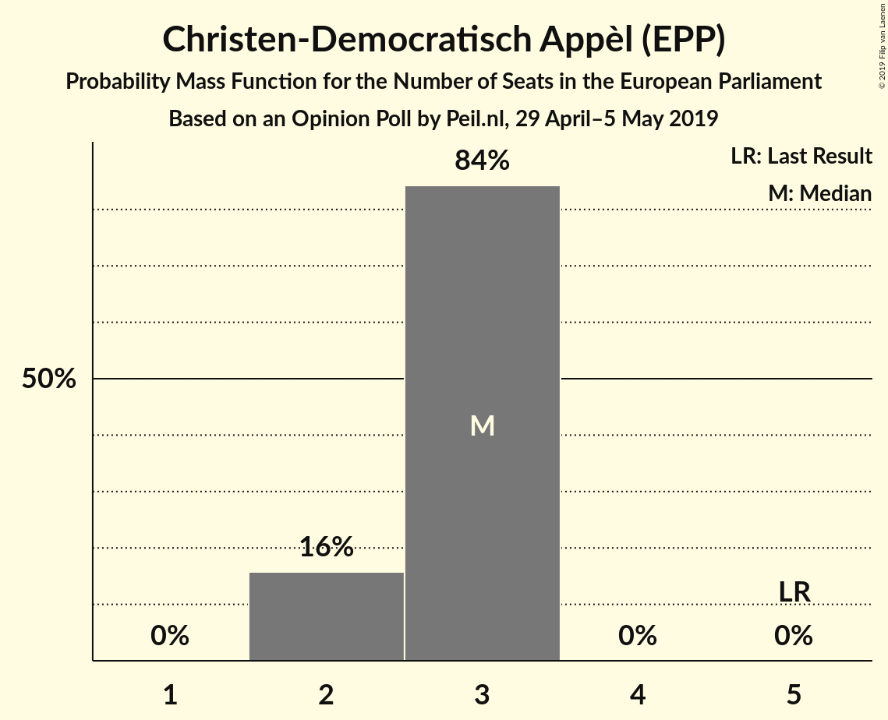

| Number of Seats | Probability | Accumulated | Special Marks |
|:---------------:|:-----------:|:-----------:|:-------------:|
| 2 | 27% | 100% |  |
| 3 | 73% | 73% | Median |
| 4 | 0% | 0% |  |
| 5 | 0% | 0% | Last Result |

### Partij van de Arbeid (S&D)

*For a full overview of the results for this party, see the [Partij van de Arbeid (S&D)](party-partijvandearbeidsd.html) page.*

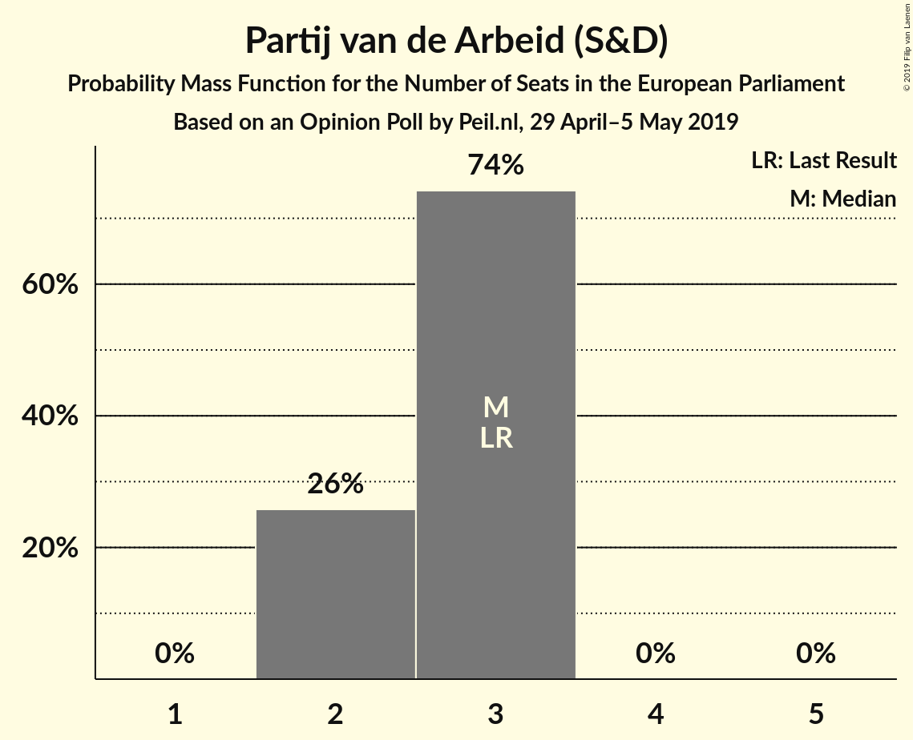

| Number of Seats | Probability | Accumulated | Special Marks |
|:---------------:|:-----------:|:-----------:|:-------------:|
| 2 | 28% | 100% |  |
| 3 | 72% | 72% | Last Result, Median |
| 4 | 0% | 0% |  |

### Democraten 66 (ALDE)

*For a full overview of the results for this party, see the [Democraten 66 (ALDE)](party-democraten66alde.html) page.*

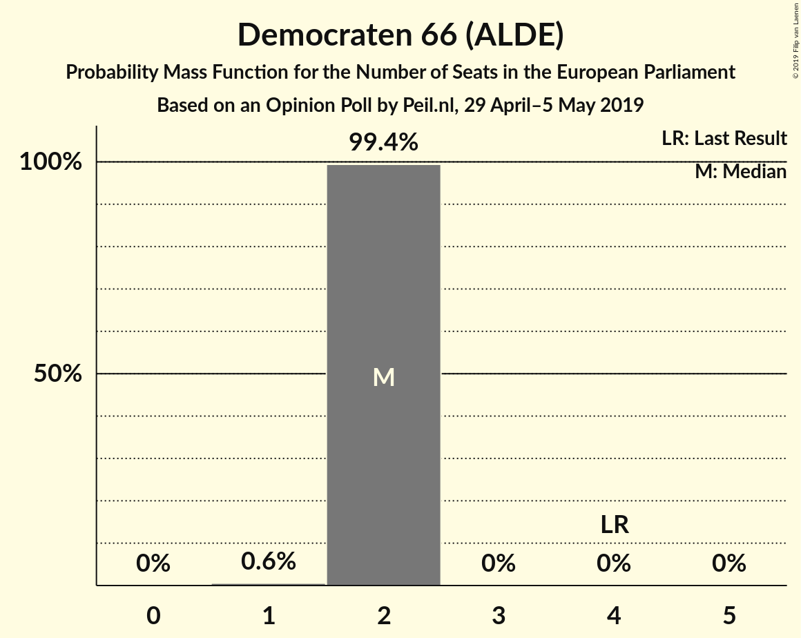

| Number of Seats | Probability | Accumulated | Special Marks |
|:---------------:|:-----------:|:-----------:|:-------------:|
| 1 | 0.6% | 100% |  |
| 2 | 99.4% | 99.4% | Median |
| 3 | 0% | 0% |  |
| 4 | 0% | 0% | Last Result |

### Partij voor de Vrijheid (EAPN)

*For a full overview of the results for this party, see the [Partij voor de Vrijheid (EAPN)](party-partijvoordevrijheideapn.html) page.*

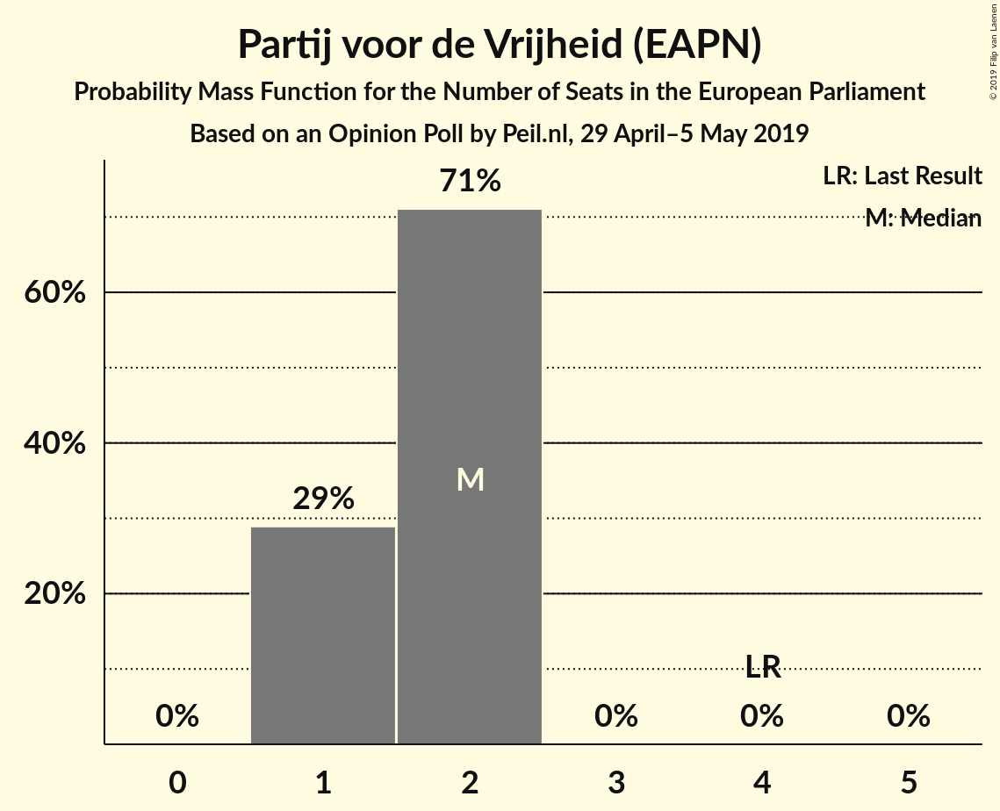

| Number of Seats | Probability | Accumulated | Special Marks |
|:---------------:|:-----------:|:-----------:|:-------------:|
| 1 | 25% | 100% |  |
| 2 | 75% | 75% | Median |
| 3 | 0% | 0% |  |
| 4 | 0% | 0% | Last Result |

### Socialistische Partij (GUE/NGL)

*For a full overview of the results for this party, see the [Socialistische Partij (GUE/NGL)](party-socialistischepartijguengl.html) page.*

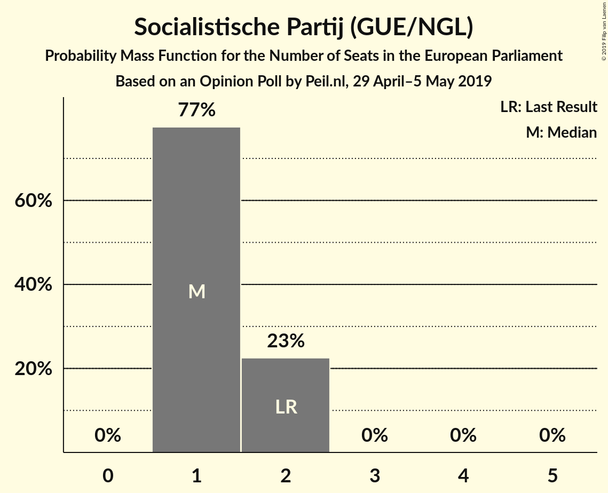

| Number of Seats | Probability | Accumulated | Special Marks |
|:---------------:|:-----------:|:-----------:|:-------------:|
| 1 | 77% | 100% | Median |
| 2 | 23% | 23% | Last Result |
| 3 | 0% | 0% |  |

### ChristenUnie–Staatkundig Gereformeerde Partij (ECR)

*For a full overview of the results for this party, see the [ChristenUnie–Staatkundig Gereformeerde Partij (ECR)](party-christenunie–staatkundiggereformeerdepartijecr.html) page.*

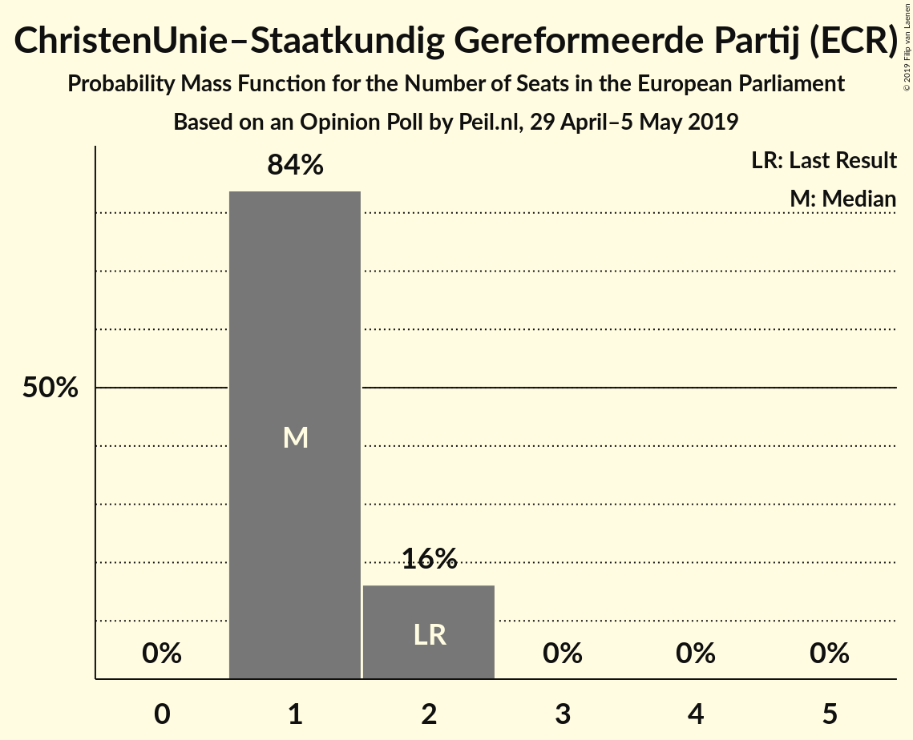

| Number of Seats | Probability | Accumulated | Special Marks |
|:---------------:|:-----------:|:-----------:|:-------------:|
| 1 | 84% | 100% | Median |
| 2 | 16% | 16% | Last Result |
| 3 | 0% | 0% |  |

### Partij voor de Dieren (GUE/NGL)

*For a full overview of the results for this party, see the [Partij voor de Dieren (GUE/NGL)](party-partijvoordedierenguengl.html) page.*

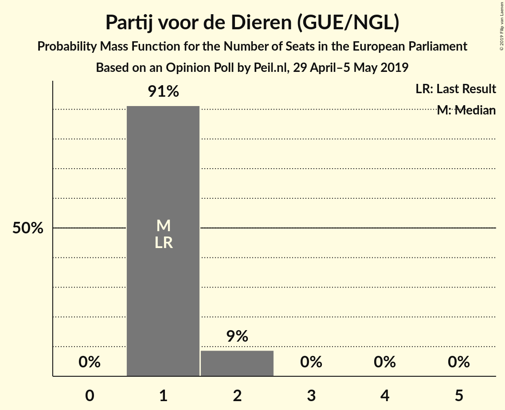

| Number of Seats | Probability | Accumulated | Special Marks |
|:---------------:|:-----------:|:-----------:|:-------------:|
| 1 | 91% | 100% | Last Result, Median |
| 2 | 9% | 9% |  |
| 3 | 0% | 0% |  |

### 50Plus (*)

*For a full overview of the results for this party, see the [50Plus (*)](party-50plus.html) page.*

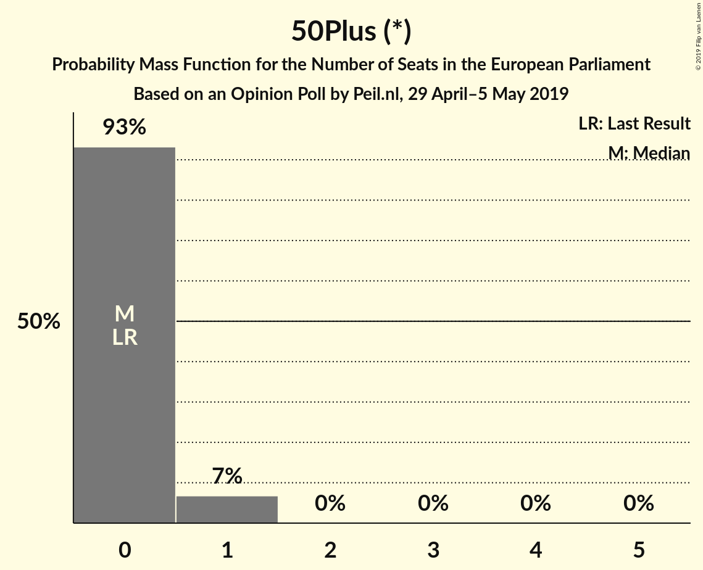

| Number of Seats | Probability | Accumulated | Special Marks |
|:---------------:|:-----------:|:-----------:|:-------------:|
| 0 | 93% | 100% | Last Result, Median |
| 1 | 7% | 7% |  |
| 2 | 0% | 0% |  |

### Denk (*)

*For a full overview of the results for this party, see the [Denk (*)](party-denk.html) page.*

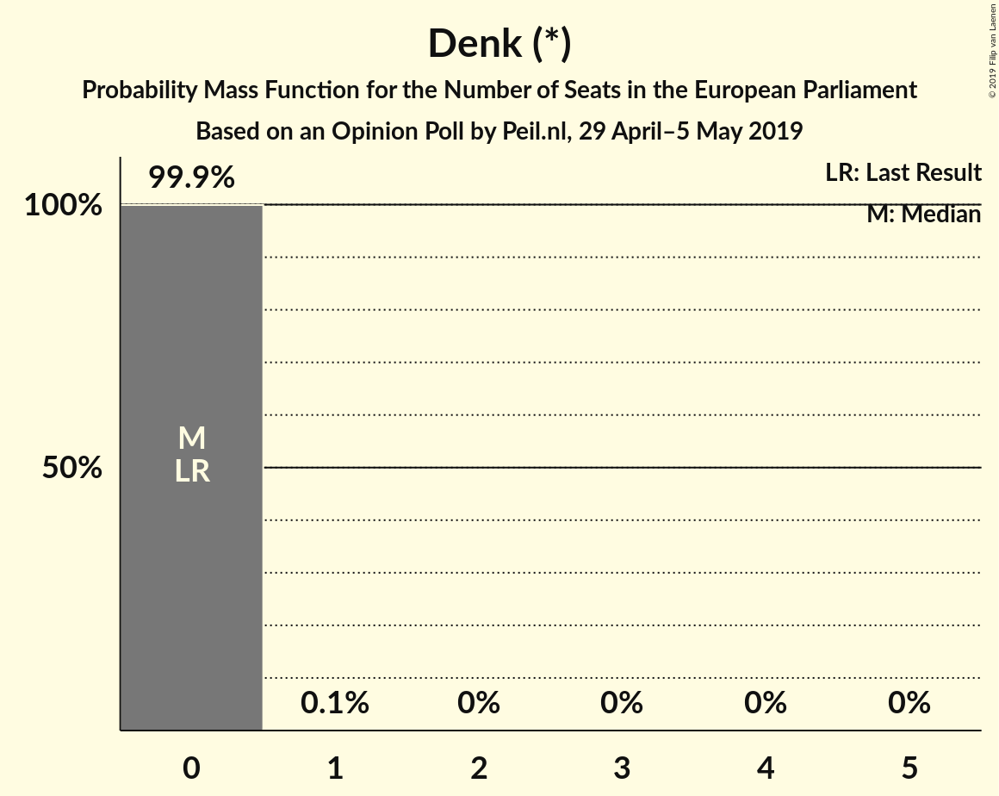

| Number of Seats | Probability | Accumulated | Special Marks |
|:---------------:|:-----------:|:-----------:|:-------------:|
| 0 | 99.9% | 100% | Last Result, Median |
| 1 | 0.1% | 0.1% |  |
| 2 | 0% | 0% |  |

## Coalitions

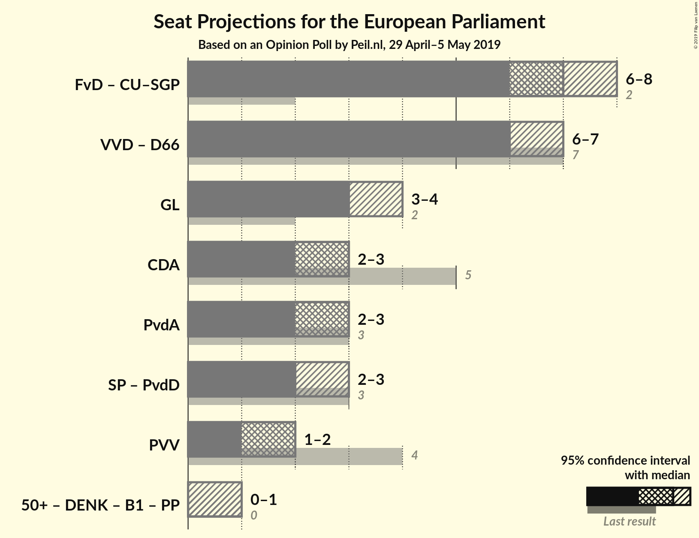

### Confidence Intervals

| Coalition | Last Result | Median | Majority? | 80% Confidence Interval | 90% Confidence Interval | 95% Confidence Interval | 99% Confidence Interval |
|:---------:|:-----------:|:------:|:---------:|:-----------------------:|:-----------------------:|:-----------------------:|:-----------------------:|
| Forum voor Democratie (ECR) – ChristenUnie–Staatkundig Gereformeerde Partij (ECR) | 2 | 7 | 0% | 6–7 | 6–7 | 6–8 | 6–8 |
| Volkspartij voor Vrijheid en Democratie (ALDE) – Democraten 66 (ALDE) | 7 | 6 | 0% | 6–7 | 6–7 | 6–7 | 6–7 |
| GroenLinks (Greens/EFA) | 2 | 3 | 0% | 3–4 | 3–4 | 3–4 | 3–4 |
| Christen-Democratisch Appèl (EPP) | 5 | 3 | 0% | 2–3 | 2–3 | 2–3 | 2–3 |
| Partij van de Arbeid (S&D) | 3 | 3 | 0% | 2–3 | 2–3 | 2–3 | 2–3 |
| Socialistische Partij (GUE/NGL) – Partij voor de Dieren (GUE/NGL) | 3 | 2 | 0% | 2–3 | 2–3 | 2–3 | 2–3 |
| Partij voor de Vrijheid (EAPN) | 4 | 2 | 0% | 1–2 | 1–2 | 1–2 | 1–2 |

### Forum voor Democratie (ECR) – ChristenUnie–Staatkundig Gereformeerde Partij (ECR)

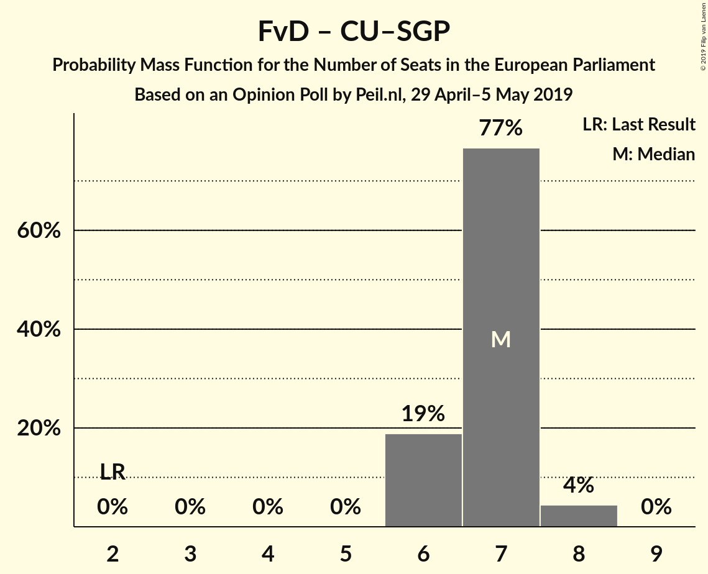

| Number of Seats | Probability | Accumulated | Special Marks |
|:---------------:|:-----------:|:-----------:|:-------------:|
| 2 | 0% | 100% | Last Result |
| 3 | 0% | 100% |  |
| 4 | 0% | 100% |  |
| 5 | 0% | 100% |  |
| 6 | 19% | 100% |  |
| 7 | 77% | 81% | Median |
| 8 | 4% | 4% |  |
| 9 | 0% | 0% |  |

### Volkspartij voor Vrijheid en Democratie (ALDE) – Democraten 66 (ALDE)

| Number of Seats | Probability | Accumulated | Special Marks |
|:---------------:|:-----------:|:-----------:|:-------------:|
| 6 | 62% | 100% | Median |
| 7 | 38% | 38% | Last Result |
| 8 | 0% | 0% |  |

### GroenLinks (Greens/EFA)

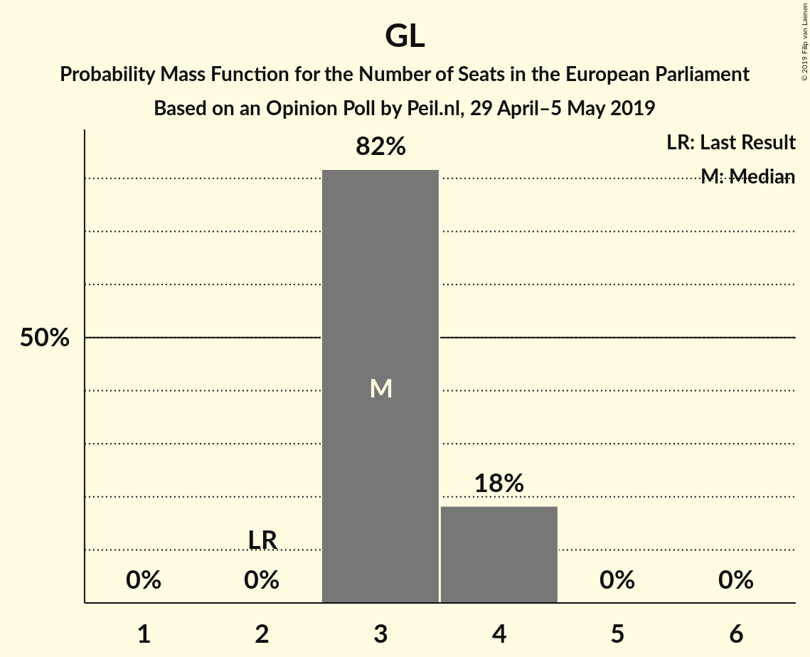

| Number of Seats | Probability | Accumulated | Special Marks |
|:---------------:|:-----------:|:-----------:|:-------------:|
| 2 | 0% | 100% | Last Result |
| 3 | 82% | 100% | Median |
| 4 | 18% | 18% |  |
| 5 | 0% | 0% |  |

### Christen-Democratisch Appèl (EPP)

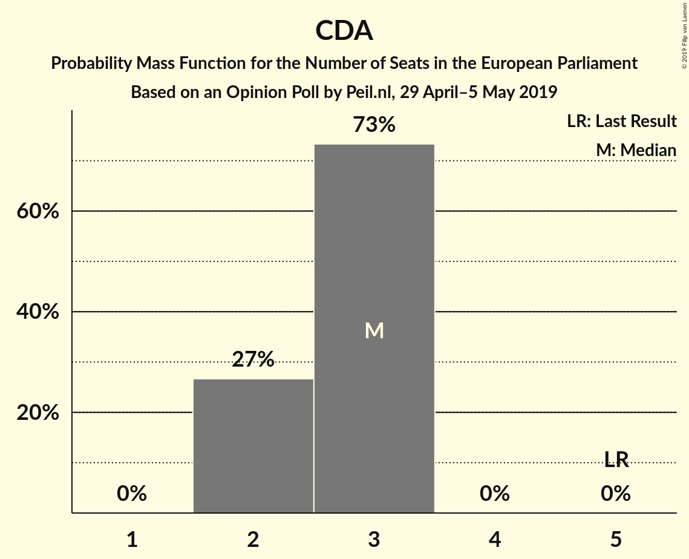

| Number of Seats | Probability | Accumulated | Special Marks |
|:---------------:|:-----------:|:-----------:|:-------------:|
| 2 | 27% | 100% |  |
| 3 | 73% | 73% | Median |
| 4 | 0% | 0% |  |
| 5 | 0% | 0% | Last Result |

### Partij van de Arbeid (S&D)

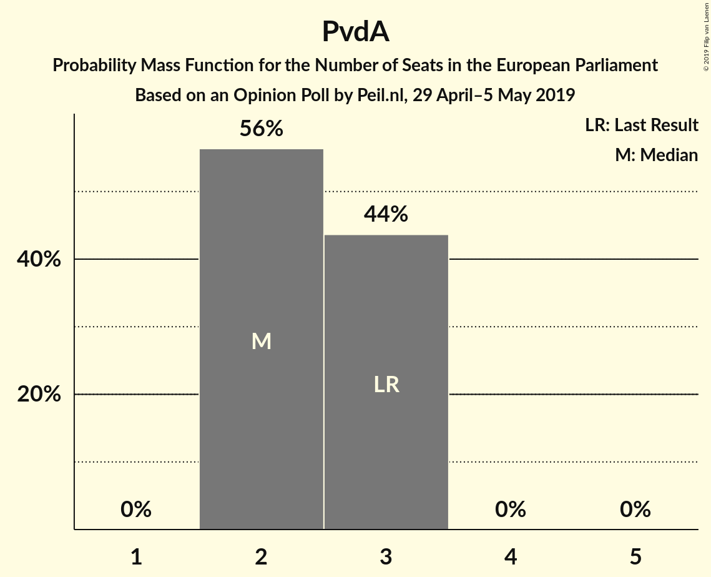

| Number of Seats | Probability | Accumulated | Special Marks |
|:---------------:|:-----------:|:-----------:|:-------------:|
| 2 | 28% | 100% |  |
| 3 | 72% | 72% | Last Result, Median |
| 4 | 0% | 0% |  |

### Socialistische Partij (GUE/NGL) – Partij voor de Dieren (GUE/NGL)

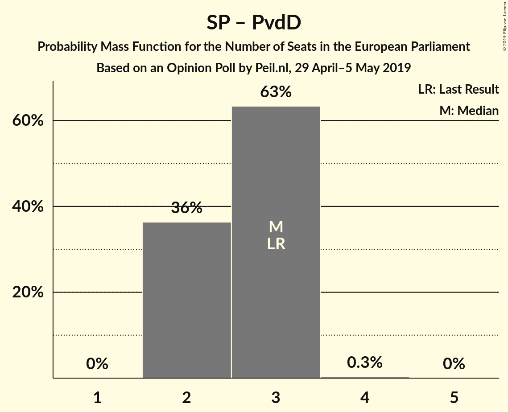

| Number of Seats | Probability | Accumulated | Special Marks |
|:---------------:|:-----------:|:-----------:|:-------------:|
| 2 | 69% | 100% | Median |
| 3 | 31% | 31% | Last Result |
| 4 | 0.3% | 0.3% |  |
| 5 | 0% | 0% |  |

### Partij voor de Vrijheid (EAPN)

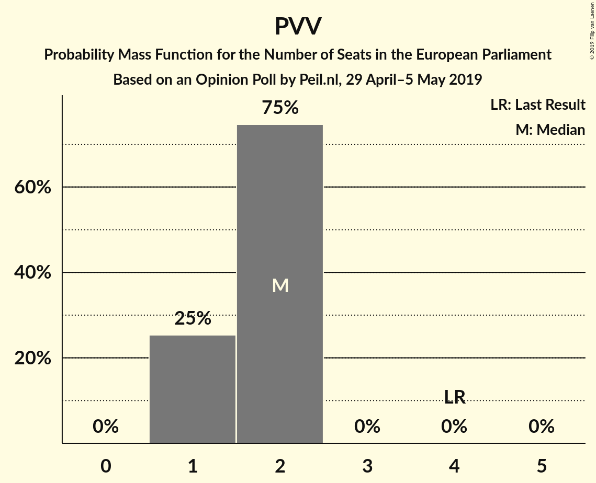

| Number of Seats | Probability | Accumulated | Special Marks |
|:---------------:|:-----------:|:-----------:|:-------------:|
| 1 | 25% | 100% |  |
| 2 | 75% | 75% | Median |
| 3 | 0% | 0% |  |
| 4 | 0% | 0% | Last Result |

## Technical Information

### Opinion Poll

+ **Polling firm:** Peil.nl
+ **Commissioner(s):** —
+ **Fieldwork period:** 29 April–5 May 2019

### Calculations

+ **Sample size:** 3000
+ **Simulations done:** 131,072
+ **Error estimate:** 1.69%

