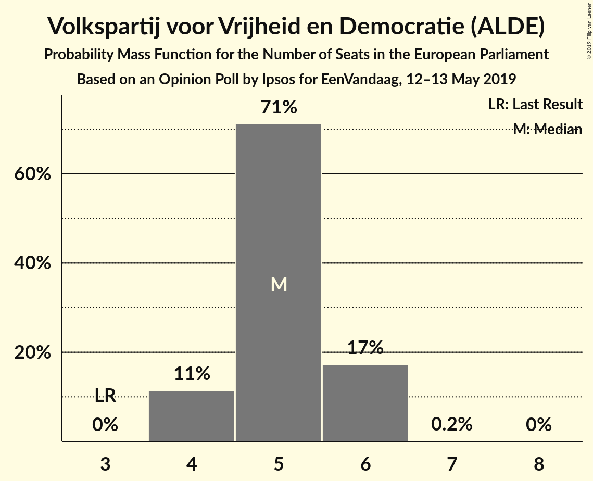
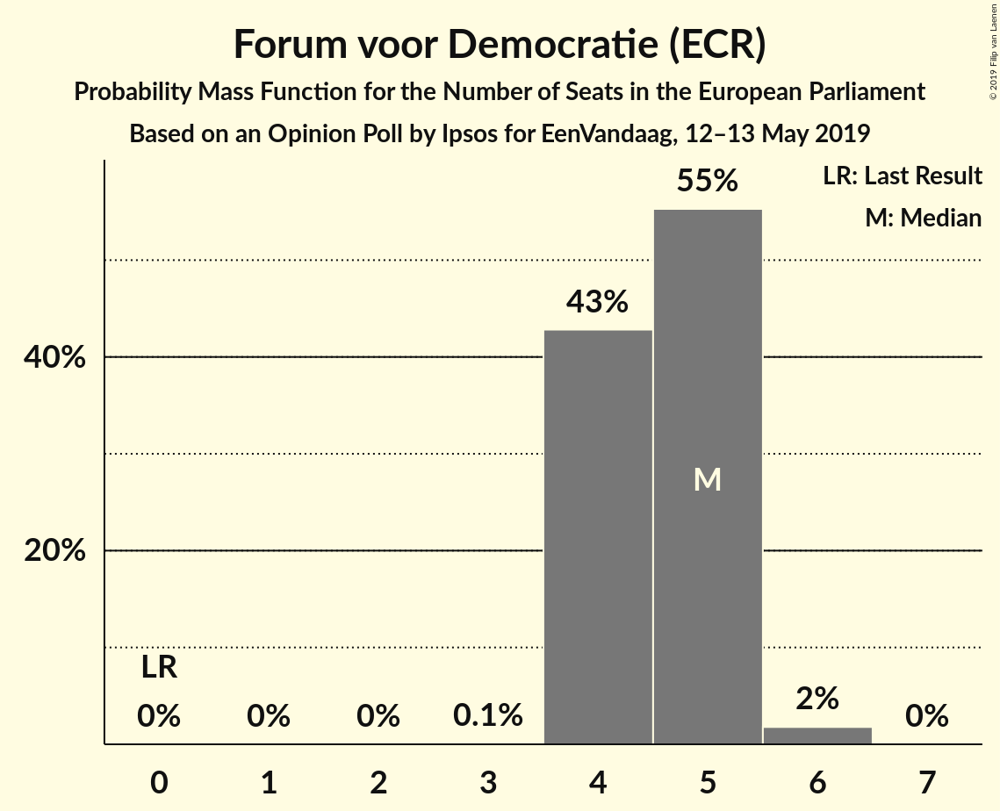
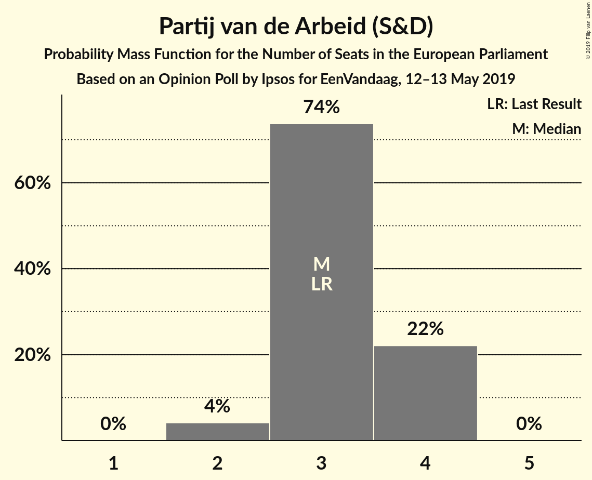
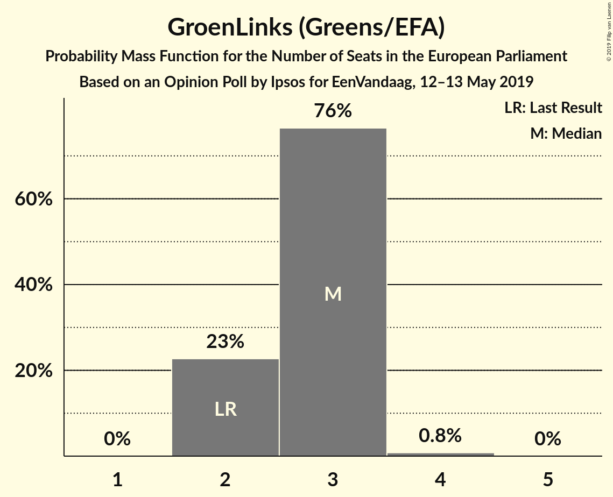
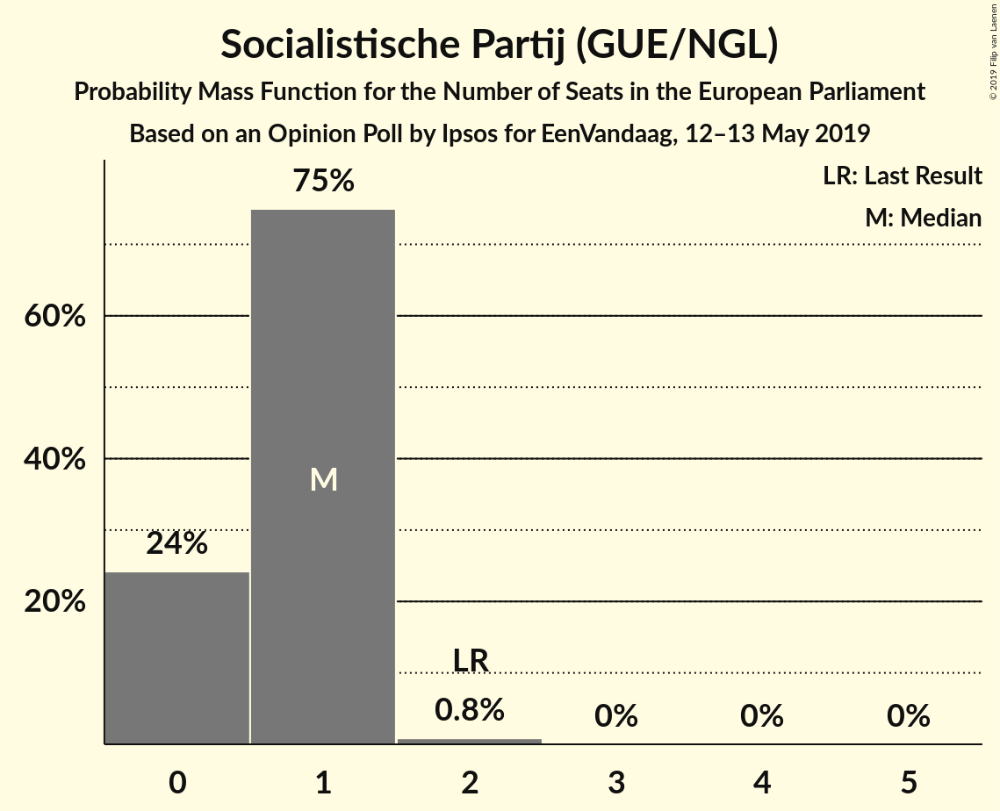
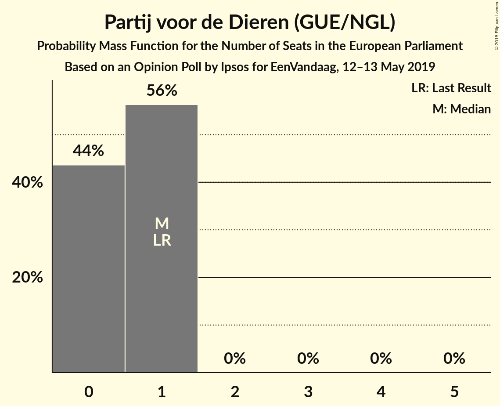
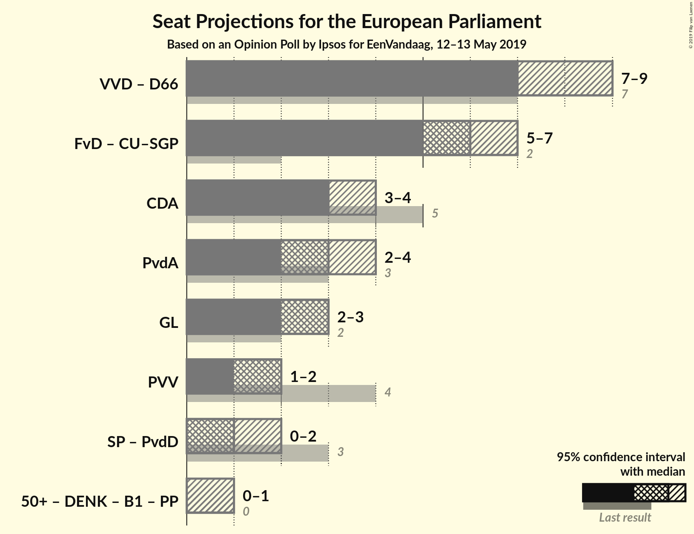
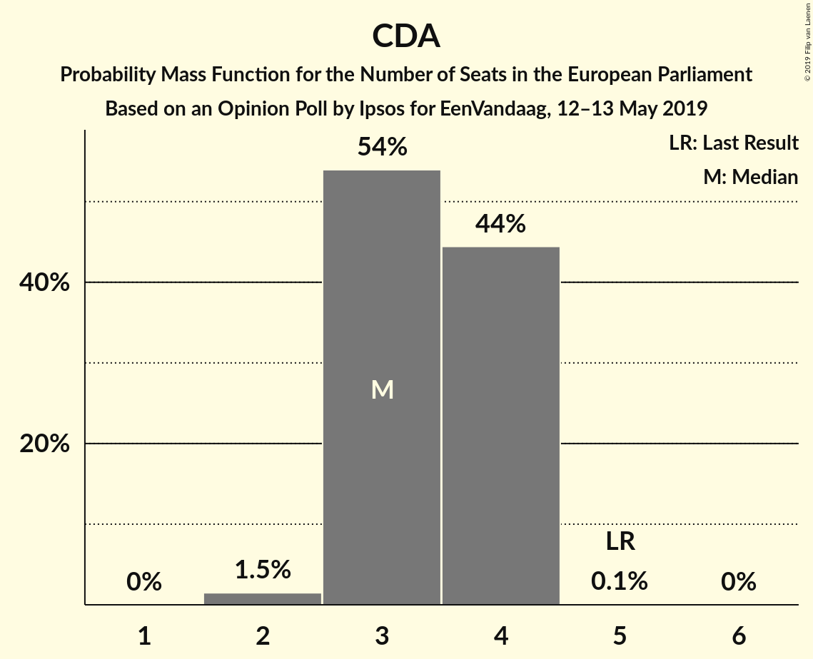
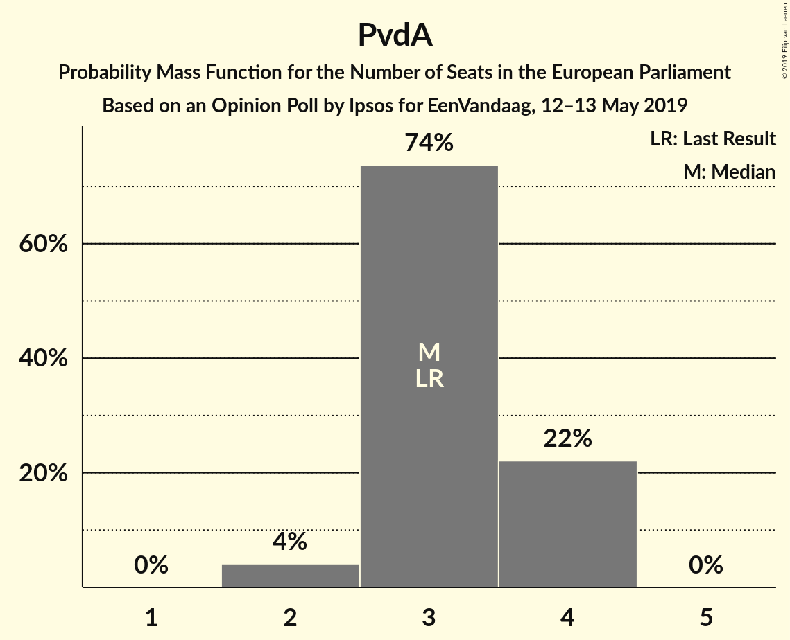
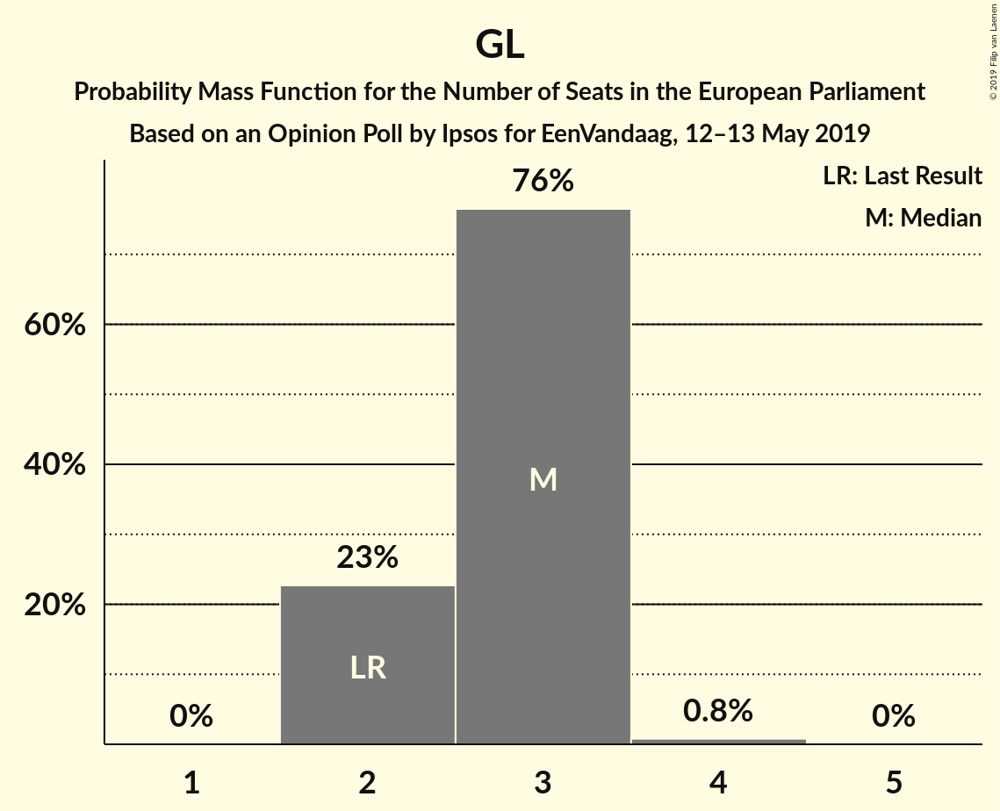

# Opinion Poll by Ipsos for EenVandaag, 12–13 May 2019

<a href="#voting-intentions">Voting Intentions</a> | <a href="#seats">Seats</a> | <a href="#coalitions">Coalitions</a> | <a href="#technical-information">Technical Information</a>

## Voting Intentions

### Confidence Intervals

| Party | Last Result | Poll Result | 80% Confidence Interval | 90% Confidence Interval | 95% Confidence Interval | 99% Confidence Interval |
|:-----:|:-----------:|:-----------:|:-----------------------:|:-----------------------:|:-----------------------:|:-----------------------:|
| Volkspartij voor Vrijheid en Democratie (ALDE) | 12.0% | 16.8% | 15.4–18.4% |15.0–18.9% |14.7–19.3% |14.0–20.1% |
| Forum voor Democratie (ECR) | 0.0% | 15.5% | 14.1–17.0% |13.7–17.5% |13.4–17.8% |12.7–18.6% |
| Christen-Democratisch Appèl (EPP) | 15.2% | 11.2% | 10.0–12.6% |9.7–13.0% |9.4–13.3% |8.9–14.0% |
| Partij van de Arbeid (S&D) | 9.4% | 11.1% | 10.0–12.5% |9.6–12.9% |9.3–13.2% |8.8–13.9% |
| GroenLinks (Greens/EFA) | 7.0% | 9.7% | 8.6–10.9% |8.2–11.3% |8.0–11.6% |7.5–12.3% |
| Democraten 66 (ALDE) | 15.5% | 8.9% | 7.8–10.1% |7.5–10.5% |7.3–10.8% |6.8–11.4% |
| Partij voor de Vrijheid (EAPN) | 13.3% | 6.2% | 5.3–7.3% |5.1–7.6% |4.9–7.9% |4.5–8.4% |
| ChristenUnie–Staatkundig Gereformeerde Partij (ECR) | 7.7% | 5.6% | 4.8–6.7% |4.6–7.0% |4.4–7.2% |4.0–7.7% |
| Socialistische Partij (GUE/NGL) | 9.6% | 4.4% | 3.7–5.4% |3.5–5.7% |3.3–5.9% |3.0–6.4% |
| Partij voor de Dieren (GUE/NGL) | 4.2% | 3.7% | 3.1–4.6% |2.9–4.9% |2.7–5.1% |2.5–5.6% |
| 50Plus (*) | 3.7% | 3.3% | 2.6–4.1% |2.5–4.3% |2.3–4.5% |2.1–5.0% |
| Denk (*) | 0.0% | 1.0% | 0.7–1.5% |0.6–1.7% |0.5–1.8% |0.4–2.1% |

*Note:* The poll result column reflects the actual value used in the calculations. Published results may vary slightly, and in addition be rounded to fewer digits.

## Seats

### Confidence Intervals

| Party | Last Result | Median | 80% Confidence Interval | 90% Confidence Interval | 95% Confidence Interval | 99% Confidence Interval |
|:-----:|:-----------:|:------:|:-----------------------:|:-----------------------:|:-----------------------:|:-----------------------:|
| <a href="#volkspartij-voor-vrijheid-en-democratie-(alde)">Volkspartij voor Vrijheid en Democratie (ALDE)</a> | 3 | 5 | 5 |5–6 |5–6 |4–6 |
| <a href="#forum-voor-democratie-(ecr)">Forum voor Democratie (ECR)</a> | 0 | 5 | 4–5 |4–5 |4–5 |4–6 |
| <a href="#christen-democratisch-appèl-(epp)">Christen-Democratisch Appèl (EPP)</a> | 5 | 3 | 3–4 |3–4 |3–4 |2–4 |
| <a href="#partij-van-de-arbeid-(s&d)">Partij van de Arbeid (S&D)</a> | 3 | 3 | 3–4 |3–4 |2–4 |2–4 |
| <a href="#groenlinks-(greens/efa)">GroenLinks (Greens/EFA)</a> | 2 | 3 | 2–3 |2–3 |2–3 |2–4 |
| <a href="#democraten-66-(alde)">Democraten 66 (ALDE)</a> | 4 | 2 | 2–3 |2–3 |2–3 |2–4 |
| <a href="#partij-voor-de-vrijheid-(eapn)">Partij voor de Vrijheid (EAPN)</a> | 4 | 2 | 1–2 |1–2 |1–2 |1–2 |
| <a href="#christenunie–staatkundig-gereformeerde-partij-(ecr)">ChristenUnie–Staatkundig Gereformeerde Partij (ECR)</a> | 2 | 2 | 1–2 |1–2 |1–2 |1–2 |
| <a href="#socialistische-partij-(gue/ngl)">Socialistische Partij (GUE/NGL)</a> | 2 | 0 | 0–1 |0–1 |0–1 |0–1 |
| <a href="#partij-voor-de-dieren-(gue/ngl)">Partij voor de Dieren (GUE/NGL)</a> | 1 | 1 | 0–1 |0–1 |0–1 |0–1 |
| <a href="#50plus-(*)">50Plus (*)</a> | 0 | 0 | 0 |0 |0–1 |0–1 |
| <a href="#denk-(*)">Denk (*)</a> | 0 | 0 | 0 |0 |0 |0 |

### Volkspartij voor Vrijheid en Democratie (ALDE)

*For a full overview of the results for this party, see the [Volkspartij voor Vrijheid en Democratie (ALDE)](party-volkspartijvoorvrijheidendemocratiealde.html) page.*

| Number of Seats | Probability | Accumulated | Special Marks |
|:---------------:|:-----------:|:-----------:|:-------------:|
| 3 | 0% | 100% | Last Result |
| 4 | 2% | 100% |  |
| 5 | 90% | 98% | Median |
| 6 | 8% | 8% |  |
| 7 | 0.1% | 0.1% |  |
| 8 | 0% | 0% |  |

### Forum voor Democratie (ECR)

*For a full overview of the results for this party, see the [Forum voor Democratie (ECR)](party-forumvoordemocratieecr.html) page.*

| Number of Seats | Probability | Accumulated | Special Marks |
|:---------------:|:-----------:|:-----------:|:-------------:|
| 0 | 0% | 100% | Last Result |
| 1 | 0% | 100% |  |
| 2 | 0% | 100% |  |
| 3 | 0.2% | 100% |  |
| 4 | 13% | 99.8% |  |
| 5 | 86% | 87% | Median |
| 6 | 0.9% | 0.9% |  |
| 7 | 0% | 0% |  |

### Christen-Democratisch Appèl (EPP)

*For a full overview of the results for this party, see the [Christen-Democratisch Appèl (EPP)](party-christen-democratischappèlepp.html) page.*

| Number of Seats | Probability | Accumulated | Special Marks |
|:---------------:|:-----------:|:-----------:|:-------------:|
| 2 | 0.6% | 100% |  |
| 3 | 84% | 99.4% | Median |
| 4 | 16% | 16% |  |
| 5 | 0.2% | 0.2% | Last Result |
| 6 | 0% | 0% |  |

### Partij van de Arbeid (S&D)

*For a full overview of the results for this party, see the [Partij van de Arbeid (S&D)](party-partijvandearbeidsd.html) page.*

| Number of Seats | Probability | Accumulated | Special Marks |
|:---------------:|:-----------:|:-----------:|:-------------:|
| 2 | 5% | 100% |  |
| 3 | 78% | 95% | Last Result, Median |
| 4 | 17% | 17% |  |
| 5 | 0% | 0% |  |

### GroenLinks (Greens/EFA)

*For a full overview of the results for this party, see the [GroenLinks (Greens/EFA)](party-groenlinksgreensefa.html) page.*

| Number of Seats | Probability | Accumulated | Special Marks |
|:---------------:|:-----------:|:-----------:|:-------------:|
| 2 | 30% | 100% | Last Result |
| 3 | 69% | 70% | Median |
| 4 | 1.4% | 1.4% |  |
| 5 | 0% | 0% |  |

### Democraten 66 (ALDE)

*For a full overview of the results for this party, see the [Democraten 66 (ALDE)](party-democraten66alde.html) page.*

| Number of Seats | Probability | Accumulated | Special Marks |
|:---------------:|:-----------:|:-----------:|:-------------:|
| 2 | 68% | 100% | Median |
| 3 | 31% | 32% |  |
| 4 | 2% | 2% | Last Result |
| 5 | 0% | 0% |  |

### Partij voor de Vrijheid (EAPN)

*For a full overview of the results for this party, see the [Partij voor de Vrijheid (EAPN)](party-partijvoordevrijheideapn.html) page.*

| Number of Seats | Probability | Accumulated | Special Marks |
|:---------------:|:-----------:|:-----------:|:-------------:|
| 1 | 15% | 100% |  |
| 2 | 85% | 85% | Median |
| 3 | 0% | 0% |  |
| 4 | 0% | 0% | Last Result |

### ChristenUnie–Staatkundig Gereformeerde Partij (ECR)

*For a full overview of the results for this party, see the [ChristenUnie–Staatkundig Gereformeerde Partij (ECR)](party-christenunie–staatkundiggereformeerdepartijecr.html) page.*

| Number of Seats | Probability | Accumulated | Special Marks |
|:---------------:|:-----------:|:-----------:|:-------------:|
| 0 | 0.2% | 100% |  |
| 1 | 19% | 99.8% |  |
| 2 | 80% | 80% | Last Result, Median |
| 3 | 0% | 0% |  |

### Socialistische Partij (GUE/NGL)

*For a full overview of the results for this party, see the [Socialistische Partij (GUE/NGL)](party-socialistischepartijguengl.html) page.*

| Number of Seats | Probability | Accumulated | Special Marks |
|:---------------:|:-----------:|:-----------:|:-------------:|
| 0 | 75% | 100% | Median |
| 1 | 25% | 25% |  |
| 2 | 0.3% | 0.3% | Last Result |
| 3 | 0% | 0% |  |

### Partij voor de Dieren (GUE/NGL)

*For a full overview of the results for this party, see the [Partij voor de Dieren (GUE/NGL)](party-partijvoordedierenguengl.html) page.*

| Number of Seats | Probability | Accumulated | Special Marks |
|:---------------:|:-----------:|:-----------:|:-------------:|
| 0 | 23% | 100% |  |
| 1 | 77% | 77% | Last Result, Median |
| 2 | 0.1% | 0.1% |  |
| 3 | 0% | 0% |  |

### 50Plus (*)

*For a full overview of the results for this party, see the [50Plus (*)](party-50plus.html) page.*

| Number of Seats | Probability | Accumulated | Special Marks |
|:---------------:|:-----------:|:-----------:|:-------------:|
| 0 | 96% | 100% | Last Result, Median |
| 1 | 4% | 4% |  |
| 2 | 0% | 0% |  |

### Denk (*)

*For a full overview of the results for this party, see the [Denk (*)](party-denk.html) page.*

| Number of Seats | Probability | Accumulated | Special Marks |
|:---------------:|:-----------:|:-----------:|:-------------:|
| 0 | 100% | 100% | Last Result, Median |

## Coalitions

### Confidence Intervals

| Coalition | Last Result | Median | Majority? | 80% Confidence Interval | 90% Confidence Interval | 95% Confidence Interval | 99% Confidence Interval |
|:---------:|:-----------:|:------:|:---------:|:-----------------------:|:-----------------------:|:-----------------------:|:-----------------------:|
| Volkspartij voor Vrijheid en Democratie (ALDE) – Democraten 66 (ALDE) | 7 | 7 | 0% | 7–8 | 7–9 | 7–9 | 6–9 |
| Forum voor Democratie (ECR) – ChristenUnie–Staatkundig Gereformeerde Partij (ECR) | 2 | 7 | 0% | 6–7 | 5–7 | 5–7 | 5–7 |
| Christen-Democratisch Appèl (EPP) | 5 | 3 | 0% | 3–4 | 3–4 | 3–4 | 2–4 |
| Partij van de Arbeid (S&D) | 3 | 3 | 0% | 3–4 | 3–4 | 2–4 | 2–4 |
| GroenLinks (Greens/EFA) | 2 | 3 | 0% | 2–3 | 2–3 | 2–3 | 2–4 |
| Partij voor de Vrijheid (EAPN) | 4 | 2 | 0% | 1–2 | 1–2 | 1–2 | 1–2 |
| Socialistische Partij (GUE/NGL) – Partij voor de Dieren (GUE/NGL) | 3 | 1 | 0% | 1 | 0–2 | 0–2 | 0–2 |

### Volkspartij voor Vrijheid en Democratie (ALDE) – Democraten 66 (ALDE)

| Number of Seats | Probability | Accumulated | Special Marks |
|:---------------:|:-----------:|:-----------:|:-------------:|
| 6 | 0.8% | 100% |  |
| 7 | 66% | 99.2% | Last Result, Median |
| 8 | 26% | 34% |  |
| 9 | 8% | 8% |  |
| 10 | 0% | 0% |  |

### Forum voor Democratie (ECR) – ChristenUnie–Staatkundig Gereformeerde Partij (ECR)

| Number of Seats | Probability | Accumulated | Special Marks |
|:---------------:|:-----------:|:-----------:|:-------------:|
| 2 | 0% | 100% | Last Result |
| 3 | 0% | 100% |  |
| 4 | 0% | 100% |  |
| 5 | 7% | 100% |  |
| 6 | 19% | 93% |  |
| 7 | 74% | 74% | Median |
| 8 | 0% | 0% |  |

### Christen-Democratisch Appèl (EPP)

| Number of Seats | Probability | Accumulated | Special Marks |
|:---------------:|:-----------:|:-----------:|:-------------:|
| 2 | 0.6% | 100% |  |
| 3 | 84% | 99.4% | Median |
| 4 | 16% | 16% |  |
| 5 | 0.2% | 0.2% | Last Result |
| 6 | 0% | 0% |  |

### Partij van de Arbeid (S&D)

| Number of Seats | Probability | Accumulated | Special Marks |
|:---------------:|:-----------:|:-----------:|:-------------:|
| 2 | 5% | 100% |  |
| 3 | 78% | 95% | Last Result, Median |
| 4 | 17% | 17% |  |
| 5 | 0% | 0% |  |

### GroenLinks (Greens/EFA)

| Number of Seats | Probability | Accumulated | Special Marks |
|:---------------:|:-----------:|:-----------:|:-------------:|
| 2 | 30% | 100% | Last Result |
| 3 | 69% | 70% | Median |
| 4 | 1.4% | 1.4% |  |
| 5 | 0% | 0% |  |

### Partij voor de Vrijheid (EAPN)

| Number of Seats | Probability | Accumulated | Special Marks |
|:---------------:|:-----------:|:-----------:|:-------------:|
| 1 | 15% | 100% |  |
| 2 | 85% | 85% | Median |
| 3 | 0% | 0% |  |
| 4 | 0% | 0% | Last Result |

### Socialistische Partij (GUE/NGL) – Partij voor de Dieren (GUE/NGL)

| Number of Seats | Probability | Accumulated | Special Marks |
|:---------------:|:-----------:|:-----------:|:-------------:|
| 0 | 5% | 100% |  |
| 1 | 87% | 95% | Median |
| 2 | 8% | 8% |  |
| 3 | 0.1% | 0.1% | Last Result |
| 4 | 0% | 0% |  |

## Technical Information

### Opinion Poll

+ **Polling firm:** Ipsos
+ **Commissioner(s):** EenVandaag
+ **Fieldwork period:** 12–13 May 2019

### Calculations

+ **Sample size:** 1015
+ **Simulations done:** 131,072
+ **Error estimate:** 3.20%

