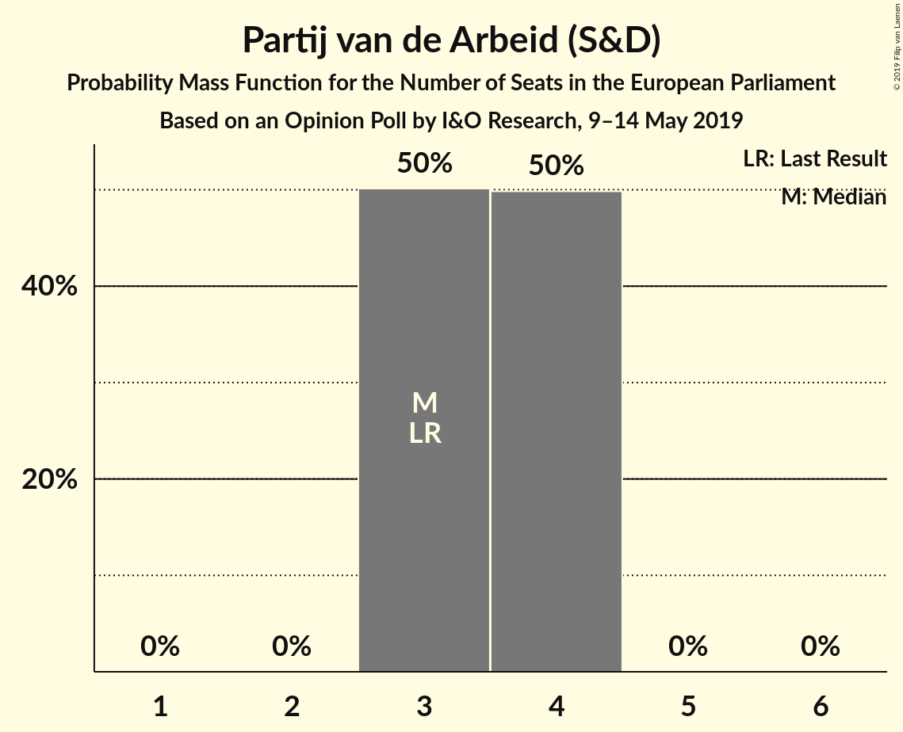
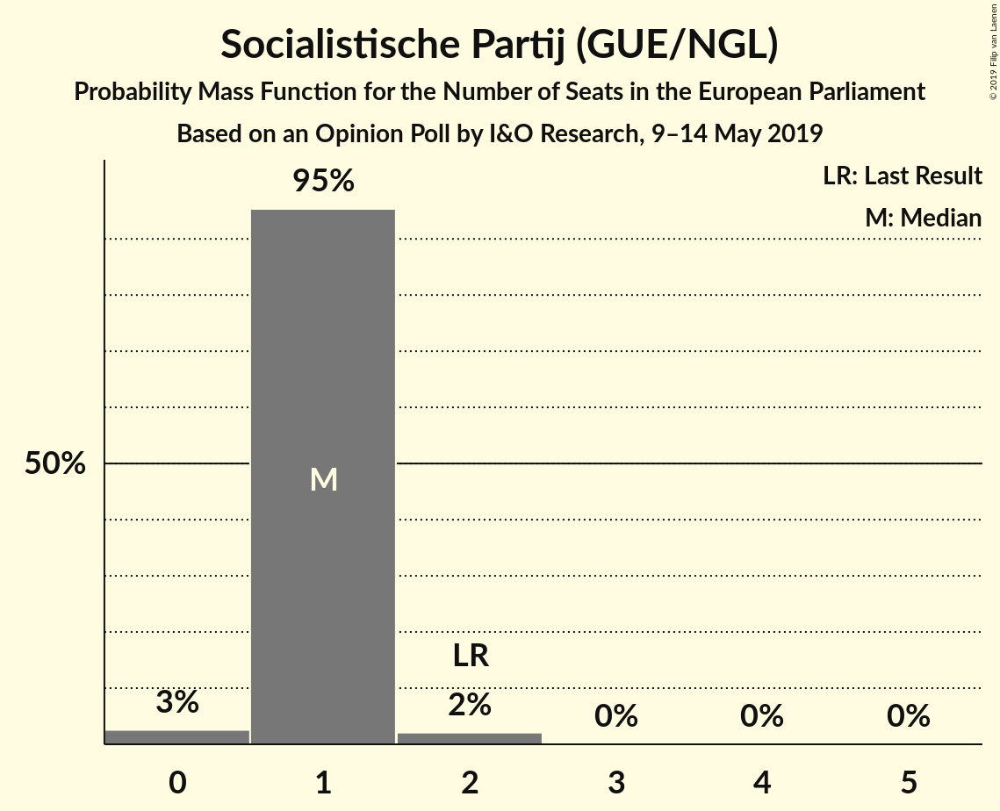
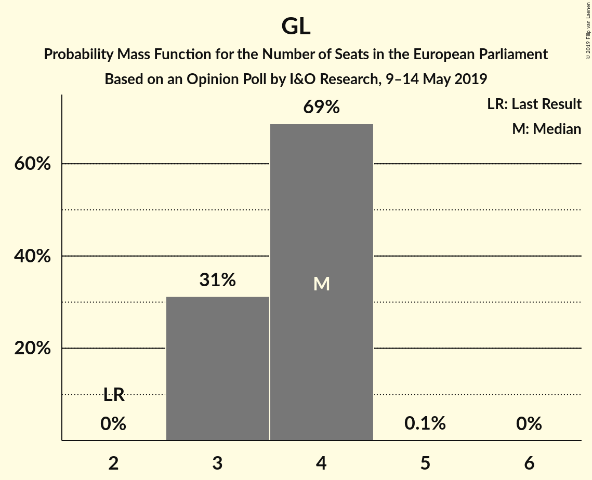
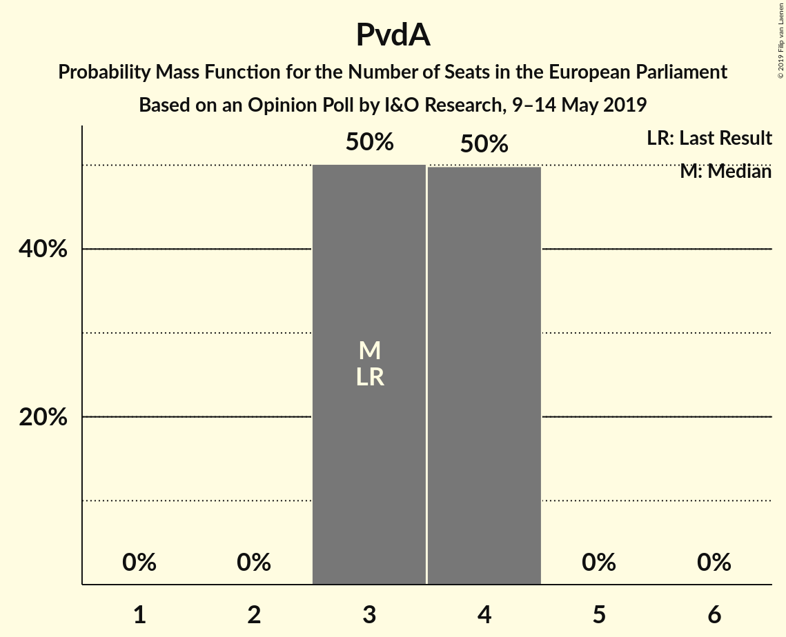
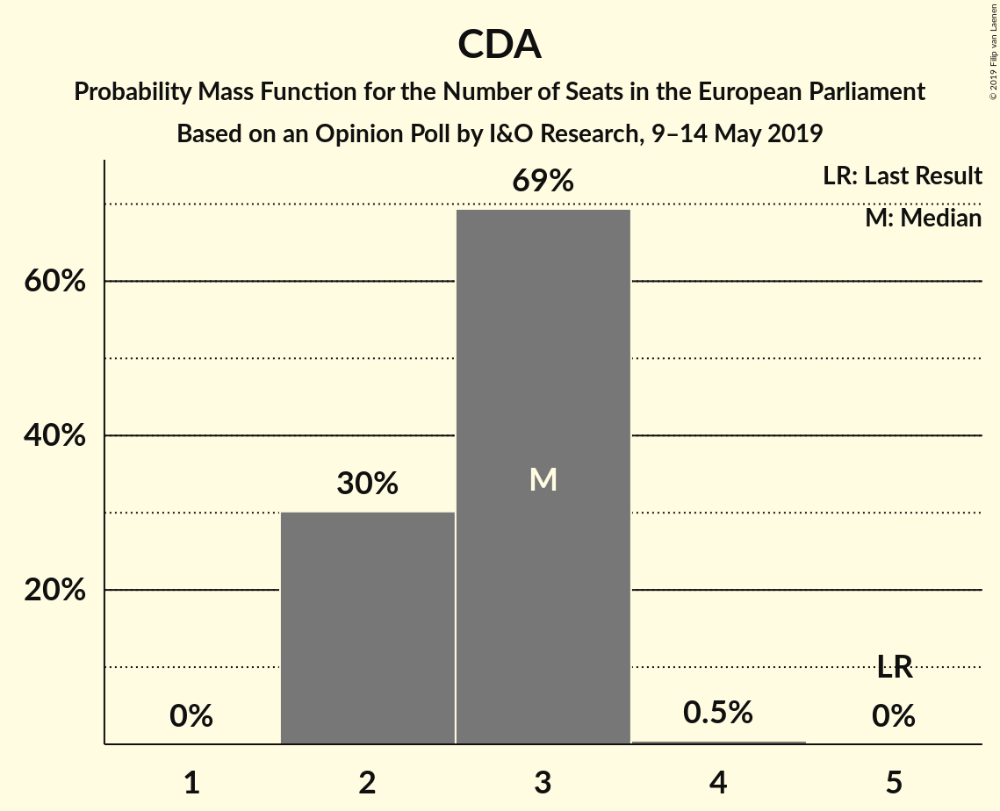

# Opinion Poll by I&O Research, 9–14 May 2019

<a href="#voting-intentions">Voting Intentions</a> | <a href="#seats">Seats</a> | <a href="#coalitions">Coalitions</a> | <a href="#technical-information">Technical Information</a>

## Voting Intentions

### Confidence Intervals

| Party | Last Result | Poll Result | 80% Confidence Interval | 90% Confidence Interval | 95% Confidence Interval | 99% Confidence Interval |
|:-----:|:-----------:|:-----------:|:-----------------------:|:-----------------------:|:-----------------------:|:-----------------------:|
| Volkspartij voor Vrijheid en Democratie (ALDE) | 12.0% | 15.9% | 14.8–17.1% |14.5–17.5% |14.2–17.8% |13.7–18.4% |
| Forum voor Democratie (ECR) | 0.0% | 13.3% | 12.2–14.4% |11.9–14.7% |11.7–15.0% |11.2–15.5% |
| GroenLinks (Greens/EFA) | 7.0% | 12.4% | 11.4–13.5% |11.1–13.8% |10.9–14.1% |10.5–14.6% |
| Partij van de Arbeid (S&D) | 9.4% | 12.1% | 11.1–13.2% |10.9–13.5% |10.6–13.8% |10.2–14.3% |
| Christen-Democratisch Appèl (EPP) | 15.2% | 9.9% | 9.0–10.9% |8.7–11.2% |8.5–11.4% |8.1–11.9% |
| Partij voor de Vrijheid (EAPN) | 13.3% | 8.7% | 7.9–9.7% |7.7–10.0% |7.5–10.2% |7.1–10.7% |
| Democraten 66 (ALDE) | 15.5% | 7.3% | 6.5–8.2% |6.3–8.4% |6.1–8.7% |5.8–9.1% |
| ChristenUnie–Staatkundig Gereformeerde Partij (ECR) | 7.7% | 6.8% | 6.0–7.6% |5.8–7.8% |5.6–8.1% |5.3–8.5% |
| Socialistische Partij (GUE/NGL) | 9.6% | 4.8% | 4.2–5.6% |4.0–5.8% |3.9–6.0% |3.6–6.3% |
| Partij voor de Dieren (GUE/NGL) | 4.2% | 3.6% | 3.1–4.3% |2.9–4.5% |2.8–4.6% |2.6–5.0% |
| 50Plus (*) | 3.7% | 3.4% | 2.9–4.0% |2.7–4.2% |2.6–4.4% |2.4–4.7% |

*Note:* The poll result column reflects the actual value used in the calculations. Published results may vary slightly, and in addition be rounded to fewer digits.

## Seats

### Confidence Intervals

| Party | Last Result | Median | 80% Confidence Interval | 90% Confidence Interval | 95% Confidence Interval | 99% Confidence Interval |
|:-----:|:-----------:|:------:|:-----------------------:|:-----------------------:|:-----------------------:|:-----------------------:|
| <a href="#volkspartij-voor-vrijheid-en-democratie-(alde)">Volkspartij voor Vrijheid en Democratie (ALDE)</a> | 3 | 5 | 4–5 |4–5 |4–5 |4–6 |
| <a href="#forum-voor-democratie-(ecr)">Forum voor Democratie (ECR)</a> | 0 | 4 | 3–4 |3–4 |3–4 |3–4 |
| <a href="#groenlinks-(greens/efa)">GroenLinks (Greens/EFA)</a> | 2 | 4 | 3–4 |3–4 |3–4 |3–4 |
| <a href="#partij-van-de-arbeid-(s&d)">Partij van de Arbeid (S&D)</a> | 3 | 3 | 3–4 |3–4 |3–4 |3–4 |
| <a href="#christen-democratisch-appèl-(epp)">Christen-Democratisch Appèl (EPP)</a> | 5 | 3 | 2–3 |2–3 |2–3 |2–4 |
| <a href="#partij-voor-de-vrijheid-(eapn)">Partij voor de Vrijheid (EAPN)</a> | 4 | 2 | 2–3 |2–3 |2–3 |2–3 |
| <a href="#democraten-66-(alde)">Democraten 66 (ALDE)</a> | 4 | 2 | 2 |2 |1–2 |1–2 |
| <a href="#christenunie–staatkundig-gereformeerde-partij-(ecr)">ChristenUnie–Staatkundig Gereformeerde Partij (ECR)</a> | 2 | 2 | 2 |1–2 |1–2 |1–2 |
| <a href="#socialistische-partij-(gue/ngl)">Socialistische Partij (GUE/NGL)</a> | 2 | 1 | 1 |1 |0–2 |0–2 |
| <a href="#partij-voor-de-dieren-(gue/ngl)">Partij voor de Dieren (GUE/NGL)</a> | 1 | 0 | 0–1 |0–1 |0–1 |0–1 |
| <a href="#50plus-(*)">50Plus (*)</a> | 0 | 0 | 0 |0–1 |0–1 |0–1 |

### Volkspartij voor Vrijheid en Democratie (ALDE)

*For a full overview of the results for this party, see the [Volkspartij voor Vrijheid en Democratie (ALDE)](party-volkspartijvoorvrijheidendemocratiealde.html) page.*

| Number of Seats | Probability | Accumulated | Special Marks |
|:---------------:|:-----------:|:-----------:|:-------------:|
| 3 | 0% | 100% | Last Result |
| 4 | 29% | 100% |  |
| 5 | 69% | 71% | Median |
| 6 | 2% | 2% |  |
| 7 | 0% | 0% |  |

### Forum voor Democratie (ECR)

*For a full overview of the results for this party, see the [Forum voor Democratie (ECR)](party-forumvoordemocratieecr.html) page.*

| Number of Seats | Probability | Accumulated | Special Marks |
|:---------------:|:-----------:|:-----------:|:-------------:|
| 0 | 0% | 100% | Last Result |
| 1 | 0% | 100% |  |
| 2 | 0% | 100% |  |
| 3 | 12% | 100% |  |
| 4 | 87% | 88% | Median |
| 5 | 0.4% | 0.4% |  |
| 6 | 0% | 0% |  |

### GroenLinks (Greens/EFA)

*For a full overview of the results for this party, see the [GroenLinks (Greens/EFA)](party-groenlinksgreensefa.html) page.*

| Number of Seats | Probability | Accumulated | Special Marks |
|:---------------:|:-----------:|:-----------:|:-------------:|
| 2 | 0% | 100% | Last Result |
| 3 | 21% | 100% |  |
| 4 | 79% | 79% | Median |
| 5 | 0.1% | 0.1% |  |
| 6 | 0% | 0% |  |

### Partij van de Arbeid (S&D)

*For a full overview of the results for this party, see the [Partij van de Arbeid (S&D)](party-partijvandearbeidsd.html) page.*

| Number of Seats | Probability | Accumulated | Special Marks |
|:---------------:|:-----------:|:-----------:|:-------------:|
| 3 | 73% | 100% | Last Result, Median |
| 4 | 27% | 27% |  |
| 5 | 0% | 0% |  |

### Christen-Democratisch Appèl (EPP)

*For a full overview of the results for this party, see the [Christen-Democratisch Appèl (EPP)](party-christen-democratischappèlepp.html) page.*

| Number of Seats | Probability | Accumulated | Special Marks |
|:---------------:|:-----------:|:-----------:|:-------------:|
| 2 | 24% | 100% |  |
| 3 | 75% | 76% | Median |
| 4 | 0.7% | 0.7% |  |
| 5 | 0% | 0% | Last Result |

### Partij voor de Vrijheid (EAPN)

*For a full overview of the results for this party, see the [Partij voor de Vrijheid (EAPN)](party-partijvoordevrijheideapn.html) page.*

| Number of Seats | Probability | Accumulated | Special Marks |
|:---------------:|:-----------:|:-----------:|:-------------:|
| 2 | 80% | 100% | Median |
| 3 | 20% | 20% |  |
| 4 | 0% | 0% | Last Result |

### Democraten 66 (ALDE)

*For a full overview of the results for this party, see the [Democraten 66 (ALDE)](party-democraten66alde.html) page.*

| Number of Seats | Probability | Accumulated | Special Marks |
|:---------------:|:-----------:|:-----------:|:-------------:|
| 1 | 3% | 100% |  |
| 2 | 97% | 97% | Median |
| 3 | 0.1% | 0.1% |  |
| 4 | 0% | 0% | Last Result |

### ChristenUnie–Staatkundig Gereformeerde Partij (ECR)

*For a full overview of the results for this party, see the [ChristenUnie–Staatkundig Gereformeerde Partij (ECR)](party-christenunie–staatkundiggereformeerdepartijecr.html) page.*

| Number of Seats | Probability | Accumulated | Special Marks |
|:---------------:|:-----------:|:-----------:|:-------------:|
| 1 | 7% | 100% |  |
| 2 | 93% | 93% | Last Result, Median |
| 3 | 0% | 0% |  |

### Socialistische Partij (GUE/NGL)

*For a full overview of the results for this party, see the [Socialistische Partij (GUE/NGL)](party-socialistischepartijguengl.html) page.*

| Number of Seats | Probability | Accumulated | Special Marks |
|:---------------:|:-----------:|:-----------:|:-------------:|
| 0 | 4% | 100% |  |
| 1 | 93% | 96% | Median |
| 2 | 3% | 3% | Last Result |
| 3 | 0% | 0% |  |

### Partij voor de Dieren (GUE/NGL)

*For a full overview of the results for this party, see the [Partij voor de Dieren (GUE/NGL)](party-partijvoordedierenguengl.html) page.*

| Number of Seats | Probability | Accumulated | Special Marks |
|:---------------:|:-----------:|:-----------:|:-------------:|
| 0 | 62% | 100% | Median |
| 1 | 38% | 38% | Last Result |
| 2 | 0% | 0% |  |

### 50Plus (*)

*For a full overview of the results for this party, see the [50Plus (*)](party-50plus.html) page.*

| Number of Seats | Probability | Accumulated | Special Marks |
|:---------------:|:-----------:|:-----------:|:-------------:|
| 0 | 91% | 100% | Last Result, Median |
| 1 | 9% | 9% |  |
| 2 | 0% | 0% |  |

## Coalitions

### Confidence Intervals

| Coalition | Last Result | Median | Majority? | 80% Confidence Interval | 90% Confidence Interval | 95% Confidence Interval | 99% Confidence Interval |
|:---------:|:-----------:|:------:|:---------:|:-----------------------:|:-----------------------:|:-----------------------:|:-----------------------:|
| Volkspartij voor Vrijheid en Democratie (ALDE) – Democraten 66 (ALDE) | 7 | 7 | 0% | 6–7 | 6–7 | 6–7 | 5–8 |
| Forum voor Democratie (ECR) – ChristenUnie–Staatkundig Gereformeerde Partij (ECR) | 2 | 6 | 0% | 5–6 | 5–6 | 5–6 | 4–6 |
| GroenLinks (Greens/EFA) | 2 | 4 | 0% | 3–4 | 3–4 | 3–4 | 3–4 |
| Partij van de Arbeid (S&D) | 3 | 3 | 0% | 3–4 | 3–4 | 3–4 | 3–4 |
| Christen-Democratisch Appèl (EPP) | 5 | 3 | 0% | 2–3 | 2–3 | 2–3 | 2–4 |
| Partij voor de Vrijheid (EAPN) | 4 | 2 | 0% | 2–3 | 2–3 | 2–3 | 2–3 |
| Socialistische Partij (GUE/NGL) – Partij voor de Dieren (GUE/NGL) | 3 | 1 | 0% | 1–2 | 1–2 | 1–2 | 1–2 |

### Volkspartij voor Vrijheid en Democratie (ALDE) – Democraten 66 (ALDE)

| Number of Seats | Probability | Accumulated | Special Marks |
|:---------------:|:-----------:|:-----------:|:-------------:|
| 5 | 0.5% | 100% |  |
| 6 | 31% | 99.5% |  |
| 7 | 67% | 69% | Last Result, Median |
| 8 | 2% | 2% |  |
| 9 | 0% | 0% |  |

### Forum voor Democratie (ECR) – ChristenUnie–Staatkundig Gereformeerde Partij (ECR)

| Number of Seats | Probability | Accumulated | Special Marks |
|:---------------:|:-----------:|:-----------:|:-------------:|
| 2 | 0% | 100% | Last Result |
| 3 | 0% | 100% |  |
| 4 | 0.8% | 100% |  |
| 5 | 18% | 99.2% |  |
| 6 | 81% | 82% | Median |
| 7 | 0.3% | 0.3% |  |
| 8 | 0% | 0% |  |

### GroenLinks (Greens/EFA)

| Number of Seats | Probability | Accumulated | Special Marks |
|:---------------:|:-----------:|:-----------:|:-------------:|
| 2 | 0% | 100% | Last Result |
| 3 | 21% | 100% |  |
| 4 | 79% | 79% | Median |
| 5 | 0.1% | 0.1% |  |
| 6 | 0% | 0% |  |

### Partij van de Arbeid (S&D)

| Number of Seats | Probability | Accumulated | Special Marks |
|:---------------:|:-----------:|:-----------:|:-------------:|
| 3 | 73% | 100% | Last Result, Median |
| 4 | 27% | 27% |  |
| 5 | 0% | 0% |  |

### Christen-Democratisch Appèl (EPP)

| Number of Seats | Probability | Accumulated | Special Marks |
|:---------------:|:-----------:|:-----------:|:-------------:|
| 2 | 24% | 100% |  |
| 3 | 75% | 76% | Median |
| 4 | 0.7% | 0.7% |  |
| 5 | 0% | 0% | Last Result |

### Partij voor de Vrijheid (EAPN)

| Number of Seats | Probability | Accumulated | Special Marks |
|:---------------:|:-----------:|:-----------:|:-------------:|
| 2 | 80% | 100% | Median |
| 3 | 20% | 20% |  |
| 4 | 0% | 0% | Last Result |

### Socialistische Partij (GUE/NGL) – Partij voor de Dieren (GUE/NGL)

| Number of Seats | Probability | Accumulated | Special Marks |
|:---------------:|:-----------:|:-----------:|:-------------:|
| 0 | 0.3% | 100% |  |
| 1 | 63% | 99.7% | Median |
| 2 | 37% | 37% |  |
| 3 | 0.1% | 0.1% | Last Result |
| 4 | 0% | 0% |  |

## Technical Information

### Opinion Poll

+ **Polling firm:** I&O Research
+ **Commissioner(s):** —
+ **Fieldwork period:** 9–14 May 2019

### Calculations

+ **Sample size:** 1659
+ **Simulations done:** 524,288
+ **Error estimate:** 0.81%

