# Opinion Poll by Peil.nl, 13–19 May 2019

<a href="#voting-intentions">Voting Intentions</a> | <a href="#seats">Seats</a> | <a href="#coalitions">Coalitions</a> | <a href="#technical-information">Technical Information</a>

## Voting Intentions

### Confidence Intervals

| Party | Last Result | Poll Result | 80% Confidence Interval | 90% Confidence Interval | 95% Confidence Interval | 99% Confidence Interval |
|:-----:|:-----------:|:-----------:|:-----------------------:|:-----------------------:|:-----------------------:|:-----------------------:|
| Volkspartij voor Vrijheid en Democratie (ALDE) | 12.0% | 15.2% | 14.4–16.1% |14.2–16.4% |14.0–16.6% |13.6–17.0% |
| Forum voor Democratie (ECR) | 0.0% | 15.2% | 14.4–16.1% |14.2–16.4% |14.0–16.6% |13.6–17.0% |
| Partij van de Arbeid (S&D) | 9.4% | 13.2% | 12.4–14.0% |12.2–14.3% |12.0–14.5% |11.7–14.9% |
| Christen-Democratisch Appèl (EPP) | 15.2% | 12.7% | 11.9–13.5% |11.7–13.7% |11.6–13.9% |11.2–14.3% |
| GroenLinks (Greens/EFA) | 7.0% | 8.1% | 7.5–8.8% |7.3–9.0% |7.2–9.2% |6.9–9.5% |
| ChristenUnie–Staatkundig Gereformeerde Partij (ECR) | 7.7% | 8.1% | 7.5–8.8% |7.3–9.0% |7.2–9.2% |6.9–9.5% |
| Democraten 66 (ALDE) | 15.5% | 7.6% | 7.0–8.3% |6.8–8.4% |6.7–8.6% |6.4–8.9% |
| Partij voor de Dieren (GUE/NGL) | 4.2% | 4.6% | 4.1–5.1% |4.0–5.2% |3.9–5.4% |3.7–5.6% |
| Partij voor de Vrijheid (EAPN) | 13.3% | 4.1% | 3.6–4.6% |3.5–4.7% |3.4–4.8% |3.2–5.1% |
| Socialistische Partij (GUE/NGL) | 9.6% | 4.1% | 3.6–4.6% |3.5–4.7% |3.4–4.8% |3.2–5.1% |
| 50Plus (*) | 3.7% | 3.0% | 2.7–3.5% |2.6–3.6% |2.5–3.7% |2.3–3.9% |
| Denk (*) | 0.0% | 2.0% | 1.7–2.4% |1.6–2.5% |1.6–2.6% |1.4–2.8% |

*Note:* The poll result column reflects the actual value used in the calculations. Published results may vary slightly, and in addition be rounded to fewer digits.

## Seats

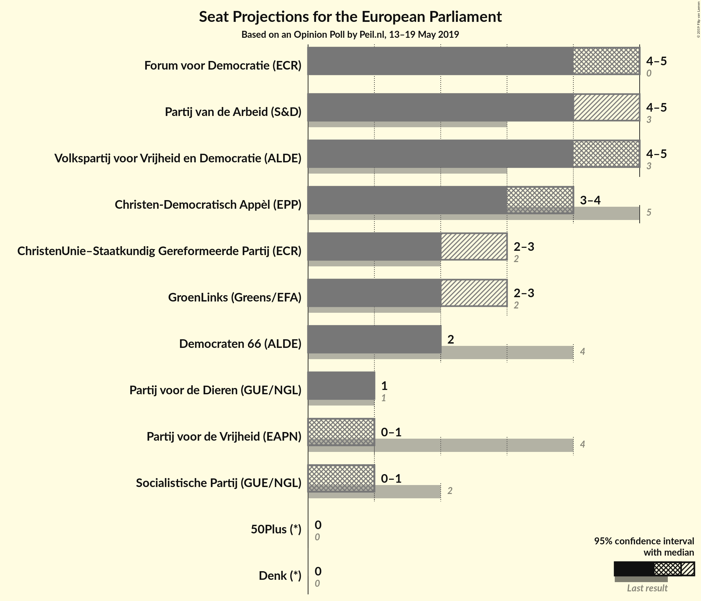

### Confidence Intervals

| Party | Last Result | Median | 80% Confidence Interval | 90% Confidence Interval | 95% Confidence Interval | 99% Confidence Interval |
|:-----:|:-----------:|:------:|:-----------------------:|:-----------------------:|:-----------------------:|:-----------------------:|
| <a href="#volkspartij-voor-vrijheid-en-democratie-(alde)">Volkspartij voor Vrijheid en Democratie (ALDE)</a> | 3 | 4 | 4–5 |4–5 |4–5 |4–5 |
| <a href="#forum-voor-democratie-(ecr)">Forum voor Democratie (ECR)</a> | 0 | 5 | 4–5 |4–5 |4–5 |4–5 |
| <a href="#partij-van-de-arbeid-(s&d)">Partij van de Arbeid (S&D)</a> | 3 | 4 | 4 |4 |4 |4 |
| <a href="#christen-democratisch-appèl-(epp)">Christen-Democratisch Appèl (EPP)</a> | 5 | 4 | 4 |4 |4 |4 |
| <a href="#groenlinks-(greens/efa)">GroenLinks (Greens/EFA)</a> | 2 | 2 | 2–3 |2–3 |2–3 |2–3 |
| <a href="#christenunie–staatkundig-gereformeerde-partij-(ecr)">ChristenUnie–Staatkundig Gereformeerde Partij (ECR)</a> | 2 | 2 | 2 |2 |2 |2 |
| <a href="#democraten-66-(alde)">Democraten 66 (ALDE)</a> | 4 | 2 | 2 |2 |2 |2 |
| <a href="#partij-voor-de-dieren-(gue/ngl)">Partij voor de Dieren (GUE/NGL)</a> | 1 | 1 | 1 |1 |1 |1 |
| <a href="#partij-voor-de-vrijheid-(eapn)">Partij voor de Vrijheid (EAPN)</a> | 4 | 0 | 0 |0 |0 |0 |
| <a href="#socialistische-partij-(gue/ngl)">Socialistische Partij (GUE/NGL)</a> | 2 | 1 | 1 |1 |1 |1 |
| <a href="#50plus-(*)">50Plus (*)</a> | 0 | 1 | 0–1 |0–1 |0–1 |0–1 |
| <a href="#denk-(*)">Denk (*)</a> | 0 | 0 | 0 |0 |0 |0 |

### Volkspartij voor Vrijheid en Democratie (ALDE)

*For a full overview of the results for this party, see the [Volkspartij voor Vrijheid en Democratie (ALDE)](party-volkspartijvoorvrijheidendemocratiealde.html) page.*

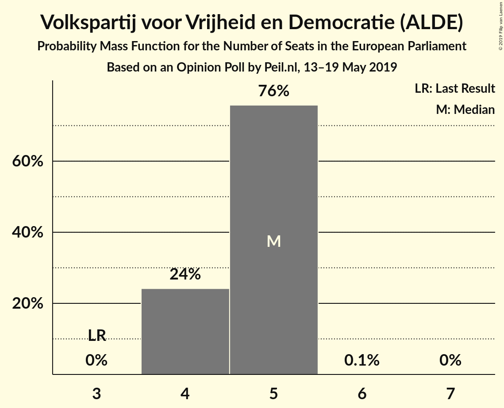

| Number of Seats | Probability | Accumulated | Special Marks |
|:---------------:|:-----------:|:-----------:|:-------------:|
| 3 | 0% | 100% | Last Result |
| 4 | 63% | 100% | Median |
| 5 | 37% | 37% |  |
| 6 | 0% | 0% |  |

### Forum voor Democratie (ECR)

*For a full overview of the results for this party, see the [Forum voor Democratie (ECR)](party-forumvoordemocratieecr.html) page.*

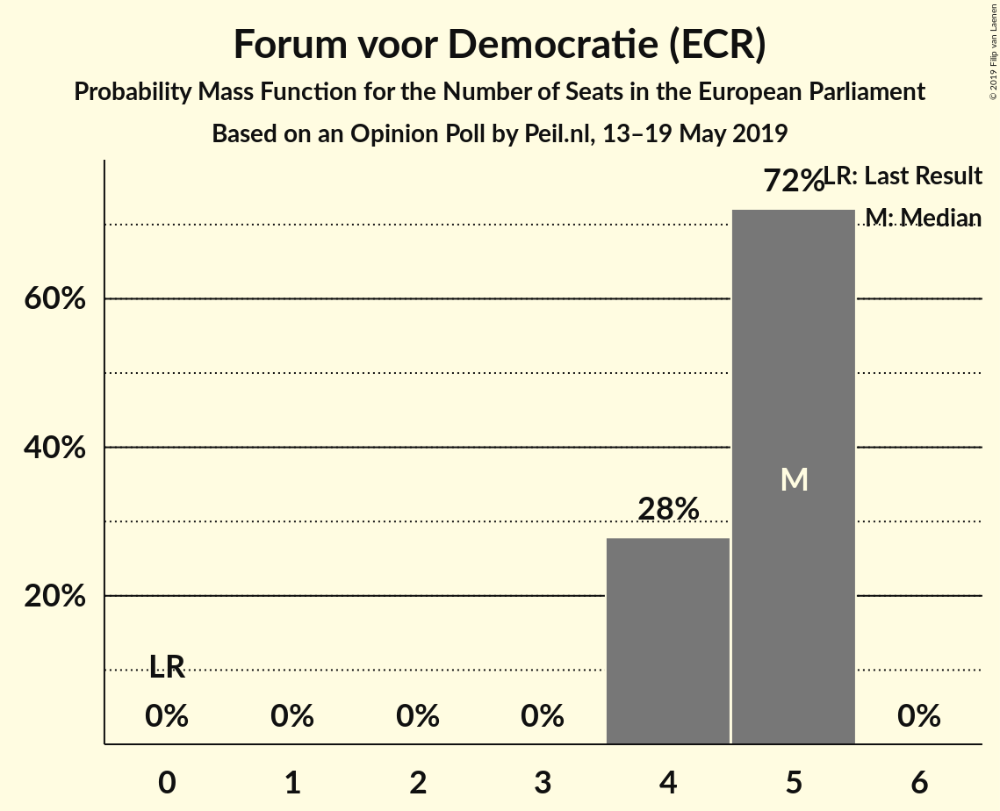

| Number of Seats | Probability | Accumulated | Special Marks |
|:---------------:|:-----------:|:-----------:|:-------------:|
| 0 | 0% | 100% | Last Result |
| 1 | 0% | 100% |  |
| 2 | 0% | 100% |  |
| 3 | 0% | 100% |  |
| 4 | 36% | 100% |  |
| 5 | 64% | 64% | Median |
| 6 | 0% | 0% |  |

### Partij van de Arbeid (S&D)

*For a full overview of the results for this party, see the [Partij van de Arbeid (S&D)](party-partijvandearbeidsd.html) page.*

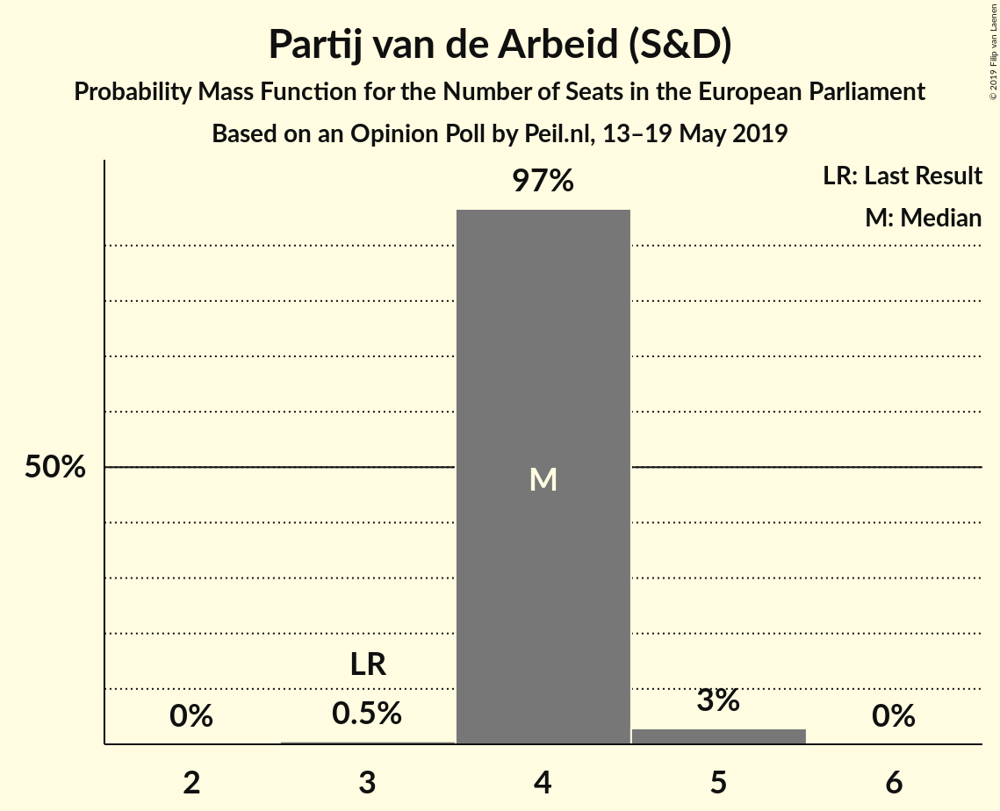

| Number of Seats | Probability | Accumulated | Special Marks |
|:---------------:|:-----------:|:-----------:|:-------------:|
| 3 | 0.1% | 100% | Last Result |
| 4 | 99.9% | 99.9% | Median |
| 5 | 0% | 0% |  |

### Christen-Democratisch Appèl (EPP)

*For a full overview of the results for this party, see the [Christen-Democratisch Appèl (EPP)](party-christen-democratischappèlepp.html) page.*

| Number of Seats | Probability | Accumulated | Special Marks |
|:---------------:|:-----------:|:-----------:|:-------------:|
| 3 | 0.1% | 100% |  |
| 4 | 99.9% | 99.9% | Median |
| 5 | 0% | 0% | Last Result |

### GroenLinks (Greens/EFA)

*For a full overview of the results for this party, see the [GroenLinks (Greens/EFA)](party-groenlinksgreensefa.html) page.*

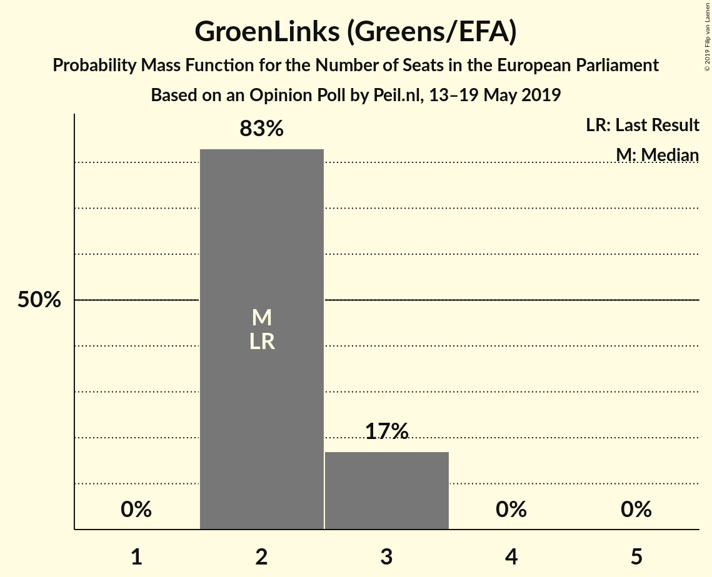

| Number of Seats | Probability | Accumulated | Special Marks |
|:---------------:|:-----------:|:-----------:|:-------------:|
| 2 | 64% | 100% | Last Result, Median |
| 3 | 36% | 36% |  |
| 4 | 0% | 0% |  |

### ChristenUnie–Staatkundig Gereformeerde Partij (ECR)

*For a full overview of the results for this party, see the [ChristenUnie–Staatkundig Gereformeerde Partij (ECR)](party-christenunie–staatkundiggereformeerdepartijecr.html) page.*

| Number of Seats | Probability | Accumulated | Special Marks |
|:---------------:|:-----------:|:-----------:|:-------------:|
| 2 | 99.9% | 100% | Last Result, Median |
| 3 | 0.1% | 0.1% |  |
| 4 | 0% | 0% |  |

### Democraten 66 (ALDE)

*For a full overview of the results for this party, see the [Democraten 66 (ALDE)](party-democraten66alde.html) page.*

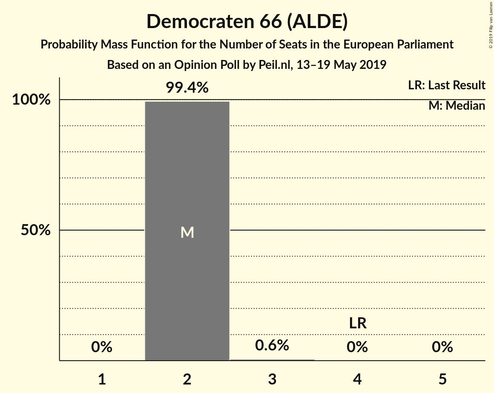

| Number of Seats | Probability | Accumulated | Special Marks |
|:---------------:|:-----------:|:-----------:|:-------------:|
| 2 | 99.9% | 100% | Median |
| 3 | 0.1% | 0.1% |  |
| 4 | 0% | 0% | Last Result |

### Partij voor de Dieren (GUE/NGL)

*For a full overview of the results for this party, see the [Partij voor de Dieren (GUE/NGL)](party-partijvoordedierenguengl.html) page.*

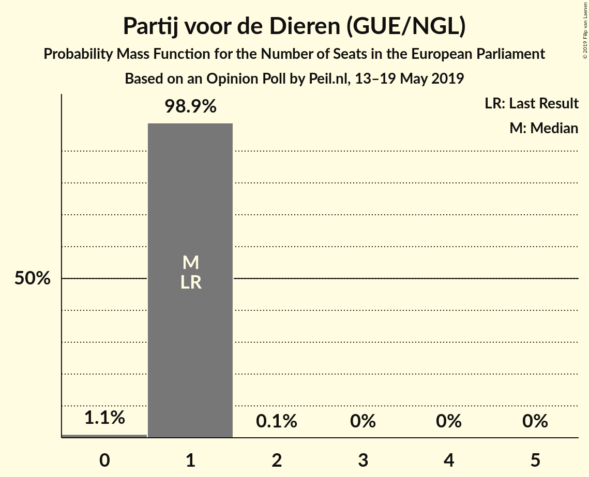

| Number of Seats | Probability | Accumulated | Special Marks |
|:---------------:|:-----------:|:-----------:|:-------------:|
| 1 | 100% | 100% | Last Result, Median |

### Partij voor de Vrijheid (EAPN)

*For a full overview of the results for this party, see the [Partij voor de Vrijheid (EAPN)](party-partijvoordevrijheideapn.html) page.*

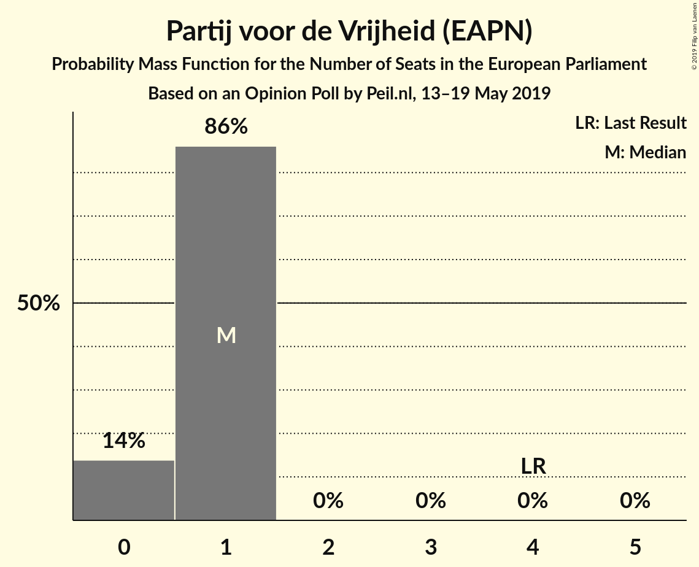

| Number of Seats | Probability | Accumulated | Special Marks |
|:---------------:|:-----------:|:-----------:|:-------------:|
| 0 | 99.6% | 100% | Median |
| 1 | 0.4% | 0.4% |  |
| 2 | 0% | 0% |  |
| 3 | 0% | 0% |  |
| 4 | 0% | 0% | Last Result |

### Socialistische Partij (GUE/NGL)

*For a full overview of the results for this party, see the [Socialistische Partij (GUE/NGL)](party-socialistischepartijguengl.html) page.*

| Number of Seats | Probability | Accumulated | Special Marks |
|:---------------:|:-----------:|:-----------:|:-------------:|
| 0 | 0.1% | 100% |  |
| 1 | 99.9% | 99.9% | Median |
| 2 | 0% | 0% | Last Result |

### 50Plus (*)

*For a full overview of the results for this party, see the [50Plus (*)](party-50plus.html) page.*

| Number of Seats | Probability | Accumulated | Special Marks |
|:---------------:|:-----------:|:-----------:|:-------------:|
| 0 | 37% | 100% | Last Result |
| 1 | 63% | 63% | Median |
| 2 | 0% | 0% |  |

### Denk (*)

*For a full overview of the results for this party, see the [Denk (*)](party-denk.html) page.*

| Number of Seats | Probability | Accumulated | Special Marks |
|:---------------:|:-----------:|:-----------:|:-------------:|
| 0 | 100% | 100% | Last Result, Median |

## Coalitions

### Confidence Intervals

| Coalition | Last Result | Median | Majority? | 80% Confidence Interval | 90% Confidence Interval | 95% Confidence Interval | 99% Confidence Interval |
|:---------:|:-----------:|:------:|:---------:|:-----------------------:|:-----------------------:|:-----------------------:|:-----------------------:|
| Forum voor Democratie (ECR) – ChristenUnie–Staatkundig Gereformeerde Partij (ECR) | 2 | 7 | 0% | 6–7 | 6–7 | 6–7 | 6–7 |
| Volkspartij voor Vrijheid en Democratie (ALDE) – Democraten 66 (ALDE) | 7 | 6 | 0% | 6–7 | 6–7 | 6–7 | 6–7 |
| Christen-Democratisch Appèl (EPP) | 5 | 4 | 0% | 4 | 4 | 4 | 4 |
| Partij van de Arbeid (S&D) | 3 | 4 | 0% | 4 | 4 | 4 | 4 |
| GroenLinks (Greens/EFA) | 2 | 2 | 0% | 2–3 | 2–3 | 2–3 | 2–3 |
| Partij voor de Dieren (GUE/NGL) – Socialistische Partij (GUE/NGL) | 3 | 2 | 0% | 2 | 2 | 2 | 2 |
| Partij voor de Vrijheid (EAPN) | 4 | 0 | 0% | 0 | 0 | 0 | 0 |

### Forum voor Democratie (ECR) – ChristenUnie–Staatkundig Gereformeerde Partij (ECR)

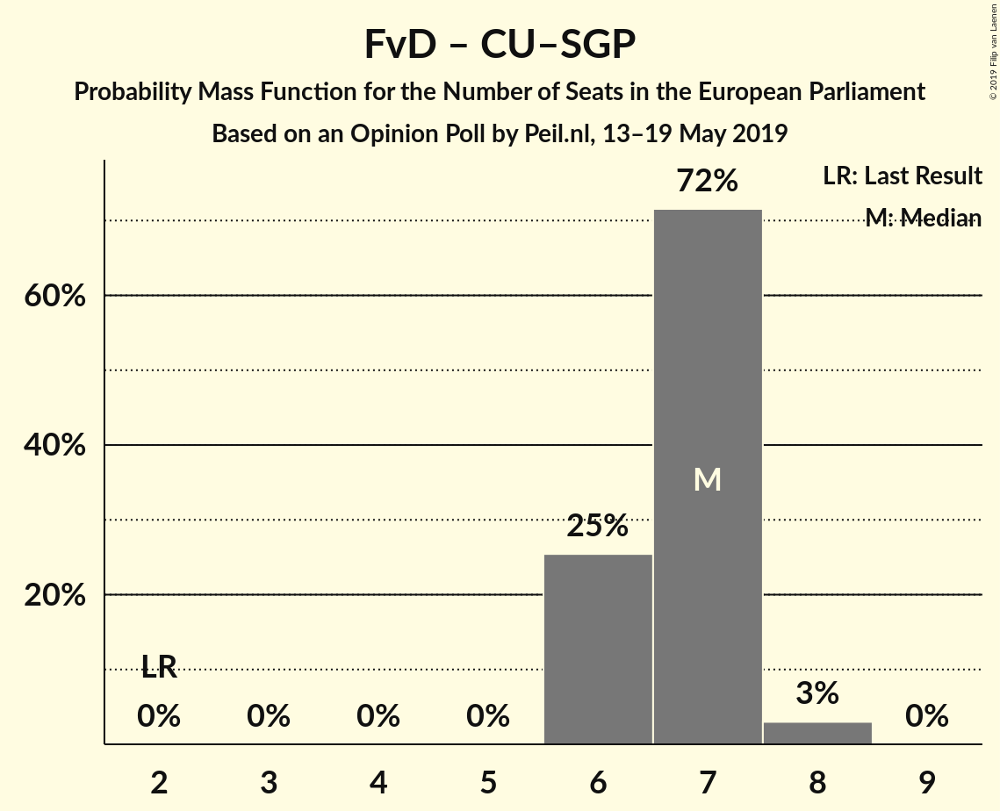

| Number of Seats | Probability | Accumulated | Special Marks |
|:---------------:|:-----------:|:-----------:|:-------------:|
| 2 | 0% | 100% | Last Result |
| 3 | 0% | 100% |  |
| 4 | 0% | 100% |  |
| 5 | 0% | 100% |  |
| 6 | 36% | 100% |  |
| 7 | 64% | 64% | Median |
| 8 | 0.1% | 0.1% |  |
| 9 | 0% | 0% |  |

### Volkspartij voor Vrijheid en Democratie (ALDE) – Democraten 66 (ALDE)

| Number of Seats | Probability | Accumulated | Special Marks |
|:---------------:|:-----------:|:-----------:|:-------------:|
| 6 | 63% | 100% | Median |
| 7 | 37% | 37% | Last Result |
| 8 | 0% | 0% |  |

### Christen-Democratisch Appèl (EPP)

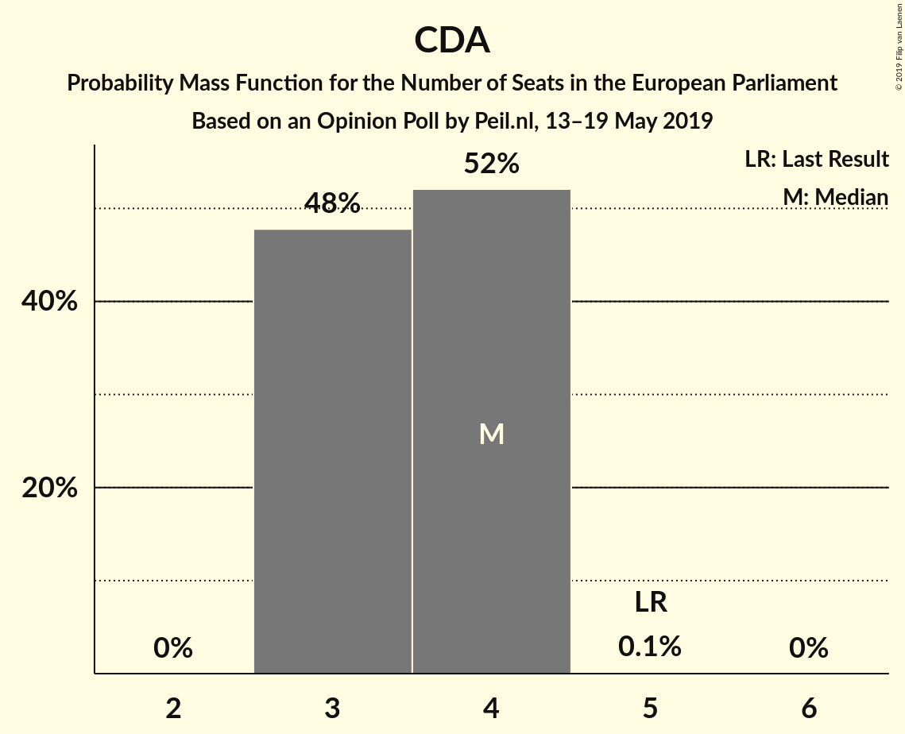

| Number of Seats | Probability | Accumulated | Special Marks |
|:---------------:|:-----------:|:-----------:|:-------------:|
| 3 | 0.1% | 100% |  |
| 4 | 99.9% | 99.9% | Median |
| 5 | 0% | 0% | Last Result |

### Partij van de Arbeid (S&D)

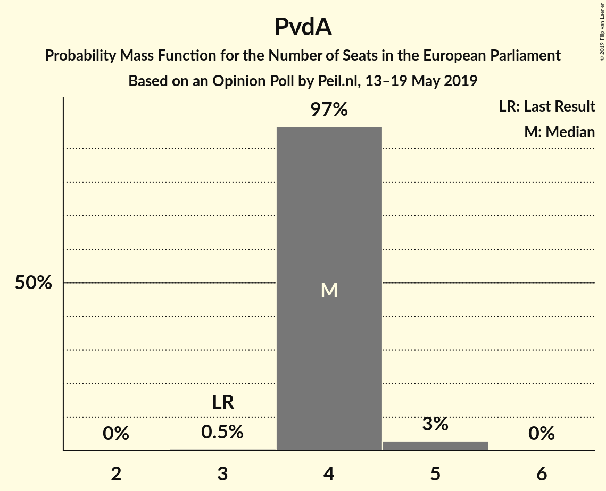

| Number of Seats | Probability | Accumulated | Special Marks |
|:---------------:|:-----------:|:-----------:|:-------------:|
| 3 | 0.1% | 100% | Last Result |
| 4 | 99.9% | 99.9% | Median |
| 5 | 0% | 0% |  |

### GroenLinks (Greens/EFA)

| Number of Seats | Probability | Accumulated | Special Marks |
|:---------------:|:-----------:|:-----------:|:-------------:|
| 2 | 64% | 100% | Last Result, Median |
| 3 | 36% | 36% |  |
| 4 | 0% | 0% |  |

### Partij voor de Dieren (GUE/NGL) – Socialistische Partij (GUE/NGL)

| Number of Seats | Probability | Accumulated | Special Marks |
|:---------------:|:-----------:|:-----------:|:-------------:|
| 1 | 0.1% | 100% |  |
| 2 | 99.9% | 99.9% | Median |
| 3 | 0% | 0% | Last Result |

### Partij voor de Vrijheid (EAPN)

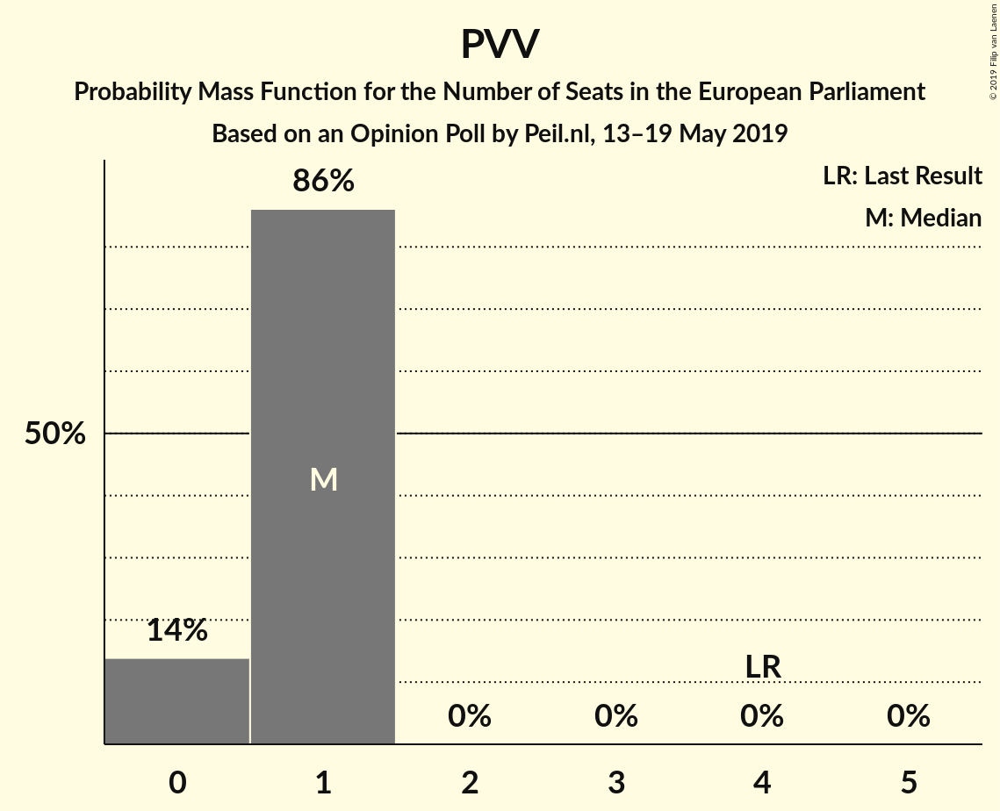

| Number of Seats | Probability | Accumulated | Special Marks |
|:---------------:|:-----------:|:-----------:|:-------------:|
| 0 | 99.6% | 100% | Median |
| 1 | 0.4% | 0.4% |  |
| 2 | 0% | 0% |  |
| 3 | 0% | 0% |  |
| 4 | 0% | 0% | Last Result |

## Technical Information

### Opinion Poll

+ **Polling firm:** Peil.nl
+ **Commissioner(s):** —
+ **Fieldwork period:** 13–19 May 2019

### Calculations

+ **Sample size:** 3000
+ **Simulations done:** 1,024
+ **Error estimate:** 1.59%

