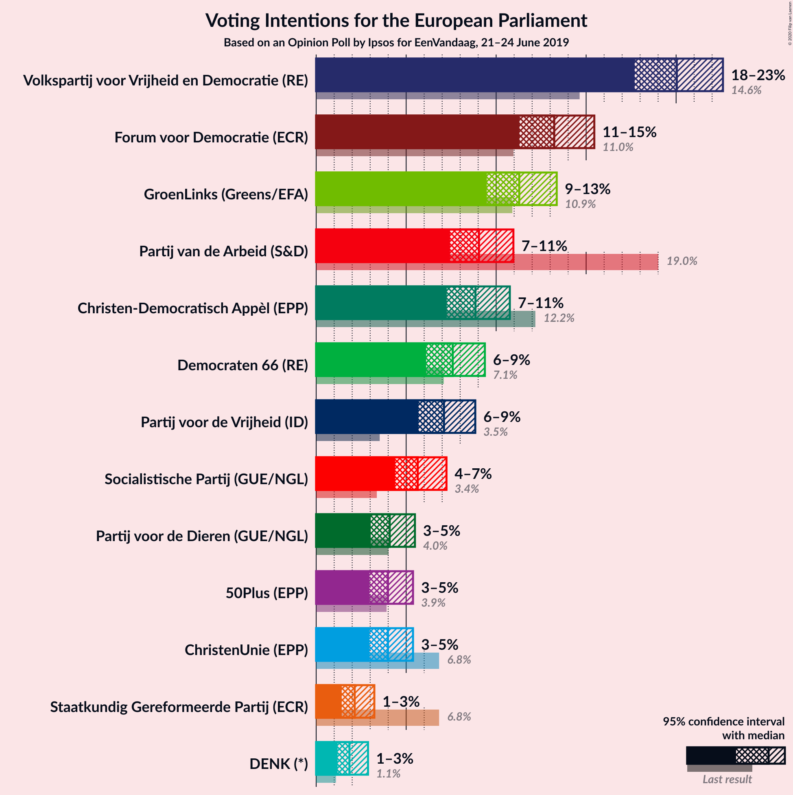
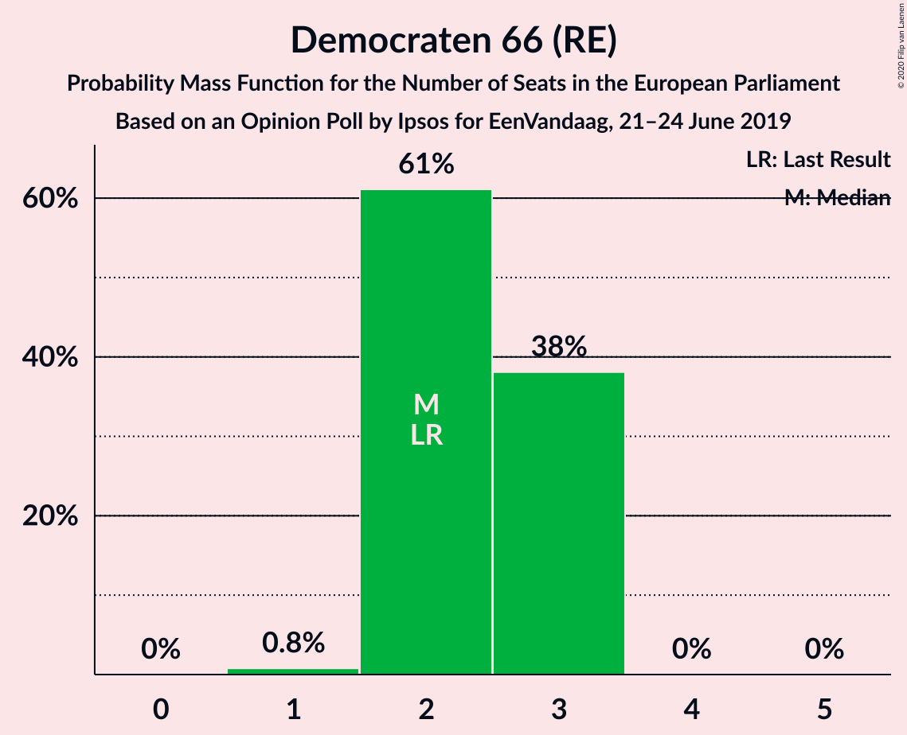
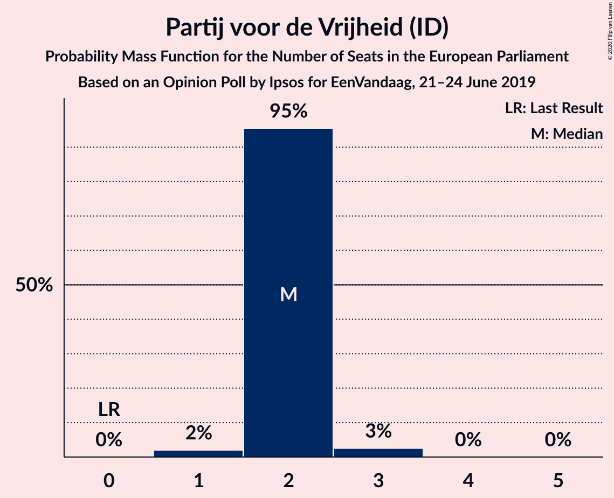
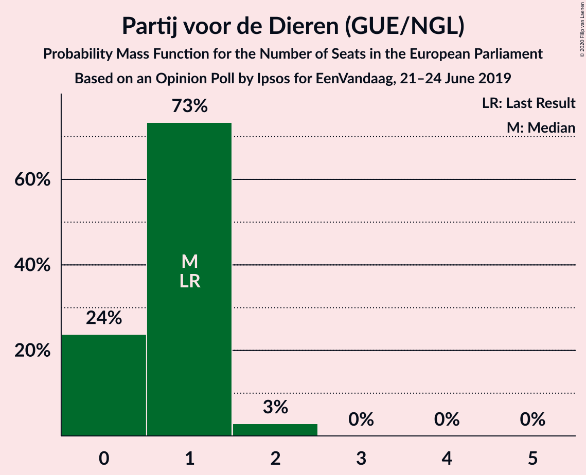
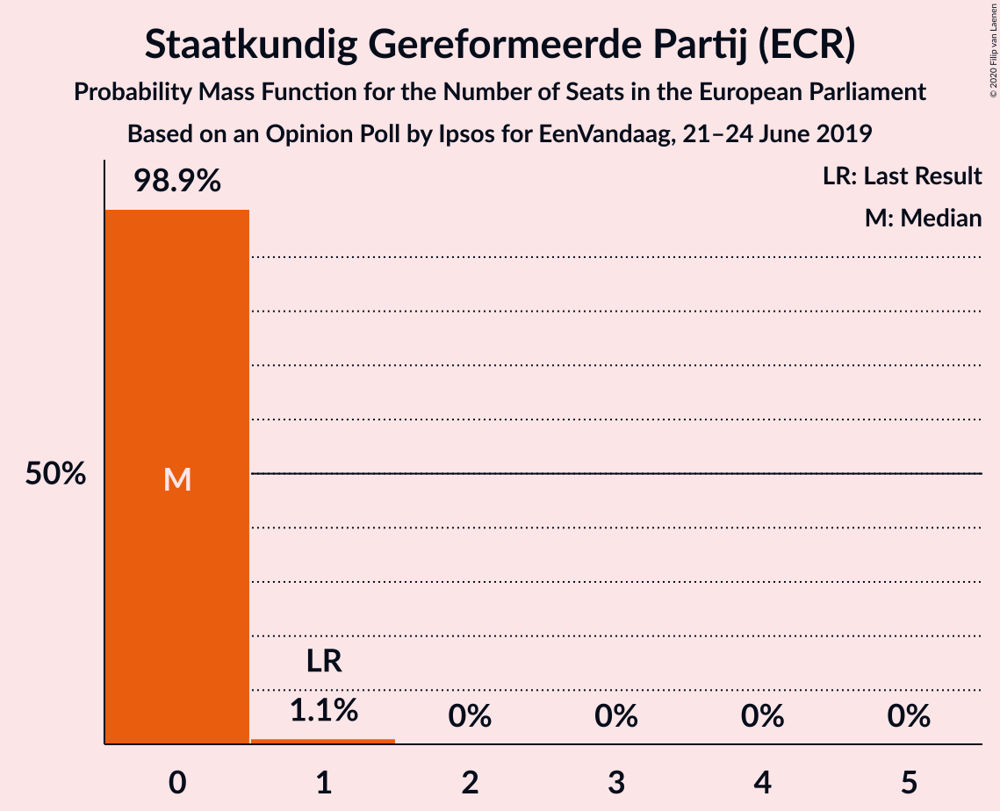
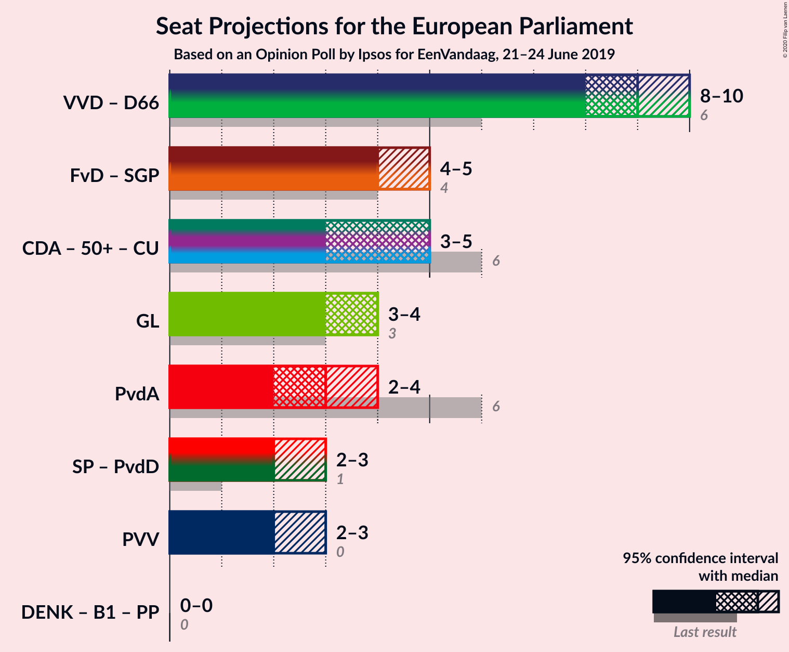
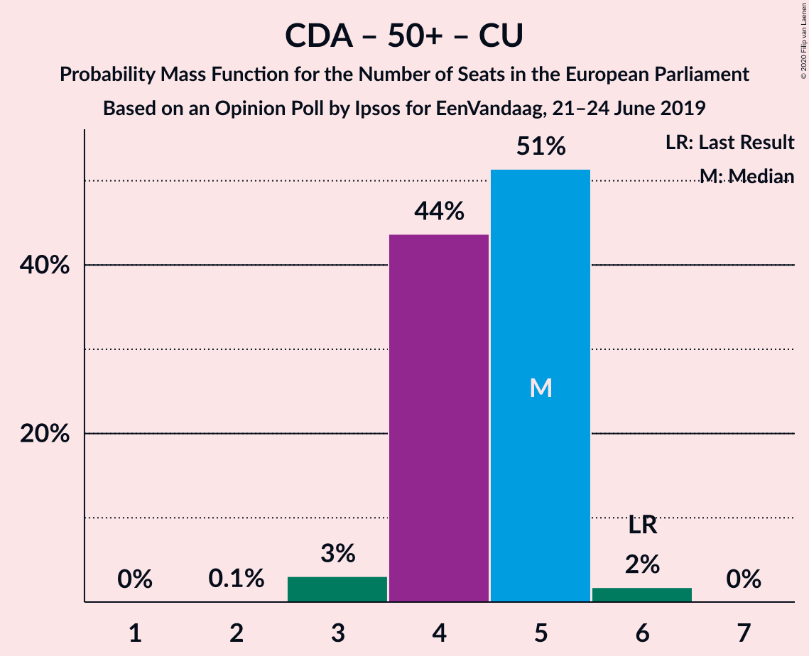
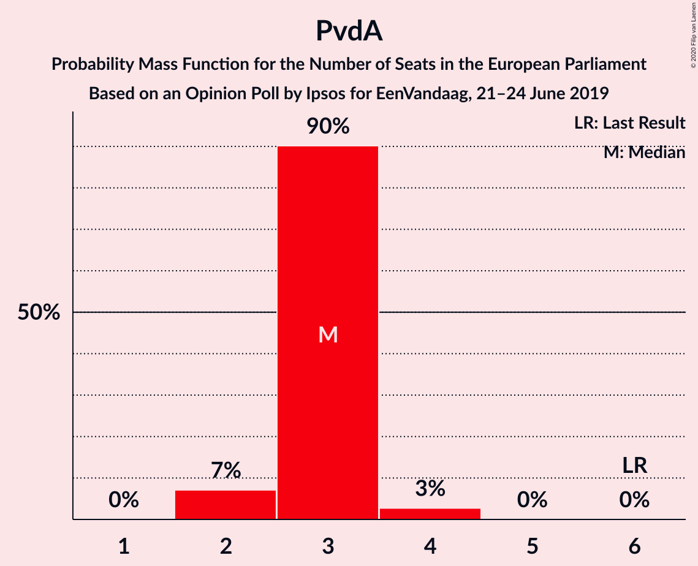

# Opinion Poll by Ipsos for EenVandaag, 21–24 June 2019

<a href="#voting-intentions">Voting Intentions</a> | <a href="#seats">Seats</a> | <a href="#coalitions">Coalitions</a> | <a href="#technical-information">Technical Information</a>

## Voting Intentions

### Confidence Intervals

| Party | Last Result | Poll Result | 80% Confidence Interval | 90% Confidence Interval | 95% Confidence Interval | 99% Confidence Interval |
|:-----:|:-----------:|:-----------:|:-----------------------:|:-----------------------:|:-----------------------:|:-----------------------:|
| Volkspartij voor Vrijheid en Democratie (RE) | 14.6% | 20.0% | 18.5–21.7% |18.1–22.2% |17.7–22.6% |17.0–23.4% |
| Forum voor Democratie (ECR) | 11.0% | 13.2% | 11.9–14.7% |11.6–15.1% |11.3–15.5% |10.7–16.2% |
| GroenLinks (Greens/EFA) | 10.9% | 11.3% | 10.1–12.7% |9.8–13.0% |9.5–13.4% |8.9–14.1% |
| Partij van de Arbeid (S&D) | 19.0% | 9.0% | 8.0–10.3% |7.7–10.7% |7.4–11.0% |7.0–11.6% |
| Christen-Democratisch Appèl (EPP) | 12.2% | 8.9% | 7.8–10.1% |7.5–10.4% |7.3–10.8% |6.8–11.4% |
| Democraten 66 (RE) | 7.1% | 7.6% | 6.6–8.7% |6.3–9.1% |6.1–9.4% |5.7–10.0% |
| Partij voor de Vrijheid (ID) | 3.5% | 7.1% | 6.2–8.2% |5.9–8.6% |5.7–8.8% |5.3–9.4% |
| Socialistische Partij (GUE/NGL) | 3.4% | 5.6% | 4.8–6.7% |4.6–7.0% |4.4–7.2% |4.0–7.8% |
| Partij voor de Dieren (GUE/NGL) | 4.0% | 4.1% | 3.4–5.0% |3.2–5.3% |3.0–5.5% |2.7–5.9% |
| ChristenUnie (EPP) | 6.8% | 4.0% | 3.3–4.9% |3.1–5.2% |3.0–5.4% |2.7–5.8% |
| 50Plus (EPP) | 3.9% | 4.0% | 3.3–4.9% |3.1–5.2% |3.0–5.4% |2.7–5.8% |
| Staatkundig Gereformeerde Partij (ECR) | 6.8% | 2.1% | 1.7–2.9% |1.5–3.0% |1.4–3.2% |1.2–3.6% |
| DENK (*) | 1.1% | 1.8% | 1.4–2.5% |1.3–2.7% |1.2–2.9% |1.0–3.2% |

*Note:* The poll result column reflects the actual value used in the calculations. Published results may vary slightly, and in addition be rounded to fewer digits.

## Seats

### Confidence Intervals

| Party | Last Result | Median | 80% Confidence Interval | 90% Confidence Interval | 95% Confidence Interval | 99% Confidence Interval |
|:-----:|:-----------:|:------:|:-----------------------:|:-----------------------:|:-----------------------:|:-----------------------:|
| <a href="#volkspartij-voor-vrijheid-en-democratie-(re)">Volkspartij voor Vrijheid en Democratie (RE)</a> | 4 | 7 | 6–7 |6–8 |6–8 |6–8 |
| <a href="#forum-voor-democratie-(ecr)">Forum voor Democratie (ECR)</a> | 3 | 4 | 4–5 |4–5 |4–5 |3–6 |
| <a href="#groenlinks-(greens/efa)">GroenLinks (Greens/EFA)</a> | 3 | 4 | 3–4 |3–4 |3–4 |3–4 |
| <a href="#partij-van-de-arbeid-(s&d)">Partij van de Arbeid (S&D)</a> | 6 | 3 | 3 |2–3 |2–4 |2–4 |
| <a href="#christen-democratisch-appèl-(epp)">Christen-Democratisch Appèl (EPP)</a> | 4 | 3 | 2–3 |2–3 |2–4 |2–4 |
| <a href="#democraten-66-(re)">Democraten 66 (RE)</a> | 2 | 2 | 2–3 |2–3 |2–3 |1–3 |
| <a href="#partij-voor-de-vrijheid-(id)">Partij voor de Vrijheid (ID)</a> | 0 | 2 | 2 |2 |2–3 |1–3 |
| <a href="#socialistische-partij-(gue/ngl)">Socialistische Partij (GUE/NGL)</a> | 0 | 2 | 1–2 |1–2 |1–2 |1–2 |
| <a href="#partij-voor-de-dieren-(gue/ngl)">Partij voor de Dieren (GUE/NGL)</a> | 1 | 1 | 0–1 |0–1 |0–2 |0–2 |
| <a href="#christenunie-(epp)">ChristenUnie (EPP)</a> | 1 | 1 | 0–1 |0–1 |0–1 |0–2 |
| <a href="#50plus-(epp)">50Plus (EPP)</a> | 1 | 1 | 0–1 |0–1 |0–1 |0–2 |
| <a href="#staatkundig-gereformeerde-partij-(ecr)">Staatkundig Gereformeerde Partij (ECR)</a> | 1 | 0 | 0 |0 |0 |0–1 |
| <a href="#denk-(*)">DENK (*)</a> | 0 | 0 | 0 |0 |0 |0 |

### Volkspartij voor Vrijheid en Democratie (RE)

*For a full overview of the results for this party, see the [Volkspartij voor Vrijheid en Democratie (RE)](party-volkspartijvoorvrijheidendemocratiere.html) page.*

| Number of Seats | Probability | Accumulated | Special Marks |
|:---------------:|:-----------:|:-----------:|:-------------:|
| 4 | 0% | 100% | Last Result |
| 5 | 0.2% | 100% |  |
| 6 | 34% | 99.8% |  |
| 7 | 59% | 66% | Median |
| 8 | 7% | 7% |  |
| 9 | 0% | 0% |  |

### Forum voor Democratie (ECR)

*For a full overview of the results for this party, see the [Forum voor Democratie (ECR)](party-forumvoordemocratieecr.html) page.*

| Number of Seats | Probability | Accumulated | Special Marks |
|:---------------:|:-----------:|:-----------:|:-------------:|
| 3 | 0.6% | 100% | Last Result |
| 4 | 70% | 99.4% | Median |
| 5 | 29% | 30% |  |
| 6 | 0.6% | 0.6% |  |
| 7 | 0% | 0% |  |

### GroenLinks (Greens/EFA)

*For a full overview of the results for this party, see the [GroenLinks (Greens/EFA)](party-groenlinksgreensefa.html) page.*

| Number of Seats | Probability | Accumulated | Special Marks |
|:---------------:|:-----------:|:-----------:|:-------------:|
| 3 | 28% | 100% | Last Result |
| 4 | 72% | 72% | Median |
| 5 | 0.5% | 0.5% |  |
| 6 | 0% | 0% |  |

### Partij van de Arbeid (S&D)

*For a full overview of the results for this party, see the [Partij van de Arbeid (S&D)](party-partijvandearbeidsd.html) page.*

| Number of Seats | Probability | Accumulated | Special Marks |
|:---------------:|:-----------:|:-----------:|:-------------:|
| 2 | 7% | 100% |  |
| 3 | 90% | 93% | Median |
| 4 | 3% | 3% |  |
| 5 | 0% | 0% |  |
| 6 | 0% | 0% | Last Result |

### Christen-Democratisch Appèl (EPP)

*For a full overview of the results for this party, see the [Christen-Democratisch Appèl (EPP)](party-christen-democratischappèlepp.html) page.*

| Number of Seats | Probability | Accumulated | Special Marks |
|:---------------:|:-----------:|:-----------:|:-------------:|
| 2 | 14% | 100% |  |
| 3 | 83% | 86% | Median |
| 4 | 4% | 4% | Last Result |
| 5 | 0% | 0% |  |

### Democraten 66 (RE)

*For a full overview of the results for this party, see the [Democraten 66 (RE)](party-democraten66re.html) page.*

| Number of Seats | Probability | Accumulated | Special Marks |
|:---------------:|:-----------:|:-----------:|:-------------:|
| 1 | 0.8% | 100% |  |
| 2 | 61% | 99.2% | Last Result, Median |
| 3 | 38% | 38% |  |
| 4 | 0% | 0% |  |

### Partij voor de Vrijheid (ID)

*For a full overview of the results for this party, see the [Partij voor de Vrijheid (ID)](party-partijvoordevrijheidid.html) page.*

| Number of Seats | Probability | Accumulated | Special Marks |
|:---------------:|:-----------:|:-----------:|:-------------:|
| 0 | 0% | 100% | Last Result |
| 1 | 2% | 100% |  |
| 2 | 95% | 98% | Median |
| 3 | 3% | 3% |  |
| 4 | 0% | 0% |  |

### Socialistische Partij (GUE/NGL)

*For a full overview of the results for this party, see the [Socialistische Partij (GUE/NGL)](party-socialistischepartijguengl.html) page.*

| Number of Seats | Probability | Accumulated | Special Marks |
|:---------------:|:-----------:|:-----------:|:-------------:|
| 0 | 0% | 100% | Last Result |
| 1 | 40% | 100% |  |
| 2 | 60% | 60% | Median |
| 3 | 0% | 0% |  |

### Partij voor de Dieren (GUE/NGL)

*For a full overview of the results for this party, see the [Partij voor de Dieren (GUE/NGL)](party-partijvoordedierenguengl.html) page.*

| Number of Seats | Probability | Accumulated | Special Marks |
|:---------------:|:-----------:|:-----------:|:-------------:|
| 0 | 24% | 100% |  |
| 1 | 73% | 76% | Last Result, Median |
| 2 | 3% | 3% |  |
| 3 | 0% | 0% |  |

### ChristenUnie (EPP)

*For a full overview of the results for this party, see the [ChristenUnie (EPP)](party-christenunieepp.html) page.*

| Number of Seats | Probability | Accumulated | Special Marks |
|:---------------:|:-----------:|:-----------:|:-------------:|
| 0 | 21% | 100% |  |
| 1 | 78% | 79% | Last Result, Median |
| 2 | 0.9% | 0.9% |  |
| 3 | 0% | 0% |  |

### 50Plus (EPP)

*For a full overview of the results for this party, see the [50Plus (EPP)](party-50plusepp.html) page.*

| Number of Seats | Probability | Accumulated | Special Marks |
|:---------------:|:-----------:|:-----------:|:-------------:|
| 0 | 20% | 100% |  |
| 1 | 78% | 80% | Last Result, Median |
| 2 | 2% | 2% |  |
| 3 | 0% | 0% |  |

### Staatkundig Gereformeerde Partij (ECR)

*For a full overview of the results for this party, see the [Staatkundig Gereformeerde Partij (ECR)](party-staatkundiggereformeerdepartijecr.html) page.*

| Number of Seats | Probability | Accumulated | Special Marks |
|:---------------:|:-----------:|:-----------:|:-------------:|
| 0 | 98.9% | 100% | Median |
| 1 | 1.1% | 1.1% | Last Result |
| 2 | 0% | 0% |  |

### DENK (*)

*For a full overview of the results for this party, see the [DENK (*)](party-denk.html) page.*

| Number of Seats | Probability | Accumulated | Special Marks |
|:---------------:|:-----------:|:-----------:|:-------------:|
| 0 | 99.7% | 100% | Last Result, Median |
| 1 | 0.3% | 0.3% |  |
| 2 | 0% | 0% |  |

## Coalitions

### Confidence Intervals

| Coalition | Last Result | Median | Majority? | 80% Confidence Interval | 90% Confidence Interval | 95% Confidence Interval | 99% Confidence Interval |
|:---------:|:-----------:|:------:|:---------:|:-----------------------:|:-----------------------:|:-----------------------:|:-----------------------:|
| Volkspartij voor Vrijheid en Democratie (RE) – Democraten 66 (RE) | 6 | 9 | 0% | 8–10 | 8–10 | 8–10 | 8–11 |
| Forum voor Democratie (ECR) – Staatkundig Gereformeerde Partij (ECR) | 4 | 4 | 0% | 4–5 | 4–5 | 4–5 | 3–6 |
| Christen-Democratisch Appèl (EPP) – 50Plus (EPP) – ChristenUnie (EPP) | 6 | 5 | 0% | 4–5 | 4–5 | 3–5 | 3–6 |
| GroenLinks (Greens/EFA) | 3 | 4 | 0% | 3–4 | 3–4 | 3–4 | 3–4 |
| Partij van de Arbeid (S&D) | 6 | 3 | 0% | 3 | 2–3 | 2–4 | 2–4 |
| Socialistische Partij (GUE/NGL) – Partij voor de Dieren (GUE/NGL) | 1 | 2 | 0% | 2–3 | 2–3 | 2–3 | 1–4 |
| Partij voor de Vrijheid (ID) | 0 | 2 | 0% | 2 | 2 | 2–3 | 1–3 |

### Volkspartij voor Vrijheid en Democratie (RE) – Democraten 66 (RE)

| Number of Seats | Probability | Accumulated | Special Marks |
|:---------------:|:-----------:|:-----------:|:-------------:|
| 6 | 0% | 100% | Last Result |
| 7 | 0.2% | 100% |  |
| 8 | 25% | 99.8% |  |
| 9 | 40% | 75% | Median |
| 10 | 34% | 34% |  |
| 11 | 0.6% | 0.6% |  |
| 12 | 0% | 0% |  |

### Forum voor Democratie (ECR) – Staatkundig Gereformeerde Partij (ECR)

| Number of Seats | Probability | Accumulated | Special Marks |
|:---------------:|:-----------:|:-----------:|:-------------:|
| 3 | 0.6% | 100% |  |
| 4 | 69% | 99.4% | Last Result, Median |
| 5 | 30% | 30% |  |
| 6 | 0.9% | 0.9% |  |
| 7 | 0% | 0% |  |

### Christen-Democratisch Appèl (EPP) – 50Plus (EPP) – ChristenUnie (EPP)

| Number of Seats | Probability | Accumulated | Special Marks |
|:---------------:|:-----------:|:-----------:|:-------------:|
| 2 | 0.1% | 100% |  |
| 3 | 3% | 99.9% |  |
| 4 | 44% | 97% |  |
| 5 | 51% | 53% | Median |
| 6 | 2% | 2% | Last Result |
| 7 | 0% | 0% |  |

### GroenLinks (Greens/EFA)

| Number of Seats | Probability | Accumulated | Special Marks |
|:---------------:|:-----------:|:-----------:|:-------------:|
| 3 | 28% | 100% | Last Result |
| 4 | 72% | 72% | Median |
| 5 | 0.5% | 0.5% |  |
| 6 | 0% | 0% |  |

### Partij van de Arbeid (S&D)

| Number of Seats | Probability | Accumulated | Special Marks |
|:---------------:|:-----------:|:-----------:|:-------------:|
| 2 | 7% | 100% |  |
| 3 | 90% | 93% | Median |
| 4 | 3% | 3% |  |
| 5 | 0% | 0% |  |
| 6 | 0% | 0% | Last Result |

### Socialistische Partij (GUE/NGL) – Partij voor de Dieren (GUE/NGL)

| Number of Seats | Probability | Accumulated | Special Marks |
|:---------------:|:-----------:|:-----------:|:-------------:|
| 1 | 2% | 100% | Last Result |
| 2 | 60% | 98% |  |
| 3 | 36% | 38% | Median |
| 4 | 2% | 2% |  |
| 5 | 0% | 0% |  |

### Partij voor de Vrijheid (ID)

| Number of Seats | Probability | Accumulated | Special Marks |
|:---------------:|:-----------:|:-----------:|:-------------:|
| 0 | 0% | 100% | Last Result |
| 1 | 2% | 100% |  |
| 2 | 95% | 98% | Median |
| 3 | 3% | 3% |  |
| 4 | 0% | 0% |  |

## Technical Information

### Opinion Poll

+ **Polling firm:** Ipsos
+ **Commissioner(s):** EenVandaag
+ **Fieldwork period:** 21–24 June 2019

### Calculations

+ **Sample size:** 1028
+ **Simulations done:** 1,048,576
+ **Error estimate:** 2.83%

