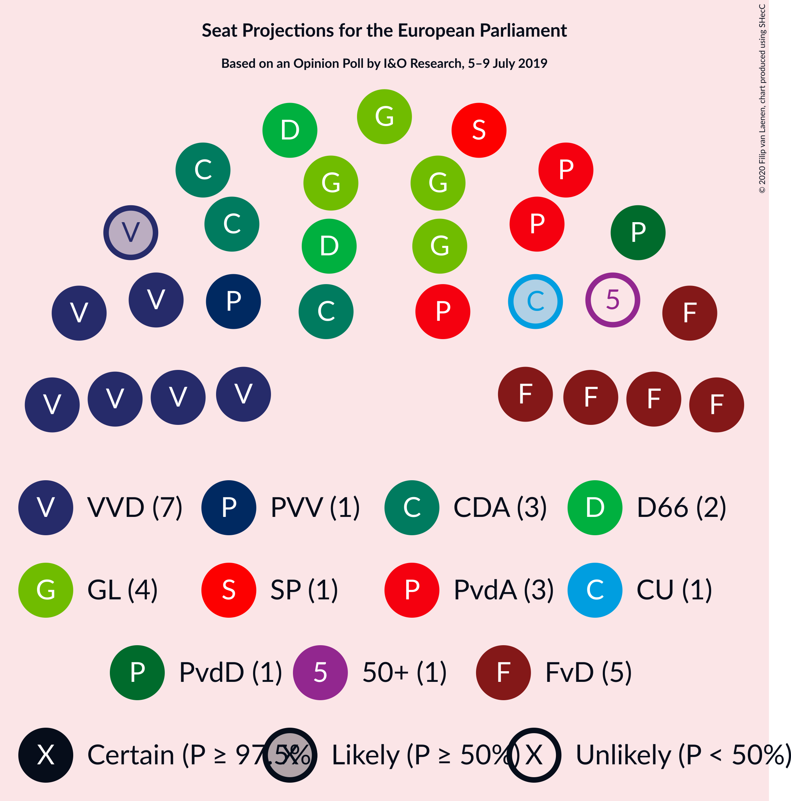
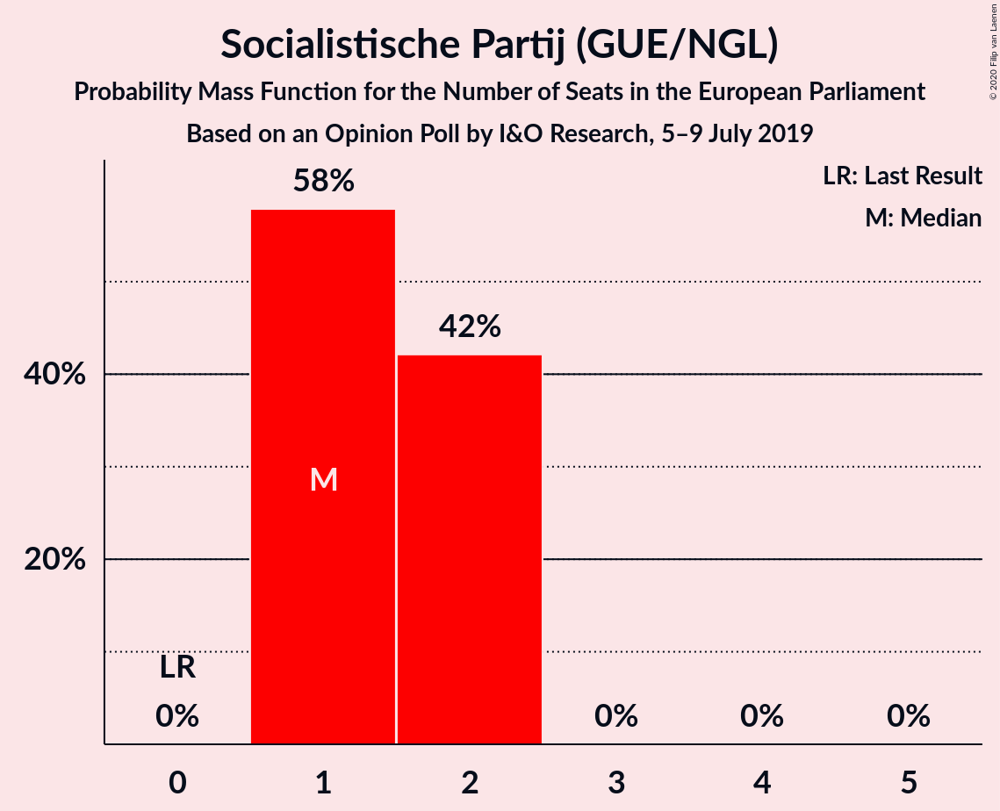
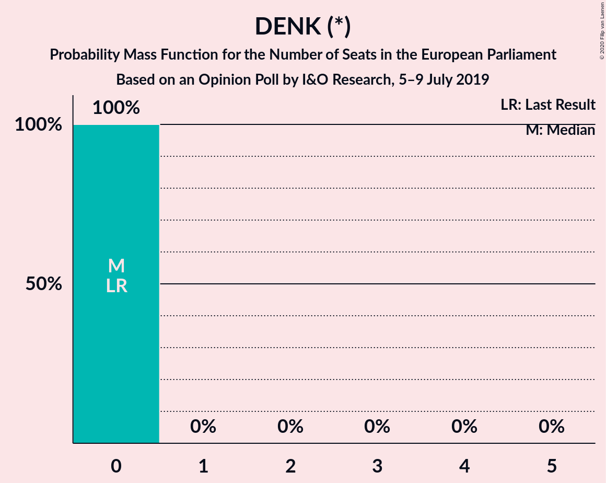
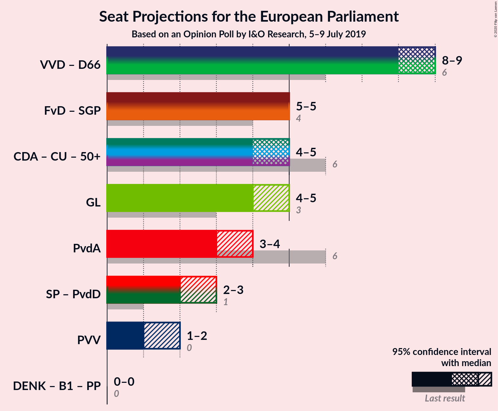
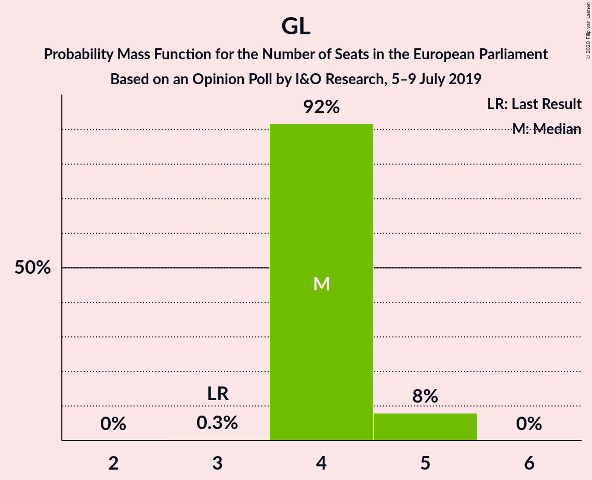

# Opinion Poll by I&O Research, 5–9 July 2019

<a href="#voting-intentions">Voting Intentions</a> | <a href="#seats">Seats</a> | <a href="#coalitions">Coalitions</a> | <a href="#technical-information">Technical Information</a>

## Voting Intentions

### Confidence Intervals

| Party | Last Result | Poll Result | 80% Confidence Interval | 90% Confidence Interval | 95% Confidence Interval | 99% Confidence Interval |
|:-----:|:-----------:|:-----------:|:-----------------------:|:-----------------------:|:-----------------------:|:-----------------------:|
| Volkspartij voor Vrijheid en Democratie (RE) | 12.0% | 19.3% | 18.3–20.4% |18.0–20.7% |17.7–21.0% |17.2–21.5% |
| Forum voor Democratie (ECR) | 0.0% | 15.3% | 14.4–16.3% |14.1–16.6% |13.9–16.9% |13.4–17.3% |
| GroenLinks (Greens/EFA) | 7.0% | 12.6% | 11.8–13.6% |11.5–13.8% |11.3–14.1% |10.9–14.5% |
| Christen-Democratisch Appèl (EPP) | 15.2% | 10.0% | 9.2–10.9% |9.0–11.1% |8.8–11.3% |8.5–11.7% |
| Partij van de Arbeid (S&D) | 9.4% | 10.0% | 9.2–10.9% |9.0–11.1% |8.8–11.3% |8.5–11.7% |
| Democraten 66 (RE) | 15.5% | 6.7% | 6.0–7.4% |5.9–7.6% |5.7–7.8% |5.4–8.1% |
| Partij voor de Vrijheid (ID) | 13.3% | 6.0% | 5.4–6.7% |5.2–6.9% |5.1–7.1% |4.8–7.4% |
| Socialistische Partij (GUE/NGL) | 9.6% | 5.3% | 4.7–6.0% |4.6–6.1% |4.5–6.3% |4.2–6.6% |
| ChristenUnie (EPP) | 7.7% | 4.0% | 3.5–4.6% |3.4–4.7% |3.3–4.9% |3.0–5.2% |
| Partij voor de Dieren (GUE/NGL) | 4.2% | 4.0% | 3.5–4.6% |3.4–4.7% |3.3–4.9% |3.0–5.2% |
| 50Plus (EPP) | 3.7% | 3.3% | 2.9–3.9% |2.8–4.0% |2.7–4.2% |2.5–4.4% |
| Staatkundig Gereformeerde Partij (ECR) | 7.7% | 2.0% | 1.7–2.5% |1.6–2.6% |1.5–2.7% |1.4–2.9% |
| Denk (*) | 0.0% | 1.3% | 1.1–1.7% |1.0–1.8% |0.9–1.9% |0.8–2.1% |

*Note:* The poll result column reflects the actual value used in the calculations. Published results may vary slightly, and in addition be rounded to fewer digits.

## Seats

### Confidence Intervals

| Party | Last Result | Median | 80% Confidence Interval | 90% Confidence Interval | 95% Confidence Interval | 99% Confidence Interval |
|:-----:|:-----------:|:------:|:-----------------------:|:-----------------------:|:-----------------------:|:-----------------------:|
| <a href="#volkspartij-voor-vrijheid-en-democratie-(re)">Volkspartij voor Vrijheid en Democratie (RE)</a> | 3 | 6 | 6 |6–7 |5–7 |5–7 |
| <a href="#forum-voor-democratie-(ecr)">Forum voor Democratie (ECR)</a> | 0 | 5 | 4–5 |4–5 |4–5 |4–5 |
| <a href="#groenlinks-(greens/efa)">GroenLinks (Greens/EFA)</a> | 2 | 4 | 3–4 |3–4 |3–4 |3–4 |
| <a href="#christen-democratisch-appèl-(epp)">Christen-Democratisch Appèl (EPP)</a> | 5 | 3 | 3 |3 |3 |2–3 |
| <a href="#partij-van-de-arbeid-(s&d)">Partij van de Arbeid (S&D)</a> | 3 | 3 | 3 |3 |2–3 |2–4 |
| <a href="#democraten-66-(re)">Democraten 66 (RE)</a> | 4 | 2 | 1–2 |1–2 |1–2 |1–2 |
| <a href="#partij-voor-de-vrijheid-(id)">Partij voor de Vrijheid (ID)</a> | 4 | 1 | 1–2 |1–2 |1–2 |1–2 |
| <a href="#socialistische-partij-(gue/ngl)">Socialistische Partij (GUE/NGL)</a> | 2 | 1 | 1–2 |1–2 |1–2 |1–2 |
| <a href="#christenunie-(epp)">ChristenUnie (EPP)</a> | 1 | 1 | 0–1 |0–1 |0–1 |0–1 |
| <a href="#partij-voor-de-dieren-(gue/ngl)">Partij voor de Dieren (GUE/NGL)</a> | 1 | 1 | 0–1 |0–1 |0–1 |0–1 |
| <a href="#50plus-(epp)">50Plus (EPP)</a> | 0 | 0 | 0 |0 |0–1 |0–1 |
| <a href="#staatkundig-gereformeerde-partij-(ecr)">Staatkundig Gereformeerde Partij (ECR)</a> | 1 | 0 | 0 |0 |0 |0 |
| <a href="#denk-(*)">Denk (*)</a> | 0 | 0 | 0 |0 |0 |0 |

### Volkspartij voor Vrijheid en Democratie (RE)

*For a full overview of the results for this party, see the [Volkspartij voor Vrijheid en Democratie (RE)](party-volkspartijvoorvrijheidendemocratiere.html) page.*

| Number of Seats | Probability | Accumulated | Special Marks |
|:---------------:|:-----------:|:-----------:|:-------------:|
| 3 | 0% | 100% | Last Result |
| 4 | 0% | 100% |  |
| 5 | 4% | 100% |  |
| 6 | 91% | 96% | Median |
| 7 | 5% | 5% |  |
| 8 | 0% | 0% |  |

### Forum voor Democratie (ECR)

*For a full overview of the results for this party, see the [Forum voor Democratie (ECR)](party-forumvoordemocratieecr.html) page.*

| Number of Seats | Probability | Accumulated | Special Marks |
|:---------------:|:-----------:|:-----------:|:-------------:|
| 0 | 0% | 100% | Last Result |
| 1 | 0% | 100% |  |
| 2 | 0% | 100% |  |
| 3 | 0% | 100% |  |
| 4 | 19% | 100% |  |
| 5 | 81% | 81% | Median |
| 6 | 0% | 0% |  |

### GroenLinks (Greens/EFA)

*For a full overview of the results for this party, see the [GroenLinks (Greens/EFA)](party-groenlinksgreensefa.html) page.*

| Number of Seats | Probability | Accumulated | Special Marks |
|:---------------:|:-----------:|:-----------:|:-------------:|
| 2 | 0% | 100% | Last Result |
| 3 | 11% | 100% |  |
| 4 | 89% | 89% | Median |
| 5 | 0% | 0% |  |

### Christen-Democratisch Appèl (EPP)

*For a full overview of the results for this party, see the [Christen-Democratisch Appèl (EPP)](party-christen-democratischappèlepp.html) page.*

| Number of Seats | Probability | Accumulated | Special Marks |
|:---------------:|:-----------:|:-----------:|:-------------:|
| 2 | 1.4% | 100% |  |
| 3 | 98% | 98.6% | Median |
| 4 | 0.2% | 0.2% |  |
| 5 | 0% | 0% | Last Result |

### Partij van de Arbeid (S&D)

*For a full overview of the results for this party, see the [Partij van de Arbeid (S&D)](party-partijvandearbeidsd.html) page.*

| Number of Seats | Probability | Accumulated | Special Marks |
|:---------------:|:-----------:|:-----------:|:-------------:|
| 2 | 4% | 100% |  |
| 3 | 95% | 96% | Last Result, Median |
| 4 | 0.7% | 0.7% |  |
| 5 | 0% | 0% |  |

### Democraten 66 (RE)

*For a full overview of the results for this party, see the [Democraten 66 (RE)](party-democraten66re.html) page.*

| Number of Seats | Probability | Accumulated | Special Marks |
|:---------------:|:-----------:|:-----------:|:-------------:|
| 1 | 39% | 100% |  |
| 2 | 61% | 61% | Median |
| 3 | 0% | 0% |  |
| 4 | 0% | 0% | Last Result |

### Partij voor de Vrijheid (ID)

*For a full overview of the results for this party, see the [Partij voor de Vrijheid (ID)](party-partijvoordevrijheidid.html) page.*

| Number of Seats | Probability | Accumulated | Special Marks |
|:---------------:|:-----------:|:-----------:|:-------------:|
| 1 | 84% | 100% | Median |
| 2 | 16% | 16% |  |
| 3 | 0% | 0% |  |
| 4 | 0% | 0% | Last Result |

### Socialistische Partij (GUE/NGL)

*For a full overview of the results for this party, see the [Socialistische Partij (GUE/NGL)](party-socialistischepartijguengl.html) page.*

| Number of Seats | Probability | Accumulated | Special Marks |
|:---------------:|:-----------:|:-----------:|:-------------:|
| 1 | 62% | 100% | Median |
| 2 | 38% | 38% | Last Result |
| 3 | 0% | 0% |  |

### ChristenUnie (EPP)

*For a full overview of the results for this party, see the [ChristenUnie (EPP)](party-christenunieepp.html) page.*

| Number of Seats | Probability | Accumulated | Special Marks |
|:---------------:|:-----------:|:-----------:|:-------------:|
| 0 | 44% | 100% |  |
| 1 | 56% | 56% | Last Result, Median |
| 2 | 0% | 0% |  |

### Partij voor de Dieren (GUE/NGL)

*For a full overview of the results for this party, see the [Partij voor de Dieren (GUE/NGL)](party-partijvoordedierenguengl.html) page.*

| Number of Seats | Probability | Accumulated | Special Marks |
|:---------------:|:-----------:|:-----------:|:-------------:|
| 0 | 41% | 100% |  |
| 1 | 59% | 59% | Last Result, Median |
| 2 | 0% | 0% |  |

### 50Plus (EPP)

*For a full overview of the results for this party, see the [50Plus (EPP)](party-50plusepp.html) page.*

| Number of Seats | Probability | Accumulated | Special Marks |
|:---------------:|:-----------:|:-----------:|:-------------:|
| 0 | 97% | 100% | Last Result, Median |
| 1 | 3% | 3% |  |
| 2 | 0% | 0% |  |

### Staatkundig Gereformeerde Partij (ECR)

*For a full overview of the results for this party, see the [Staatkundig Gereformeerde Partij (ECR)](party-staatkundiggereformeerdepartijecr.html) page.*

| Number of Seats | Probability | Accumulated | Special Marks |
|:---------------:|:-----------:|:-----------:|:-------------:|
| 0 | 100% | 100% | Median |
| 1 | 0% | 0% | Last Result |

### Denk (*)

*For a full overview of the results for this party, see the [Denk (*)](party-denk.html) page.*

| Number of Seats | Probability | Accumulated | Special Marks |
|:---------------:|:-----------:|:-----------:|:-------------:|
| 0 | 100% | 100% | Last Result, Median |

## Coalitions

### Confidence Intervals

| Coalition | Last Result | Median | Majority? | 80% Confidence Interval | 90% Confidence Interval | 95% Confidence Interval | 99% Confidence Interval |
|:---------:|:-----------:|:------:|:---------:|:-----------------------:|:-----------------------:|:-----------------------:|:-----------------------:|
| Volkspartij voor Vrijheid en Democratie (RE) – Democraten 66 (RE) | 7 | 8 | 0% | 7–8 | 7–9 | 7–9 | 7–9 |
| Forum voor Democratie (ECR) – Staatkundig Gereformeerde Partij (ECR) | 1 | 5 | 0% | 4–5 | 4–5 | 4–5 | 4–5 |
| Christen-Democratisch Appèl (EPP) – ChristenUnie (EPP) – 50Plus (EPP) | 6 | 4 | 0% | 3–4 | 3–4 | 3–4 | 3–5 |
| GroenLinks (Greens/EFA) | 2 | 4 | 0% | 3–4 | 3–4 | 3–4 | 3–4 |
| Partij van de Arbeid (S&D) | 3 | 3 | 0% | 3 | 3 | 2–3 | 2–4 |
| Socialistische Partij (GUE/NGL) – Partij voor de Dieren (GUE/NGL) | 3 | 2 | 0% | 1–3 | 1–3 | 1–3 | 1–3 |
| Partij voor de Vrijheid (ID) | 4 | 1 | 0% | 1–2 | 1–2 | 1–2 | 1–2 |

### Volkspartij voor Vrijheid en Democratie (RE) – Democraten 66 (RE)

| Number of Seats | Probability | Accumulated | Special Marks |
|:---------------:|:-----------:|:-----------:|:-------------:|
| 7 | 43% | 100% | Last Result |
| 8 | 52% | 57% | Median |
| 9 | 5% | 5% |  |
| 10 | 0% | 0% |  |

### Forum voor Democratie (ECR) – Staatkundig Gereformeerde Partij (ECR)

| Number of Seats | Probability | Accumulated | Special Marks |
|:---------------:|:-----------:|:-----------:|:-------------:|
| 1 | 0% | 100% | Last Result |
| 2 | 0% | 100% |  |
| 3 | 0% | 100% |  |
| 4 | 19% | 100% |  |
| 5 | 81% | 81% | Median |
| 6 | 0% | 0% |  |

### Christen-Democratisch Appèl (EPP) – ChristenUnie (EPP) – 50Plus (EPP)

| Number of Seats | Probability | Accumulated | Special Marks |
|:---------------:|:-----------:|:-----------:|:-------------:|
| 2 | 0.2% | 100% |  |
| 3 | 44% | 99.8% |  |
| 4 | 54% | 56% | Median |
| 5 | 2% | 2% |  |
| 6 | 0% | 0% | Last Result |

### GroenLinks (Greens/EFA)

| Number of Seats | Probability | Accumulated | Special Marks |
|:---------------:|:-----------:|:-----------:|:-------------:|
| 2 | 0% | 100% | Last Result |
| 3 | 11% | 100% |  |
| 4 | 89% | 89% | Median |
| 5 | 0% | 0% |  |

### Partij van de Arbeid (S&D)

| Number of Seats | Probability | Accumulated | Special Marks |
|:---------------:|:-----------:|:-----------:|:-------------:|
| 2 | 4% | 100% |  |
| 3 | 95% | 96% | Last Result, Median |
| 4 | 0.7% | 0.7% |  |
| 5 | 0% | 0% |  |

### Socialistische Partij (GUE/NGL) – Partij voor de Dieren (GUE/NGL)

| Number of Seats | Probability | Accumulated | Special Marks |
|:---------------:|:-----------:|:-----------:|:-------------:|
| 1 | 41% | 100% |  |
| 2 | 21% | 59% | Median |
| 3 | 38% | 38% | Last Result |
| 4 | 0% | 0% |  |

### Partij voor de Vrijheid (ID)

| Number of Seats | Probability | Accumulated | Special Marks |
|:---------------:|:-----------:|:-----------:|:-------------:|
| 1 | 84% | 100% | Median |
| 2 | 16% | 16% |  |
| 3 | 0% | 0% |  |
| 4 | 0% | 0% | Last Result |

## Technical Information

### Opinion Poll

+ **Polling firm:** I&O Research
+ **Commissioner(s):** —
+ **Fieldwork period:** 5–9 July 2019

### Calculations

+ **Sample size:** 2280
+ **Simulations done:** 1,048,576
+ **Error estimate:** 1.80%

