# Opinion Poll by Peil.nl, 29 July–4 August 2019

<a href="#voting-intentions">Voting Intentions</a> | <a href="#seats">Seats</a> | <a href="#coalitions">Coalitions</a> | <a href="#technical-information">Technical Information</a>

## Voting Intentions

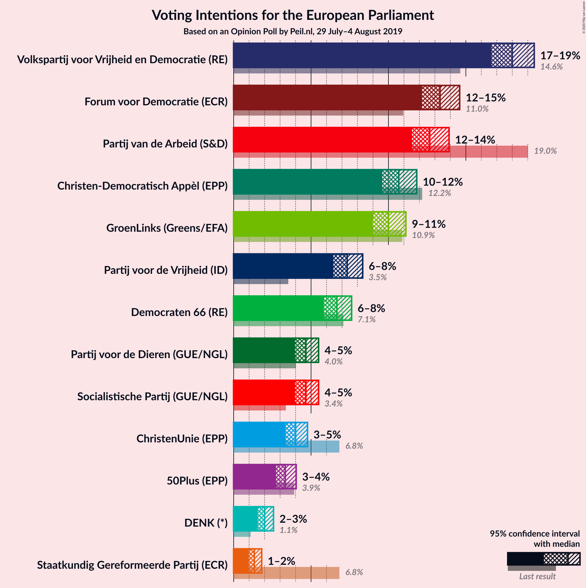

### Confidence Intervals

| Party | Last Result | Poll Result | 80% Confidence Interval | 90% Confidence Interval | 95% Confidence Interval | 99% Confidence Interval |
|:-----:|:-----------:|:-----------:|:-----------------------:|:-----------------------:|:-----------------------:|:-----------------------:|
| Volkspartij voor Vrijheid en Democratie (RE) | 14.6% | 18.0% | 17.1–18.9% |16.9–19.2% |16.7–19.4% |16.2–19.9% |
| Forum voor Democratie (ECR) | 11.0% | 13.3% | 12.6–14.2% |12.3–14.4% |12.2–14.6% |11.8–15.0% |
| Partij van de Arbeid (S&D) | 19.0% | 12.7% | 11.9–13.5% |11.7–13.7% |11.5–13.9% |11.2–14.3% |
| Christen-Democratisch Appèl (EPP) | 12.2% | 10.7% | 10.0–11.4% |9.8–11.6% |9.6–11.8% |9.3–12.2% |
| GroenLinks (Greens/EFA) | 10.9% | 10.0% | 9.3–10.7% |9.1–10.9% |9.0–11.1% |8.7–11.5% |
| Partij voor de Vrijheid (ID) | 3.5% | 7.3% | 6.8–8.0% |6.6–8.2% |6.4–8.3% |6.2–8.6% |
| Democraten 66 (RE) | 7.1% | 6.7% | 6.1–7.3% |6.0–7.5% |5.8–7.6% |5.6–7.9% |
| Socialistische Partij (GUE/NGL) | 3.4% | 4.7% | 4.2–5.2% |4.1–5.3% |4.0–5.5% |3.7–5.8% |
| Partij voor de Dieren (GUE/NGL) | 4.0% | 4.7% | 4.2–5.2% |4.1–5.3% |4.0–5.5% |3.7–5.8% |
| ChristenUnie (EPP) | 6.8% | 4.0% | 3.6–4.5% |3.4–4.6% |3.4–4.8% |3.2–5.0% |
| 50Plus (EPP) | 3.9% | 3.3% | 2.9–3.8% |2.8–3.9% |2.7–4.0% |2.6–4.3% |
| DENK (*) | 1.1% | 2.0% | 1.7–2.4% |1.6–2.5% |1.6–2.6% |1.4–2.8% |
| Staatkundig Gereformeerde Partij (ECR) | 6.8% | 1.3% | 1.1–1.6% |1.0–1.7% |1.0–1.8% |0.9–2.0% |

*Note:* The poll result column reflects the actual value used in the calculations. Published results may vary slightly, and in addition be rounded to fewer digits.

## Seats

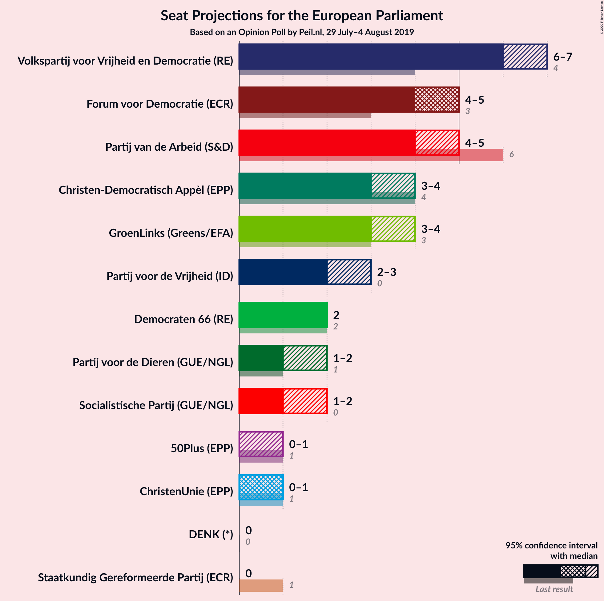

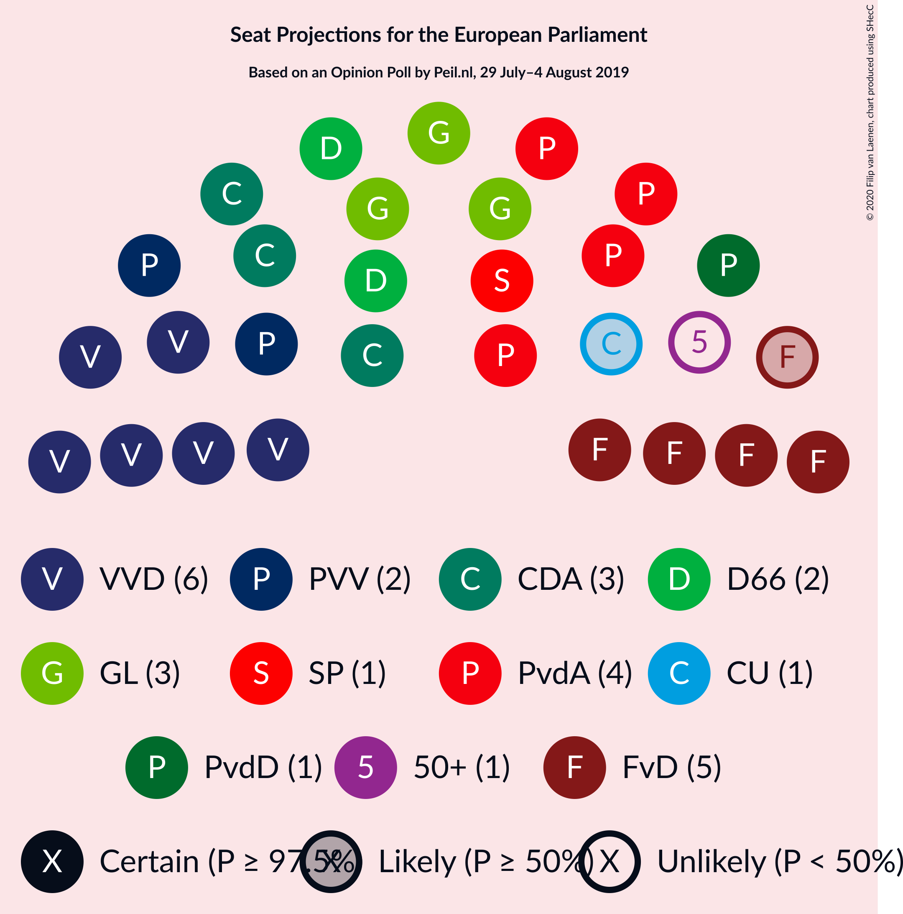

### Confidence Intervals

| Party | Last Result | Median | 80% Confidence Interval | 90% Confidence Interval | 95% Confidence Interval | 99% Confidence Interval |
|:-----:|:-----------:|:------:|:-----------------------:|:-----------------------:|:-----------------------:|:-----------------------:|
| <a href="#volkspartij-voor-vrijheid-en-democratie-(re)">Volkspartij voor Vrijheid en Democratie (RE)</a> | 4 | 5 | 5–6 |5–6 |5–6 |5–6 |
| <a href="#forum-voor-democratie-(ecr)">Forum voor Democratie (ECR)</a> | 3 | 4 | 3–4 |3–5 |3–5 |3–5 |
| <a href="#partij-van-de-arbeid-(s&d)">Partij van de Arbeid (S&D)</a> | 6 | 4 | 3–4 |3–4 |3–4 |3–4 |
| <a href="#christen-democratisch-appèl-(epp)">Christen-Democratisch Appèl (EPP)</a> | 4 | 3 | 3–4 |3–4 |3–4 |3–4 |
| <a href="#groenlinks-(greens/efa)">GroenLinks (Greens/EFA)</a> | 3 | 3 | 3 |3 |3 |3 |
| <a href="#partij-voor-de-vrijheid-(id)">Partij voor de Vrijheid (ID)</a> | 0 | 2 | 2 |2 |2 |2 |
| <a href="#democraten-66-(re)">Democraten 66 (RE)</a> | 2 | 2 | 1–2 |1–2 |1–2 |1–2 |
| <a href="#socialistische-partij-(gue/ngl)">Socialistische Partij (GUE/NGL)</a> | 0 | 1 | 1 |1 |1 |1–2 |
| <a href="#partij-voor-de-dieren-(gue/ngl)">Partij voor de Dieren (GUE/NGL)</a> | 1 | 1 | 1 |0–1 |0–1 |0–1 |
| <a href="#christenunie-(epp)">ChristenUnie (EPP)</a> | 1 | 1 | 0–1 |0–1 |0–1 |0–1 |
| <a href="#50plus-(epp)">50Plus (EPP)</a> | 1 | 0 | 0–1 |0–1 |0–1 |0–1 |
| <a href="#denk-(*)">DENK (*)</a> | 0 | 0 | 0 |0 |0 |0 |
| <a href="#staatkundig-gereformeerde-partij-(ecr)">Staatkundig Gereformeerde Partij (ECR)</a> | 1 | 0 | 0 |0 |0 |0 |

### Volkspartij voor Vrijheid en Democratie (RE)

*For a full overview of the results for this party, see the [Volkspartij voor Vrijheid en Democratie (RE)](party-volkspartijvoorvrijheidendemocratiere.html) page.*

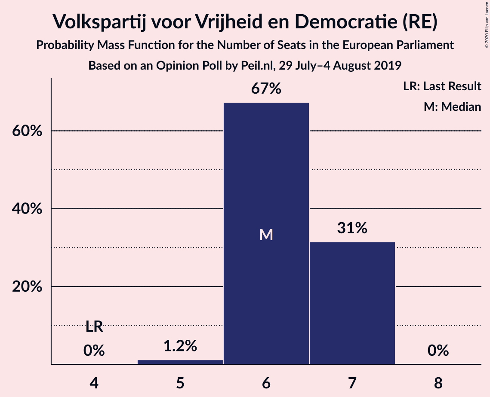

| Number of Seats | Probability | Accumulated | Special Marks |
|:---------------:|:-----------:|:-----------:|:-------------:|
| 4 | 0% | 100% | Last Result |
| 5 | 82% | 100% | Median |
| 6 | 18% | 18% |  |
| 7 | 0% | 0% |  |

### Forum voor Democratie (ECR)

*For a full overview of the results for this party, see the [Forum voor Democratie (ECR)](party-forumvoordemocratieecr.html) page.*

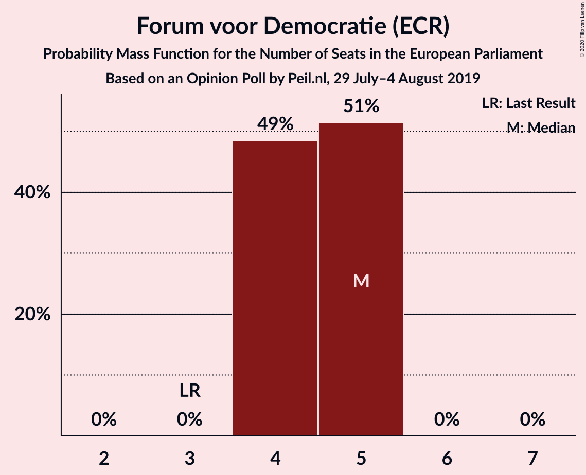

| Number of Seats | Probability | Accumulated | Special Marks |
|:---------------:|:-----------:|:-----------:|:-------------:|
| 3 | 44% | 100% | Last Result |
| 4 | 47% | 56% | Median |
| 5 | 10% | 10% |  |
| 6 | 0% | 0% |  |

### Partij van de Arbeid (S&D)

*For a full overview of the results for this party, see the [Partij van de Arbeid (S&D)](party-partijvandearbeidsd.html) page.*

| Number of Seats | Probability | Accumulated | Special Marks |
|:---------------:|:-----------:|:-----------:|:-------------:|
| 3 | 11% | 100% |  |
| 4 | 89% | 89% | Median |
| 5 | 0.1% | 0.1% |  |
| 6 | 0% | 0% | Last Result |

### Christen-Democratisch Appèl (EPP)

*For a full overview of the results for this party, see the [Christen-Democratisch Appèl (EPP)](party-christen-democratischappèlepp.html) page.*

| Number of Seats | Probability | Accumulated | Special Marks |
|:---------------:|:-----------:|:-----------:|:-------------:|
| 3 | 74% | 100% | Median |
| 4 | 26% | 26% | Last Result |
| 5 | 0% | 0% |  |

### GroenLinks (Greens/EFA)

*For a full overview of the results for this party, see the [GroenLinks (Greens/EFA)](party-groenlinksgreensefa.html) page.*

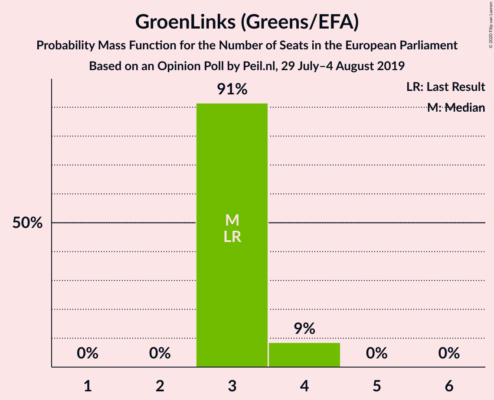

| Number of Seats | Probability | Accumulated | Special Marks |
|:---------------:|:-----------:|:-----------:|:-------------:|
| 2 | 0.2% | 100% |  |
| 3 | 99.7% | 99.8% | Last Result, Median |
| 4 | 0.1% | 0.1% |  |
| 5 | 0% | 0% |  |

### Partij voor de Vrijheid (ID)

*For a full overview of the results for this party, see the [Partij voor de Vrijheid (ID)](party-partijvoordevrijheidid.html) page.*

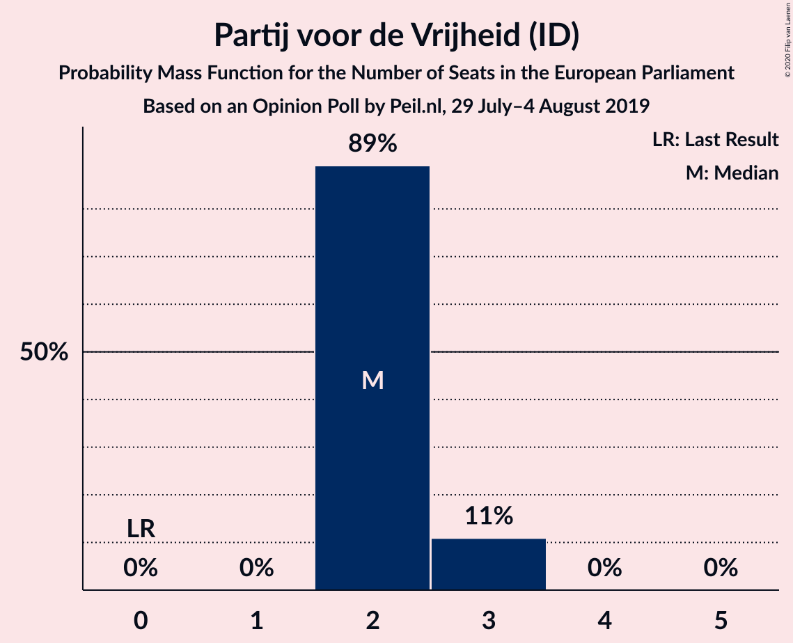

| Number of Seats | Probability | Accumulated | Special Marks |
|:---------------:|:-----------:|:-----------:|:-------------:|
| 0 | 0% | 100% | Last Result |
| 1 | 0.1% | 100% |  |
| 2 | 99.8% | 99.9% | Median |
| 3 | 0.1% | 0.1% |  |
| 4 | 0% | 0% |  |

### Democraten 66 (RE)

*For a full overview of the results for this party, see the [Democraten 66 (RE)](party-democraten66re.html) page.*

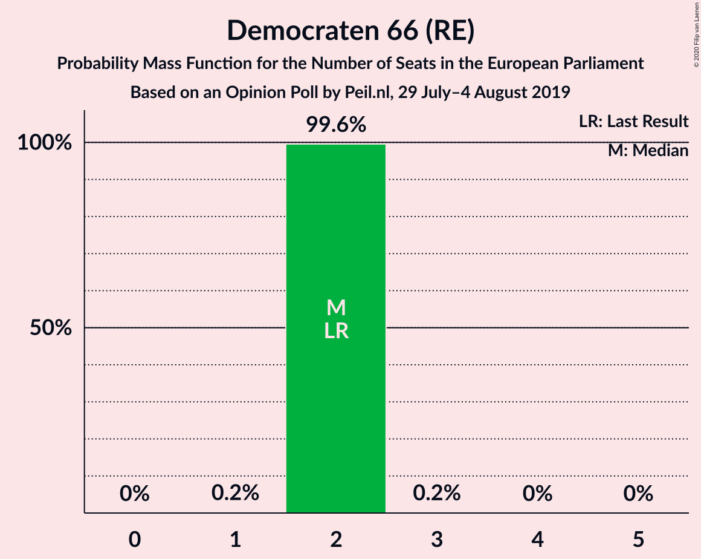

| Number of Seats | Probability | Accumulated | Special Marks |
|:---------------:|:-----------:|:-----------:|:-------------:|
| 1 | 27% | 100% |  |
| 2 | 73% | 73% | Last Result, Median |
| 3 | 0% | 0% |  |

### Socialistische Partij (GUE/NGL)

*For a full overview of the results for this party, see the [Socialistische Partij (GUE/NGL)](party-socialistischepartijguengl.html) page.*

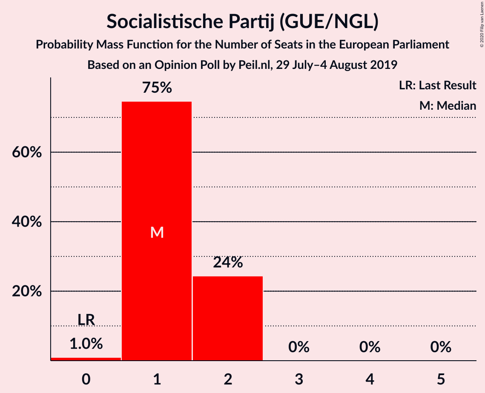

| Number of Seats | Probability | Accumulated | Special Marks |
|:---------------:|:-----------:|:-----------:|:-------------:|
| 0 | 0.4% | 100% | Last Result |
| 1 | 99.0% | 99.6% | Median |
| 2 | 0.5% | 0.5% |  |
| 3 | 0% | 0% |  |

### Partij voor de Dieren (GUE/NGL)

*For a full overview of the results for this party, see the [Partij voor de Dieren (GUE/NGL)](party-partijvoordedierenguengl.html) page.*

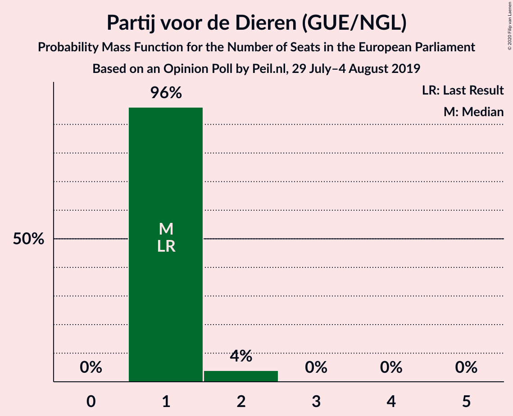

| Number of Seats | Probability | Accumulated | Special Marks |
|:---------------:|:-----------:|:-----------:|:-------------:|
| 0 | 5% | 100% |  |
| 1 | 95% | 95% | Last Result, Median |
| 2 | 0% | 0% |  |

### ChristenUnie (EPP)

*For a full overview of the results for this party, see the [ChristenUnie (EPP)](party-christenunieepp.html) page.*

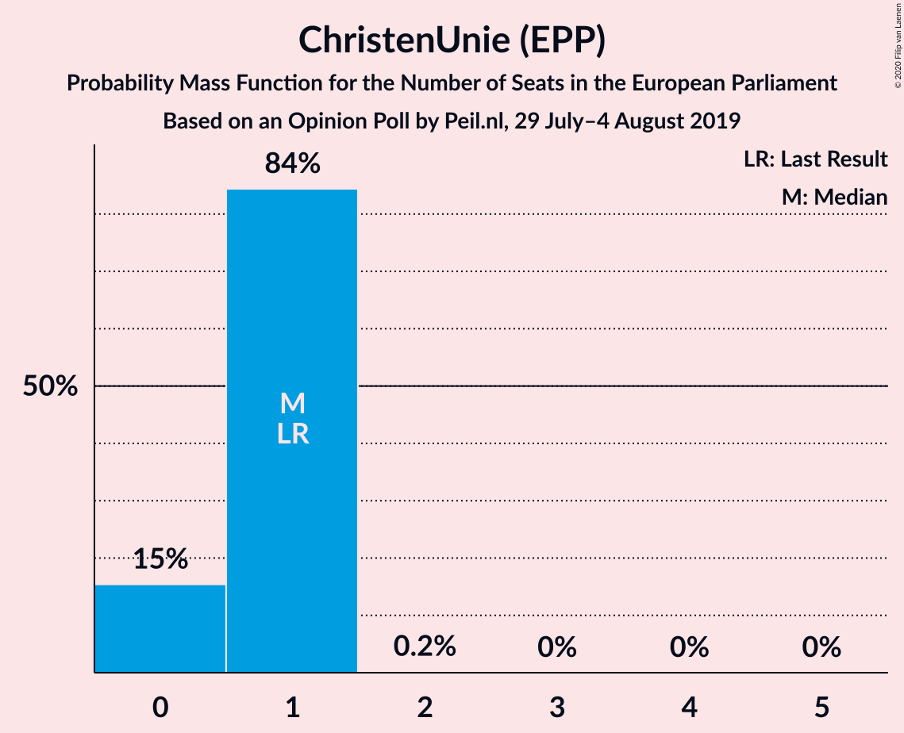

| Number of Seats | Probability | Accumulated | Special Marks |
|:---------------:|:-----------:|:-----------:|:-------------:|
| 0 | 16% | 100% |  |
| 1 | 84% | 84% | Last Result, Median |
| 2 | 0% | 0% |  |

### 50Plus (EPP)

*For a full overview of the results for this party, see the [50Plus (EPP)](party-50plusepp.html) page.*

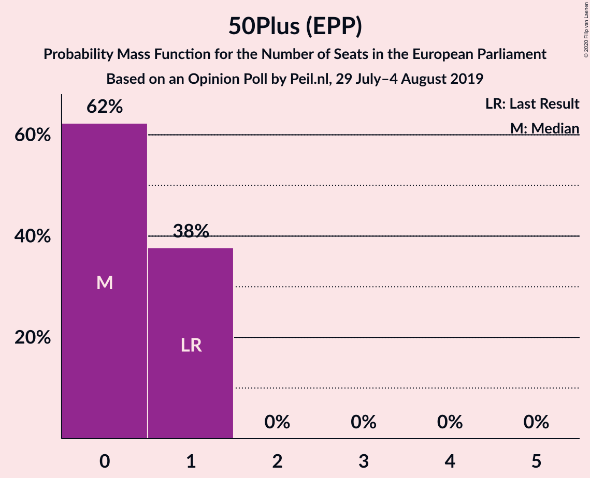

| Number of Seats | Probability | Accumulated | Special Marks |
|:---------------:|:-----------:|:-----------:|:-------------:|
| 0 | 51% | 100% | Median |
| 1 | 49% | 49% | Last Result |
| 2 | 0% | 0% |  |

### DENK (*)

*For a full overview of the results for this party, see the [DENK (*)](party-denk.html) page.*

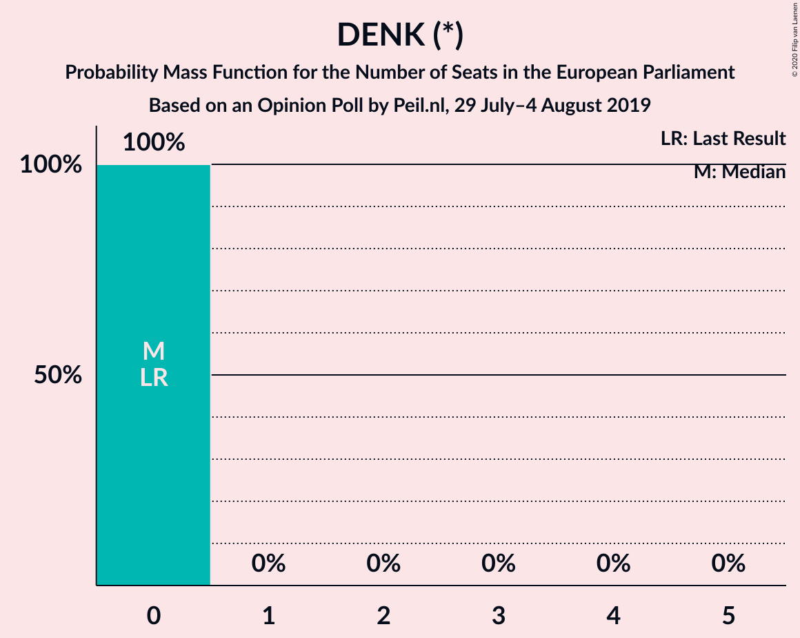

| Number of Seats | Probability | Accumulated | Special Marks |
|:---------------:|:-----------:|:-----------:|:-------------:|
| 0 | 100% | 100% | Last Result, Median |

### Staatkundig Gereformeerde Partij (ECR)

*For a full overview of the results for this party, see the [Staatkundig Gereformeerde Partij (ECR)](party-staatkundiggereformeerdepartijecr.html) page.*

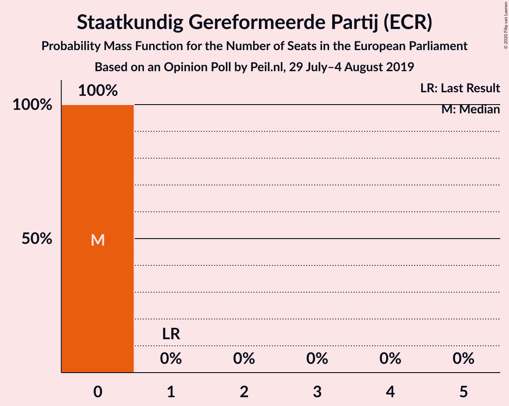

| Number of Seats | Probability | Accumulated | Special Marks |
|:---------------:|:-----------:|:-----------:|:-------------:|
| 0 | 100% | 100% | Median |
| 1 | 0% | 0% | Last Result |

## Coalitions

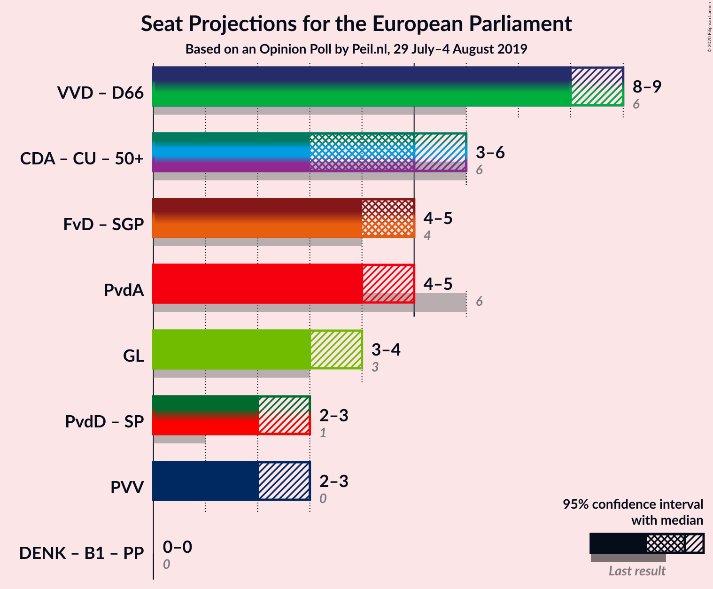

### Confidence Intervals

| Coalition | Last Result | Median | Majority? | 80% Confidence Interval | 90% Confidence Interval | 95% Confidence Interval | 99% Confidence Interval |
|:---------:|:-----------:|:------:|:---------:|:-----------------------:|:-----------------------:|:-----------------------:|:-----------------------:|
| Volkspartij voor Vrijheid en Democratie (RE) – Democraten 66 (RE) | 6 | 7 | 0% | 6–8 | 6–8 | 6–8 | 6–8 |
| Christen-Democratisch Appèl (EPP) – ChristenUnie (EPP) – 50Plus (EPP) | 6 | 5 | 0% | 3–5 | 3–5 | 3–5 | 3–5 |
| Forum voor Democratie (ECR) – Staatkundig Gereformeerde Partij (ECR) | 4 | 4 | 0% | 3–4 | 3–5 | 3–5 | 3–5 |
| Partij van de Arbeid (S&D) | 6 | 4 | 0% | 3–4 | 3–4 | 3–4 | 3–4 |
| GroenLinks (Greens/EFA) | 3 | 3 | 0% | 3 | 3 | 3 | 3 |
| Partij voor de Vrijheid (ID) | 0 | 2 | 0% | 2 | 2 | 2 | 2 |
| Partij voor de Dieren (GUE/NGL) – Socialistische Partij (GUE/NGL) | 1 | 2 | 0% | 2 | 1–2 | 1–2 | 1–2 |

### Volkspartij voor Vrijheid en Democratie (RE) – Democraten 66 (RE)

| Number of Seats | Probability | Accumulated | Special Marks |
|:---------------:|:-----------:|:-----------:|:-------------:|
| 6 | 26% | 100% | Last Result |
| 7 | 57% | 74% | Median |
| 8 | 17% | 17% |  |
| 9 | 0% | 0% |  |

### Christen-Democratisch Appèl (EPP) – ChristenUnie (EPP) – 50Plus (EPP)

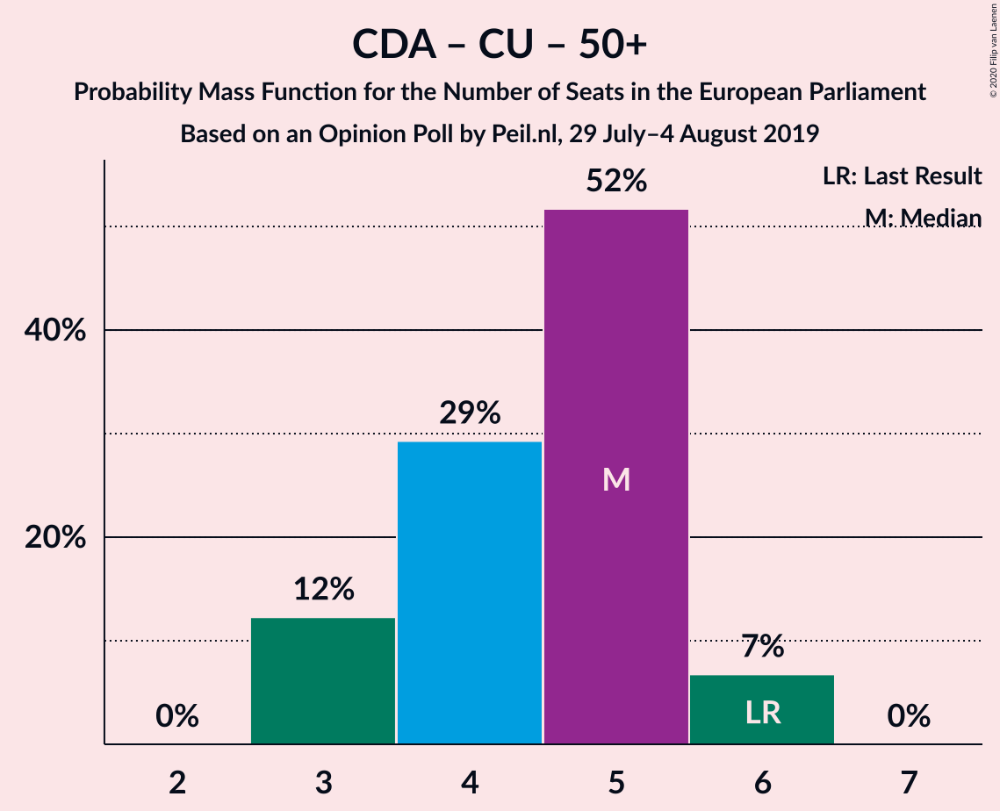

| Number of Seats | Probability | Accumulated | Special Marks |
|:---------------:|:-----------:|:-----------:|:-------------:|
| 3 | 15% | 100% |  |
| 4 | 11% | 85% | Median |
| 5 | 74% | 74% |  |
| 6 | 0% | 0% | Last Result |

### Forum voor Democratie (ECR) – Staatkundig Gereformeerde Partij (ECR)

| Number of Seats | Probability | Accumulated | Special Marks |
|:---------------:|:-----------:|:-----------:|:-------------:|
| 3 | 44% | 100% |  |
| 4 | 47% | 56% | Last Result, Median |
| 5 | 10% | 10% |  |
| 6 | 0% | 0% |  |

### Partij van de Arbeid (S&D)

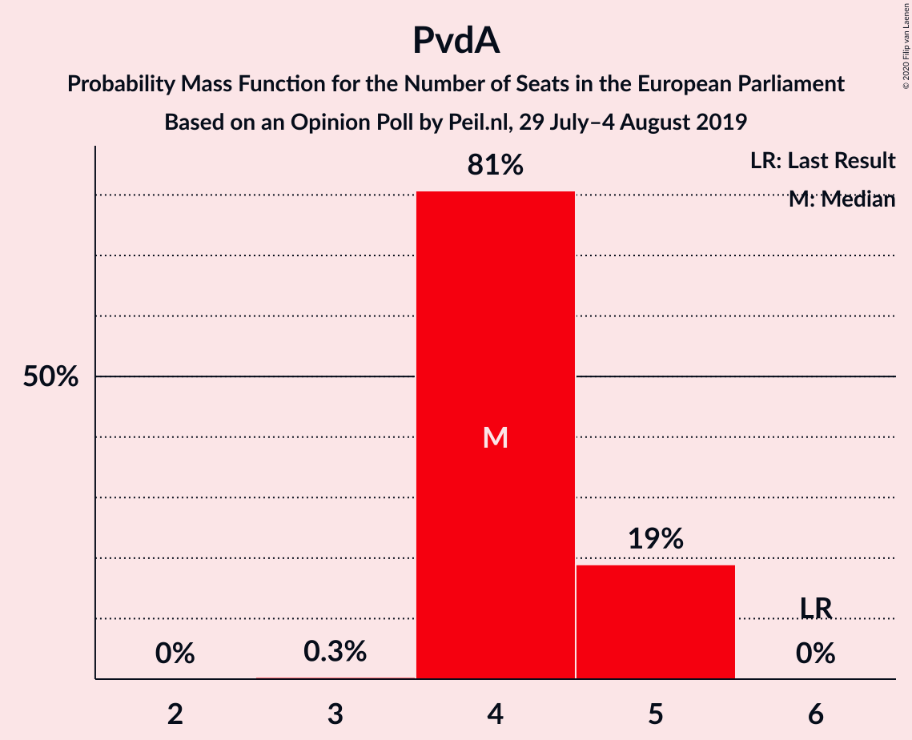

| Number of Seats | Probability | Accumulated | Special Marks |
|:---------------:|:-----------:|:-----------:|:-------------:|
| 3 | 11% | 100% |  |
| 4 | 89% | 89% | Median |
| 5 | 0.1% | 0.1% |  |
| 6 | 0% | 0% | Last Result |

### GroenLinks (Greens/EFA)

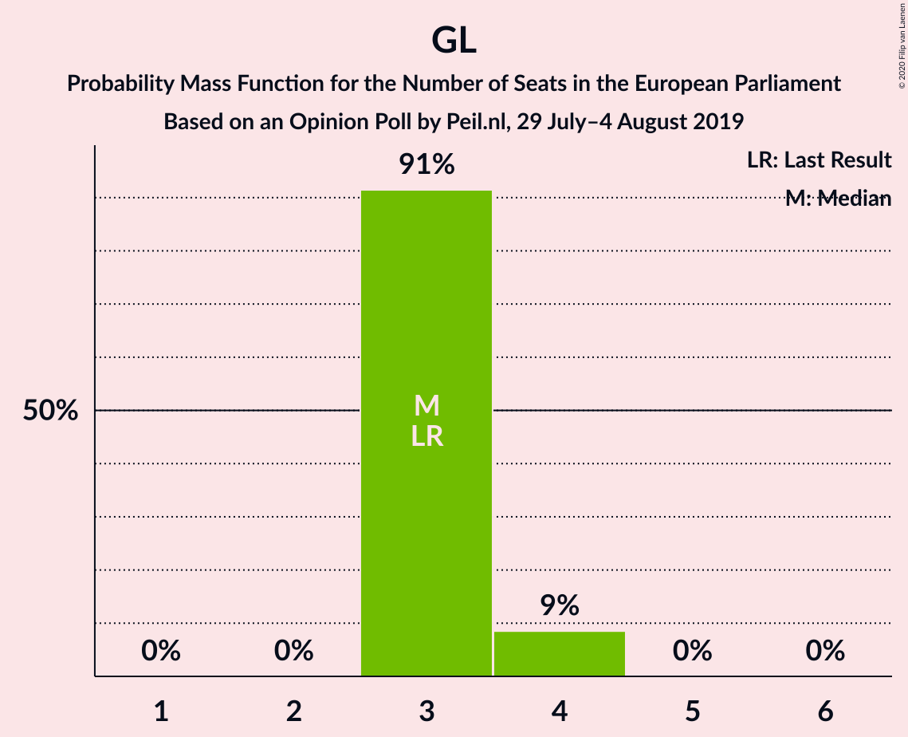

| Number of Seats | Probability | Accumulated | Special Marks |
|:---------------:|:-----------:|:-----------:|:-------------:|
| 2 | 0.2% | 100% |  |
| 3 | 99.7% | 99.8% | Last Result, Median |
| 4 | 0.1% | 0.1% |  |
| 5 | 0% | 0% |  |

### Partij voor de Vrijheid (ID)

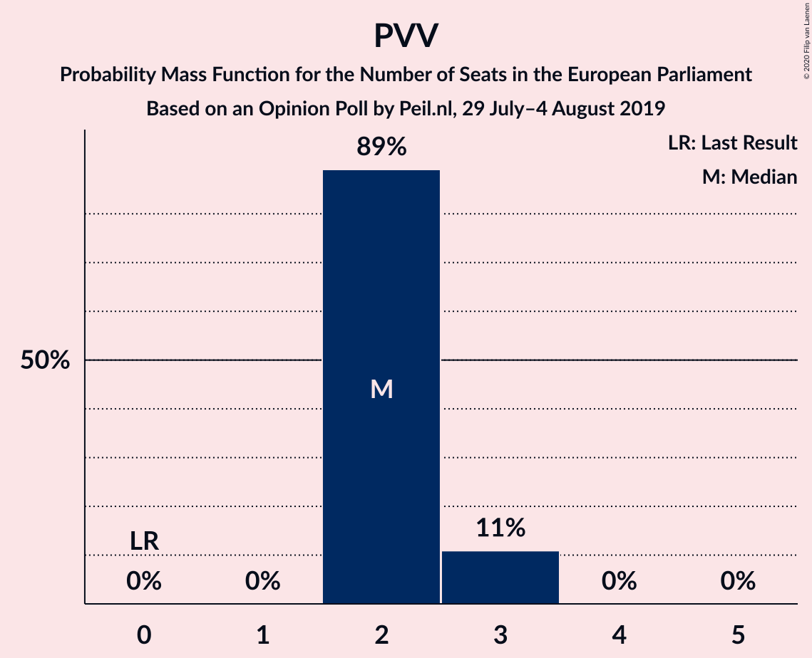

| Number of Seats | Probability | Accumulated | Special Marks |
|:---------------:|:-----------:|:-----------:|:-------------:|
| 0 | 0% | 100% | Last Result |
| 1 | 0.1% | 100% |  |
| 2 | 99.8% | 99.9% | Median |
| 3 | 0.1% | 0.1% |  |
| 4 | 0% | 0% |  |

### Partij voor de Dieren (GUE/NGL) – Socialistische Partij (GUE/NGL)

| Number of Seats | Probability | Accumulated | Special Marks |
|:---------------:|:-----------:|:-----------:|:-------------:|
| 1 | 5% | 100% | Last Result |
| 2 | 95% | 95% | Median |
| 3 | 0.2% | 0.2% |  |
| 4 | 0% | 0% |  |

## Technical Information

### Opinion Poll

+ **Polling firm:** Peil.nl
+ **Commissioner(s):** —
+ **Fieldwork period:** 29 July–4 August 2019

### Calculations

+ **Sample size:** 3000
+ **Simulations done:** 131,072
+ **Error estimate:** 2.44%

