# Opinion Poll by Ipsos for EenVandaag, 30 August–2 September 2019

<a href="#voting-intentions">Voting Intentions</a> | <a href="#seats">Seats</a> | <a href="#coalitions">Coalitions</a> | <a href="#technical-information">Technical Information</a>

## Voting Intentions

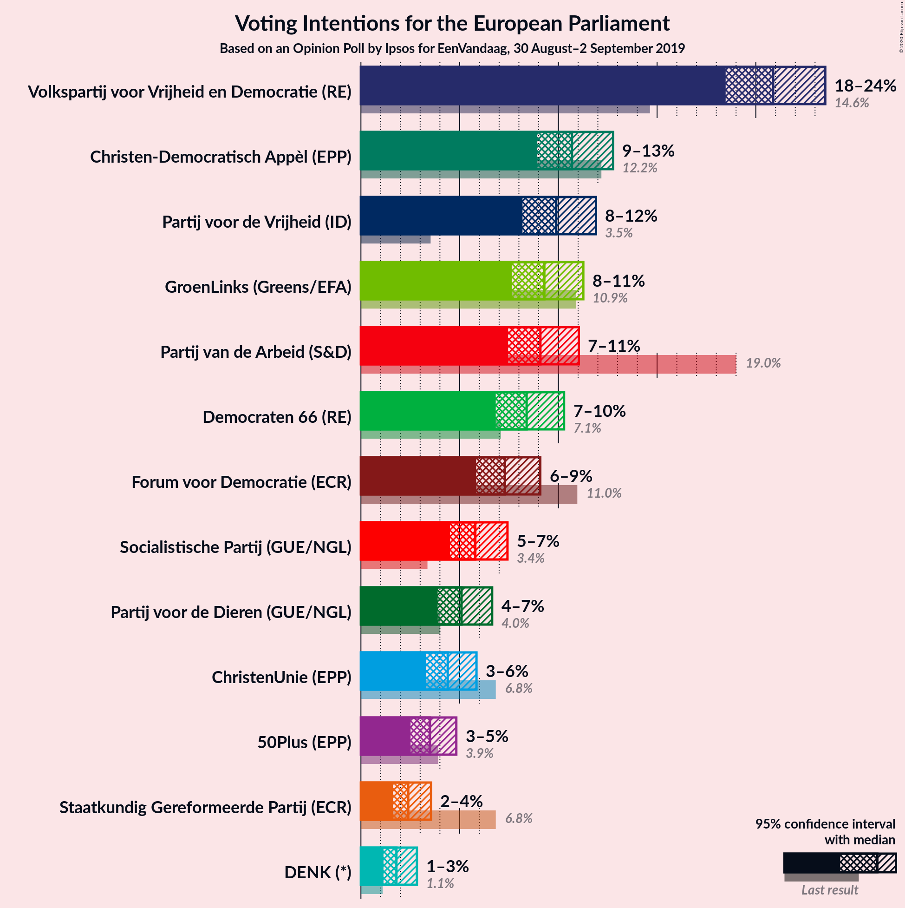

### Confidence Intervals

| Party | Last Result | Poll Result | 80% Confidence Interval | 90% Confidence Interval | 95% Confidence Interval | 99% Confidence Interval |
|:-----:|:-----------:|:-----------:|:-----------------------:|:-----------------------:|:-----------------------:|:-----------------------:|
| Volkspartij voor Vrijheid en Democratie (RE) | 14.6% | 20.9% | 19.3–22.6% |18.9–23.1% |18.5–23.5% |17.7–24.4% |
| Christen-Democratisch Appèl (EPP) | 12.2% | 10.7% | 9.5–12.0% |9.2–12.4% |8.9–12.8% |8.4–13.4% |
| Partij voor de Vrijheid (ID) | 3.5% | 9.9% | 8.8–11.2% |8.5–11.6% |8.2–11.9% |7.7–12.6% |
| GroenLinks (Greens/EFA) | 10.9% | 9.3% | 8.2–10.6% |7.9–10.9% |7.6–11.3% |7.1–11.9% |
| Partij van de Arbeid (S&D) | 19.0% | 9.1% | 8.0–10.4% |7.7–10.7% |7.5–11.0% |7.0–11.7% |
| Democraten 66 (RE) | 7.1% | 8.4% | 7.4–9.6% |7.1–10.0% |6.8–10.3% |6.4–10.9% |
| Forum voor Democratie (ECR) | 11.0% | 7.3% | 6.3–8.5% |6.1–8.8% |5.8–9.1% |5.4–9.7% |
| Socialistische Partij (GUE/NGL) | 3.4% | 5.8% | 4.9–6.9% |4.7–7.2% |4.5–7.4% |4.1–8.0% |
| Partij voor de Dieren (GUE/NGL) | 4.0% | 5.1% | 4.3–6.1% |4.1–6.4% |3.9–6.6% |3.6–7.2% |
| ChristenUnie (EPP) | 6.8% | 4.4% | 3.7–5.3% |3.5–5.6% |3.3–5.9% |3.0–6.3% |
| 50Plus (EPP) | 3.9% | 3.5% | 2.9–4.4% |2.7–4.6% |2.5–4.8% |2.2–5.3% |
| Staatkundig Gereformeerde Partij (ECR) | 6.8% | 2.4% | 1.9–3.2% |1.7–3.4% |1.6–3.6% |1.4–3.9% |
| DENK (*) | 1.1% | 1.8% | 1.4–2.5% |1.2–2.7% |1.1–2.8% |1.0–3.2% |

*Note:* The poll result column reflects the actual value used in the calculations. Published results may vary slightly, and in addition be rounded to fewer digits.

## Seats

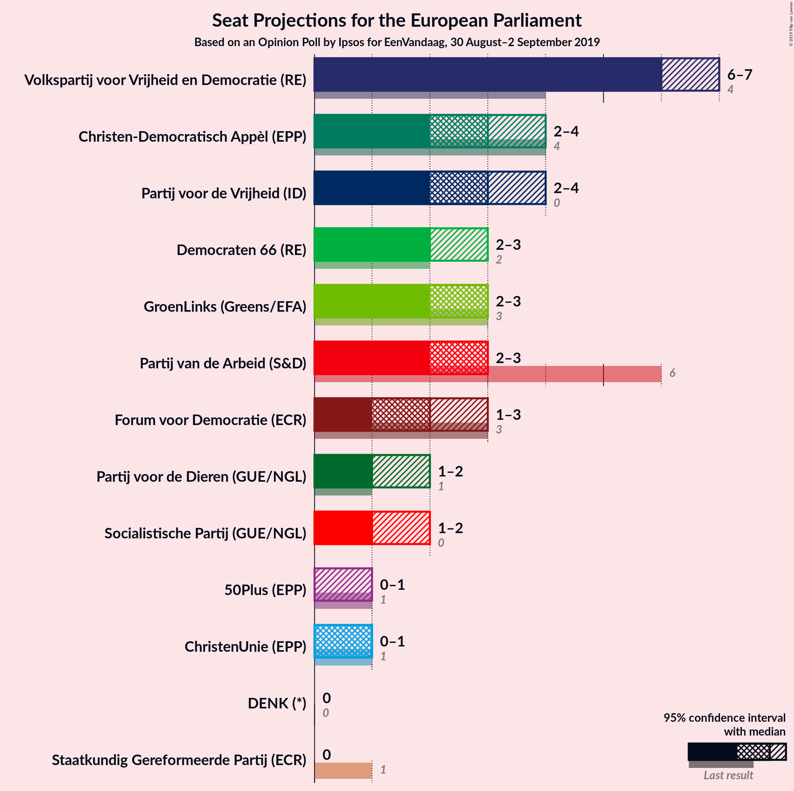

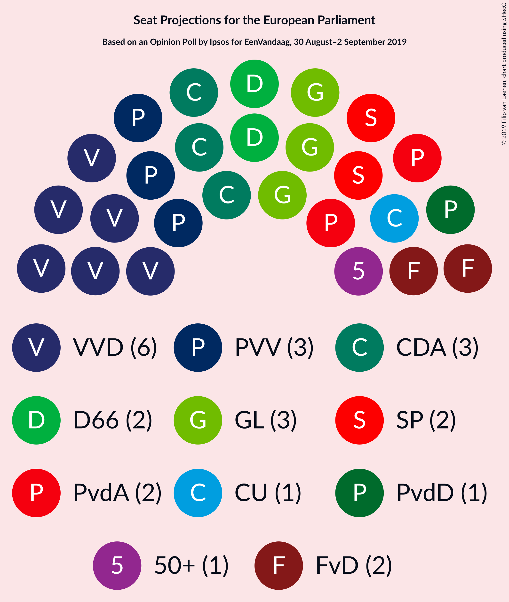

### Confidence Intervals

| Party | Last Result | Median | 80% Confidence Interval | 90% Confidence Interval | 95% Confidence Interval | 99% Confidence Interval |
|:-----:|:-----------:|:------:|:-----------------------:|:-----------------------:|:-----------------------:|:-----------------------:|
| <a href="#volkspartij-voor-vrijheid-en-democratie-(re)">Volkspartij voor Vrijheid en Democratie (RE)</a> | 4 | 7 | 7–8 |7–8 |6–8 |6–9 |
| <a href="#christen-democratisch-appèl-(epp)">Christen-Democratisch Appèl (EPP)</a> | 4 | 3 | 3 |3–4 |3–4 |3–5 |
| <a href="#partij-voor-de-vrijheid-(id)">Partij voor de Vrijheid (ID)</a> | 0 | 3 | 3–4 |2–4 |2–4 |2–4 |
| <a href="#groenlinks-(greens/efa)">GroenLinks (Greens/EFA)</a> | 3 | 3 | 3 |3 |3 |2–4 |
| <a href="#partij-van-de-arbeid-(s&d)">Partij van de Arbeid (S&D)</a> | 6 | 3 | 3 |3 |3–4 |2–4 |
| <a href="#democraten-66-(re)">Democraten 66 (RE)</a> | 2 | 3 | 2–3 |2–3 |2–3 |2–3 |
| <a href="#forum-voor-democratie-(ecr)">Forum voor Democratie (ECR)</a> | 3 | 2 | 2–3 |2–3 |2–3 |1–3 |
| <a href="#socialistische-partij-(gue/ngl)">Socialistische Partij (GUE/NGL)</a> | 0 | 1 | 1–2 |1–2 |1–2 |1–2 |
| <a href="#partij-voor-de-dieren-(gue/ngl)">Partij voor de Dieren (GUE/NGL)</a> | 1 | 2 | 1–2 |1–2 |1–2 |1–2 |
| <a href="#christenunie-(epp)">ChristenUnie (EPP)</a> | 1 | 1 | 1 |1 |1 |0–2 |
| <a href="#50plus-(epp)">50Plus (EPP)</a> | 1 | 0 | 0–1 |0–1 |0–1 |0–1 |
| <a href="#staatkundig-gereformeerde-partij-(ecr)">Staatkundig Gereformeerde Partij (ECR)</a> | 1 | 0 | 0 |0 |0 |0–1 |
| <a href="#denk-(*)">DENK (*)</a> | 0 | 0 | 0 |0 |0 |0–1 |

### Volkspartij voor Vrijheid en Democratie (RE)

*For a full overview of the results for this party, see the [Volkspartij voor Vrijheid en Democratie (RE)](party-volkspartijvoorvrijheidendemocratiere.html) page.*

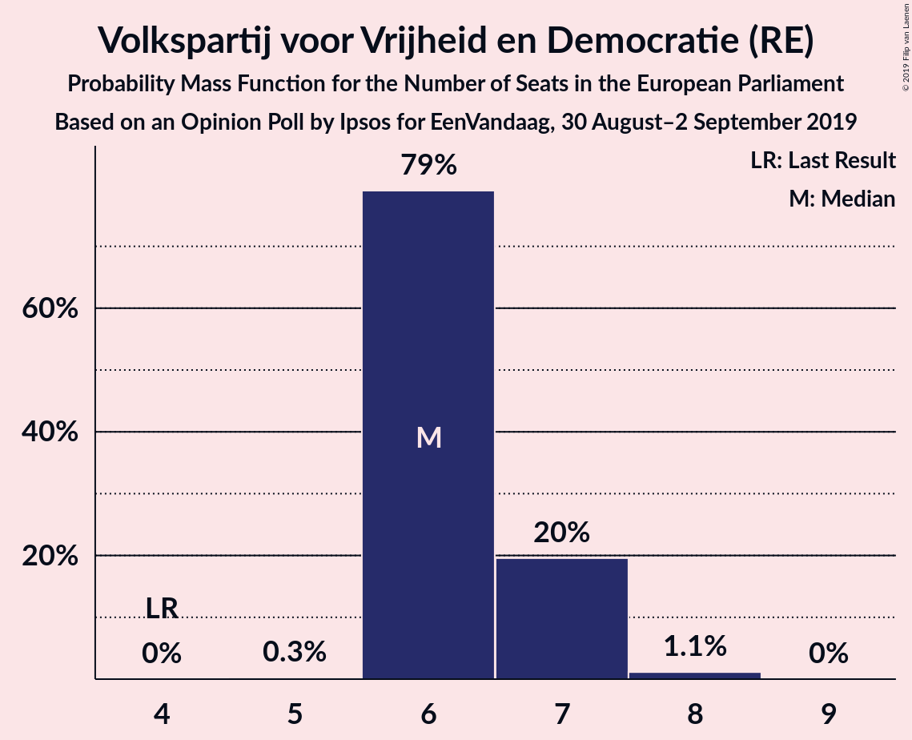

| Number of Seats | Probability | Accumulated | Special Marks |
|:---------------:|:-----------:|:-----------:|:-------------:|
| 4 | 0% | 100% | Last Result |
| 5 | 0% | 100% |  |
| 6 | 4% | 100% |  |
| 7 | 79% | 96% | Median |
| 8 | 16% | 17% |  |
| 9 | 0.7% | 0.7% |  |
| 10 | 0% | 0% |  |

### Christen-Democratisch Appèl (EPP)

*For a full overview of the results for this party, see the [Christen-Democratisch Appèl (EPP)](party-christen-democratischappèlepp.html) page.*

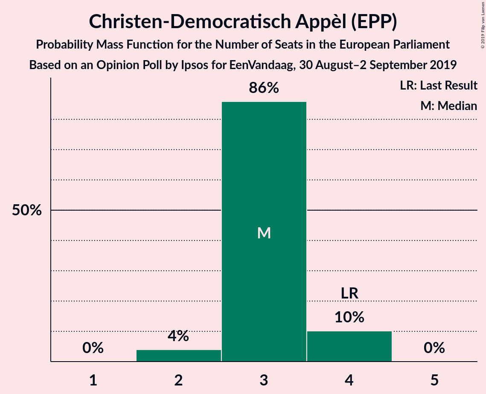

| Number of Seats | Probability | Accumulated | Special Marks |
|:---------------:|:-----------:|:-----------:|:-------------:|
| 2 | 0.1% | 100% |  |
| 3 | 95% | 99.9% | Median |
| 4 | 4% | 5% | Last Result |
| 5 | 1.1% | 1.1% |  |
| 6 | 0% | 0% |  |

### Partij voor de Vrijheid (ID)

*For a full overview of the results for this party, see the [Partij voor de Vrijheid (ID)](party-partijvoordevrijheidid.html) page.*

| Number of Seats | Probability | Accumulated | Special Marks |
|:---------------:|:-----------:|:-----------:|:-------------:|
| 0 | 0% | 100% | Last Result |
| 1 | 0% | 100% |  |
| 2 | 5% | 100% |  |
| 3 | 53% | 95% | Median |
| 4 | 42% | 42% |  |
| 5 | 0.1% | 0.1% |  |
| 6 | 0% | 0% |  |

### GroenLinks (Greens/EFA)

*For a full overview of the results for this party, see the [GroenLinks (Greens/EFA)](party-groenlinksgreensefa.html) page.*

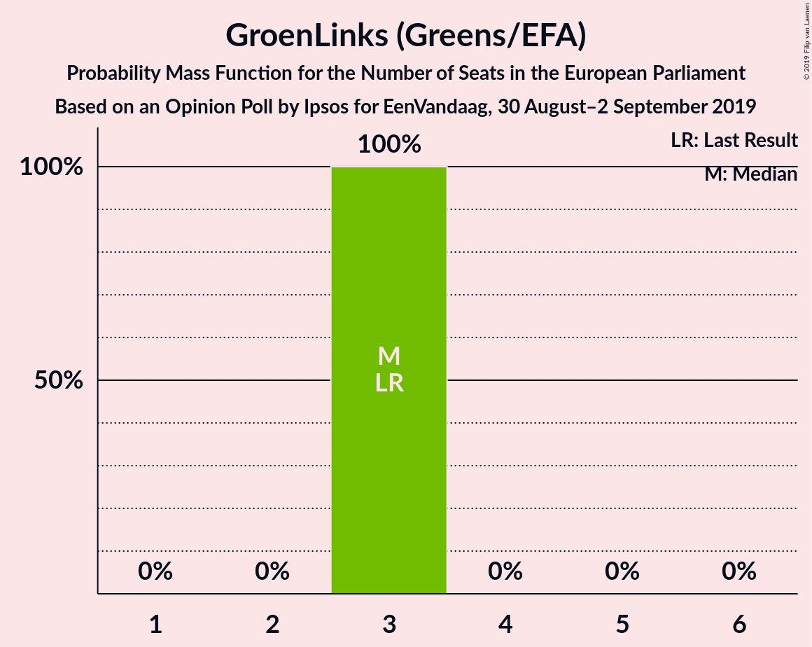

| Number of Seats | Probability | Accumulated | Special Marks |
|:---------------:|:-----------:|:-----------:|:-------------:|
| 2 | 0.9% | 100% |  |
| 3 | 97% | 99.1% | Last Result, Median |
| 4 | 2% | 2% |  |
| 5 | 0.2% | 0.2% |  |
| 6 | 0% | 0% |  |

### Partij van de Arbeid (S&D)

*For a full overview of the results for this party, see the [Partij van de Arbeid (S&D)](party-partijvandearbeidsd.html) page.*

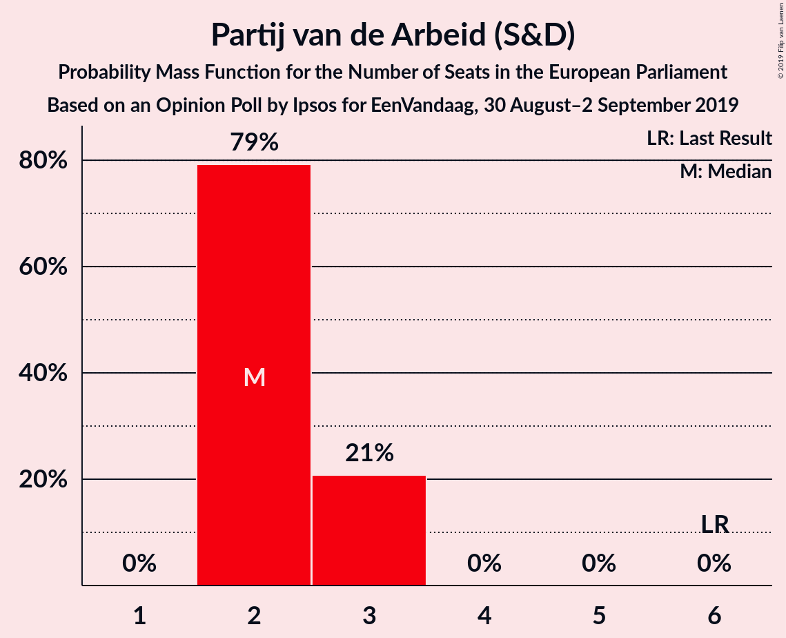

| Number of Seats | Probability | Accumulated | Special Marks |
|:---------------:|:-----------:|:-----------:|:-------------:|
| 2 | 2% | 100% |  |
| 3 | 95% | 98% | Median |
| 4 | 3% | 3% |  |
| 5 | 0% | 0% |  |
| 6 | 0% | 0% | Last Result |

### Democraten 66 (RE)

*For a full overview of the results for this party, see the [Democraten 66 (RE)](party-democraten66re.html) page.*

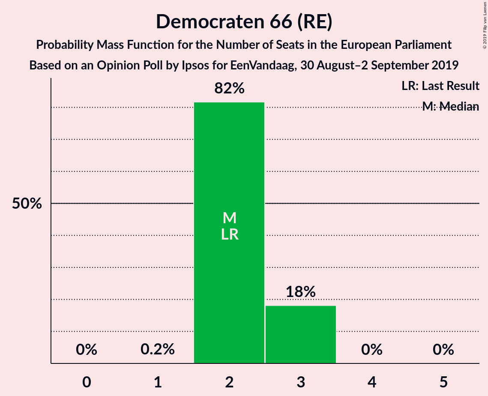

| Number of Seats | Probability | Accumulated | Special Marks |
|:---------------:|:-----------:|:-----------:|:-------------:|
| 2 | 49% | 100% | Last Result |
| 3 | 50% | 51% | Median |
| 4 | 0.1% | 0.1% |  |
| 5 | 0% | 0% |  |

### Forum voor Democratie (ECR)

*For a full overview of the results for this party, see the [Forum voor Democratie (ECR)](party-forumvoordemocratieecr.html) page.*

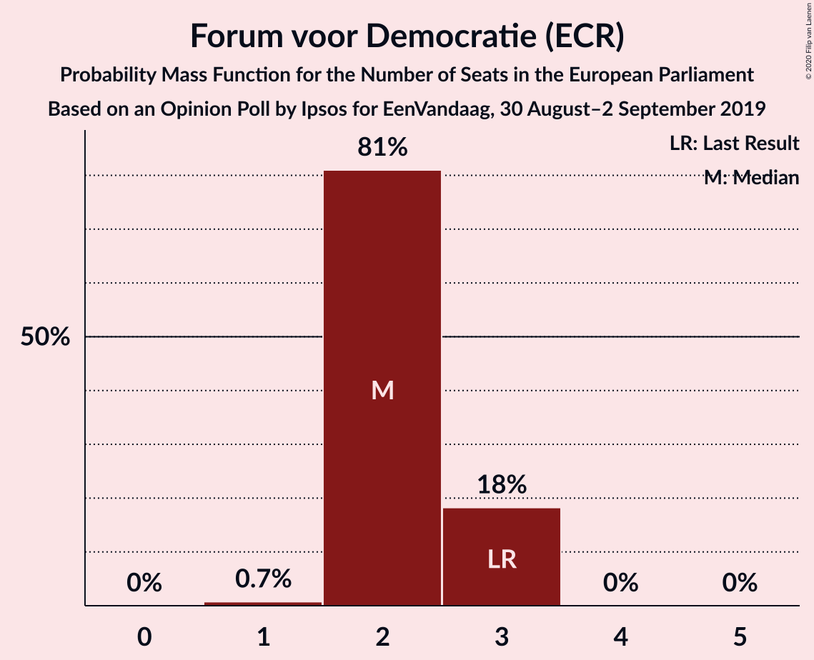

| Number of Seats | Probability | Accumulated | Special Marks |
|:---------------:|:-----------:|:-----------:|:-------------:|
| 1 | 1.4% | 100% |  |
| 2 | 57% | 98.6% | Median |
| 3 | 41% | 41% | Last Result |
| 4 | 0% | 0% |  |

### Socialistische Partij (GUE/NGL)

*For a full overview of the results for this party, see the [Socialistische Partij (GUE/NGL)](party-socialistischepartijguengl.html) page.*

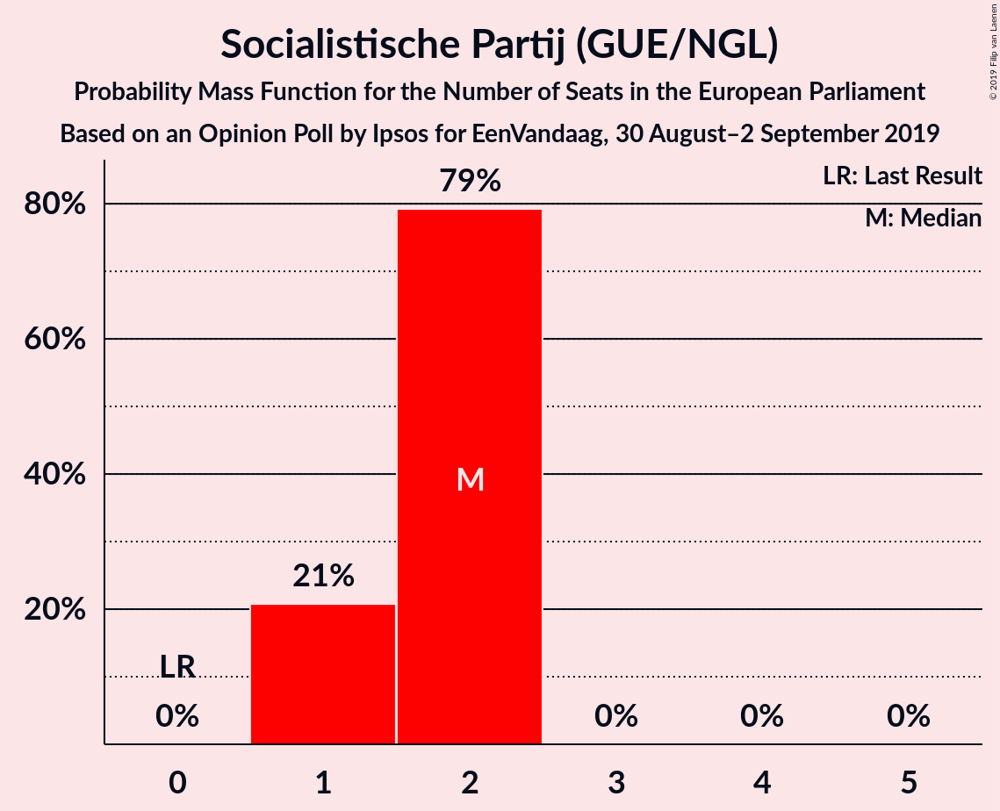

| Number of Seats | Probability | Accumulated | Special Marks |
|:---------------:|:-----------:|:-----------:|:-------------:|
| 0 | 0.1% | 100% | Last Result |
| 1 | 51% | 99.9% | Median |
| 2 | 49% | 49% |  |
| 3 | 0.1% | 0.1% |  |
| 4 | 0% | 0% |  |

### Partij voor de Dieren (GUE/NGL)

*For a full overview of the results for this party, see the [Partij voor de Dieren (GUE/NGL)](party-partijvoordedierenguengl.html) page.*

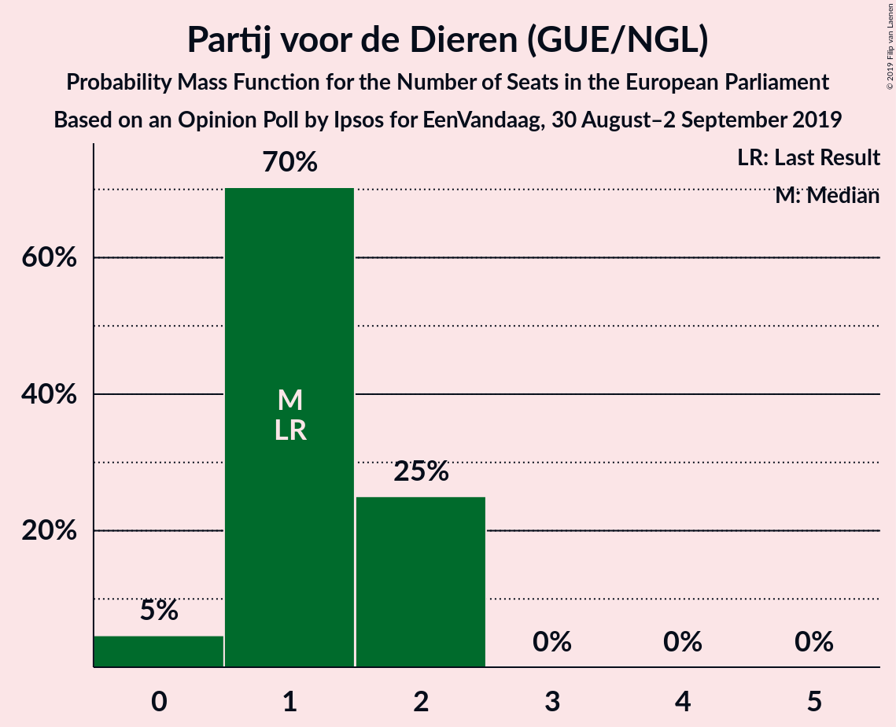

| Number of Seats | Probability | Accumulated | Special Marks |
|:---------------:|:-----------:|:-----------:|:-------------:|
| 0 | 0.1% | 100% |  |
| 1 | 15% | 99.9% | Last Result |
| 2 | 85% | 85% | Median |
| 3 | 0% | 0% |  |

### ChristenUnie (EPP)

*For a full overview of the results for this party, see the [ChristenUnie (EPP)](party-christenunieepp.html) page.*

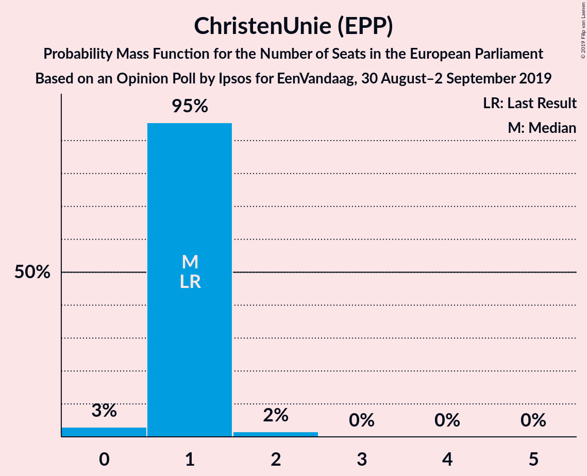

| Number of Seats | Probability | Accumulated | Special Marks |
|:---------------:|:-----------:|:-----------:|:-------------:|
| 0 | 2% | 100% |  |
| 1 | 97% | 98% | Last Result, Median |
| 2 | 2% | 2% |  |
| 3 | 0% | 0% |  |

### 50Plus (EPP)

*For a full overview of the results for this party, see the [50Plus (EPP)](party-50plusepp.html) page.*

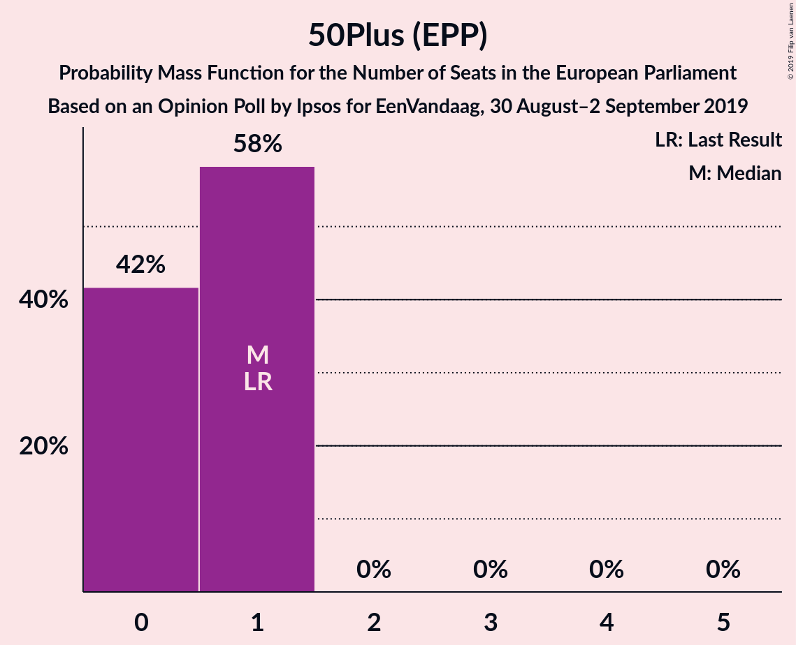

| Number of Seats | Probability | Accumulated | Special Marks |
|:---------------:|:-----------:|:-----------:|:-------------:|
| 0 | 84% | 100% | Median |
| 1 | 16% | 16% | Last Result |
| 2 | 0% | 0% |  |

### Staatkundig Gereformeerde Partij (ECR)

*For a full overview of the results for this party, see the [Staatkundig Gereformeerde Partij (ECR)](party-staatkundiggereformeerdepartijecr.html) page.*

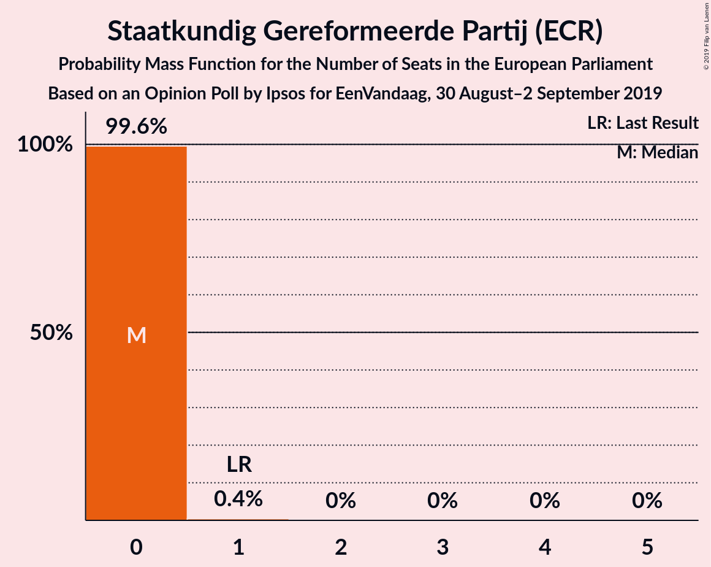

| Number of Seats | Probability | Accumulated | Special Marks |
|:---------------:|:-----------:|:-----------:|:-------------:|
| 0 | 98.9% | 100% | Median |
| 1 | 1.1% | 1.1% | Last Result |
| 2 | 0% | 0% |  |

### DENK (*)

*For a full overview of the results for this party, see the [DENK (*)](party-denk.html) page.*

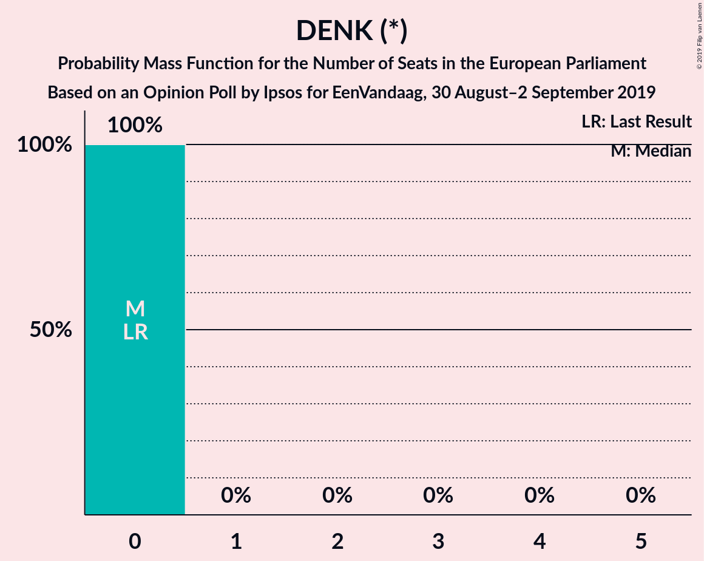

| Number of Seats | Probability | Accumulated | Special Marks |
|:---------------:|:-----------:|:-----------:|:-------------:|
| 0 | 98.7% | 100% | Last Result, Median |
| 1 | 1.3% | 1.3% |  |
| 2 | 0% | 0% |  |

## Coalitions

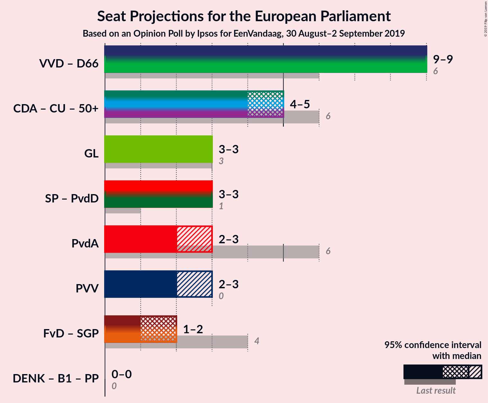

### Confidence Intervals

| Coalition | Last Result | Median | Majority? | 80% Confidence Interval | 90% Confidence Interval | 95% Confidence Interval | 99% Confidence Interval |
|:---------:|:-----------:|:------:|:---------:|:-----------------------:|:-----------------------:|:-----------------------:|:-----------------------:|
| Volkspartij voor Vrijheid en Democratie (RE) – Democraten 66 (RE) | 6 | 10 | 0% | 9–10 | 9–11 | 9–11 | 9–12 |
| Christen-Democratisch Appèl (EPP) – ChristenUnie (EPP) – 50Plus (EPP) | 6 | 4 | 0% | 4–5 | 4–5 | 4–6 | 4–7 |
| Partij van de Arbeid (S&D) | 6 | 3 | 0% | 3 | 3 | 3–4 | 2–4 |
| Socialistische Partij (GUE/NGL) – Partij voor de Dieren (GUE/NGL) | 1 | 3 | 0% | 2–4 | 2–4 | 2–4 | 2–4 |
| Partij voor de Vrijheid (ID) | 0 | 3 | 0% | 3–4 | 2–4 | 2–4 | 2–4 |
| GroenLinks (Greens/EFA) | 3 | 3 | 0% | 3 | 3 | 3 | 2–4 |
| Forum voor Democratie (ECR) – Staatkundig Gereformeerde Partij (ECR) | 4 | 2 | 0% | 2–3 | 2–3 | 2–3 | 1–3 |

### Volkspartij voor Vrijheid en Democratie (RE) – Democraten 66 (RE)

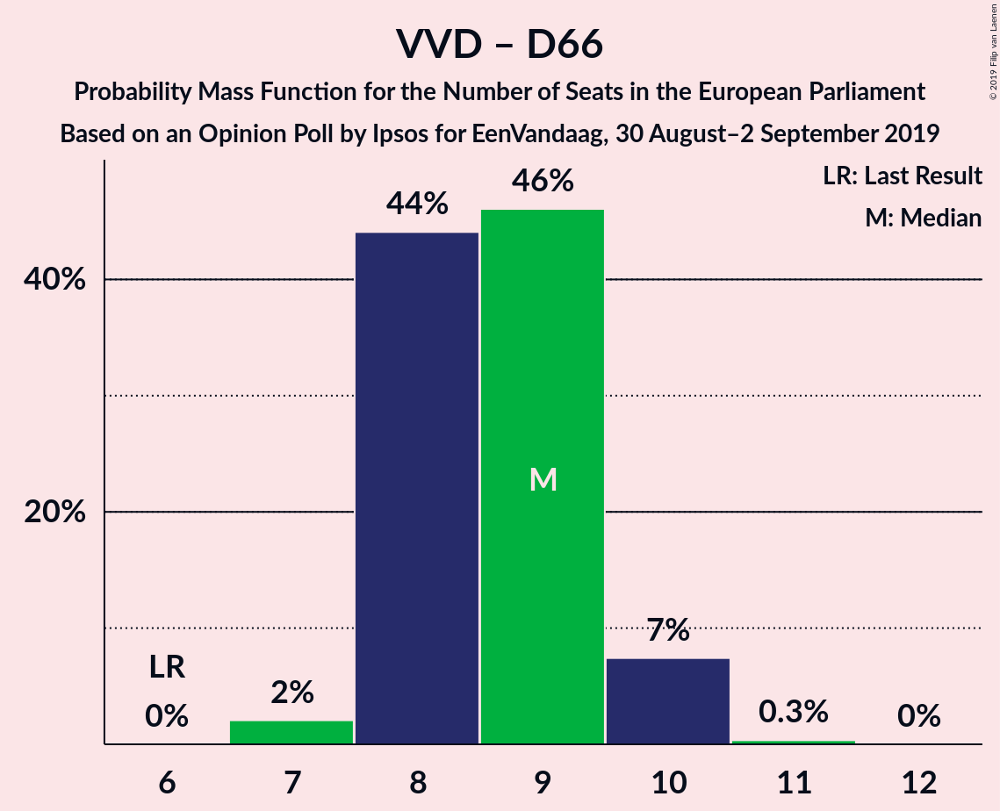

| Number of Seats | Probability | Accumulated | Special Marks |
|:---------------:|:-----------:|:-----------:|:-------------:|
| 6 | 0% | 100% | Last Result |
| 7 | 0% | 100% |  |
| 8 | 0.3% | 100% |  |
| 9 | 46% | 99.7% |  |
| 10 | 43% | 53% | Median |
| 11 | 9% | 10% |  |
| 12 | 0.7% | 0.7% |  |
| 13 | 0% | 0% |  |

### Christen-Democratisch Appèl (EPP) – ChristenUnie (EPP) – 50Plus (EPP)

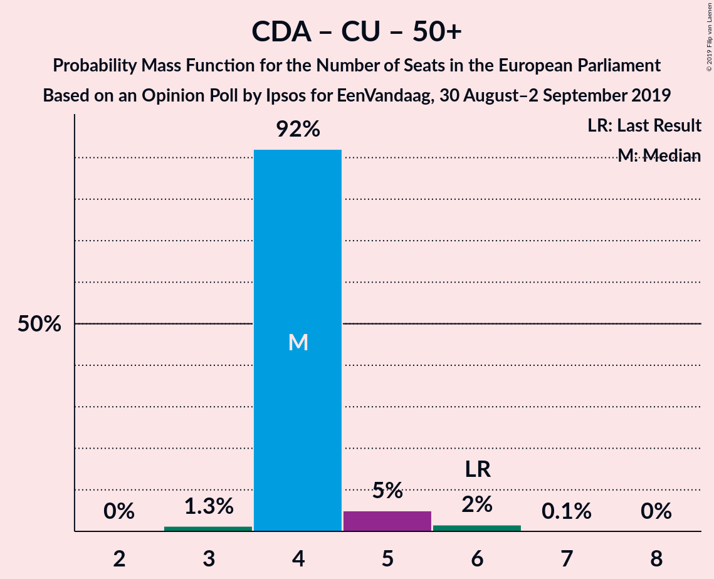

| Number of Seats | Probability | Accumulated | Special Marks |
|:---------------:|:-----------:|:-----------:|:-------------:|
| 3 | 0.1% | 100% |  |
| 4 | 82% | 99.8% | Median |
| 5 | 14% | 18% |  |
| 6 | 2% | 3% | Last Result |
| 7 | 1.3% | 1.3% |  |
| 8 | 0% | 0% |  |

### Partij van de Arbeid (S&D)

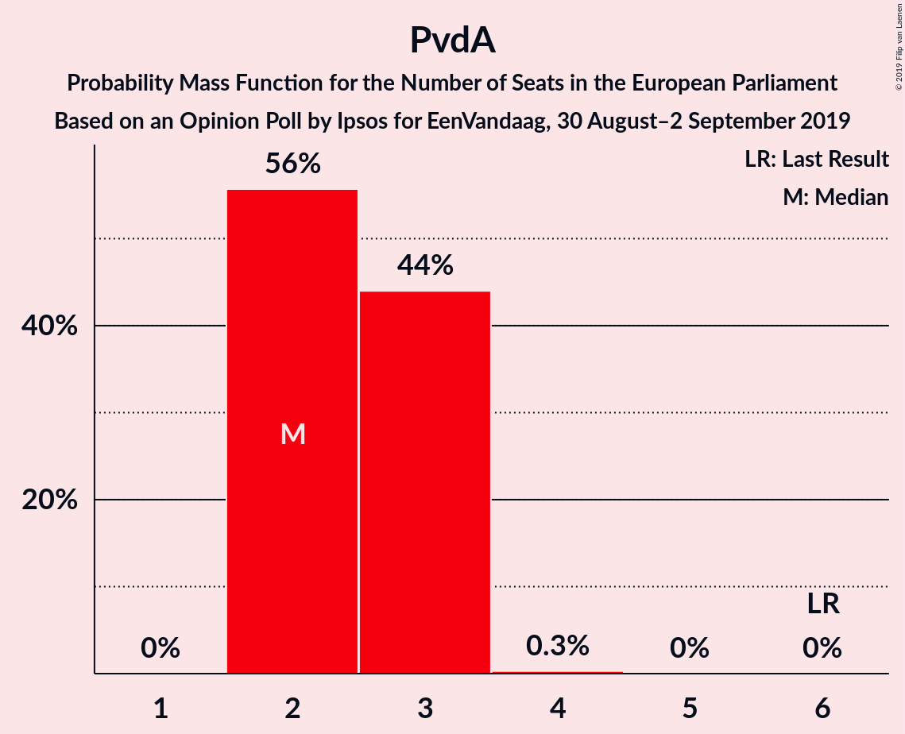

| Number of Seats | Probability | Accumulated | Special Marks |
|:---------------:|:-----------:|:-----------:|:-------------:|
| 2 | 2% | 100% |  |
| 3 | 95% | 98% | Median |
| 4 | 3% | 3% |  |
| 5 | 0% | 0% |  |
| 6 | 0% | 0% | Last Result |

### Socialistische Partij (GUE/NGL) – Partij voor de Dieren (GUE/NGL)

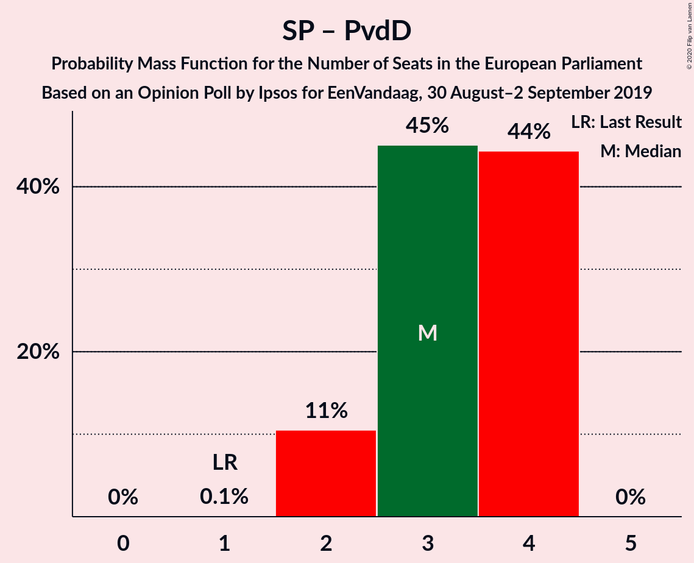

| Number of Seats | Probability | Accumulated | Special Marks |
|:---------------:|:-----------:|:-----------:|:-------------:|
| 1 | 0.1% | 100% | Last Result |
| 2 | 11% | 99.9% |  |
| 3 | 45% | 89% | Median |
| 4 | 44% | 44% |  |
| 5 | 0% | 0% |  |

### Partij voor de Vrijheid (ID)

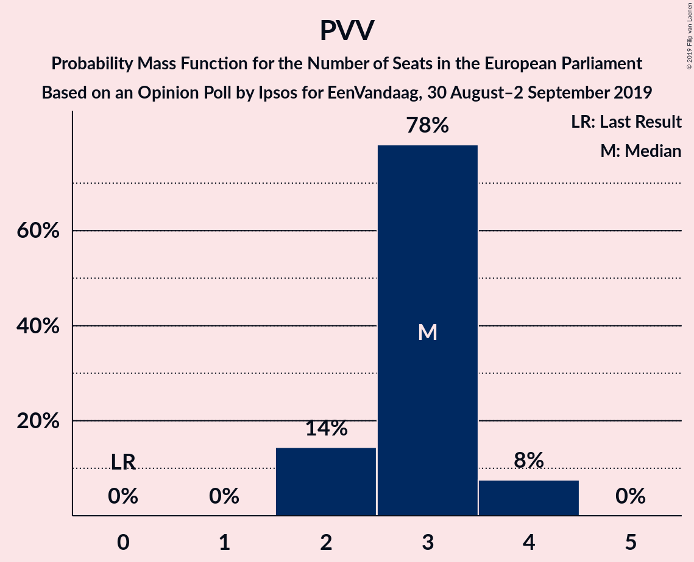

| Number of Seats | Probability | Accumulated | Special Marks |
|:---------------:|:-----------:|:-----------:|:-------------:|
| 0 | 0% | 100% | Last Result |
| 1 | 0% | 100% |  |
| 2 | 5% | 100% |  |
| 3 | 53% | 95% | Median |
| 4 | 42% | 42% |  |
| 5 | 0.1% | 0.1% |  |
| 6 | 0% | 0% |  |

### GroenLinks (Greens/EFA)

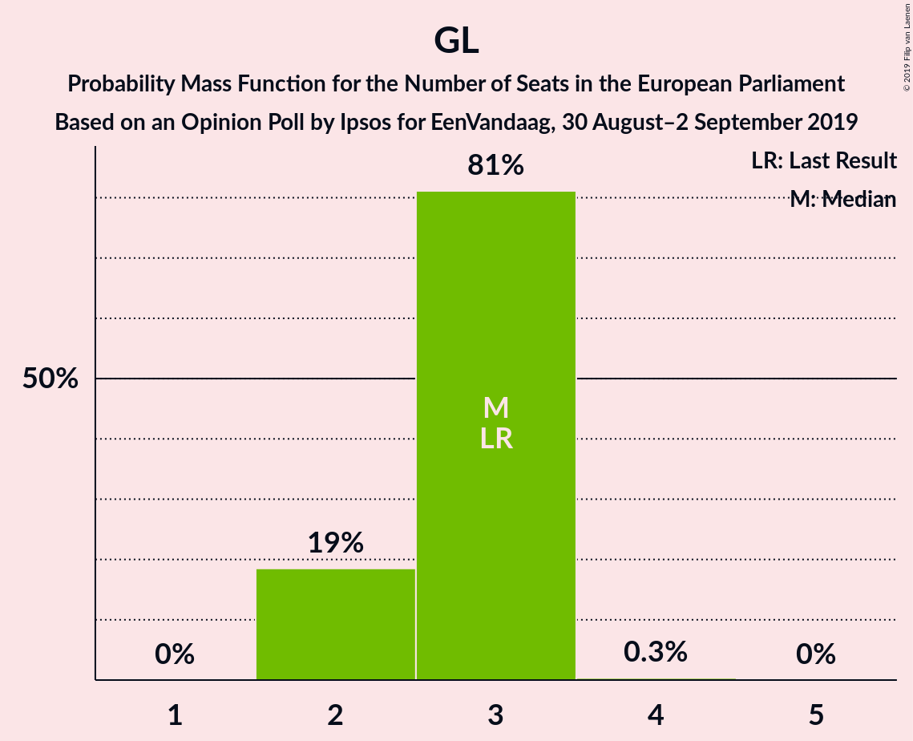

| Number of Seats | Probability | Accumulated | Special Marks |
|:---------------:|:-----------:|:-----------:|:-------------:|
| 2 | 0.9% | 100% |  |
| 3 | 97% | 99.1% | Last Result, Median |
| 4 | 2% | 2% |  |
| 5 | 0.2% | 0.2% |  |
| 6 | 0% | 0% |  |

### Forum voor Democratie (ECR) – Staatkundig Gereformeerde Partij (ECR)

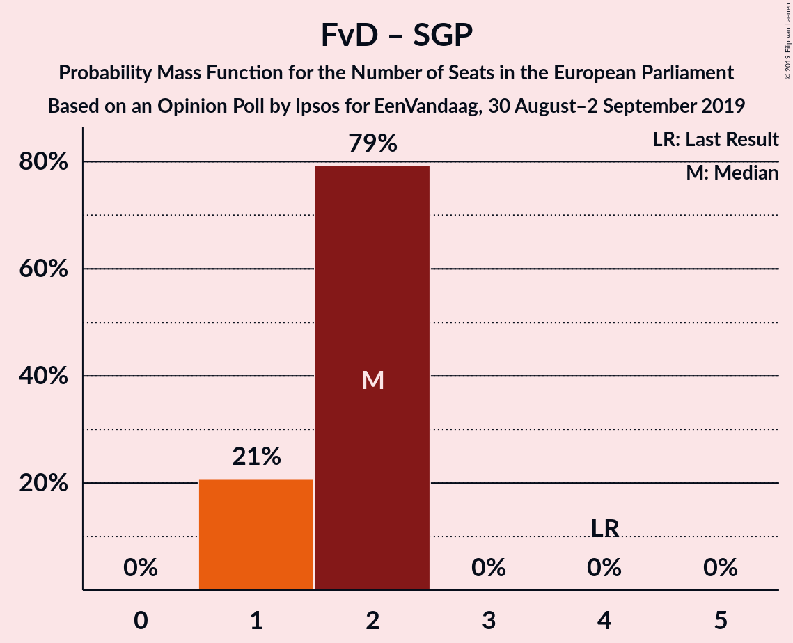

| Number of Seats | Probability | Accumulated | Special Marks |
|:---------------:|:-----------:|:-----------:|:-------------:|
| 1 | 1.4% | 100% |  |
| 2 | 56% | 98.6% | Median |
| 3 | 42% | 42% |  |
| 4 | 0% | 0% | Last Result |

## Technical Information

### Opinion Poll

+ **Polling firm:** Ipsos
+ **Commissioner(s):** EenVandaag
+ **Fieldwork period:** 30 August–2 September 2019

### Calculations

+ **Sample size:** 1001
+ **Simulations done:** 131,072
+ **Error estimate:** 2.73%

