# Opinion Poll by Kantar Public, 15 September 2019

<a href="#voting-intentions">Voting Intentions</a> | <a href="#seats">Seats</a> | <a href="#coalitions">Coalitions</a> | <a href="#technical-information">Technical Information</a>

## Voting Intentions

### Confidence Intervals

| Party | Last Result | Poll Result | 80% Confidence Interval | 90% Confidence Interval | 95% Confidence Interval | 99% Confidence Interval |
|:-----:|:-----------:|:-----------:|:-----------------------:|:-----------------------:|:-----------------------:|:-----------------------:|
| Volkspartij voor Vrijheid en Democratie (RE) | 14.6% | 17.3% | 15.8–19.0% |15.4–19.4% |15.0–19.9% |14.3–20.7% |
| GroenLinks (Greens/EFA) | 10.9% | 12.0% | 10.7–13.4% |10.3–13.8% |10.0–14.2% |9.5–14.9% |
| Partij voor de Vrijheid (ID) | 3.5% | 10.0% | 8.8–11.3% |8.5–11.7% |8.2–12.0% |7.7–12.7% |
| Christen-Democratisch Appèl (EPP) | 12.2% | 9.3% | 8.2–10.7% |7.9–11.0% |7.7–11.4% |7.1–12.0% |
| Partij van de Arbeid (S&D) | 19.0% | 8.7% | 7.6–10.0% |7.3–10.4% |7.1–10.7% |6.6–11.3% |
| Forum voor Democratie (ECR) | 11.0% | 8.7% | 7.6–10.0% |7.3–10.4% |7.1–10.7% |6.6–11.3% |
| Democraten 66 (RE) | 7.1% | 8.0% | 7.0–9.2% |6.7–9.6% |6.4–9.9% |6.0–10.5% |
| Socialistische Partij (GUE/NGL) | 3.4% | 6.7% | 5.8–7.9% |5.5–8.2% |5.3–8.5% |4.9–9.1% |
| 50Plus (EPP) | 3.9% | 6.0% | 5.1–7.1% |4.8–7.4% |4.6–7.7% |4.3–8.2% |
| ChristenUnie (EPP) | 6.8% | 5.4% | 4.5–6.4% |4.3–6.7% |4.1–7.0% |3.7–7.5% |
| Partij voor de Dieren (GUE/NGL) | 4.0% | 4.6% | 3.9–5.6% |3.6–5.9% |3.5–6.1% |3.1–6.7% |
| Staatkundig Gereformeerde Partij (ECR) | 6.8% | 2.6% | 2.1–3.4% |1.9–3.6% |1.8–3.9% |1.5–4.3% |
| DENK (*) | 1.1% | 0.6% | 0.4–1.1% |0.3–1.2% |0.3–1.4% |0.2–1.6% |

*Note:* The poll result column reflects the actual value used in the calculations. Published results may vary slightly, and in addition be rounded to fewer digits.

## Seats

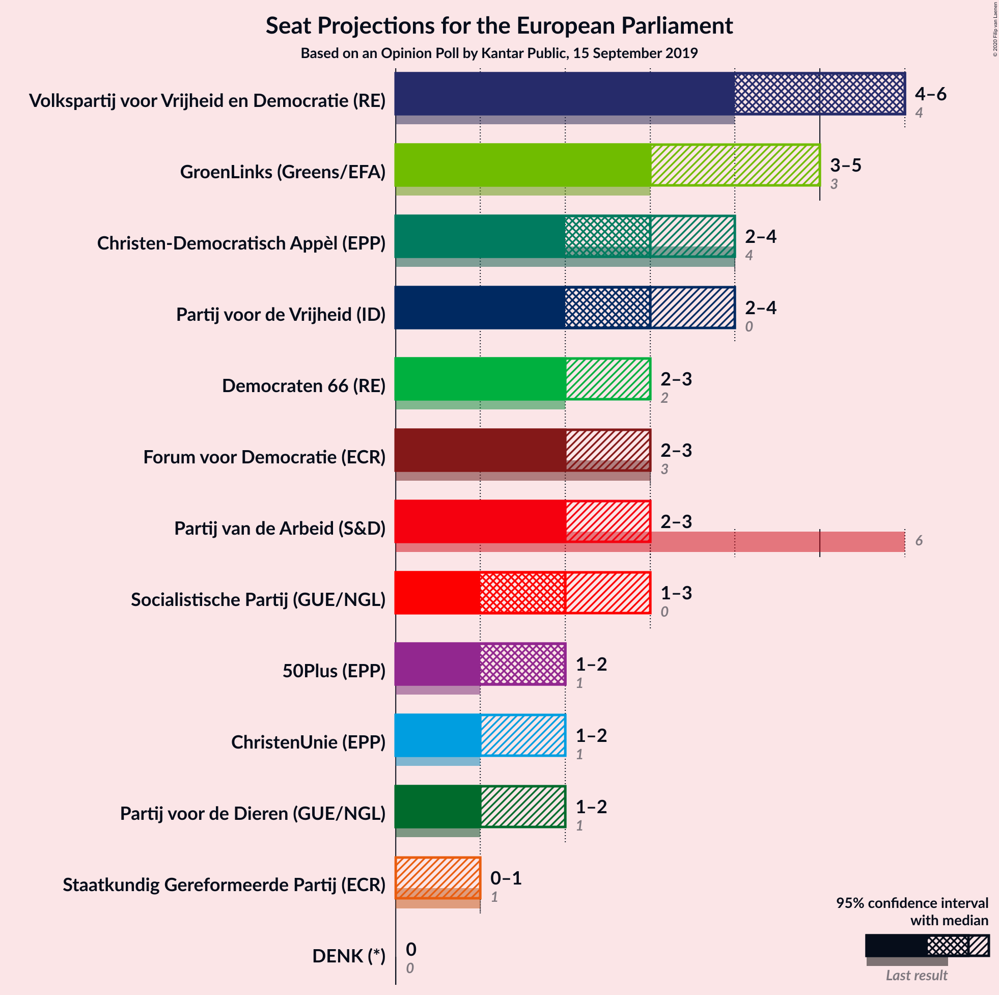

### Confidence Intervals

| Party | Last Result | Median | 80% Confidence Interval | 90% Confidence Interval | 95% Confidence Interval | 99% Confidence Interval |
|:-----:|:-----------:|:------:|:-----------------------:|:-----------------------:|:-----------------------:|:-----------------------:|
| <a href="#volkspartij-voor-vrijheid-en-democratie-(re)">Volkspartij voor Vrijheid en Democratie (RE)</a> | 4 | 6 | 6 |5–6 |5–6 |5–7 |
| <a href="#groenlinks-(greens/efa)">GroenLinks (Greens/EFA)</a> | 3 | 3 | 3 |3–4 |3–4 |3–4 |
| <a href="#partij-voor-de-vrijheid-(id)">Partij voor de Vrijheid (ID)</a> | 0 | 3 | 3 |3 |2–3 |2–4 |
| <a href="#christen-democratisch-appèl-(epp)">Christen-Democratisch Appèl (EPP)</a> | 4 | 3 | 2–3 |2–3 |2–3 |2–3 |
| <a href="#partij-van-de-arbeid-(s&d)">Partij van de Arbeid (S&D)</a> | 6 | 3 | 3 |3 |2–3 |2–4 |
| <a href="#forum-voor-democratie-(ecr)">Forum voor Democratie (ECR)</a> | 3 | 3 | 2–3 |2–3 |2–3 |2–4 |
| <a href="#democraten-66-(re)">Democraten 66 (RE)</a> | 2 | 2 | 2–3 |2–3 |2–3 |1–3 |
| <a href="#socialistische-partij-(gue/ngl)">Socialistische Partij (GUE/NGL)</a> | 0 | 2 | 2 |2 |1–2 |1–3 |
| <a href="#50plus-(epp)">50Plus (EPP)</a> | 1 | 2 | 2 |2 |1–2 |1–2 |
| <a href="#christenunie-(epp)">ChristenUnie (EPP)</a> | 1 | 1 | 1–2 |1–2 |1–2 |1–2 |
| <a href="#partij-voor-de-dieren-(gue/ngl)">Partij voor de Dieren (GUE/NGL)</a> | 1 | 1 | 1 |1 |1–2 |0–2 |
| <a href="#staatkundig-gereformeerde-partij-(ecr)">Staatkundig Gereformeerde Partij (ECR)</a> | 1 | 0 | 0 |0 |0 |0–1 |
| <a href="#denk-(*)">DENK (*)</a> | 0 | 0 | 0 |0 |0 |0 |

### Volkspartij voor Vrijheid en Democratie (RE)

*For a full overview of the results for this party, see the [Volkspartij voor Vrijheid en Democratie (RE)](party-volkspartijvoorvrijheidendemocratiere.html) page.*

| Number of Seats | Probability | Accumulated | Special Marks |
|:---------------:|:-----------:|:-----------:|:-------------:|
| 4 | 0% | 100% | Last Result |
| 5 | 5% | 100% |  |
| 6 | 93% | 95% | Median |
| 7 | 2% | 2% |  |
| 8 | 0% | 0% |  |

### GroenLinks (Greens/EFA)

*For a full overview of the results for this party, see the [GroenLinks (Greens/EFA)](party-groenlinksgreensefa.html) page.*

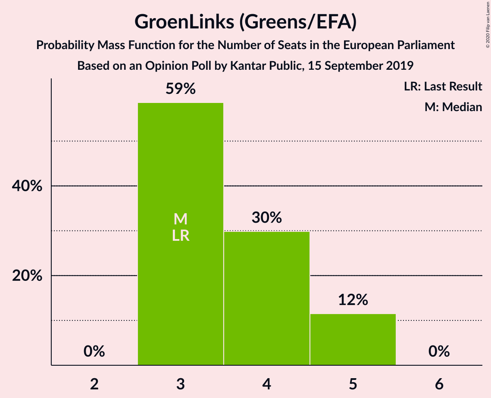

| Number of Seats | Probability | Accumulated | Special Marks |
|:---------------:|:-----------:|:-----------:|:-------------:|
| 3 | 95% | 100% | Last Result, Median |
| 4 | 5% | 5% |  |
| 5 | 0% | 0% |  |

### Partij voor de Vrijheid (ID)

*For a full overview of the results for this party, see the [Partij voor de Vrijheid (ID)](party-partijvoordevrijheidid.html) page.*

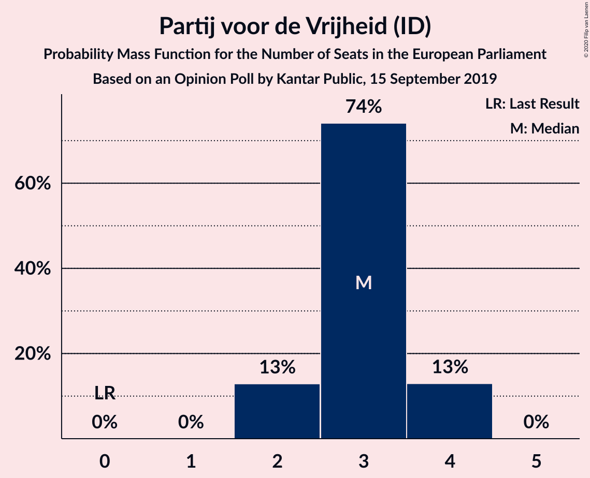

| Number of Seats | Probability | Accumulated | Special Marks |
|:---------------:|:-----------:|:-----------:|:-------------:|
| 0 | 0% | 100% | Last Result |
| 1 | 0% | 100% |  |
| 2 | 3% | 100% |  |
| 3 | 96% | 97% | Median |
| 4 | 0.7% | 1.0% |  |
| 5 | 0.3% | 0.3% |  |
| 6 | 0% | 0% |  |

### Christen-Democratisch Appèl (EPP)

*For a full overview of the results for this party, see the [Christen-Democratisch Appèl (EPP)](party-christen-democratischappèlepp.html) page.*

| Number of Seats | Probability | Accumulated | Special Marks |
|:---------------:|:-----------:|:-----------:|:-------------:|
| 2 | 28% | 100% |  |
| 3 | 72% | 72% | Median |
| 4 | 0.1% | 0.1% | Last Result |
| 5 | 0% | 0% |  |

### Partij van de Arbeid (S&D)

*For a full overview of the results for this party, see the [Partij van de Arbeid (S&D)](party-partijvandearbeidsd.html) page.*

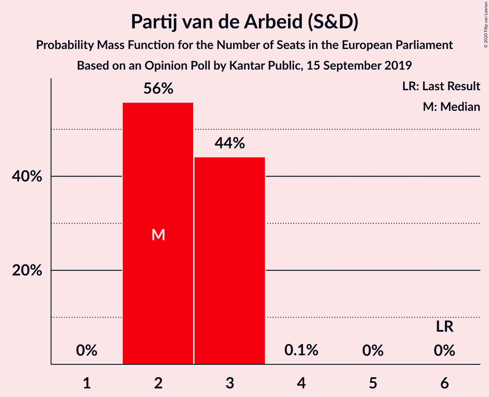

| Number of Seats | Probability | Accumulated | Special Marks |
|:---------------:|:-----------:|:-----------:|:-------------:|
| 2 | 4% | 100% |  |
| 3 | 96% | 96% | Median |
| 4 | 0.5% | 0.5% |  |
| 5 | 0% | 0% |  |
| 6 | 0% | 0% | Last Result |

### Forum voor Democratie (ECR)

*For a full overview of the results for this party, see the [Forum voor Democratie (ECR)](party-forumvoordemocratieecr.html) page.*

| Number of Seats | Probability | Accumulated | Special Marks |
|:---------------:|:-----------:|:-----------:|:-------------:|
| 2 | 26% | 100% |  |
| 3 | 73% | 74% | Last Result, Median |
| 4 | 0.7% | 0.7% |  |
| 5 | 0% | 0% |  |

### Democraten 66 (RE)

*For a full overview of the results for this party, see the [Democraten 66 (RE)](party-democraten66re.html) page.*

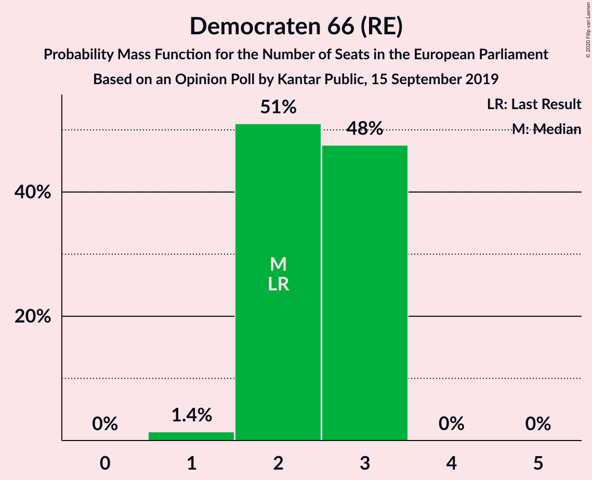

| Number of Seats | Probability | Accumulated | Special Marks |
|:---------------:|:-----------:|:-----------:|:-------------:|
| 1 | 0.6% | 100% |  |
| 2 | 71% | 99.4% | Last Result, Median |
| 3 | 28% | 28% |  |
| 4 | 0% | 0% |  |

### Socialistische Partij (GUE/NGL)

*For a full overview of the results for this party, see the [Socialistische Partij (GUE/NGL)](party-socialistischepartijguengl.html) page.*

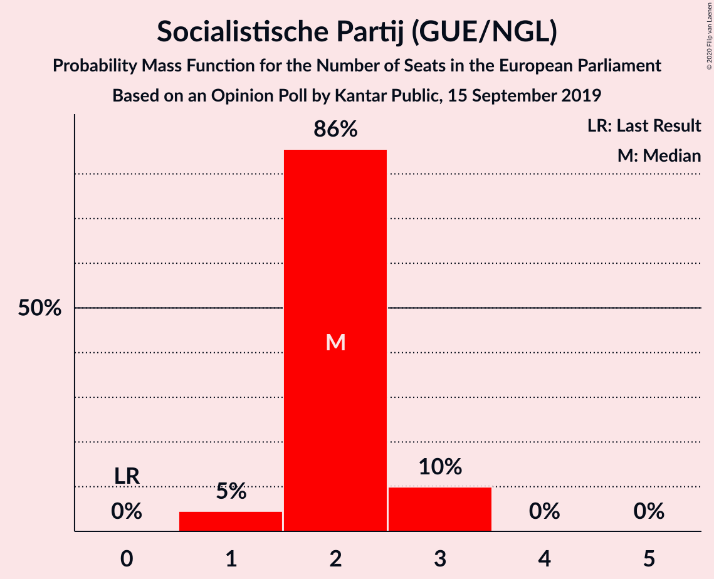

| Number of Seats | Probability | Accumulated | Special Marks |
|:---------------:|:-----------:|:-----------:|:-------------:|
| 0 | 0% | 100% | Last Result |
| 1 | 3% | 100% |  |
| 2 | 95% | 97% | Median |
| 3 | 2% | 2% |  |
| 4 | 0% | 0% |  |

### 50Plus (EPP)

*For a full overview of the results for this party, see the [50Plus (EPP)](party-50plusepp.html) page.*

| Number of Seats | Probability | Accumulated | Special Marks |
|:---------------:|:-----------:|:-----------:|:-------------:|
| 0 | 0.1% | 100% |  |
| 1 | 4% | 99.9% | Last Result |
| 2 | 96% | 96% | Median |
| 3 | 0% | 0% |  |

### ChristenUnie (EPP)

*For a full overview of the results for this party, see the [ChristenUnie (EPP)](party-christenunieepp.html) page.*

| Number of Seats | Probability | Accumulated | Special Marks |
|:---------------:|:-----------:|:-----------:|:-------------:|
| 1 | 69% | 100% | Last Result, Median |
| 2 | 31% | 31% |  |
| 3 | 0% | 0% |  |

### Partij voor de Dieren (GUE/NGL)

*For a full overview of the results for this party, see the [Partij voor de Dieren (GUE/NGL)](party-partijvoordedierenguengl.html) page.*

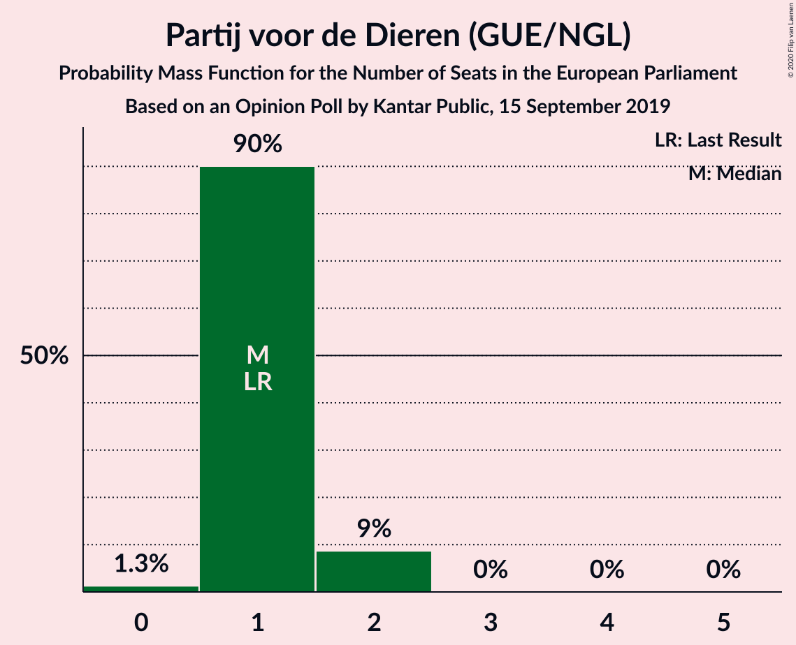

| Number of Seats | Probability | Accumulated | Special Marks |
|:---------------:|:-----------:|:-----------:|:-------------:|
| 0 | 1.1% | 100% |  |
| 1 | 95% | 98.9% | Last Result, Median |
| 2 | 4% | 4% |  |
| 3 | 0% | 0% |  |

### Staatkundig Gereformeerde Partij (ECR)

*For a full overview of the results for this party, see the [Staatkundig Gereformeerde Partij (ECR)](party-staatkundiggereformeerdepartijecr.html) page.*

| Number of Seats | Probability | Accumulated | Special Marks |
|:---------------:|:-----------:|:-----------:|:-------------:|
| 0 | 98% | 100% | Median |
| 1 | 2% | 2% | Last Result |
| 2 | 0% | 0% |  |

### DENK (*)

*For a full overview of the results for this party, see the [DENK (*)](party-denk.html) page.*

| Number of Seats | Probability | Accumulated | Special Marks |
|:---------------:|:-----------:|:-----------:|:-------------:|
| 0 | 100% | 100% | Last Result, Median |

## Coalitions

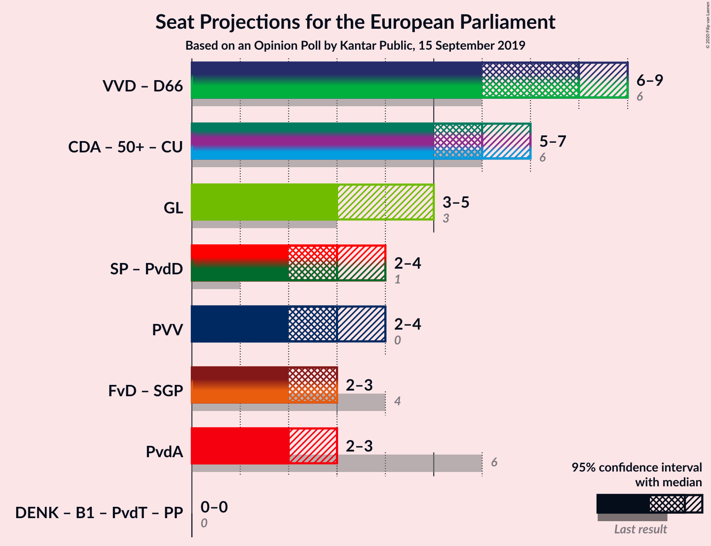

### Confidence Intervals

| Coalition | Last Result | Median | Majority? | 80% Confidence Interval | 90% Confidence Interval | 95% Confidence Interval | 99% Confidence Interval |
|:---------:|:-----------:|:------:|:---------:|:-----------------------:|:-----------------------:|:-----------------------:|:-----------------------:|
| Volkspartij voor Vrijheid en Democratie (RE) – Democraten 66 (RE) | 6 | 8 | 0% | 8–9 | 8–9 | 7–9 | 7–9 |
| Christen-Democratisch Appèl (EPP) – 50Plus (EPP) – ChristenUnie (EPP) | 6 | 6 | 0% | 6 | 6 | 5–6 | 5–7 |
| GroenLinks (Greens/EFA) | 3 | 3 | 0% | 3 | 3–4 | 3–4 | 3–4 |
| Socialistische Partij (GUE/NGL) – Partij voor de Dieren (GUE/NGL) | 1 | 3 | 0% | 3 | 3–4 | 2–4 | 2–4 |
| Forum voor Democratie (ECR) – Staatkundig Gereformeerde Partij (ECR) | 4 | 3 | 0% | 2–3 | 2–3 | 2–3 | 2–4 |
| Partij van de Arbeid (S&D) | 6 | 3 | 0% | 3 | 3 | 2–3 | 2–4 |
| Partij voor de Vrijheid (ID) | 0 | 3 | 0% | 3 | 3 | 2–3 | 2–4 |

### Volkspartij voor Vrijheid en Democratie (RE) – Democraten 66 (RE)

| Number of Seats | Probability | Accumulated | Special Marks |
|:---------------:|:-----------:|:-----------:|:-------------:|
| 6 | 0% | 100% | Last Result |
| 7 | 3% | 100% |  |
| 8 | 71% | 97% | Median |
| 9 | 27% | 27% |  |
| 10 | 0% | 0.1% |  |
| 11 | 0% | 0% |  |

### Christen-Democratisch Appèl (EPP) – 50Plus (EPP) – ChristenUnie (EPP)

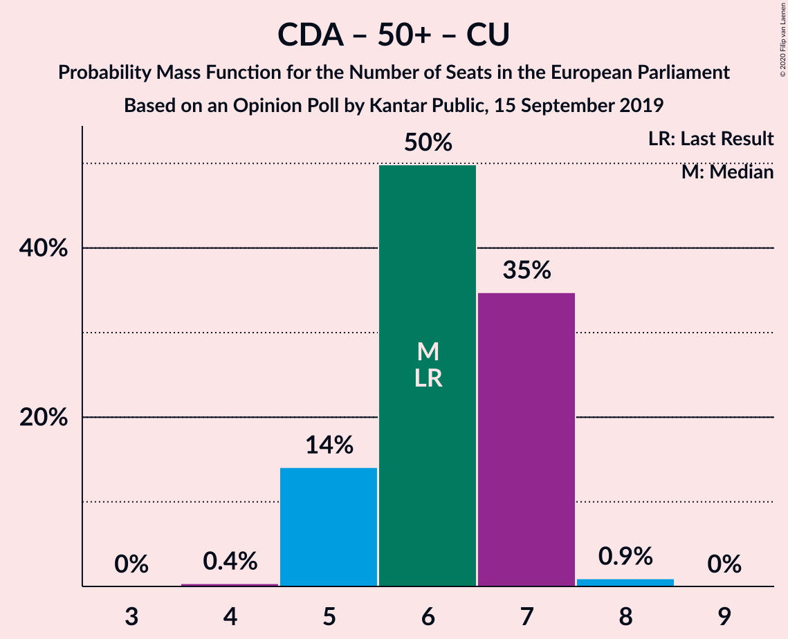

| Number of Seats | Probability | Accumulated | Special Marks |
|:---------------:|:-----------:|:-----------:|:-------------:|
| 4 | 0.2% | 100% |  |
| 5 | 4% | 99.8% |  |
| 6 | 94% | 96% | Last Result, Median |
| 7 | 2% | 2% |  |
| 8 | 0% | 0% |  |

### GroenLinks (Greens/EFA)

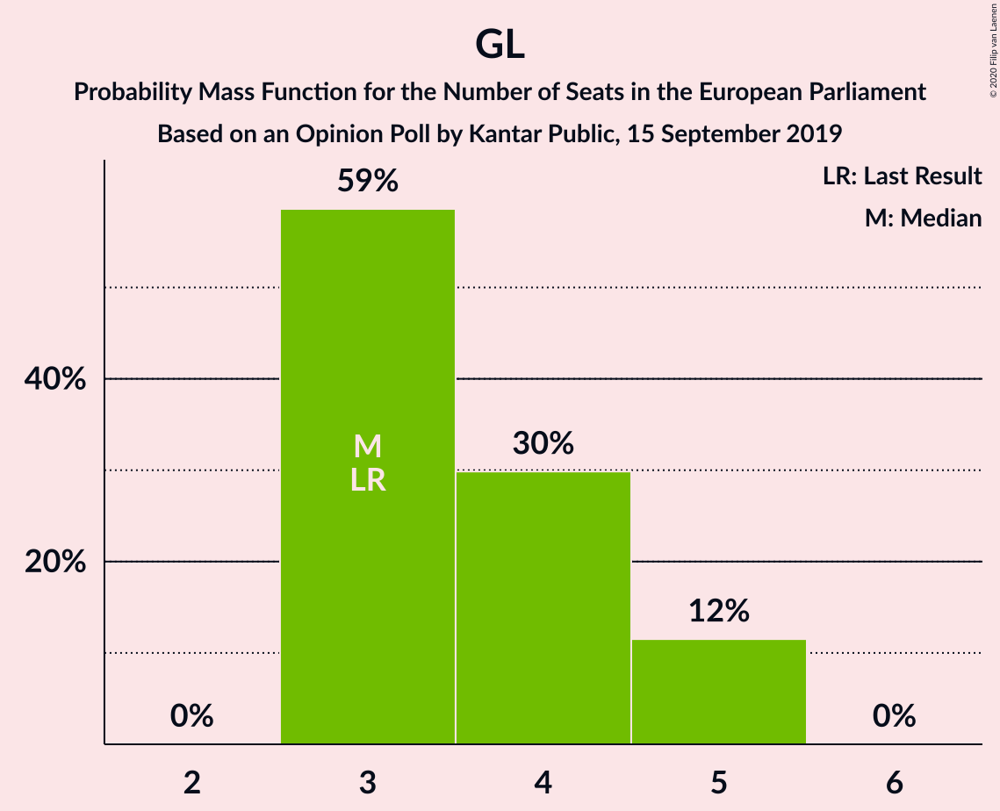

| Number of Seats | Probability | Accumulated | Special Marks |
|:---------------:|:-----------:|:-----------:|:-------------:|
| 3 | 95% | 100% | Last Result, Median |
| 4 | 5% | 5% |  |
| 5 | 0% | 0% |  |

### Socialistische Partij (GUE/NGL) – Partij voor de Dieren (GUE/NGL)

| Number of Seats | Probability | Accumulated | Special Marks |
|:---------------:|:-----------:|:-----------:|:-------------:|
| 1 | 0.2% | 100% | Last Result |
| 2 | 3% | 99.8% |  |
| 3 | 91% | 97% | Median |
| 4 | 5% | 5% |  |
| 5 | 0% | 0% |  |

### Forum voor Democratie (ECR) – Staatkundig Gereformeerde Partij (ECR)

| Number of Seats | Probability | Accumulated | Special Marks |
|:---------------:|:-----------:|:-----------:|:-------------:|
| 2 | 26% | 100% |  |
| 3 | 72% | 74% | Median |
| 4 | 1.2% | 2% | Last Result |
| 5 | 0.5% | 0.5% |  |
| 6 | 0% | 0% |  |

### Partij van de Arbeid (S&D)

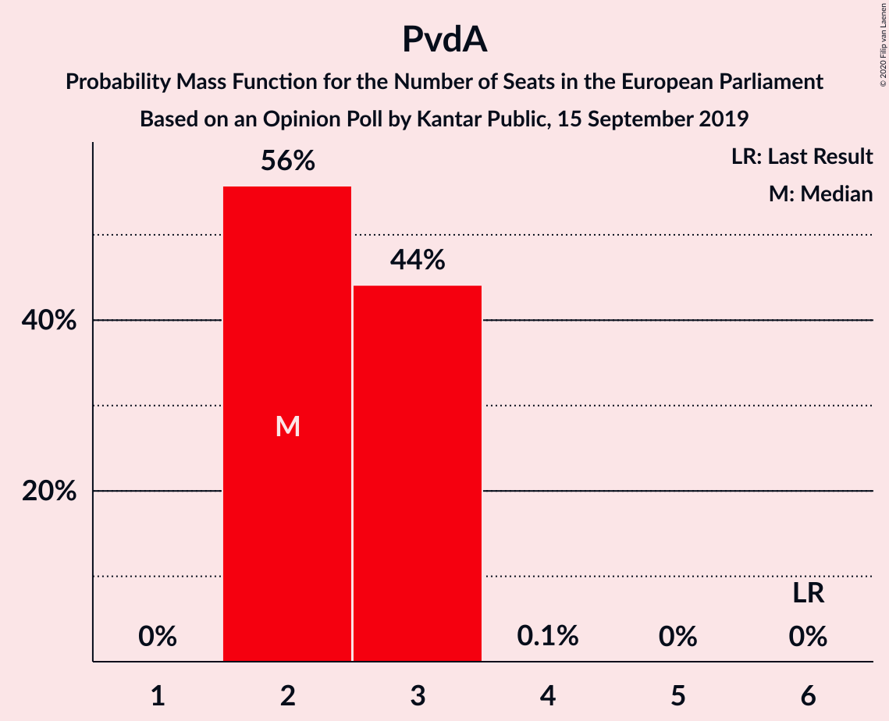

| Number of Seats | Probability | Accumulated | Special Marks |
|:---------------:|:-----------:|:-----------:|:-------------:|
| 2 | 4% | 100% |  |
| 3 | 96% | 96% | Median |
| 4 | 0.5% | 0.5% |  |
| 5 | 0% | 0% |  |
| 6 | 0% | 0% | Last Result |

### Partij voor de Vrijheid (ID)

| Number of Seats | Probability | Accumulated | Special Marks |
|:---------------:|:-----------:|:-----------:|:-------------:|
| 0 | 0% | 100% | Last Result |
| 1 | 0% | 100% |  |
| 2 | 3% | 100% |  |
| 3 | 96% | 97% | Median |
| 4 | 0.7% | 1.0% |  |
| 5 | 0.3% | 0.3% |  |
| 6 | 0% | 0% |  |

## Technical Information

### Opinion Poll

+ **Polling firm:** Kantar Public
+ **Commissioner(s):** —
+ **Fieldwork period:** 15 September 2019

### Calculations

+ **Sample size:** 953
+ **Simulations done:** 131,072
+ **Error estimate:** 1.95%

