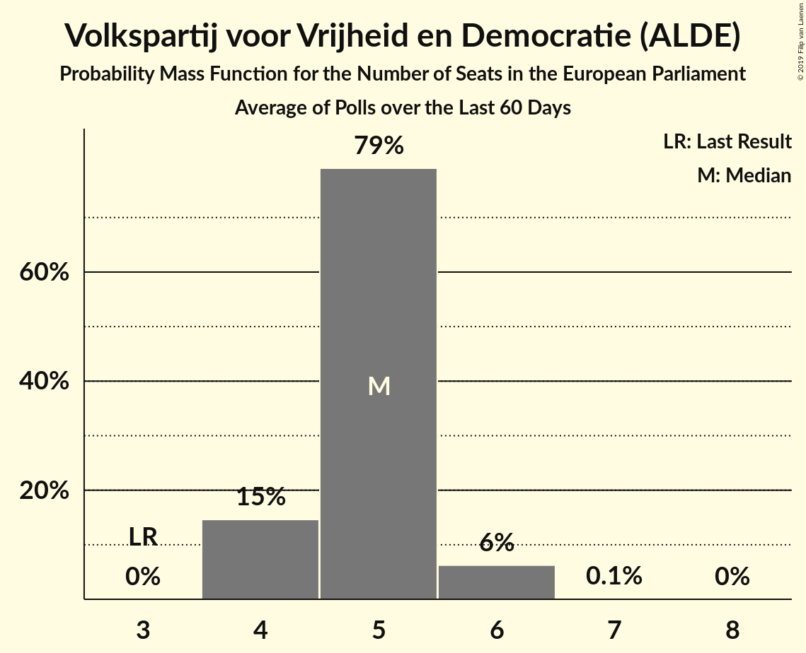

# Volkspartij voor Vrijheid en Democratie (ALDE)

<a href="#voting-intentions">Voting Intentions</a> | <a href="#seats">Seats</a>

## Voting Intentions

Last result: **12.0%** (General Election of 22 May 2014)

### Confidence Intervals

| Period     | Polling firm/Commissioner(s) | Median | 80% Confidence Interval | 90% Confidence Interval | 95% Confidence Interval | 99% Confidence Interval |
|:----------:|:----------------:|:-----------:|:-----------------------:|:-----------------------:|:-----------------------:|:-----------------------:|
| N/A | [Poll Average](average.html) | 16.3% | 14.8–18.6% | 14.5–19.2% | 14.3–19.8% | 13.8–20.7% |
| [13–19 May 2019](2019-05-19-Peilnl.html) | Peil.nl | 15.2% | 14.4–16.1% | 14.2–16.4% | 14.0–16.6% | 13.6–17.0% |
| [9–14 May 2019](2019-05-14-IOResearch.html) | I&O Research | 15.9% | 14.8–17.1% | 14.5–17.5% | 14.2–17.8% | 13.7–18.4% |
| [12–13 May 2019](2019-05-13-Ipsos.html) | Ipsos   EenVandaag | 16.8% | 15.4–18.4% | 15.0–18.9% | 14.7–19.3% | 14.0–20.1% |
| [6–12 May 2019](2019-05-12-Peilnl.html) | Peil.nl | 16.0% | 15.2–16.9% | 14.9–17.1% | 14.7–17.4% | 14.3–17.8% |
| [29 April–5 May 2019](2019-05-05-Peilnl.html) | Peil.nl | 15.3% | 14.5–16.2% | 14.3–16.5% | 14.1–16.7% | 13.7–17.1% |
| [26–29 April 2019](2019-04-29-Ipsos.html) | Ipsos   EenVandaag | 18.1% | 16.7–19.7% | 16.3–20.2% | 15.9–20.6% | 15.2–21.4% |
| [22–28 April 2019](2019-04-28-Peilnl.html) | Peil.nl | 14.7% | 13.9–15.5% | 13.6–15.8% | 13.4–16.0% | 13.1–16.4% |
| [17–25 April 2019](2019-04-25-KantarPublic.html) | Kantar Public | 18.0% | 16.5–19.7% | 16.1–20.2% | 15.7–20.6% | 15.0–21.4% |
| [19–24 April 2019](2019-04-24-IOResearch.html) | I&O Research | 17.2% | 16.1–18.5% | 15.8–18.8% | 15.5–19.1% | 15.0–19.7% |
| [15–21 April 2019](2019-04-21-Peilnl.html) | Peil.nl | 14.7% | 13.9–15.5% | 13.6–15.8% | 13.4–16.0% | 13.1–16.4% |
| [8–14 April 2019](2019-04-14-Peilnl.html) | Peil.nl | 14.7% | 13.9–15.5% | 13.6–15.8% | 13.4–16.0% | 13.1–16.4% |
| [1–7 April 2019](2019-04-07-Peilnl.html) | Peil.nl | 14.7% | 13.9–15.5% | 13.6–15.8% | 13.4–16.0% | 13.1–16.4% |
| [25–31 March 2019](2019-03-31-Peilnl.html) | Peil.nl | 15.3% | 14.5–16.2% | 14.3–16.5% | 14.1–16.7% | 13.7–17.1% |
| [18–24 March 2019](2019-03-24-Peilnl.html) | Peil.nl | 15.3% | 14.5–16.2% | 14.3–16.5% | 14.1–16.7% | 13.7–17.1% |
| [11–17 March 2019](2019-03-17-Peilnl.html) | Peil.nl | 14.7% | 13.9–15.5% | 13.6–15.8% | 13.4–16.0% | 13.1–16.4% |
| [8–12 March 2019](2019-03-12-IOResearch.html) | I&O Research | 15.8% | 14.8–16.9% | 14.5–17.2% | 14.3–17.4% | 13.8–17.9% |
| [4–10 March 2019](2019-03-10-Peilnl.html) | Peil.nl | 15.3% | 14.5–16.2% | 14.3–16.5% | 14.1–16.7% | 13.7–17.1% |
| [25 February–3 March 2019](2019-03-03-Peilnl.html) | Peil.nl | 15.3% | N/A | N/A | N/A | N/A |
| [22–26 February 2019](2019-02-26-IOResearch.html) | I&O Research | 15.3% | N/A | N/A | N/A | N/A |
| [18–24 February 2019](2019-02-24-Peilnl.html) | Peil.nl | 14.7% | N/A | N/A | N/A | N/A |
| [22–24 February 2019](2019-02-24-Ipsos.html) | Ipsos   EenVandaag | 18.4% | 16.9–20.1% | 16.5–20.5% | 16.2–20.9% | 15.5–21.7% |
| [11–17 February 2019](2019-02-17-Peilnl.html) | Peil.nl | 15.3% | N/A | N/A | N/A | N/A |
| [4–10 February 2019](2019-02-10-Peilnl.html) | Peil.nl | 15.3% | N/A | N/A | N/A | N/A |
| [28 January–3 February 2019](2019-02-03-Peilnl.html) | Peil.nl | 14.7% | N/A | N/A | N/A | N/A |
| [25–28 January 2019](2019-01-28-Ipsos.html) | Ipsos   EenVandaag | 17.5% | N/A | N/A | N/A | N/A |
| [21–27 January 2019](2019-01-27-Peilnl.html) | Peil.nl | 14.7% | N/A | N/A | N/A | N/A |
| [18–22 January 2019](2019-01-22-IOResearch.html) | I&O Research | 16.3% | N/A | N/A | N/A | N/A |
| [14–20 January 2019](2019-01-20-Peilnl.html) | Peil.nl | 14.7% | N/A | N/A | N/A | N/A |
| [7–13 January 2019](2019-01-13-Peilnl.html) | Peil.nl | 14.7% | N/A | N/A | N/A | N/A |
| [14–17 December 2018](2018-12-17-Ipsos.html) | Ipsos   EenVandaag | 18.6% | N/A | N/A | N/A | N/A |
| [10–16 December 2018](2018-12-16-Peilnl.html) | Peil.nl | 14.7% | N/A | N/A | N/A | N/A |
| [7–11 December 2018](2018-12-11-KantarPublic.html) | Kantar Public | 20.0% | N/A | N/A | N/A | N/A |
| [3–9 December 2018](2018-12-09-Peilnl.html) | Peil.nl | 14.7% | N/A | N/A | N/A | N/A |
| [26 November–2 December 2018](2018-12-02-Peilnl.html) | Peil.nl | 15.3% | N/A | N/A | N/A | N/A |
| [22–27 November 2018](2018-11-27-IOResearch.html) | I&O Research | 17.1% | N/A | N/A | N/A | N/A |
| [23–26 November 2018](2018-11-26-Ipsos.html) | Ipsos   EenVandaag | 18.7% | N/A | N/A | N/A | N/A |
| [19–25 November 2018](2018-11-25-Peilnl.html) | Peil.nl | 15.3% | N/A | N/A | N/A | N/A |
| [12–18 November 2018](2018-11-18-Peilnl.html) | Peil.nl | 16.0% | N/A | N/A | N/A | N/A |
| [5–11 November 2018](2018-11-11-Peilnl.html) | Peil.nl | 16.0% | N/A | N/A | N/A | N/A |
| [29 October–4 November 2018](2018-11-04-Peilnl.html) | Peil.nl | 16.0% | N/A | N/A | N/A | N/A |
| [26–29 October 2018](2018-10-29-Ipsos.html) | Ipsos   EenVandaag | 20.1% | N/A | N/A | N/A | N/A |
| [22–28 October 2018](2018-10-28-Peilnl.html) | Peil.nl | 16.0% | N/A | N/A | N/A | N/A |
| [15–21 October 2018](2018-10-21-Peilnl.html) | Peil.nl | 16.0% | N/A | N/A | N/A | N/A |
| [8–14 October 2018](2018-10-14-Peilnl.html) | Peil.nl | 16.0% | N/A | N/A | N/A | N/A |
| [1–7 October 2018](2018-10-07-Peilnl.html) | Peil.nl | 16.0% | N/A | N/A | N/A | N/A |
| [24–30 September 2018](2018-09-30-Peilnl.html) | Peil.nl | 17.3% | N/A | N/A | N/A | N/A |
| [17–23 September 2018](2018-09-23-Peilnl.html) | Peil.nl | 17.3% | N/A | N/A | N/A | N/A |
| [21–23 September 2018](2018-09-23-Ipsos.html) | Ipsos   EenVandaag | 20.1% | N/A | N/A | N/A | N/A |
| [10–16 September 2018](2018-09-16-Peilnl.html) | Peil.nl | 17.3% | N/A | N/A | N/A | N/A |
| [13–16 September 2018](2018-09-16-KantarPublic.html) | Kantar Public | 18.0% | N/A | N/A | N/A | N/A |
| [7–11 September 2018](2018-09-11-IOResearch.html) | I&O Research | 17.1% | N/A | N/A | N/A | N/A |
| [3–9 September 2018](2018-09-09-Peilnl.html) | Peil.nl | 18.0% | N/A | N/A | N/A | N/A |
| [31 August–3 September 2018](2018-09-03-Ipsos.html) | Ipsos   EenVandaag | 20.3% | N/A | N/A | N/A | N/A |
| [27 August–2 September 2018](2018-09-02-Peilnl.html) | Peil.nl | 19.3% | N/A | N/A | N/A | N/A |
| [20–26 August 2018](2018-08-26-Peilnl.html) | Peil.nl | 19.3% | N/A | N/A | N/A | N/A |
| [13–19 August 2018](2018-08-19-Peilnl.html) | Peil.nl | 19.3% | N/A | N/A | N/A | N/A |
| [27–30 July 2018](2018-07-30-Ipsos.html) | Ipsos   EenVandaag | 21.5% | N/A | N/A | N/A | N/A |
| [2–8 July 2018](2018-07-08-Peilnl.html) | Peil.nl | 20.0% | N/A | N/A | N/A | N/A |
| [25 June–1 July 2018](2018-07-01-Peilnl.html) | Peil.nl | 18.7% | N/A | N/A | N/A | N/A |
| [13–29 June 2018](2018-06-29-IOResearch.html) | I&O Research | 17.5% | N/A | N/A | N/A | N/A |
| [22–25 June 2018](2018-06-25-Ipsos.html) | Ipsos   EenVandaag | 20.4% | N/A | N/A | N/A | N/A |
| [18–24 June 2018](2018-06-24-Peilnl.html) | Peil.nl | 18.0% | N/A | N/A | N/A | N/A |
| [11–17 June 2018](2018-06-17-Peilnl.html) | Peil.nl | 18.0% | N/A | N/A | N/A | N/A |
| [13 June 2018](2018-06-13-KantarPublic.html) | Kantar Public | 21.4% | N/A | N/A | N/A | N/A |
| [4–10 June 2018](2018-06-10-Peilnl.html) | Peil.nl | 18.0% | N/A | N/A | N/A | N/A |
| [28 May–3 June 2018](2018-06-03-Peilnl.html) | Peil.nl | 17.3% | N/A | N/A | N/A | N/A |
| [25–28 May 2018](2018-05-28-Ipsos.html) | Ipsos   EenVandaag | 20.5% | N/A | N/A | N/A | N/A |
| [21–27 May 2018](2018-05-27-Peilnl.html) | Peil.nl | 17.3% | N/A | N/A | N/A | N/A |
| [14–20 May 2018](2018-05-20-Peilnl.html) | Peil.nl | 16.7% | N/A | N/A | N/A | N/A |
| [7–13 May 2018](2018-05-13-Peilnl.html) | Peil.nl | 16.7% | N/A | N/A | N/A | N/A |
| [30 April–6 May 2018](2018-05-06-Peilnl.html) | Peil.nl | 16.0% | N/A | N/A | N/A | N/A |
| [23–29 April 2018](2018-04-29-Peilnl.html) | Peil.nl | 16.0% | N/A | N/A | N/A | N/A |
| [20–23 April 2018](2018-04-23-Ipsos.html) | Ipsos   EenVandaag | 21.7% | N/A | N/A | N/A | N/A |
| [16–22 April 2018](2018-04-22-Peilnl.html) | Peil.nl | 16.7% | N/A | N/A | N/A | N/A |
| [9–15 April 2018](2018-04-15-Peilnl.html) | Peil.nl | 16.7% | N/A | N/A | N/A | N/A |
| [2–8 April 2018](2018-04-08-Peilnl.html) | Peil.nl | 16.7% | N/A | N/A | N/A | N/A |
| [26 March–1 April 2018](2018-04-01-Peilnl.html) | Peil.nl | 16.0% | N/A | N/A | N/A | N/A |
| [19–25 March 2018](2018-03-25-Peilnl.html) | Peil.nl | 16.0% | N/A | N/A | N/A | N/A |
| [19 March 2018](2018-03-19-Ipsos.html) | Ipsos   EenVandaag | 21.0% | 19.5–22.6% | 19.1–23.0% | 18.7–23.4% | 18.0–24.2% |
| [12–18 March 2018](2018-03-18-Peilnl.html) | Peil.nl | 17.3% | N/A | N/A | N/A | N/A |
| [8–12 March 2018](2018-03-12-IOResearch.html) | I&O Research | 17.7% | N/A | N/A | N/A | N/A |
| [5–11 March 2018](2018-03-11-Peilnl.html) | Peil.nl | 16.7% | N/A | N/A | N/A | N/A |
| [26 February–4 March 2018](2018-03-04-Peilnl.html) | Peil.nl | 17.3% | N/A | N/A | N/A | N/A |
| [27 February–4 March 2018](2018-03-04-KantarPublic.html) | Kantar Public | 20.0% | 18.5–21.7% | 18.0–22.1% | 17.7–22.5% | 17.0–23.4% |
| [23–26 February 2018](2018-02-26-Ipsos.html) | Ipsos   EenVandaag | 19.9% | 18.4–21.6% | 17.9–22.0% | 17.5–22.5% | 16.8–23.3% |
| [19–25 February 2018](2018-02-25-Peilnl.html) | Peil.nl | 17.3% | N/A | N/A | N/A | N/A |
| [12–18 February 2018](2018-02-18-Peilnl.html) | Peil.nl | 18.0% | N/A | N/A | N/A | N/A |
| [5–11 February 2018](2018-02-11-Peilnl.html) | Peil.nl | 18.0% | N/A | N/A | N/A | N/A |
| [2–6 February 2018](2018-02-06-IOResearch.html) | I&O Research | 18.9% | 18.0–19.7% | 17.8–20.0% | 17.6–20.2% | 17.2–20.6% |
| [29 January–4 February 2018](2018-02-04-Peilnl.html) | Peil.nl | 18.0% | N/A | N/A | N/A | N/A |
| [26–29 January 2018](2018-01-29-Ipsos.html) | Ipsos   EenVandaag | 20.7% | 19.1–22.3% | 18.7–22.8% | 18.3–23.2% | 17.6–24.1% |
| [22–28 January 2018](2018-01-28-Peilnl.html) | Peil.nl | 18.0% | N/A | N/A | N/A | N/A |
| [25–28 January 2018](2018-01-28-KantarPublic.html) | Kantar Public | 18.7% | 17.3–20.2% | 16.9–20.7% | 16.5–21.0% | 15.9–21.8% |
| [15–21 January 2018](2018-01-21-Peilnl.html) | Peil.nl | 18.0% | N/A | N/A | N/A | N/A |
| [8–14 January 2018](2018-01-14-Peilnl.html) | Peil.nl | 18.0% | N/A | N/A | N/A | N/A |
| [18–24 December 2017](2017-12-24-Peilnl.html) | Peil.nl | 18.0% | N/A | N/A | N/A | N/A |
| [15–18 December 2017](2017-12-18-GfK.html) | GfK   EenVandaag | 19.3% | 18.2–20.5% | 17.9–20.9% | 17.6–21.2% | 17.1–21.7% |

### Probability Mass Function

The following table shows the probability mass function per percentage block of voting intentions for the [poll average](average.html) for Volkspartij voor Vrijheid en Democratie (ALDE).

| Voting Intentions | Probability | Accumulated | Special Marks |
|:-----------------:|:-----------:|:-----------:|:-------------:|
| 11.5–12.5% | 0% | 100% | Last Result |
| 12.5–13.5% | 0.2% | 100% |  |
| 13.5–14.5% | 5% | 99.8% |  |
| 14.5–15.5% | 23% | 95% |  |
| 15.5–16.5% | 27% | 71% | Median |
| 16.5–17.5% | 20% | 45% |  |
| 17.5–18.5% | 14% | 25% |  |
| 18.5–19.5% | 8% | 11% |  |
| 19.5–20.5% | 3% | 3% |  |
| 20.5–21.5% | 0.6% | 0.7% |  |
| 21.5–22.5% | 0.1% | 0.1% |  |
| 22.5–23.5% | 0% | 0% |  |

## Seats

Last result: **3** seats (General Election of 22 May 2014)

### Confidence Intervals

| Period     | Polling firm/Commissioner(s) | Median | 80% Confidence Interval | 90% Confidence Interval | 95% Confidence Interval | 99% Confidence Interval |
|:----------:|:----------------:|:------:|:-----------------------:|:-----------------------:|:-----------------------:|:-----------------------:|
| N/A | [Poll Average](average.html) | 5 | 4–5 | 4–6 | 4–6 | 4–6 |
| [13–19 May 2019](2019-05-19-Peilnl.html) | Peil.nl | 5 | 4–5 | 4–5 | 4–5 | 4–5 |
| [9–14 May 2019](2019-05-14-IOResearch.html) | I&O Research | 5 | 4–5 | 4–5 | 4–5 | 4–6 |
| [12–13 May 2019](2019-05-13-Ipsos.html) | Ipsos   EenVandaag | 5 | 4–6 | 4–6 | 4–6 | 4–6 |
| [6–12 May 2019](2019-05-12-Peilnl.html) | Peil.nl | 5 | 5 | 4–5 | 4–5 | 4–5 |
| [29 April–5 May 2019](2019-05-05-Peilnl.html) | Peil.nl | 5 | 4–5 | 4–5 | 4–5 | 4–5 |
| [26–29 April 2019](2019-04-29-Ipsos.html) | Ipsos   EenVandaag | 6 | 5–6 | 5–6 | 5–6 | 5–6 |
| [22–28 April 2019](2019-04-28-Peilnl.html) | Peil.nl | 4 | 4–5 | 4–5 | 4–5 | 4–5 |
| [17–25 April 2019](2019-04-25-KantarPublic.html) | Kantar Public | 5 | 5 | 5–6 | 5–6 | 5–6 |
| [19–24 April 2019](2019-04-24-IOResearch.html) | I&O Research | 5 | 5–6 | 5–6 | 5–6 | 4–6 |
| [15–21 April 2019](2019-04-21-Peilnl.html) | Peil.nl | 4 | 4–5 | 4–5 | 4–5 | 4–5 |
| [8–14 April 2019](2019-04-14-Peilnl.html) | Peil.nl | 4 | 4–5 | 4–5 | 4–5 | 4–5 |
| [1–7 April 2019](2019-04-07-Peilnl.html) | Peil.nl | 4 | 4–5 | 4–5 | 4–5 | 4–5 |
| [25–31 March 2019](2019-03-31-Peilnl.html) | Peil.nl | 4 | 4–5 | 4–5 | 4–5 | 4–5 |
| [18–24 March 2019](2019-03-24-Peilnl.html) | Peil.nl | 5 | 5 | 5 | 5 | 5 |
| [11–17 March 2019](2019-03-17-Peilnl.html) | Peil.nl | 5 | 5 | 5 | 5 | 4–5 |
| [8–12 March 2019](2019-03-12-IOResearch.html) | I&O Research | 5 | 5 | 4–5 | 4–5 | 4–5 |
| [4–10 March 2019](2019-03-10-Peilnl.html) | Peil.nl | 5 | 4–5 | 4–5 | 4–5 | 4–5 |
| [25 February–3 March 2019](2019-03-03-Peilnl.html) | Peil.nl |  |  |  |  |  |
| [22–26 February 2019](2019-02-26-IOResearch.html) | I&O Research |  |  |  |  |  |
| [18–24 February 2019](2019-02-24-Peilnl.html) | Peil.nl |  |  |  |  |  |
| [22–24 February 2019](2019-02-24-Ipsos.html) | Ipsos   EenVandaag | 6 | 5–6 | 5–6 | 5–6 | 4–7 |
| [11–17 February 2019](2019-02-17-Peilnl.html) | Peil.nl |  |  |  |  |  |
| [4–10 February 2019](2019-02-10-Peilnl.html) | Peil.nl |  |  |  |  |  |
| [28 January–3 February 2019](2019-02-03-Peilnl.html) | Peil.nl |  |  |  |  |  |
| [25–28 January 2019](2019-01-28-Ipsos.html) | Ipsos   EenVandaag |  |  |  |  |  |
| [21–27 January 2019](2019-01-27-Peilnl.html) | Peil.nl |  |  |  |  |  |
| [18–22 January 2019](2019-01-22-IOResearch.html) | I&O Research |  |  |  |  |  |
| [14–20 January 2019](2019-01-20-Peilnl.html) | Peil.nl |  |  |  |  |  |
| [7–13 January 2019](2019-01-13-Peilnl.html) | Peil.nl |  |  |  |  |  |
| [14–17 December 2018](2018-12-17-Ipsos.html) | Ipsos   EenVandaag |  |  |  |  |  |
| [10–16 December 2018](2018-12-16-Peilnl.html) | Peil.nl |  |  |  |  |  |
| [7–11 December 2018](2018-12-11-KantarPublic.html) | Kantar Public |  |  |  |  |  |
| [3–9 December 2018](2018-12-09-Peilnl.html) | Peil.nl |  |  |  |  |  |
| [26 November–2 December 2018](2018-12-02-Peilnl.html) | Peil.nl |  |  |  |  |  |
| [22–27 November 2018](2018-11-27-IOResearch.html) | I&O Research |  |  |  |  |  |
| [23–26 November 2018](2018-11-26-Ipsos.html) | Ipsos   EenVandaag |  |  |  |  |  |
| [19–25 November 2018](2018-11-25-Peilnl.html) | Peil.nl |  |  |  |  |  |
| [12–18 November 2018](2018-11-18-Peilnl.html) | Peil.nl |  |  |  |  |  |
| [5–11 November 2018](2018-11-11-Peilnl.html) | Peil.nl |  |  |  |  |  |
| [29 October–4 November 2018](2018-11-04-Peilnl.html) | Peil.nl |  |  |  |  |  |
| [26–29 October 2018](2018-10-29-Ipsos.html) | Ipsos   EenVandaag |  |  |  |  |  |
| [22–28 October 2018](2018-10-28-Peilnl.html) | Peil.nl |  |  |  |  |  |
| [15–21 October 2018](2018-10-21-Peilnl.html) | Peil.nl |  |  |  |  |  |
| [8–14 October 2018](2018-10-14-Peilnl.html) | Peil.nl |  |  |  |  |  |
| [1–7 October 2018](2018-10-07-Peilnl.html) | Peil.nl |  |  |  |  |  |
| [24–30 September 2018](2018-09-30-Peilnl.html) | Peil.nl |  |  |  |  |  |
| [17–23 September 2018](2018-09-23-Peilnl.html) | Peil.nl |  |  |  |  |  |
| [21–23 September 2018](2018-09-23-Ipsos.html) | Ipsos   EenVandaag |  |  |  |  |  |
| [10–16 September 2018](2018-09-16-Peilnl.html) | Peil.nl |  |  |  |  |  |
| [13–16 September 2018](2018-09-16-KantarPublic.html) | Kantar Public |  |  |  |  |  |
| [7–11 September 2018](2018-09-11-IOResearch.html) | I&O Research |  |  |  |  |  |
| [3–9 September 2018](2018-09-09-Peilnl.html) | Peil.nl |  |  |  |  |  |
| [31 August–3 September 2018](2018-09-03-Ipsos.html) | Ipsos   EenVandaag |  |  |  |  |  |
| [27 August–2 September 2018](2018-09-02-Peilnl.html) | Peil.nl |  |  |  |  |  |
| [20–26 August 2018](2018-08-26-Peilnl.html) | Peil.nl |  |  |  |  |  |
| [13–19 August 2018](2018-08-19-Peilnl.html) | Peil.nl |  |  |  |  |  |
| [27–30 July 2018](2018-07-30-Ipsos.html) | Ipsos   EenVandaag |  |  |  |  |  |
| [2–8 July 2018](2018-07-08-Peilnl.html) | Peil.nl |  |  |  |  |  |
| [25 June–1 July 2018](2018-07-01-Peilnl.html) | Peil.nl |  |  |  |  |  |
| [13–29 June 2018](2018-06-29-IOResearch.html) | I&O Research |  |  |  |  |  |
| [22–25 June 2018](2018-06-25-Ipsos.html) | Ipsos   EenVandaag |  |  |  |  |  |
| [18–24 June 2018](2018-06-24-Peilnl.html) | Peil.nl |  |  |  |  |  |
| [11–17 June 2018](2018-06-17-Peilnl.html) | Peil.nl |  |  |  |  |  |
| [13 June 2018](2018-06-13-KantarPublic.html) | Kantar Public |  |  |  |  |  |
| [4–10 June 2018](2018-06-10-Peilnl.html) | Peil.nl |  |  |  |  |  |
| [28 May–3 June 2018](2018-06-03-Peilnl.html) | Peil.nl |  |  |  |  |  |
| [25–28 May 2018](2018-05-28-Ipsos.html) | Ipsos   EenVandaag |  |  |  |  |  |
| [21–27 May 2018](2018-05-27-Peilnl.html) | Peil.nl |  |  |  |  |  |
| [14–20 May 2018](2018-05-20-Peilnl.html) | Peil.nl |  |  |  |  |  |
| [7–13 May 2018](2018-05-13-Peilnl.html) | Peil.nl |  |  |  |  |  |
| [30 April–6 May 2018](2018-05-06-Peilnl.html) | Peil.nl |  |  |  |  |  |
| [23–29 April 2018](2018-04-29-Peilnl.html) | Peil.nl |  |  |  |  |  |
| [20–23 April 2018](2018-04-23-Ipsos.html) | Ipsos   EenVandaag |  |  |  |  |  |
| [16–22 April 2018](2018-04-22-Peilnl.html) | Peil.nl |  |  |  |  |  |
| [9–15 April 2018](2018-04-15-Peilnl.html) | Peil.nl |  |  |  |  |  |
| [2–8 April 2018](2018-04-08-Peilnl.html) | Peil.nl |  |  |  |  |  |
| [26 March–1 April 2018](2018-04-01-Peilnl.html) | Peil.nl |  |  |  |  |  |
| [19–25 March 2018](2018-03-25-Peilnl.html) | Peil.nl |  |  |  |  |  |
| [19 March 2018](2018-03-19-Ipsos.html) | Ipsos   EenVandaag | 6 | 6–8 | 6–8 | 6–8 | 6–8 |
| [12–18 March 2018](2018-03-18-Peilnl.html) | Peil.nl |  |  |  |  |  |
| [8–12 March 2018](2018-03-12-IOResearch.html) | I&O Research |  |  |  |  |  |
| [5–11 March 2018](2018-03-11-Peilnl.html) | Peil.nl |  |  |  |  |  |
| [26 February–4 March 2018](2018-03-04-Peilnl.html) | Peil.nl |  |  |  |  |  |
| [27 February–4 March 2018](2018-03-04-KantarPublic.html) | Kantar Public | 6 | 6–7 | 6–7 | 5–7 | 5–7 |
| [23–26 February 2018](2018-02-26-Ipsos.html) | Ipsos   EenVandaag | 7 | 7 | 5–7 | 5–7 | 5–7 |
| [19–25 February 2018](2018-02-25-Peilnl.html) | Peil.nl |  |  |  |  |  |
| [12–18 February 2018](2018-02-18-Peilnl.html) | Peil.nl |  |  |  |  |  |
| [5–11 February 2018](2018-02-11-Peilnl.html) | Peil.nl |  |  |  |  |  |
| [2–6 February 2018](2018-02-06-IOResearch.html) | I&O Research | 5 | 5–6 | 5–6 | 5–6 | 5–6 |
| [29 January–4 February 2018](2018-02-04-Peilnl.html) | Peil.nl |  |  |  |  |  |
| [26–29 January 2018](2018-01-29-Ipsos.html) | Ipsos   EenVandaag | 6 | 6 | 6 | 6 | 6 |
| [22–28 January 2018](2018-01-28-Peilnl.html) | Peil.nl |  |  |  |  |  |
| [25–28 January 2018](2018-01-28-KantarPublic.html) | Kantar Public | 5 | 5–7 | 5–7 | 5–7 | 5–7 |
| [15–21 January 2018](2018-01-21-Peilnl.html) | Peil.nl |  |  |  |  |  |
| [8–14 January 2018](2018-01-14-Peilnl.html) | Peil.nl |  |  |  |  |  |
| [18–24 December 2017](2017-12-24-Peilnl.html) | Peil.nl |  |  |  |  |  |
| [15–18 December 2017](2017-12-18-GfK.html) | GfK   EenVandaag | 6 | 6–7 | 6–7 | 5–7 | 5–7 |

### Probability Mass Function

The following table shows the probability mass function per seat for the [poll average](average.html) for Volkspartij voor Vrijheid en Democratie (ALDE).

| Number of Seats | Probability | Accumulated | Special Marks |
|:---------------:|:-----------:|:-----------:|:-------------:|
| 3 | 0% | 100% | Last Result |
| 4 | 15% | 100% |  |
| 5 | 79% | 85% | Median |
| 6 | 6% | 6% |  |
| 7 | 0.1% | 0.1% |  |
| 8 | 0% | 0% |  |

