# Opinion Poll by I&O Research, 23–24 August 2023

<a href="#voting-intentions">Voting Intentions</a> | <a href="#seats">Seats</a> | <a href="#coalitions">Coalitions</a> | <a href="#technical-information">Technical Information</a>

## Voting Intentions

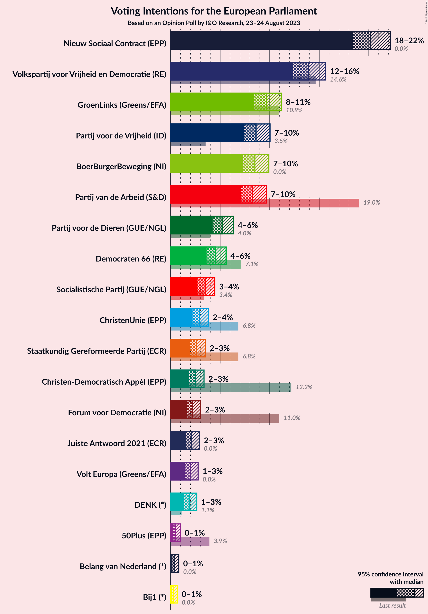

### Confidence Intervals

| Party | Last Result | Poll Result | 80% Confidence Interval | 90% Confidence Interval | 95% Confidence Interval | 99% Confidence Interval |
|:-----:|:-----------:|:-----------:|:-----------------------:|:-----------------------:|:-----------------------:|:-----------------------:|
| Nieuw Sociaal Contract (EPP) | 0.0% | 20.2% | 19.0–21.5% |18.7–21.8% |18.4–22.2% |17.8–22.8% |
| Volkspartij voor Vrijheid en Democratie (RE) | 14.6% | 13.9% | 12.9–15.0% |12.6–15.4% |12.4–15.6% |11.9–16.2% |
| GroenLinks (Greens/EFA) | 10.9% | 9.7% | 8.8–10.7% |8.6–10.9% |8.4–11.2% |8.0–11.7% |
| Partij voor de Vrijheid (ID) | 3.5% | 8.6% | 7.8–9.5% |7.6–9.8% |7.4–10.0% |7.0–10.5% |
| BoerBurgerBeweging (NI) | 0.0% | 8.5% | 7.7–9.4% |7.5–9.7% |7.3–9.9% |6.9–10.4% |
| Partij van de Arbeid (S&D) | 19.0% | 8.3% | 7.5–9.2% |7.3–9.4% |7.1–9.7% |6.7–10.1% |
| Partij voor de Dieren (GUE/NGL) | 4.0% | 5.2% | 4.6–5.9% |4.4–6.2% |4.2–6.3% |4.0–6.7% |
| Democraten 66 (RE) | 7.1% | 4.5% | 3.9–5.2% |3.8–5.4% |3.6–5.6% |3.4–5.9% |
| Socialistische Partij (GUE/NGL) | 3.4% | 3.5% | 3.0–4.1% |2.8–4.3% |2.7–4.5% |2.5–4.8% |
| ChristenUnie (EPP) | 6.8% | 2.9% | 2.5–3.5% |2.3–3.7% |2.2–3.8% |2.0–4.1% |
| Staatkundig Gereformeerde Partij (ECR) | 6.8% | 2.6% | 2.2–3.2% |2.1–3.4% |2.0–3.5% |1.8–3.8% |
| Christen-Democratisch Appèl (EPP) | 12.2% | 2.5% | 2.1–3.1% |2.0–3.2% |1.9–3.4% |1.7–3.6% |
| Forum voor Democratie (NI) | 11.0% | 2.2% | 1.8–2.8% |1.7–2.9% |1.6–3.0% |1.5–3.3% |
| Juiste Antwoord 2021 (ECR) | 0.0% | 2.1% | 1.7–2.6% |1.6–2.8% |1.5–2.9% |1.4–3.2% |
| Volt Europa (Greens/EFA) | 0.0% | 2.0% | 1.6–2.5% |1.5–2.7% |1.4–2.8% |1.3–3.0% |
| DENK (*) | 1.1% | 1.9% | 1.5–2.4% |1.4–2.5% |1.3–2.6% |1.2–2.9% |
| 50Plus (EPP) | 3.9% | 0.5% | 0.4–0.8% |0.3–0.9% |0.3–1.0% |0.2–1.1% |
| Belang van Nederland (*) | 0.0% | 0.4% | 0.3–0.7% |0.2–0.8% |0.2–0.8% |0.1–1.0% |
| Bij1 (*) | 0.0% | 0.3% | 0.2–0.5% |0.1–0.6% |0.1–0.7% |0.1–0.8% |

*Note:* The poll result column reflects the actual value used in the calculations. Published results may vary slightly, and in addition be rounded to fewer digits.

## Seats

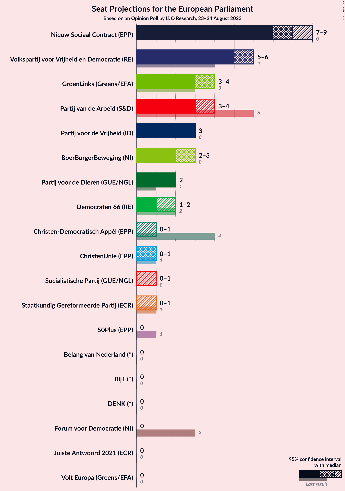

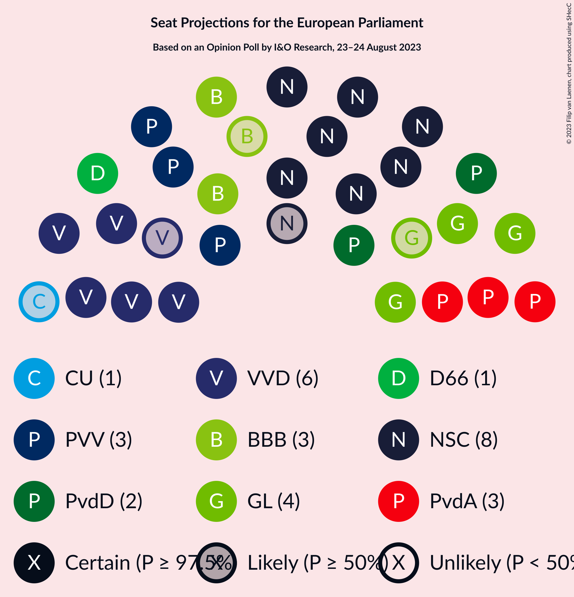

### Confidence Intervals

| Party | Last Result | Median | 80% Confidence Interval | 90% Confidence Interval | 95% Confidence Interval | 99% Confidence Interval |
|:-----:|:-----------:|:------:|:-----------------------:|:-----------------------:|:-----------------------:|:-----------------------:|
| <a href="#nieuw-sociaal-contract-(epp)">Nieuw Sociaal Contract (EPP)</a> | 0 | 8 | 8 |7–8 |7–9 |7–9 |
| <a href="#volkspartij-voor-vrijheid-en-democratie-(re)">Volkspartij voor Vrijheid en Democratie (RE)</a> | 4 | 6 | 5–6 |5–6 |5–6 |4–6 |
| <a href="#groenlinks-(greens/efa)">GroenLinks (Greens/EFA)</a> | 3 | 4 | 3–4 |3–4 |3–4 |3–4 |
| <a href="#partij-voor-de-vrijheid-(id)">Partij voor de Vrijheid (ID)</a> | 0 | 3 | 3 |3 |3 |2–4 |
| <a href="#boerburgerbeweging-(ni)">BoerBurgerBeweging (NI)</a> | 0 | 3 | 3 |3 |2–3 |2–4 |
| <a href="#partij-van-de-arbeid-(s&d)">Partij van de Arbeid (S&D)</a> | 6 | 3 | 3 |3–4 |3–4 |2–4 |
| <a href="#partij-voor-de-dieren-(gue/ngl)">Partij voor de Dieren (GUE/NGL)</a> | 1 | 2 | 2 |2 |2 |1–3 |
| <a href="#democraten-66-(re)">Democraten 66 (RE)</a> | 2 | 1 | 1 |1–2 |1–2 |1–2 |
| <a href="#socialistische-partij-(gue/ngl)">Socialistische Partij (GUE/NGL)</a> | 0 | 0 | 0–1 |0–1 |0–1 |0–2 |
| <a href="#christenunie-(epp)">ChristenUnie (EPP)</a> | 1 | 1 | 0–1 |0–1 |0–1 |0–1 |
| <a href="#staatkundig-gereformeerde-partij-(ecr)">Staatkundig Gereformeerde Partij (ECR)</a> | 1 | 0 | 0–1 |0–1 |0–1 |0–1 |
| <a href="#christen-democratisch-appèl-(epp)">Christen-Democratisch Appèl (EPP)</a> | 4 | 0 | 0 |0 |0–1 |0–1 |
| <a href="#forum-voor-democratie-(ni)">Forum voor Democratie (NI)</a> | 3 | 0 | 0 |0 |0 |0–1 |
| <a href="#juiste-antwoord-2021-(ecr)">Juiste Antwoord 2021 (ECR)</a> | 0 | 0 | 0 |0 |0 |0 |
| <a href="#volt-europa-(greens/efa)">Volt Europa (Greens/EFA)</a> | 0 | 0 | 0 |0 |0 |0–1 |
| <a href="#denk-(*)">DENK (*)</a> | 0 | 0 | 0 |0 |0 |0 |
| <a href="#50plus-(epp)">50Plus (EPP)</a> | 1 | 0 | 0 |0 |0 |0 |
| <a href="#belang-van-nederland-(*)">Belang van Nederland (*)</a> | 0 | 0 | 0 |0 |0 |0 |
| <a href="#bij1-(*)">Bij1 (*)</a> | 0 | 0 | 0 |0 |0 |0 |

### Nieuw Sociaal Contract (EPP)

*For a full overview of the results for this party, see the [Nieuw Sociaal Contract (EPP)](party-nieuwsociaalcontractepp.html) page.*

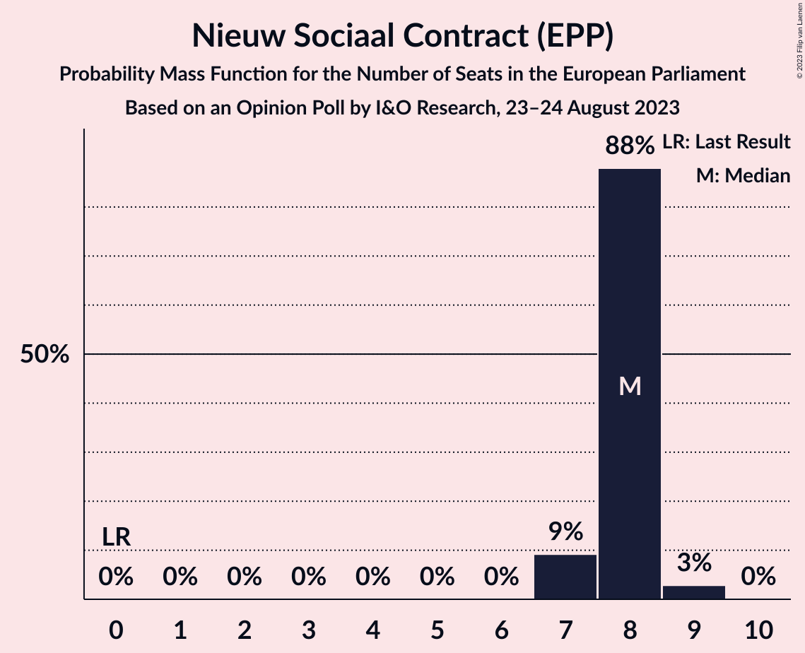

| Number of Seats | Probability | Accumulated | Special Marks |
|:---------------:|:-----------:|:-----------:|:-------------:|
| 0 | 0% | 100% | Last Result |
| 1 | 0% | 100% |  |
| 2 | 0% | 100% |  |
| 3 | 0% | 100% |  |
| 4 | 0% | 100% |  |
| 5 | 0% | 100% |  |
| 6 | 0% | 100% |  |
| 7 | 9% | 100% |  |
| 8 | 88% | 91% | Median |
| 9 | 3% | 3% |  |
| 10 | 0% | 0% |  |

### Volkspartij voor Vrijheid en Democratie (RE)

*For a full overview of the results for this party, see the [Volkspartij voor Vrijheid en Democratie (RE)](party-volkspartijvoorvrijheidendemocratiere.html) page.*

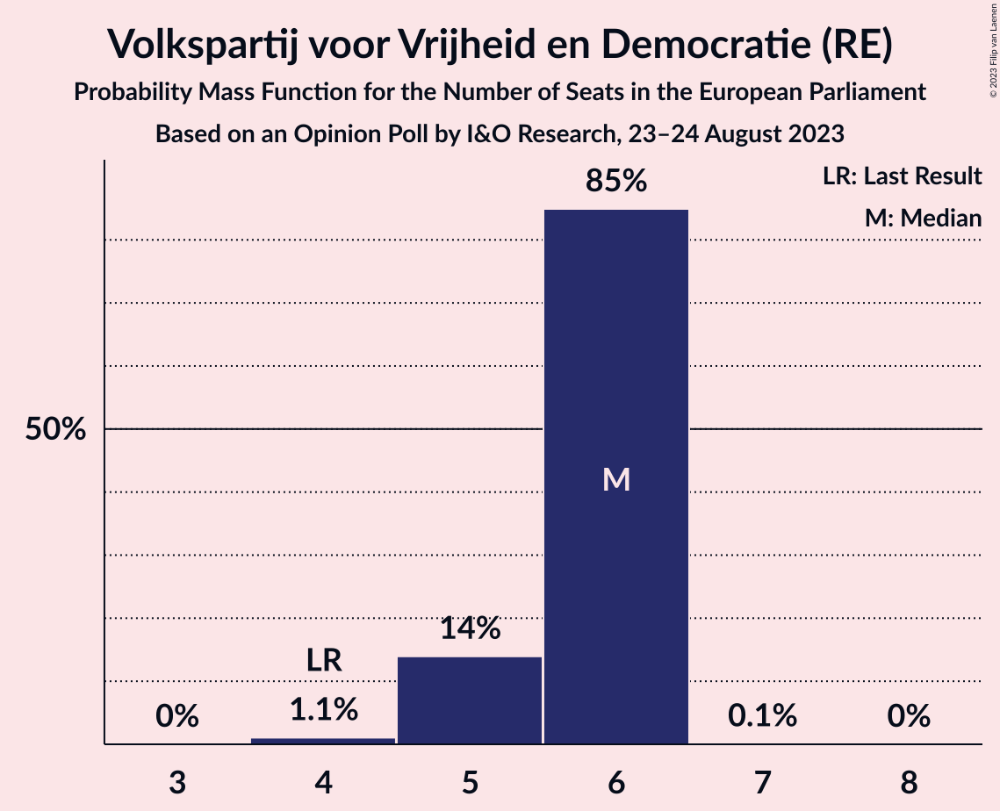

| Number of Seats | Probability | Accumulated | Special Marks |
|:---------------:|:-----------:|:-----------:|:-------------:|
| 4 | 1.1% | 100% | Last Result |
| 5 | 14% | 98.9% |  |
| 6 | 85% | 85% | Median |
| 7 | 0.1% | 0.1% |  |
| 8 | 0% | 0% |  |

### GroenLinks (Greens/EFA)

*For a full overview of the results for this party, see the [GroenLinks (Greens/EFA)](party-groenlinksgreensefa.html) page.*

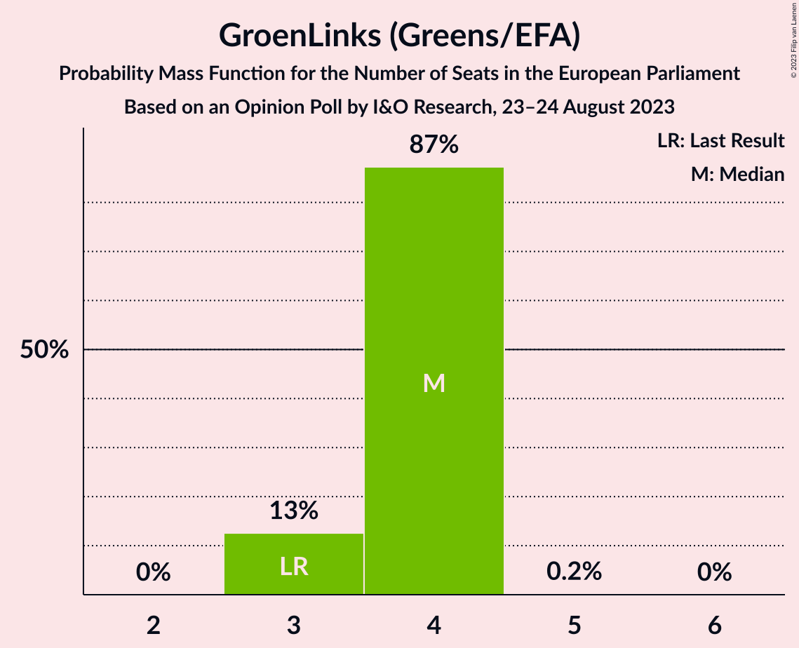

| Number of Seats | Probability | Accumulated | Special Marks |
|:---------------:|:-----------:|:-----------:|:-------------:|
| 3 | 13% | 100% | Last Result |
| 4 | 87% | 87% | Median |
| 5 | 0.2% | 0.2% |  |
| 6 | 0% | 0% |  |

### Partij voor de Vrijheid (ID)

*For a full overview of the results for this party, see the [Partij voor de Vrijheid (ID)](party-partijvoordevrijheidid.html) page.*

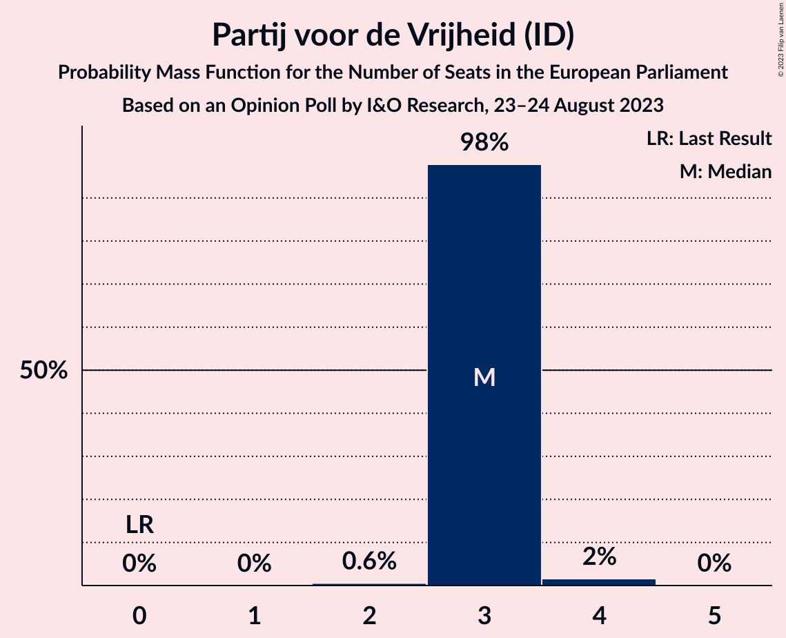

| Number of Seats | Probability | Accumulated | Special Marks |
|:---------------:|:-----------:|:-----------:|:-------------:|
| 0 | 0% | 100% | Last Result |
| 1 | 0% | 100% |  |
| 2 | 0.6% | 100% |  |
| 3 | 98% | 99.4% | Median |
| 4 | 2% | 2% |  |
| 5 | 0% | 0% |  |

### BoerBurgerBeweging (NI)

*For a full overview of the results for this party, see the [BoerBurgerBeweging (NI)](party-boerburgerbewegingni.html) page.*

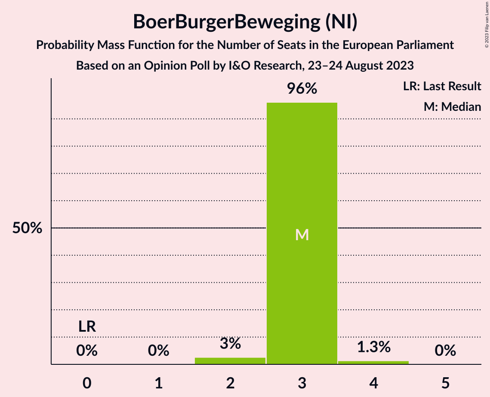

| Number of Seats | Probability | Accumulated | Special Marks |
|:---------------:|:-----------:|:-----------:|:-------------:|
| 0 | 0% | 100% | Last Result |
| 1 | 0% | 100% |  |
| 2 | 3% | 100% |  |
| 3 | 96% | 97% | Median |
| 4 | 1.3% | 1.3% |  |
| 5 | 0% | 0% |  |

### Partij van de Arbeid (S&D)

*For a full overview of the results for this party, see the [Partij van de Arbeid (S&D)](party-partijvandearbeidsd.html) page.*

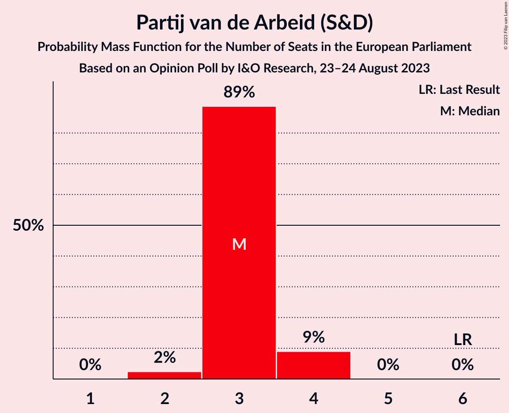

| Number of Seats | Probability | Accumulated | Special Marks |
|:---------------:|:-----------:|:-----------:|:-------------:|
| 2 | 2% | 100% |  |
| 3 | 89% | 98% | Median |
| 4 | 9% | 9% |  |
| 5 | 0% | 0% |  |
| 6 | 0% | 0% | Last Result |

### Partij voor de Dieren (GUE/NGL)

*For a full overview of the results for this party, see the [Partij voor de Dieren (GUE/NGL)](party-partijvoordedierenguengl.html) page.*

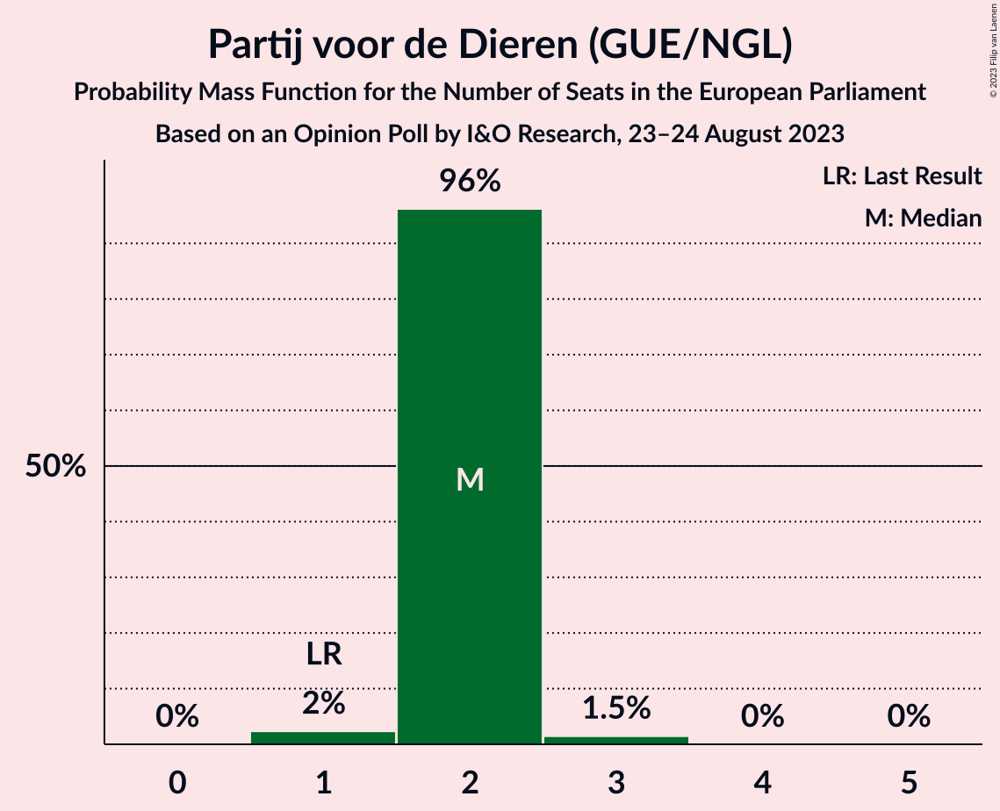

| Number of Seats | Probability | Accumulated | Special Marks |
|:---------------:|:-----------:|:-----------:|:-------------:|
| 1 | 2% | 100% | Last Result |
| 2 | 96% | 98% | Median |
| 3 | 1.5% | 1.5% |  |
| 4 | 0% | 0% |  |

### Democraten 66 (RE)

*For a full overview of the results for this party, see the [Democraten 66 (RE)](party-democraten66re.html) page.*

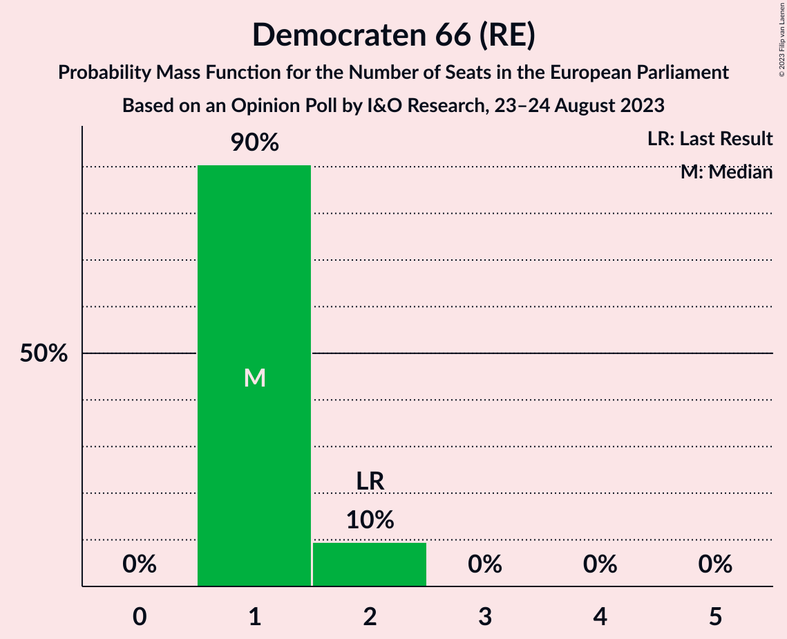

| Number of Seats | Probability | Accumulated | Special Marks |
|:---------------:|:-----------:|:-----------:|:-------------:|
| 1 | 90% | 100% | Median |
| 2 | 10% | 10% | Last Result |
| 3 | 0% | 0% |  |

### Socialistische Partij (GUE/NGL)

*For a full overview of the results for this party, see the [Socialistische Partij (GUE/NGL)](party-socialistischepartijguengl.html) page.*

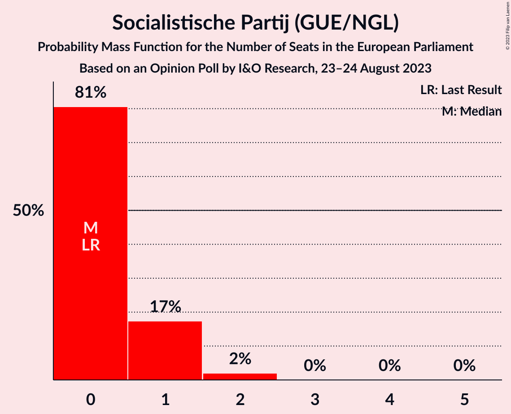

| Number of Seats | Probability | Accumulated | Special Marks |
|:---------------:|:-----------:|:-----------:|:-------------:|
| 0 | 81% | 100% | Last Result, Median |
| 1 | 17% | 19% |  |
| 2 | 2% | 2% |  |
| 3 | 0% | 0% |  |

### ChristenUnie (EPP)

*For a full overview of the results for this party, see the [ChristenUnie (EPP)](party-christenunieepp.html) page.*

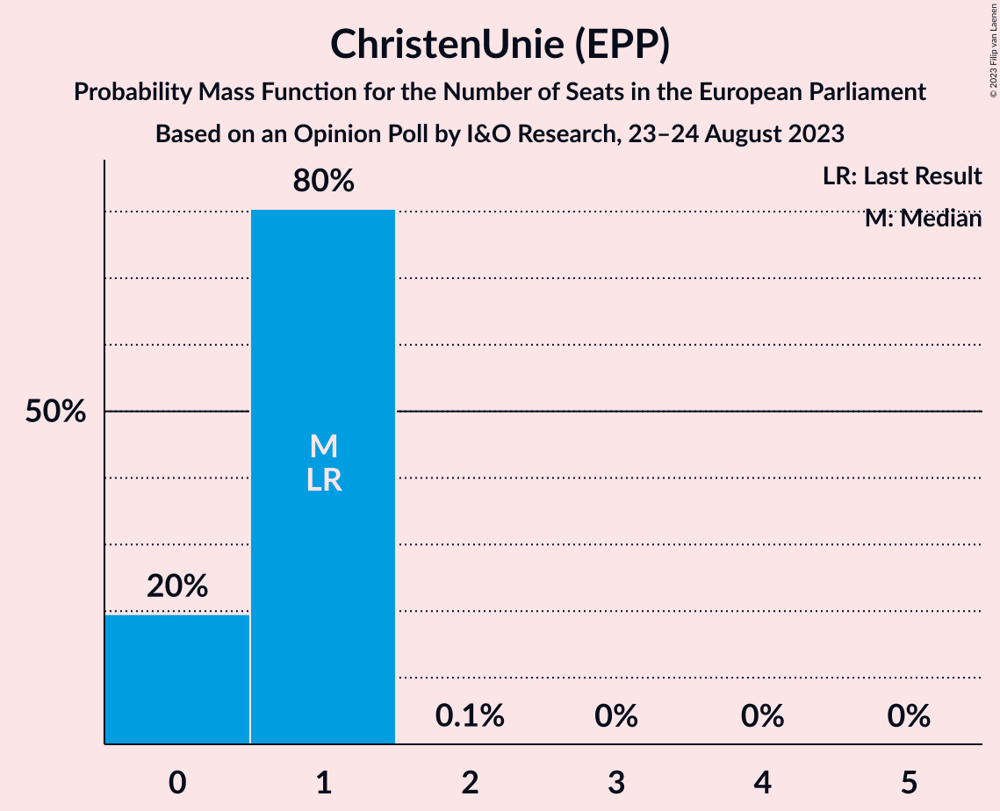

| Number of Seats | Probability | Accumulated | Special Marks |
|:---------------:|:-----------:|:-----------:|:-------------:|
| 0 | 20% | 100% |  |
| 1 | 80% | 80% | Last Result, Median |
| 2 | 0.1% | 0.1% |  |
| 3 | 0% | 0% |  |

### Staatkundig Gereformeerde Partij (ECR)

*For a full overview of the results for this party, see the [Staatkundig Gereformeerde Partij (ECR)](party-staatkundiggereformeerdepartijecr.html) page.*

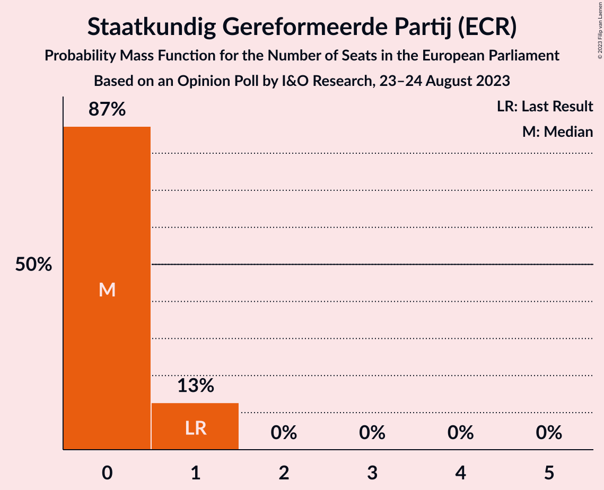

| Number of Seats | Probability | Accumulated | Special Marks |
|:---------------:|:-----------:|:-----------:|:-------------:|
| 0 | 87% | 100% | Median |
| 1 | 13% | 13% | Last Result |
| 2 | 0% | 0% |  |

### Christen-Democratisch Appèl (EPP)

*For a full overview of the results for this party, see the [Christen-Democratisch Appèl (EPP)](party-christen-democratischappèlepp.html) page.*

| Number of Seats | Probability | Accumulated | Special Marks |
|:---------------:|:-----------:|:-----------:|:-------------:|
| 0 | 97% | 100% | Median |
| 1 | 3% | 3% |  |
| 2 | 0% | 0% |  |
| 3 | 0% | 0% |  |
| 4 | 0% | 0% | Last Result |

### Forum voor Democratie (NI)

*For a full overview of the results for this party, see the [Forum voor Democratie (NI)](party-forumvoordemocratieni.html) page.*

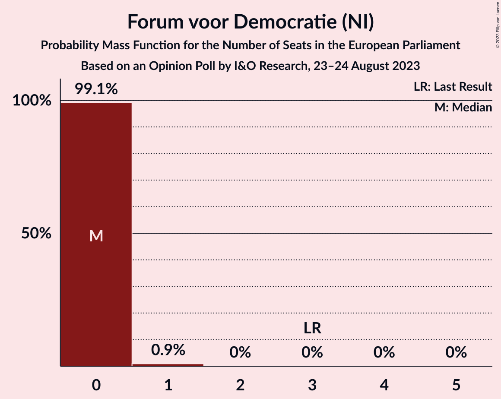

| Number of Seats | Probability | Accumulated | Special Marks |
|:---------------:|:-----------:|:-----------:|:-------------:|
| 0 | 99.1% | 100% | Median |
| 1 | 0.9% | 0.9% |  |
| 2 | 0% | 0% |  |
| 3 | 0% | 0% | Last Result |

### Juiste Antwoord 2021 (ECR)

*For a full overview of the results for this party, see the [Juiste Antwoord 2021 (ECR)](party-juisteantwoord2021ecr.html) page.*

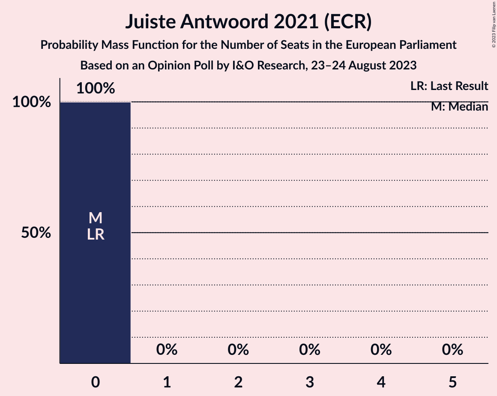

| Number of Seats | Probability | Accumulated | Special Marks |
|:---------------:|:-----------:|:-----------:|:-------------:|
| 0 | 100% | 100% | Last Result, Median |

### Volt Europa (Greens/EFA)

*For a full overview of the results for this party, see the [Volt Europa (Greens/EFA)](party-volteuropagreensefa.html) page.*

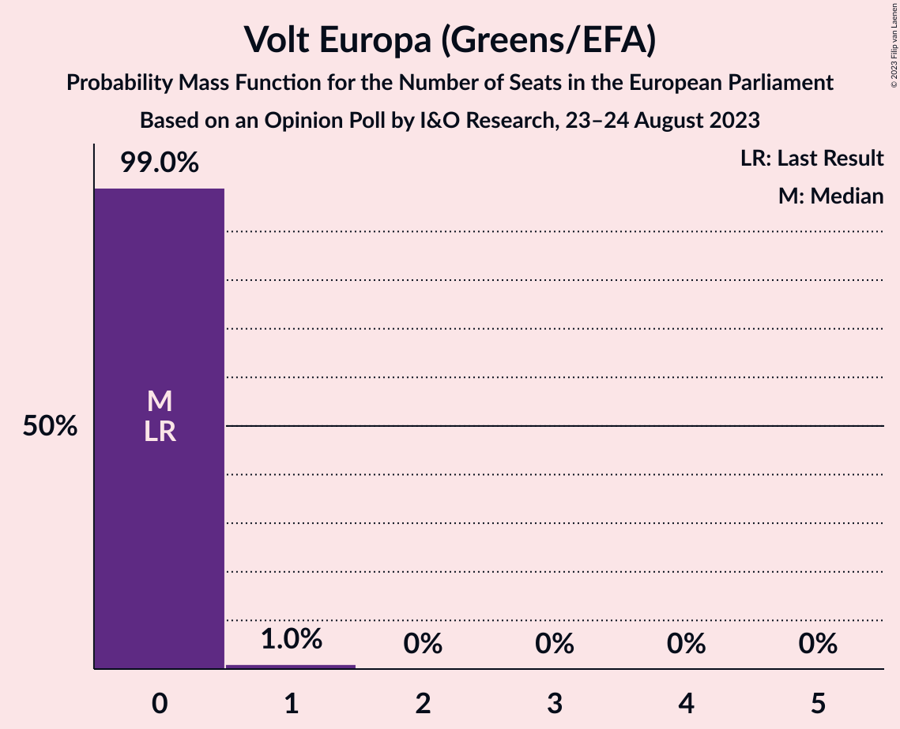

| Number of Seats | Probability | Accumulated | Special Marks |
|:---------------:|:-----------:|:-----------:|:-------------:|
| 0 | 99.0% | 100% | Last Result, Median |
| 1 | 1.0% | 1.0% |  |
| 2 | 0% | 0% |  |

### DENK (*)

*For a full overview of the results for this party, see the [DENK (*)](party-denk.html) page.*

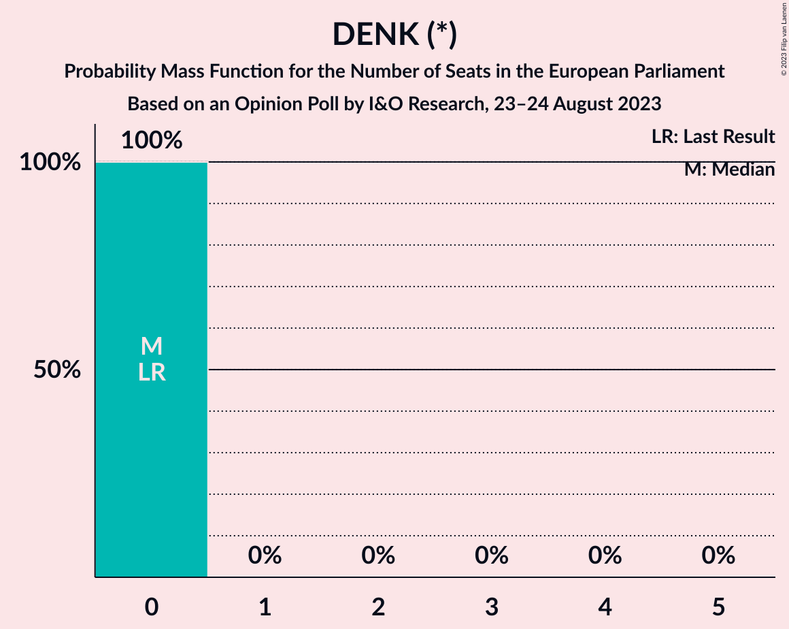

| Number of Seats | Probability | Accumulated | Special Marks |
|:---------------:|:-----------:|:-----------:|:-------------:|
| 0 | 100% | 100% | Last Result, Median |

### 50Plus (EPP)

*For a full overview of the results for this party, see the [50Plus (EPP)](party-50plusepp.html) page.*

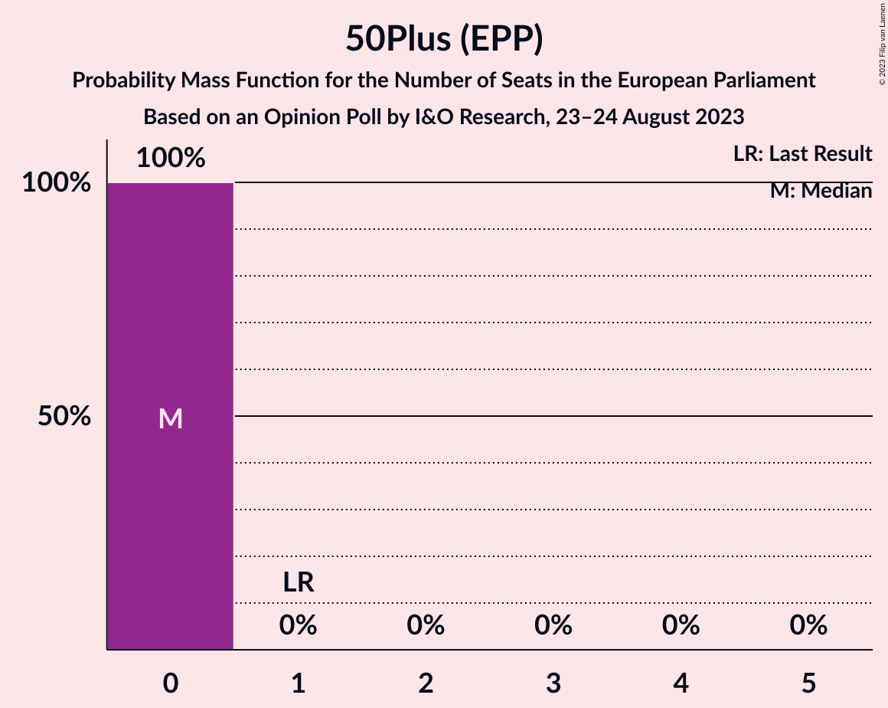

| Number of Seats | Probability | Accumulated | Special Marks |
|:---------------:|:-----------:|:-----------:|:-------------:|
| 0 | 100% | 100% | Median |
| 1 | 0% | 0% | Last Result |

### Belang van Nederland (*)

*For a full overview of the results for this party, see the [Belang van Nederland (*)](party-belangvannederland.html) page.*

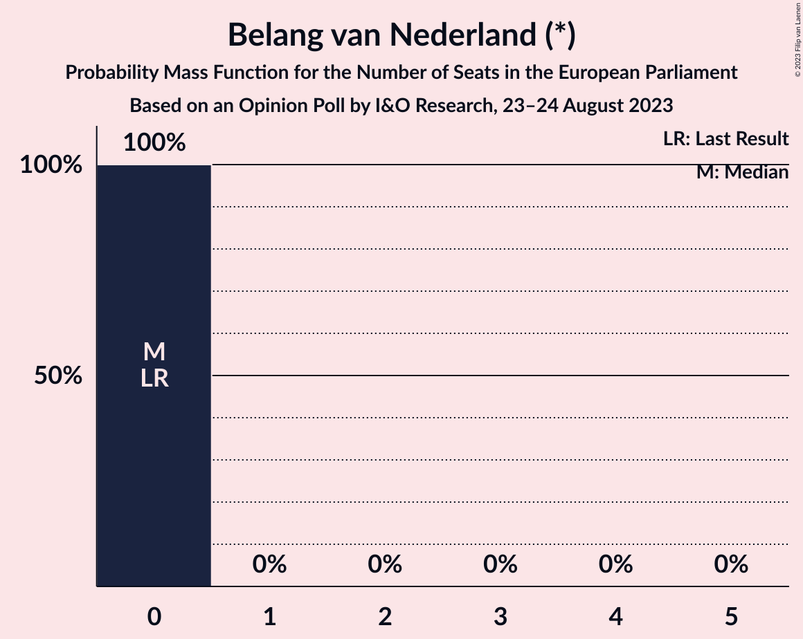

| Number of Seats | Probability | Accumulated | Special Marks |
|:---------------:|:-----------:|:-----------:|:-------------:|
| 0 | 100% | 100% | Last Result, Median |

### Bij1 (*)

*For a full overview of the results for this party, see the [Bij1 (*)](party-bij1.html) page.*

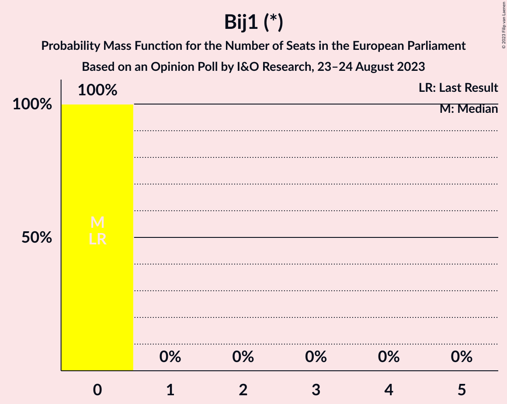

| Number of Seats | Probability | Accumulated | Special Marks |
|:---------------:|:-----------:|:-----------:|:-------------:|
| 0 | 100% | 100% | Last Result, Median |

## Coalitions

### Confidence Intervals

| Coalition | Last Result | Median | Majority? | 80% Confidence Interval | 90% Confidence Interval | 95% Confidence Interval | 99% Confidence Interval |
|:---------:|:-----------:|:------:|:---------:|:-----------------------:|:-----------------------:|:-----------------------:|:-----------------------:|
| Nieuw Sociaal Contract (EPP) – ChristenUnie (EPP) – Christen-Democratisch Appèl (EPP) – 50Plus (EPP) | 6 | 9 | 0% | 8–9 | 7–9 | 7–9 | 7–11 |
| Volkspartij voor Vrijheid en Democratie (RE) – Democraten 66 (RE) | 6 | 7 | 0% | 6–7 | 6–8 | 6–8 | 6–8 |
| GroenLinks (Greens/EFA) – Volt Europa (Greens/EFA) | 3 | 4 | 0% | 3–4 | 3–4 | 3–4 | 3–5 |
| Partij van de Arbeid (S&D) | 6 | 3 | 0% | 3 | 3–4 | 3–4 | 2–4 |
| Partij voor de Dieren (GUE/NGL) – Socialistische Partij (GUE/NGL) | 1 | 2 | 0% | 2–3 | 2–3 | 2–4 | 2–4 |
| BoerBurgerBeweging (NI) – Forum voor Democratie (NI) | 3 | 3 | 0% | 3 | 3 | 3 | 2–4 |
| Partij voor de Vrijheid (ID) | 0 | 3 | 0% | 3 | 3 | 3 | 2–4 |
| Staatkundig Gereformeerde Partij (ECR) – Juiste Antwoord 2021 (ECR) | 1 | 0 | 0% | 0–1 | 0–1 | 0–1 | 0–1 |

### Nieuw Sociaal Contract (EPP) – ChristenUnie (EPP) – Christen-Democratisch Appèl (EPP) – 50Plus (EPP)

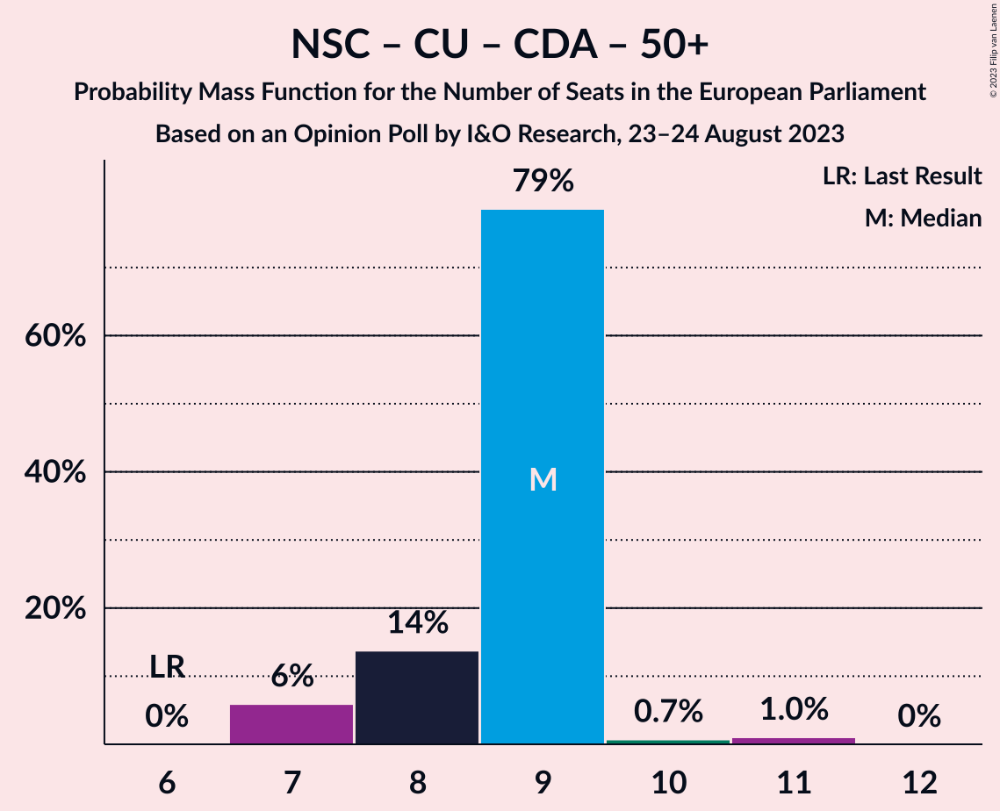

| Number of Seats | Probability | Accumulated | Special Marks |
|:---------------:|:-----------:|:-----------:|:-------------:|
| 6 | 0% | 100% | Last Result |
| 7 | 6% | 100% |  |
| 8 | 14% | 94% |  |
| 9 | 79% | 80% | Median |
| 10 | 0.7% | 2% |  |
| 11 | 1.0% | 1.0% |  |
| 12 | 0% | 0% |  |

### Volkspartij voor Vrijheid en Democratie (RE) – Democraten 66 (RE)

| Number of Seats | Probability | Accumulated | Special Marks |
|:---------------:|:-----------:|:-----------:|:-------------:|
| 6 | 12% | 100% | Last Result |
| 7 | 82% | 88% | Median |
| 8 | 6% | 6% |  |
| 9 | 0% | 0% |  |

### GroenLinks (Greens/EFA) – Volt Europa (Greens/EFA)

| Number of Seats | Probability | Accumulated | Special Marks |
|:---------------:|:-----------:|:-----------:|:-------------:|
| 3 | 13% | 100% | Last Result |
| 4 | 86% | 87% | Median |
| 5 | 1.1% | 1.1% |  |
| 6 | 0% | 0% |  |

### Partij van de Arbeid (S&D)

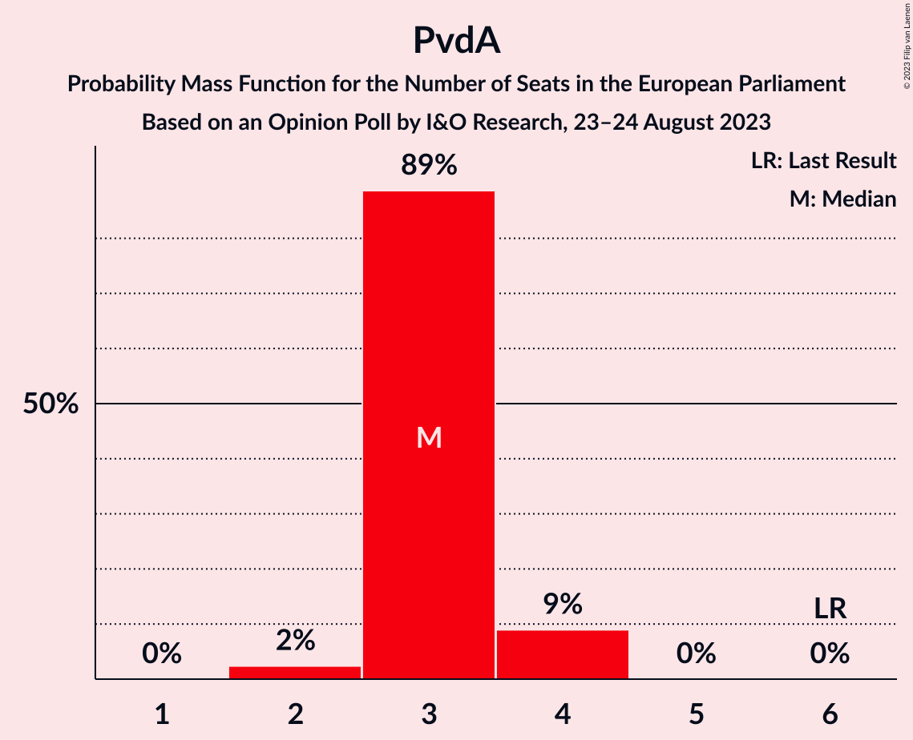

| Number of Seats | Probability | Accumulated | Special Marks |
|:---------------:|:-----------:|:-----------:|:-------------:|
| 2 | 2% | 100% |  |
| 3 | 89% | 98% | Median |
| 4 | 9% | 9% |  |
| 5 | 0% | 0% |  |
| 6 | 0% | 0% | Last Result |

### Partij voor de Dieren (GUE/NGL) – Socialistische Partij (GUE/NGL)

| Number of Seats | Probability | Accumulated | Special Marks |
|:---------------:|:-----------:|:-----------:|:-------------:|
| 1 | 0.1% | 100% | Last Result |
| 2 | 82% | 99.9% | Median |
| 3 | 15% | 18% |  |
| 4 | 3% | 3% |  |
| 5 | 0% | 0% |  |

### BoerBurgerBeweging (NI) – Forum voor Democratie (NI)

| Number of Seats | Probability | Accumulated | Special Marks |
|:---------------:|:-----------:|:-----------:|:-------------:|
| 2 | 2% | 100% |  |
| 3 | 96% | 98% | Last Result, Median |
| 4 | 2% | 2% |  |
| 5 | 0% | 0% |  |

### Partij voor de Vrijheid (ID)

| Number of Seats | Probability | Accumulated | Special Marks |
|:---------------:|:-----------:|:-----------:|:-------------:|
| 0 | 0% | 100% | Last Result |
| 1 | 0% | 100% |  |
| 2 | 0.6% | 100% |  |
| 3 | 98% | 99.4% | Median |
| 4 | 2% | 2% |  |
| 5 | 0% | 0% |  |

### Staatkundig Gereformeerde Partij (ECR) – Juiste Antwoord 2021 (ECR)

| Number of Seats | Probability | Accumulated | Special Marks |
|:---------------:|:-----------:|:-----------:|:-------------:|
| 0 | 87% | 100% | Median |
| 1 | 13% | 13% | Last Result |
| 2 | 0% | 0% |  |

## Technical Information

### Opinion Poll

+ **Polling firm:** I&O Research
+ **Commissioner(s):** —
+ **Fieldwork period:** 23–24 August 2023

### Calculations

+ **Sample size:** 1752
+ **Simulations done:** 1,048,576
+ **Error estimate:** 1.42%

