# Opinion Poll by Ipsos for EenVandaag, 13–16 October 2023

<a href="#voting-intentions">Voting Intentions</a> | <a href="#seats">Seats</a> | <a href="#coalitions">Coalitions</a> | <a href="#technical-information">Technical Information</a>

## Voting Intentions

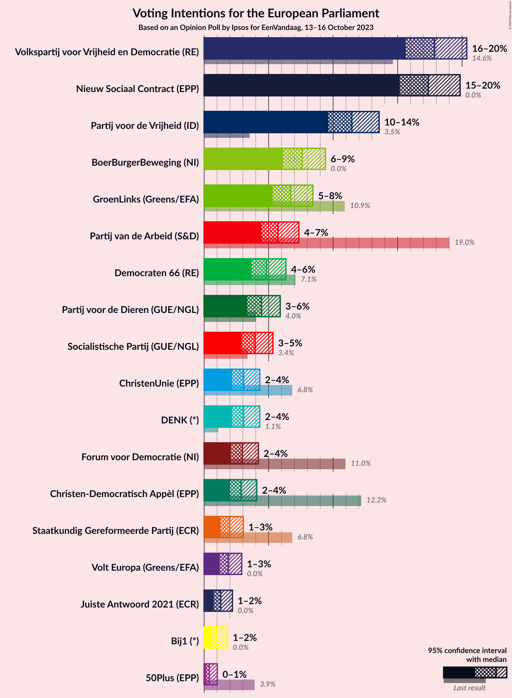

### Confidence Intervals

| Party | Last Result | Poll Result | 80% Confidence Interval | 90% Confidence Interval | 95% Confidence Interval | 99% Confidence Interval |
|:-----:|:-----------:|:-----------:|:-----------------------:|:-----------------------:|:-----------------------:|:-----------------------:|
| Volkspartij voor Vrijheid en Democratie (RE) | 14.6% | 17.9% | 16.4–19.5% |16.0–20.0% |15.6–20.4% |15.0–21.2% |
| Nieuw Sociaal Contract (EPP) | 0.0% | 17.4% | 15.9–19.0% |15.5–19.4% |15.2–19.8% |14.5–20.6% |
| Partij voor de Vrijheid (ID) | 3.5% | 11.5% | 10.3–12.8% |9.9–13.2% |9.6–13.6% |9.1–14.3% |
| BoerBurgerBeweging (NI) | 0.0% | 7.6% | 6.6–8.8% |6.4–9.1% |6.1–9.4% |5.7–10.0% |
| GroenLinks (Greens/EFA) | 10.9% | 6.7% | 5.8–7.8% |5.5–8.2% |5.3–8.4% |4.9–9.0% |
| Partij van de Arbeid (S&D) | 19.0% | 5.7% | 4.9–6.8% |4.6–7.1% |4.5–7.3% |4.1–7.9% |
| Democraten 66 (RE) | 7.1% | 4.8% | 4.1–5.8% |3.9–6.1% |3.7–6.3% |3.3–6.8% |
| Partij voor de Dieren (GUE/NGL) | 4.0% | 4.4% | 3.7–5.4% |3.5–5.7% |3.3–5.9% |3.0–6.4% |
| Socialistische Partij (GUE/NGL) | 3.4% | 3.9% | 3.3–4.9% |3.1–5.1% |2.9–5.3% |2.6–5.8% |
| ChristenUnie (EPP) | 6.8% | 3.1% | 2.5–3.9% |2.3–4.1% |2.2–4.3% |1.9–4.7% |
| DENK (*) | 1.1% | 3.1% | 2.5–3.9% |2.3–4.1% |2.2–4.3% |1.9–4.7% |
| Forum voor Democratie (NI) | 11.0% | 3.0% | 2.4–3.8% |2.2–4.0% |2.1–4.2% |1.8–4.6% |
| Christen-Democratisch Appèl (EPP) | 12.2% | 2.9% | 2.3–3.7% |2.1–3.9% |2.0–4.1% |1.8–4.5% |
| Staatkundig Gereformeerde Partij (ECR) | 6.8% | 2.0% | 1.5–2.7% |1.4–2.9% |1.3–3.0% |1.1–3.4% |
| Volt Europa (Greens/EFA) | 0.0% | 1.9% | 1.4–2.6% |1.3–2.7% |1.2–2.9% |1.0–3.3% |
| Juiste Antwoord 2021 (ECR) | 0.0% | 1.3% | 0.9–1.9% |0.8–2.0% |0.7–2.2% |0.6–2.5% |
| Bij1 (*) | 0.0% | 1.0% | 0.7–1.5% |0.6–1.7% |0.5–1.8% |0.4–2.1% |
| 50Plus (EPP) | 3.9% | 0.4% | 0.2–0.8% |0.2–0.9% |0.2–1.0% |0.1–1.2% |

*Note:* The poll result column reflects the actual value used in the calculations. Published results may vary slightly, and in addition be rounded to fewer digits.

## Seats

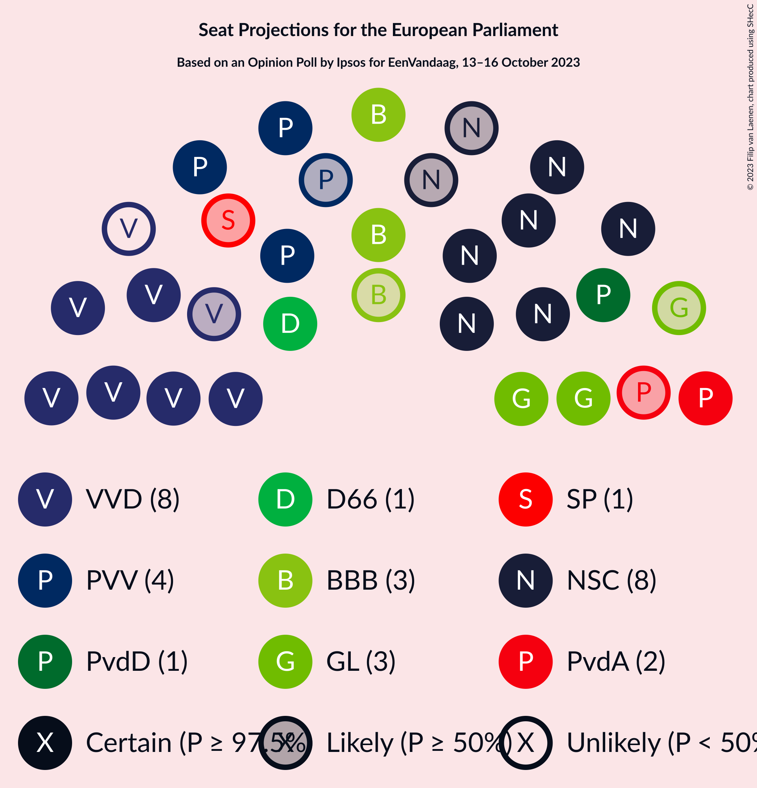

### Confidence Intervals

| Party | Last Result | Median | 80% Confidence Interval | 90% Confidence Interval | 95% Confidence Interval | 99% Confidence Interval |
|:-----:|:-----------:|:------:|:-----------------------:|:-----------------------:|:-----------------------:|:-----------------------:|
| <a href="#volkspartij-voor-vrijheid-en-democratie-(re)">Volkspartij voor Vrijheid en Democratie (RE)</a> | 4 | 7 | 6–8 |6–8 |6–8 |6–8 |
| <a href="#nieuw-sociaal-contract-(epp)">Nieuw Sociaal Contract (EPP)</a> | 0 | 8 | 6–8 |6–8 |6–8 |5–9 |
| <a href="#partij-voor-de-vrijheid-(id)">Partij voor de Vrijheid (ID)</a> | 0 | 4 | 3–5 |3–5 |3–5 |3–6 |
| <a href="#boerburgerbeweging-(ni)">BoerBurgerBeweging (NI)</a> | 0 | 3 | 2–3 |2–4 |2–4 |2–4 |
| <a href="#groenlinks-(greens/efa)">GroenLinks (Greens/EFA)</a> | 3 | 3 | 2–3 |2–3 |2–3 |2–3 |
| <a href="#partij-van-de-arbeid-(s&d)">Partij van de Arbeid (S&D)</a> | 6 | 2 | 2–3 |1–3 |1–3 |1–3 |
| <a href="#democraten-66-(re)">Democraten 66 (RE)</a> | 2 | 1 | 1–2 |1–3 |1–3 |1–3 |
| <a href="#partij-voor-de-dieren-(gue/ngl)">Partij voor de Dieren (GUE/NGL)</a> | 1 | 1 | 1–2 |1–2 |1–2 |0–3 |
| <a href="#socialistische-partij-(gue/ngl)">Socialistische Partij (GUE/NGL)</a> | 0 | 1 | 1–2 |0–2 |0–2 |0–2 |
| <a href="#christenunie-(epp)">ChristenUnie (EPP)</a> | 1 | 0 | 0–1 |0–1 |0–1 |0–2 |
| <a href="#denk-(*)">DENK (*)</a> | 0 | 0 | 0–1 |0–1 |0–1 |0–1 |
| <a href="#forum-voor-democratie-(ni)">Forum voor Democratie (NI)</a> | 3 | 0 | 0–1 |0–1 |0–1 |0–2 |
| <a href="#christen-democratisch-appèl-(epp)">Christen-Democratisch Appèl (EPP)</a> | 4 | 0 | 0–1 |0–1 |0–1 |0–1 |
| <a href="#staatkundig-gereformeerde-partij-(ecr)">Staatkundig Gereformeerde Partij (ECR)</a> | 1 | 0 | 0 |0 |0 |0 |
| <a href="#volt-europa-(greens/efa)">Volt Europa (Greens/EFA)</a> | 0 | 0 | 0 |0 |0 |0–1 |
| <a href="#juiste-antwoord-2021-(ecr)">Juiste Antwoord 2021 (ECR)</a> | 0 | 0 | 0 |0 |0 |0 |
| <a href="#bij1-(*)">Bij1 (*)</a> | 0 | 0 | 0 |0 |0 |0 |
| <a href="#50plus-(epp)">50Plus (EPP)</a> | 1 | 0 | 0 |0 |0 |0 |

### Volkspartij voor Vrijheid en Democratie (RE)

*For a full overview of the results for this party, see the [Volkspartij voor Vrijheid en Democratie (RE)](party-volkspartijvoorvrijheidendemocratiere.html) page.*

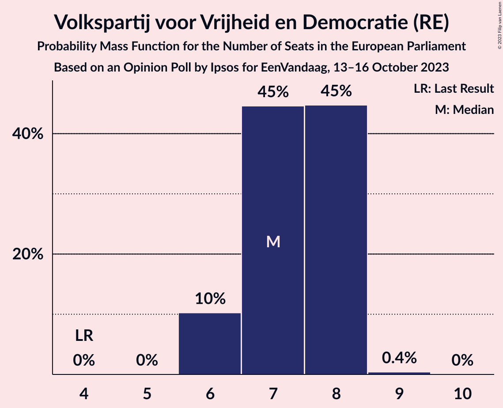

| Number of Seats | Probability | Accumulated | Special Marks |
|:---------------:|:-----------:|:-----------:|:-------------:|
| 4 | 0% | 100% | Last Result |
| 5 | 0% | 100% |  |
| 6 | 10% | 100% |  |
| 7 | 45% | 90% | Median |
| 8 | 45% | 45% |  |
| 9 | 0.4% | 0.4% |  |
| 10 | 0% | 0% |  |

### Nieuw Sociaal Contract (EPP)

*For a full overview of the results for this party, see the [Nieuw Sociaal Contract (EPP)](party-nieuwsociaalcontractepp.html) page.*

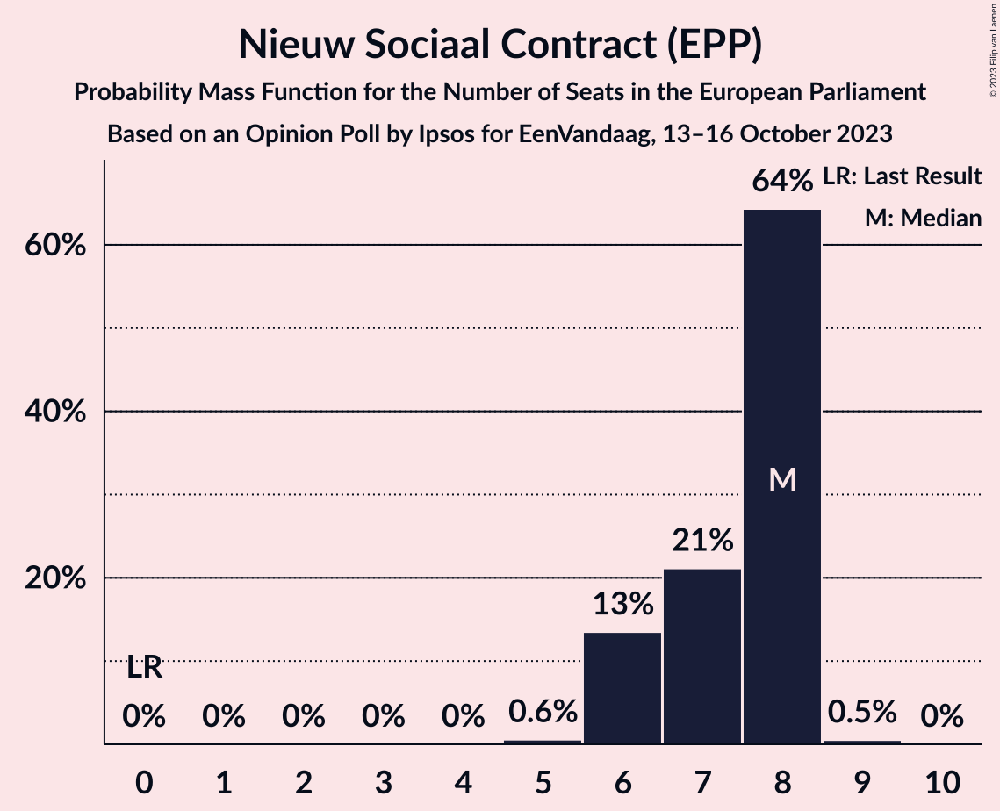

| Number of Seats | Probability | Accumulated | Special Marks |
|:---------------:|:-----------:|:-----------:|:-------------:|
| 0 | 0% | 100% | Last Result |
| 1 | 0% | 100% |  |
| 2 | 0% | 100% |  |
| 3 | 0% | 100% |  |
| 4 | 0% | 100% |  |
| 5 | 0.6% | 100% |  |
| 6 | 13% | 99.4% |  |
| 7 | 21% | 86% |  |
| 8 | 64% | 65% | Median |
| 9 | 0.5% | 0.5% |  |
| 10 | 0% | 0% |  |

### Partij voor de Vrijheid (ID)

*For a full overview of the results for this party, see the [Partij voor de Vrijheid (ID)](party-partijvoordevrijheidid.html) page.*

| Number of Seats | Probability | Accumulated | Special Marks |
|:---------------:|:-----------:|:-----------:|:-------------:|
| 0 | 0% | 100% | Last Result |
| 1 | 0% | 100% |  |
| 2 | 0% | 100% |  |
| 3 | 38% | 100% |  |
| 4 | 46% | 62% | Median |
| 5 | 13% | 15% |  |
| 6 | 2% | 2% |  |
| 7 | 0% | 0% |  |

### BoerBurgerBeweging (NI)

*For a full overview of the results for this party, see the [BoerBurgerBeweging (NI)](party-boerburgerbewegingni.html) page.*

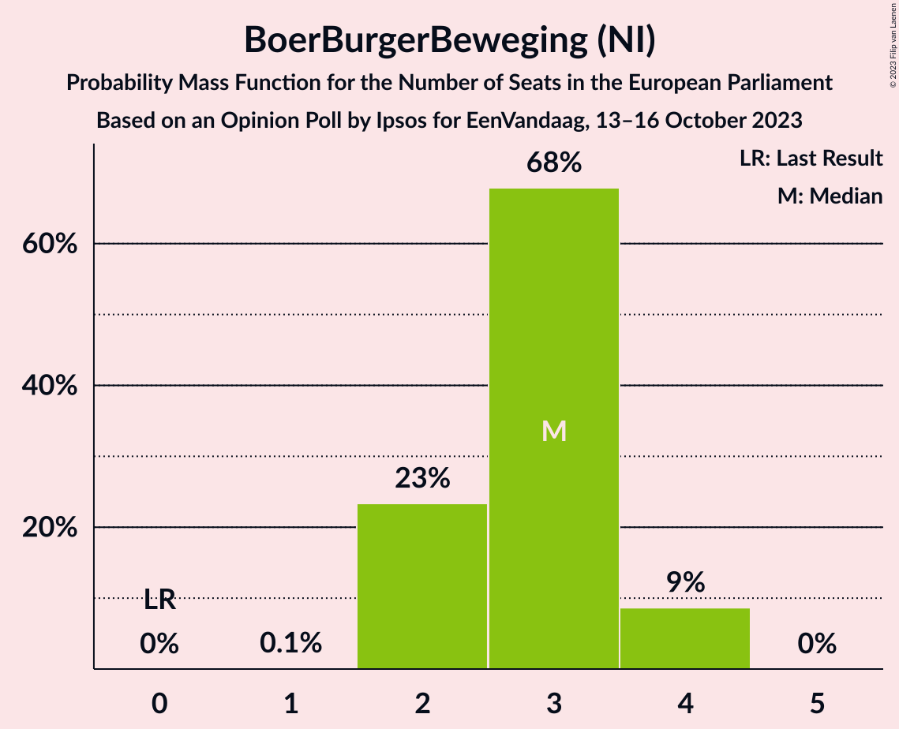

| Number of Seats | Probability | Accumulated | Special Marks |
|:---------------:|:-----------:|:-----------:|:-------------:|
| 0 | 0% | 100% | Last Result |
| 1 | 0.1% | 100% |  |
| 2 | 23% | 99.9% |  |
| 3 | 68% | 77% | Median |
| 4 | 9% | 9% |  |
| 5 | 0% | 0% |  |

### GroenLinks (Greens/EFA)

*For a full overview of the results for this party, see the [GroenLinks (Greens/EFA)](party-groenlinksgreensefa.html) page.*

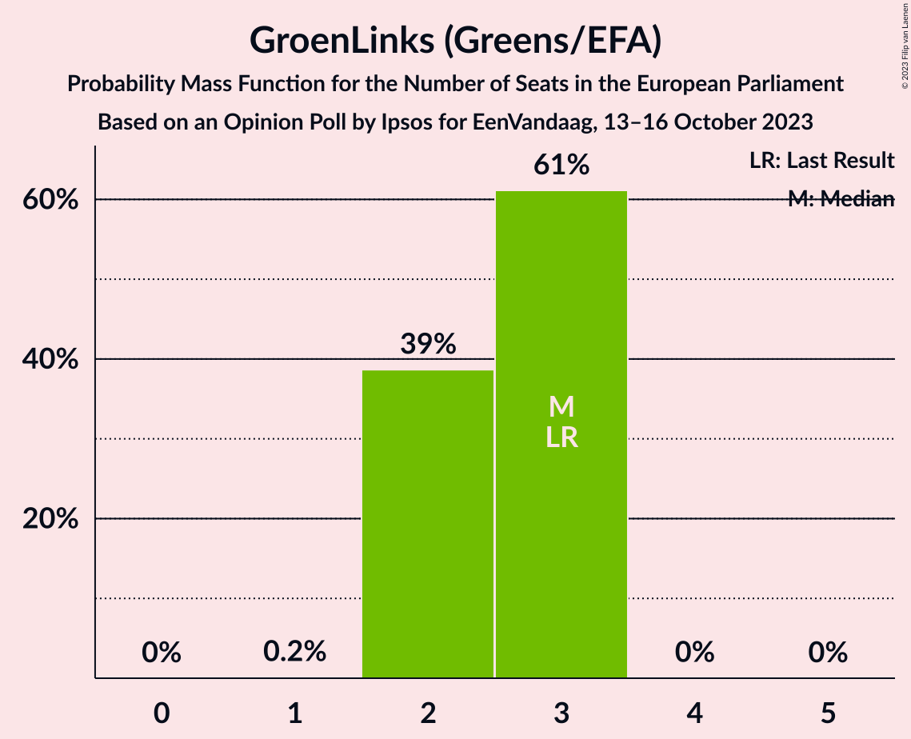

| Number of Seats | Probability | Accumulated | Special Marks |
|:---------------:|:-----------:|:-----------:|:-------------:|
| 1 | 0.2% | 100% |  |
| 2 | 39% | 99.8% |  |
| 3 | 61% | 61% | Last Result, Median |
| 4 | 0% | 0% |  |

### Partij van de Arbeid (S&D)

*For a full overview of the results for this party, see the [Partij van de Arbeid (S&D)](party-partijvandearbeidsd.html) page.*

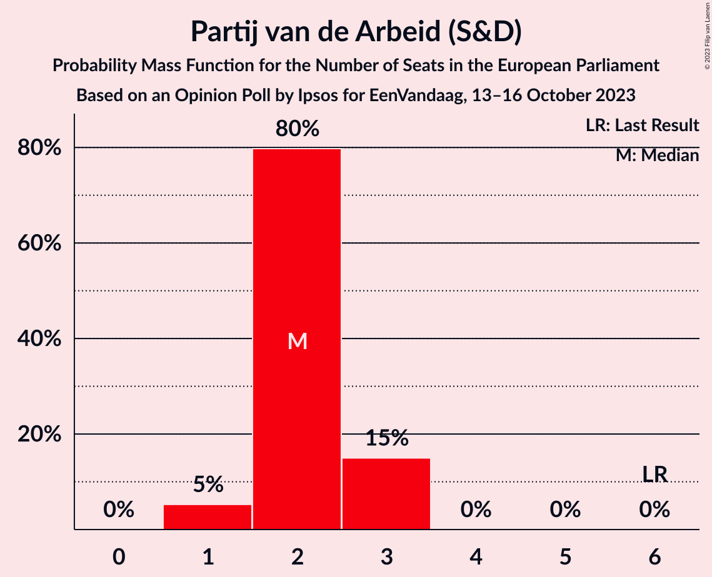

| Number of Seats | Probability | Accumulated | Special Marks |
|:---------------:|:-----------:|:-----------:|:-------------:|
| 1 | 5% | 100% |  |
| 2 | 80% | 95% | Median |
| 3 | 15% | 15% |  |
| 4 | 0% | 0% |  |
| 5 | 0% | 0% |  |
| 6 | 0% | 0% | Last Result |

### Democraten 66 (RE)

*For a full overview of the results for this party, see the [Democraten 66 (RE)](party-democraten66re.html) page.*

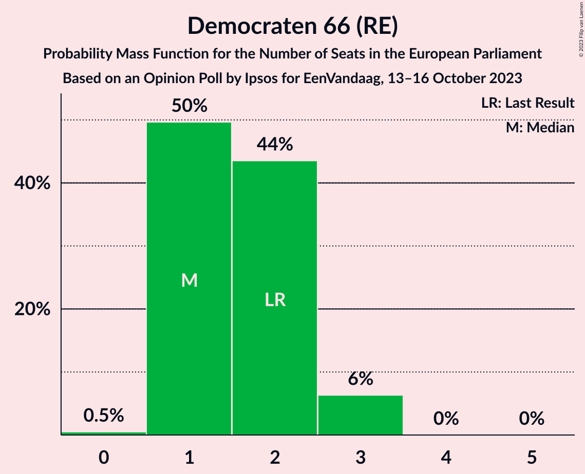

| Number of Seats | Probability | Accumulated | Special Marks |
|:---------------:|:-----------:|:-----------:|:-------------:|
| 0 | 0.5% | 100% |  |
| 1 | 50% | 99.5% | Median |
| 2 | 44% | 50% | Last Result |
| 3 | 6% | 6% |  |
| 4 | 0% | 0% |  |

### Partij voor de Dieren (GUE/NGL)

*For a full overview of the results for this party, see the [Partij voor de Dieren (GUE/NGL)](party-partijvoordedierenguengl.html) page.*

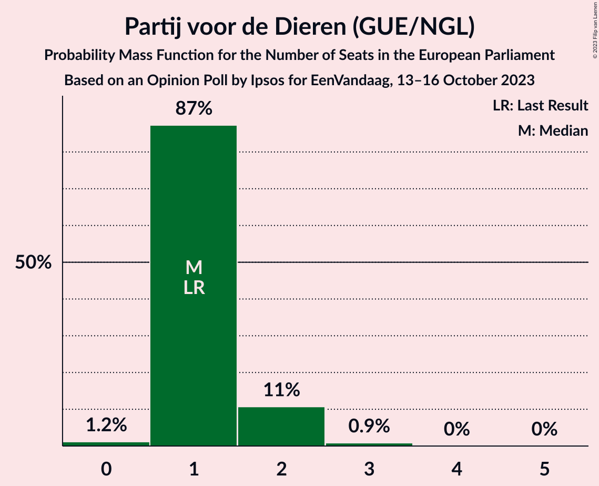

| Number of Seats | Probability | Accumulated | Special Marks |
|:---------------:|:-----------:|:-----------:|:-------------:|
| 0 | 1.2% | 100% |  |
| 1 | 87% | 98.8% | Last Result, Median |
| 2 | 11% | 12% |  |
| 3 | 0.9% | 0.9% |  |
| 4 | 0% | 0% |  |

### Socialistische Partij (GUE/NGL)

*For a full overview of the results for this party, see the [Socialistische Partij (GUE/NGL)](party-socialistischepartijguengl.html) page.*

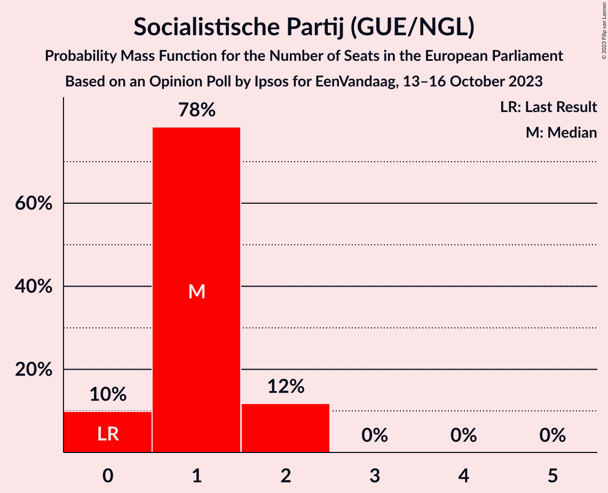

| Number of Seats | Probability | Accumulated | Special Marks |
|:---------------:|:-----------:|:-----------:|:-------------:|
| 0 | 10% | 100% | Last Result |
| 1 | 78% | 90% | Median |
| 2 | 12% | 12% |  |
| 3 | 0% | 0% |  |

### ChristenUnie (EPP)

*For a full overview of the results for this party, see the [ChristenUnie (EPP)](party-christenunieepp.html) page.*

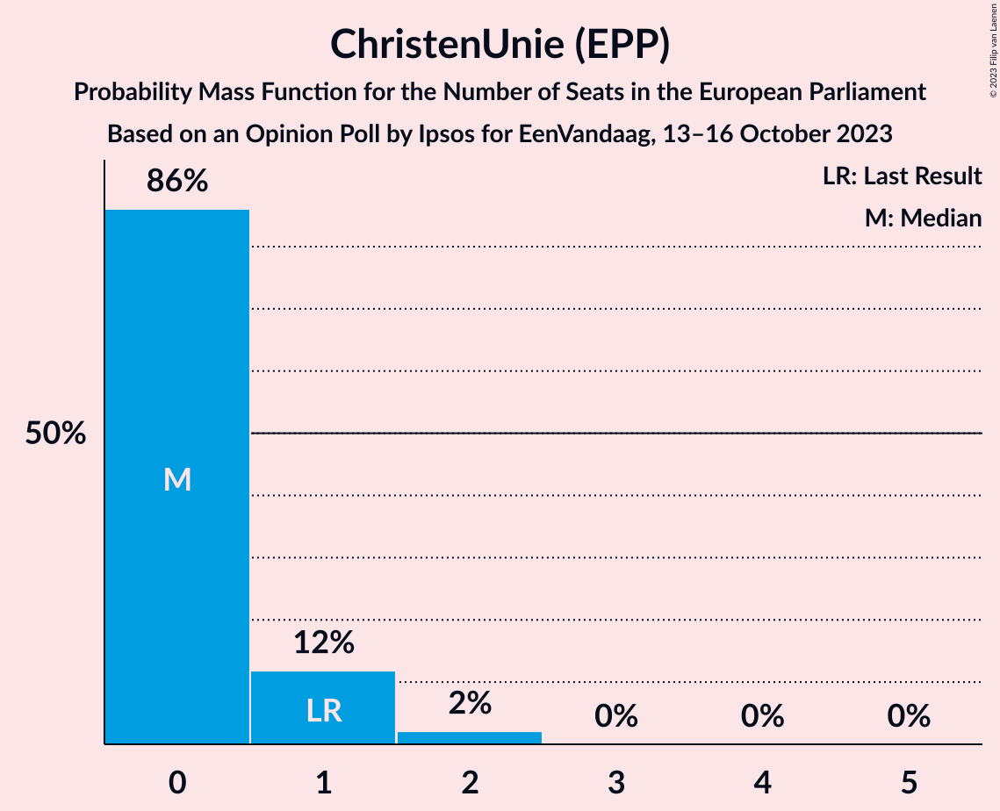

| Number of Seats | Probability | Accumulated | Special Marks |
|:---------------:|:-----------:|:-----------:|:-------------:|
| 0 | 86% | 100% | Median |
| 1 | 12% | 14% | Last Result |
| 2 | 2% | 2% |  |
| 3 | 0% | 0% |  |

### DENK (*)

*For a full overview of the results for this party, see the [DENK (*)](party-denk.html) page.*

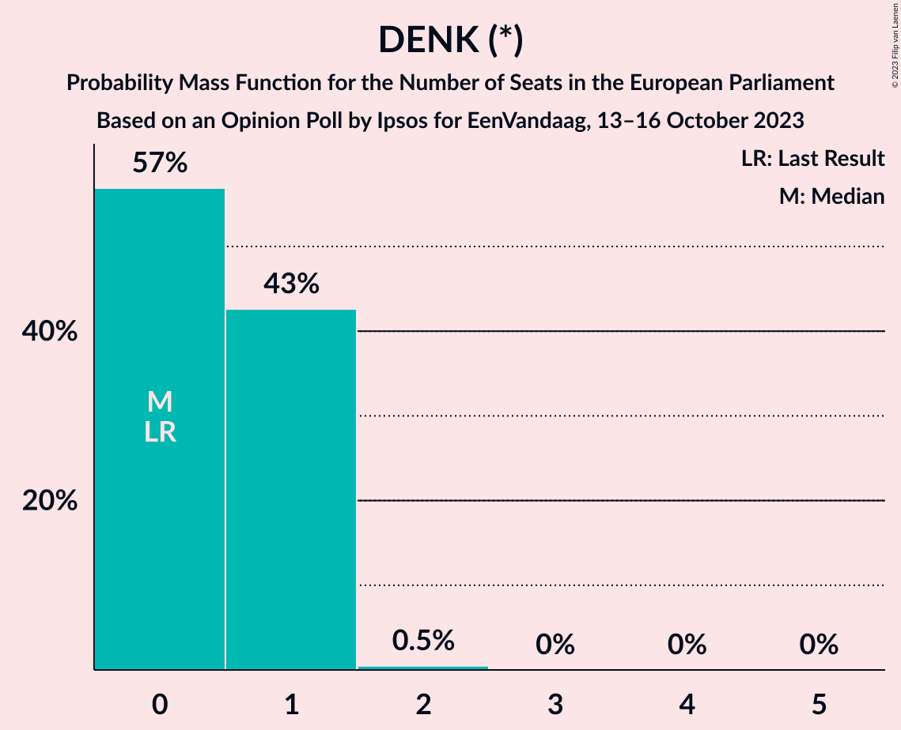

| Number of Seats | Probability | Accumulated | Special Marks |
|:---------------:|:-----------:|:-----------:|:-------------:|
| 0 | 57% | 100% | Last Result, Median |
| 1 | 43% | 43% |  |
| 2 | 0.5% | 0.5% |  |
| 3 | 0% | 0% |  |

### Forum voor Democratie (NI)

*For a full overview of the results for this party, see the [Forum voor Democratie (NI)](party-forumvoordemocratieni.html) page.*

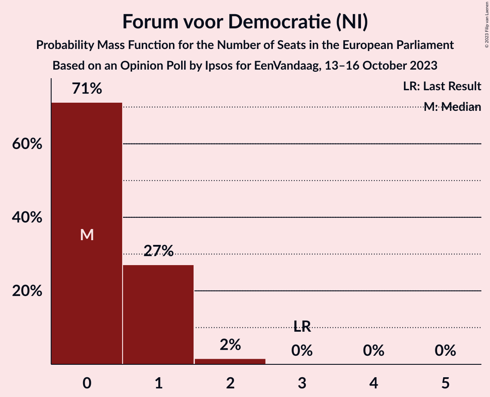

| Number of Seats | Probability | Accumulated | Special Marks |
|:---------------:|:-----------:|:-----------:|:-------------:|
| 0 | 71% | 100% | Median |
| 1 | 27% | 29% |  |
| 2 | 2% | 2% |  |
| 3 | 0% | 0% | Last Result |

### Christen-Democratisch Appèl (EPP)

*For a full overview of the results for this party, see the [Christen-Democratisch Appèl (EPP)](party-christen-democratischappèlepp.html) page.*

| Number of Seats | Probability | Accumulated | Special Marks |
|:---------------:|:-----------:|:-----------:|:-------------:|
| 0 | 81% | 100% | Median |
| 1 | 18% | 19% |  |
| 2 | 0.5% | 0.5% |  |
| 3 | 0% | 0% |  |
| 4 | 0% | 0% | Last Result |

### Staatkundig Gereformeerde Partij (ECR)

*For a full overview of the results for this party, see the [Staatkundig Gereformeerde Partij (ECR)](party-staatkundiggereformeerdepartijecr.html) page.*

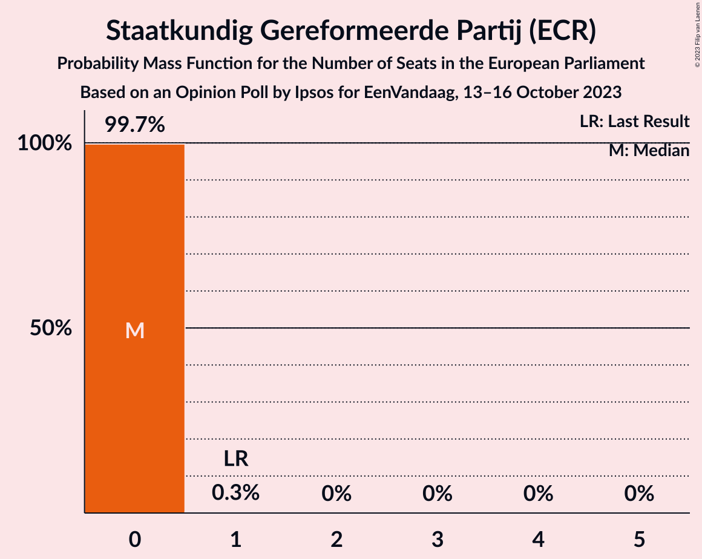

| Number of Seats | Probability | Accumulated | Special Marks |
|:---------------:|:-----------:|:-----------:|:-------------:|
| 0 | 99.7% | 100% | Median |
| 1 | 0.3% | 0.3% | Last Result |
| 2 | 0% | 0% |  |

### Volt Europa (Greens/EFA)

*For a full overview of the results for this party, see the [Volt Europa (Greens/EFA)](party-volteuropagreensefa.html) page.*

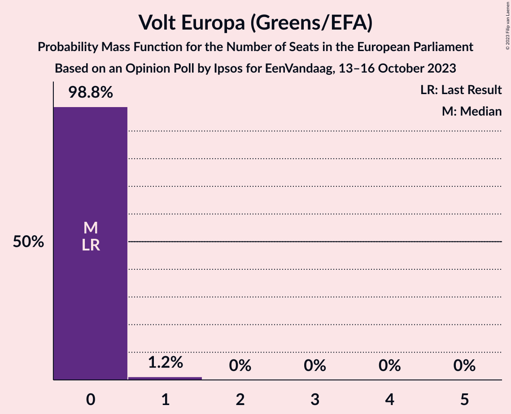

| Number of Seats | Probability | Accumulated | Special Marks |
|:---------------:|:-----------:|:-----------:|:-------------:|
| 0 | 98.8% | 100% | Last Result, Median |
| 1 | 1.2% | 1.2% |  |
| 2 | 0% | 0% |  |

### Juiste Antwoord 2021 (ECR)

*For a full overview of the results for this party, see the [Juiste Antwoord 2021 (ECR)](party-juisteantwoord2021ecr.html) page.*

| Number of Seats | Probability | Accumulated | Special Marks |
|:---------------:|:-----------:|:-----------:|:-------------:|
| 0 | 100% | 100% | Last Result, Median |

### Bij1 (*)

*For a full overview of the results for this party, see the [Bij1 (*)](party-bij1.html) page.*

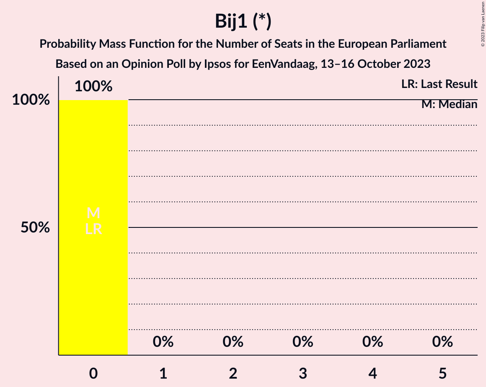

| Number of Seats | Probability | Accumulated | Special Marks |
|:---------------:|:-----------:|:-----------:|:-------------:|
| 0 | 100% | 100% | Last Result, Median |

### 50Plus (EPP)

*For a full overview of the results for this party, see the [50Plus (EPP)](party-50plusepp.html) page.*

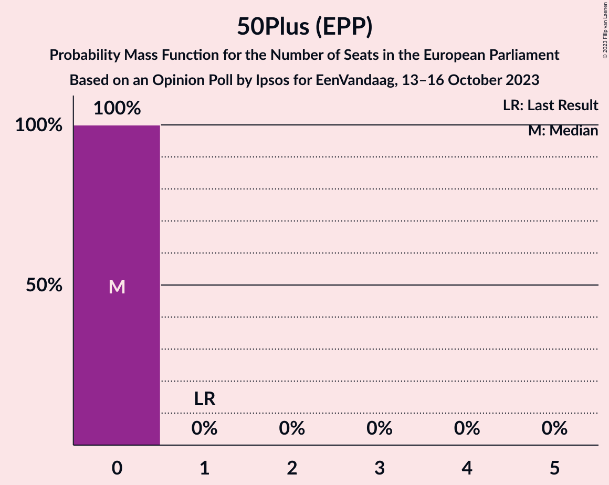

| Number of Seats | Probability | Accumulated | Special Marks |
|:---------------:|:-----------:|:-----------:|:-------------:|
| 0 | 100% | 100% | Median |
| 1 | 0% | 0% | Last Result |

## Coalitions

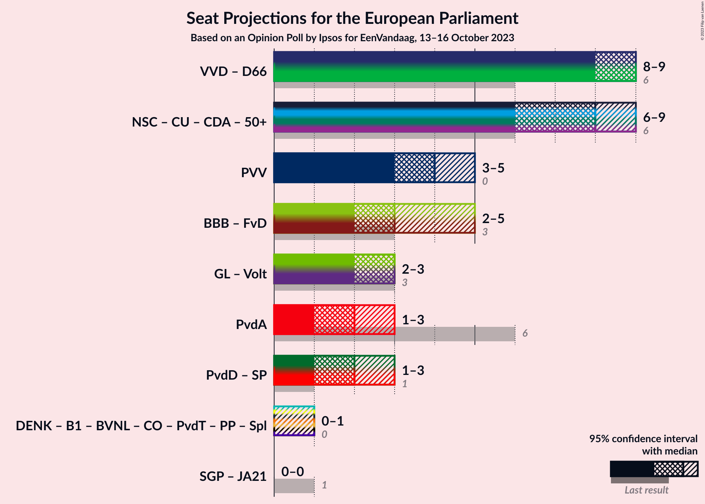

### Confidence Intervals

| Coalition | Last Result | Median | Majority? | 80% Confidence Interval | 90% Confidence Interval | 95% Confidence Interval | 99% Confidence Interval |
|:---------:|:-----------:|:------:|:---------:|:-----------------------:|:-----------------------:|:-----------------------:|:-----------------------:|
| Volkspartij voor Vrijheid en Democratie (RE) – Democraten 66 (RE) | 6 | 9 | 0% | 9 | 8–9 | 8–9 | 7–10 |
| Nieuw Sociaal Contract (EPP) – ChristenUnie (EPP) – Christen-Democratisch Appèl (EPP) – 50Plus (EPP) | 6 | 8 | 0% | 6–9 | 6–9 | 6–9 | 6–10 |
| Partij voor de Vrijheid (ID) | 0 | 4 | 0% | 3–5 | 3–5 | 3–5 | 3–6 |
| BoerBurgerBeweging (NI) – Forum voor Democratie (NI) | 3 | 3 | 0% | 3–4 | 2–5 | 2–5 | 2–5 |
| GroenLinks (Greens/EFA) – Volt Europa (Greens/EFA) | 3 | 3 | 0% | 2–3 | 2–3 | 2–3 | 2–4 |
| Partij van de Arbeid (S&D) | 6 | 2 | 0% | 2–3 | 1–3 | 1–3 | 1–3 |
| Partij voor de Dieren (GUE/NGL) – Socialistische Partij (GUE/NGL) | 1 | 2 | 0% | 2–3 | 1–3 | 1–3 | 1–4 |
| Staatkundig Gereformeerde Partij (ECR) – Juiste Antwoord 2021 (ECR) | 1 | 0 | 0% | 0 | 0 | 0 | 0 |

### Volkspartij voor Vrijheid en Democratie (RE) – Democraten 66 (RE)

| Number of Seats | Probability | Accumulated | Special Marks |
|:---------------:|:-----------:|:-----------:|:-------------:|
| 6 | 0.1% | 100% | Last Result |
| 7 | 2% | 99.9% |  |
| 8 | 6% | 98% | Median |
| 9 | 90% | 92% |  |
| 10 | 2% | 2% |  |
| 11 | 0% | 0% |  |

### Nieuw Sociaal Contract (EPP) – ChristenUnie (EPP) – Christen-Democratisch Appèl (EPP) – 50Plus (EPP)

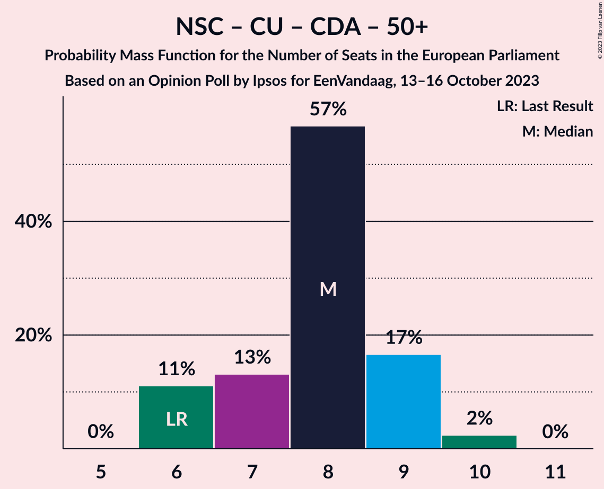

| Number of Seats | Probability | Accumulated | Special Marks |
|:---------------:|:-----------:|:-----------:|:-------------:|
| 6 | 11% | 100% | Last Result |
| 7 | 13% | 89% |  |
| 8 | 57% | 76% | Median |
| 9 | 17% | 19% |  |
| 10 | 2% | 2% |  |
| 11 | 0% | 0% |  |

### Partij voor de Vrijheid (ID)

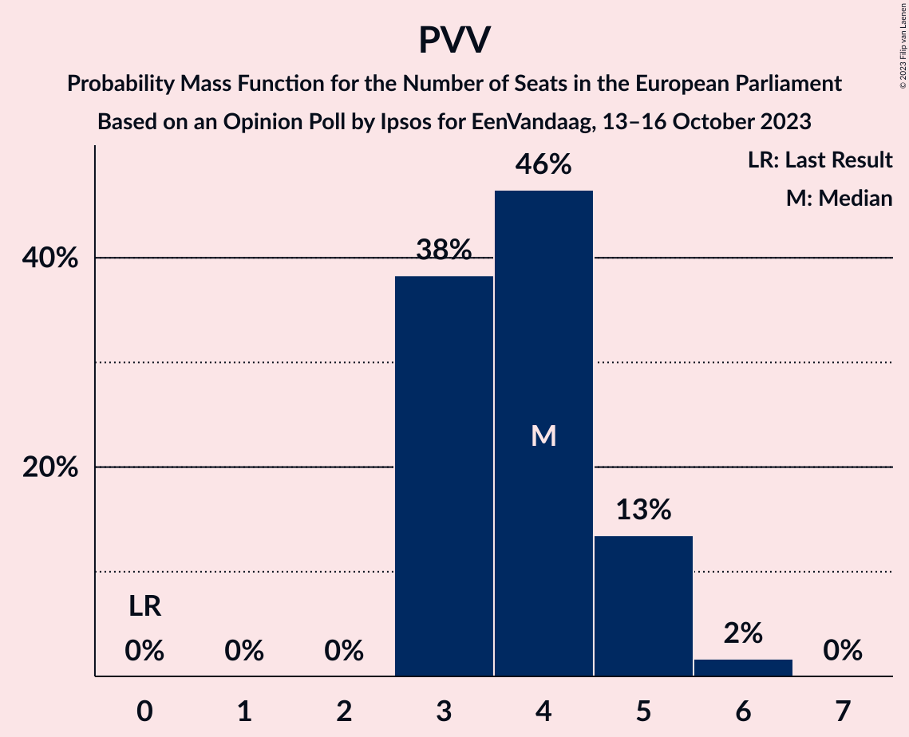

| Number of Seats | Probability | Accumulated | Special Marks |
|:---------------:|:-----------:|:-----------:|:-------------:|
| 0 | 0% | 100% | Last Result |
| 1 | 0% | 100% |  |
| 2 | 0% | 100% |  |
| 3 | 38% | 100% |  |
| 4 | 46% | 62% | Median |
| 5 | 13% | 15% |  |
| 6 | 2% | 2% |  |
| 7 | 0% | 0% |  |

### BoerBurgerBeweging (NI) – Forum voor Democratie (NI)

| Number of Seats | Probability | Accumulated | Special Marks |
|:---------------:|:-----------:|:-----------:|:-------------:|
| 2 | 7% | 100% |  |
| 3 | 79% | 93% | Last Result, Median |
| 4 | 5% | 14% |  |
| 5 | 9% | 9% |  |
| 6 | 0% | 0% |  |

### GroenLinks (Greens/EFA) – Volt Europa (Greens/EFA)

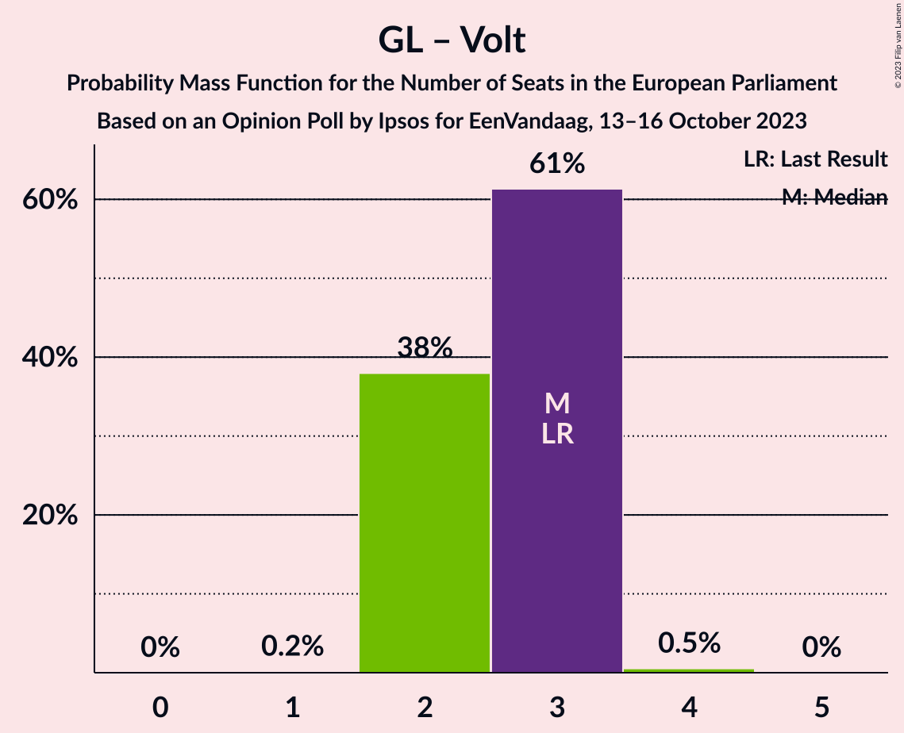

| Number of Seats | Probability | Accumulated | Special Marks |
|:---------------:|:-----------:|:-----------:|:-------------:|
| 1 | 0.2% | 100% |  |
| 2 | 38% | 99.8% |  |
| 3 | 61% | 62% | Last Result, Median |
| 4 | 0.5% | 0.5% |  |
| 5 | 0% | 0% |  |

### Partij van de Arbeid (S&D)

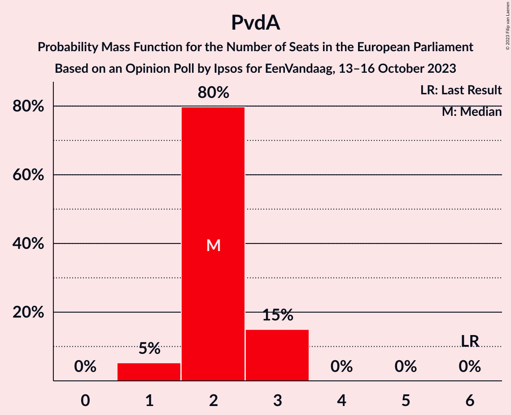

| Number of Seats | Probability | Accumulated | Special Marks |
|:---------------:|:-----------:|:-----------:|:-------------:|
| 1 | 5% | 100% |  |
| 2 | 80% | 95% | Median |
| 3 | 15% | 15% |  |
| 4 | 0% | 0% |  |
| 5 | 0% | 0% |  |
| 6 | 0% | 0% | Last Result |

### Partij voor de Dieren (GUE/NGL) – Socialistische Partij (GUE/NGL)

| Number of Seats | Probability | Accumulated | Special Marks |
|:---------------:|:-----------:|:-----------:|:-------------:|
| 0 | 0.4% | 100% |  |
| 1 | 8% | 99.6% | Last Result |
| 2 | 71% | 91% | Median |
| 3 | 18% | 20% |  |
| 4 | 2% | 2% |  |
| 5 | 0% | 0% |  |

### Staatkundig Gereformeerde Partij (ECR) – Juiste Antwoord 2021 (ECR)

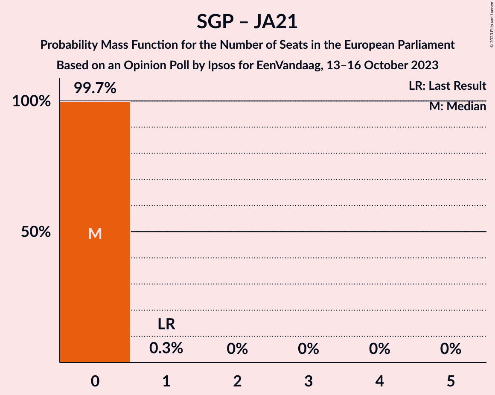

| Number of Seats | Probability | Accumulated | Special Marks |
|:---------------:|:-----------:|:-----------:|:-------------:|
| 0 | 99.7% | 100% | Median |
| 1 | 0.3% | 0.3% | Last Result |
| 2 | 0% | 0% |  |

## Technical Information

### Opinion Poll

+ **Polling firm:** Ipsos
+ **Commissioner(s):** EenVandaag
+ **Fieldwork period:** 13–16 October 2023

### Calculations

+ **Sample size:** 1013
+ **Simulations done:** 1,048,576
+ **Error estimate:** 3.64%

