# Opinion Poll by Portland Communications, 24–31 January 2024

<a href="#voting-intentions">Voting Intentions</a> | <a href="#seats">Seats</a> | <a href="#coalitions">Coalitions</a> | <a href="#technical-information">Technical Information</a>

## Voting Intentions

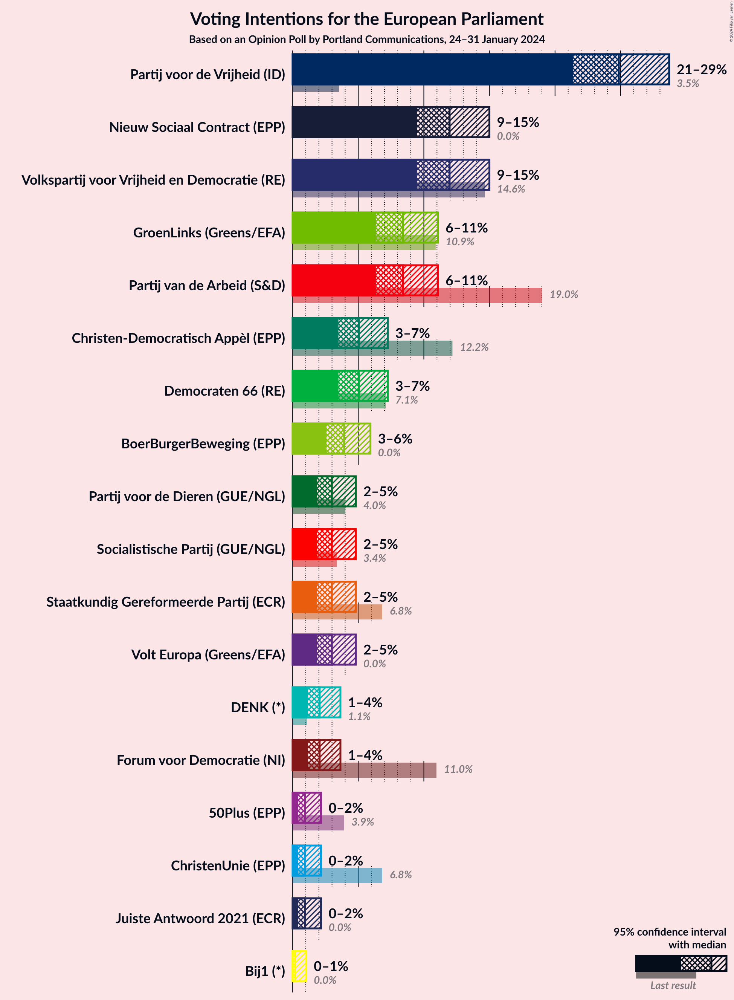

### Confidence Intervals

| Party | Last Result | Poll Result | 80% Confidence Interval | 90% Confidence Interval | 95% Confidence Interval | 99% Confidence Interval |
|:-----:|:-----------:|:-----------:|:-----------------------:|:-----------------------:|:-----------------------:|:-----------------------:|
| Partij voor de Vrijheid (ID) | 3.5% | 24.9% | 22.6–27.4% |21.9–28.1% |21.4–28.7% |20.3–29.9% |
| Nieuw Sociaal Contract (EPP) | 0.0% | 12.0% | 10.3–13.9% |9.9–14.5% |9.5–15.0% |8.7–16.0% |
| Volkspartij voor Vrijheid en Democratie (RE) | 14.6% | 12.0% | 10.3–13.9% |9.9–14.5% |9.5–15.0% |8.7–16.0% |
| GroenLinks (Greens/EFA) | 10.9% | 8.4% | 7.0–10.2% |6.7–10.6% |6.3–11.1% |5.7–12.0% |
| Partij van de Arbeid (S&D) | 19.0% | 8.4% | 7.0–10.2% |6.7–10.6% |6.3–11.1% |5.7–12.0% |
| Democraten 66 (RE) | 7.1% | 5.0% | 4.0–6.5% |3.7–6.9% |3.5–7.3% |3.0–8.0% |
| Christen-Democratisch Appèl (EPP) | 12.2% | 5.0% | 4.0–6.5% |3.7–6.9% |3.5–7.3% |3.0–8.0% |
| BoerBurgerBeweging (EPP) | 0.0% | 3.9% | 3.0–5.2% |2.8–5.6% |2.6–5.9% |2.2–6.6% |
| Staatkundig Gereformeerde Partij (ECR) | 6.8% | 3.0% | 2.2–4.2% |2.0–4.5% |1.8–4.8% |1.5–5.4% |
| Partij voor de Dieren (GUE/NGL) | 4.0% | 3.0% | 2.2–4.2% |2.0–4.5% |1.8–4.8% |1.5–5.4% |
| Socialistische Partij (GUE/NGL) | 3.4% | 3.0% | 2.2–4.2% |2.0–4.5% |1.8–4.8% |1.5–5.4% |
| Volt Europa (Greens/EFA) | 0.0% | 3.0% | 2.2–4.2% |2.0–4.5% |1.8–4.8% |1.5–5.4% |
| DENK (*) | 1.1% | 2.1% | 1.5–3.1% |1.3–3.4% |1.2–3.6% |0.9–4.2% |
| Forum voor Democratie (NI) | 11.0% | 2.1% | 1.5–3.1% |1.3–3.4% |1.2–3.6% |0.9–4.2% |
| Juiste Antwoord 2021 (ECR) | 0.0% | 0.9% | 0.6–1.7% |0.5–2.0% |0.4–2.2% |0.3–2.6% |
| 50Plus (EPP) | 3.9% | 0.9% | 0.6–1.7% |0.5–2.0% |0.4–2.2% |0.3–2.6% |
| ChristenUnie (EPP) | 6.8% | 0.9% | 0.6–1.7% |0.5–2.0% |0.4–2.2% |0.3–2.6% |
| Bij1 (*) | 0.0% | 0.2% | 0.1–0.7% |0.1–0.9% |0.0–1.0% |0.0–1.4% |

*Note:* The poll result column reflects the actual value used in the calculations. Published results may vary slightly, and in addition be rounded to fewer digits.

## Seats

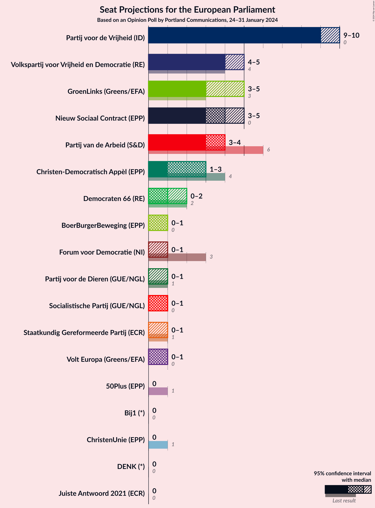

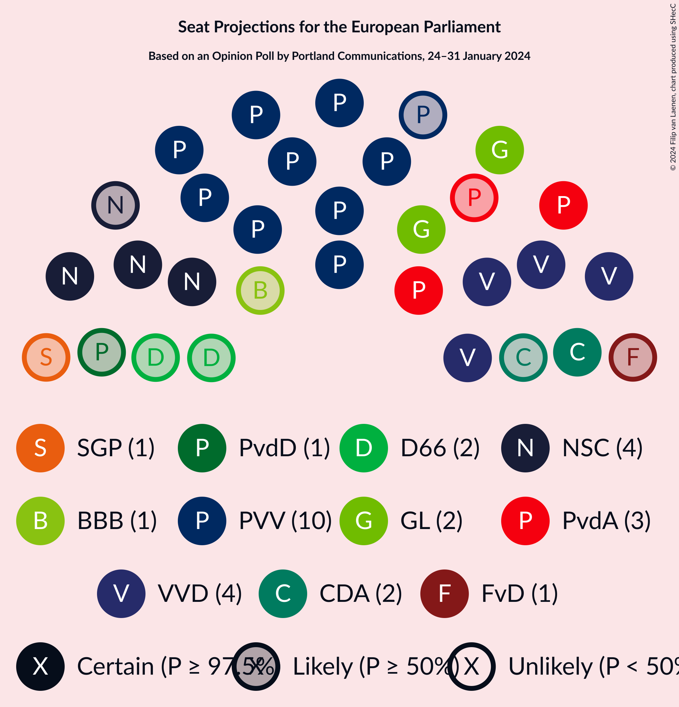

### Confidence Intervals

| Party | Last Result | Median | 80% Confidence Interval | 90% Confidence Interval | 95% Confidence Interval | 99% Confidence Interval |
|:-----:|:-----------:|:------:|:-----------------------:|:-----------------------:|:-----------------------:|:-----------------------:|
| <a href="#partij-voor-de-vrijheid-(id)">Partij voor de Vrijheid (ID)</a> | 0 | 9 | 9–10 |9–10 |9–10 |8–11 |
| <a href="#nieuw-sociaal-contract-(epp)">Nieuw Sociaal Contract (EPP)</a> | 0 | 4 | 3–5 |3–5 |3–5 |3–6 |
| <a href="#volkspartij-voor-vrijheid-en-democratie-(re)">Volkspartij voor Vrijheid en Democratie (RE)</a> | 4 | 4 | 4–5 |4–5 |4–5 |4–6 |
| <a href="#groenlinks-(greens/efa)">GroenLinks (Greens/EFA)</a> | 3 | 3 | 3 |3 |3–5 |3–5 |
| <a href="#partij-van-de-arbeid-(s&d)">Partij van de Arbeid (S&D)</a> | 6 | 4 | 3–4 |3–4 |3–4 |3–4 |
| <a href="#democraten-66-(re)">Democraten 66 (RE)</a> | 2 | 1 | 0–2 |0–2 |0–2 |0–2 |
| <a href="#christen-democratisch-appèl-(epp)">Christen-Democratisch Appèl (EPP)</a> | 4 | 3 | 1–3 |1–3 |1–3 |1–3 |
| <a href="#boerburgerbeweging-(epp)">BoerBurgerBeweging (EPP)</a> | 0 | 1 | 0–1 |0–1 |0–1 |0–2 |
| <a href="#staatkundig-gereformeerde-partij-(ecr)">Staatkundig Gereformeerde Partij (ECR)</a> | 1 | 0 | 0–1 |0–1 |0–1 |0–1 |
| <a href="#partij-voor-de-dieren-(gue/ngl)">Partij voor de Dieren (GUE/NGL)</a> | 1 | 0 | 0–1 |0–1 |0–1 |0–1 |
| <a href="#socialistische-partij-(gue/ngl)">Socialistische Partij (GUE/NGL)</a> | 0 | 1 | 0–1 |0–1 |0–1 |0–1 |
| <a href="#volt-europa-(greens/efa)">Volt Europa (Greens/EFA)</a> | 0 | 1 | 0–1 |0–1 |0–1 |0–2 |
| <a href="#denk-(*)">DENK (*)</a> | 0 | 0 | 0 |0 |0 |0 |
| <a href="#forum-voor-democratie-(ni)">Forum voor Democratie (NI)</a> | 3 | 0 | 0 |0–1 |0–1 |0–1 |
| <a href="#juiste-antwoord-2021-(ecr)">Juiste Antwoord 2021 (ECR)</a> | 0 | 0 | 0 |0 |0 |0 |
| <a href="#50plus-(epp)">50Plus (EPP)</a> | 1 | 0 | 0 |0 |0 |0 |
| <a href="#christenunie-(epp)">ChristenUnie (EPP)</a> | 1 | 0 | 0 |0 |0 |0–1 |
| <a href="#bij1-(*)">Bij1 (*)</a> | 0 | 0 | 0 |0 |0 |0 |

### Partij voor de Vrijheid (ID)

*For a full overview of the results for this party, see the [Partij voor de Vrijheid (ID)](party-partijvoordevrijheidid.html) page.*

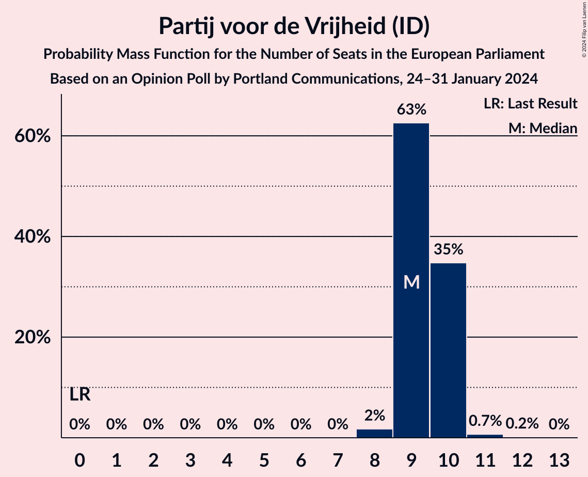

| Number of Seats | Probability | Accumulated | Special Marks |
|:---------------:|:-----------:|:-----------:|:-------------:|
| 0 | 0% | 100% | Last Result |
| 1 | 0% | 100% |  |
| 2 | 0% | 100% |  |
| 3 | 0% | 100% |  |
| 4 | 0% | 100% |  |
| 5 | 0% | 100% |  |
| 6 | 0% | 100% |  |
| 7 | 0% | 100% |  |
| 8 | 2% | 100% |  |
| 9 | 63% | 98% | Median |
| 10 | 35% | 36% |  |
| 11 | 0.7% | 0.9% |  |
| 12 | 0.2% | 0.2% |  |
| 13 | 0% | 0% |  |

### Nieuw Sociaal Contract (EPP)

*For a full overview of the results for this party, see the [Nieuw Sociaal Contract (EPP)](party-nieuwsociaalcontractepp.html) page.*

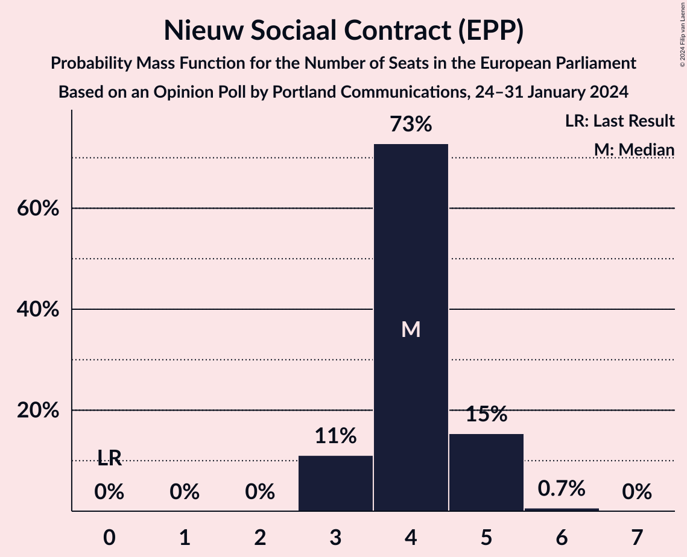

| Number of Seats | Probability | Accumulated | Special Marks |
|:---------------:|:-----------:|:-----------:|:-------------:|
| 0 | 0% | 100% | Last Result |
| 1 | 0% | 100% |  |
| 2 | 0% | 100% |  |
| 3 | 11% | 100% |  |
| 4 | 73% | 89% | Median |
| 5 | 15% | 16% |  |
| 6 | 0.7% | 0.7% |  |
| 7 | 0% | 0% |  |

### Volkspartij voor Vrijheid en Democratie (RE)

*For a full overview of the results for this party, see the [Volkspartij voor Vrijheid en Democratie (RE)](party-volkspartijvoorvrijheidendemocratiere.html) page.*

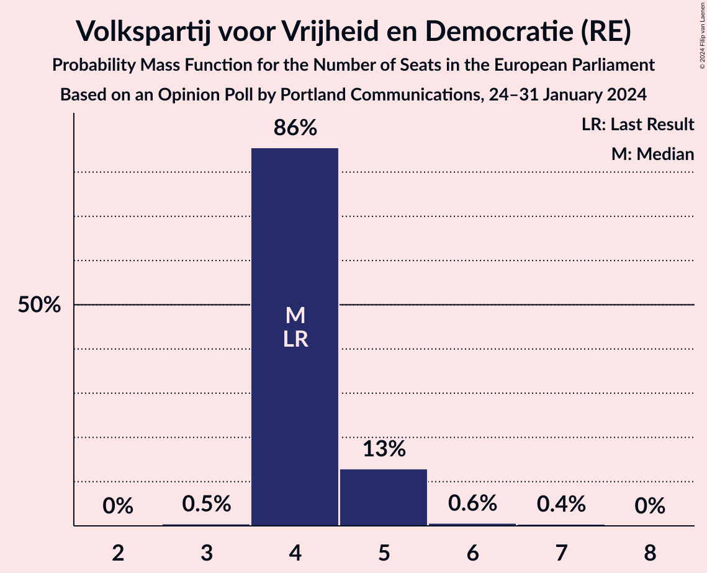

| Number of Seats | Probability | Accumulated | Special Marks |
|:---------------:|:-----------:|:-----------:|:-------------:|
| 3 | 0.5% | 100% |  |
| 4 | 75% | 99.5% | Last Result, Median |
| 5 | 23% | 24% |  |
| 6 | 1.4% | 1.4% |  |
| 7 | 0% | 0% |  |

### GroenLinks (Greens/EFA)

*For a full overview of the results for this party, see the [GroenLinks (Greens/EFA)](party-groenlinksgreensefa.html) page.*

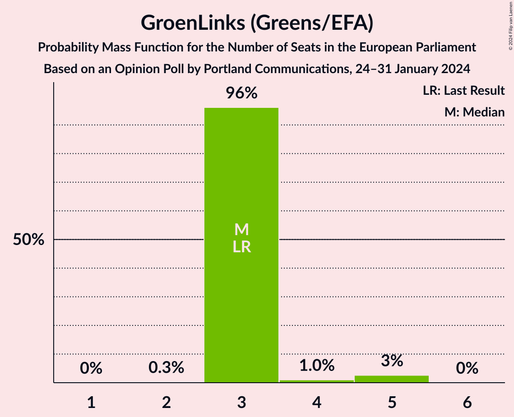

| Number of Seats | Probability | Accumulated | Special Marks |
|:---------------:|:-----------:|:-----------:|:-------------:|
| 2 | 0.3% | 100% |  |
| 3 | 96% | 99.7% | Last Result, Median |
| 4 | 1.0% | 4% |  |
| 5 | 3% | 3% |  |
| 6 | 0% | 0% |  |

### Partij van de Arbeid (S&D)

*For a full overview of the results for this party, see the [Partij van de Arbeid (S&D)](party-partijvandearbeidsd.html) page.*

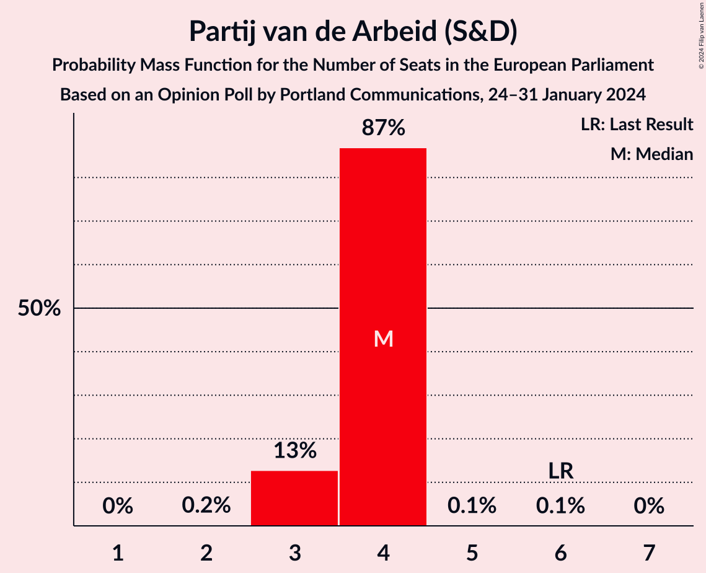

| Number of Seats | Probability | Accumulated | Special Marks |
|:---------------:|:-----------:|:-----------:|:-------------:|
| 2 | 0.2% | 100% |  |
| 3 | 13% | 99.8% |  |
| 4 | 87% | 87% | Median |
| 5 | 0.1% | 0.2% |  |
| 6 | 0.1% | 0.1% | Last Result |
| 7 | 0% | 0% |  |

### Democraten 66 (RE)

*For a full overview of the results for this party, see the [Democraten 66 (RE)](party-democraten66re.html) page.*

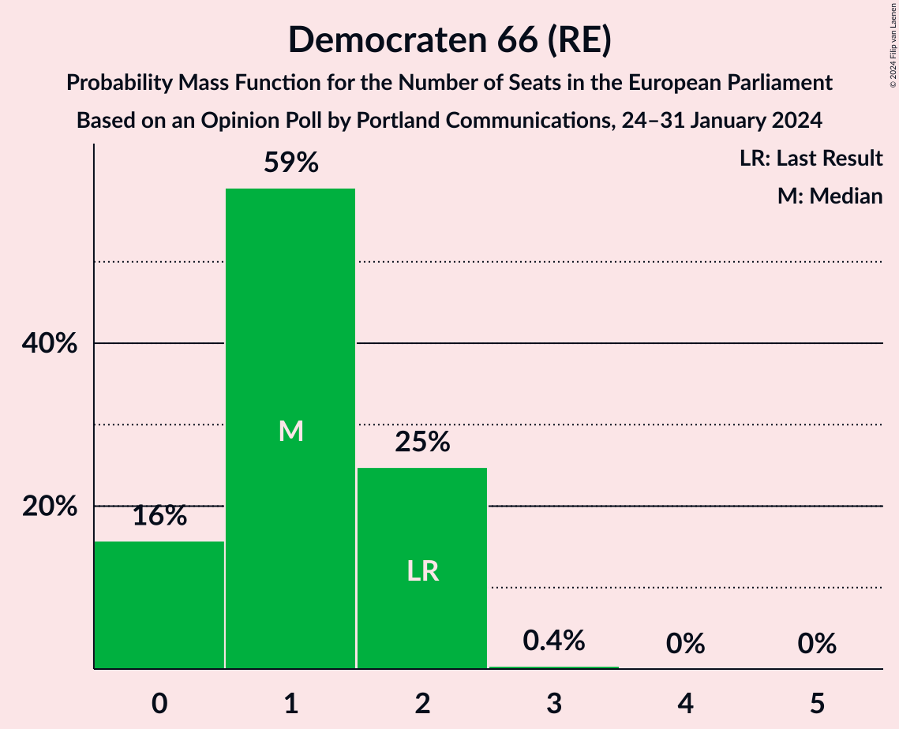

| Number of Seats | Probability | Accumulated | Special Marks |
|:---------------:|:-----------:|:-----------:|:-------------:|
| 0 | 16% | 100% |  |
| 1 | 59% | 84% | Median |
| 2 | 25% | 25% | Last Result |
| 3 | 0.4% | 0.4% |  |
| 4 | 0% | 0% |  |

### Christen-Democratisch Appèl (EPP)

*For a full overview of the results for this party, see the [Christen-Democratisch Appèl (EPP)](party-christen-democratischappèlepp.html) page.*

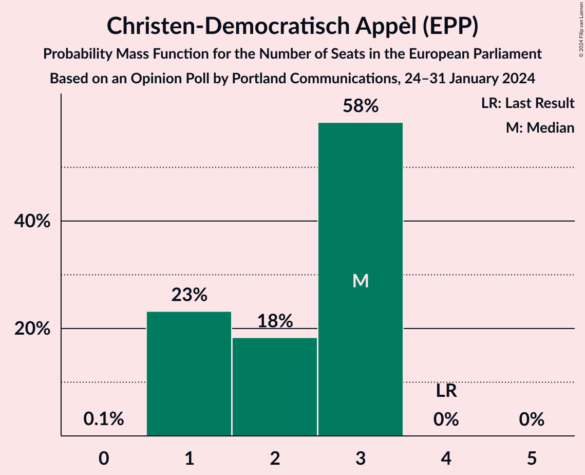

| Number of Seats | Probability | Accumulated | Special Marks |
|:---------------:|:-----------:|:-----------:|:-------------:|
| 0 | 0.1% | 100% |  |
| 1 | 23% | 99.9% |  |
| 2 | 18% | 77% |  |
| 3 | 58% | 58% | Median |
| 4 | 0% | 0% | Last Result |

### BoerBurgerBeweging (EPP)

*For a full overview of the results for this party, see the [BoerBurgerBeweging (EPP)](party-boerburgerbewegingepp.html) page.*

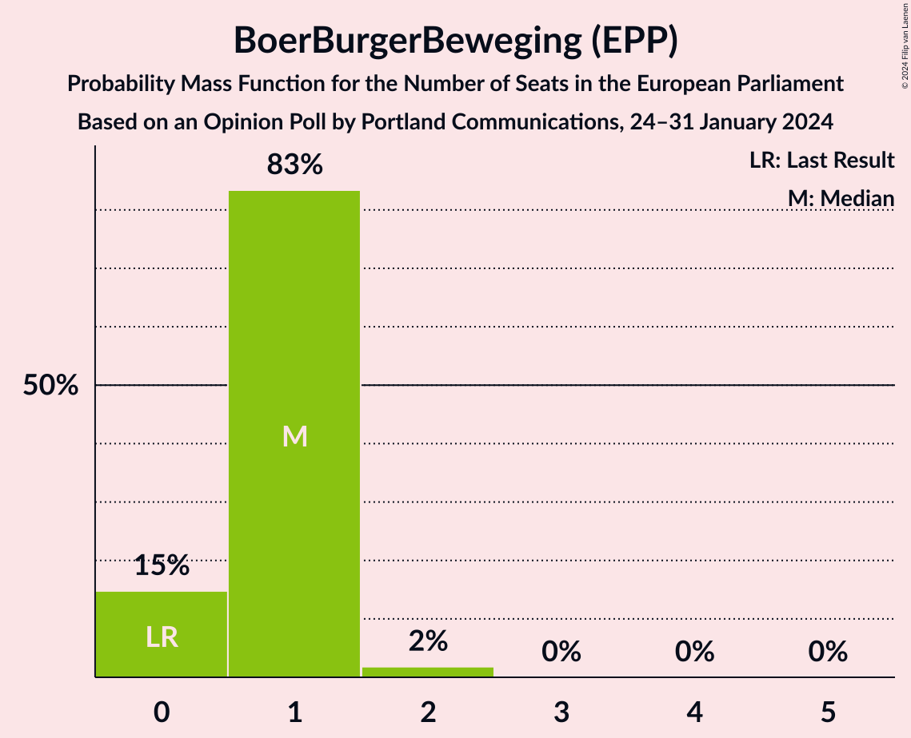

| Number of Seats | Probability | Accumulated | Special Marks |
|:---------------:|:-----------:|:-----------:|:-------------:|
| 0 | 15% | 100% | Last Result |
| 1 | 83% | 85% | Median |
| 2 | 2% | 2% |  |
| 3 | 0% | 0% |  |

### Staatkundig Gereformeerde Partij (ECR)

*For a full overview of the results for this party, see the [Staatkundig Gereformeerde Partij (ECR)](party-staatkundiggereformeerdepartijecr.html) page.*

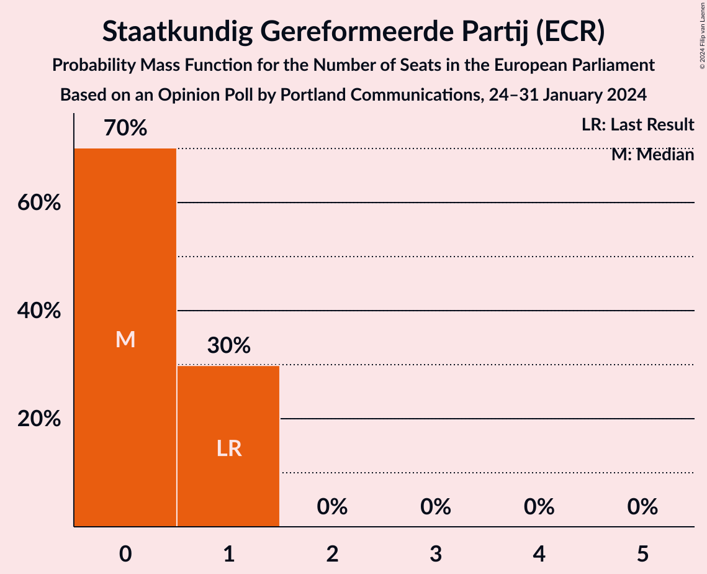

| Number of Seats | Probability | Accumulated | Special Marks |
|:---------------:|:-----------:|:-----------:|:-------------:|
| 0 | 70% | 100% | Median |
| 1 | 30% | 30% | Last Result |
| 2 | 0% | 0% |  |

### Partij voor de Dieren (GUE/NGL)

*For a full overview of the results for this party, see the [Partij voor de Dieren (GUE/NGL)](party-partijvoordedierenguengl.html) page.*

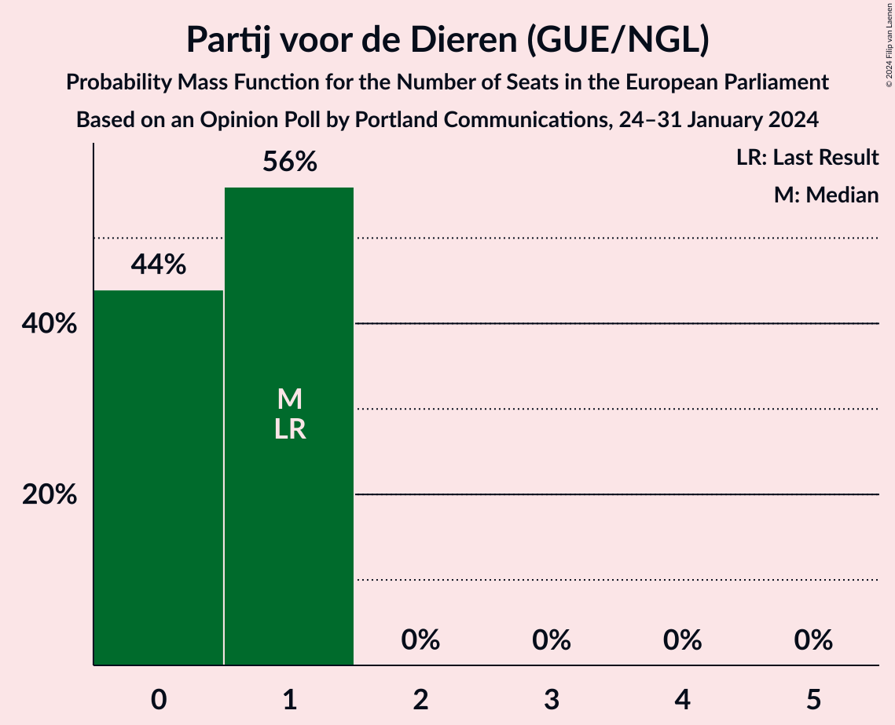

| Number of Seats | Probability | Accumulated | Special Marks |
|:---------------:|:-----------:|:-----------:|:-------------:|
| 0 | 71% | 100% | Median |
| 1 | 29% | 29% | Last Result |
| 2 | 0.1% | 0.1% |  |
| 3 | 0% | 0% |  |

### Socialistische Partij (GUE/NGL)

*For a full overview of the results for this party, see the [Socialistische Partij (GUE/NGL)](party-socialistischepartijguengl.html) page.*

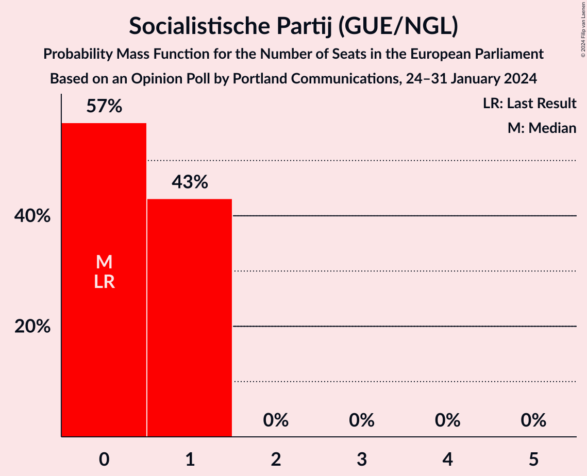

| Number of Seats | Probability | Accumulated | Special Marks |
|:---------------:|:-----------:|:-----------:|:-------------:|
| 0 | 31% | 100% | Last Result |
| 1 | 69% | 69% | Median |
| 2 | 0% | 0% |  |

### Volt Europa (Greens/EFA)

*For a full overview of the results for this party, see the [Volt Europa (Greens/EFA)](party-volteuropagreensefa.html) page.*

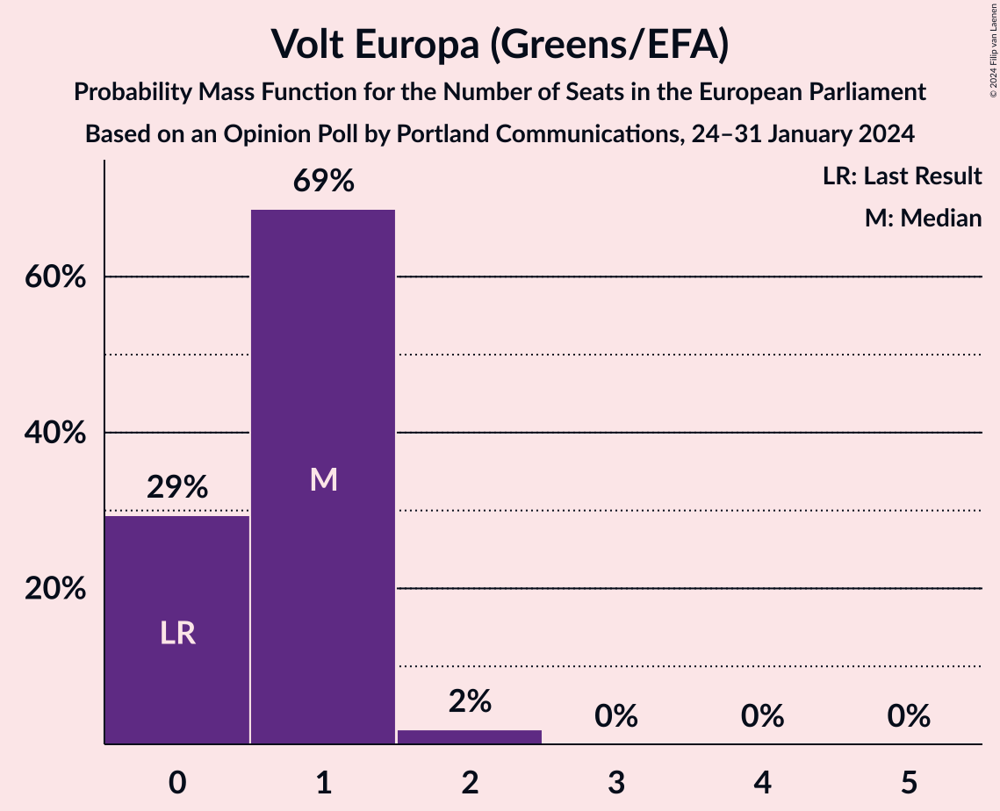

| Number of Seats | Probability | Accumulated | Special Marks |
|:---------------:|:-----------:|:-----------:|:-------------:|
| 0 | 29% | 100% | Last Result |
| 1 | 69% | 71% | Median |
| 2 | 2% | 2% |  |
| 3 | 0% | 0% |  |

### DENK (*)

*For a full overview of the results for this party, see the [DENK (*)](party-denk.html) page.*

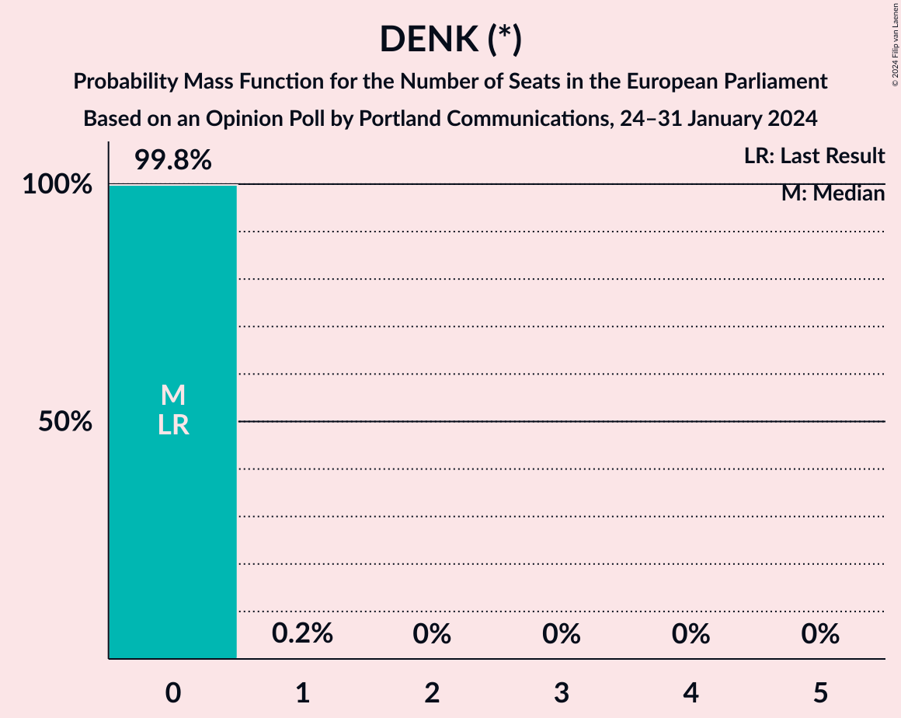

| Number of Seats | Probability | Accumulated | Special Marks |
|:---------------:|:-----------:|:-----------:|:-------------:|
| 0 | 99.8% | 100% | Last Result, Median |
| 1 | 0.2% | 0.2% |  |
| 2 | 0% | 0% |  |

### Forum voor Democratie (NI)

*For a full overview of the results for this party, see the [Forum voor Democratie (NI)](party-forumvoordemocratieni.html) page.*

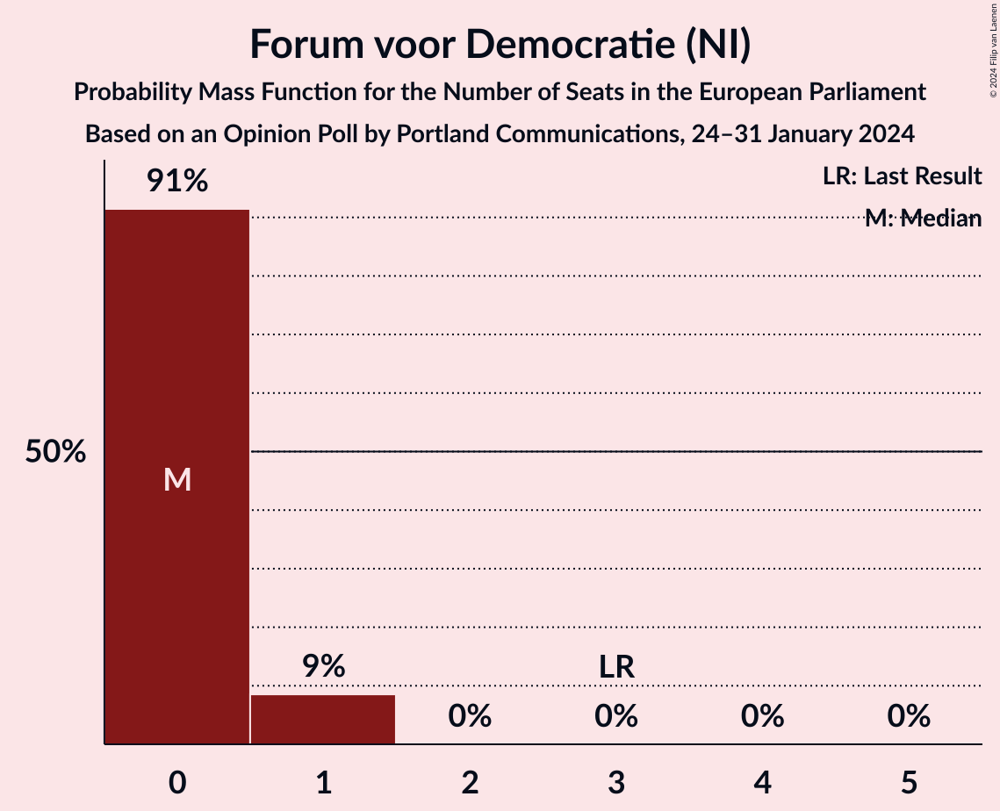

| Number of Seats | Probability | Accumulated | Special Marks |
|:---------------:|:-----------:|:-----------:|:-------------:|
| 0 | 91% | 100% | Median |
| 1 | 9% | 9% |  |
| 2 | 0% | 0% |  |
| 3 | 0% | 0% | Last Result |

### Juiste Antwoord 2021 (ECR)

*For a full overview of the results for this party, see the [Juiste Antwoord 2021 (ECR)](party-juisteantwoord2021ecr.html) page.*

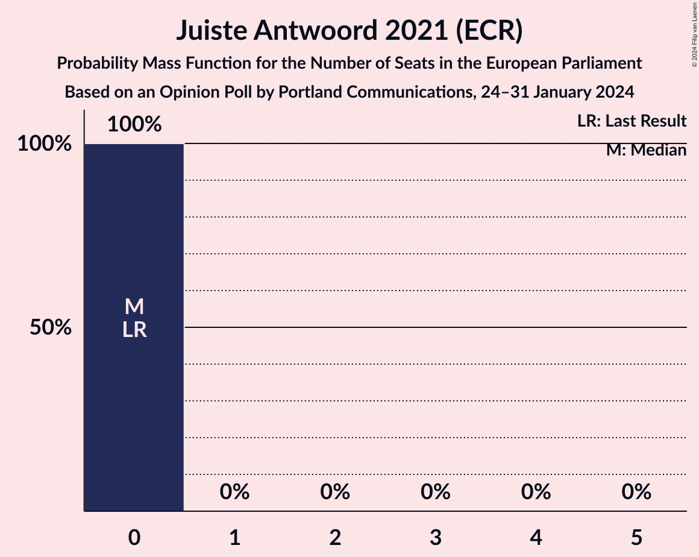

| Number of Seats | Probability | Accumulated | Special Marks |
|:---------------:|:-----------:|:-----------:|:-------------:|
| 0 | 100% | 100% | Last Result, Median |

### 50Plus (EPP)

*For a full overview of the results for this party, see the [50Plus (EPP)](party-50plusepp.html) page.*

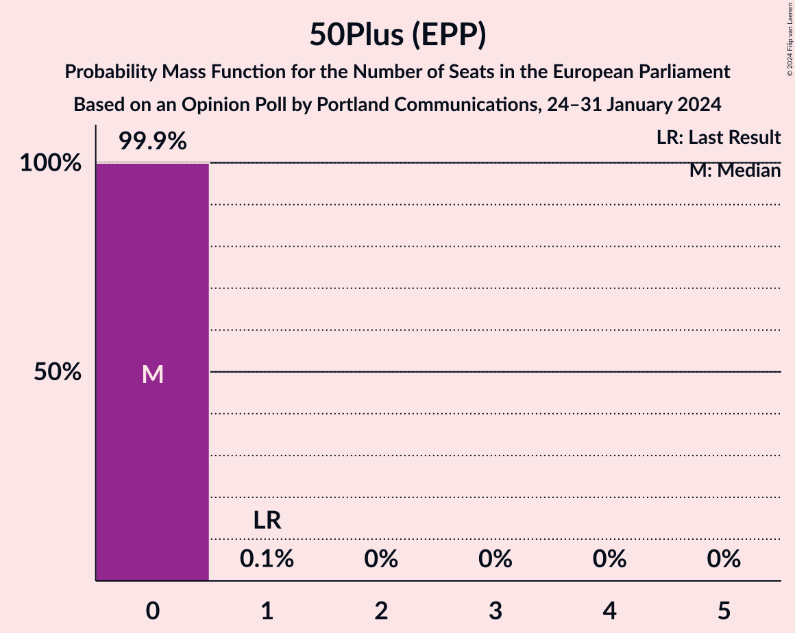

| Number of Seats | Probability | Accumulated | Special Marks |
|:---------------:|:-----------:|:-----------:|:-------------:|
| 0 | 100% | 100% | Median |
| 1 | 0% | 0% | Last Result |

### ChristenUnie (EPP)

*For a full overview of the results for this party, see the [ChristenUnie (EPP)](party-christenunieepp.html) page.*

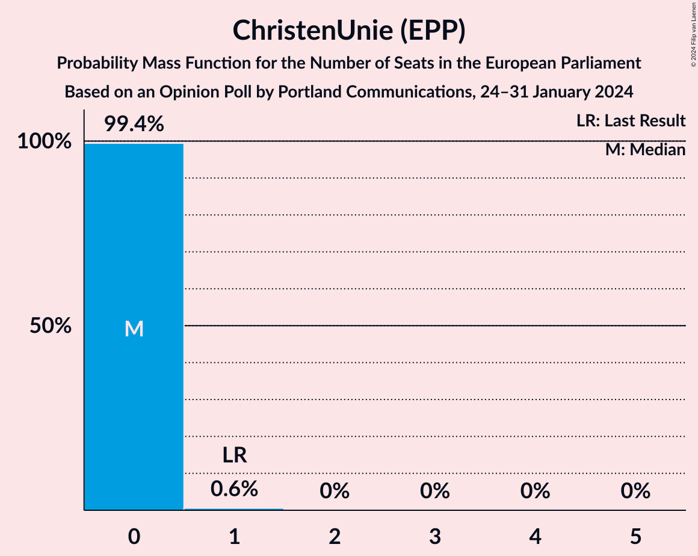

| Number of Seats | Probability | Accumulated | Special Marks |
|:---------------:|:-----------:|:-----------:|:-------------:|
| 0 | 99.4% | 100% | Median |
| 1 | 0.6% | 0.6% | Last Result |
| 2 | 0% | 0% |  |

### Bij1 (*)

*For a full overview of the results for this party, see the [Bij1 (*)](party-bij1.html) page.*

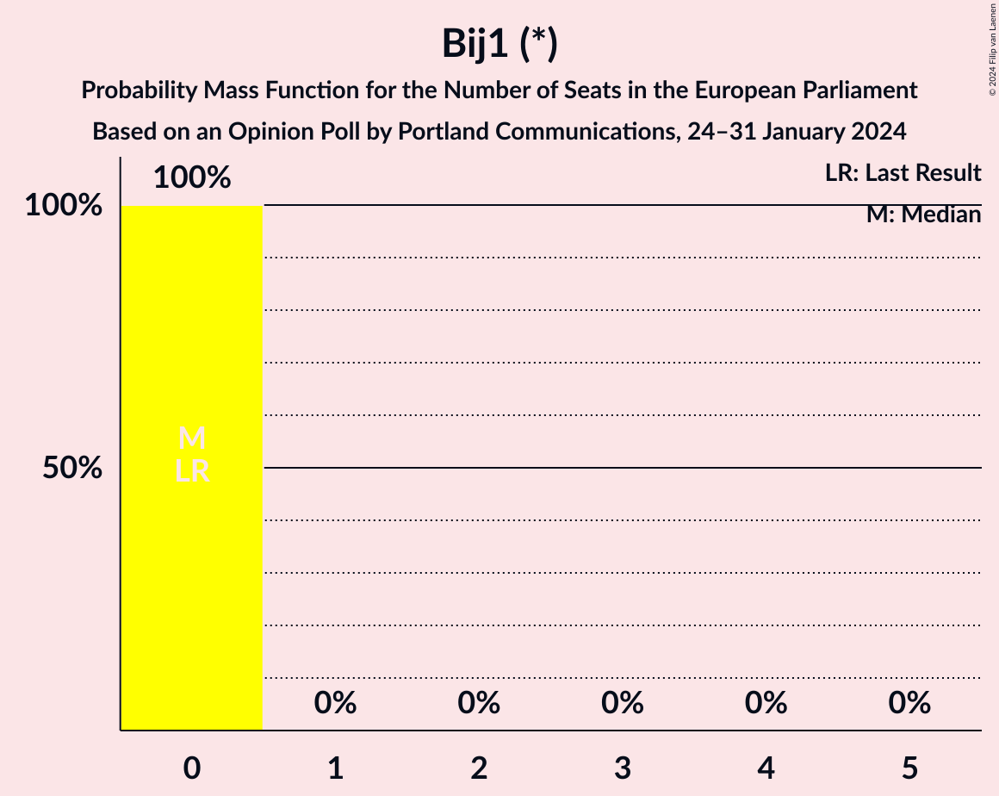

| Number of Seats | Probability | Accumulated | Special Marks |
|:---------------:|:-----------:|:-----------:|:-------------:|
| 0 | 100% | 100% | Last Result, Median |

## Coalitions

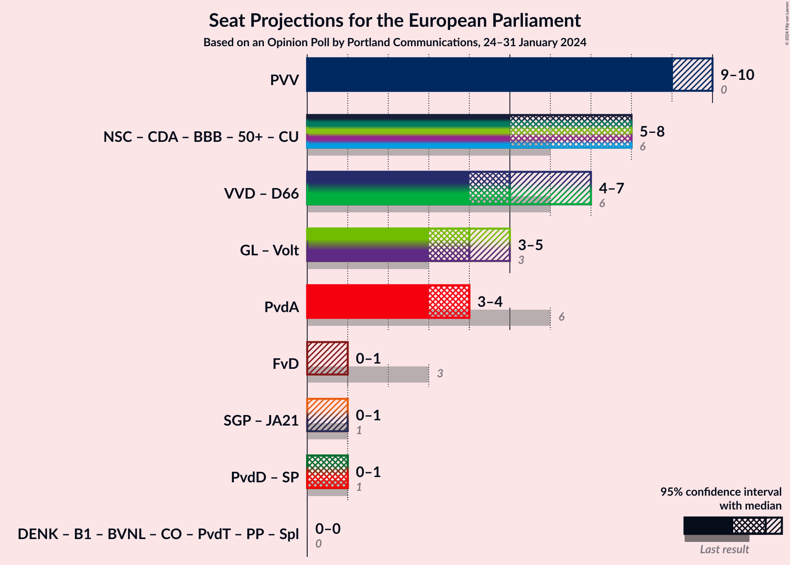

### Confidence Intervals

| Coalition | Last Result | Median | Majority? | 80% Confidence Interval | 90% Confidence Interval | 95% Confidence Interval | 99% Confidence Interval |
|:---------:|:-----------:|:------:|:---------:|:-----------------------:|:-----------------------:|:-----------------------:|:-----------------------:|
| Partij voor de Vrijheid (ID) | 0 | 9 | 0% | 9–10 | 9–10 | 9–10 | 8–11 |
| Nieuw Sociaal Contract (EPP) – Christen-Democratisch Appèl (EPP) – BoerBurgerBeweging (EPP) – 50Plus (EPP) – ChristenUnie (EPP) | 6 | 8 | 0% | 6–8 | 5–8 | 5–8 | 5–8 |
| Volkspartij voor Vrijheid en Democratie (RE) – Democraten 66 (RE) | 6 | 5 | 0% | 5–7 | 5–7 | 4–7 | 4–8 |
| GroenLinks (Greens/EFA) – Volt Europa (Greens/EFA) | 3 | 4 | 0% | 3–4 | 3–5 | 3–5 | 3–5 |
| Partij van de Arbeid (S&D) | 6 | 4 | 0% | 3–4 | 3–4 | 3–4 | 3–4 |
| Forum voor Democratie (NI) | 3 | 0 | 0% | 0 | 0–1 | 0–1 | 0–1 |
| Staatkundig Gereformeerde Partij (ECR) – Juiste Antwoord 2021 (ECR) | 1 | 0 | 0% | 0–1 | 0–1 | 0–1 | 0–1 |
| Partij voor de Dieren (GUE/NGL) – Socialistische Partij (GUE/NGL) | 1 | 1 | 0% | 1 | 1 | 0–1 | 0–1 |

### Partij voor de Vrijheid (ID)

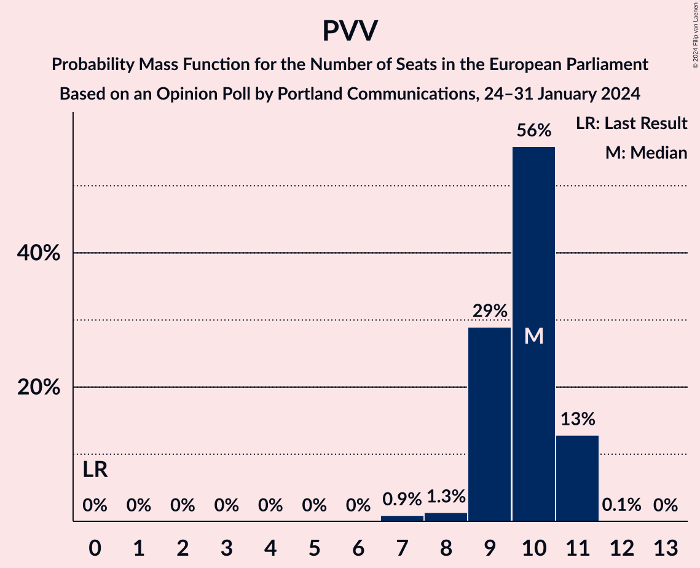

| Number of Seats | Probability | Accumulated | Special Marks |
|:---------------:|:-----------:|:-----------:|:-------------:|
| 0 | 0% | 100% | Last Result |
| 1 | 0% | 100% |  |
| 2 | 0% | 100% |  |
| 3 | 0% | 100% |  |
| 4 | 0% | 100% |  |
| 5 | 0% | 100% |  |
| 6 | 0% | 100% |  |
| 7 | 0% | 100% |  |
| 8 | 2% | 100% |  |
| 9 | 63% | 98% | Median |
| 10 | 35% | 36% |  |
| 11 | 0.7% | 0.9% |  |
| 12 | 0.2% | 0.2% |  |
| 13 | 0% | 0% |  |

### Nieuw Sociaal Contract (EPP) – Christen-Democratisch Appèl (EPP) – BoerBurgerBeweging (EPP) – 50Plus (EPP) – ChristenUnie (EPP)

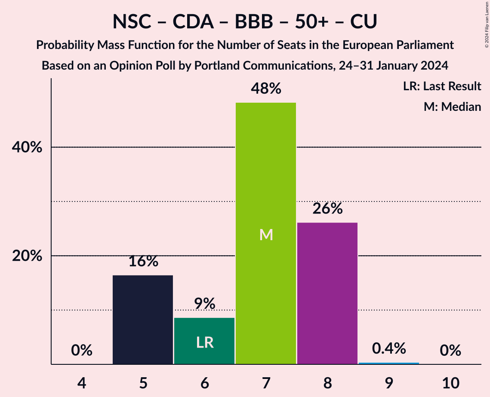

| Number of Seats | Probability | Accumulated | Special Marks |
|:---------------:|:-----------:|:-----------:|:-------------:|
| 4 | 0.1% | 100% |  |
| 5 | 9% | 99.9% |  |
| 6 | 14% | 90% | Last Result |
| 7 | 16% | 77% |  |
| 8 | 61% | 61% | Median |
| 9 | 0.1% | 0.1% |  |
| 10 | 0% | 0% |  |

### Volkspartij voor Vrijheid en Democratie (RE) – Democraten 66 (RE)

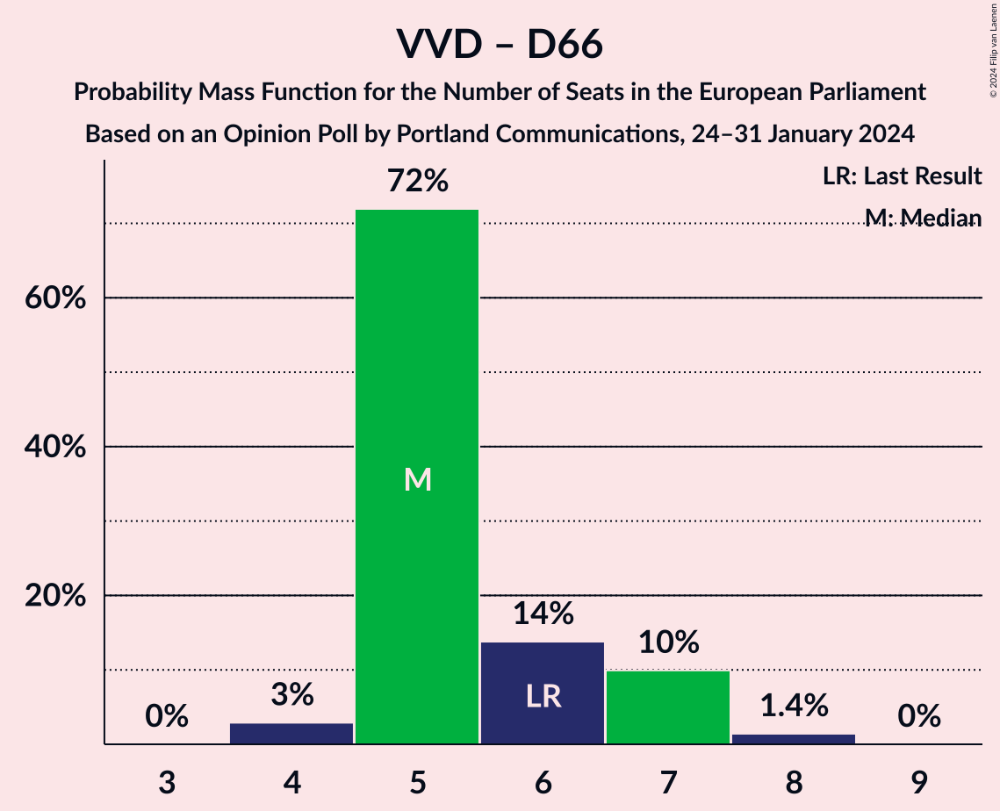

| Number of Seats | Probability | Accumulated | Special Marks |
|:---------------:|:-----------:|:-----------:|:-------------:|
| 4 | 3% | 100% |  |
| 5 | 72% | 97% | Median |
| 6 | 14% | 25% | Last Result |
| 7 | 10% | 11% |  |
| 8 | 1.4% | 1.4% |  |
| 9 | 0% | 0% |  |

### GroenLinks (Greens/EFA) – Volt Europa (Greens/EFA)

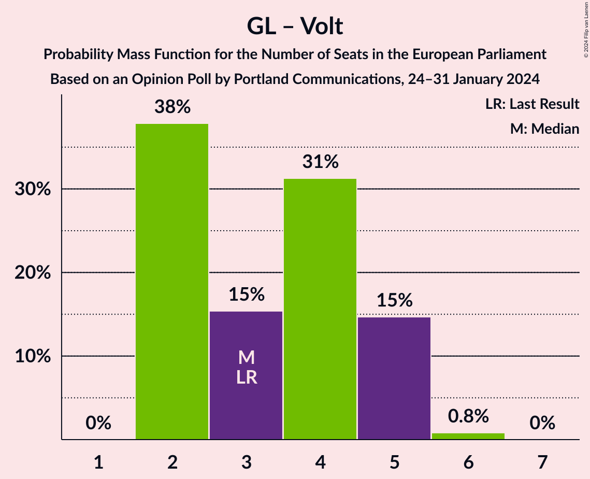

| Number of Seats | Probability | Accumulated | Special Marks |
|:---------------:|:-----------:|:-----------:|:-------------:|
| 2 | 0.1% | 100% |  |
| 3 | 27% | 99.9% | Last Result |
| 4 | 68% | 73% | Median |
| 5 | 5% | 5% |  |
| 6 | 0.3% | 0.3% |  |
| 7 | 0% | 0% |  |

### Partij van de Arbeid (S&D)

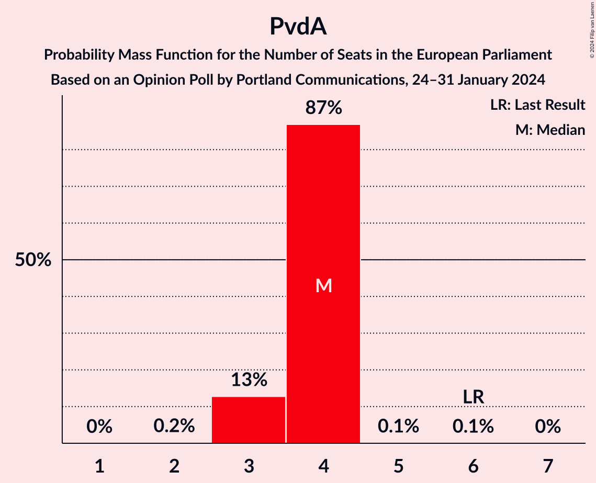

| Number of Seats | Probability | Accumulated | Special Marks |
|:---------------:|:-----------:|:-----------:|:-------------:|
| 2 | 0.2% | 100% |  |
| 3 | 13% | 99.8% |  |
| 4 | 87% | 87% | Median |
| 5 | 0.1% | 0.2% |  |
| 6 | 0.1% | 0.1% | Last Result |
| 7 | 0% | 0% |  |

### Forum voor Democratie (NI)

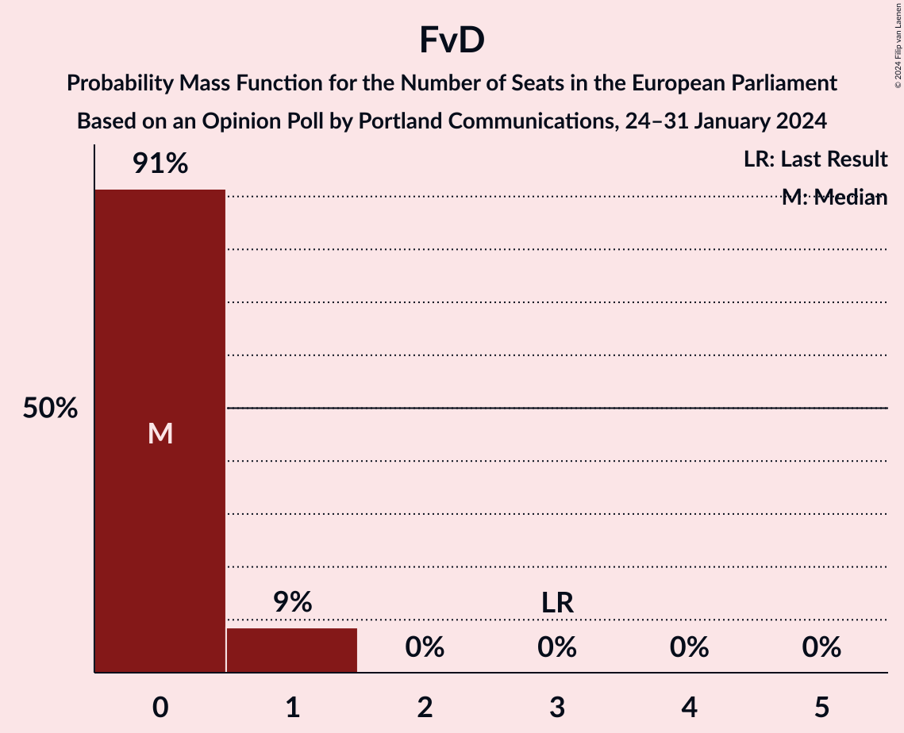

| Number of Seats | Probability | Accumulated | Special Marks |
|:---------------:|:-----------:|:-----------:|:-------------:|
| 0 | 91% | 100% | Median |
| 1 | 9% | 9% |  |
| 2 | 0% | 0% |  |
| 3 | 0% | 0% | Last Result |

### Staatkundig Gereformeerde Partij (ECR) – Juiste Antwoord 2021 (ECR)

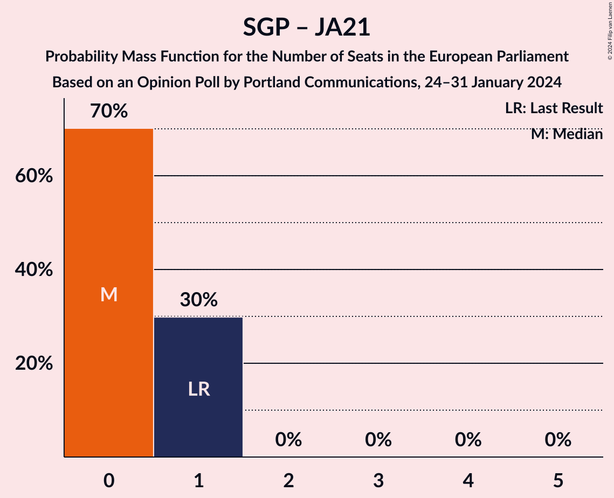

| Number of Seats | Probability | Accumulated | Special Marks |
|:---------------:|:-----------:|:-----------:|:-------------:|
| 0 | 70% | 100% | Median |
| 1 | 30% | 30% | Last Result |
| 2 | 0% | 0% |  |

### Partij voor de Dieren (GUE/NGL) – Socialistische Partij (GUE/NGL)

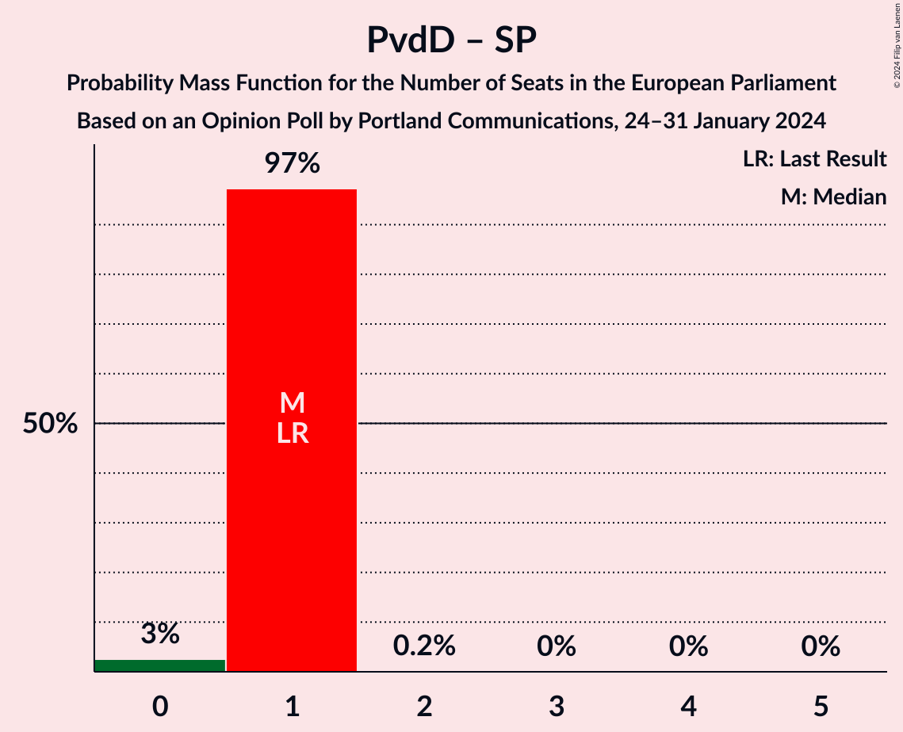

| Number of Seats | Probability | Accumulated | Special Marks |
|:---------------:|:-----------:|:-----------:|:-------------:|
| 0 | 3% | 100% |  |
| 1 | 97% | 97% | Last Result, Median |
| 2 | 0.2% | 0.2% |  |
| 3 | 0% | 0% |  |

## Technical Information

### Opinion Poll

+ **Polling firm:** Portland Communications
+ **Commissioner(s):** —
+ **Fieldwork period:** 24–31 January 2024

### Calculations

+ **Sample size:** 535
+ **Simulations done:** 1,048,576
+ **Error estimate:** 2.26%

