# Poll Average

<a href="#voting-intentions">Voting Intentions</a> | <a href="#seats">Seats</a> | <a href="#coalitions">Coalitions</a> | <a href="#technical-information">Technical Information</a>

## Summary

The table below lists the polls on which the average is based. They are the most recent polls (less than 30 days old) registered and analyzed so far.

| Period     | Polling firm/Commissioner(s) | PvdA | VVD | CDA | FvD | GL | D66 | CU | SGP | PvdD | 50+ | PVV | SP | DENK | PP | B1 | PvdT | JA21 | CO | Volt | BBB | Spl | BVNL |
|:----------:|:----------------------------:|:--:|:--:|:--:|:--:|:--:|:--:|:--:|:--:|:--:|:--:|:--:|:--:|:--:|:--:|:--:|:--:|:--:|:--:|:--:|:--:|:--:|:--:|
| 23 May 2019 | General Election | 19.0%   6 | 14.6%   4 | 12.2%   4 | 11.0%   3 | 10.9%   3 | 7.1%   2 | 6.8%   1 | 6.8%   1 | 4.0%   1 | 3.9%   1 | 3.5%   0 | 3.4%   0 | 1.1%   0 | 0.2%   0 | 0.0%   0 | 0.0%   0 | 0.0%   0 | 0.0%   0 | 0.0%   0 | 0.0%   0 | 0.0%   0 | 0.0%   0 |
| N/A | Poll Average | 5–9%   1–3 | 14–20%   5–7 | 3–6%   0–2 | 2–4%   0–1 | 6–10%   2–4 | 5–9%   1–3 | 2–5%   0–1 | 1–4%   0–1 | 5–8%   1–3 | 0–1%   0 | 8–11%   3–4 | 4–6%   1–2 | 1–3%   0 | N/A   N/A | 0–2%   0 | N/A   N/A | 3–5%   0–2 | N/A   N/A | 3–6%   0–2 | 12–18%   4–7 | N/A   N/A | 0–1%   0 |
| [14–17 July 2023](2023-07-17-IOResearch.html) | I&O Research | 7–9%   3 | 14–17%   5–6 | 2–4%   0–1 | 2–4%   0 | 8–11%   3–4 | 5–7%   1–2 | 3–4%   0–1 | 2–4%   0–1 | 5–7%   2 | 0–1%   0 | 8–11%   3–4 | 4–6%   1–2 | 1–2%   0 | N/A   N/A | 1%   0 | N/A   N/A | 3–5%   1 | N/A   N/A | 4–6%   1–2 | 12–15%   4–5 | N/A   N/A | 1%   0 |
| [14–15 July 2023](2023-07-15-Peilnl.html) | Peil.nl | 7–9%   2–3 | 15–18%   5–6 | 4–5%   1–2 | 3–4%   0–1 | 8–10%   3–4 | 5–7%   1–2 | 2–3%   0 | 2–3%   0 | 5–6%   1–2 | 0–1%   0 | 9–11%   3–4 | 5–6%   1–2 | 1–2%   0 | N/A   N/A | 0–1%   0 | N/A   N/A | 3–5%   0–2 | N/A   N/A | 3–5%   0–1 | 15–18%   5–7 | N/A   N/A | 0–1%   0 |
| [23–25 June 2023](2023-06-25-Ipsos.html) | Ipsos   EenVandaag | 4–7%   1–3 | 16–21%   6–7 | 4–7%   1–2 | 2–3%   0 | 6–9%   2–3 | 6–10%   2–3 | 3–5%   0–1 | 1–3%   0 | 5–8%   2–3 | 0–1%   0 | 8–12%   3–4 | 4–6%   1–2 | 2–3%   0 | N/A   N/A | 1–2%   0 | N/A   N/A | 3–5%   0–2 | N/A   N/A | 3–5%   0–1 | 12–17%   4–6 | N/A   N/A | N/A   N/A |
| 23 May 2019 | General Election | 19.0%   6 | 14.6%   4 | 12.2%   4 | 11.0%   3 | 10.9%   3 | 7.1%   2 | 6.8%   1 | 6.8%   1 | 4.0%   1 | 3.9%   1 | 3.5%   0 | 3.4%   0 | 1.1%   0 | 0.2%   0 | 0.0%   0 | 0.0%   0 | 0.0%   0 | 0.0%   0 | 0.0%   0 | 0.0%   0 | 0.0%   0 | 0.0%   0 |

Only polls for which at least the sample size has been published are included in the table above.

**Legend:**
+ **Top half of each row:** Voting intentions (95% confidence interval)
+ **Bottom half of each row:** Seat projections for the European Parliament (95% confidence interval)
+ **PvdA:** Partij van de Arbeid (S&D)
+ **VVD:** Volkspartij voor Vrijheid en Democratie (RE)
+ **CDA:** Christen-Democratisch Appèl (EPP)
+ **FvD:** Forum voor Democratie (ECR)
+ **GL:** GroenLinks (Greens/EFA)
+ **D66:** Democraten 66 (RE)
+ **CU:** ChristenUnie (EPP)
+ **SGP:** Staatkundig Gereformeerde Partij (ECR)
+ **PvdD:** Partij voor de Dieren (GUE/NGL)
+ **50+:** 50Plus (EPP)
+ **PVV:** Partij voor de Vrijheid (ID)
+ **SP:** Socialistische Partij (GUE/NGL)
+ **DENK:** DENK (*)
+ **PP:** Piratenpartij (*)
+ **B1:** Bij1 (*)
+ **PvdT:** Partij voor de Toekomst (*)
+ **JA21:** Juiste Antwoord 2021 (ECR)
+ **CO:** Code Oranje (*)
+ **Volt:** Volt Europa (Greens/EFA)
+ **BBB:** BoerBurgerBeweging (*)
+ **Spl:** Splinter (*)
+ **BVNL:** Belang van Nederland (*)
+ **N/A (single party):** Party not included the published results
+ **N/A (entire row):** Calculation for this opinion poll not started yet

## Voting Intentions

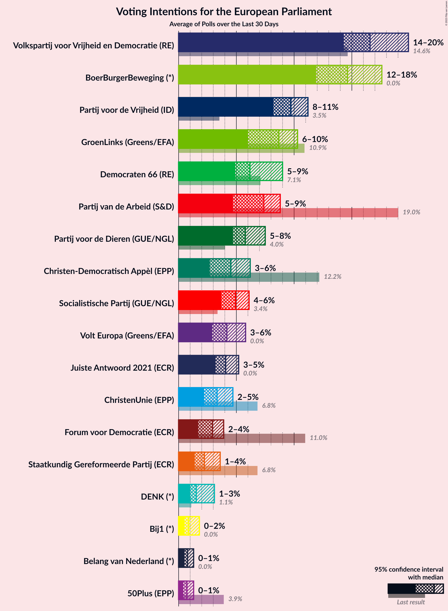

### Confidence Intervals

| Party | Last Result | Median | 80% Confidence Interval | 90% Confidence Interval | 95% Confidence Interval | 99% Confidence Interval |
|:-----:|:-----------:|:------:|:-----------------------:|:-----------------------:|:-----------------------:|:-----------------------:|
| <a href="#partij-van-de-arbeid-(s&d)">Partij van de Arbeid (S&D)</a> | 19.0% | 7.4% | 5.4–8.3% |5.0–8.6% | 4.7–8.8% | 4.3–9.3% |
| <a href="#volkspartij-voor-vrijheid-en-democratie-(re)">Volkspartij voor Vrijheid en Democratie (RE)</a> | 14.6% | 16.6% | 15.0–18.8% |14.6–19.4% | 14.3–19.9% | 13.7–20.9% |
| <a href="#christen-democratisch-appèl-(epp)">Christen-Democratisch Appèl (EPP)</a> | 12.2% | 4.5% | 3.0–5.5% |2.8–5.9% | 2.7–6.2% | 2.4–6.8% |
| <a href="#forum-voor-democratie-(ecr)">Forum voor Democratie (ECR)</a> | 11.0% | 2.9% | 2.1–3.6% |1.9–3.7% | 1.7–3.9% | 1.4–4.1% |
| <a href="#groenlinks-(greens/efa)">GroenLinks (Greens/EFA)</a> | 10.9% | 8.7% | 6.7–9.7% |6.3–10.0% | 6.0–10.3% | 5.5–10.8% |
| <a href="#democraten-66-(re)">Democraten 66 (RE)</a> | 7.1% | 6.2% | 5.3–8.2% |5.0–8.7% | 4.9–9.0% | 4.5–9.7% |
| <a href="#christenunie-(epp)">ChristenUnie (EPP)</a> | 6.8% | 3.3% | 2.5–4.2% |2.4–4.5% | 2.2–4.7% | 2.1–5.2% |
| <a href="#staatkundig-gereformeerde-partij-(ecr)">Staatkundig Gereformeerde Partij (ECR)</a> | 6.8% | 2.2% | 1.6–3.2% |1.5–3.4% | 1.4–3.6% | 1.1–3.9% |
| <a href="#partij-voor-de-dieren-(gue/ngl)">Partij voor de Dieren (GUE/NGL)</a> | 4.0% | 5.8% | 5.0–6.9% |4.8–7.2% | 4.7–7.5% | 4.4–8.1% |
| <a href="#50plus-(epp)">50Plus (EPP)</a> | 3.9% | 0.7% | 0.5–1.0% |0.4–1.2% | 0.4–1.3% | 0.3–1.5% |
| <a href="#partij-voor-de-vrijheid-(id)">Partij voor de Vrijheid (ID)</a> | 3.5% | 9.7% | 8.7–10.7% |8.5–11.0% | 8.2–11.2% | 7.7–11.8% |
| <a href="#socialistische-partij-(gue/ngl)">Socialistische Partij (GUE/NGL)</a> | 3.4% | 4.9% | 4.0–5.7% |3.8–5.9% | 3.7–6.1% | 3.4–6.5% |
| <a href="#denk-(*)">DENK (*)</a> | 1.1% | 1.5% | 1.2–2.6% |1.1–2.8% | 1.0–3.1% | 0.9–3.5% |
| <a href="#piratenpartij-(*)">Piratenpartij (*)</a> | 0.2% | N/A | N/A |N/A | N/A | N/A |
| <a href="#bij1-(*)">Bij1 (*)</a> | 0.0% | 0.9% | 0.6–1.5% |0.5–1.6% | 0.5–1.8% | 0.4–2.1% |
| <a href="#partij-voor-de-toekomst-(*)">Partij voor de Toekomst (*)</a> | 0.0% | N/A | N/A |N/A | N/A | N/A |
| <a href="#juiste-antwoord-2021-(ecr)">Juiste Antwoord 2021 (ECR)</a> | 0.0% | 4.1% | 3.5–4.8% |3.3–5.0% | 3.2–5.2% | 2.9–5.6% |
| <a href="#code-oranje-(*)">Code Oranje (*)</a> | 0.0% | N/A | N/A |N/A | N/A | N/A |
| <a href="#volt-europa-(greens/efa)">Volt Europa (Greens/EFA)</a> | 0.0% | 4.2% | 3.3–5.3% |3.1–5.6% | 2.9–5.8% | 2.5–6.3% |
| <a href="#boerburgerbeweging-(*)">BoerBurgerBeweging (*)</a> | 0.0% | 14.6% | 12.6–16.9% |12.2–17.3% | 11.9–17.6% | 11.4–18.1% |
| <a href="#splinter-(*)">Splinter (*)</a> | 0.0% | N/A | N/A |N/A | N/A | N/A |
| <a href="#belang-van-nederland-(*)">Belang van Nederland (*)</a> | 0.0% | 0.8% | 0.6–1.1% |0.5–1.2% | 0.5–1.3% | 0.4–1.5% |

### Partij van de Arbeid (S&D)

*For a full overview of the results for this party, see the [Partij van de Arbeid (S&D)](party-partijvandearbeidsd.html) page.*

| Voting Intentions | Probability | Accumulated | Special Marks |
|:-----------------:|:-----------:|:-----------:|:-------------:|
| 2.5–3.5% | 0% | 100% |  |
| 3.5–4.5% | 1.4% | 100% |  |
| 4.5–5.5% | 12% | 98.6% |  |
| 5.5–6.5% | 16% | 87% |  |
| 6.5–7.5% | 29% | 70% | Median |
| 7.5–8.5% | 36% | 42% |  |
| 8.5–9.5% | 6% | 6% |  |
| 9.5–10.5% | 0.2% | 0.2% |  |
| 10.5–11.5% | 0% | 0% |  |
| 11.5–12.5% | 0% | 0% |  |
| 12.5–13.5% | 0% | 0% |  |
| 13.5–14.5% | 0% | 0% |  |
| 14.5–15.5% | 0% | 0% |  |
| 15.5–16.5% | 0% | 0% |  |
| 16.5–17.5% | 0% | 0% |  |
| 17.5–18.5% | 0% | 0% |  |
| 18.5–19.5% | 0% | 0% | Last Result |

### Volkspartij voor Vrijheid en Democratie (RE)

*For a full overview of the results for this party, see the [Volkspartij voor Vrijheid en Democratie (RE)](party-volkspartijvoorvrijheidendemocratiere.html) page.*

| Voting Intentions | Probability | Accumulated | Special Marks |
|:-----------------:|:-----------:|:-----------:|:-------------:|
| 11.5–12.5% | 0% | 100% |  |
| 12.5–13.5% | 0.3% | 100% |  |
| 13.5–14.5% | 4% | 99.7% |  |
| 14.5–15.5% | 15% | 96% | Last Result |
| 15.5–16.5% | 29% | 80% |  |
| 16.5–17.5% | 25% | 51% | Median |
| 17.5–18.5% | 14% | 26% |  |
| 18.5–19.5% | 8% | 12% |  |
| 19.5–20.5% | 3% | 4% |  |
| 20.5–21.5% | 0.8% | 0.9% |  |
| 21.5–22.5% | 0.1% | 0.1% |  |
| 22.5–23.5% | 0% | 0% |  |

### Christen-Democratisch Appèl (EPP)

*For a full overview of the results for this party, see the [Christen-Democratisch Appèl (EPP)](party-christen-democratischappèlepp.html) page.*

| Voting Intentions | Probability | Accumulated | Special Marks |
|:-----------------:|:-----------:|:-----------:|:-------------:|
| 0.5–1.5% | 0% | 100% |  |
| 1.5–2.5% | 1.3% | 100% |  |
| 2.5–3.5% | 24% | 98.7% |  |
| 3.5–4.5% | 27% | 74% |  |
| 4.5–5.5% | 37% | 47% | Median |
| 5.5–6.5% | 9% | 10% |  |
| 6.5–7.5% | 1.0% | 1.0% |  |
| 7.5–8.5% | 0% | 0% |  |
| 8.5–9.5% | 0% | 0% |  |
| 9.5–10.5% | 0% | 0% |  |
| 10.5–11.5% | 0% | 0% |  |
| 11.5–12.5% | 0% | 0% | Last Result |

### Forum voor Democratie (ECR)

*For a full overview of the results for this party, see the [Forum voor Democratie (ECR)](party-forumvoordemocratieecr.html) page.*

| Voting Intentions | Probability | Accumulated | Special Marks |
|:-----------------:|:-----------:|:-----------:|:-------------:|
| 0.0–0.5% | 0% | 100% |  |
| 0.5–1.5% | 1.1% | 100% |  |
| 1.5–2.5% | 27% | 98.9% |  |
| 2.5–3.5% | 61% | 72% | Median |
| 3.5–4.5% | 11% | 11% |  |
| 4.5–5.5% | 0% | 0% |  |
| 5.5–6.5% | 0% | 0% |  |
| 6.5–7.5% | 0% | 0% |  |
| 7.5–8.5% | 0% | 0% |  |
| 8.5–9.5% | 0% | 0% |  |
| 9.5–10.5% | 0% | 0% |  |
| 10.5–11.5% | 0% | 0% | Last Result |

### GroenLinks (Greens/EFA)

*For a full overview of the results for this party, see the [GroenLinks (Greens/EFA)](party-groenlinksgreensefa.html) page.*

| Voting Intentions | Probability | Accumulated | Special Marks |
|:-----------------:|:-----------:|:-----------:|:-------------:|
| 3.5–4.5% | 0% | 100% |  |
| 4.5–5.5% | 0.6% | 100% |  |
| 5.5–6.5% | 7% | 99.4% |  |
| 6.5–7.5% | 16% | 92% |  |
| 7.5–8.5% | 21% | 76% |  |
| 8.5–9.5% | 41% | 56% | Median |
| 9.5–10.5% | 14% | 15% |  |
| 10.5–11.5% | 1.2% | 1.2% | Last Result |
| 11.5–12.5% | 0% | 0% |  |

### Democraten 66 (RE)

*For a full overview of the results for this party, see the [Democraten 66 (RE)](party-democraten66re.html) page.*

| Voting Intentions | Probability | Accumulated | Special Marks |
|:-----------------:|:-----------:|:-----------:|:-------------:|
| 2.5–3.5% | 0% | 100% |  |
| 3.5–4.5% | 0.7% | 100% |  |
| 4.5–5.5% | 19% | 99.3% |  |
| 5.5–6.5% | 44% | 80% | Median |
| 6.5–7.5% | 16% | 37% | Last Result |
| 7.5–8.5% | 14% | 21% |  |
| 8.5–9.5% | 5% | 6% |  |
| 9.5–10.5% | 0.7% | 0.8% |  |
| 10.5–11.5% | 0% | 0% |  |
| 11.5–12.5% | 0% | 0% |  |

### ChristenUnie (EPP)

*For a full overview of the results for this party, see the [ChristenUnie (EPP)](party-christenunieepp.html) page.*

| Voting Intentions | Probability | Accumulated | Special Marks |
|:-----------------:|:-----------:|:-----------:|:-------------:|
| 0.5–1.5% | 0% | 100% |  |
| 1.5–2.5% | 12% | 100% |  |
| 2.5–3.5% | 50% | 88% | Median |
| 3.5–4.5% | 34% | 38% |  |
| 4.5–5.5% | 4% | 4% |  |
| 5.5–6.5% | 0.1% | 0.1% |  |
| 6.5–7.5% | 0% | 0% | Last Result |

### Staatkundig Gereformeerde Partij (ECR)

*For a full overview of the results for this party, see the [Staatkundig Gereformeerde Partij (ECR)](party-staatkundiggereformeerdepartijecr.html) page.*

| Voting Intentions | Probability | Accumulated | Special Marks |
|:-----------------:|:-----------:|:-----------:|:-------------:|
| 0.0–0.5% | 0% | 100% |  |
| 0.5–1.5% | 7% | 100% |  |
| 1.5–2.5% | 61% | 93% | Median |
| 2.5–3.5% | 30% | 32% |  |
| 3.5–4.5% | 3% | 3% |  |
| 4.5–5.5% | 0% | 0% |  |
| 5.5–6.5% | 0% | 0% |  |
| 6.5–7.5% | 0% | 0% | Last Result |

### Partij voor de Dieren (GUE/NGL)

*For a full overview of the results for this party, see the [Partij voor de Dieren (GUE/NGL)](party-partijvoordedierenguengl.html) page.*

| Voting Intentions | Probability | Accumulated | Special Marks |
|:-----------------:|:-----------:|:-----------:|:-------------:|
| 2.5–3.5% | 0% | 100% |  |
| 3.5–4.5% | 1.2% | 100% | Last Result |
| 4.5–5.5% | 36% | 98.8% |  |
| 5.5–6.5% | 46% | 63% | Median |
| 6.5–7.5% | 15% | 17% |  |
| 7.5–8.5% | 2% | 2% |  |
| 8.5–9.5% | 0.1% | 0.1% |  |
| 9.5–10.5% | 0% | 0% |  |

### 50Plus (EPP)

*For a full overview of the results for this party, see the [50Plus (EPP)](party-50plusepp.html) page.*

| Voting Intentions | Probability | Accumulated | Special Marks |
|:-----------------:|:-----------:|:-----------:|:-------------:|
| 0.0–0.5% | 17% | 100% |  |
| 0.5–1.5% | 82% | 83% | Median |
| 1.5–2.5% | 0.4% | 0.4% |  |
| 2.5–3.5% | 0% | 0% |  |
| 3.5–4.5% | 0% | 0% | Last Result |

### Partij voor de Vrijheid (ID)

*For a full overview of the results for this party, see the [Partij voor de Vrijheid (ID)](party-partijvoordevrijheidid.html) page.*

| Voting Intentions | Probability | Accumulated | Special Marks |
|:-----------------:|:-----------:|:-----------:|:-------------:|
| 3.5–4.5% | 0% | 100% | Last Result |
| 4.5–5.5% | 0% | 100% |  |
| 5.5–6.5% | 0% | 100% |  |
| 6.5–7.5% | 0.3% | 100% |  |
| 7.5–8.5% | 6% | 99.7% |  |
| 8.5–9.5% | 34% | 94% |  |
| 9.5–10.5% | 46% | 59% | Median |
| 10.5–11.5% | 12% | 13% |  |
| 11.5–12.5% | 1.0% | 1.0% |  |
| 12.5–13.5% | 0.1% | 0.1% |  |
| 13.5–14.5% | 0% | 0% |  |

### Socialistische Partij (GUE/NGL)

*For a full overview of the results for this party, see the [Socialistische Partij (GUE/NGL)](party-socialistischepartijguengl.html) page.*

| Voting Intentions | Probability | Accumulated | Special Marks |
|:-----------------:|:-----------:|:-----------:|:-------------:|
| 1.5–2.5% | 0% | 100% |  |
| 2.5–3.5% | 1.4% | 100% | Last Result |
| 3.5–4.5% | 30% | 98.6% |  |
| 4.5–5.5% | 53% | 69% | Median |
| 5.5–6.5% | 15% | 16% |  |
| 6.5–7.5% | 0.4% | 0.4% |  |
| 7.5–8.5% | 0% | 0% |  |

### DENK (*)

*For a full overview of the results for this party, see the [DENK (*)](party-denk.html) page.*

| Voting Intentions | Probability | Accumulated | Special Marks |
|:-----------------:|:-----------:|:-----------:|:-------------:|
| 0.0–0.5% | 0% | 100% |  |
| 0.5–1.5% | 50% | 100% | Last Result |
| 1.5–2.5% | 39% | 50% | Median |
| 2.5–3.5% | 10% | 11% |  |
| 3.5–4.5% | 0.4% | 0.4% |  |
| 4.5–5.5% | 0% | 0% |  |

### Bij1 (*)

*For a full overview of the results for this party, see the [Bij1 (*)](party-bij1.html) page.*

| Voting Intentions | Probability | Accumulated | Special Marks |
|:-----------------:|:-----------:|:-----------:|:-------------:|
| 0.0–0.5% | 6% | 100% | Last Result |
| 0.5–1.5% | 87% | 94% | Median |
| 1.5–2.5% | 7% | 7% |  |
| 2.5–3.5% | 0.1% | 0.1% |  |
| 3.5–4.5% | 0% | 0% |  |

### Juiste Antwoord 2021 (ECR)

*For a full overview of the results for this party, see the [Juiste Antwoord 2021 (ECR)](party-juisteantwoord2021ecr.html) page.*

| Voting Intentions | Probability | Accumulated | Special Marks |
|:-----------------:|:-----------:|:-----------:|:-------------:|
| 0.0–0.5% | 0% | 100% | Last Result |
| 0.5–1.5% | 0% | 100% |  |
| 1.5–2.5% | 0.1% | 100% |  |
| 2.5–3.5% | 12% | 99.9% |  |
| 3.5–4.5% | 70% | 88% | Median |
| 4.5–5.5% | 17% | 18% |  |
| 5.5–6.5% | 0.7% | 0.7% |  |
| 6.5–7.5% | 0% | 0% |  |

### Volt Europa (Greens/EFA)

*For a full overview of the results for this party, see the [Volt Europa (Greens/EFA)](party-volteuropagreensefa.html) page.*

| Voting Intentions | Probability | Accumulated | Special Marks |
|:-----------------:|:-----------:|:-----------:|:-------------:|
| 0.0–0.5% | 0% | 100% | Last Result |
| 0.5–1.5% | 0% | 100% |  |
| 1.5–2.5% | 0.5% | 100% |  |
| 2.5–3.5% | 17% | 99.5% |  |
| 3.5–4.5% | 50% | 83% | Median |
| 4.5–5.5% | 27% | 32% |  |
| 5.5–6.5% | 6% | 6% |  |
| 6.5–7.5% | 0.1% | 0.1% |  |
| 7.5–8.5% | 0% | 0% |  |

### BoerBurgerBeweging (*)

*For a full overview of the results for this party, see the [BoerBurgerBeweging (*)](party-boerburgerbeweging.html) page.*

| Voting Intentions | Probability | Accumulated | Special Marks |
|:-----------------:|:-----------:|:-----------:|:-------------:|
| 0.0–0.5% | 0% | 100% | Last Result |
| 0.5–1.5% | 0% | 100% |  |
| 1.5–2.5% | 0% | 100% |  |
| 2.5–3.5% | 0% | 100% |  |
| 3.5–4.5% | 0% | 100% |  |
| 4.5–5.5% | 0% | 100% |  |
| 5.5–6.5% | 0% | 100% |  |
| 6.5–7.5% | 0% | 100% |  |
| 7.5–8.5% | 0% | 100% |  |
| 8.5–9.5% | 0% | 100% |  |
| 9.5–10.5% | 0% | 100% |  |
| 10.5–11.5% | 0.8% | 100% |  |
| 11.5–12.5% | 8% | 99.2% |  |
| 12.5–13.5% | 20% | 91% |  |
| 13.5–14.5% | 20% | 71% |  |
| 14.5–15.5% | 14% | 51% | Median |
| 15.5–16.5% | 19% | 37% |  |
| 16.5–17.5% | 15% | 18% |  |
| 17.5–18.5% | 3% | 3% |  |
| 18.5–19.5% | 0.1% | 0.1% |  |
| 19.5–20.5% | 0% | 0% |  |

### Belang van Nederland (*)

*For a full overview of the results for this party, see the [Belang van Nederland (*)](party-belangvannederland.html) page.*

| Voting Intentions | Probability | Accumulated | Special Marks |
|:-----------------:|:-----------:|:-----------:|:-------------:|
| 0.0–0.5% | 9% | 100% | Last Result |
| 0.5–1.5% | 90% | 91% | Median |
| 1.5–2.5% | 0.5% | 0.5% |  |
| 2.5–3.5% | 0% | 0% |  |

## Seats

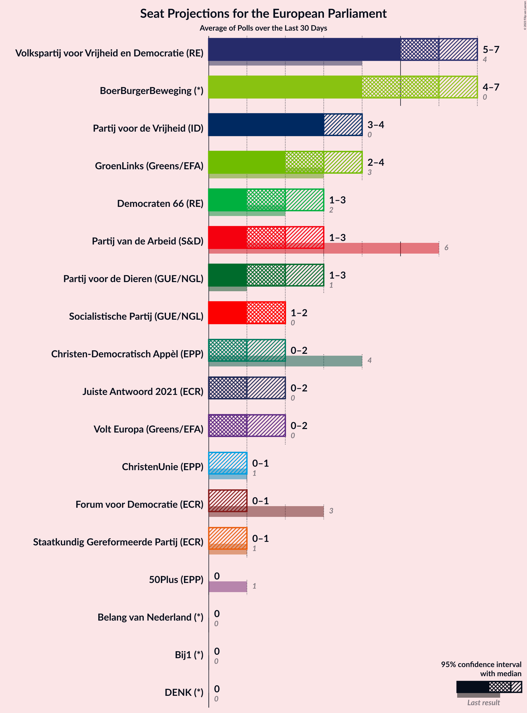

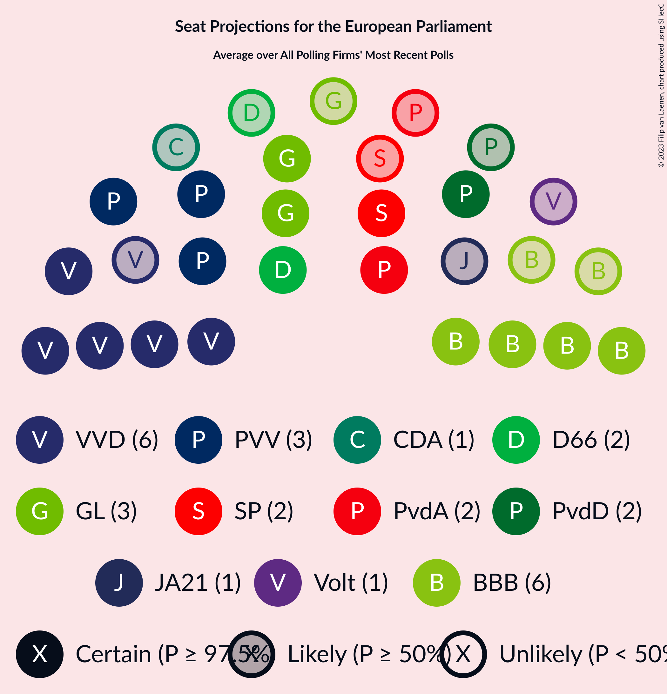

### Confidence Intervals

| Party | Last Result | Median | 80% Confidence Interval | 90% Confidence Interval | 95% Confidence Interval | 99% Confidence Interval |
|:-----:|:-----------:|:------:|:-----------------------:|:-----------------------:|:-----------------------:|:-----------------------:|
| <a href="#partij-van-de-arbeid-(s&d)">Partij van de Arbeid (S&D)</a> | 6 | 2 | 1–3 |1–3 | 1–3 | 1–3 |
| <a href="#volkspartij-voor-vrijheid-en-democratie-(re)">Volkspartij voor Vrijheid en Democratie (RE)</a> | 4 | 6 | 6–7 |6–7 | 5–7 | 5–7 |
| <a href="#christen-democratisch-appèl-(epp)">Christen-Democratisch Appèl (EPP)</a> | 4 | 1 | 0–2 |0–2 | 0–2 | 0–2 |
| <a href="#forum-voor-democratie-(ecr)">Forum voor Democratie (ECR)</a> | 3 | 0 | 0–1 |0–1 | 0–1 | 0–1 |
| <a href="#groenlinks-(greens/efa)">GroenLinks (Greens/EFA)</a> | 3 | 3 | 3 |2–4 | 2–4 | 2–4 |
| <a href="#democraten-66-(re)">Democraten 66 (RE)</a> | 2 | 2 | 2–3 |2–3 | 1–3 | 1–4 |
| <a href="#christenunie-(epp)">ChristenUnie (EPP)</a> | 1 | 0 | 0–1 |0–1 | 0–1 | 0–2 |
| <a href="#staatkundig-gereformeerde-partij-(ecr)">Staatkundig Gereformeerde Partij (ECR)</a> | 1 | 0 | 0 |0 | 0–1 | 0–1 |
| <a href="#partij-voor-de-dieren-(gue/ngl)">Partij voor de Dieren (GUE/NGL)</a> | 1 | 2 | 1–2 |1–2 | 1–3 | 1–3 |
| <a href="#50plus-(epp)">50Plus (EPP)</a> | 1 | 0 | 0 |0 | 0 | 0 |
| <a href="#partij-voor-de-vrijheid-(id)">Partij voor de Vrijheid (ID)</a> | 0 | 3 | 3–4 |3–4 | 3–4 | 3–4 |
| <a href="#socialistische-partij-(gue/ngl)">Socialistische Partij (GUE/NGL)</a> | 0 | 2 | 1–2 |1–2 | 1–2 | 1–2 |
| <a href="#denk-(*)">DENK (*)</a> | 0 | 0 | 0 |0 | 0 | 0–1 |
| <a href="#piratenpartij-(*)">Piratenpartij (*)</a> | 0 | N/A | N/A |N/A | N/A | N/A |
| <a href="#bij1-(*)">Bij1 (*)</a> | 0 | 0 | 0 |0 | 0 | 0 |
| <a href="#partij-voor-de-toekomst-(*)">Partij voor de Toekomst (*)</a> | 0 | N/A | N/A |N/A | N/A | N/A |
| <a href="#juiste-antwoord-2021-(ecr)">Juiste Antwoord 2021 (ECR)</a> | 0 | 1 | 1 |1–2 | 0–2 | 0–2 |
| <a href="#code-oranje-(*)">Code Oranje (*)</a> | 0 | N/A | N/A |N/A | N/A | N/A |
| <a href="#volt-europa-(greens/efa)">Volt Europa (Greens/EFA)</a> | 0 | 1 | 0–2 |0–2 | 0–2 | 0–2 |
| <a href="#boerburgerbeweging-(*)">BoerBurgerBeweging (*)</a> | 0 | 6 | 4–7 |4–7 | 4–7 | 4–7 |
| <a href="#splinter-(*)">Splinter (*)</a> | 0 | N/A | N/A |N/A | N/A | N/A |
| <a href="#belang-van-nederland-(*)">Belang van Nederland (*)</a> | 0 | 0 | 0 |0 | 0 | 0 |

### Partij van de Arbeid (S&D)

*For a full overview of the results for this party, see the [Partij van de Arbeid (S&D)](party-partijvandearbeidsd.html) page.*

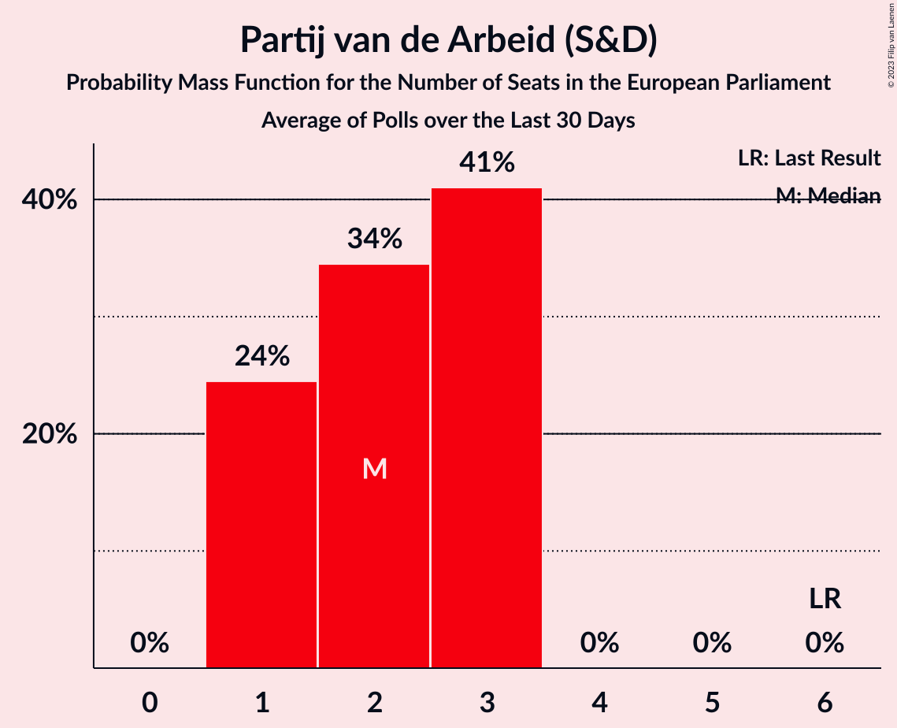

| Number of Seats | Probability | Accumulated | Special Marks |
|:---------------:|:-----------:|:-----------:|:-------------:|
| 1 | 24% | 100% |  |
| 2 | 34% | 76% | Median |
| 3 | 41% | 41% |  |
| 4 | 0% | 0% |  |
| 5 | 0% | 0% |  |
| 6 | 0% | 0% | Last Result |

### Volkspartij voor Vrijheid en Democratie (RE)

*For a full overview of the results for this party, see the [Volkspartij voor Vrijheid en Democratie (RE)](party-volkspartijvoorvrijheidendemocratiere.html) page.*

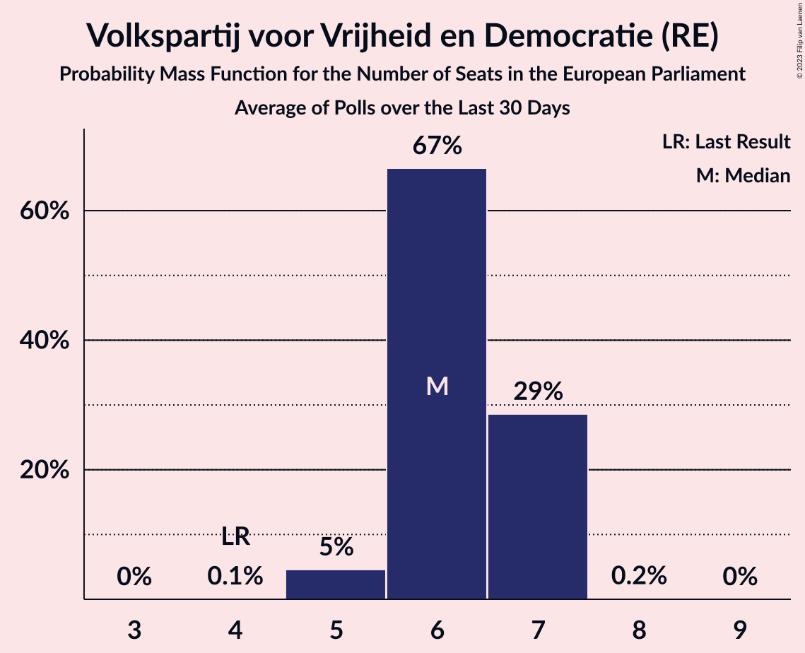

| Number of Seats | Probability | Accumulated | Special Marks |
|:---------------:|:-----------:|:-----------:|:-------------:|
| 4 | 0.1% | 100% | Last Result |
| 5 | 5% | 99.9% |  |
| 6 | 67% | 95% | Median |
| 7 | 29% | 29% |  |
| 8 | 0.2% | 0.2% |  |
| 9 | 0% | 0% |  |

### Christen-Democratisch Appèl (EPP)

*For a full overview of the results for this party, see the [Christen-Democratisch Appèl (EPP)](party-christen-democratischappèlepp.html) page.*

| Number of Seats | Probability | Accumulated | Special Marks |
|:---------------:|:-----------:|:-----------:|:-------------:|
| 0 | 30% | 100% |  |
| 1 | 53% | 70% | Median |
| 2 | 17% | 17% |  |
| 3 | 0% | 0% |  |
| 4 | 0% | 0% | Last Result |

### Forum voor Democratie (ECR)

*For a full overview of the results for this party, see the [Forum voor Democratie (ECR)](party-forumvoordemocratieecr.html) page.*

| Number of Seats | Probability | Accumulated | Special Marks |
|:---------------:|:-----------:|:-----------:|:-------------:|
| 0 | 90% | 100% | Median |
| 1 | 10% | 10% |  |
| 2 | 0% | 0% |  |
| 3 | 0% | 0% | Last Result |

### GroenLinks (Greens/EFA)

*For a full overview of the results for this party, see the [GroenLinks (Greens/EFA)](party-groenlinksgreensefa.html) page.*

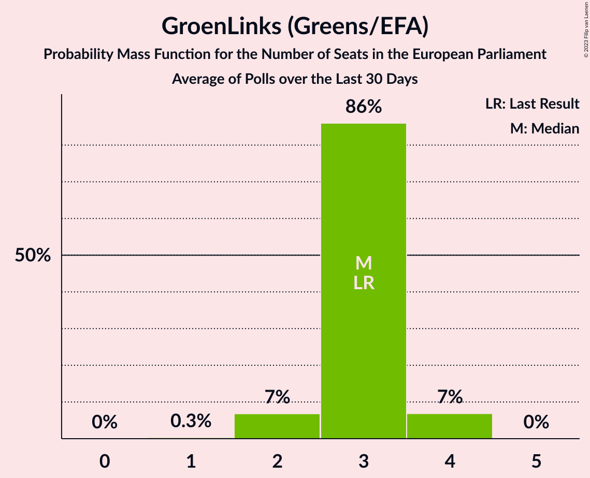

| Number of Seats | Probability | Accumulated | Special Marks |
|:---------------:|:-----------:|:-----------:|:-------------:|
| 1 | 0.3% | 100% |  |
| 2 | 7% | 99.7% |  |
| 3 | 86% | 93% | Last Result, Median |
| 4 | 7% | 7% |  |
| 5 | 0% | 0% |  |

### Democraten 66 (RE)

*For a full overview of the results for this party, see the [Democraten 66 (RE)](party-democraten66re.html) page.*

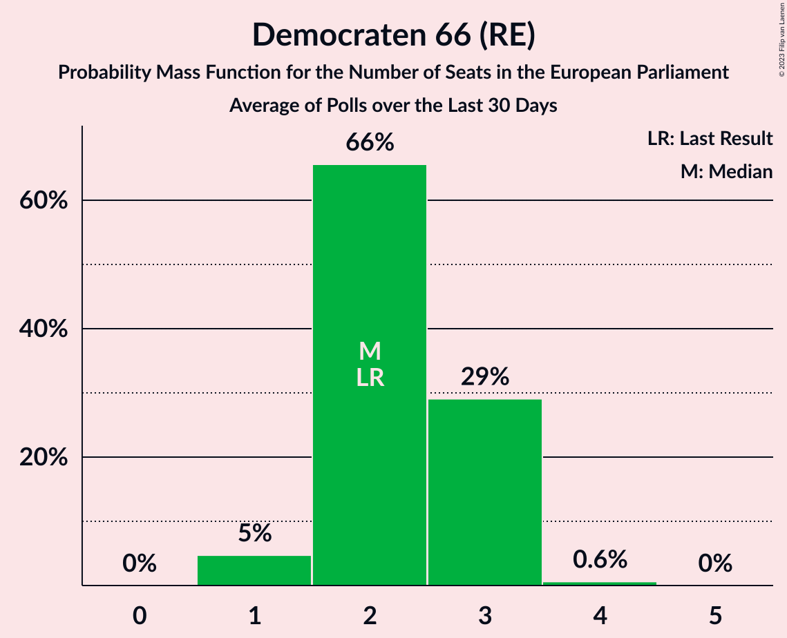

| Number of Seats | Probability | Accumulated | Special Marks |
|:---------------:|:-----------:|:-----------:|:-------------:|
| 1 | 5% | 100% |  |
| 2 | 66% | 95% | Last Result, Median |
| 3 | 29% | 30% |  |
| 4 | 0.6% | 0.6% |  |
| 5 | 0% | 0% |  |

### ChristenUnie (EPP)

*For a full overview of the results for this party, see the [ChristenUnie (EPP)](party-christenunieepp.html) page.*

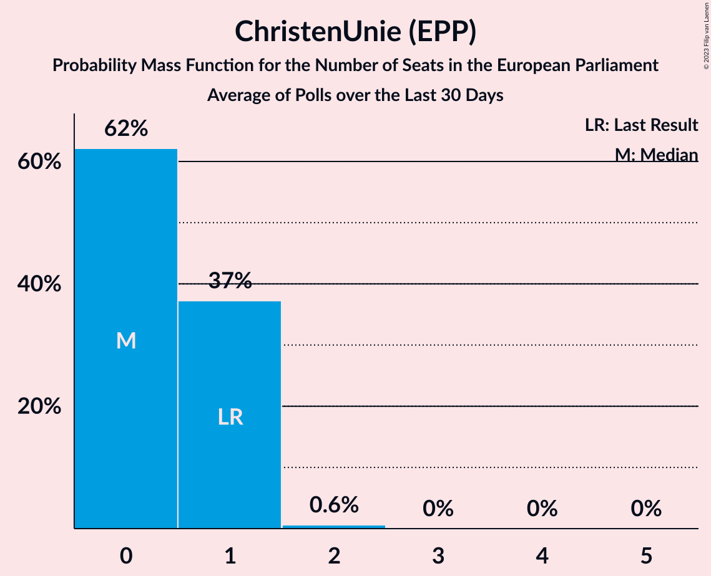

| Number of Seats | Probability | Accumulated | Special Marks |
|:---------------:|:-----------:|:-----------:|:-------------:|
| 0 | 62% | 100% | Median |
| 1 | 37% | 38% | Last Result |
| 2 | 0.6% | 0.6% |  |
| 3 | 0% | 0% |  |

### Staatkundig Gereformeerde Partij (ECR)

*For a full overview of the results for this party, see the [Staatkundig Gereformeerde Partij (ECR)](party-staatkundiggereformeerdepartijecr.html) page.*

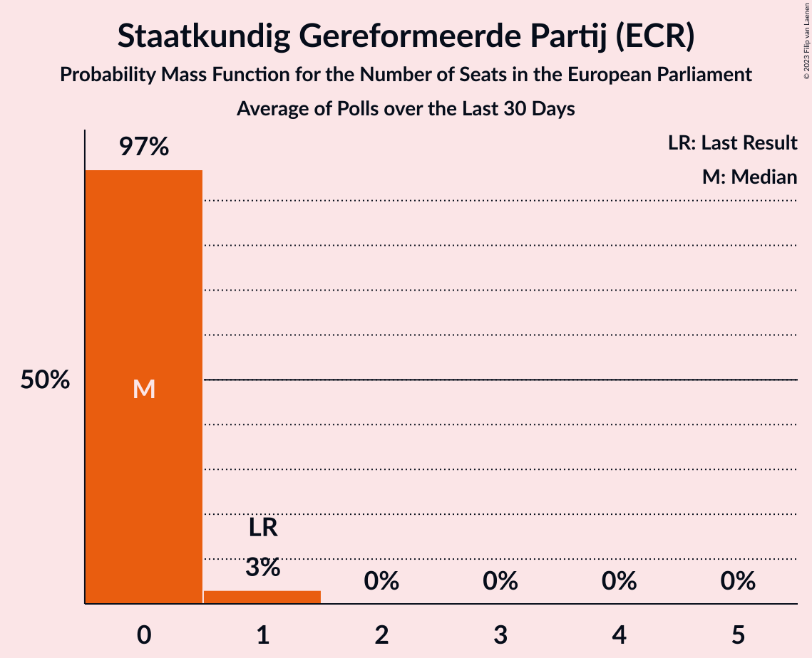

| Number of Seats | Probability | Accumulated | Special Marks |
|:---------------:|:-----------:|:-----------:|:-------------:|
| 0 | 97% | 100% | Median |
| 1 | 3% | 3% | Last Result |
| 2 | 0% | 0% |  |

### Partij voor de Dieren (GUE/NGL)

*For a full overview of the results for this party, see the [Partij voor de Dieren (GUE/NGL)](party-partijvoordedierenguengl.html) page.*

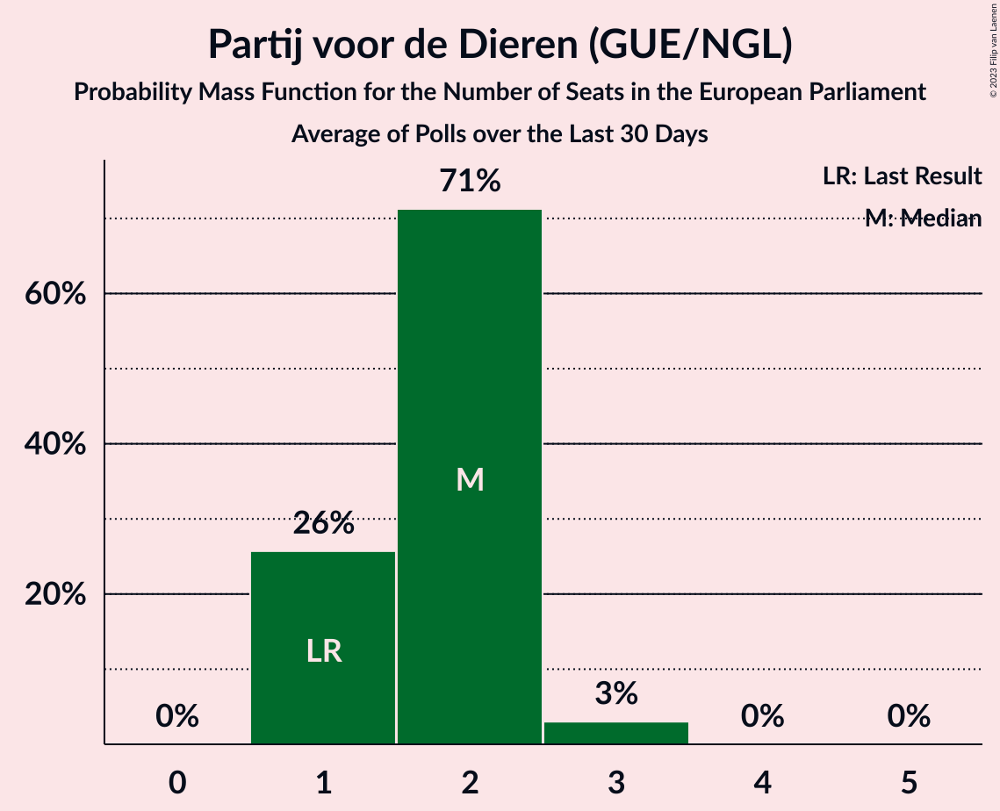

| Number of Seats | Probability | Accumulated | Special Marks |
|:---------------:|:-----------:|:-----------:|:-------------:|
| 1 | 26% | 100% | Last Result |
| 2 | 71% | 74% | Median |
| 3 | 3% | 3% |  |
| 4 | 0% | 0% |  |

### 50Plus (EPP)

*For a full overview of the results for this party, see the [50Plus (EPP)](party-50plusepp.html) page.*

| Number of Seats | Probability | Accumulated | Special Marks |
|:---------------:|:-----------:|:-----------:|:-------------:|
| 0 | 100% | 100% | Median |
| 1 | 0% | 0% | Last Result |

### Partij voor de Vrijheid (ID)

*For a full overview of the results for this party, see the [Partij voor de Vrijheid (ID)](party-partijvoordevrijheidid.html) page.*

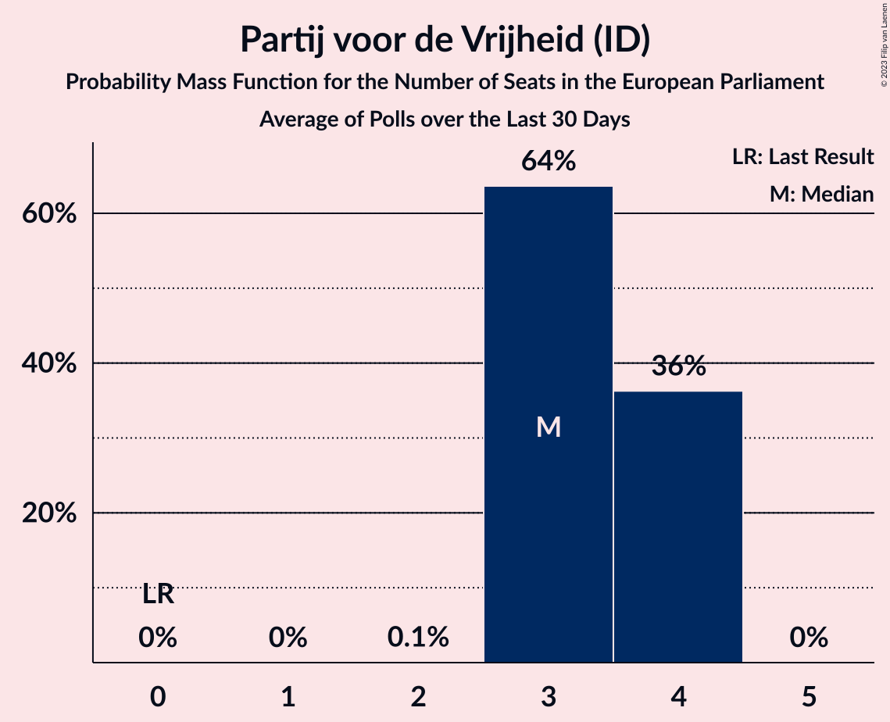

| Number of Seats | Probability | Accumulated | Special Marks |
|:---------------:|:-----------:|:-----------:|:-------------:|
| 0 | 0% | 100% | Last Result |
| 1 | 0% | 100% |  |
| 2 | 0.1% | 100% |  |
| 3 | 64% | 99.9% | Median |
| 4 | 36% | 36% |  |
| 5 | 0% | 0% |  |

### Socialistische Partij (GUE/NGL)

*For a full overview of the results for this party, see the [Socialistische Partij (GUE/NGL)](party-socialistischepartijguengl.html) page.*

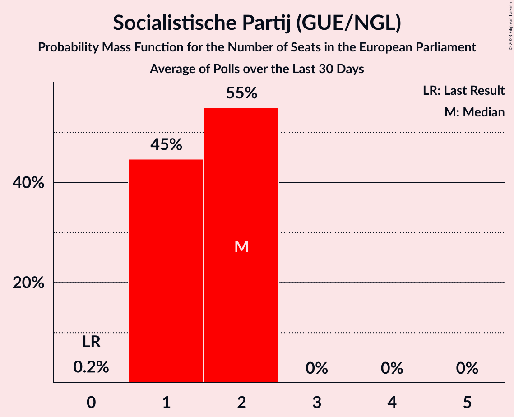

| Number of Seats | Probability | Accumulated | Special Marks |
|:---------------:|:-----------:|:-----------:|:-------------:|
| 0 | 0.2% | 100% | Last Result |
| 1 | 45% | 99.8% |  |
| 2 | 55% | 55% | Median |
| 3 | 0% | 0% |  |

### DENK (*)

*For a full overview of the results for this party, see the [DENK (*)](party-denk.html) page.*

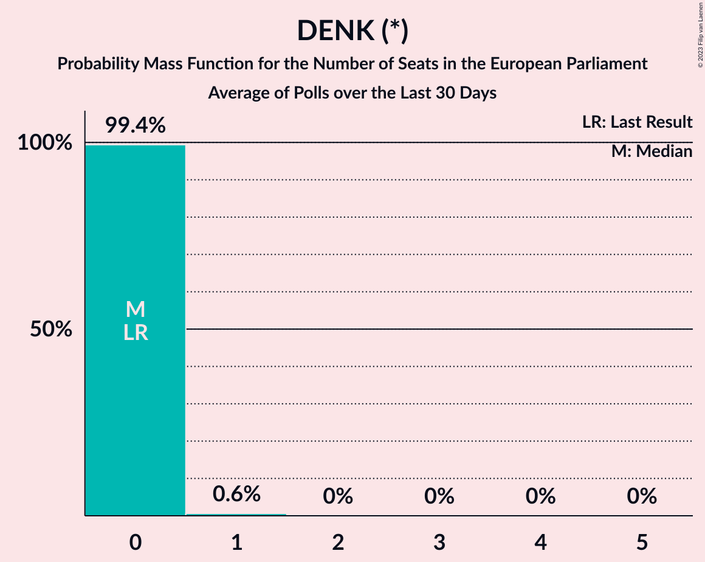

| Number of Seats | Probability | Accumulated | Special Marks |
|:---------------:|:-----------:|:-----------:|:-------------:|
| 0 | 99.4% | 100% | Last Result, Median |
| 1 | 0.6% | 0.6% |  |
| 2 | 0% | 0% |  |

### Piratenpartij (*)

*For a full overview of the results for this party, see the [Piratenpartij (*)](party-piratenpartij.html) page.*

### Bij1 (*)

*For a full overview of the results for this party, see the [Bij1 (*)](party-bij1.html) page.*

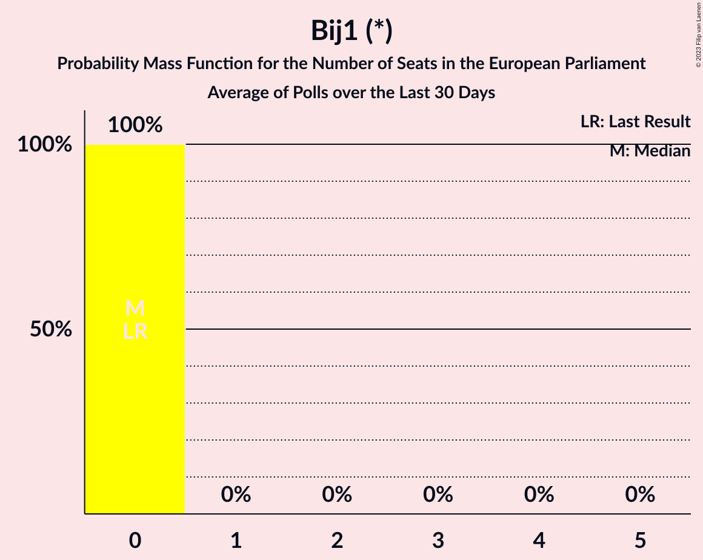

| Number of Seats | Probability | Accumulated | Special Marks |
|:---------------:|:-----------:|:-----------:|:-------------:|
| 0 | 100% | 100% | Last Result, Median |

### Partij voor de Toekomst (*)

*For a full overview of the results for this party, see the [Partij voor de Toekomst (*)](party-partijvoordetoekomst.html) page.*

### Juiste Antwoord 2021 (ECR)

*For a full overview of the results for this party, see the [Juiste Antwoord 2021 (ECR)](party-juisteantwoord2021ecr.html) page.*

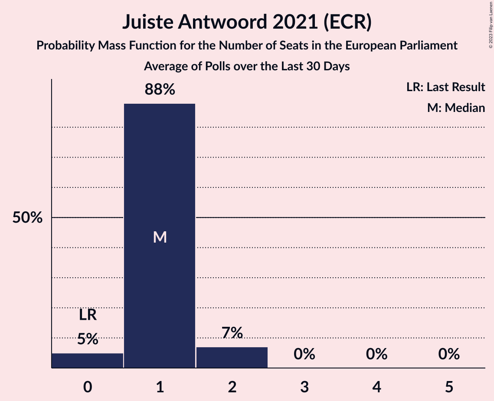

| Number of Seats | Probability | Accumulated | Special Marks |
|:---------------:|:-----------:|:-----------:|:-------------:|
| 0 | 5% | 100% | Last Result |
| 1 | 88% | 95% | Median |
| 2 | 7% | 7% |  |
| 3 | 0% | 0% |  |

### Code Oranje (*)

*For a full overview of the results for this party, see the [Code Oranje (*)](party-codeoranje.html) page.*

### Volt Europa (Greens/EFA)

*For a full overview of the results for this party, see the [Volt Europa (Greens/EFA)](party-volteuropagreensefa.html) page.*

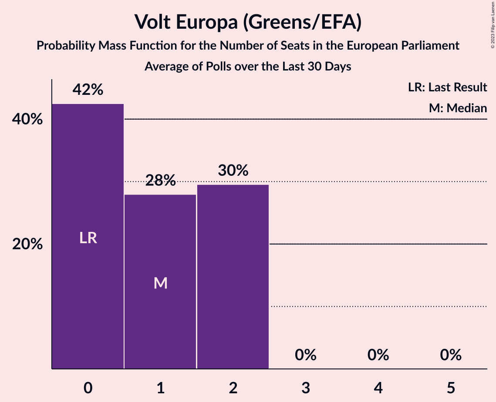

| Number of Seats | Probability | Accumulated | Special Marks |
|:---------------:|:-----------:|:-----------:|:-------------:|
| 0 | 42% | 100% | Last Result |
| 1 | 28% | 58% | Median |
| 2 | 30% | 30% |  |
| 3 | 0% | 0% |  |

### BoerBurgerBeweging (*)

*For a full overview of the results for this party, see the [BoerBurgerBeweging (*)](party-boerburgerbeweging.html) page.*

| Number of Seats | Probability | Accumulated | Special Marks |
|:---------------:|:-----------:|:-----------:|:-------------:|
| 0 | 0% | 100% | Last Result |
| 1 | 0% | 100% |  |
| 2 | 0% | 100% |  |
| 3 | 0% | 100% |  |
| 4 | 33% | 100% |  |
| 5 | 11% | 67% |  |
| 6 | 43% | 56% | Median |
| 7 | 12% | 12% |  |
| 8 | 0% | 0% |  |

### Splinter (*)

*For a full overview of the results for this party, see the [Splinter (*)](party-splinter.html) page.*

### Belang van Nederland (*)

*For a full overview of the results for this party, see the [Belang van Nederland (*)](party-belangvannederland.html) page.*

| Number of Seats | Probability | Accumulated | Special Marks |
|:---------------:|:-----------:|:-----------:|:-------------:|
| 0 | 100% | 100% | Last Result, Median |

## Coalitions

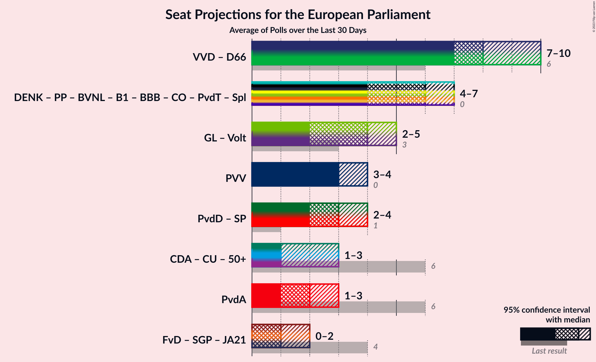

### Confidence Intervals

| Coalition | Last Result | Median | Majority? | 80% Confidence Interval | 90% Confidence Interval | 95% Confidence Interval | 99% Confidence Interval |
|:---------:|:-----------:|:------:|:---------:|:-----------------------:|:-----------------------:|:-----------------------:|:-----------------------:|
| Volkspartij voor Vrijheid en Democratie (RE) – Democraten 66 (RE) | 6 | 8 | 0% | 8–10 | 7–10 | 7–10 | 7–10 |
| DENK (*) – Piratenpartij (*) – Belang van Nederland (*) – Bij1 (*) – BoerBurgerBeweging (*) – Code Oranje (*) – Partij voor de Toekomst (*) – Splinter (*) | 0 | 6 | 0% | 4–7 | 4–7 | 4–7 | 4–7 |
| GroenLinks (Greens/EFA) – Volt Europa (Greens/EFA) | 3 | 4 | 0% | 3–5 | 3–5 | 2–5 | 2–5 |
| Partij voor de Vrijheid (ID) | 0 | 3 | 0% | 3–4 | 3–4 | 3–4 | 3–4 |
| Partij voor de Dieren (GUE/NGL) – Socialistische Partij (GUE/NGL) | 1 | 3 | 0% | 3–4 | 2–4 | 2–4 | 2–4 |
| Christen-Democratisch Appèl (EPP) – ChristenUnie (EPP) – 50Plus (EPP) | 6 | 1 | 0% | 1–2 | 1–2 | 1–3 | 1–3 |
| Partij van de Arbeid (S&D) | 6 | 2 | 0% | 1–3 | 1–3 | 1–3 | 1–3 |
| Forum voor Democratie (ECR) – Staatkundig Gereformeerde Partij (ECR) – Juiste Antwoord 2021 (ECR) | 4 | 1 | 0% | 1–2 | 1–2 | 0–2 | 0–2 |

### Volkspartij voor Vrijheid en Democratie (RE) – Democraten 66 (RE)

| Number of Seats | Probability | Accumulated | Special Marks |
|:---------------:|:-----------:|:-----------:|:-------------:|
| 5 | 0.1% | 100% |  |
| 6 | 0.2% | 99.9% | Last Result |
| 7 | 9% | 99.7% |  |
| 8 | 59% | 91% | Median |
| 9 | 5% | 32% |  |
| 10 | 27% | 27% |  |
| 11 | 0.1% | 0.1% |  |
| 12 | 0% | 0% |  |

### DENK (*) – Piratenpartij (*) – Belang van Nederland (*) – Bij1 (*) – BoerBurgerBeweging (*) – Code Oranje (*) – Partij voor de Toekomst (*) – Splinter (*)

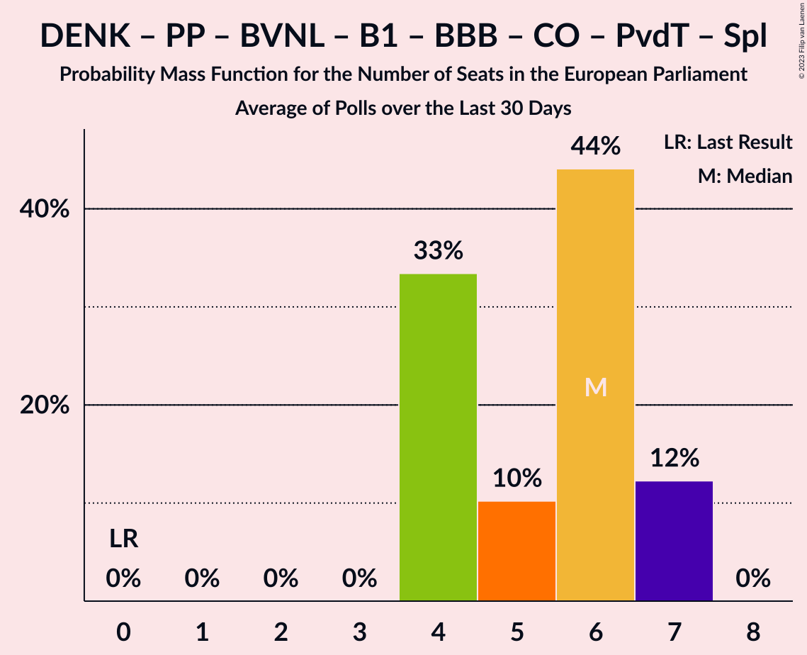

| Number of Seats | Probability | Accumulated | Special Marks |
|:---------------:|:-----------:|:-----------:|:-------------:|
| 0 | 0% | 100% | Last Result |
| 1 | 0% | 100% |  |
| 2 | 0% | 100% |  |
| 3 | 0% | 100% |  |
| 4 | 33% | 100% |  |
| 5 | 10% | 67% |  |
| 6 | 44% | 56% | Median |
| 7 | 12% | 12% |  |
| 8 | 0% | 0% |  |

### GroenLinks (Greens/EFA) – Volt Europa (Greens/EFA)

| Number of Seats | Probability | Accumulated | Special Marks |
|:---------------:|:-----------:|:-----------:|:-------------:|
| 1 | 0.3% | 100% |  |
| 2 | 3% | 99.7% |  |
| 3 | 42% | 96% | Last Result |
| 4 | 18% | 54% | Median |
| 5 | 35% | 36% |  |
| 6 | 0.4% | 0.4% |  |
| 7 | 0% | 0% |  |

### Partij voor de Vrijheid (ID)

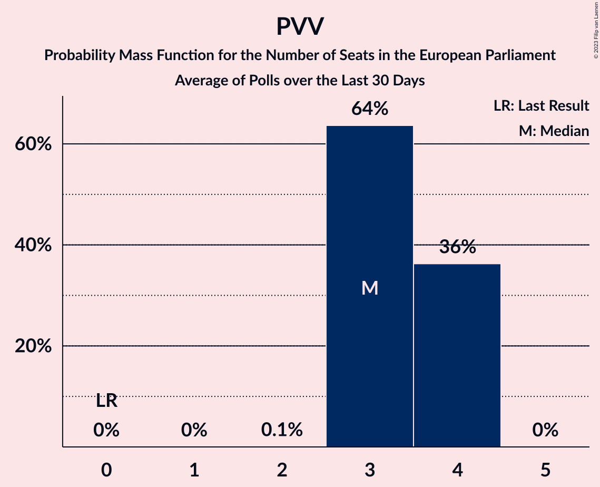

| Number of Seats | Probability | Accumulated | Special Marks |
|:---------------:|:-----------:|:-----------:|:-------------:|
| 0 | 0% | 100% | Last Result |
| 1 | 0% | 100% |  |
| 2 | 0.1% | 100% |  |
| 3 | 64% | 99.9% | Median |
| 4 | 36% | 36% |  |
| 5 | 0% | 0% |  |

### Partij voor de Dieren (GUE/NGL) – Socialistische Partij (GUE/NGL)

| Number of Seats | Probability | Accumulated | Special Marks |
|:---------------:|:-----------:|:-----------:|:-------------:|
| 1 | 0% | 100% | Last Result |
| 2 | 7% | 100% |  |
| 3 | 54% | 93% |  |
| 4 | 38% | 39% | Median |
| 5 | 0.5% | 0.5% |  |
| 6 | 0% | 0% |  |

### Christen-Democratisch Appèl (EPP) – ChristenUnie (EPP) – 50Plus (EPP)

| Number of Seats | Probability | Accumulated | Special Marks |
|:---------------:|:-----------:|:-----------:|:-------------:|
| 0 | 0.4% | 100% |  |
| 1 | 78% | 99.6% | Median |
| 2 | 18% | 21% |  |
| 3 | 3% | 4% |  |
| 4 | 0.5% | 0.5% |  |
| 5 | 0% | 0% |  |
| 6 | 0% | 0% | Last Result |

### Partij van de Arbeid (S&D)

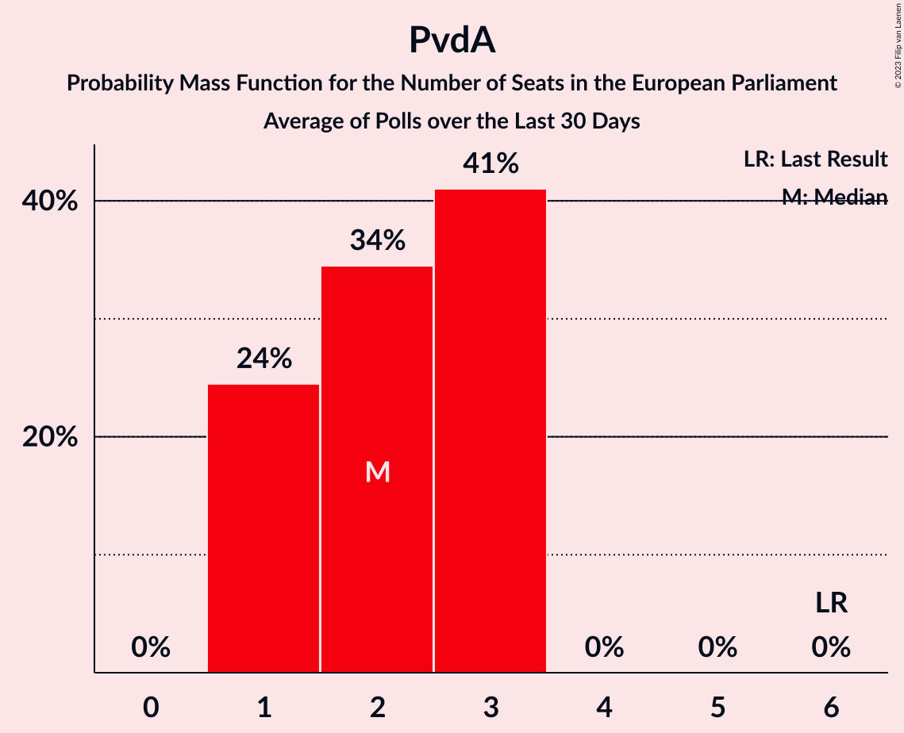

| Number of Seats | Probability | Accumulated | Special Marks |
|:---------------:|:-----------:|:-----------:|:-------------:|
| 1 | 24% | 100% |  |
| 2 | 34% | 76% | Median |
| 3 | 41% | 41% |  |
| 4 | 0% | 0% |  |
| 5 | 0% | 0% |  |
| 6 | 0% | 0% | Last Result |

### Forum voor Democratie (ECR) – Staatkundig Gereformeerde Partij (ECR) – Juiste Antwoord 2021 (ECR)

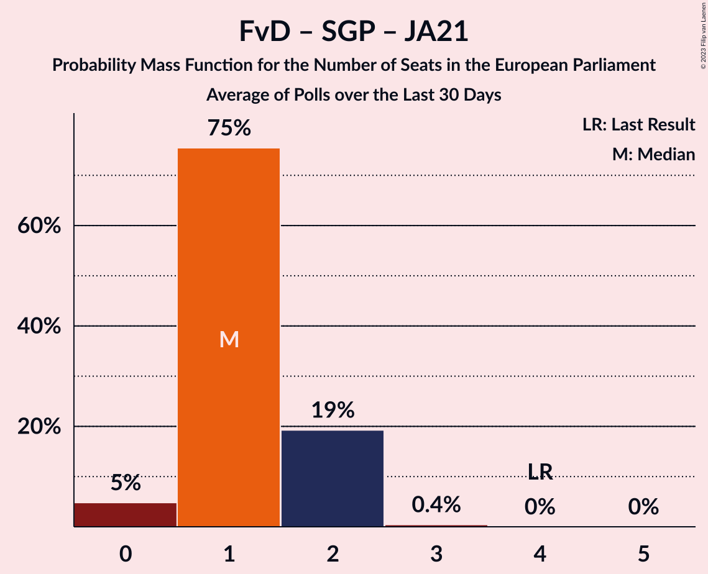

| Number of Seats | Probability | Accumulated | Special Marks |
|:---------------:|:-----------:|:-----------:|:-------------:|
| 0 | 5% | 100% |  |
| 1 | 75% | 95% | Median |
| 2 | 19% | 20% |  |
| 3 | 0.4% | 0.4% |  |
| 4 | 0% | 0% | Last Result |

## Technical Information

+ **Number of polls included in this average:** 3
+ **Lowest number of simulations done in a poll included in this average:** 1,048,576
+ **Total number of simulations done in the polls included in this average:** 3,145,728
+ **Error estimate:** 2.93%
