# Poll Average

<a href="#voting-intentions">Voting Intentions</a> | <a href="#seats">Seats</a> | <a href="#coalitions">Coalitions</a> | <a href="#technical-information">Technical Information</a>

## Summary

The table below lists the polls on which the average is based. They are the most recent polls (less than 90 days old) registered and analyzed so far.

| Period     | Polling firm/Commissioner(s) | D66 | CDA | PVV | VVD | SP | PvdA | CU | SGP | GL | PvdD | 50+ | PP | DENK | FvD | B1 |
|:----------:|:----------------------------:|:--:|:--:|:--:|:--:|:--:|:--:|:--:|:--:|:--:|:--:|:--:|:--:|:--:|:--:|:--:|
| 22 May 2014 | General Election | 15.5%   4 | 15.2%   5 | 13.3%   4 | 12.0%   3 | 9.6%   2 | 9.4%   3 | 7.7%   1 | 7.7%   1 | 7.0%   2 | 4.2%   1 | 3.7%   0 | 0.8%   0 | 0.0%   0 | 0.0%   0 | 0.0%   0 |
| N/A | Poll Average | 6–8%   2–3 | 9–11%   2–3 | 5–11%   1–3 | 14–17%   4–5 | 5–11%   1–3 | 6–10%   2–3 | 4–6%   0–1 | 1–3%   0 | 11–13%   3–4 | 3–6%   1 | 2–4%   0 | N/A   N/A | 2–3%   0 | 10–20%   3–6 | N/A   N/A |
| [1–7 April 2019](2019-04-07-Peilnl.html) | Peil.nl | 6–8%   2 | 9–11%   3 | 5–6%   1–2 | 13–16%   4–5 | 5–7%   1–2 | 8–10%   2–3 | 4–5%   0–1 | 1–2%   0 | 11–13%   3–4 | 5–6%   1 | 2–3%   0 | N/A   N/A | 2–3%   0 | 17–20%   5–6 | N/A   N/A |
| [8–12 March 2019](2019-03-12-IOResearch.html) | I&O Research | 6–8%   3 | 8–11%   2 | 9–11%   3 | 14–17%   4 | 8–11%   3 | 6–8%   2 | 5–7%   1 | 2–3%   0 | 11–13%   4 | 3–4%   1 | 3–5%   0 | N/A   N/A | 2–3%   0 | 10–13%   3 | N/A   N/A |
| [22–24 February 2019](2019-02-24-Ipsos.html) | Ipsos   EenVandaag | N/A   N/A | N/A   N/A | N/A   N/A | N/A   N/A | N/A   N/A | N/A   N/A | N/A   N/A | N/A   N/A | N/A   N/A | N/A   N/A | N/A   N/A | N/A   N/A | N/A   N/A | N/A   N/A | N/A   N/A |
| 22 May 2014 | General Election | 15.5%   4 | 15.2%   5 | 13.3%   4 | 12.0%   3 | 9.6%   2 | 9.4%   3 | 7.7%   1 | 7.7%   1 | 7.0%   2 | 4.2%   1 | 3.7%   0 | 0.8%   0 | 0.0%   0 | 0.0%   0 | 0.0%   0 |

Only polls for which at least the sample size has been published are included in the table above.

**Legend:**
+ **Top half of each row:** Voting intentions (95% confidence interval)
+ **Bottom half of each row:** Seat projections for the European Parliament (95% confidence interval)
+ **D66:** Democraten 66 (ALDE)
+ **CDA:** Christen-Democratisch Appèl (EPP)
+ **PVV:** Partij voor de Vrijheid (ENF)
+ **VVD:** Volkspartij voor Vrijheid en Democratie (ALDE)
+ **SP:** Socialistische Partij (GUE/NGL)
+ **PvdA:** Partij van de Arbeid (S&D)
+ **CU:** ChristenUnie (ECR)
+ **SGP:** Staatkundig Gereformeerde Partij (ECR)
+ **GL:** GroenLinks (Greens/EFA)
+ **PvdD:** Partij voor de Dieren (GUE/NGL)
+ **50+:** 50Plus (*)
+ **PP:** Piratenpartij (*)
+ **DENK:** Denk (*)
+ **FvD:** Forum voor Democratie (ECR)
+ **B1:** Bij1 (*)
+ **N/A (single party):** Party not included the published results
+ **N/A (entire row):** Calculation for this opinion poll not started yet

## Voting Intentions

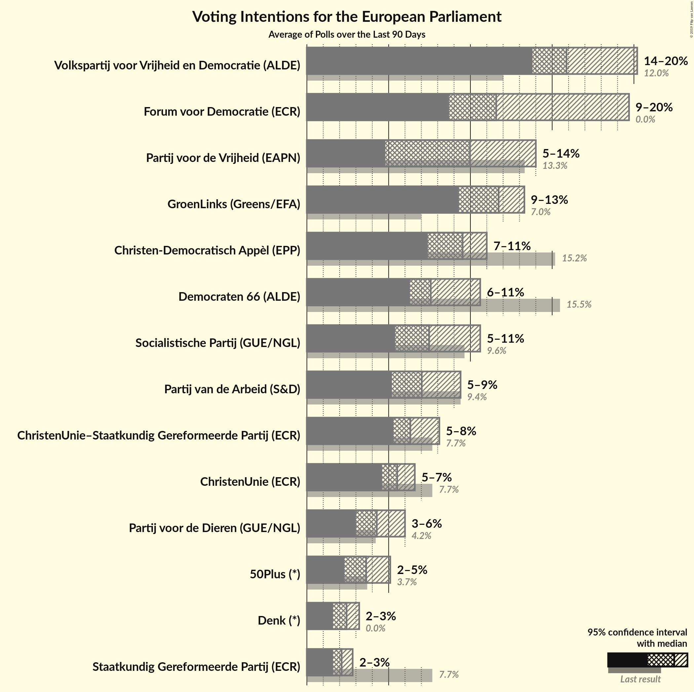

### Confidence Intervals

| Party | Last Result | Median | 80% Confidence Interval | 90% Confidence Interval | 95% Confidence Interval | 99% Confidence Interval |
|:-----:|:-----------:|:------:|:-----------------------:|:-----------------------:|:-----------------------:|:-----------------------:|
| <a href="#democraten-66-(alde)">Democraten 66 (ALDE)</a> | 15.5% | 7.2% | 6.6–7.9% |6.4–8.1% | 6.2–8.3% | 5.9–8.6% |
| <a href="#christen-democratisch-appèl-(epp)">Christen-Democratisch Appèl (EPP)</a> | 15.2% | 9.8% | 9.0–10.6% |8.8–10.9% | 8.6–11.1% | 8.2–11.4% |
| <a href="#partij-voor-de-vrijheid-(enf)">Partij voor de Vrijheid (ENF)</a> | 13.3% | 7.4% | 5.0–10.6% |4.8–10.9% | 4.7–11.1% | 4.5–11.6% |
| <a href="#volkspartij-voor-vrijheid-en-democratie-(alde)">Volkspartij voor Vrijheid en Democratie (ALDE)</a> | 12.0% | 15.2% | 14.1–16.5% |13.8–16.8% | 13.6–17.2% | 13.2–17.7% |
| <a href="#socialistische-partij-(gue/ngl)">Socialistische Partij (GUE/NGL)</a> | 9.6% | 7.6% | 5.7–10.2% |5.5–10.5% | 5.3–10.7% | 5.1–11.2% |
| <a href="#partij-van-de-arbeid-(s&d)">Partij van de Arbeid (S&D)</a> | 9.4% | 7.8% | 6.4–9.1% |6.1–9.4% | 6.0–9.5% | 5.6–9.9% |
| <a href="#christenunie-(ecr)">ChristenUnie (ECR)</a> | 7.7% | 5.1% | 4.4–6.0% |4.2–6.2% | 4.1–6.4% | 3.8–6.8% |
| <a href="#staatkundig-gereformeerde-partij-(ecr)">Staatkundig Gereformeerde Partij (ECR)</a> | 7.7% | 1.7% | 1.2–2.4% |1.1–2.6% | 1.0–2.7% | 0.9–3.0% |
| <a href="#groenlinks-(greens/efa)">GroenLinks (Greens/EFA)</a> | 7.0% | 12.0% | 11.2–12.9% |11.0–13.1% | 10.8–13.3% | 10.4–13.8% |
| <a href="#partij-voor-de-dieren-(gue/ngl)">Partij voor de Dieren (GUE/NGL)</a> | 4.2% | 4.5% | 3.3–5.7% |3.1–5.9% | 3.0–6.1% | 2.8–6.4% |
| <a href="#50plus-(*)">50Plus (*)</a> | 3.7% | 3.2% | 2.4–4.2% |2.3–4.4% | 2.2–4.5% | 2.0–4.9% |
| <a href="#piratenpartij-(*)">Piratenpartij (*)</a> | 0.8% | N/A | N/A |N/A | N/A | N/A |
| <a href="#denk-(*)">Denk (*)</a> | 0.0% | 2.5% | 2.0–3.0% |1.9–3.1% | 1.8–3.2% | 1.6–3.5% |
| <a href="#forum-voor-democratie-(ecr)">Forum voor Democratie (ECR)</a> | 0.0% | 15.3% | 10.9–19.3% |10.6–19.6% | 10.4–19.9% | 9.9–20.4% |
| <a href="#bij1-(*)">Bij1 (*)</a> | 0.0% | N/A | N/A |N/A | N/A | N/A |

### Democraten 66 (ALDE)

*For a full overview of the results for this party, see the [Democraten 66 (ALDE)](party-democraten66alde.html) page.*

| Voting Intentions | Probability | Accumulated | Special Marks |
|:-----------------:|:-----------:|:-----------:|:-------------:|
| 4.5–5.5% | 0.1% | 100% |  |
| 5.5–6.5% | 9% | 99.9% |  |
| 6.5–7.5% | 62% | 91% | Median |
| 7.5–8.5% | 28% | 29% |  |
| 8.5–9.5% | 0.8% | 0.8% |  |
| 9.5–10.5% | 0% | 0% |  |
| 10.5–11.5% | 0% | 0% |  |
| 11.5–12.5% | 0% | 0% |  |
| 12.5–13.5% | 0% | 0% |  |
| 13.5–14.5% | 0% | 0% |  |
| 14.5–15.5% | 0% | 0% | Last Result |

### Christen-Democratisch Appèl (EPP)

*For a full overview of the results for this party, see the [Christen-Democratisch Appèl (EPP)](party-christen-democratischappèlepp.html) page.*

| Voting Intentions | Probability | Accumulated | Special Marks |
|:-----------------:|:-----------:|:-----------:|:-------------:|
| 6.5–7.5% | 0% | 100% |  |
| 7.5–8.5% | 2% | 100% |  |
| 8.5–9.5% | 31% | 98% |  |
| 9.5–10.5% | 55% | 67% | Median |
| 10.5–11.5% | 12% | 13% |  |
| 11.5–12.5% | 0.3% | 0.3% |  |
| 12.5–13.5% | 0% | 0% |  |
| 13.5–14.5% | 0% | 0% |  |
| 14.5–15.5% | 0% | 0% | Last Result |

### Partij voor de Vrijheid (ENF)

*For a full overview of the results for this party, see the [Partij voor de Vrijheid (ENF)](party-partijvoordevrijheidenf.html) page.*

| Voting Intentions | Probability | Accumulated | Special Marks |
|:-----------------:|:-----------:|:-----------:|:-------------:|
| 2.5–3.5% | 0% | 100% |  |
| 3.5–4.5% | 1.0% | 100% |  |
| 4.5–5.5% | 33% | 99.0% |  |
| 5.5–6.5% | 16% | 66% |  |
| 6.5–7.5% | 0.2% | 50% | Median |
| 7.5–8.5% | 0.5% | 50% |  |
| 8.5–9.5% | 12% | 49% |  |
| 9.5–10.5% | 27% | 38% |  |
| 10.5–11.5% | 10% | 10% |  |
| 11.5–12.5% | 0.6% | 0.6% |  |
| 12.5–13.5% | 0% | 0% | Last Result |

### Volkspartij voor Vrijheid en Democratie (ALDE)

*For a full overview of the results for this party, see the [Volkspartij voor Vrijheid en Democratie (ALDE)](party-volkspartijvoorvrijheidendemocratiealde.html) page.*

| Voting Intentions | Probability | Accumulated | Special Marks |
|:-----------------:|:-----------:|:-----------:|:-------------:|
| 11.5–12.5% | 0% | 100% | Last Result |
| 12.5–13.5% | 2% | 100% |  |
| 13.5–14.5% | 22% | 98% |  |
| 14.5–15.5% | 40% | 76% | Median |
| 15.5–16.5% | 27% | 36% |  |
| 16.5–17.5% | 8% | 9% |  |
| 17.5–18.5% | 0.8% | 0.9% |  |
| 18.5–19.5% | 0% | 0% |  |

### Socialistische Partij (GUE/NGL)

*For a full overview of the results for this party, see the [Socialistische Partij (GUE/NGL)](party-socialistischepartijguengl.html) page.*

| Voting Intentions | Probability | Accumulated | Special Marks |
|:-----------------:|:-----------:|:-----------:|:-------------:|
| 3.5–4.5% | 0% | 100% |  |
| 4.5–5.5% | 7% | 100% |  |
| 5.5–6.5% | 38% | 93% |  |
| 6.5–7.5% | 6% | 56% |  |
| 7.5–8.5% | 2% | 50% | Median |
| 8.5–9.5% | 21% | 48% |  |
| 9.5–10.5% | 23% | 27% | Last Result |
| 10.5–11.5% | 4% | 4% |  |
| 11.5–12.5% | 0.1% | 0.1% |  |
| 12.5–13.5% | 0% | 0% |  |

### Partij van de Arbeid (S&D)

*For a full overview of the results for this party, see the [Partij van de Arbeid (S&D)](party-partijvandearbeidsd.html) page.*

| Voting Intentions | Probability | Accumulated | Special Marks |
|:-----------------:|:-----------:|:-----------:|:-------------:|
| 3.5–4.5% | 0% | 100% |  |
| 4.5–5.5% | 0.3% | 100% |  |
| 5.5–6.5% | 15% | 99.7% |  |
| 6.5–7.5% | 30% | 85% |  |
| 7.5–8.5% | 25% | 55% | Median |
| 8.5–9.5% | 28% | 30% | Last Result |
| 9.5–10.5% | 2% | 2% |  |
| 10.5–11.5% | 0% | 0% |  |

### ChristenUnie (ECR)

*For a full overview of the results for this party, see the [ChristenUnie (ECR)](party-christenunieecr.html) page.*

| Voting Intentions | Probability | Accumulated | Special Marks |
|:-----------------:|:-----------:|:-----------:|:-------------:|
| 2.5–3.5% | 0% | 100% |  |
| 3.5–4.5% | 19% | 100% |  |
| 4.5–5.5% | 55% | 81% | Median |
| 5.5–6.5% | 24% | 26% |  |
| 6.5–7.5% | 1.4% | 1.4% |  |
| 7.5–8.5% | 0% | 0% | Last Result |

### Staatkundig Gereformeerde Partij (ECR)

*For a full overview of the results for this party, see the [Staatkundig Gereformeerde Partij (ECR)](party-staatkundiggereformeerdepartijecr.html) page.*

| Voting Intentions | Probability | Accumulated | Special Marks |
|:-----------------:|:-----------:|:-----------:|:-------------:|
| 0.0–0.5% | 0% | 100% |  |
| 0.5–1.5% | 42% | 100% |  |
| 1.5–2.5% | 52% | 58% | Median |
| 2.5–3.5% | 6% | 6% |  |
| 3.5–4.5% | 0% | 0% |  |
| 4.5–5.5% | 0% | 0% |  |
| 5.5–6.5% | 0% | 0% |  |
| 6.5–7.5% | 0% | 0% |  |
| 7.5–8.5% | 0% | 0% | Last Result |

### GroenLinks (Greens/EFA)

*For a full overview of the results for this party, see the [GroenLinks (Greens/EFA)](party-groenlinksgreensefa.html) page.*

| Voting Intentions | Probability | Accumulated | Special Marks |
|:-----------------:|:-----------:|:-----------:|:-------------:|
| 6.5–7.5% | 0% | 100% | Last Result |
| 7.5–8.5% | 0% | 100% |  |
| 8.5–9.5% | 0% | 100% |  |
| 9.5–10.5% | 1.0% | 100% |  |
| 10.5–11.5% | 22% | 99.0% |  |
| 11.5–12.5% | 55% | 77% | Median |
| 12.5–13.5% | 20% | 21% |  |
| 13.5–14.5% | 1.2% | 1.3% |  |
| 14.5–15.5% | 0% | 0% |  |

### Partij voor de Dieren (GUE/NGL)

*For a full overview of the results for this party, see the [Partij voor de Dieren (GUE/NGL)](party-partijvoordedierenguengl.html) page.*

| Voting Intentions | Probability | Accumulated | Special Marks |
|:-----------------:|:-----------:|:-----------:|:-------------:|
| 1.5–2.5% | 0.1% | 100% |  |
| 2.5–3.5% | 21% | 99.9% |  |
| 3.5–4.5% | 29% | 79% | Last Result |
| 4.5–5.5% | 34% | 50% | Median |
| 5.5–6.5% | 16% | 16% |  |
| 6.5–7.5% | 0.2% | 0.2% |  |
| 7.5–8.5% | 0% | 0% |  |

### 50Plus (*)

*For a full overview of the results for this party, see the [50Plus (*)](party-50plus.html) page.*

| Voting Intentions | Probability | Accumulated | Special Marks |
|:-----------------:|:-----------:|:-----------:|:-------------:|
| 0.5–1.5% | 0% | 100% |  |
| 1.5–2.5% | 16% | 100% |  |
| 2.5–3.5% | 47% | 84% | Median |
| 3.5–4.5% | 35% | 37% | Last Result |
| 4.5–5.5% | 2% | 2% |  |
| 5.5–6.5% | 0% | 0% |  |

### Denk (*)

*For a full overview of the results for this party, see the [Denk (*)](party-denk.html) page.*

| Voting Intentions | Probability | Accumulated | Special Marks |
|:-----------------:|:-----------:|:-----------:|:-------------:|
| 0.0–0.5% | 0% | 100% | Last Result |
| 0.5–1.5% | 0.2% | 100% |  |
| 1.5–2.5% | 52% | 99.8% |  |
| 2.5–3.5% | 48% | 48% | Median |
| 3.5–4.5% | 0.2% | 0.2% |  |
| 4.5–5.5% | 0% | 0% |  |

### Forum voor Democratie (ECR)

*For a full overview of the results for this party, see the [Forum voor Democratie (ECR)](party-forumvoordemocratieecr.html) page.*

| Voting Intentions | Probability | Accumulated | Special Marks |
|:-----------------:|:-----------:|:-----------:|:-------------:|
| 0.0–0.5% | 0% | 100% | Last Result |
| 0.5–1.5% | 0% | 100% |  |
| 1.5–2.5% | 0% | 100% |  |
| 2.5–3.5% | 0% | 100% |  |
| 3.5–4.5% | 0% | 100% |  |
| 4.5–5.5% | 0% | 100% |  |
| 5.5–6.5% | 0% | 100% |  |
| 6.5–7.5% | 0% | 100% |  |
| 7.5–8.5% | 0% | 100% |  |
| 8.5–9.5% | 0.1% | 100% |  |
| 9.5–10.5% | 4% | 99.9% |  |
| 10.5–11.5% | 23% | 96% |  |
| 11.5–12.5% | 20% | 73% |  |
| 12.5–13.5% | 3% | 54% |  |
| 13.5–14.5% | 0.1% | 50% |  |
| 14.5–15.5% | 0% | 50% | Median |
| 15.5–16.5% | 0.1% | 50% |  |
| 16.5–17.5% | 3% | 50% |  |
| 17.5–18.5% | 19% | 47% |  |
| 18.5–19.5% | 23% | 29% |  |
| 19.5–20.5% | 5% | 6% |  |
| 20.5–21.5% | 0.3% | 0.3% |  |
| 21.5–22.5% | 0% | 0% |  |

## Seats

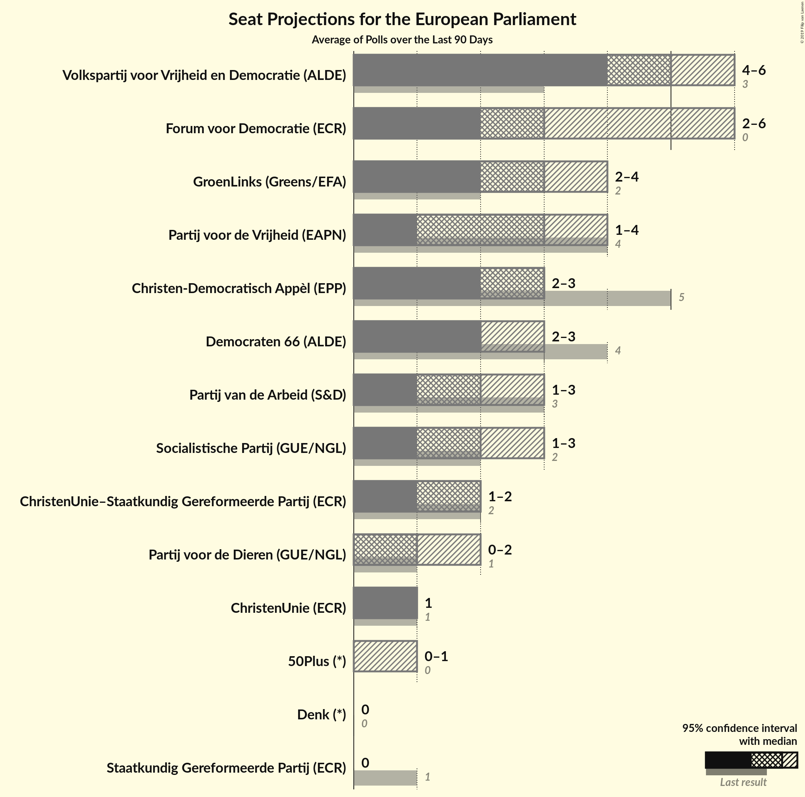

### Confidence Intervals

| Party | Last Result | Median | 80% Confidence Interval | 90% Confidence Interval | 95% Confidence Interval | 99% Confidence Interval |
|:-----:|:-----------:|:------:|:-----------------------:|:-----------------------:|:-----------------------:|:-----------------------:|
| <a href="#democraten-66-(alde)">Democraten 66 (ALDE)</a> | 4 | 2 | 2–3 |2–3 | 2–3 | 2–3 |
| <a href="#christen-democratisch-appèl-(epp)">Christen-Democratisch Appèl (EPP)</a> | 5 | 3 | 2–3 |2–3 | 2–3 | 2–3 |
| <a href="#partij-voor-de-vrijheid-(enf)">Partij voor de Vrijheid (ENF)</a> | 4 | 2 | 1–3 |1–3 | 1–3 | 1–3 |
| <a href="#volkspartij-voor-vrijheid-en-democratie-(alde)">Volkspartij voor Vrijheid en Democratie (ALDE)</a> | 3 | 4 | 4–5 |4–5 | 4–5 | 4–5 |
| <a href="#socialistische-partij-(gue/ngl)">Socialistische Partij (GUE/NGL)</a> | 2 | 2 | 1–3 |1–3 | 1–3 | 1–3 |
| <a href="#partij-van-de-arbeid-(s&d)">Partij van de Arbeid (S&D)</a> | 3 | 2 | 2–3 |2–3 | 2–3 | 2–3 |
| <a href="#christenunie-(ecr)">ChristenUnie (ECR)</a> | 1 | 1 | 0–1 |0–1 | 0–1 | 0–1 |
| <a href="#staatkundig-gereformeerde-partij-(ecr)">Staatkundig Gereformeerde Partij (ECR)</a> | 1 | 0 | 0 |0 | 0 | 0 |
| <a href="#groenlinks-(greens/efa)">GroenLinks (Greens/EFA)</a> | 2 | 4 | 4 |3–4 | 3–4 | 3–4 |
| <a href="#partij-voor-de-dieren-(gue/ngl)">Partij voor de Dieren (GUE/NGL)</a> | 1 | 1 | 1 |1 | 1 | 1–2 |
| <a href="#50plus-(*)">50Plus (*)</a> | 0 | 0 | 0 |0 | 0 | 0 |
| <a href="#piratenpartij-(*)">Piratenpartij (*)</a> | 0 | N/A | N/A |N/A | N/A | N/A |
| <a href="#denk-(*)">Denk (*)</a> | 0 | 0 | 0 |0 | 0 | 0 |
| <a href="#forum-voor-democratie-(ecr)">Forum voor Democratie (ECR)</a> | 0 | 4 | 3–6 |3–6 | 3–6 | 3–6 |
| <a href="#bij1-(*)">Bij1 (*)</a> | 0 | N/A | N/A |N/A | N/A | N/A |

### Democraten 66 (ALDE)

*For a full overview of the results for this party, see the [Democraten 66 (ALDE)](party-democraten66alde.html) page.*

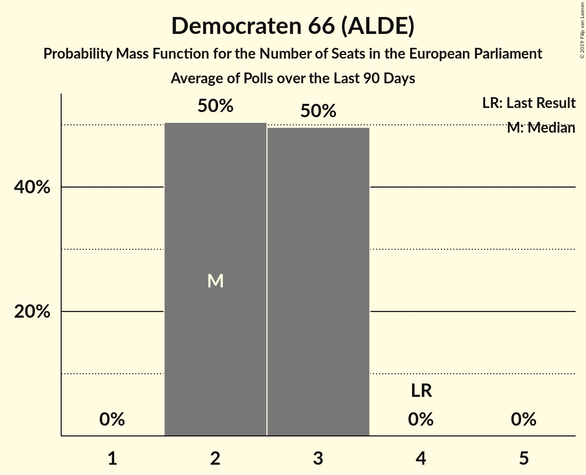

| Number of Seats | Probability | Accumulated | Special Marks |
|:---------------:|:-----------:|:-----------:|:-------------:|
| 2 | 50% | 100% | Median |
| 3 | 50% | 50% |  |
| 4 | 0% | 0% | Last Result |

### Christen-Democratisch Appèl (EPP)

*For a full overview of the results for this party, see the [Christen-Democratisch Appèl (EPP)](party-christen-democratischappèlepp.html) page.*

| Number of Seats | Probability | Accumulated | Special Marks |
|:---------------:|:-----------:|:-----------:|:-------------:|
| 2 | 50% | 100% |  |
| 3 | 50% | 50% | Median |
| 4 | 0% | 0% |  |
| 5 | 0% | 0% | Last Result |

### Partij voor de Vrijheid (ENF)

*For a full overview of the results for this party, see the [Partij voor de Vrijheid (ENF)](party-partijvoordevrijheidenf.html) page.*

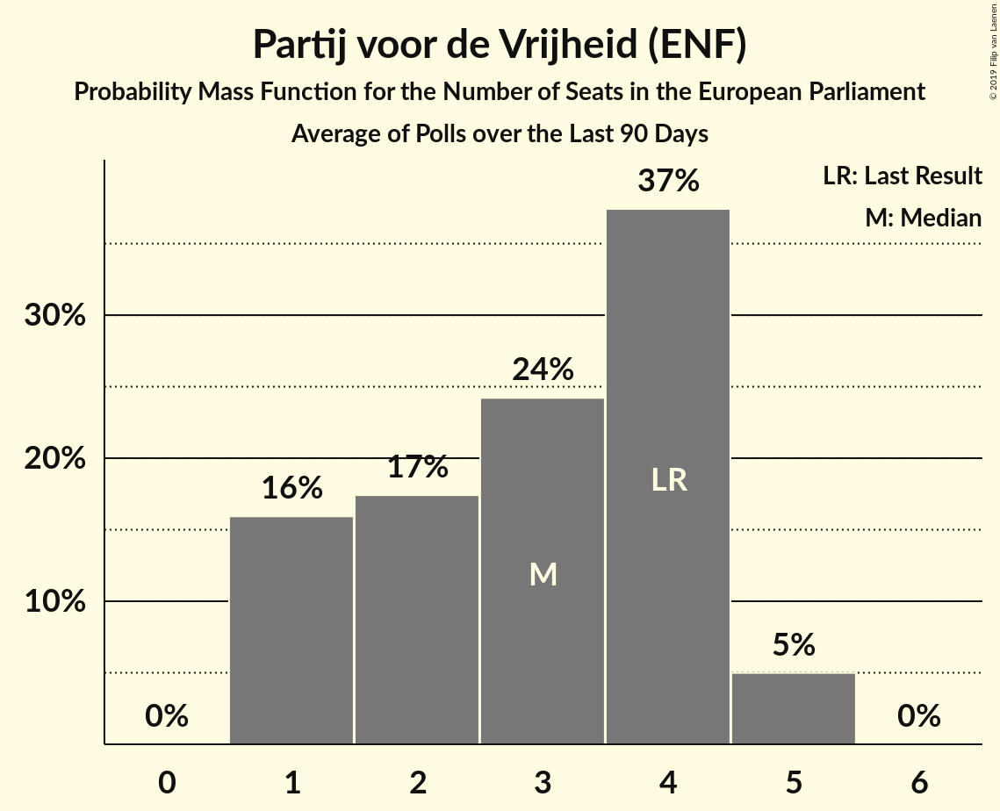

| Number of Seats | Probability | Accumulated | Special Marks |
|:---------------:|:-----------:|:-----------:|:-------------:|
| 1 | 37% | 100% |  |
| 2 | 13% | 63% | Median |
| 3 | 50% | 50% |  |
| 4 | 0% | 0% | Last Result |

### Volkspartij voor Vrijheid en Democratie (ALDE)

*For a full overview of the results for this party, see the [Volkspartij voor Vrijheid en Democratie (ALDE)](party-volkspartijvoorvrijheidendemocratiealde.html) page.*

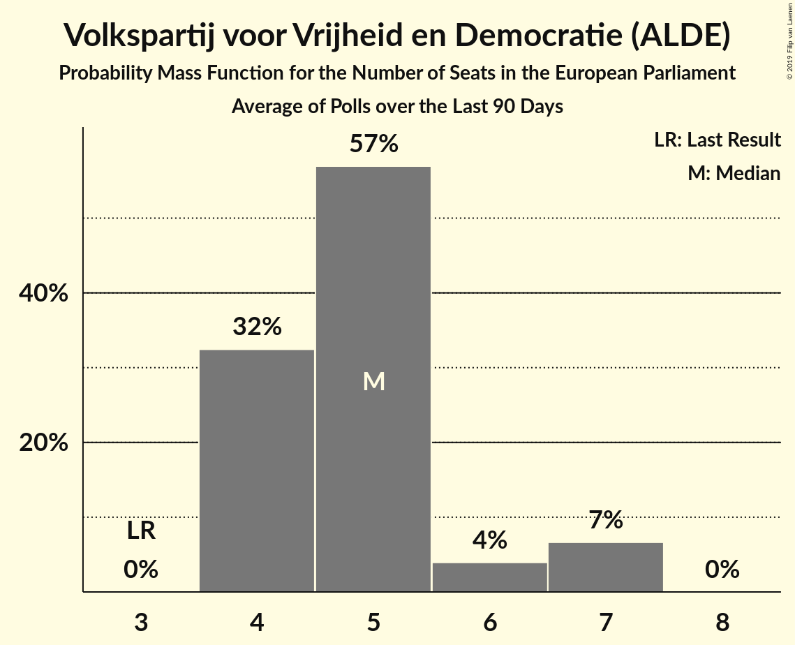

| Number of Seats | Probability | Accumulated | Special Marks |
|:---------------:|:-----------:|:-----------:|:-------------:|
| 3 | 0% | 100% | Last Result |
| 4 | 84% | 100% | Median |
| 5 | 16% | 16% |  |
| 6 | 0.1% | 0.1% |  |
| 7 | 0% | 0% |  |

### Socialistische Partij (GUE/NGL)

*For a full overview of the results for this party, see the [Socialistische Partij (GUE/NGL)](party-socialistischepartijguengl.html) page.*

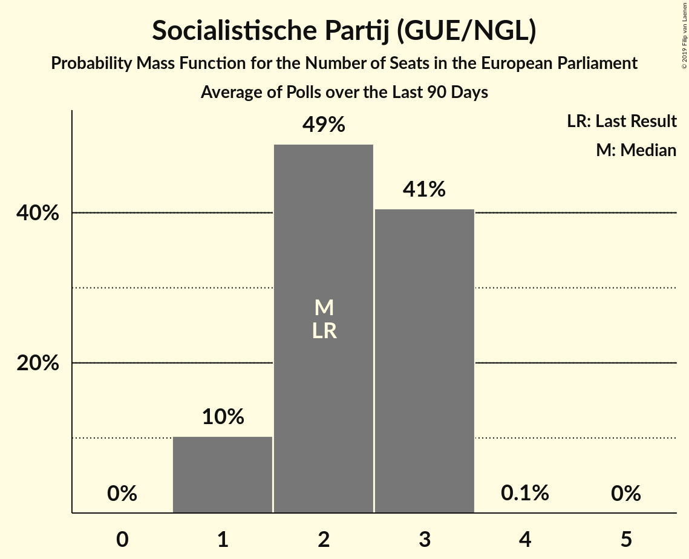

| Number of Seats | Probability | Accumulated | Special Marks |
|:---------------:|:-----------:|:-----------:|:-------------:|
| 1 | 15% | 100% |  |
| 2 | 35% | 85% | Last Result, Median |
| 3 | 50% | 50% |  |
| 4 | 0% | 0% |  |

### Partij van de Arbeid (S&D)

*For a full overview of the results for this party, see the [Partij van de Arbeid (S&D)](party-partijvandearbeidsd.html) page.*

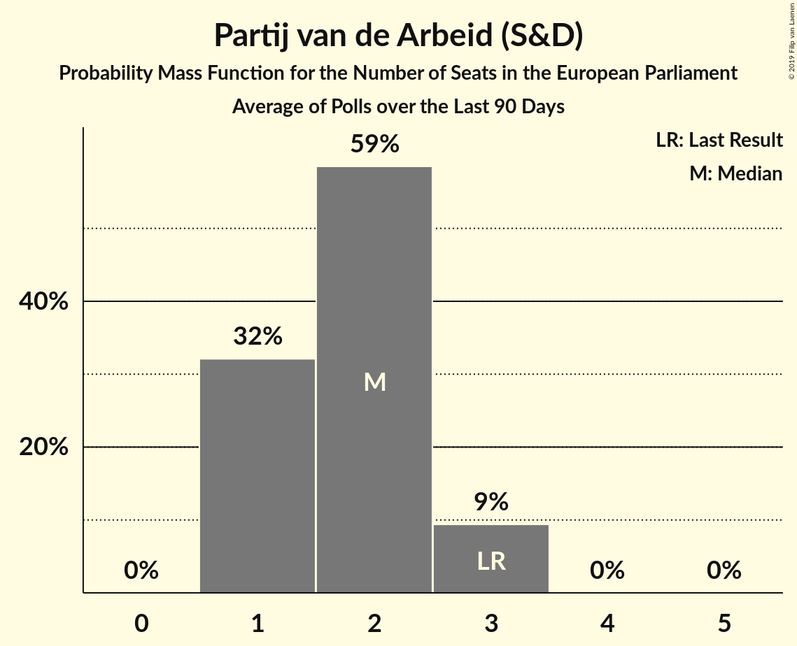

| Number of Seats | Probability | Accumulated | Special Marks |
|:---------------:|:-----------:|:-----------:|:-------------:|
| 1 | 0.1% | 100% |  |
| 2 | 74% | 99.9% | Median |
| 3 | 26% | 26% | Last Result |
| 4 | 0% | 0% |  |

### ChristenUnie (ECR)

*For a full overview of the results for this party, see the [ChristenUnie (ECR)](party-christenunieecr.html) page.*

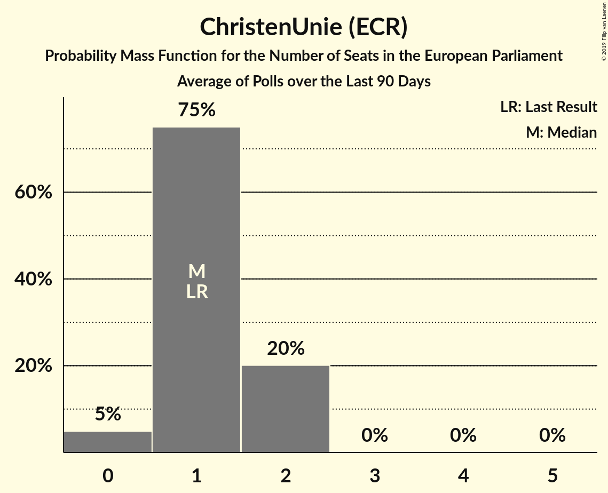

| Number of Seats | Probability | Accumulated | Special Marks |
|:---------------:|:-----------:|:-----------:|:-------------:|
| 0 | 18% | 100% |  |
| 1 | 82% | 82% | Last Result, Median |
| 2 | 0.1% | 0.1% |  |
| 3 | 0% | 0% |  |

### Staatkundig Gereformeerde Partij (ECR)

*For a full overview of the results for this party, see the [Staatkundig Gereformeerde Partij (ECR)](party-staatkundiggereformeerdepartijecr.html) page.*

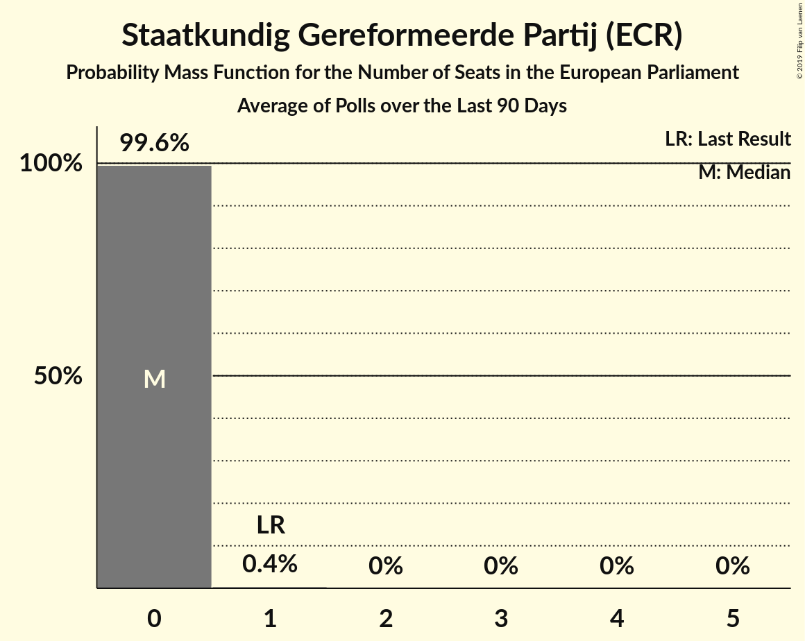

| Number of Seats | Probability | Accumulated | Special Marks |
|:---------------:|:-----------:|:-----------:|:-------------:|
| 0 | 100% | 100% | Median |
| 1 | 0% | 0% | Last Result |

### GroenLinks (Greens/EFA)

*For a full overview of the results for this party, see the [GroenLinks (Greens/EFA)](party-groenlinksgreensefa.html) page.*

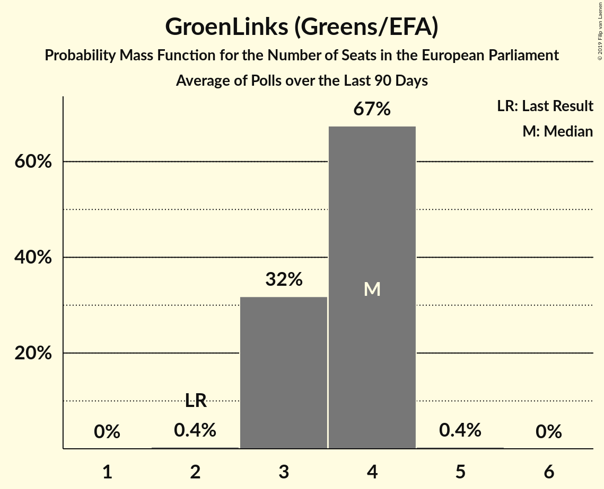

| Number of Seats | Probability | Accumulated | Special Marks |
|:---------------:|:-----------:|:-----------:|:-------------:|
| 2 | 0% | 100% | Last Result |
| 3 | 9% | 100% |  |
| 4 | 91% | 91% | Median |
| 5 | 0% | 0% |  |

### Partij voor de Dieren (GUE/NGL)

*For a full overview of the results for this party, see the [Partij voor de Dieren (GUE/NGL)](party-partijvoordedierenguengl.html) page.*

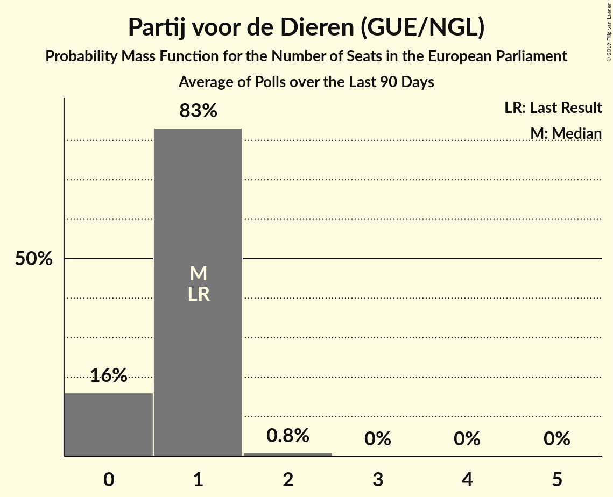

| Number of Seats | Probability | Accumulated | Special Marks |
|:---------------:|:-----------:|:-----------:|:-------------:|
| 0 | 0.4% | 100% |  |
| 1 | 98.7% | 99.6% | Last Result, Median |
| 2 | 0.9% | 0.9% |  |
| 3 | 0% | 0% |  |

### 50Plus (*)

*For a full overview of the results for this party, see the [50Plus (*)](party-50plus.html) page.*

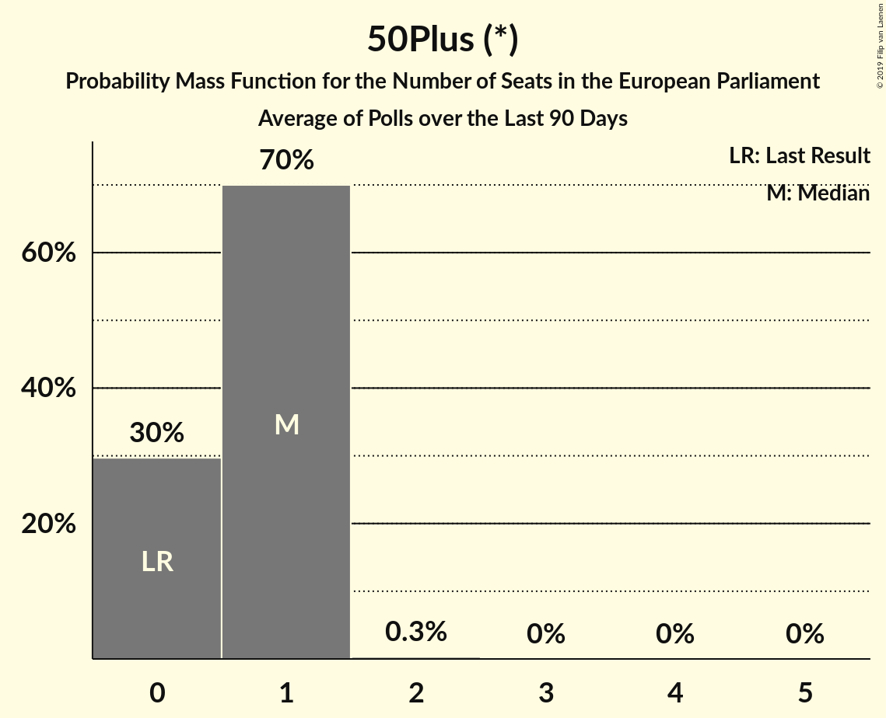

| Number of Seats | Probability | Accumulated | Special Marks |
|:---------------:|:-----------:|:-----------:|:-------------:|
| 0 | 99.6% | 100% | Last Result, Median |
| 1 | 0.4% | 0.4% |  |
| 2 | 0% | 0% |  |

### Denk (*)

*For a full overview of the results for this party, see the [Denk (*)](party-denk.html) page.*

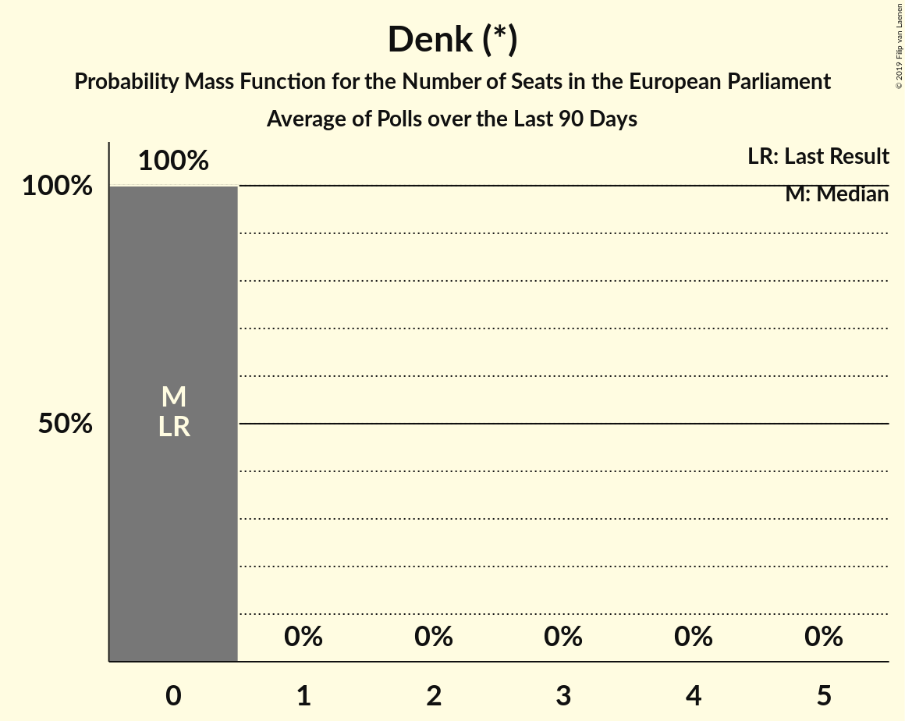

| Number of Seats | Probability | Accumulated | Special Marks |
|:---------------:|:-----------:|:-----------:|:-------------:|
| 0 | 100% | 100% | Last Result, Median |

### Forum voor Democratie (ECR)

*For a full overview of the results for this party, see the [Forum voor Democratie (ECR)](party-forumvoordemocratieecr.html) page.*

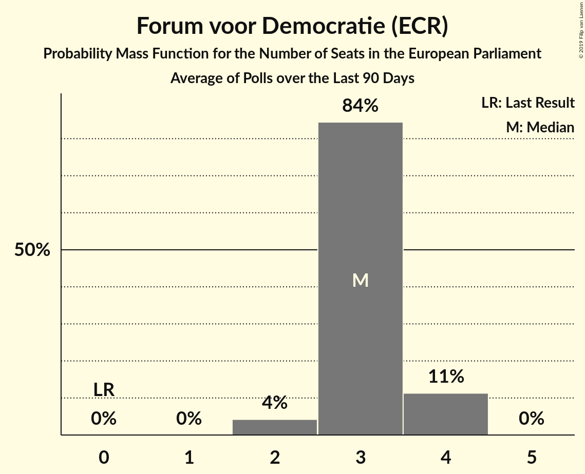

| Number of Seats | Probability | Accumulated | Special Marks |
|:---------------:|:-----------:|:-----------:|:-------------:|
| 0 | 0% | 100% | Last Result |
| 1 | 0% | 100% |  |
| 2 | 0% | 100% |  |
| 3 | 50% | 100% |  |
| 4 | 0.1% | 50% | Median |
| 5 | 15% | 50% |  |
| 6 | 35% | 35% |  |
| 7 | 0% | 0% |  |

## Coalitions

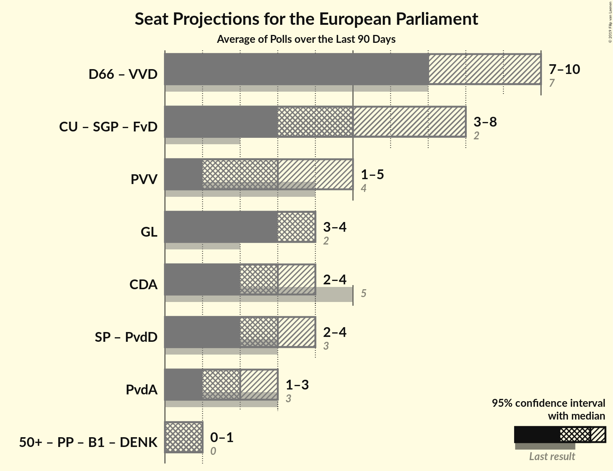

### Confidence Intervals

| Coalition | Last Result | Median | Majority? | 80% Confidence Interval | 90% Confidence Interval | 95% Confidence Interval | 99% Confidence Interval |
|:---------:|:-----------:|:------:|:---------:|:-----------------------:|:-----------------------:|:-----------------------:|:-----------------------:|
| Democraten 66 (ALDE) – Volkspartij voor Vrijheid en Democratie (ALDE) | 7 | 7 | 0% | 6–7 | 6–7 | 6–7 | 6–7 |
| ChristenUnie (ECR) – Staatkundig Gereformeerde Partij (ECR) – Forum voor Democratie (ECR) | 2 | 5 | 0% | 4–7 | 4–7 | 4–7 | 4–7 |
| GroenLinks (Greens/EFA) | 2 | 4 | 0% | 4 | 3–4 | 3–4 | 3–4 |
| Socialistische Partij (GUE/NGL) – Partij voor de Dieren (GUE/NGL) | 3 | 3 | 0% | 2–4 | 2–4 | 2–4 | 2–4 |
| Christen-Democratisch Appèl (EPP) | 5 | 3 | 0% | 2–3 | 2–3 | 2–3 | 2–3 |
| Partij van de Arbeid (S&D) | 3 | 2 | 0% | 2–3 | 2–3 | 2–3 | 2–3 |
| Partij voor de Vrijheid (ENF) | 4 | 2 | 0% | 1–3 | 1–3 | 1–3 | 1–3 |
| 50Plus (*) – Piratenpartij (*) – Bij1 (*) – Denk (*) | 0 | 0 | 0% | 0 | 0 | 0 | 0 |

### Democraten 66 (ALDE) – Volkspartij voor Vrijheid en Democratie (ALDE)

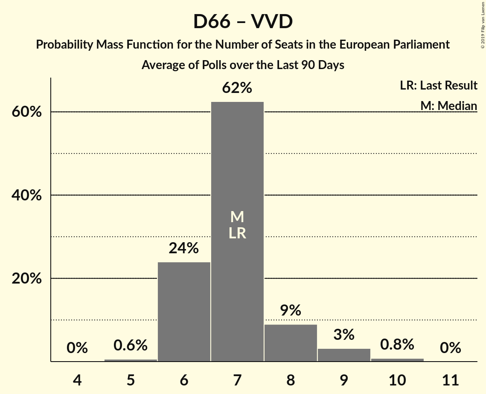

| Number of Seats | Probability | Accumulated | Special Marks |
|:---------------:|:-----------:|:-----------:|:-------------:|
| 6 | 34% | 100% | Median |
| 7 | 66% | 66% | Last Result |
| 8 | 0.1% | 0.1% |  |
| 9 | 0% | 0% |  |

### ChristenUnie (ECR) – Staatkundig Gereformeerde Partij (ECR) – Forum voor Democratie (ECR)

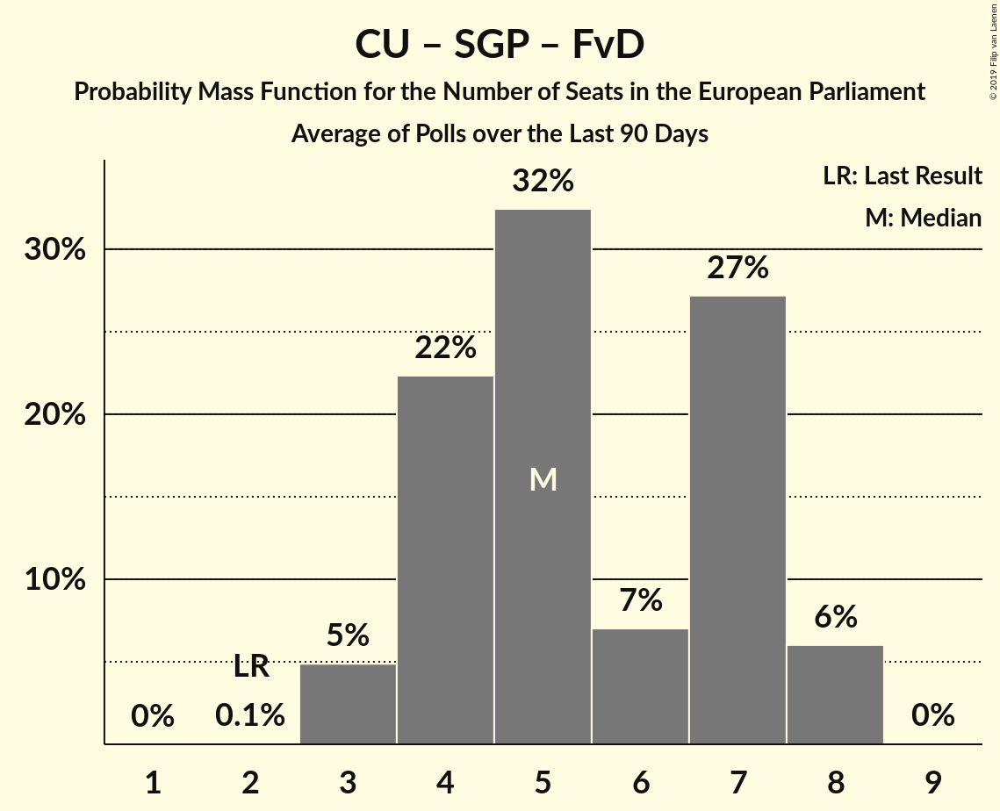

| Number of Seats | Probability | Accumulated | Special Marks |
|:---------------:|:-----------:|:-----------:|:-------------:|
| 2 | 0% | 100% | Last Result |
| 3 | 0% | 100% |  |
| 4 | 50% | 100% |  |
| 5 | 0.7% | 50% | Median |
| 6 | 32% | 49% |  |
| 7 | 18% | 18% |  |
| 8 | 0% | 0% |  |

### GroenLinks (Greens/EFA)

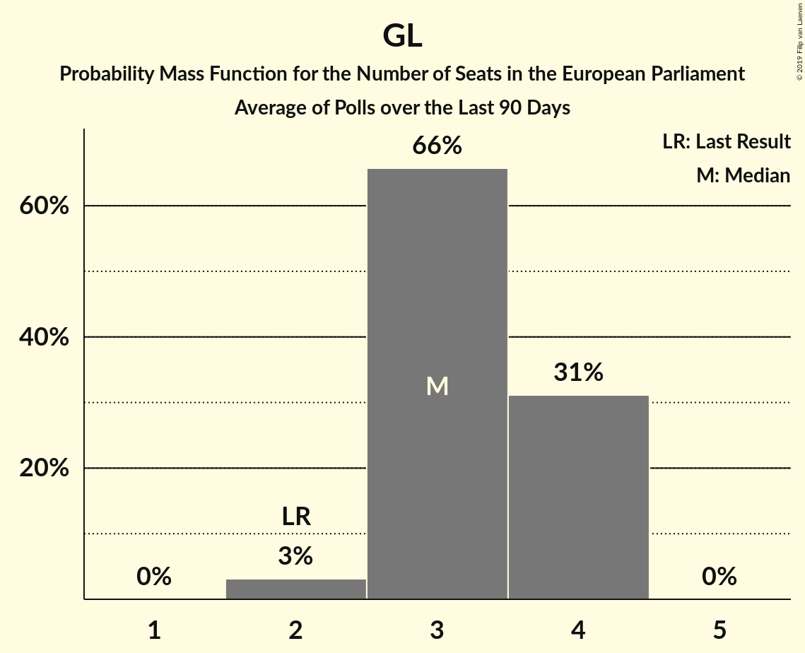

| Number of Seats | Probability | Accumulated | Special Marks |
|:---------------:|:-----------:|:-----------:|:-------------:|
| 2 | 0% | 100% | Last Result |
| 3 | 9% | 100% |  |
| 4 | 91% | 91% | Median |
| 5 | 0% | 0% |  |

### Socialistische Partij (GUE/NGL) – Partij voor de Dieren (GUE/NGL)

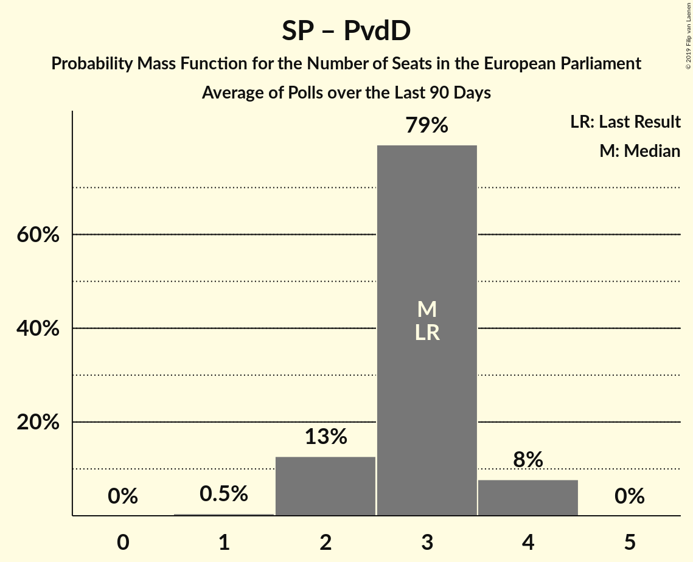

| Number of Seats | Probability | Accumulated | Special Marks |
|:---------------:|:-----------:|:-----------:|:-------------:|
| 2 | 14% | 100% |  |
| 3 | 36% | 86% | Last Result, Median |
| 4 | 50% | 50% |  |
| 5 | 0% | 0% |  |

### Christen-Democratisch Appèl (EPP)

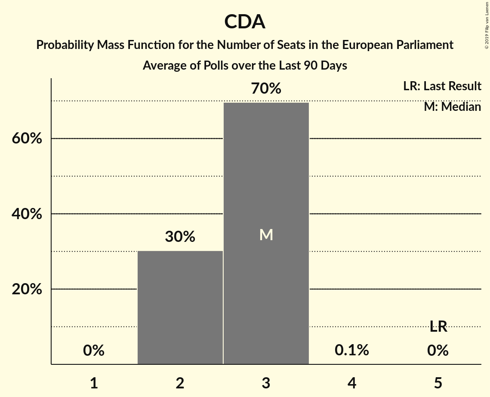

| Number of Seats | Probability | Accumulated | Special Marks |
|:---------------:|:-----------:|:-----------:|:-------------:|
| 2 | 50% | 100% |  |
| 3 | 50% | 50% | Median |
| 4 | 0% | 0% |  |
| 5 | 0% | 0% | Last Result |

### Partij van de Arbeid (S&D)

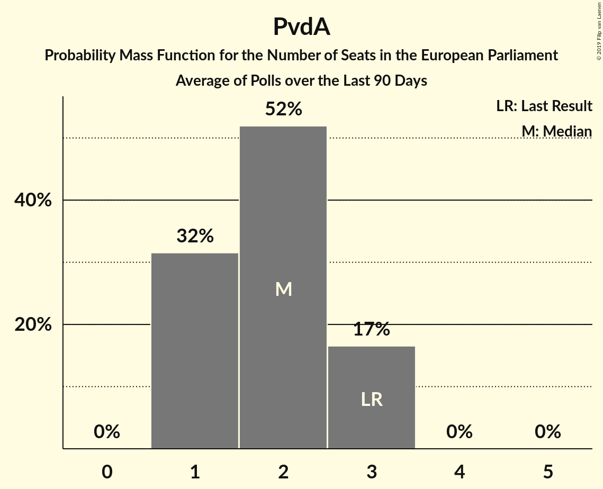

| Number of Seats | Probability | Accumulated | Special Marks |
|:---------------:|:-----------:|:-----------:|:-------------:|
| 1 | 0.1% | 100% |  |
| 2 | 74% | 99.9% | Median |
| 3 | 26% | 26% | Last Result |
| 4 | 0% | 0% |  |

### Partij voor de Vrijheid (ENF)

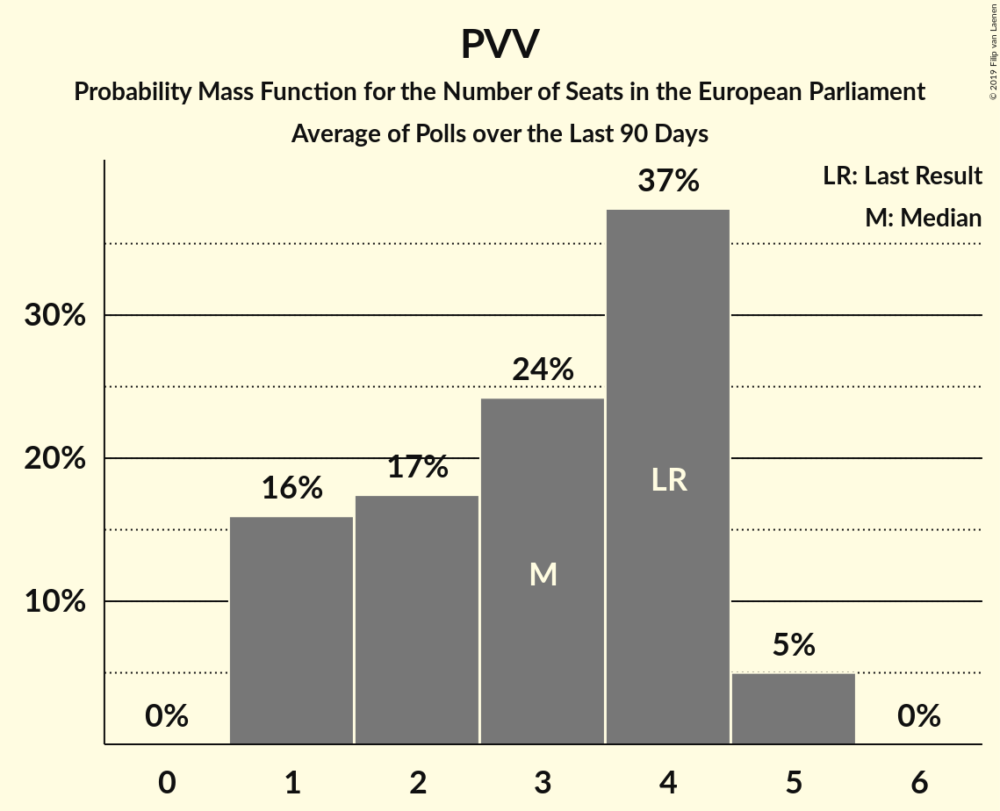

| Number of Seats | Probability | Accumulated | Special Marks |
|:---------------:|:-----------:|:-----------:|:-------------:|
| 1 | 37% | 100% |  |
| 2 | 13% | 63% | Median |
| 3 | 50% | 50% |  |
| 4 | 0% | 0% | Last Result |

### 50Plus (*) – Piratenpartij (*) – Bij1 (*) – Denk (*)

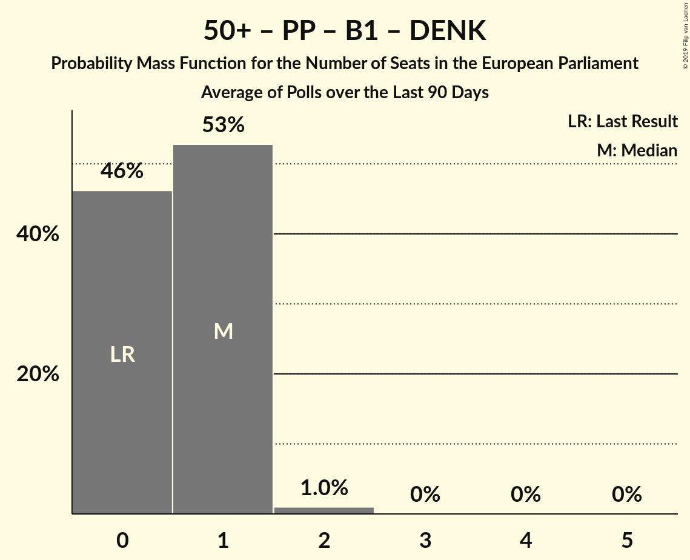

| Number of Seats | Probability | Accumulated | Special Marks |
|:---------------:|:-----------:|:-----------:|:-------------:|
| 0 | 99.6% | 100% | Last Result, Median |
| 1 | 0.4% | 0.4% |  |
| 2 | 0% | 0% |  |

## Technical Information

+ **Number of polls included in this average:** 3
+ **Lowest number of simulations done in a poll included in this average:** 0
+ **Total number of simulations done in the polls included in this average:** 33,792
+ **Error estimate:** 4.86%
