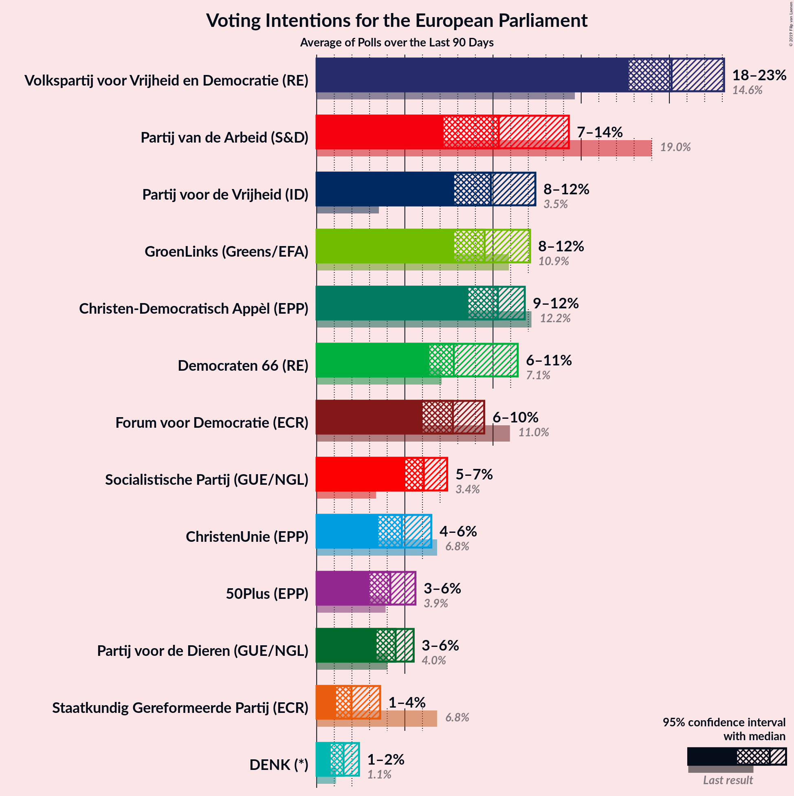
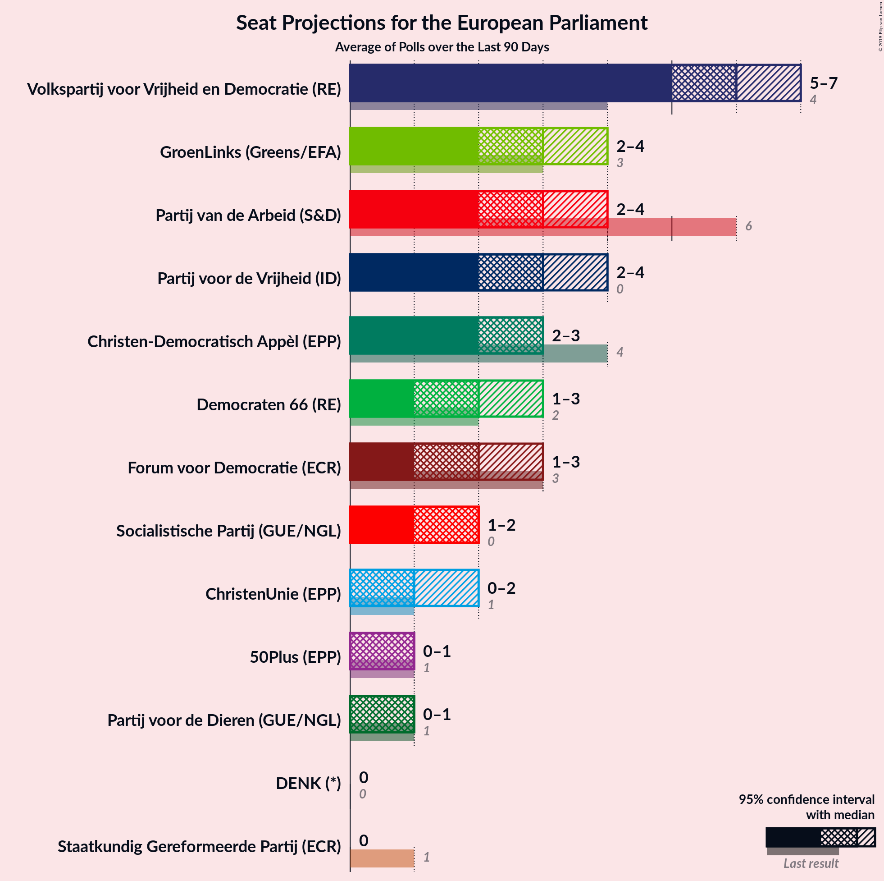
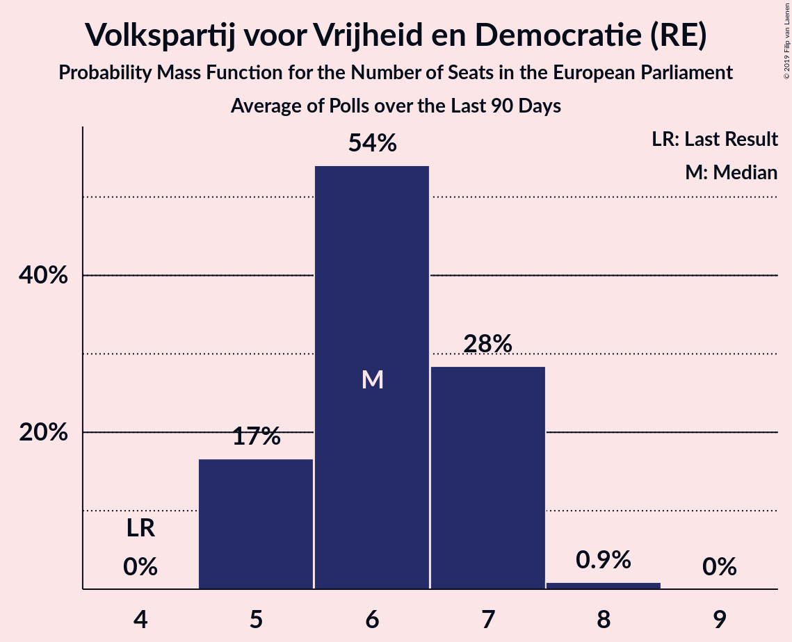
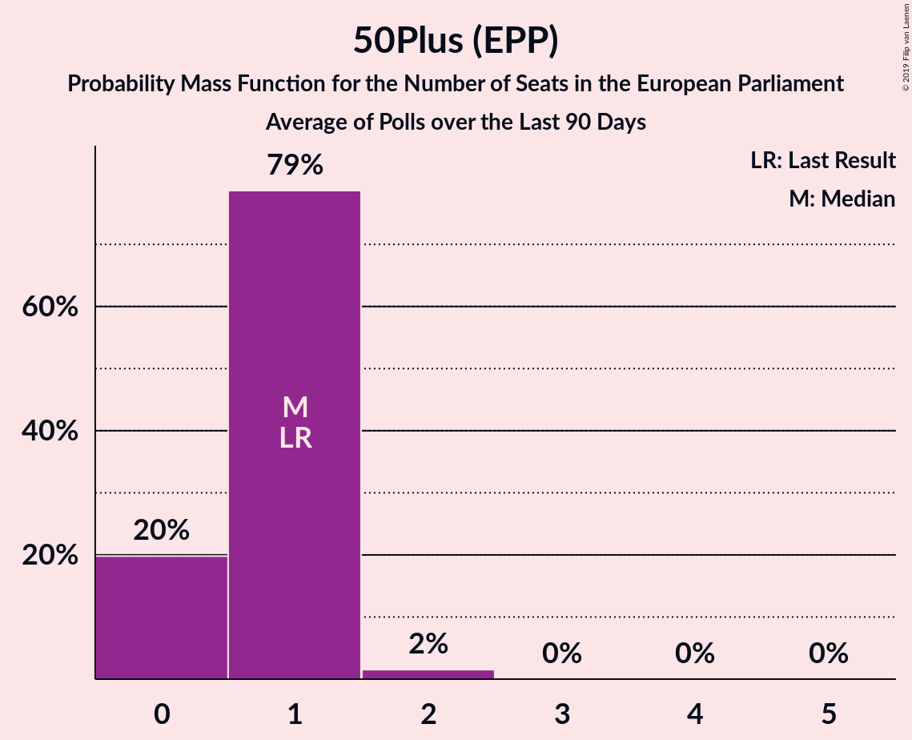
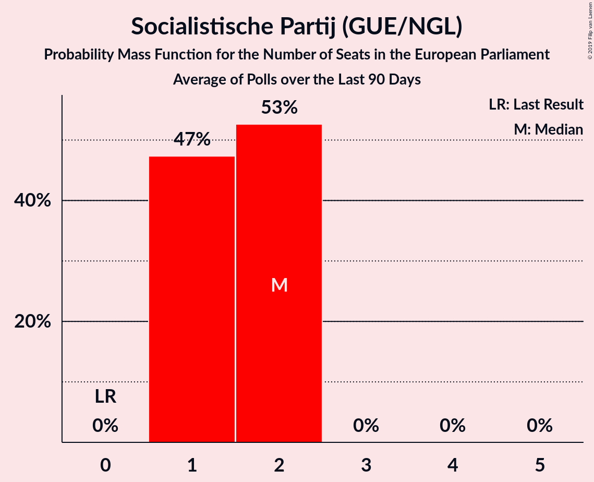
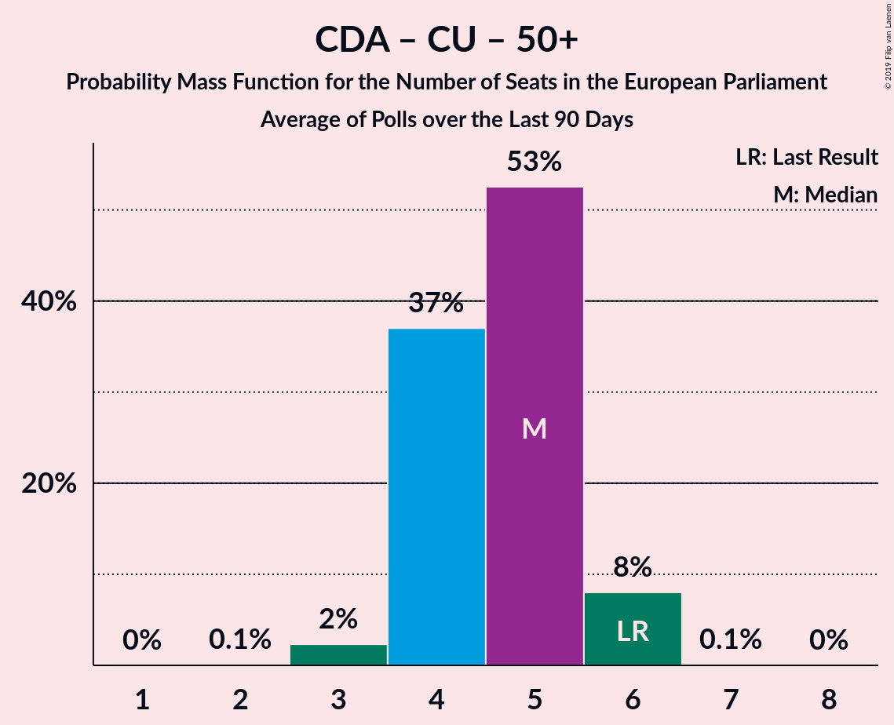
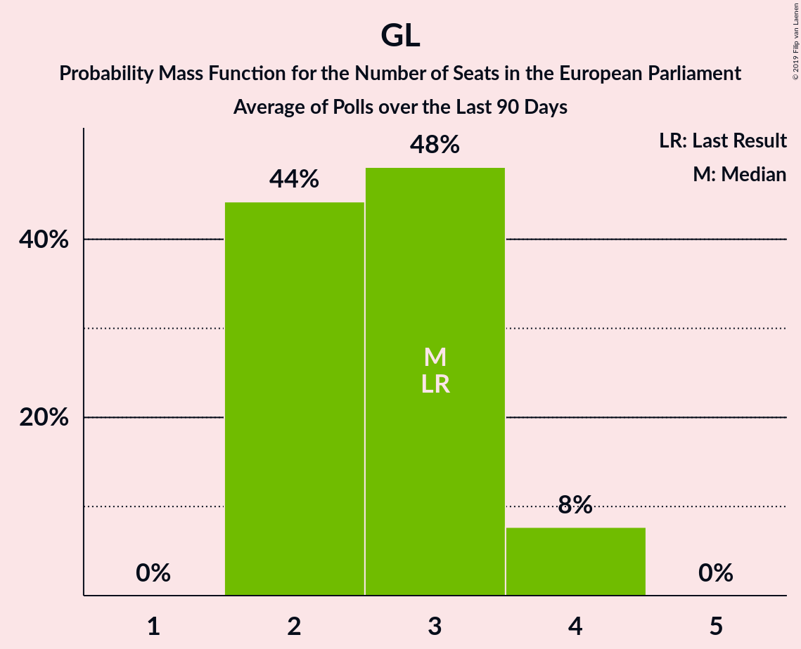
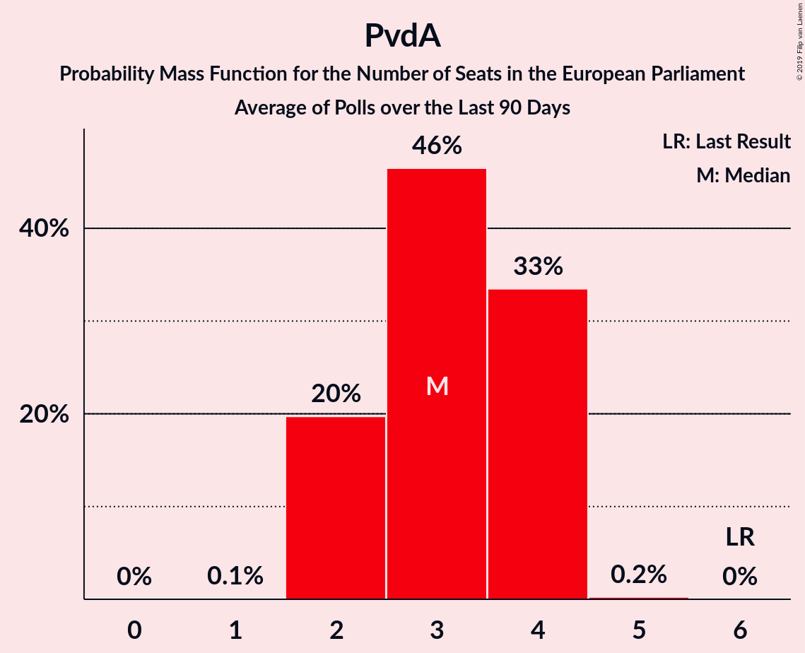

# Poll Average

<a href="#voting-intentions">Voting Intentions</a> | <a href="#seats">Seats</a> | <a href="#coalitions">Coalitions</a> | <a href="#technical-information">Technical Information</a>

## Summary

The table below lists the polls on which the average is based. They are the most recent polls (less than 90 days old) registered and analyzed so far.

| Period     | Polling firm/Commissioner(s) | PvdA | VVD | CDA | FvD | GL | D66 | CU | SGP | PvdD | 50+ | PVV | SP | DENK | PP | B1 |
|:----------:|:----------------------------:|:--:|:--:|:--:|:--:|:--:|:--:|:--:|:--:|:--:|:--:|:--:|:--:|:--:|:--:|:--:|
| 23 May 2019 | General Election | 19.0%   6 | 14.6%   4 | 12.2%   4 | 11.0%   3 | 10.9%   3 | 7.1%   2 | 6.8%   1 | 6.8%   1 | 4.0%   1 | 3.9%   1 | 3.5%   0 | 3.4%   0 | 1.1%   0 | 0.2%   0 | 0.0%   0 |
| N/A | Poll Average | 8–11%   2–3 | 18–22%   5–7 | 8–12%   2–4 | 10–17%   3–5 | 9–14%   2–4 | 6–10%   1–3 | 3–6%   0–1 | 2–3%   0 | 3–5%   0–1 | 3–5%   0–1 | 5–8%   1–2 | 4–7%   1–2 | 1–2%   0 | N/A   N/A | N/A   N/A |
| [19–24 August 2019](2019-08-24-Peilnl.html) | Peil.nl | N/A   N/A | N/A   N/A | N/A   N/A | N/A   N/A | N/A   N/A | N/A   N/A | N/A   N/A | N/A   N/A | N/A   N/A | N/A   N/A | N/A   N/A | N/A   N/A | N/A   N/A | N/A   N/A | N/A   N/A |
| [26–29 July 2019](2019-07-29-Ipsos.html) | Ipsos   EenVandaag | 7–11%   2–3 | 18–23%   6–7 | 8–12%   2–4 | 10–14%   3–4 | 9–12%   2–4 | 7–10%   2–3 | 3–6%   0–1 | 1–3%   0 | 3–5%   0–1 | 3–5%   0–1 | 6–9%   1–2 | 4–7%   1–2 | 1–2%   0 | N/A   N/A | N/A   N/A |
| [5–9 July 2019](2019-07-09-IOResearch.html) | I&O Research | 9–11%   2–3 | 18–21%   5–7 | 9–11%   3 | 14–17%   4–5 | 11–14%   3–4 | 6–8%   1–2 | 3–5%   0–1 | 2–3%   0 | 3–5%   0–1 | 3–4%   0–1 | 5–7%   1–2 | 4–6%   1–2 | 1–2%   0 | N/A   N/A | N/A   N/A |
| 23 May 2019 | General Election | 19.0%   6 | 14.6%   4 | 12.2%   4 | 11.0%   3 | 10.9%   3 | 7.1%   2 | 6.8%   1 | 6.8%   1 | 4.0%   1 | 3.9%   1 | 3.5%   0 | 3.4%   0 | 1.1%   0 | 0.2%   0 | 0.0%   0 |

Only polls for which at least the sample size has been published are included in the table above.

**Legend:**
+ **Top half of each row:** Voting intentions (95% confidence interval)
+ **Bottom half of each row:** Seat projections for the European Parliament (95% confidence interval)
+ **PvdA:** Partij van de Arbeid (S&D)
+ **VVD:** Volkspartij voor Vrijheid en Democratie (RE)
+ **CDA:** Christen-Democratisch Appèl (EPP)
+ **FvD:** Forum voor Democratie (ECR)
+ **GL:** GroenLinks (Greens/EFA)
+ **D66:** Democraten 66 (RE)
+ **CU:** ChristenUnie (EPP)
+ **SGP:** Staatkundig Gereformeerde Partij (ECR)
+ **PvdD:** Partij voor de Dieren (GUE/NGL)
+ **50+:** 50Plus (EPP)
+ **PVV:** Partij voor de Vrijheid (ID)
+ **SP:** Socialistische Partij (GUE/NGL)
+ **DENK:** DENK (*)
+ **PP:** Piratenpartij (*)
+ **B1:** Bij1 (*)
+ **N/A (single party):** Party not included the published results
+ **N/A (entire row):** Calculation for this opinion poll not started yet

## Voting Intentions

### Confidence Intervals

| Party | Last Result | Median | 80% Confidence Interval | 90% Confidence Interval | 95% Confidence Interval | 99% Confidence Interval |
|:-----:|:-----------:|:------:|:-----------------------:|:-----------------------:|:-----------------------:|:-----------------------:|
| <a href="#partij-van-de-arbeid-(s&d)">Partij van de Arbeid (S&D)</a> | 19.0% | 9.6% | 8.2–10.6% |7.8–10.9% | 7.5–11.1% | 7.0–11.6% |
| <a href="#volkspartij-voor-vrijheid-en-democratie-(re)">Volkspartij voor Vrijheid en Democratie (RE)</a> | 14.6% | 19.7% | 18.4–21.3% |18.1–21.8% | 17.8–22.3% | 17.2–23.2% |
| <a href="#christen-democratisch-appèl-(epp)">Christen-Democratisch Appèl (EPP)</a> | 12.2% | 10.0% | 9.1–11.1% |8.8–11.4% | 8.5–11.7% | 8.0–12.4% |
| <a href="#forum-voor-democratie-(ecr)">Forum voor Democratie (ECR)</a> | 11.0% | 14.0% | 11.2–16.0% |10.8–16.3% | 10.4–16.6% | 9.8–17.1% |
| <a href="#groenlinks-(greens/efa)">GroenLinks (Greens/EFA)</a> | 10.9% | 11.7% | 9.5–13.3% |9.1–13.6% | 8.8–13.8% | 8.2–14.3% |
| <a href="#democraten-66-(re)">Democraten 66 (RE)</a> | 7.1% | 7.3% | 6.3–9.1% |6.0–9.5% | 5.9–9.8% | 5.5–10.5% |
| <a href="#christenunie-(epp)">ChristenUnie (EPP)</a> | 6.8% | 4.2% | 3.6–5.1% |3.4–5.4% | 3.3–5.7% | 3.1–6.2% |
| <a href="#staatkundig-gereformeerde-partij-(ecr)">Staatkundig Gereformeerde Partij (ECR)</a> | 6.8% | 2.1% | 1.7–2.8% |1.6–3.0% | 1.5–3.2% | 1.3–3.6% |
| <a href="#partij-voor-de-dieren-(gue/ngl)">Partij voor de Dieren (GUE/NGL)</a> | 4.0% | 4.0% | 3.4–4.7% |3.2–4.9% | 3.0–5.1% | 2.7–5.5% |
| <a href="#50plus-(epp)">50Plus (EPP)</a> | 3.9% | 3.6% | 3.0–4.4% |2.8–4.7% | 2.7–4.9% | 2.5–5.4% |
| <a href="#partij-voor-de-vrijheid-(id)">Partij voor de Vrijheid (ID)</a> | 3.5% | 6.4% | 5.6–7.8% |5.4–8.1% | 5.2–8.5% | 4.9–9.1% |
| <a href="#socialistische-partij-(gue/ngl)">Socialistische Partij (GUE/NGL)</a> | 3.4% | 5.4% | 4.7–6.2% |4.5–6.5% | 4.3–6.8% | 4.0–7.3% |
| <a href="#denk-(*)">DENK (*)</a> | 1.1% | 1.3% | 0.9–1.7% |0.8–1.8% | 0.7–1.9% | 0.6–2.2% |
| <a href="#piratenpartij-(*)">Piratenpartij (*)</a> | 0.2% | N/A | N/A |N/A | N/A | N/A |
| <a href="#bij1-(*)">Bij1 (*)</a> | 0.0% | N/A | N/A |N/A | N/A | N/A |

### Partij van de Arbeid (S&D)

*For a full overview of the results for this party, see the [Partij van de Arbeid (S&D)](party-partijvandearbeidsd.html) page.*

| Voting Intentions | Probability | Accumulated | Special Marks |
|:-----------------:|:-----------:|:-----------:|:-------------:|
| 4.5–5.5% | 0% | 100% |  |
| 5.5–6.5% | 0.1% | 100% |  |
| 6.5–7.5% | 3% | 99.9% |  |
| 7.5–8.5% | 15% | 97% |  |
| 8.5–9.5% | 32% | 83% |  |
| 9.5–10.5% | 38% | 51% | Median |
| 10.5–11.5% | 12% | 12% |  |
| 11.5–12.5% | 0.6% | 0.6% |  |
| 12.5–13.5% | 0% | 0% |  |
| 13.5–14.5% | 0% | 0% |  |
| 14.5–15.5% | 0% | 0% |  |
| 15.5–16.5% | 0% | 0% |  |
| 16.5–17.5% | 0% | 0% |  |
| 17.5–18.5% | 0% | 0% |  |
| 18.5–19.5% | 0% | 0% | Last Result |

### Volkspartij voor Vrijheid en Democratie (RE)

*For a full overview of the results for this party, see the [Volkspartij voor Vrijheid en Democratie (RE)](party-volkspartijvoorvrijheidendemocratiere.html) page.*

| Voting Intentions | Probability | Accumulated | Special Marks |
|:-----------------:|:-----------:|:-----------:|:-------------:|
| 14.5–15.5% | 0% | 100% | Last Result |
| 15.5–16.5% | 0.1% | 100% |  |
| 16.5–17.5% | 1.4% | 99.9% |  |
| 17.5–18.5% | 12% | 98.6% |  |
| 18.5–19.5% | 33% | 87% |  |
| 19.5–20.5% | 31% | 54% | Median |
| 20.5–21.5% | 16% | 23% |  |
| 21.5–22.5% | 6% | 7% |  |
| 22.5–23.5% | 1.4% | 2% |  |
| 23.5–24.5% | 0.2% | 0.2% |  |
| 24.5–25.5% | 0% | 0% |  |

### Christen-Democratisch Appèl (EPP)

*For a full overview of the results for this party, see the [Christen-Democratisch Appèl (EPP)](party-christen-democratischappèlepp.html) page.*

| Voting Intentions | Probability | Accumulated | Special Marks |
|:-----------------:|:-----------:|:-----------:|:-------------:|
| 5.5–6.5% | 0% | 100% |  |
| 6.5–7.5% | 0.1% | 100% |  |
| 7.5–8.5% | 2% | 99.9% |  |
| 8.5–9.5% | 23% | 97% |  |
| 9.5–10.5% | 49% | 74% | Median |
| 10.5–11.5% | 22% | 26% |  |
| 11.5–12.5% | 3% | 4% | Last Result |
| 12.5–13.5% | 0.3% | 0.3% |  |
| 13.5–14.5% | 0% | 0% |  |

### Forum voor Democratie (ECR)

*For a full overview of the results for this party, see the [Forum voor Democratie (ECR)](party-forumvoordemocratieecr.html) page.*

| Voting Intentions | Probability | Accumulated | Special Marks |
|:-----------------:|:-----------:|:-----------:|:-------------:|
| 7.5–8.5% | 0% | 100% |  |
| 8.5–9.5% | 0.2% | 100% |  |
| 9.5–10.5% | 3% | 99.8% |  |
| 10.5–11.5% | 13% | 97% | Last Result |
| 11.5–12.5% | 19% | 84% |  |
| 12.5–13.5% | 12% | 65% |  |
| 13.5–14.5% | 10% | 53% | Median |
| 14.5–15.5% | 24% | 43% |  |
| 15.5–16.5% | 17% | 19% |  |
| 16.5–17.5% | 3% | 3% |  |
| 17.5–18.5% | 0.1% | 0.1% |  |
| 18.5–19.5% | 0% | 0% |  |

### GroenLinks (Greens/EFA)

*For a full overview of the results for this party, see the [GroenLinks (Greens/EFA)](party-groenlinksgreensefa.html) page.*

| Voting Intentions | Probability | Accumulated | Special Marks |
|:-----------------:|:-----------:|:-----------:|:-------------:|
| 6.5–7.5% | 0% | 100% |  |
| 7.5–8.5% | 1.4% | 100% |  |
| 8.5–9.5% | 10% | 98.6% |  |
| 9.5–10.5% | 20% | 89% |  |
| 10.5–11.5% | 17% | 69% | Last Result |
| 11.5–12.5% | 23% | 52% | Median |
| 12.5–13.5% | 24% | 29% |  |
| 13.5–14.5% | 5% | 5% |  |
| 14.5–15.5% | 0.2% | 0.2% |  |
| 15.5–16.5% | 0% | 0% |  |

### Democraten 66 (RE)

*For a full overview of the results for this party, see the [Democraten 66 (RE)](party-democraten66re.html) page.*

| Voting Intentions | Probability | Accumulated | Special Marks |
|:-----------------:|:-----------:|:-----------:|:-------------:|
| 3.5–4.5% | 0% | 100% |  |
| 4.5–5.5% | 0.5% | 100% |  |
| 5.5–6.5% | 20% | 99.5% |  |
| 6.5–7.5% | 35% | 80% | Last Result, Median |
| 7.5–8.5% | 24% | 44% |  |
| 8.5–9.5% | 16% | 20% |  |
| 9.5–10.5% | 4% | 4% |  |
| 10.5–11.5% | 0.4% | 0.4% |  |
| 11.5–12.5% | 0% | 0% |  |

### ChristenUnie (EPP)

*For a full overview of the results for this party, see the [ChristenUnie (EPP)](party-christenunieepp.html) page.*

| Voting Intentions | Probability | Accumulated | Special Marks |
|:-----------------:|:-----------:|:-----------:|:-------------:|
| 1.5–2.5% | 0% | 100% |  |
| 2.5–3.5% | 8% | 100% |  |
| 3.5–4.5% | 62% | 92% | Median |
| 4.5–5.5% | 26% | 29% |  |
| 5.5–6.5% | 3% | 4% |  |
| 6.5–7.5% | 0.1% | 0.1% | Last Result |
| 7.5–8.5% | 0% | 0% |  |

### Staatkundig Gereformeerde Partij (ECR)

*For a full overview of the results for this party, see the [Staatkundig Gereformeerde Partij (ECR)](party-staatkundiggereformeerdepartijecr.html) page.*

| Voting Intentions | Probability | Accumulated | Special Marks |
|:-----------------:|:-----------:|:-----------:|:-------------:|
| 0.0–0.5% | 0% | 100% |  |
| 0.5–1.5% | 4% | 100% |  |
| 1.5–2.5% | 78% | 96% | Median |
| 2.5–3.5% | 18% | 18% |  |
| 3.5–4.5% | 0.5% | 0.5% |  |
| 4.5–5.5% | 0% | 0% |  |
| 5.5–6.5% | 0% | 0% |  |
| 6.5–7.5% | 0% | 0% | Last Result |

### Partij voor de Dieren (GUE/NGL)

*For a full overview of the results for this party, see the [Partij voor de Dieren (GUE/NGL)](party-partijvoordedierenguengl.html) page.*

| Voting Intentions | Probability | Accumulated | Special Marks |
|:-----------------:|:-----------:|:-----------:|:-------------:|
| 0.5–1.5% | 0% | 100% |  |
| 1.5–2.5% | 0.2% | 100% |  |
| 2.5–3.5% | 18% | 99.8% |  |
| 3.5–4.5% | 68% | 82% | Last Result, Median |
| 4.5–5.5% | 13% | 14% |  |
| 5.5–6.5% | 0.5% | 0.5% |  |
| 6.5–7.5% | 0% | 0% |  |

### 50Plus (EPP)

*For a full overview of the results for this party, see the [50Plus (EPP)](party-50plusepp.html) page.*

| Voting Intentions | Probability | Accumulated | Special Marks |
|:-----------------:|:-----------:|:-----------:|:-------------:|
| 0.5–1.5% | 0% | 100% |  |
| 1.5–2.5% | 0.8% | 100% |  |
| 2.5–3.5% | 49% | 99.2% |  |
| 3.5–4.5% | 44% | 50% | Last Result, Median |
| 4.5–5.5% | 6% | 7% |  |
| 5.5–6.5% | 0.3% | 0.3% |  |
| 6.5–7.5% | 0% | 0% |  |

### Partij voor de Vrijheid (ID)

*For a full overview of the results for this party, see the [Partij voor de Vrijheid (ID)](party-partijvoordevrijheidid.html) page.*

| Voting Intentions | Probability | Accumulated | Special Marks |
|:-----------------:|:-----------:|:-----------:|:-------------:|
| 3.5–4.5% | 0% | 100% | Last Result |
| 4.5–5.5% | 9% | 100% |  |
| 5.5–6.5% | 46% | 91% | Median |
| 6.5–7.5% | 31% | 45% |  |
| 7.5–8.5% | 12% | 14% |  |
| 8.5–9.5% | 2% | 2% |  |
| 9.5–10.5% | 0.1% | 0.1% |  |
| 10.5–11.5% | 0% | 0% |  |

### Socialistische Partij (GUE/NGL)

*For a full overview of the results for this party, see the [Socialistische Partij (GUE/NGL)](party-socialistischepartijguengl.html) page.*

| Voting Intentions | Probability | Accumulated | Special Marks |
|:-----------------:|:-----------:|:-----------:|:-------------:|
| 2.5–3.5% | 0% | 100% | Last Result |
| 3.5–4.5% | 6% | 100% |  |
| 4.5–5.5% | 54% | 94% | Median |
| 5.5–6.5% | 36% | 40% |  |
| 6.5–7.5% | 4% | 4% |  |
| 7.5–8.5% | 0.2% | 0.2% |  |
| 8.5–9.5% | 0% | 0% |  |

### DENK (*)

*For a full overview of the results for this party, see the [DENK (*)](party-denk.html) page.*

| Voting Intentions | Probability | Accumulated | Special Marks |
|:-----------------:|:-----------:|:-----------:|:-------------:|
| 0.0–0.5% | 0.3% | 100% |  |
| 0.5–1.5% | 80% | 99.7% | Last Result, Median |
| 1.5–2.5% | 20% | 20% |  |
| 2.5–3.5% | 0.1% | 0.1% |  |
| 3.5–4.5% | 0% | 0% |  |

## Seats

### Confidence Intervals

| Party | Last Result | Median | 80% Confidence Interval | 90% Confidence Interval | 95% Confidence Interval | 99% Confidence Interval |
|:-----:|:-----------:|:------:|:-----------------------:|:-----------------------:|:-----------------------:|:-----------------------:|
| <a href="#partij-van-de-arbeid-(s&d)">Partij van de Arbeid (S&D)</a> | 6 | 3 | 2–3 |2–3 | 2–3 | 2–4 |
| <a href="#volkspartij-voor-vrijheid-en-democratie-(re)">Volkspartij voor Vrijheid en Democratie (RE)</a> | 4 | 6 | 6–7 |6–7 | 5–7 | 5–7 |
| <a href="#christen-democratisch-appèl-(epp)">Christen-Democratisch Appèl (EPP)</a> | 4 | 3 | 3 |2–3 | 2–4 | 2–4 |
| <a href="#forum-voor-democratie-(ecr)">Forum voor Democratie (ECR)</a> | 3 | 4 | 3–5 |3–5 | 3–5 | 3–5 |
| <a href="#groenlinks-(greens/efa)">GroenLinks (Greens/EFA)</a> | 3 | 3 | 3–4 |3–4 | 2–4 | 2–4 |
| <a href="#democraten-66-(re)">Democraten 66 (RE)</a> | 2 | 2 | 1–3 |1–3 | 1–3 | 1–3 |
| <a href="#christenunie-(epp)">ChristenUnie (EPP)</a> | 1 | 1 | 0–1 |0–1 | 0–1 | 0–2 |
| <a href="#staatkundig-gereformeerde-partij-(ecr)">Staatkundig Gereformeerde Partij (ECR)</a> | 1 | 0 | 0 |0 | 0 | 0 |
| <a href="#partij-voor-de-dieren-(gue/ngl)">Partij voor de Dieren (GUE/NGL)</a> | 1 | 1 | 0–1 |0–1 | 0–1 | 0–1 |
| <a href="#50plus-(epp)">50Plus (EPP)</a> | 1 | 0 | 0–1 |0–1 | 0–1 | 0–1 |
| <a href="#partij-voor-de-vrijheid-(id)">Partij voor de Vrijheid (ID)</a> | 0 | 2 | 1–2 |1–2 | 1–2 | 1–3 |
| <a href="#socialistische-partij-(gue/ngl)">Socialistische Partij (GUE/NGL)</a> | 0 | 1 | 1–2 |1–2 | 1–2 | 1–2 |
| <a href="#denk-(*)">DENK (*)</a> | 0 | 0 | 0 |0 | 0 | 0 |
| <a href="#piratenpartij-(*)">Piratenpartij (*)</a> | 0 | N/A | N/A |N/A | N/A | N/A |
| <a href="#bij1-(*)">Bij1 (*)</a> | 0 | N/A | N/A |N/A | N/A | N/A |

### Partij van de Arbeid (S&D)

*For a full overview of the results for this party, see the [Partij van de Arbeid (S&D)](party-partijvandearbeidsd.html) page.*

| Number of Seats | Probability | Accumulated | Special Marks |
|:---------------:|:-----------:|:-----------:|:-------------:|
| 2 | 16% | 100% |  |
| 3 | 84% | 84% | Median |
| 4 | 0.5% | 0.5% |  |
| 5 | 0% | 0% |  |
| 6 | 0% | 0% | Last Result |

### Volkspartij voor Vrijheid en Democratie (RE)

*For a full overview of the results for this party, see the [Volkspartij voor Vrijheid en Democratie (RE)](party-volkspartijvoorvrijheidendemocratiere.html) page.*

| Number of Seats | Probability | Accumulated | Special Marks |
|:---------------:|:-----------:|:-----------:|:-------------:|
| 4 | 0% | 100% | Last Result |
| 5 | 3% | 100% |  |
| 6 | 77% | 97% | Median |
| 7 | 20% | 20% |  |
| 8 | 0.1% | 0.1% |  |
| 9 | 0% | 0% |  |

### Christen-Democratisch Appèl (EPP)

*For a full overview of the results for this party, see the [Christen-Democratisch Appèl (EPP)](party-christen-democratischappèlepp.html) page.*

| Number of Seats | Probability | Accumulated | Special Marks |
|:---------------:|:-----------:|:-----------:|:-------------:|
| 2 | 6% | 100% |  |
| 3 | 91% | 94% | Median |
| 4 | 3% | 3% | Last Result |
| 5 | 0% | 0% |  |

### Forum voor Democratie (ECR)

*For a full overview of the results for this party, see the [Forum voor Democratie (ECR)](party-forumvoordemocratieecr.html) page.*

| Number of Seats | Probability | Accumulated | Special Marks |
|:---------------:|:-----------:|:-----------:|:-------------:|
| 3 | 23% | 100% | Last Result |
| 4 | 36% | 77% | Median |
| 5 | 41% | 41% |  |
| 6 | 0% | 0% |  |

### GroenLinks (Greens/EFA)

*For a full overview of the results for this party, see the [GroenLinks (Greens/EFA)](party-groenlinksgreensefa.html) page.*

| Number of Seats | Probability | Accumulated | Special Marks |
|:---------------:|:-----------:|:-----------:|:-------------:|
| 2 | 3% | 100% |  |
| 3 | 49% | 97% | Last Result, Median |
| 4 | 49% | 49% |  |
| 5 | 0% | 0% |  |

### Democraten 66 (RE)

*For a full overview of the results for this party, see the [Democraten 66 (RE)](party-democraten66re.html) page.*

| Number of Seats | Probability | Accumulated | Special Marks |
|:---------------:|:-----------:|:-----------:|:-------------:|
| 1 | 20% | 100% |  |
| 2 | 61% | 80% | Last Result, Median |
| 3 | 20% | 20% |  |
| 4 | 0% | 0% |  |

### ChristenUnie (EPP)

*For a full overview of the results for this party, see the [ChristenUnie (EPP)](party-christenunieepp.html) page.*

| Number of Seats | Probability | Accumulated | Special Marks |
|:---------------:|:-----------:|:-----------:|:-------------:|
| 0 | 41% | 100% |  |
| 1 | 59% | 59% | Last Result, Median |
| 2 | 0.6% | 0.6% |  |
| 3 | 0% | 0% |  |

### Staatkundig Gereformeerde Partij (ECR)

*For a full overview of the results for this party, see the [Staatkundig Gereformeerde Partij (ECR)](party-staatkundiggereformeerdepartijecr.html) page.*

| Number of Seats | Probability | Accumulated | Special Marks |
|:---------------:|:-----------:|:-----------:|:-------------:|
| 0 | 99.9% | 100% | Median |
| 1 | 0.1% | 0.1% | Last Result |
| 2 | 0% | 0% |  |

### Partij voor de Dieren (GUE/NGL)

*For a full overview of the results for this party, see the [Partij voor de Dieren (GUE/NGL)](party-partijvoordedierenguengl.html) page.*

| Number of Seats | Probability | Accumulated | Special Marks |
|:---------------:|:-----------:|:-----------:|:-------------:|
| 0 | 45% | 100% |  |
| 1 | 55% | 55% | Last Result, Median |
| 2 | 0.3% | 0.3% |  |
| 3 | 0% | 0% |  |

### 50Plus (EPP)

*For a full overview of the results for this party, see the [50Plus (EPP)](party-50plusepp.html) page.*

| Number of Seats | Probability | Accumulated | Special Marks |
|:---------------:|:-----------:|:-----------:|:-------------:|
| 0 | 79% | 100% | Median |
| 1 | 21% | 21% | Last Result |
| 2 | 0.1% | 0.1% |  |
| 3 | 0% | 0% |  |

### Partij voor de Vrijheid (ID)

*For a full overview of the results for this party, see the [Partij voor de Vrijheid (ID)](party-partijvoordevrijheidid.html) page.*

| Number of Seats | Probability | Accumulated | Special Marks |
|:---------------:|:-----------:|:-----------:|:-------------:|
| 0 | 0% | 100% | Last Result |
| 1 | 47% | 100% |  |
| 2 | 52% | 53% | Median |
| 3 | 1.0% | 1.0% |  |
| 4 | 0% | 0% |  |

### Socialistische Partij (GUE/NGL)

*For a full overview of the results for this party, see the [Socialistische Partij (GUE/NGL)](party-socialistischepartijguengl.html) page.*

| Number of Seats | Probability | Accumulated | Special Marks |
|:---------------:|:-----------:|:-----------:|:-------------:|
| 0 | 0.1% | 100% | Last Result |
| 1 | 55% | 99.9% | Median |
| 2 | 45% | 45% |  |
| 3 | 0% | 0% |  |

### DENK (*)

*For a full overview of the results for this party, see the [DENK (*)](party-denk.html) page.*

| Number of Seats | Probability | Accumulated | Special Marks |
|:---------------:|:-----------:|:-----------:|:-------------:|
| 0 | 100% | 100% | Last Result, Median |

## Coalitions

### Confidence Intervals

| Coalition | Last Result | Median | Majority? | 80% Confidence Interval | 90% Confidence Interval | 95% Confidence Interval | 99% Confidence Interval |
|:---------:|:-----------:|:------:|:---------:|:-----------------------:|:-----------------------:|:-----------------------:|:-----------------------:|
| Volkspartij voor Vrijheid en Democratie (RE) – Democraten 66 (RE) | 6 | 8 | 0% | 7–10 | 7–10 | 7–10 | 7–10 |
| Christen-Democratisch Appèl (EPP) – ChristenUnie (EPP) – 50Plus (EPP) | 6 | 4 | 0% | 3–4 | 3–5 | 3–5 | 3–6 |
| Forum voor Democratie (ECR) – Staatkundig Gereformeerde Partij (ECR) | 4 | 4 | 0% | 3–5 | 3–5 | 3–5 | 3–5 |
| GroenLinks (Greens/EFA) | 3 | 3 | 0% | 3–4 | 3–4 | 2–4 | 2–4 |
| Partij van de Arbeid (S&D) | 6 | 3 | 0% | 2–3 | 2–3 | 2–3 | 2–4 |
| Partij voor de Dieren (GUE/NGL) – Socialistische Partij (GUE/NGL) | 1 | 2 | 0% | 1–3 | 1–3 | 1–3 | 1–3 |
| Partij voor de Vrijheid (ID) | 0 | 2 | 0% | 1–2 | 1–2 | 1–2 | 1–3 |
| DENK (*) – Piratenpartij (*) – Bij1 (*) | 0 | 0 | 0% | 0 | 0 | 0 | 0 |

### Volkspartij voor Vrijheid en Democratie (RE) – Democraten 66 (RE)

| Number of Seats | Probability | Accumulated | Special Marks |
|:---------------:|:-----------:|:-----------:|:-------------:|
| 6 | 0% | 100% | Last Result |
| 7 | 22% | 100% |  |
| 8 | 49% | 78% | Median |
| 9 | 18% | 29% |  |
| 10 | 11% | 11% |  |
| 11 | 0% | 0% |  |

### Christen-Democratisch Appèl (EPP) – ChristenUnie (EPP) – 50Plus (EPP)

| Number of Seats | Probability | Accumulated | Special Marks |
|:---------------:|:-----------:|:-----------:|:-------------:|
| 2 | 0.2% | 100% |  |
| 3 | 32% | 99.8% |  |
| 4 | 58% | 67% | Median |
| 5 | 8% | 9% |  |
| 6 | 1.4% | 1.4% | Last Result |
| 7 | 0% | 0% |  |

### Forum voor Democratie (ECR) – Staatkundig Gereformeerde Partij (ECR)

| Number of Seats | Probability | Accumulated | Special Marks |
|:---------------:|:-----------:|:-----------:|:-------------:|
| 3 | 23% | 100% |  |
| 4 | 36% | 77% | Last Result, Median |
| 5 | 41% | 41% |  |
| 6 | 0% | 0% |  |

### GroenLinks (Greens/EFA)

| Number of Seats | Probability | Accumulated | Special Marks |
|:---------------:|:-----------:|:-----------:|:-------------:|
| 2 | 3% | 100% |  |
| 3 | 49% | 97% | Last Result, Median |
| 4 | 49% | 49% |  |
| 5 | 0% | 0% |  |

### Partij van de Arbeid (S&D)

| Number of Seats | Probability | Accumulated | Special Marks |
|:---------------:|:-----------:|:-----------:|:-------------:|
| 2 | 16% | 100% |  |
| 3 | 84% | 84% | Median |
| 4 | 0.5% | 0.5% |  |
| 5 | 0% | 0% |  |
| 6 | 0% | 0% | Last Result |

### Partij voor de Dieren (GUE/NGL) – Socialistische Partij (GUE/NGL)

| Number of Seats | Probability | Accumulated | Special Marks |
|:---------------:|:-----------:|:-----------:|:-------------:|
| 1 | 31% | 100% | Last Result |
| 2 | 38% | 69% | Median |
| 3 | 31% | 31% |  |
| 4 | 0.1% | 0.1% |  |
| 5 | 0% | 0% |  |

### Partij voor de Vrijheid (ID)

| Number of Seats | Probability | Accumulated | Special Marks |
|:---------------:|:-----------:|:-----------:|:-------------:|
| 0 | 0% | 100% | Last Result |
| 1 | 47% | 100% |  |
| 2 | 52% | 53% | Median |
| 3 | 1.0% | 1.0% |  |
| 4 | 0% | 0% |  |

### DENK (*) – Piratenpartij (*) – Bij1 (*)

| Number of Seats | Probability | Accumulated | Special Marks |
|:---------------:|:-----------:|:-----------:|:-------------:|
| 0 | 100% | 100% | Last Result, Median |

## Technical Information

+ **Number of polls included in this average:** 3
+ **Lowest number of simulations done in a poll included in this average:** 0
+ **Total number of simulations done in the polls included in this average:** 2,097,152
+ **Error estimate:** 1.80%
