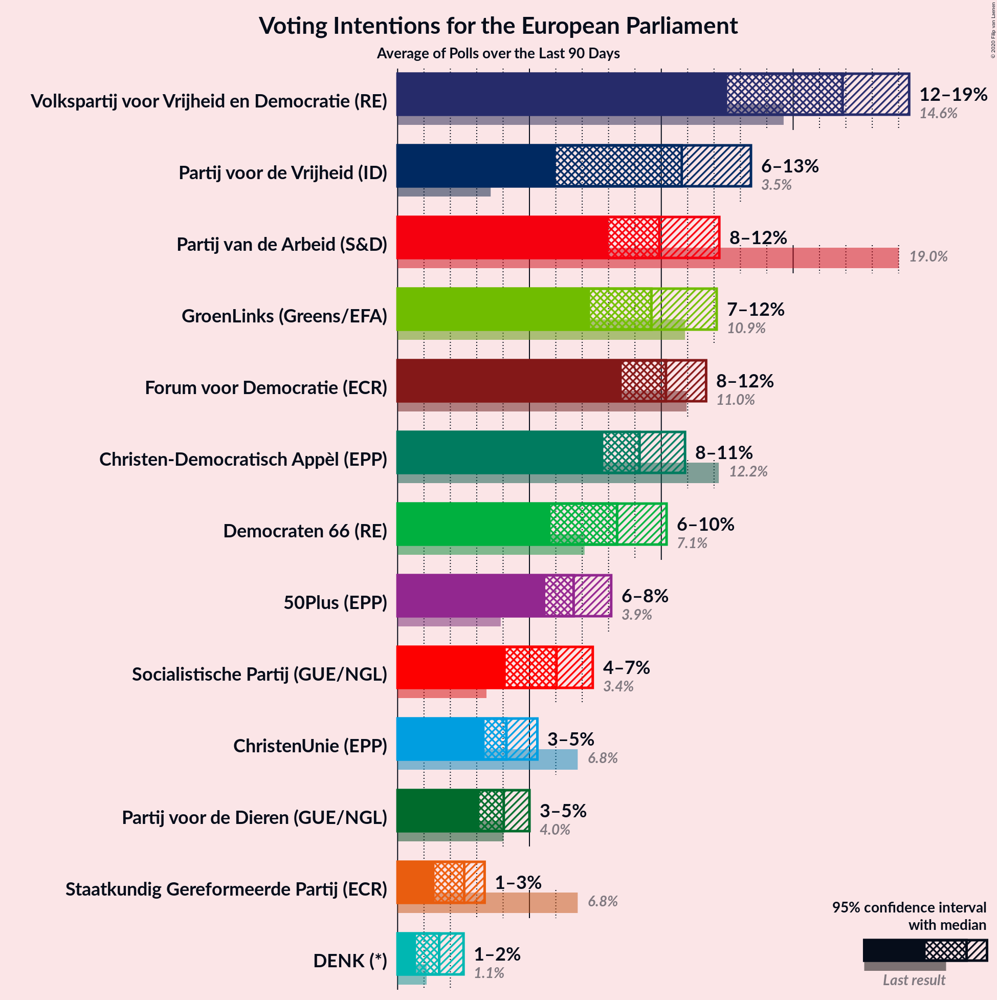
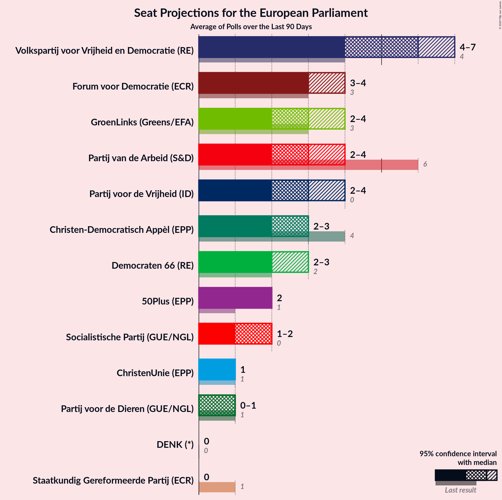
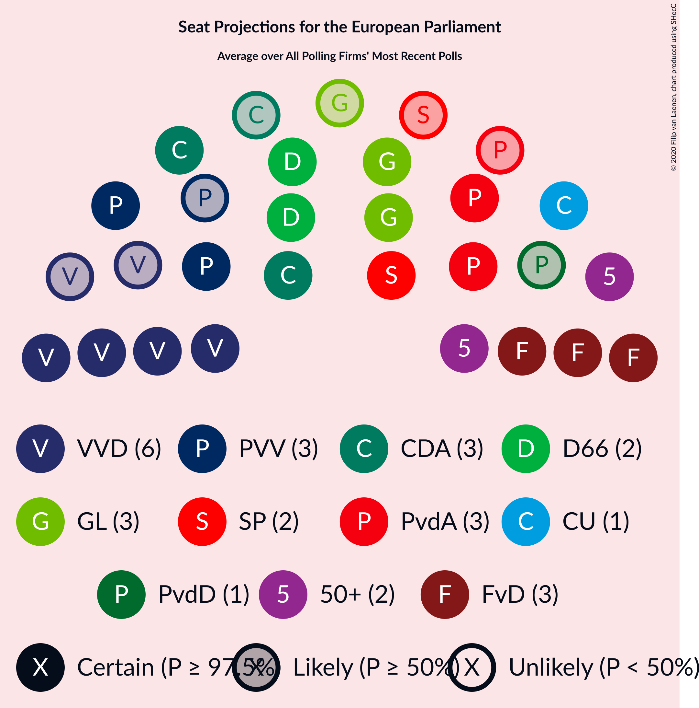

# Poll Average

<a href="#voting-intentions">Voting Intentions</a> | <a href="#seats">Seats</a> | <a href="#coalitions">Coalitions</a> | <a href="#technical-information">Technical Information</a>

## Summary

The table below lists the polls on which the average is based. They are the most recent polls (less than 90 days old) registered and analyzed so far.

| Period     | Polling firm/Commissioner(s) | PvdA | VVD | CDA | FvD | GL | D66 | CU | SGP | PvdD | 50+ | PVV | SP | DENK | PP | B1 |
|:----------:|:----------------------------:|:--:|:--:|:--:|:--:|:--:|:--:|:--:|:--:|:--:|:--:|:--:|:--:|:--:|:--:|:--:|
| 23 May 2019 | General Election | 19.0%   6 | 14.6%   4 | 12.2%   4 | 11.0%   3 | 10.9%   3 | 7.1%   2 | 6.8%   1 | 6.8%   1 | 4.0%   1 | 3.9%   1 | 3.5%   0 | 3.4%   0 | 1.1%   0 | 0.2%   0 | 0.0%   0 |
| N/A | Poll Average | 8–12%   2–4 | 12–19%   4–7 | 8–11%   2–3 | 8–12%   3–4 | 7–12%   2–4 | 6–10%   2–3 | 3–5%   1 | 1–3%   0 | 3–5%   0–1 | 6–8%   2 | 6–13%   2–4 | 4–7%   1–2 | 1–2%   0 | N/A   N/A | N/A   N/A |
| [5–10 March 2020](2020-03-10-IOResearch.html) | I&O Research | 8–11%   3 | 16–20%   6 | 8–11%   3 | 9–11%   3 | 10–12%   3–4 | 6–8%   2 | 3–5%   1 | 2–3%   0 | 3–5%   1 | 6–8%   2 | 10–12%   3–4 | 5–7%   1–2 | 1%   0 | N/A   N/A | N/A   N/A |
| [1–6 March 2020](2020-03-06-Peilnl.html) | Peil.nl | 10–13%   3–4 | 12–15%   4–5 | 8–10%   2–3 | 10–12%   3–4 | 7–9%   2–3 | 8–10%   3 | 3–5%   0–1 | 2–3%   0 | 3–5%   1 | 6–8%   2 | 6–8%   2 | 6–8%   2 | 2–3%   0 | N/A   N/A | N/A   N/A |
| [21–24 February 2020](2020-02-24-Ipsos.html) | Ipsos   EenVandaag | 8–11%   2–3 | 15–19%   5–7 | 8–11%   2–4 | 8–12%   2–4 | 8–12%   3 | 7–10%   2–3 | 3–6%   1–2 | 1–3%   0 | 3–5%   0–1 | 5–9%   2 | 10–14%   3–4 | 4–6%   1–2 | 1–3%   0 | N/A   N/A | N/A   N/A |
| 23 May 2019 | General Election | 19.0%   6 | 14.6%   4 | 12.2%   4 | 11.0%   3 | 10.9%   3 | 7.1%   2 | 6.8%   1 | 6.8%   1 | 4.0%   1 | 3.9%   1 | 3.5%   0 | 3.4%   0 | 1.1%   0 | 0.2%   0 | 0.0%   0 |

Only polls for which at least the sample size has been published are included in the table above.

**Legend:**
+ **Top half of each row:** Voting intentions (95% confidence interval)
+ **Bottom half of each row:** Seat projections for the European Parliament (95% confidence interval)
+ **PvdA:** Partij van de Arbeid (S&D)
+ **VVD:** Volkspartij voor Vrijheid en Democratie (RE)
+ **CDA:** Christen-Democratisch Appèl (EPP)
+ **FvD:** Forum voor Democratie (ECR)
+ **GL:** GroenLinks (Greens/EFA)
+ **D66:** Democraten 66 (RE)
+ **CU:** ChristenUnie (EPP)
+ **SGP:** Staatkundig Gereformeerde Partij (ECR)
+ **PvdD:** Partij voor de Dieren (GUE/NGL)
+ **50+:** 50Plus (EPP)
+ **PVV:** Partij voor de Vrijheid (ID)
+ **SP:** Socialistische Partij (GUE/NGL)
+ **DENK:** DENK (*)
+ **PP:** Piratenpartij (*)
+ **B1:** Bij1 (*)
+ **N/A (single party):** Party not included the published results
+ **N/A (entire row):** Calculation for this opinion poll not started yet

## Voting Intentions

### Confidence Intervals

| Party | Last Result | Median | 80% Confidence Interval | 90% Confidence Interval | 95% Confidence Interval | 99% Confidence Interval |
|:-----:|:-----------:|:------:|:-----------------------:|:-----------------------:|:-----------------------:|:-----------------------:|
| <a href="#partij-van-de-arbeid-(s&d)">Partij van de Arbeid (S&D)</a> | 19.0% | 9.9% | 8.6–11.7% |8.3–12.0% | 8.0–12.2% | 7.4–12.7% |
| <a href="#volkspartij-voor-vrijheid-en-democratie-(re)">Volkspartij voor Vrijheid en Democratie (RE)</a> | 14.6% | 16.9% | 13.0–18.7% |12.7–19.1% | 12.5–19.4% | 12.0–20.1% |
| <a href="#christen-democratisch-appèl-(epp)">Christen-Democratisch Appèl (EPP)</a> | 12.2% | 9.2% | 8.2–10.3% |8.0–10.6% | 7.8–10.9% | 7.4–11.5% |
| <a href="#forum-voor-democratie-(ecr)">Forum voor Democratie (ECR)</a> | 11.0% | 10.2% | 9.1–11.2% |8.8–11.5% | 8.5–11.7% | 7.9–12.2% |
| <a href="#groenlinks-(greens/efa)">GroenLinks (Greens/EFA)</a> | 10.9% | 9.6% | 7.8–11.5% |7.5–11.9% | 7.3–12.1% | 7.0–12.7% |
| <a href="#democraten-66-(re)">Democraten 66 (RE)</a> | 7.1% | 8.3% | 6.3–9.7% |6.0–10.0% | 5.8–10.2% | 5.4–10.7% |
| <a href="#christenunie-(epp)">ChristenUnie (EPP)</a> | 6.8% | 4.1% | 3.6–4.8% |3.4–5.1% | 3.3–5.3% | 3.0–5.8% |
| <a href="#staatkundig-gereformeerde-partij-(ecr)">Staatkundig Gereformeerde Partij (ECR)</a> | 6.8% | 2.5% | 1.8–3.0% |1.6–3.2% | 1.4–3.3% | 1.2–3.5% |
| <a href="#partij-voor-de-dieren-(gue/ngl)">Partij voor de Dieren (GUE/NGL)</a> | 4.0% | 4.0% | 3.4–4.6% |3.3–4.8% | 3.1–5.0% | 2.8–5.4% |
| <a href="#50plus-(epp)">50Plus (EPP)</a> | 3.9% | 6.7% | 6.0–7.5% |5.8–7.8% | 5.6–8.1% | 5.2–8.7% |
| <a href="#partij-voor-de-vrijheid-(id)">Partij voor de Vrijheid (ID)</a> | 3.5% | 10.8% | 6.5–12.5% |6.2–13.0% | 6.0–13.4% | 5.7–14.2% |
| <a href="#socialistische-partij-(gue/ngl)">Socialistische Partij (GUE/NGL)</a> | 3.4% | 6.0% | 4.7–7.0% |4.3–7.2% | 4.1–7.4% | 3.7–7.7% |
| <a href="#denk-(*)">DENK (*)</a> | 1.1% | 1.6% | 0.8–2.2% |0.7–2.4% | 0.7–2.5% | 0.6–2.7% |
| <a href="#piratenpartij-(*)">Piratenpartij (*)</a> | 0.2% | N/A | N/A |N/A | N/A | N/A |
| <a href="#bij1-(*)">Bij1 (*)</a> | 0.0% | N/A | N/A |N/A | N/A | N/A |

### Partij van de Arbeid (S&D)

*For a full overview of the results for this party, see the [Partij van de Arbeid (S&D)](party-partijvandearbeidsd.html) page.*

| Voting Intentions | Probability | Accumulated | Special Marks |
|:-----------------:|:-----------:|:-----------:|:-------------:|
| 5.5–6.5% | 0% | 100% |  |
| 6.5–7.5% | 0.7% | 100% |  |
| 7.5–8.5% | 8% | 99.3% |  |
| 8.5–9.5% | 29% | 91% |  |
| 9.5–10.5% | 26% | 62% | Median |
| 10.5–11.5% | 23% | 35% |  |
| 11.5–12.5% | 12% | 12% |  |
| 12.5–13.5% | 0.8% | 0.8% |  |
| 13.5–14.5% | 0% | 0% |  |
| 14.5–15.5% | 0% | 0% |  |
| 15.5–16.5% | 0% | 0% |  |
| 16.5–17.5% | 0% | 0% |  |
| 17.5–18.5% | 0% | 0% |  |
| 18.5–19.5% | 0% | 0% | Last Result |

### Volkspartij voor Vrijheid en Democratie (RE)

*For a full overview of the results for this party, see the [Volkspartij voor Vrijheid en Democratie (RE)](party-volkspartijvoorvrijheidendemocratiere.html) page.*

| Voting Intentions | Probability | Accumulated | Special Marks |
|:-----------------:|:-----------:|:-----------:|:-------------:|
| 10.5–11.5% | 0% | 100% |  |
| 11.5–12.5% | 3% | 100% |  |
| 12.5–13.5% | 18% | 97% |  |
| 13.5–14.5% | 12% | 79% |  |
| 14.5–15.5% | 3% | 67% | Last Result |
| 15.5–16.5% | 9% | 64% |  |
| 16.5–17.5% | 19% | 55% | Median |
| 17.5–18.5% | 23% | 36% |  |
| 18.5–19.5% | 11% | 12% |  |
| 19.5–20.5% | 2% | 2% |  |
| 20.5–21.5% | 0.1% | 0.1% |  |
| 21.5–22.5% | 0% | 0% |  |

### Christen-Democratisch Appèl (EPP)

*For a full overview of the results for this party, see the [Christen-Democratisch Appèl (EPP)](party-christen-democratischappèlepp.html) page.*

| Voting Intentions | Probability | Accumulated | Special Marks |
|:-----------------:|:-----------:|:-----------:|:-------------:|
| 5.5–6.5% | 0% | 100% |  |
| 6.5–7.5% | 0.9% | 100% |  |
| 7.5–8.5% | 20% | 99.1% |  |
| 8.5–9.5% | 46% | 79% | Median |
| 9.5–10.5% | 27% | 33% |  |
| 10.5–11.5% | 6% | 6% |  |
| 11.5–12.5% | 0.4% | 0.4% | Last Result |
| 12.5–13.5% | 0% | 0% |  |

### Forum voor Democratie (ECR)

*For a full overview of the results for this party, see the [Forum voor Democratie (ECR)](party-forumvoordemocratieecr.html) page.*

| Voting Intentions | Probability | Accumulated | Special Marks |
|:-----------------:|:-----------:|:-----------:|:-------------:|
| 5.5–6.5% | 0% | 100% |  |
| 6.5–7.5% | 0.1% | 100% |  |
| 7.5–8.5% | 3% | 99.9% |  |
| 8.5–9.5% | 21% | 97% |  |
| 9.5–10.5% | 44% | 76% | Median |
| 10.5–11.5% | 28% | 32% | Last Result |
| 11.5–12.5% | 4% | 4% |  |
| 12.5–13.5% | 0.1% | 0.1% |  |
| 13.5–14.5% | 0% | 0% |  |

### GroenLinks (Greens/EFA)

*For a full overview of the results for this party, see the [GroenLinks (Greens/EFA)](party-groenlinksgreensefa.html) page.*

| Voting Intentions | Probability | Accumulated | Special Marks |
|:-----------------:|:-----------:|:-----------:|:-------------:|
| 5.5–6.5% | 0% | 100% |  |
| 6.5–7.5% | 6% | 100% |  |
| 7.5–8.5% | 26% | 94% |  |
| 8.5–9.5% | 17% | 68% |  |
| 9.5–10.5% | 19% | 51% | Median |
| 10.5–11.5% | 23% | 33% | Last Result |
| 11.5–12.5% | 9% | 10% |  |
| 12.5–13.5% | 0.7% | 0.8% |  |
| 13.5–14.5% | 0% | 0% |  |

### Democraten 66 (RE)

*For a full overview of the results for this party, see the [Democraten 66 (RE)](party-democraten66re.html) page.*

| Voting Intentions | Probability | Accumulated | Special Marks |
|:-----------------:|:-----------:|:-----------:|:-------------:|
| 3.5–4.5% | 0% | 100% |  |
| 4.5–5.5% | 0.8% | 100% |  |
| 5.5–6.5% | 17% | 99.2% |  |
| 6.5–7.5% | 20% | 83% | Last Result |
| 7.5–8.5% | 17% | 63% | Median |
| 8.5–9.5% | 31% | 46% |  |
| 9.5–10.5% | 14% | 15% |  |
| 10.5–11.5% | 0.8% | 0.8% |  |
| 11.5–12.5% | 0% | 0% |  |

### ChristenUnie (EPP)

*For a full overview of the results for this party, see the [ChristenUnie (EPP)](party-christenunieepp.html) page.*

| Voting Intentions | Probability | Accumulated | Special Marks |
|:-----------------:|:-----------:|:-----------:|:-------------:|
| 1.5–2.5% | 0% | 100% |  |
| 2.5–3.5% | 9% | 100% |  |
| 3.5–4.5% | 71% | 91% | Median |
| 4.5–5.5% | 18% | 20% |  |
| 5.5–6.5% | 1.3% | 1.3% |  |
| 6.5–7.5% | 0% | 0% | Last Result |

### Staatkundig Gereformeerde Partij (ECR)

*For a full overview of the results for this party, see the [Staatkundig Gereformeerde Partij (ECR)](party-staatkundiggereformeerdepartijecr.html) page.*

| Voting Intentions | Probability | Accumulated | Special Marks |
|:-----------------:|:-----------:|:-----------:|:-------------:|
| 0.0–0.5% | 0% | 100% |  |
| 0.5–1.5% | 4% | 100% |  |
| 1.5–2.5% | 48% | 96% |  |
| 2.5–3.5% | 47% | 48% | Median |
| 3.5–4.5% | 0.5% | 0.5% |  |
| 4.5–5.5% | 0% | 0% |  |
| 5.5–6.5% | 0% | 0% |  |
| 6.5–7.5% | 0% | 0% | Last Result |

### Partij voor de Dieren (GUE/NGL)

*For a full overview of the results for this party, see the [Partij voor de Dieren (GUE/NGL)](party-partijvoordedierenguengl.html) page.*

| Voting Intentions | Probability | Accumulated | Special Marks |
|:-----------------:|:-----------:|:-----------:|:-------------:|
| 0.5–1.5% | 0% | 100% |  |
| 1.5–2.5% | 0.1% | 100% |  |
| 2.5–3.5% | 15% | 99.9% |  |
| 3.5–4.5% | 73% | 85% | Last Result, Median |
| 4.5–5.5% | 11% | 12% |  |
| 5.5–6.5% | 0.3% | 0.3% |  |
| 6.5–7.5% | 0% | 0% |  |

### 50Plus (EPP)

*For a full overview of the results for this party, see the [50Plus (EPP)](party-50plusepp.html) page.*

| Voting Intentions | Probability | Accumulated | Special Marks |
|:-----------------:|:-----------:|:-----------:|:-------------:|
| 3.5–4.5% | 0% | 100% | Last Result |
| 4.5–5.5% | 2% | 100% |  |
| 5.5–6.5% | 37% | 98% |  |
| 6.5–7.5% | 51% | 61% | Median |
| 7.5–8.5% | 9% | 9% |  |
| 8.5–9.5% | 0.7% | 0.7% |  |
| 9.5–10.5% | 0% | 0% |  |

### Partij voor de Vrijheid (ID)

*For a full overview of the results for this party, see the [Partij voor de Vrijheid (ID)](party-partijvoordevrijheidid.html) page.*

| Voting Intentions | Probability | Accumulated | Special Marks |
|:-----------------:|:-----------:|:-----------:|:-------------:|
| 3.5–4.5% | 0% | 100% | Last Result |
| 4.5–5.5% | 0.1% | 100% |  |
| 5.5–6.5% | 13% | 99.9% |  |
| 6.5–7.5% | 19% | 87% |  |
| 7.5–8.5% | 1.2% | 68% |  |
| 8.5–9.5% | 0.6% | 67% |  |
| 9.5–10.5% | 10% | 66% |  |
| 10.5–11.5% | 28% | 56% | Median |
| 11.5–12.5% | 19% | 28% |  |
| 12.5–13.5% | 7% | 9% |  |
| 13.5–14.5% | 2% | 2% |  |
| 14.5–15.5% | 0.2% | 0.2% |  |
| 15.5–16.5% | 0% | 0% |  |

### Socialistische Partij (GUE/NGL)

*For a full overview of the results for this party, see the [Socialistische Partij (GUE/NGL)](party-socialistischepartijguengl.html) page.*

| Voting Intentions | Probability | Accumulated | Special Marks |
|:-----------------:|:-----------:|:-----------:|:-------------:|
| 1.5–2.5% | 0% | 100% |  |
| 2.5–3.5% | 0.3% | 100% | Last Result |
| 3.5–4.5% | 8% | 99.7% |  |
| 4.5–5.5% | 23% | 92% |  |
| 5.5–6.5% | 42% | 68% | Median |
| 6.5–7.5% | 25% | 26% |  |
| 7.5–8.5% | 1.3% | 1.3% |  |
| 8.5–9.5% | 0% | 0% |  |

### DENK (*)

*For a full overview of the results for this party, see the [DENK (*)](party-denk.html) page.*

| Voting Intentions | Probability | Accumulated | Special Marks |
|:-----------------:|:-----------:|:-----------:|:-------------:|
| 0.0–0.5% | 0.4% | 100% |  |
| 0.5–1.5% | 48% | 99.6% | Last Result |
| 1.5–2.5% | 50% | 51% | Median |
| 2.5–3.5% | 2% | 2% |  |
| 3.5–4.5% | 0% | 0% |  |

## Seats

### Confidence Intervals

| Party | Last Result | Median | 80% Confidence Interval | 90% Confidence Interval | 95% Confidence Interval | 99% Confidence Interval |
|:-----:|:-----------:|:------:|:-----------------------:|:-----------------------:|:-----------------------:|:-----------------------:|
| <a href="#partij-van-de-arbeid-(s&d)">Partij van de Arbeid (S&D)</a> | 6 | 3 | 3–4 |3–4 | 2–4 | 2–4 |
| <a href="#volkspartij-voor-vrijheid-en-democratie-(re)">Volkspartij voor Vrijheid en Democratie (RE)</a> | 4 | 6 | 4–6 |4–6 | 4–7 | 4–7 |
| <a href="#christen-democratisch-appèl-(epp)">Christen-Democratisch Appèl (EPP)</a> | 4 | 3 | 3 |2–3 | 2–3 | 2–4 |
| <a href="#forum-voor-democratie-(ecr)">Forum voor Democratie (ECR)</a> | 3 | 3 | 3 |3–4 | 3–4 | 2–4 |
| <a href="#groenlinks-(greens/efa)">GroenLinks (Greens/EFA)</a> | 3 | 3 | 2–3 |2–3 | 2–4 | 2–4 |
| <a href="#democraten-66-(re)">Democraten 66 (RE)</a> | 2 | 2 | 2–3 |2–3 | 2–3 | 2–3 |
| <a href="#christenunie-(epp)">ChristenUnie (EPP)</a> | 1 | 1 | 1 |1 | 1 | 0–2 |
| <a href="#staatkundig-gereformeerde-partij-(ecr)">Staatkundig Gereformeerde Partij (ECR)</a> | 1 | 0 | 0 |0 | 0 | 0 |
| <a href="#partij-voor-de-dieren-(gue/ngl)">Partij voor de Dieren (GUE/NGL)</a> | 1 | 1 | 1 |1 | 0–1 | 0–1 |
| <a href="#50plus-(epp)">50Plus (EPP)</a> | 1 | 2 | 2 |2 | 2 | 1–2 |
| <a href="#partij-voor-de-vrijheid-(id)">Partij voor de Vrijheid (ID)</a> | 0 | 3 | 2–4 |2–4 | 2–4 | 2–5 |
| <a href="#socialistische-partij-(gue/ngl)">Socialistische Partij (GUE/NGL)</a> | 0 | 2 | 1–2 |1–2 | 1–2 | 1–2 |
| <a href="#denk-(*)">DENK (*)</a> | 0 | 0 | 0 |0 | 0 | 0 |
| <a href="#piratenpartij-(*)">Piratenpartij (*)</a> | 0 | N/A | N/A |N/A | N/A | N/A |
| <a href="#bij1-(*)">Bij1 (*)</a> | 0 | N/A | N/A |N/A | N/A | N/A |

