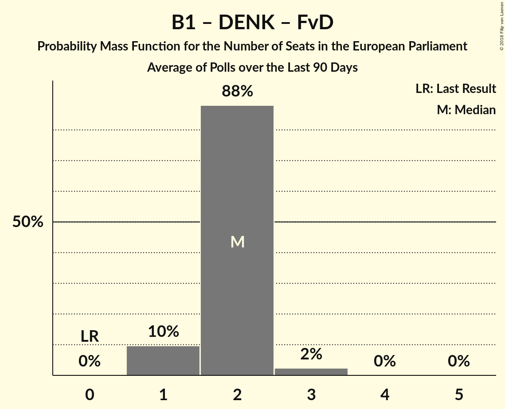
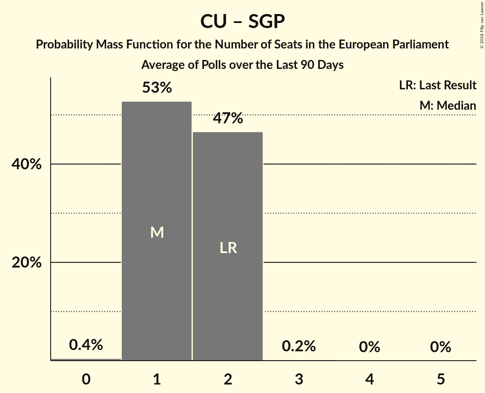

# Poll Average

<a href="#voting-intentions">Voting Intentions</a> | <a href="#seats">Seats</a> | <a href="#coalitions">Coalitions</a> | <a href="#technical-information">Technical Information</a>

## Summary

The table below lists the polls on which the average is based. They are the most recent polls (less than 90 days old) registered and analyzed so far.

| Period     | Polling firm/Commissioner(s) | D66 | CDA | PVV | VVD | SP | PvdA | CU | SGP | GL | PvdD | 50+ | PP | DENK | FvD | B1 |
|:----------:|:----------------------------:|:--:|:--:|:--:|:--:|:--:|:--:|:--:|:--:|:--:|:--:|:--:|:--:|:--:|:--:|:--:|
| 22 May 2014 | General Election | 15.5%   4 | 15.2%   5 | 13.3%   4 | 12.0%   3 | 9.6%   2 | 9.4%   3 | 7.7%   1 | 7.7%   1 | 7.0%   2 | 4.2%   1 | 3.7%   0 | 0.8%   0 | 0.0%   0 | 0.0%   0 | 0.0%   0 |
| N/A | Poll Average | 7–10%   2–3 | 8–12%   2–4 | 9–16%   3–5 | 16–22%   5–7 | 6–11%   2–3 | 6–8%   2–3 | 4–7%   1–2 | 1–3%   0–1 | 9–14%   3–5 | 3–5%   0–1 | 3–6%   0–1 | N/A   N/A | 1–3%   0 | 5–9%   1–3 | N/A   N/A |
| [26–29 October 2018](2018-10-29-Ipsos.html) | Ipsos   EenVandaag | 7–10%   2–3 | 8–12%   2–4 | 12–17%   4–6 | 18–23%   6–8 | 6–9%   2–3 | 5–9%   1–3 | 3–6%   0–2 | 1–3%   0 | 9–12%   3–4 | 3–5%   0–1 | 3–6%   0–2 | N/A   N/A | 1–3%   0 | 5–8%   1–3 | N/A   N/A |
| [13–16 September 2018](2018-09-16-KantarPublic.html) | Kantar Public | 6–10%   2 | 8–11%   3 | 11–16%   4–5 | 16–20%   5–6 | 8–11%   3 | 5–8%   2 | 5–8%   2 | 1–3%   0 | 11–15%   3–4 | 3–5%   0–1 | 2–5%   0–1 | N/A   N/A | 1–2%   0 | 5–8%   1–2 | N/A   N/A |
| [7–11 September 2018](2018-09-11-IOResearch.html) | I&O Research | 8–10%   2–3 | 8–11%   2–4 | 8–11%   2–4 | 15–19%   5–7 | 8–10%   2–3 | 6–9%   2–3 | 4–6%   1–2 | 2–4%   0–1 | 11–14%   4–5 | 4–5%   1 | 3–4%   0–1 | N/A   N/A | 2–3%   0 | 7–9%   2–3 | N/A   N/A |
| 22 May 2014 | General Election | 15.5%   4 | 15.2%   5 | 13.3%   4 | 12.0%   3 | 9.6%   2 | 9.4%   3 | 7.7%   1 | 7.7%   1 | 7.0%   2 | 4.2%   1 | 3.7%   0 | 0.8%   0 | 0.0%   0 | 0.0%   0 | 0.0%   0 |

Only polls for which at least the sample size has been published are included in the table above.

**Legend:**
+ **Top half of each row:** Voting intentions (95% confidence interval)
+ **Bottom half of each row:** Seat projections for the European Parliament (95% confidence interval)
+ **D66:** Democraten 66 (ALDE)
+ **CDA:** Christen-Democratisch Appèl (EPP)
+ **PVV:** Partij voor de Vrijheid (ENF)
+ **VVD:** Volkspartij voor Vrijheid en Democratie (ALDE)
+ **SP:** Socialistische Partij (GUE/NGL)
+ **PvdA:** Partij van de Arbeid (S&D)
+ **CU:** ChristenUnie (ECR)
+ **SGP:** Staatkundig Gereformeerde Partij (ECR)
+ **GL:** GroenLinks (Greens/EFA)
+ **PvdD:** Partij voor de Dieren (GUE/NGL)
+ **50+:** 50Plus (ALDE)
+ **PP:** Piratenpartij (Greens/EFA)
+ **DENK:** Denk (*)
+ **FvD:** Forum voor Democratie (*)
+ **B1:** Bij1 (*)
+ **N/A (single party):** Party not included the published results
+ **N/A (entire row):** Calculation for this opinion poll not started yet

## Voting Intentions

### Confidence Intervals

| Party | Last Result | Median | 80% Confidence Interval | 90% Confidence Interval | 95% Confidence Interval | 99% Confidence Interval |
|:-----:|:-----------:|:------:|:-----------------------:|:-----------------------:|:-----------------------:|:-----------------------:|
| <a href="#democraten-66-(alde)">Democraten 66 (ALDE)</a> | 15.5% | 8.4% | 7.3–9.5% |7.0–9.8% | 6.7–10.1% | 6.2–10.6% |
| <a href="#christen-democratisch-appèl-(epp)">Christen-Democratisch Appèl (EPP)</a> | 15.2% | 9.7% | 8.6–10.8% |8.3–11.2% | 8.0–11.5% | 7.5–12.2% |
| <a href="#partij-voor-de-vrijheid-(enf)">Partij voor de Vrijheid (ENF)</a> | 13.3% | 13.1% | 9.3–15.1% |9.0–15.6% | 8.8–16.0% | 8.3–16.8% |
| <a href="#volkspartij-voor-vrijheid-en-democratie-(alde)">Volkspartij voor Vrijheid en Democratie (ALDE)</a> | 12.0% | 18.2% | 16.4–20.9% |16.0–21.5% | 15.7–22.0% | 15.1–23.0% |
| <a href="#socialistische-partij-(gue/ngl)">Socialistische Partij (GUE/NGL)</a> | 9.6% | 8.6% | 6.7–10.0% |6.3–10.4% | 6.0–10.8% | 5.4–11.5% |
| <a href="#partij-van-de-arbeid-(s&d)">Partij van de Arbeid (S&D)</a> | 9.4% | 7.0% | 6.0–8.0% |5.7–8.3% | 5.5–8.5% | 5.0–9.0% |
| <a href="#christenunie-(ecr)">ChristenUnie (ECR)</a> | 7.7% | 5.1% | 4.1–6.4% |3.8–6.8% | 3.6–7.1% | 3.2–7.8% |
| <a href="#staatkundig-gereformeerde-partij-(ecr)">Staatkundig Gereformeerde Partij (ECR)</a> | 7.7% | 2.3% | 1.6–3.0% |1.4–3.2% | 1.3–3.3% | 1.1–3.7% |
| <a href="#groenlinks-(greens/efa)">GroenLinks (Greens/EFA)</a> | 7.0% | 12.2% | 9.9–13.6% |9.5–14.0% | 9.1–14.4% | 8.5–15.1% |
| <a href="#partij-voor-de-dieren-(gue/ngl)">Partij voor de Dieren (GUE/NGL)</a> | 4.2% | 4.2% | 3.4–4.9% |3.2–5.2% | 3.0–5.4% | 2.7–5.8% |
| <a href="#50plus-(alde)">50Plus (ALDE)</a> | 3.7% | 3.7% | 2.9–4.9% |2.8–5.2% | 2.6–5.5% | 2.3–6.1% |
| <a href="#piratenpartij-(greens/efa)">Piratenpartij (Greens/EFA)</a> | 0.8% | N/A | N/A |N/A | N/A | N/A |
| <a href="#denk-(*)">Denk (*)</a> | 0.0% | 1.8% | 1.2–2.5% |1.0–2.7% | 0.9–2.8% | 0.8–3.1% |
| <a href="#forum-voor-democratie-(*)">Forum voor Democratie (*)</a> | 0.0% | 6.7% | 5.4–8.4% |5.1–8.7% | 4.9–8.9% | 4.5–9.4% |
| <a href="#bij1-(*)">Bij1 (*)</a> | 0.0% | N/A | N/A |N/A | N/A | N/A |

### Democraten 66 (ALDE)

*For a full overview of the results for this party, see the [Democraten 66 (ALDE)](party-democraten66alde.html) page.*

| Voting Intentions | Probability | Accumulated | Special Marks |
|:-----------------:|:-----------:|:-----------:|:-------------:|
| 4.5–5.5% | 0% | 100% |  |
| 5.5–6.5% | 2% | 100% |  |
| 6.5–7.5% | 15% | 98% |  |
| 7.5–8.5% | 39% | 84% | Median |
| 8.5–9.5% | 36% | 45% |  |
| 9.5–10.5% | 8% | 9% |  |
| 10.5–11.5% | 0.5% | 0.5% |  |
| 11.5–12.5% | 0% | 0% |  |
| 12.5–13.5% | 0% | 0% |  |
| 13.5–14.5% | 0% | 0% |  |
| 14.5–15.5% | 0% | 0% | Last Result |

### Christen-Democratisch Appèl (EPP)

*For a full overview of the results for this party, see the [Christen-Democratisch Appèl (EPP)](party-christen-democratischappèlepp.html) page.*

| Voting Intentions | Probability | Accumulated | Special Marks |
|:-----------------:|:-----------:|:-----------:|:-------------:|
| 5.5–6.5% | 0% | 100% |  |
| 6.5–7.5% | 0.6% | 100% |  |
| 7.5–8.5% | 9% | 99.4% |  |
| 8.5–9.5% | 36% | 91% |  |
| 9.5–10.5% | 39% | 54% | Median |
| 10.5–11.5% | 13% | 16% |  |
| 11.5–12.5% | 2% | 2% |  |
| 12.5–13.5% | 0.2% | 0.2% |  |
| 13.5–14.5% | 0% | 0% |  |
| 14.5–15.5% | 0% | 0% | Last Result |

### Partij voor de Vrijheid (ENF)

*For a full overview of the results for this party, see the [Partij voor de Vrijheid (ENF)](party-partijvoordevrijheidenf.html) page.*

| Voting Intentions | Probability | Accumulated | Special Marks |
|:-----------------:|:-----------:|:-----------:|:-------------:|
| 6.5–7.5% | 0% | 100% |  |
| 7.5–8.5% | 1.3% | 100% |  |
| 8.5–9.5% | 13% | 98.7% |  |
| 9.5–10.5% | 16% | 86% |  |
| 10.5–11.5% | 4% | 70% |  |
| 11.5–12.5% | 7% | 66% |  |
| 12.5–13.5% | 18% | 58% | Last Result, Median |
| 13.5–14.5% | 22% | 40% |  |
| 14.5–15.5% | 13% | 18% |  |
| 15.5–16.5% | 4% | 5% |  |
| 16.5–17.5% | 0.8% | 0.8% |  |
| 17.5–18.5% | 0.1% | 0.1% |  |
| 18.5–19.5% | 0% | 0% |  |

### Volkspartij voor Vrijheid en Democratie (ALDE)

*For a full overview of the results for this party, see the [Volkspartij voor Vrijheid en Democratie (ALDE)](party-volkspartijvoorvrijheidendemocratiealde.html) page.*

| Voting Intentions | Probability | Accumulated | Special Marks |
|:-----------------:|:-----------:|:-----------:|:-------------:|
| 11.5–12.5% | 0% | 100% | Last Result |
| 12.5–13.5% | 0% | 100% |  |
| 13.5–14.5% | 0.1% | 100% |  |
| 14.5–15.5% | 2% | 99.9% |  |
| 15.5–16.5% | 11% | 98% |  |
| 16.5–17.5% | 23% | 88% |  |
| 17.5–18.5% | 22% | 64% | Median |
| 18.5–19.5% | 16% | 43% |  |
| 19.5–20.5% | 13% | 27% |  |
| 20.5–21.5% | 9% | 14% |  |
| 21.5–22.5% | 4% | 5% |  |
| 22.5–23.5% | 0.9% | 1.1% |  |
| 23.5–24.5% | 0.2% | 0.2% |  |
| 24.5–25.5% | 0% | 0% |  |

### Socialistische Partij (GUE/NGL)

*For a full overview of the results for this party, see the [Socialistische Partij (GUE/NGL)](party-socialistischepartijguengl.html) page.*

| Voting Intentions | Probability | Accumulated | Special Marks |
|:-----------------:|:-----------:|:-----------:|:-------------:|
| 3.5–4.5% | 0% | 100% |  |
| 4.5–5.5% | 0.7% | 100% |  |
| 5.5–6.5% | 8% | 99.3% |  |
| 6.5–7.5% | 16% | 91% |  |
| 7.5–8.5% | 23% | 75% |  |
| 8.5–9.5% | 33% | 52% | Median |
| 9.5–10.5% | 15% | 19% | Last Result |
| 10.5–11.5% | 3% | 4% |  |
| 11.5–12.5% | 0.4% | 0.4% |  |
| 12.5–13.5% | 0% | 0% |  |

### Partij van de Arbeid (S&D)

*For a full overview of the results for this party, see the [Partij van de Arbeid (S&D)](party-partijvandearbeidsd.html) page.*

| Voting Intentions | Probability | Accumulated | Special Marks |
|:-----------------:|:-----------:|:-----------:|:-------------:|
| 3.5–4.5% | 0% | 100% |  |
| 4.5–5.5% | 3% | 100% |  |
| 5.5–6.5% | 25% | 97% |  |
| 6.5–7.5% | 47% | 72% | Median |
| 7.5–8.5% | 23% | 26% |  |
| 8.5–9.5% | 2% | 2% | Last Result |
| 9.5–10.5% | 0.1% | 0.1% |  |
| 10.5–11.5% | 0% | 0% |  |

### ChristenUnie (ECR)

*For a full overview of the results for this party, see the [ChristenUnie (ECR)](party-christenunieecr.html) page.*

| Voting Intentions | Probability | Accumulated | Special Marks |
|:-----------------:|:-----------:|:-----------:|:-------------:|
| 1.5–2.5% | 0% | 100% |  |
| 2.5–3.5% | 2% | 100% |  |
| 3.5–4.5% | 24% | 98% |  |
| 4.5–5.5% | 44% | 74% | Median |
| 5.5–6.5% | 22% | 30% |  |
| 6.5–7.5% | 7% | 8% |  |
| 7.5–8.5% | 0.9% | 0.9% | Last Result |
| 8.5–9.5% | 0% | 0% |  |

### Staatkundig Gereformeerde Partij (ECR)

*For a full overview of the results for this party, see the [Staatkundig Gereformeerde Partij (ECR)](party-staatkundiggereformeerdepartijecr.html) page.*

| Voting Intentions | Probability | Accumulated | Special Marks |
|:-----------------:|:-----------:|:-----------:|:-------------:|
| 0.0–0.5% | 0% | 100% |  |
| 0.5–1.5% | 9% | 100% |  |
| 1.5–2.5% | 59% | 91% | Median |
| 2.5–3.5% | 32% | 33% |  |
| 3.5–4.5% | 0.9% | 0.9% |  |
| 4.5–5.5% | 0% | 0% |  |
| 5.5–6.5% | 0% | 0% |  |
| 6.5–7.5% | 0% | 0% |  |
| 7.5–8.5% | 0% | 0% | Last Result |

### GroenLinks (Greens/EFA)

*For a full overview of the results for this party, see the [GroenLinks (Greens/EFA)](party-groenlinksgreensefa.html) page.*

| Voting Intentions | Probability | Accumulated | Special Marks |
|:-----------------:|:-----------:|:-----------:|:-------------:|
| 6.5–7.5% | 0% | 100% | Last Result |
| 7.5–8.5% | 0.6% | 100% |  |
| 8.5–9.5% | 5% | 99.3% |  |
| 9.5–10.5% | 13% | 94% |  |
| 10.5–11.5% | 16% | 81% |  |
| 11.5–12.5% | 26% | 65% | Median |
| 12.5–13.5% | 27% | 39% |  |
| 13.5–14.5% | 10% | 12% |  |
| 14.5–15.5% | 2% | 2% |  |
| 15.5–16.5% | 0.2% | 0.2% |  |
| 16.5–17.5% | 0% | 0% |  |

### Partij voor de Dieren (GUE/NGL)

*For a full overview of the results for this party, see the [Partij voor de Dieren (GUE/NGL)](party-partijvoordedierenguengl.html) page.*

| Voting Intentions | Probability | Accumulated | Special Marks |
|:-----------------:|:-----------:|:-----------:|:-------------:|
| 0.5–1.5% | 0% | 100% |  |
| 1.5–2.5% | 0.2% | 100% |  |
| 2.5–3.5% | 14% | 99.8% |  |
| 3.5–4.5% | 59% | 86% | Last Result, Median |
| 4.5–5.5% | 26% | 27% |  |
| 5.5–6.5% | 1.3% | 1.3% |  |
| 6.5–7.5% | 0% | 0% |  |

### 50Plus (ALDE)

*For a full overview of the results for this party, see the [50Plus (ALDE)](party-50plusalde.html) page.*

| Voting Intentions | Probability | Accumulated | Special Marks |
|:-----------------:|:-----------:|:-----------:|:-------------:|
| 0.5–1.5% | 0% | 100% |  |
| 1.5–2.5% | 2% | 100% |  |
| 2.5–3.5% | 41% | 98% |  |
| 3.5–4.5% | 40% | 57% | Last Result, Median |
| 4.5–5.5% | 15% | 17% |  |
| 5.5–6.5% | 2% | 2% |  |
| 6.5–7.5% | 0.1% | 0.1% |  |
| 7.5–8.5% | 0% | 0% |  |

### Denk (*)

*For a full overview of the results for this party, see the [Denk (*)](party-denk.html) page.*

| Voting Intentions | Probability | Accumulated | Special Marks |
|:-----------------:|:-----------:|:-----------:|:-------------:|
| 0.0–0.5% | 0% | 100% | Last Result |
| 0.5–1.5% | 33% | 100% |  |
| 1.5–2.5% | 59% | 67% | Median |
| 2.5–3.5% | 8% | 8% |  |
| 3.5–4.5% | 0% | 0% |  |

### Forum voor Democratie (*)

*For a full overview of the results for this party, see the [Forum voor Democratie (*)](party-forumvoordemocratie.html) page.*

| Voting Intentions | Probability | Accumulated | Special Marks |
|:-----------------:|:-----------:|:-----------:|:-------------:|
| 0.0–0.5% | 0% | 100% | Last Result |
| 0.5–1.5% | 0% | 100% |  |
| 1.5–2.5% | 0% | 100% |  |
| 2.5–3.5% | 0% | 100% |  |
| 3.5–4.5% | 0.7% | 100% |  |
| 4.5–5.5% | 12% | 99.3% |  |
| 5.5–6.5% | 32% | 87% |  |
| 6.5–7.5% | 25% | 55% | Median |
| 7.5–8.5% | 23% | 30% |  |
| 8.5–9.5% | 7% | 7% |  |
| 9.5–10.5% | 0.3% | 0.3% |  |
| 10.5–11.5% | 0% | 0% |  |

## Seats

### Confidence Intervals

| Party | Last Result | Median | 80% Confidence Interval | 90% Confidence Interval | 95% Confidence Interval | 99% Confidence Interval |
|:-----:|:-----------:|:------:|:-----------------------:|:-----------------------:|:-----------------------:|:-----------------------:|
| <a href="#democraten-66-(alde)">Democraten 66 (ALDE)</a> | 4 | 2 | 2–3 |2–3 | 2–3 | 2–3 |
| <a href="#christen-democratisch-appèl-(epp)">Christen-Democratisch Appèl (EPP)</a> | 5 | 3 | 3–4 |3–4 | 2–4 | 2–4 |
| <a href="#partij-voor-de-vrijheid-(enf)">Partij voor de Vrijheid (ENF)</a> | 4 | 5 | 3–5 |3–5 | 3–5 | 2–6 |
| <a href="#volkspartij-voor-vrijheid-en-democratie-(alde)">Volkspartij voor Vrijheid en Democratie (ALDE)</a> | 3 | 6 | 6–7 |6–7 | 5–7 | 5–8 |
| <a href="#socialistische-partij-(gue/ngl)">Socialistische Partij (GUE/NGL)</a> | 2 | 3 | 2–3 |2–3 | 2–3 | 2–3 |
| <a href="#partij-van-de-arbeid-(s&d)">Partij van de Arbeid (S&D)</a> | 3 | 2 | 2–3 |2–3 | 2–3 | 1–3 |
| <a href="#christenunie-(ecr)">ChristenUnie (ECR)</a> | 1 | 1 | 1–2 |1–2 | 1–2 | 0–2 |
| <a href="#staatkundig-gereformeerde-partij-(ecr)">Staatkundig Gereformeerde Partij (ECR)</a> | 1 | 0 | 0 |0 | 0–1 | 0–1 |
| <a href="#groenlinks-(greens/efa)">GroenLinks (Greens/EFA)</a> | 2 | 3 | 3–4 |3–4 | 3–5 | 3–5 |
| <a href="#partij-voor-de-dieren-(gue/ngl)">Partij voor de Dieren (GUE/NGL)</a> | 1 | 1 | 0–1 |0–1 | 0–1 | 0–2 |
| <a href="#50plus-(alde)">50Plus (ALDE)</a> | 0 | 1 | 0–1 |0–1 | 0–1 | 0–2 |
| <a href="#piratenpartij-(greens/efa)">Piratenpartij (Greens/EFA)</a> | 0 | N/A | N/A |N/A | N/A | N/A |
| <a href="#denk-(*)">Denk (*)</a> | 0 | 0 | 0 |0 | 0 | 0 |
| <a href="#forum-voor-democratie-(*)">Forum voor Democratie (*)</a> | 0 | 2 | 1–3 |1–3 | 1–3 | 1–3 |
| <a href="#bij1-(*)">Bij1 (*)</a> | 0 | N/A | N/A |N/A | N/A | N/A |

### Democraten 66 (ALDE)

*For a full overview of the results for this party, see the [Democraten 66 (ALDE)](party-democraten66alde.html) page.*

| Number of Seats | Probability | Accumulated | Special Marks |
|:---------------:|:-----------:|:-----------:|:-------------:|
| 2 | 68% | 100% | Median |
| 3 | 32% | 32% |  |
| 4 | 0.2% | 0.2% | Last Result |
| 5 | 0% | 0% |  |

### Christen-Democratisch Appèl (EPP)

*For a full overview of the results for this party, see the [Christen-Democratisch Appèl (EPP)](party-christen-democratischappèlepp.html) page.*

| Number of Seats | Probability | Accumulated | Special Marks |
|:---------------:|:-----------:|:-----------:|:-------------:|
| 2 | 5% | 100% |  |
| 3 | 84% | 95% | Median |
| 4 | 11% | 11% |  |
| 5 | 0% | 0% | Last Result |

### Partij voor de Vrijheid (ENF)

*For a full overview of the results for this party, see the [Partij voor de Vrijheid (ENF)](party-partijvoordevrijheidenf.html) page.*

| Number of Seats | Probability | Accumulated | Special Marks |
|:---------------:|:-----------:|:-----------:|:-------------:|
| 2 | 1.2% | 100% |  |
| 3 | 31% | 98.8% |  |
| 4 | 12% | 67% | Last Result |
| 5 | 53% | 55% | Median |
| 6 | 2% | 2% |  |
| 7 | 0% | 0% |  |

### Volkspartij voor Vrijheid en Democratie (ALDE)

*For a full overview of the results for this party, see the [Volkspartij voor Vrijheid en Democratie (ALDE)](party-volkspartijvoorvrijheidendemocratiealde.html) page.*

| Number of Seats | Probability | Accumulated | Special Marks |
|:---------------:|:-----------:|:-----------:|:-------------:|
| 3 | 0% | 100% | Last Result |
| 4 | 0% | 100% |  |
| 5 | 5% | 100% |  |
| 6 | 70% | 95% | Median |
| 7 | 24% | 25% |  |
| 8 | 1.0% | 1.0% |  |
| 9 | 0% | 0% |  |

### Socialistische Partij (GUE/NGL)

*For a full overview of the results for this party, see the [Socialistische Partij (GUE/NGL)](party-socialistischepartijguengl.html) page.*

| Number of Seats | Probability | Accumulated | Special Marks |
|:---------------:|:-----------:|:-----------:|:-------------:|
| 1 | 0.3% | 100% |  |
| 2 | 33% | 99.7% | Last Result |
| 3 | 67% | 67% | Median |
| 4 | 0.3% | 0.3% |  |
| 5 | 0% | 0% |  |

### Partij van de Arbeid (S&D)

*For a full overview of the results for this party, see the [Partij van de Arbeid (S&D)](party-partijvandearbeidsd.html) page.*

| Number of Seats | Probability | Accumulated | Special Marks |
|:---------------:|:-----------:|:-----------:|:-------------:|
| 1 | 2% | 100% |  |
| 2 | 85% | 98% | Median |
| 3 | 12% | 12% | Last Result |
| 4 | 0% | 0% |  |

### ChristenUnie (ECR)

*For a full overview of the results for this party, see the [ChristenUnie (ECR)](party-christenunieecr.html) page.*

| Number of Seats | Probability | Accumulated | Special Marks |
|:---------------:|:-----------:|:-----------:|:-------------:|
| 0 | 1.0% | 100% |  |
| 1 | 54% | 99.0% | Last Result, Median |
| 2 | 45% | 45% |  |
| 3 | 0% | 0% |  |

### Staatkundig Gereformeerde Partij (ECR)

*For a full overview of the results for this party, see the [Staatkundig Gereformeerde Partij (ECR)](party-staatkundiggereformeerdepartijecr.html) page.*

| Number of Seats | Probability | Accumulated | Special Marks |
|:---------------:|:-----------:|:-----------:|:-------------:|
| 0 | 96% | 100% | Median |
| 1 | 4% | 4% | Last Result |
| 2 | 0% | 0% |  |

### GroenLinks (Greens/EFA)

*For a full overview of the results for this party, see the [GroenLinks (Greens/EFA)](party-groenlinksgreensefa.html) page.*

| Number of Seats | Probability | Accumulated | Special Marks |
|:---------------:|:-----------:|:-----------:|:-------------:|
| 2 | 0.2% | 100% | Last Result |
| 3 | 53% | 99.8% | Median |
| 4 | 43% | 46% |  |
| 5 | 4% | 4% |  |
| 6 | 0% | 0% |  |

### Partij voor de Dieren (GUE/NGL)

*For a full overview of the results for this party, see the [Partij voor de Dieren (GUE/NGL)](party-partijvoordedierenguengl.html) page.*

| Number of Seats | Probability | Accumulated | Special Marks |
|:---------------:|:-----------:|:-----------:|:-------------:|
| 0 | 11% | 100% |  |
| 1 | 88% | 89% | Last Result, Median |
| 2 | 0.8% | 0.8% |  |
| 3 | 0% | 0% |  |

### 50Plus (ALDE)

*For a full overview of the results for this party, see the [50Plus (ALDE)](party-50plusalde.html) page.*

| Number of Seats | Probability | Accumulated | Special Marks |
|:---------------:|:-----------:|:-----------:|:-------------:|
| 0 | 25% | 100% | Last Result |
| 1 | 73% | 75% | Median |
| 2 | 2% | 2% |  |
| 3 | 0% | 0% |  |

### Denk (*)

*For a full overview of the results for this party, see the [Denk (*)](party-denk.html) page.*

| Number of Seats | Probability | Accumulated | Special Marks |
|:---------------:|:-----------:|:-----------:|:-------------:|
| 0 | 99.9% | 100% | Last Result, Median |
| 1 | 0.1% | 0.1% |  |
| 2 | 0% | 0% |  |

### Forum voor Democratie (*)

*For a full overview of the results for this party, see the [Forum voor Democratie (*)](party-forumvoordemocratie.html) page.*

| Number of Seats | Probability | Accumulated | Special Marks |
|:---------------:|:-----------:|:-----------:|:-------------:|
| 0 | 0% | 100% | Last Result |
| 1 | 36% | 100% |  |
| 2 | 54% | 64% | Median |
| 3 | 10% | 10% |  |
| 4 | 0% | 0% |  |

## Coalitions

### Confidence Intervals

| Coalition | Last Result | Median | Majority? | 80% Confidence Interval | 90% Confidence Interval | 95% Confidence Interval | 99% Confidence Interval |
|:---------:|:-----------:|:------:|:---------:|:-----------------------:|:-----------------------:|:-----------------------:|:-----------------------:|
| Democraten 66 (ALDE) – Volkspartij voor Vrijheid en Democratie (ALDE) – 50Plus (ALDE) | 7 | 9 | 0% | 9–10 | 8–10 | 8–11 | 8–12 |
| GroenLinks (Greens/EFA) – Piratenpartij (Greens/EFA) | 2 | 3 | 0% | 3–4 | 3–4 | 3–5 | 3–5 |
| Partij voor de Vrijheid (ENF) | 4 | 5 | 0% | 3–5 | 3–5 | 3–5 | 2–6 |
| Christen-Democratisch Appèl (EPP) | 5 | 3 | 0% | 3–4 | 3–4 | 2–4 | 2–4 |
| Socialistische Partij (GUE/NGL) – Partij voor de Dieren (GUE/NGL) | 3 | 4 | 0% | 3–4 | 2–4 | 2–4 | 2–5 |
| Partij van de Arbeid (S&D) | 3 | 2 | 0% | 2–3 | 2–3 | 2–3 | 1–3 |
| Bij1 (*) – Denk (*) – Forum voor Democratie (*) | 0 | 2 | 0% | 1–3 | 1–3 | 1–3 | 1–3 |
| ChristenUnie (ECR) – Staatkundig Gereformeerde Partij (ECR) | 2 | 1 | 0% | 1–2 | 1–2 | 1–2 | 0–2 |

### Democraten 66 (ALDE) – Volkspartij voor Vrijheid en Democratie (ALDE) – 50Plus (ALDE)

| Number of Seats | Probability | Accumulated | Special Marks |
|:---------------:|:-----------:|:-----------:|:-------------:|
| 7 | 0.2% | 100% | Last Result |
| 8 | 6% | 99.8% |  |
| 9 | 62% | 94% | Median |
| 10 | 26% | 31% |  |
| 11 | 4% | 5% |  |
| 12 | 0.5% | 0.5% |  |
| 13 | 0% | 0% |  |

### GroenLinks (Greens/EFA) – Piratenpartij (Greens/EFA)

| Number of Seats | Probability | Accumulated | Special Marks |
|:---------------:|:-----------:|:-----------:|:-------------:|
| 2 | 0.2% | 100% | Last Result |
| 3 | 53% | 99.8% | Median |
| 4 | 43% | 46% |  |
| 5 | 4% | 4% |  |
| 6 | 0% | 0% |  |

### Partij voor de Vrijheid (ENF)

| Number of Seats | Probability | Accumulated | Special Marks |
|:---------------:|:-----------:|:-----------:|:-------------:|
| 2 | 1.2% | 100% |  |
| 3 | 31% | 98.8% |  |
| 4 | 12% | 67% | Last Result |
| 5 | 53% | 55% | Median |
| 6 | 2% | 2% |  |
| 7 | 0% | 0% |  |

### Christen-Democratisch Appèl (EPP)

| Number of Seats | Probability | Accumulated | Special Marks |
|:---------------:|:-----------:|:-----------:|:-------------:|
| 2 | 5% | 100% |  |
| 3 | 84% | 95% | Median |
| 4 | 11% | 11% |  |
| 5 | 0% | 0% | Last Result |

### Socialistische Partij (GUE/NGL) – Partij voor de Dieren (GUE/NGL)

| Number of Seats | Probability | Accumulated | Special Marks |
|:---------------:|:-----------:|:-----------:|:-------------:|
| 1 | 0.1% | 100% |  |
| 2 | 7% | 99.9% |  |
| 3 | 28% | 93% | Last Result |
| 4 | 63% | 64% | Median |
| 5 | 0.7% | 0.7% |  |
| 6 | 0% | 0% |  |

### Partij van de Arbeid (S&D)

| Number of Seats | Probability | Accumulated | Special Marks |
|:---------------:|:-----------:|:-----------:|:-------------:|
| 1 | 2% | 100% |  |
| 2 | 85% | 98% | Median |
| 3 | 12% | 12% | Last Result |
| 4 | 0% | 0% |  |

### Bij1 (*) – Denk (*) – Forum voor Democratie (*)

| Number of Seats | Probability | Accumulated | Special Marks |
|:---------------:|:-----------:|:-----------:|:-------------:|
| 0 | 0% | 100% | Last Result |
| 1 | 36% | 100% |  |
| 2 | 53% | 64% | Median |
| 3 | 10% | 10% |  |
| 4 | 0% | 0% |  |

### ChristenUnie (ECR) – Staatkundig Gereformeerde Partij (ECR)

| Number of Seats | Probability | Accumulated | Special Marks |
|:---------------:|:-----------:|:-----------:|:-------------:|
| 0 | 1.0% | 100% |  |
| 1 | 50% | 99.0% | Median |
| 2 | 49% | 49% | Last Result |
| 3 | 0.2% | 0.2% |  |
| 4 | 0% | 0% |  |

## Technical Information

+ **Number of polls included in this average:** 3
+ **Lowest number of simulations done in a poll included in this average:** 1,048,576
+ **Total number of simulations done in the polls included in this average:** 3,145,728
+ **Error estimate:** 2.09%
