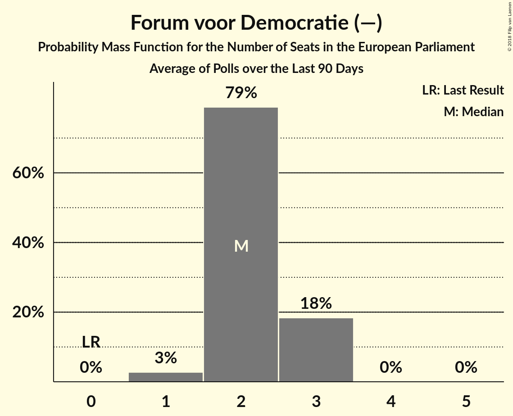

# Poll Average

<a href="#voting-intentions">Voting Intentions</a> | <a href="#seats">Seats</a> | <a href="#coalitions">Coalitions</a> | <a href="#technical-information">Technical Information</a>

## Summary

The table below lists the polls on which the average is based. They are the most recent polls (less than 90 days old) registered and analyzed so far.

| Period     | Polling firm/Commissioner(s) | D66 | CDA | PVV | VVD | SP | PvdA | CU | SGP | GL | PvdD | 50+ | PP | DENK | FvD | B1 |
|:----------:|:----------------------------:|:--:|:--:|:--:|:--:|:--:|:--:|:--:|:--:|:--:|:--:|:--:|:--:|:--:|:--:|:--:|
| 22 May 2014 | General Election | 15.5%   4 | 15.2%   5 | 13.3%   4 | 12.0%   3 | 9.6%   2 | 9.4%   3 | 7.7%   1 | 7.7%   1 | 7.0%   2 | 4.2%   1 | 3.7%   0 | 0.9%   0 | 0.0%   0 | 0.0%   0 | 0.0%   0 |
| N/A | Poll Average | 8–12%   2–4 | 8–12%   2–4 | 8–12%   3 | 18–22%   5–7 | 7–12%   2–4 | 4–7%   1–3 | 3–5%   0–2 | 1–3%   0–1 | 8–12%   3–4 | 3–6%   0–2 | 3–5%   0–1 | N/A   N/A | 1–4%   0–1 | 5–9%   1–3 | N/A   N/A |
| [27 February–4 March 2018](2018-03-04-KantarPublic.html) | Kantar Public | 8–12%   2–4 | 8–12%   3–4 | 9–13%   3–4 | 18–23%   6–7 | 9–13%   3–4 | 5–8%   2–3 | 3–5%   0–2 | 1–3%   0–1 | 9–13%   3–4 | 3–5%   0–1 | 3–5%   0–1 | N/A   N/A | 1–3%   0 | 5–8%   1–3 | N/A   N/A |
| [23–26 February 2018](2018-02-26-Ipsos.html) | Ipsos   EenVandaag | 9–12%   3–4 | 8–12%   2–4 | 8–12%   3 | 18–22%   5–7 | 7–10%   2–3 | 4–7%   1 | 3–5%   0–1 | 2–3%   0–1 | 8–11%   3–4 | 4–7%   1–2 | 3–5%   1 | N/A   N/A | 2–4%   0–1 | 6–9%   2–3 | N/A   N/A |
| [2–6 February 2018](2018-02-06-IOResearch.html) | I&O Research | N/A   N/A | N/A   N/A | N/A   N/A | N/A   N/A | N/A   N/A | N/A   N/A | N/A   N/A | N/A   N/A | N/A   N/A | N/A   N/A | N/A   N/A | N/A   N/A | N/A   N/A | N/A   N/A | N/A   N/A |
| [15–18 December 2017](2017-12-18-GfK.html) | GfK   EenVandaag | N/A   N/A | N/A   N/A | N/A   N/A | N/A   N/A | N/A   N/A | N/A   N/A | N/A   N/A | N/A   N/A | N/A   N/A | N/A   N/A | N/A   N/A | N/A   N/A | N/A   N/A | N/A   N/A | N/A   N/A |
| 22 May 2014 | General Election | 15.5%   4 | 15.2%   5 | 13.3%   4 | 12.0%   3 | 9.6%   2 | 9.4%   3 | 7.7%   1 | 7.7%   1 | 7.0%   2 | 4.2%   1 | 3.7%   0 | 0.9%   0 | 0.0%   0 | 0.0%   0 | 0.0%   0 |

Only polls for which at least the sample size has been published are included in the table above.

**Legend:**
+ **Top half of each row:** Voting intentions (95% confidence interval)
+ **Bottom half of each row:** Seat projections for the European Parliament (95% confidence interval)
+ **D66:** Democraten 66 (ALDE)
+ **CDA:** Christen-Democratisch Appèl (EPP)
+ **PVV:** Partij voor de Vrijheid (ENF)
+ **VVD:** Volkspartij voor Vrijheid en Democratie (ALDE)
+ **SP:** Socialistische Partij (GUE/NGL)
+ **PvdA:** Partij van de Arbeid (S&D)
+ **CU:** ChristenUnie (ECR)
+ **SGP:** Staatkundig Gereformeerde Partij (ECR)
+ **GL:** GroenLinks (Greens/EFA)
+ **PvdD:** Partij voor de Dieren (GUE/NGL)
+ **50+:** 50Plus (ALDE)
+ **PP:** Piratenpartij (Greens/EFA)
+ **DENK:** Denk (—)
+ **FvD:** Forum voor Democratie (—)
+ **B1:** Bij1 (—)
+ **N/A (single party):** Party not included the published results
+ **N/A (entire row):** Calculation for this opinion poll not started yet

## Voting Intentions

### Confidence Intervals

| Party | Last Result | Median | 80% Confidence Interval | 90% Confidence Interval | 95% Confidence Interval | 99% Confidence Interval |
|:-----:|:-----------:|:------:|:-----------------------:|:-----------------------:|:-----------------------:|:-----------------------:|
| <a href="#democraten-66-(alde)">Democraten 66 (ALDE)</a> | 15.5% | 10.3% | 9.1–11.6% |8.8–11.9% | 8.5–12.3% | 8.0–12.9% |
| <a href="#christen-democratisch-appèl-(epp)">Christen-Democratisch Appèl (EPP)</a> | 15.2% | 10.1% | 9.0–11.4% |8.7–11.8% | 8.4–12.1% | 7.9–12.7% |
| <a href="#partij-voor-de-vrijheid-(enf)">Partij voor de Vrijheid (ENF)</a> | 13.3% | 10.2% | 8.9–11.6% |8.6–12.0% | 8.3–12.4% | 7.8–13.1% |
| <a href="#volkspartij-voor-vrijheid-en-democratie-(alde)">Volkspartij voor Vrijheid en Democratie (ALDE)</a> | 12.0% | 20.0% | 18.4–21.6% |18.0–22.1% | 17.6–22.5% | 16.9–23.3% |
| <a href="#socialistische-partij-(gue/ngl)">Socialistische Partij (GUE/NGL)</a> | 9.6% | 9.5% | 7.6–11.5% |7.3–11.9% | 7.0–12.3% | 6.5–13.0% |
| <a href="#partij-van-de-arbeid-(s&d)">Partij van de Arbeid (S&D)</a> | 9.4% | 5.6% | 4.5–6.8% |4.3–7.1% | 4.1–7.4% | 3.7–8.0% |
| <a href="#christenunie-(ecr)">ChristenUnie (ECR)</a> | 7.7% | 3.9% | 3.1–4.7% |2.9–5.0% | 2.8–5.2% | 2.4–5.7% |
| <a href="#staatkundig-gereformeerde-partij-(ecr)">Staatkundig Gereformeerde Partij (ECR)</a> | 7.7% | 2.2% | 1.7–2.9% |1.5–3.1% | 1.4–3.3% | 1.2–3.7% |
| <a href="#groenlinks-(greens/efa)">GroenLinks (Greens/EFA)</a> | 7.0% | 10.0% | 8.5–11.5% |8.2–12.0% | 7.9–12.3% | 7.3–13.0% |
| <a href="#partij-voor-de-dieren-(gue/ngl)">Partij voor de Dieren (GUE/NGL)</a> | 4.2% | 4.6% | 3.6–5.8% |3.3–6.2% | 3.1–6.5% | 2.8–7.0% |
| <a href="#50plus-(alde)">50Plus (ALDE)</a> | 3.7% | 4.1% | 3.3–4.9% |3.1–5.2% | 3.0–5.4% | 2.7–5.8% |
| <a href="#piratenpartij-(greens/efa)">Piratenpartij (Greens/EFA)</a> | 0.9% | N/A | N/A |N/A | N/A | N/A |
| <a href="#denk-(—)">Denk (—)</a> | 0.0% | 2.6% | 1.7–3.7% |1.6–3.9% | 1.4–4.2% | 1.2–4.6% |
| <a href="#forum-voor-democratie-(—)">Forum voor Democratie (—)</a> | 0.0% | 6.9% | 5.5–8.5% |5.2–8.9% | 4.9–9.2% | 4.5–9.8% |
| <a href="#bij1-(—)">Bij1 (—)</a> | 0.0% | N/A | N/A |N/A | N/A | N/A |

### Democraten 66 (ALDE)

*For a full overview of the results for this party, see the [Democraten 66 (ALDE)](party-democraten66alde.html) page.*

| Voting Intentions | Probability | Accumulated | Special Marks |
|:-----------------:|:-----------:|:-----------:|:-------------:|
| 5.5–6.5% | 0% | 100% |  |
| 6.5–7.5% | 0.1% | 100% |  |
| 7.5–8.5% | 3% | 99.9% |  |
| 8.5–9.5% | 19% | 97% |  |
| 9.5–10.5% | 39% | 78% | Median |
| 10.5–11.5% | 29% | 39% |  |
| 11.5–12.5% | 9% | 10% |  |
| 12.5–13.5% | 1.3% | 1.4% |  |
| 13.5–14.5% | 0.1% | 0.1% |  |
| 14.5–15.5% | 0% | 0% | Last Result |

### Christen-Democratisch Appèl (EPP)

*For a full overview of the results for this party, see the [Christen-Democratisch Appèl (EPP)](party-christen-democratischappèlepp.html) page.*

| Voting Intentions | Probability | Accumulated | Special Marks |
|:-----------------:|:-----------:|:-----------:|:-------------:|
| 5.5–6.5% | 0% | 100% |  |
| 6.5–7.5% | 0.1% | 100% |  |
| 7.5–8.5% | 4% | 99.9% |  |
| 8.5–9.5% | 23% | 96% |  |
| 9.5–10.5% | 40% | 74% | Median |
| 10.5–11.5% | 26% | 34% |  |
| 11.5–12.5% | 7% | 7% |  |
| 12.5–13.5% | 0.8% | 0.8% |  |
| 13.5–14.5% | 0% | 0% |  |
| 14.5–15.5% | 0% | 0% | Last Result |

### Partij voor de Vrijheid (ENF)

*For a full overview of the results for this party, see the [Partij voor de Vrijheid (ENF)](party-partijvoordevrijheidenf.html) page.*

| Voting Intentions | Probability | Accumulated | Special Marks |
|:-----------------:|:-----------:|:-----------:|:-------------:|
| 5.5–6.5% | 0% | 100% |  |
| 6.5–7.5% | 0.2% | 100% |  |
| 7.5–8.5% | 4% | 99.8% |  |
| 8.5–9.5% | 21% | 96% |  |
| 9.5–10.5% | 36% | 75% | Median |
| 10.5–11.5% | 27% | 38% |  |
| 11.5–12.5% | 9% | 11% |  |
| 12.5–13.5% | 2% | 2% | Last Result |
| 13.5–14.5% | 0.1% | 0.1% |  |
| 14.5–15.5% | 0% | 0% |  |

### Volkspartij voor Vrijheid en Democratie (ALDE)

*For a full overview of the results for this party, see the [Volkspartij voor Vrijheid en Democratie (ALDE)](party-volkspartijvoorvrijheidendemocratiealde.html) page.*

| Voting Intentions | Probability | Accumulated | Special Marks |
|:-----------------:|:-----------:|:-----------:|:-------------:|
| 11.5–12.5% | 0% | 100% | Last Result |
| 12.5–13.5% | 0% | 100% |  |
| 13.5–14.5% | 0% | 100% |  |
| 14.5–15.5% | 0% | 100% |  |
| 15.5–16.5% | 0.2% | 100% |  |
| 16.5–17.5% | 2% | 99.8% |  |
| 17.5–18.5% | 10% | 98% |  |
| 18.5–19.5% | 24% | 88% |  |
| 19.5–20.5% | 31% | 63% | Median |
| 20.5–21.5% | 22% | 33% |  |
| 21.5–22.5% | 9% | 11% |  |
| 22.5–23.5% | 2% | 2% |  |
| 23.5–24.5% | 0.3% | 0.3% |  |
| 24.5–25.5% | 0% | 0% |  |

### Socialistische Partij (GUE/NGL)

*For a full overview of the results for this party, see the [Socialistische Partij (GUE/NGL)](party-socialistischepartijguengl.html) page.*

| Voting Intentions | Probability | Accumulated | Special Marks |
|:-----------------:|:-----------:|:-----------:|:-------------:|
| 4.5–5.5% | 0% | 100% |  |
| 5.5–6.5% | 0.6% | 100% |  |
| 6.5–7.5% | 8% | 99.3% |  |
| 7.5–8.5% | 22% | 91% |  |
| 8.5–9.5% | 21% | 70% | Median |
| 9.5–10.5% | 21% | 49% | Last Result |
| 10.5–11.5% | 19% | 28% |  |
| 11.5–12.5% | 8% | 9% |  |
| 12.5–13.5% | 1.4% | 2% |  |
| 13.5–14.5% | 0.1% | 0.1% |  |
| 14.5–15.5% | 0% | 0% |  |

### Partij van de Arbeid (S&D)

*For a full overview of the results for this party, see the [Partij van de Arbeid (S&D)](party-partijvandearbeidsd.html) page.*

| Voting Intentions | Probability | Accumulated | Special Marks |
|:-----------------:|:-----------:|:-----------:|:-------------:|
| 1.5–2.5% | 0% | 100% |  |
| 2.5–3.5% | 0.3% | 100% |  |
| 3.5–4.5% | 10% | 99.7% |  |
| 4.5–5.5% | 37% | 90% |  |
| 5.5–6.5% | 38% | 52% | Median |
| 6.5–7.5% | 13% | 15% |  |
| 7.5–8.5% | 2% | 2% |  |
| 8.5–9.5% | 0.1% | 0.1% | Last Result |
| 9.5–10.5% | 0% | 0% |  |

### ChristenUnie (ECR)

*For a full overview of the results for this party, see the [ChristenUnie (ECR)](party-christenunieecr.html) page.*

| Voting Intentions | Probability | Accumulated | Special Marks |
|:-----------------:|:-----------:|:-----------:|:-------------:|
| 0.5–1.5% | 0% | 100% |  |
| 1.5–2.5% | 0.9% | 100% |  |
| 2.5–3.5% | 29% | 99.1% |  |
| 3.5–4.5% | 55% | 70% | Median |
| 4.5–5.5% | 14% | 15% |  |
| 5.5–6.5% | 0.9% | 0.9% |  |
| 6.5–7.5% | 0% | 0% |  |
| 7.5–8.5% | 0% | 0% | Last Result |

### Staatkundig Gereformeerde Partij (ECR)

*For a full overview of the results for this party, see the [Staatkundig Gereformeerde Partij (ECR)](party-staatkundiggereformeerdepartijecr.html) page.*

| Voting Intentions | Probability | Accumulated | Special Marks |
|:-----------------:|:-----------:|:-----------:|:-------------:|
| 0.0–0.5% | 0% | 100% |  |
| 0.5–1.5% | 6% | 100% |  |
| 1.5–2.5% | 67% | 94% | Median |
| 2.5–3.5% | 26% | 27% |  |
| 3.5–4.5% | 1.0% | 1.0% |  |
| 4.5–5.5% | 0% | 0% |  |
| 5.5–6.5% | 0% | 0% |  |
| 6.5–7.5% | 0% | 0% |  |
| 7.5–8.5% | 0% | 0% | Last Result |

### GroenLinks (Greens/EFA)

*For a full overview of the results for this party, see the [GroenLinks (Greens/EFA)](party-groenlinksgreensefa.html) page.*

| Voting Intentions | Probability | Accumulated | Special Marks |
|:-----------------:|:-----------:|:-----------:|:-------------:|
| 5.5–6.5% | 0% | 100% |  |
| 6.5–7.5% | 0.9% | 100% | Last Result |
| 7.5–8.5% | 9% | 99.0% |  |
| 8.5–9.5% | 26% | 90% |  |
| 9.5–10.5% | 32% | 64% | Median |
| 10.5–11.5% | 23% | 32% |  |
| 11.5–12.5% | 8% | 10% |  |
| 12.5–13.5% | 1.4% | 2% |  |
| 13.5–14.5% | 0.1% | 0.1% |  |
| 14.5–15.5% | 0% | 0% |  |

### Partij voor de Dieren (GUE/NGL)

*For a full overview of the results for this party, see the [Partij voor de Dieren (GUE/NGL)](party-partijvoordedierenguengl.html) page.*

| Voting Intentions | Probability | Accumulated | Special Marks |
|:-----------------:|:-----------:|:-----------:|:-------------:|
| 1.5–2.5% | 0.1% | 100% |  |
| 2.5–3.5% | 9% | 99.9% |  |
| 3.5–4.5% | 37% | 91% | Last Result |
| 4.5–5.5% | 36% | 53% | Median |
| 5.5–6.5% | 15% | 17% |  |
| 6.5–7.5% | 2% | 2% |  |
| 7.5–8.5% | 0.1% | 0.1% |  |
| 8.5–9.5% | 0% | 0% |  |

### 50Plus (ALDE)

*For a full overview of the results for this party, see the [50Plus (ALDE)](party-50plusalde.html) page.*

| Voting Intentions | Probability | Accumulated | Special Marks |
|:-----------------:|:-----------:|:-----------:|:-------------:|
| 0.5–1.5% | 0% | 100% |  |
| 1.5–2.5% | 0.2% | 100% |  |
| 2.5–3.5% | 19% | 99.8% |  |
| 3.5–4.5% | 59% | 81% | Last Result, Median |
| 4.5–5.5% | 21% | 22% |  |
| 5.5–6.5% | 1.4% | 1.4% |  |
| 6.5–7.5% | 0% | 0% |  |

### Denk (—)

*For a full overview of the results for this party, see the [Denk (—)](party-denk—.html) page.*

| Voting Intentions | Probability | Accumulated | Special Marks |
|:-----------------:|:-----------:|:-----------:|:-------------:|
| 0.0–0.5% | 0% | 100% | Last Result |
| 0.5–1.5% | 5% | 100% |  |
| 1.5–2.5% | 43% | 95% |  |
| 2.5–3.5% | 40% | 53% | Median |
| 3.5–4.5% | 12% | 13% |  |
| 4.5–5.5% | 0.6% | 0.6% |  |
| 5.5–6.5% | 0% | 0% |  |

### Forum voor Democratie (—)

*For a full overview of the results for this party, see the [Forum voor Democratie (—)](party-forumvoordemocratie—.html) page.*

| Voting Intentions | Probability | Accumulated | Special Marks |
|:-----------------:|:-----------:|:-----------:|:-------------:|
| 0.0–0.5% | 0% | 100% | Last Result |
| 0.5–1.5% | 0% | 100% |  |
| 1.5–2.5% | 0% | 100% |  |
| 2.5–3.5% | 0% | 100% |  |
| 3.5–4.5% | 0.6% | 100% |  |
| 4.5–5.5% | 11% | 99.4% |  |
| 5.5–6.5% | 28% | 89% |  |
| 6.5–7.5% | 28% | 60% | Median |
| 7.5–8.5% | 23% | 32% |  |
| 8.5–9.5% | 8% | 9% |  |
| 9.5–10.5% | 1.0% | 1.1% |  |
| 10.5–11.5% | 0.1% | 0.1% |  |
| 11.5–12.5% | 0% | 0% |  |

## Seats

### Confidence Intervals

| Party | Last Result | Median | 80% Confidence Interval | 90% Confidence Interval | 95% Confidence Interval | 99% Confidence Interval |
|:-----:|:-----------:|:------:|:-----------------------:|:-----------------------:|:-----------------------:|:-----------------------:|
| <a href="#democraten-66-(alde)">Democraten 66 (ALDE)</a> | 4 | 3 | 2–4 |2–4 | 2–4 | 2–4 |
| <a href="#christen-democratisch-appèl-(epp)">Christen-Democratisch Appèl (EPP)</a> | 5 | 4 | 2–4 |2–4 | 2–4 | 2–4 |
| <a href="#partij-voor-de-vrijheid-(enf)">Partij voor de Vrijheid (ENF)</a> | 4 | 3 | 3 |3 | 3 | 3–4 |
| <a href="#volkspartij-voor-vrijheid-en-democratie-(alde)">Volkspartij voor Vrijheid en Democratie (ALDE)</a> | 3 | 7 | 7 |6–7 | 5–7 | 5–7 |
| <a href="#socialistische-partij-(gue/ngl)">Socialistische Partij (GUE/NGL)</a> | 2 | 3 | 2–3 |2–4 | 2–4 | 2–4 |
| <a href="#partij-van-de-arbeid-(s&d)">Partij van de Arbeid (S&D)</a> | 3 | 1 | 1–3 |1–3 | 1–3 | 1–3 |
| <a href="#christenunie-(ecr)">ChristenUnie (ECR)</a> | 1 | 1 | 0–1 |0–2 | 0–2 | 0–2 |
| <a href="#staatkundig-gereformeerde-partij-(ecr)">Staatkundig Gereformeerde Partij (ECR)</a> | 1 | 0 | 0–1 |0–1 | 0–1 | 0–1 |
| <a href="#groenlinks-(greens/efa)">GroenLinks (Greens/EFA)</a> | 2 | 3 | 3–4 |3–4 | 3–4 | 3–4 |
| <a href="#partij-voor-de-dieren-(gue/ngl)">Partij voor de Dieren (GUE/NGL)</a> | 1 | 1 | 0–2 |0–2 | 0–2 | 0–2 |
| <a href="#50plus-(alde)">50Plus (ALDE)</a> | 0 | 1 | 1 |0–1 | 0–1 | 0–1 |
| <a href="#piratenpartij-(greens/efa)">Piratenpartij (Greens/EFA)</a> | 0 | N/A | N/A |N/A | N/A | N/A |
| <a href="#denk-(—)">Denk (—)</a> | 0 | 0 | 0–1 |0–1 | 0–1 | 0–1 |
| <a href="#forum-voor-democratie-(—)">Forum voor Democratie (—)</a> | 0 | 2 | 2 |2–3 | 1–3 | 1–3 |
| <a href="#bij1-(—)">Bij1 (—)</a> | 0 | N/A | N/A |N/A | N/A | N/A |

### Democraten 66 (ALDE)

*For a full overview of the results for this party, see the [Democraten 66 (ALDE)](party-democraten66alde.html) page.*

| Number of Seats | Probability | Accumulated | Special Marks |
|:---------------:|:-----------:|:-----------:|:-------------:|
| 2 | 43% | 100% |  |
| 3 | 21% | 57% | Median |
| 4 | 35% | 35% | Last Result |
| 5 | 0% | 0% |  |

### Christen-Democratisch Appèl (EPP)

*For a full overview of the results for this party, see the [Christen-Democratisch Appèl (EPP)](party-christen-democratischappèlepp.html) page.*

| Number of Seats | Probability | Accumulated | Special Marks |
|:---------------:|:-----------:|:-----------:|:-------------:|
| 2 | 18% | 100% |  |
| 3 | 10% | 82% |  |
| 4 | 73% | 73% | Median |
| 5 | 0% | 0% | Last Result |

### Partij voor de Vrijheid (ENF)

*For a full overview of the results for this party, see the [Partij voor de Vrijheid (ENF)](party-partijvoordevrijheidenf.html) page.*

| Number of Seats | Probability | Accumulated | Special Marks |
|:---------------:|:-----------:|:-----------:|:-------------:|
| 2 | 0.4% | 100% |  |
| 3 | 98% | 99.6% | Median |
| 4 | 2% | 2% | Last Result |
| 5 | 0% | 0% |  |

### Volkspartij voor Vrijheid en Democratie (ALDE)

*For a full overview of the results for this party, see the [Volkspartij voor Vrijheid en Democratie (ALDE)](party-volkspartijvoorvrijheidendemocratiealde.html) page.*

| Number of Seats | Probability | Accumulated | Special Marks |
|:---------------:|:-----------:|:-----------:|:-------------:|
| 3 | 0% | 100% | Last Result |
| 4 | 0% | 100% |  |
| 5 | 4% | 100% |  |
| 6 | 1.5% | 96% |  |
| 7 | 94% | 94% | Median |
| 8 | 0% | 0% |  |

### Socialistische Partij (GUE/NGL)

*For a full overview of the results for this party, see the [Socialistische Partij (GUE/NGL)](party-socialistischepartijguengl.html) page.*

| Number of Seats | Probability | Accumulated | Special Marks |
|:---------------:|:-----------:|:-----------:|:-------------:|
| 2 | 21% | 100% | Last Result |
| 3 | 73% | 79% | Median |
| 4 | 5% | 5% |  |
| 5 | 0% | 0% |  |

### Partij van de Arbeid (S&D)

*For a full overview of the results for this party, see the [Partij van de Arbeid (S&D)](party-partijvandearbeidsd.html) page.*

| Number of Seats | Probability | Accumulated | Special Marks |
|:---------------:|:-----------:|:-----------:|:-------------:|
| 1 | 50% | 100% | Median |
| 2 | 11% | 50% |  |
| 3 | 39% | 39% | Last Result |
| 4 | 0% | 0% |  |

### ChristenUnie (ECR)

*For a full overview of the results for this party, see the [ChristenUnie (ECR)](party-christenunieecr.html) page.*

| Number of Seats | Probability | Accumulated | Special Marks |
|:---------------:|:-----------:|:-----------:|:-------------:|
| 0 | 35% | 100% |  |
| 1 | 59% | 65% | Last Result, Median |
| 2 | 6% | 6% |  |
| 3 | 0% | 0% |  |

### Staatkundig Gereformeerde Partij (ECR)

*For a full overview of the results for this party, see the [Staatkundig Gereformeerde Partij (ECR)](party-staatkundiggereformeerdepartijecr.html) page.*

| Number of Seats | Probability | Accumulated | Special Marks |
|:---------------:|:-----------:|:-----------:|:-------------:|
| 0 | 81% | 100% | Median |
| 1 | 19% | 19% | Last Result |
| 2 | 0% | 0% |  |

### GroenLinks (Greens/EFA)

*For a full overview of the results for this party, see the [GroenLinks (Greens/EFA)](party-groenlinksgreensefa.html) page.*

| Number of Seats | Probability | Accumulated | Special Marks |
|:---------------:|:-----------:|:-----------:|:-------------:|
| 2 | 0% | 100% | Last Result |
| 3 | 88% | 100% | Median |
| 4 | 12% | 12% |  |
| 5 | 0% | 0% |  |

### Partij voor de Dieren (GUE/NGL)

*For a full overview of the results for this party, see the [Partij voor de Dieren (GUE/NGL)](party-partijvoordedierenguengl.html) page.*

| Number of Seats | Probability | Accumulated | Special Marks |
|:---------------:|:-----------:|:-----------:|:-------------:|
| 0 | 47% | 100% |  |
| 1 | 36% | 53% | Last Result, Median |
| 2 | 17% | 17% |  |
| 3 | 0% | 0% |  |

### 50Plus (ALDE)

*For a full overview of the results for this party, see the [50Plus (ALDE)](party-50plusalde.html) page.*

| Number of Seats | Probability | Accumulated | Special Marks |
|:---------------:|:-----------:|:-----------:|:-------------:|
| 0 | 7% | 100% | Last Result |
| 1 | 93% | 93% | Median |
| 2 | 0% | 0% |  |

### Denk (—)

*For a full overview of the results for this party, see the [Denk (—)](party-denk—.html) page.*

| Number of Seats | Probability | Accumulated | Special Marks |
|:---------------:|:-----------:|:-----------:|:-------------:|
| 0 | 80% | 100% | Last Result, Median |
| 1 | 20% | 20% |  |
| 2 | 0% | 0% |  |

### Forum voor Democratie (—)

*For a full overview of the results for this party, see the [Forum voor Democratie (—)](party-forumvoordemocratie—.html) page.*

| Number of Seats | Probability | Accumulated | Special Marks |
|:---------------:|:-----------:|:-----------:|:-------------:|
| 0 | 0% | 100% | Last Result |
| 1 | 5% | 100% |  |
| 2 | 87% | 95% | Median |
| 3 | 8% | 8% |  |
| 4 | 0% | 0% |  |

## Coalitions

### Confidence Intervals

| Coalition | Last Result | Median | Majority? | 80% Confidence Interval | 90% Confidence Interval | 95% Confidence Interval | 99% Confidence Interval |
|:---------:|:-----------:|:------:|:---------:|:-----------------------:|:-----------------------:|:-----------------------:|:-----------------------:|
| Democraten 66 (ALDE) – Volkspartij voor Vrijheid en Democratie (ALDE) – 50Plus (ALDE) | 7 | 11 | 0% | 10–12 | 9–12 | 9–12 | 9–12 |
| GroenLinks (Greens/EFA) – Piratenpartij (Greens/EFA) | 2 | 3 | 0% | 3–4 | 3–4 | 3–4 | 3–4 |
| Socialistische Partij (GUE/NGL) – Partij voor de Dieren (GUE/NGL) | 3 | 4 | 0% | 3–4 | 3–4 | 3–4 | 3–6 |
| Christen-Democratisch Appèl (EPP) | 5 | 4 | 0% | 2–4 | 2–4 | 2–4 | 2–4 |
| Bij1 (—) – Denk (—) – Forum voor Democratie (—) | 0 | 2 | 0% | 2–3 | 2–3 | 1–4 | 1–4 |
| Partij voor de Vrijheid (ENF) | 4 | 3 | 0% | 3 | 3 | 3 | 3–4 |
| Partij van de Arbeid (S&D) | 3 | 1 | 0% | 1–3 | 1–3 | 1–3 | 1–3 |
| ChristenUnie (ECR) – Staatkundig Gereformeerde Partij (ECR) | 2 | 1 | 0% | 0–2 | 0–2 | 0–2 | 0–3 |

### Democraten 66 (ALDE) – Volkspartij voor Vrijheid en Democratie (ALDE) – 50Plus (ALDE)

| Number of Seats | Probability | Accumulated | Special Marks |
|:---------------:|:-----------:|:-----------:|:-------------:|
| 7 | 0% | 100% | Last Result |
| 8 | 0.1% | 100% |  |
| 9 | 8% | 99.9% |  |
| 10 | 42% | 92% |  |
| 11 | 17% | 50% | Median |
| 12 | 33% | 33% |  |
| 13 | 0% | 0% |  |

### GroenLinks (Greens/EFA) – Piratenpartij (Greens/EFA)

| Number of Seats | Probability | Accumulated | Special Marks |
|:---------------:|:-----------:|:-----------:|:-------------:|
| 2 | 0% | 100% | Last Result |
| 3 | 88% | 100% | Median |
| 4 | 12% | 12% |  |
| 5 | 0% | 0% |  |

### Socialistische Partij (GUE/NGL) – Partij voor de Dieren (GUE/NGL)

| Number of Seats | Probability | Accumulated | Special Marks |
|:---------------:|:-----------:|:-----------:|:-------------:|
| 3 | 48% | 100% | Last Result |
| 4 | 50% | 52% | Median |
| 5 | 1.1% | 2% |  |
| 6 | 0.8% | 0.8% |  |
| 7 | 0% | 0% |  |

### Christen-Democratisch Appèl (EPP)

| Number of Seats | Probability | Accumulated | Special Marks |
|:---------------:|:-----------:|:-----------:|:-------------:|
| 2 | 18% | 100% |  |
| 3 | 10% | 82% |  |
| 4 | 73% | 73% | Median |
| 5 | 0% | 0% | Last Result |

### Bij1 (—) – Denk (—) – Forum voor Democratie (—)

| Number of Seats | Probability | Accumulated | Special Marks |
|:---------------:|:-----------:|:-----------:|:-------------:|
| 0 | 0% | 100% | Last Result |
| 1 | 5% | 100% |  |
| 2 | 71% | 95% | Median |
| 3 | 21% | 25% |  |
| 4 | 4% | 4% |  |
| 5 | 0% | 0% |  |

### Partij voor de Vrijheid (ENF)

| Number of Seats | Probability | Accumulated | Special Marks |
|:---------------:|:-----------:|:-----------:|:-------------:|
| 2 | 0.4% | 100% |  |
| 3 | 98% | 99.6% | Median |
| 4 | 2% | 2% | Last Result |
| 5 | 0% | 0% |  |

### Partij van de Arbeid (S&D)

| Number of Seats | Probability | Accumulated | Special Marks |
|:---------------:|:-----------:|:-----------:|:-------------:|
| 1 | 50% | 100% | Median |
| 2 | 11% | 50% |  |
| 3 | 39% | 39% | Last Result |
| 4 | 0% | 0% |  |

### ChristenUnie (ECR) – Staatkundig Gereformeerde Partij (ECR)

| Number of Seats | Probability | Accumulated | Special Marks |
|:---------------:|:-----------:|:-----------:|:-------------:|
| 0 | 34% | 100% |  |
| 1 | 44% | 66% | Median |
| 2 | 21% | 22% | Last Result |
| 3 | 1.1% | 1.1% |  |
| 4 | 0% | 0% |  |

## Technical Information

