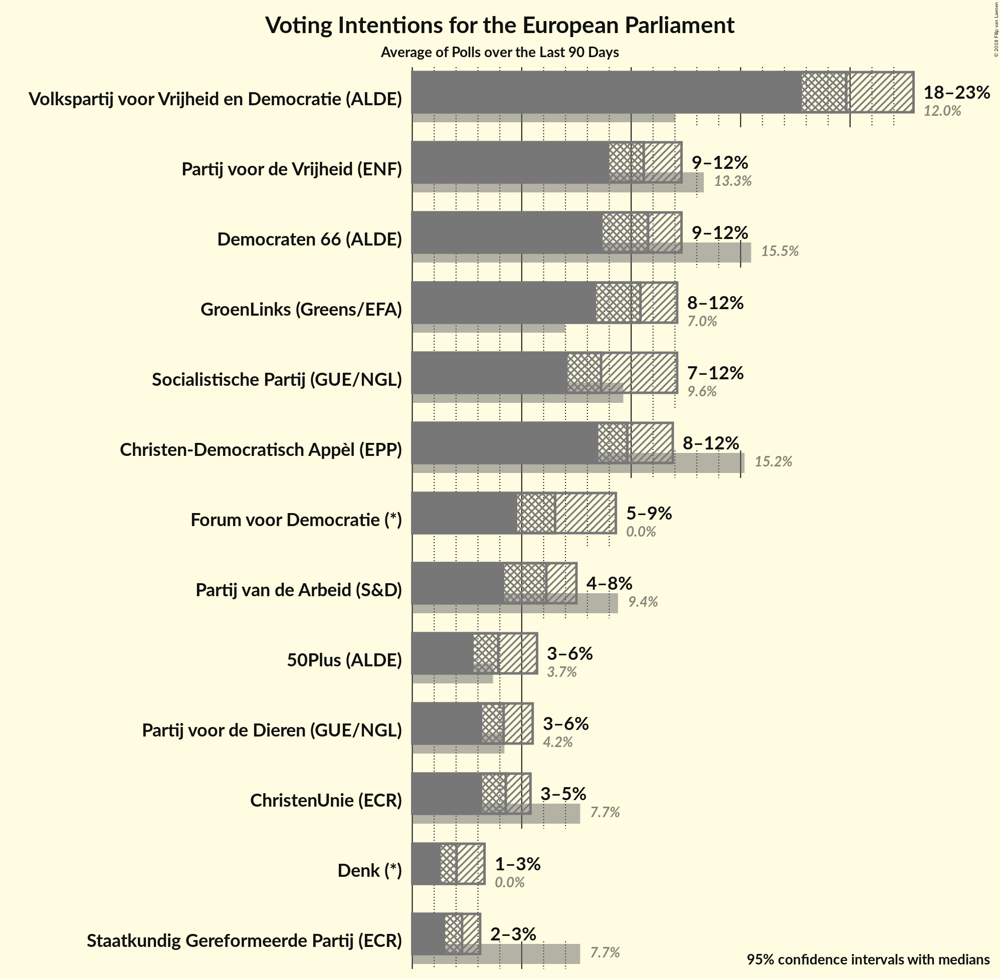
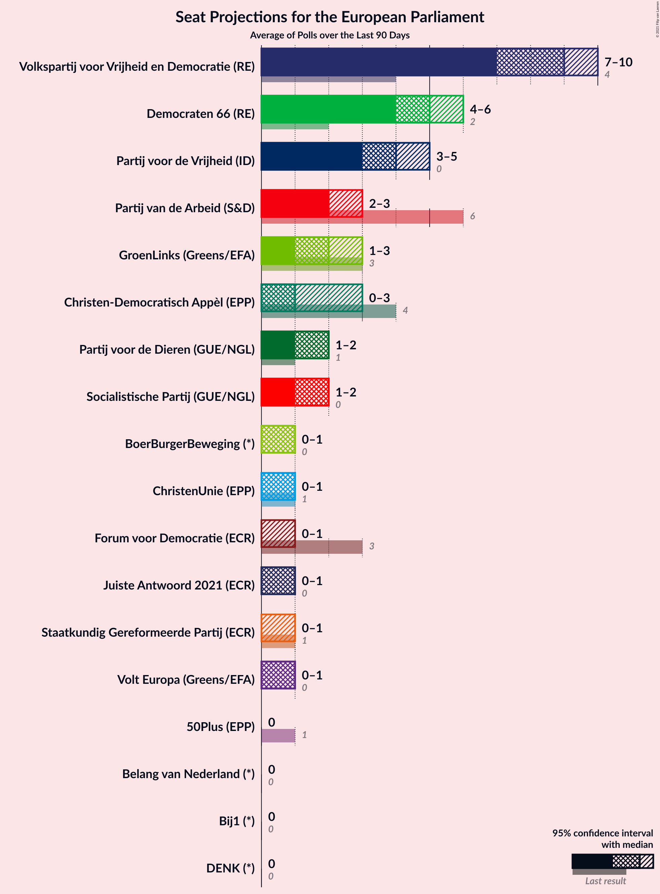
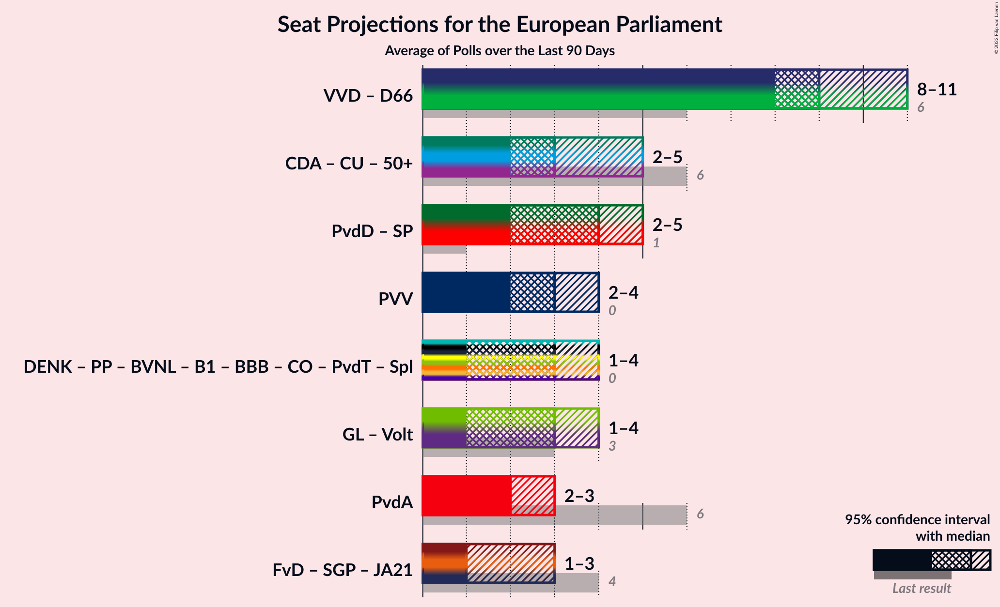

# Overview

The table below lists the most recent polls (less than 90 days old) registered and analyzed so far.

| Period     | Polling firm/Commissioner(s) | D66 | CDA | PVV | VVD | SP | PvdA | CU | SGP | GL | PvdD | 50+ | PP | DENK | FvD | B1 |
|:----------:|:----------------------------:|:--:|:--:|:--:|:--:|:--:|:--:|:--:|:--:|:--:|:--:|:--:|:--:|:--:|:--:|:--:|
| 22 May 2014 | General Election | 15.5%   4 | 15.2%   5 | 13.3%   4 | 12.0%   3 | 9.6%   2 | 9.4%   3 | 7.7%   1 | 7.7%   1 | 7.0%   2 | 4.2%   1 | 3.7%   0 | 0.9%   0 | 0.0%   0 | 0.0%   0 | 0.0%   0 |
| N/A | [Poll Average](average.html) | 8–12%   2–4 | 8–12%   3–4 | 8–12%   2–4 | 18–24%   6–8 | 7–12%   2–4 | 4–8%   1–2 | 3–6%   1–2 | 1–3%   0–1 | 9–13%   3–5 | 3–6%   0–2 | 3–5%   0–1 | N/A   N/A | 1–3%   0 | 5–9%   1–3 | N/A   N/A |
| [20–23 April 2018](2018-04-23-Ipsos.html) | Ipsos   EenVandaag | 8–11%   2–4 | 8–12%   3–4 | 8–11%   2–4 | 19–24%   6–8 | 7–10%   2–3 | 4–7%   1–2 | 4–6%   1–2 | 1–3%   0 | 10–14%   3–5 | 3–6%   0–2 | 3–5%   0–1 | N/A   N/A | 2–4%   0 | 5–8%   1–2 | N/A   N/A |
| [27 February–4 March 2018](2018-03-04-KantarPublic.html) | Kantar Public | 8–12%   3 | 8–12%   3–4 | 9–13%   3 | 18–23%   6–7 | 9–13%   3–4 | 5–8%   1–2 | 3–5%   1 | 1–3%   0–1 | 9–13%   3 | 3–5%   0–1 | 3–5%   1 | N/A   N/A | 1–3%   0 | 5–8%   2 | N/A   N/A |
| [2–6 February 2018](2018-02-06-IOResearch.html) | I&O Research | 10–12%   3–4 | 8–10%   3 | 10–12%   3–4 | 18–20%   6–7 | 7–9%   2–3 | 6–8%   2–3 | 4–5%   1 | 2–3%   0 | 10–12%   3–4 | 3–5%   0–1 | 3–4%   0–1 | N/A   N/A | 1–2%   0 | 8–10%   2–3 | N/A   N/A |
| 22 May 2014 | General Election | 15.5%   4 | 15.2%   5 | 13.3%   4 | 12.0%   3 | 9.6%   2 | 9.4%   3 | 7.7%   1 | 7.7%   1 | 7.0%   2 | 4.2%   1 | 3.7%   0 | 0.9%   0 | 0.0%   0 | 0.0%   0 | 0.0%   0 |

Only polls for which at least the sample size has been published are included in the table above.

**Legend:**
+ **Top half of each row:** Voting intentions (95% confidence interval)
+ **Bottom half of each row:** Seat projections for the European Parliament (95% confidence interval)
+ **D66:** Democraten 66 (ALDE)
+ **CDA:** Christen-Democratisch Appèl (EPP)
+ **PVV:** Partij voor de Vrijheid (ENF)
+ **VVD:** Volkspartij voor Vrijheid en Democratie (ALDE)
+ **SP:** Socialistische Partij (GUE/NGL)
+ **PvdA:** Partij van de Arbeid (S&D)
+ **CU:** ChristenUnie (ECR)
+ **SGP:** Staatkundig Gereformeerde Partij (ECR)
+ **GL:** GroenLinks (Greens/EFA)
+ **PvdD:** Partij voor de Dieren (GUE/NGL)
+ **50+:** 50Plus (ALDE)
+ **PP:** Piratenpartij (Greens/EFA)
+ **DENK:** Denk (*)
+ **FvD:** Forum voor Democratie (*)
+ **B1:** Bij1 (*)
+ **N/A (single party):** Party not included the published results
+ **N/A (entire row):** Calculation for this opinion poll not started yet

