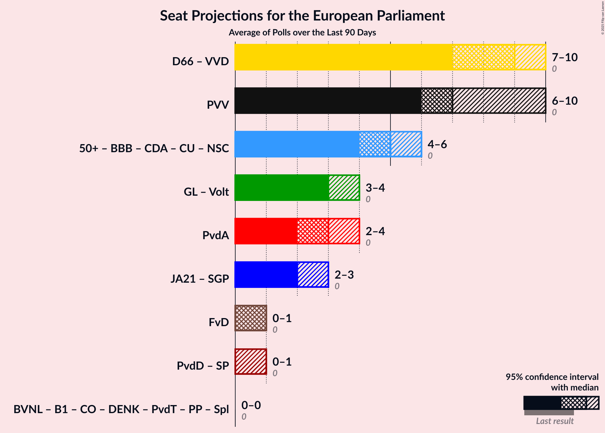

# Overview

The table below lists the most recent polls (less than 90 days old) registered and analyzed so far.

| Period     | Polling firm/Commissioner(s) | PvdA | VVD | CDA | FvD | GL | D66 | CU | SGP | PvdD | 50+ | PVV | SP | DENK | PP | B1 | PvdT | JA21 | CO | Volt | BBB | Spl | BVNL |
|:----------:|:----------------------------:|:--:|:--:|:--:|:--:|:--:|:--:|:--:|:--:|:--:|:--:|:--:|:--:|:--:|:--:|:--:|:--:|:--:|:--:|:--:|:--:|:--:|:--:|
| 23 May 2019 | General Election | 19.0%   6 | 14.6%   4 | 12.2%   4 | 11.0%   3 | 10.9%   3 | 7.1%   2 | 6.8%   1 | 6.8%   1 | 4.0%   1 | 3.9%   1 | 3.5%   0 | 3.4%   0 | 1.1%   0 | 0.2%   0 | 0.0%   0 | 0.0%   0 | 0.0%   0 | 0.0%   0 | 0.0%   0 | 0.0%   0 | 0.0%   0 | 0.0%   0 |
| N/A | [Poll Average](average.html) | 4–9%   1–3 | 12–19%   4–7 | 3–7%   0–2 | 2–4%   0–1 | 6–10%   2–3 | 7–13%   2–5 | 3–5%   0–2 | 2–4%   0–1 | 5–7%   1–2 | 0–2%   0 | 9–13%   3–5 | 4–7%   0–2 | 2–3%   0 | N/A   N/A | 0–2%   0 | N/A   N/A | 5–7%   1–2 | N/A   N/A | 1–4%   0–1 | 9–14%   3–5 | N/A   N/A | 0–1%   0 |
| [26–29 August 2022](2022-08-29-Ipsos.html) | Ipsos   EenVandaag | 4–7%   1–2 | 15–20%   5–7 | 4–7%   1–2 | 2–4%   0–1 | 6–9%   2–3 | 10–13%   3–5 | 2–5%   0–2 | 2–3%   0–1 | 4–7%   1–3 | 0–1%   0 | 10–14%   3–5 | 4–6%   0–2 | 1–3%   0–1 | N/A   N/A | 0–1%   0 | N/A   N/A | 5–8%   1–2 | N/A   N/A | 1–2%   0 | 8–12%   3–4 | N/A   N/A | N/A   N/A |
| [26–27 August 2022](2022-08-27-Peilnl.html) | Peil.nl | 7–9%   2–3 | 12–15%   4–5 | 3–5%   1 | 2–3%   0 | 8–10%   3 | 7–9%   2–3 | 3–5%   0–1 | 2–3%   0–1 | 5–7%   1–2 | 0–1%   0 | 10–13%   4 | 4–6%   1–2 | 2–3%   0 | N/A   N/A | 0–1%   0 | N/A   N/A | 5–7%   1–2 | N/A   N/A | 3–4%   0–1 | 12–14%   4–5 | N/A   N/A | 0–1%   0 |
| [15–18 July 2022](2022-07-18-IOResearch.html) | I&O Research | 5–7%   2–3 | 12–16%   5–6 | 3–5%   0–1 | 2–4%   0–1 | 6–9%   2–3 | 8–10%   2–4 | 3–5%   0–1 | 2–4%   0–1 | 5–8%   2 | 1–2%   0 | 9–11%   3–4 | 5–7%   2 | 2–3%   0 | N/A   N/A | 1–2%   0 | N/A   N/A | 5–7%   2 | N/A   N/A | 2–4%   0–1 | 10–13%   4–5 | N/A   N/A | 1%   0 |
| 23 May 2019 | General Election | 19.0%   6 | 14.6%   4 | 12.2%   4 | 11.0%   3 | 10.9%   3 | 7.1%   2 | 6.8%   1 | 6.8%   1 | 4.0%   1 | 3.9%   1 | 3.5%   0 | 3.4%   0 | 1.1%   0 | 0.2%   0 | 0.0%   0 | 0.0%   0 | 0.0%   0 | 0.0%   0 | 0.0%   0 | 0.0%   0 | 0.0%   0 | 0.0%   0 |

Only polls for which at least the sample size has been published are included in the table above.

**Legend:**
+ **Top half of each row:** Voting intentions (95% confidence interval)
+ **Bottom half of each row:** Seat projections for the European Parliament (95% confidence interval)
+ **PvdA:** Partij van de Arbeid (S&D)
+ **VVD:** Volkspartij voor Vrijheid en Democratie (RE)
+ **CDA:** Christen-Democratisch Appèl (EPP)
+ **FvD:** Forum voor Democratie (ECR)
+ **GL:** GroenLinks (Greens/EFA)
+ **D66:** Democraten 66 (RE)
+ **CU:** ChristenUnie (EPP)
+ **SGP:** Staatkundig Gereformeerde Partij (ECR)
+ **PvdD:** Partij voor de Dieren (GUE/NGL)
+ **50+:** 50Plus (EPP)
+ **PVV:** Partij voor de Vrijheid (ID)
+ **SP:** Socialistische Partij (GUE/NGL)
+ **DENK:** DENK (*)
+ **PP:** Piratenpartij (*)
+ **B1:** Bij1 (*)
+ **PvdT:** Partij voor de Toekomst (*)
+ **JA21:** Juiste Antwoord 2021 (ECR)
+ **CO:** Code Oranje (*)
+ **Volt:** Volt Europa (Greens/EFA)
+ **BBB:** BoerBurgerBeweging (*)
+ **Spl:** Splinter (*)
+ **BVNL:** Belang van Nederland (*)
+ **N/A (single party):** Party not included the published results
+ **N/A (entire row):** Calculation for this opinion poll not started yet

