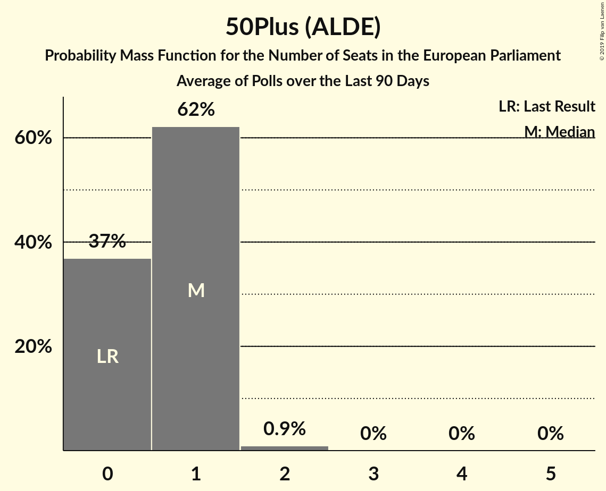

# 50Plus (ALDE)

<a href="#voting-intentions">Voting Intentions</a> | <a href="#seats">Seats</a>

## Voting Intentions

Last result: **3.7%** (General Election of 22 May 2014)

### Confidence Intervals

| Period     | Polling firm/Commissioner(s) | Median | 80% Confidence Interval | 90% Confidence Interval | 95% Confidence Interval | 99% Confidence Interval |
|:----------:|:----------------:|:-----------:|:-----------------------:|:-----------------------:|:-----------------------:|:-----------------------:|
| N/A | [Poll Average](average.html) | 4.1% | 3.3–4.9% | 3.1–5.2% | 3.0–5.4% | 2.7–5.8% |
| [27 February–4 March 2018](2018-03-04-KantarPublic.html) | Kantar Public | 4.0% | 3.3–4.9% | 3.1–5.2% | 3.0–5.4% | 2.7–5.9% |
| [23–26 February 2018](2018-02-26-Ipsos.html) | Ipsos   EenVandaag | 4.0% | 3.3–4.9% | 3.1–5.2% | 3.0–5.4% | 2.7–5.9% |
| [2–6 February 2018](2018-02-06-IOResearch.html) | I&O Research | 3.2% | N/A | N/A | N/A | N/A |
| [26–29 January 2018](2018-01-29-Ipsos.html) | Ipsos   EenVandaag | 3.4% | N/A | N/A | N/A | N/A |
| [25–28 January 2018](2018-01-28-KantarPublic.html) | Kantar Public | 2.7% | N/A | N/A | N/A | N/A |
| [15–18 December 2017](2017-12-18-GfK.html) | GfK   EenVandaag | 3.4% | N/A | N/A | N/A | N/A |

### Probability Mass Function

The following table shows the probability mass function per percentage block of voting intentions for the [poll average](average.html) for 50Plus (ALDE).

| Voting Intentions | Probability | Accumulated | Special Marks |
|:-----------------:|:-----------:|:-----------:|:-------------:|
| 0.5–1.5% | 0% | 100% |  |
| 1.5–2.5% | 0.2% | 100% |  |
| 2.5–3.5% | 19% | 99.8% |  |
| 3.5–4.5% | 59% | 81% | Last Result, Median |
| 4.5–5.5% | 21% | 22% |  |
| 5.5–6.5% | 1.4% | 1.4% |  |
| 6.5–7.5% | 0% | 0% |  |

## Seats

Last result: **0** seats (General Election of 22 May 2014)

### Confidence Intervals

| Period     | Polling firm/Commissioner(s) | Median | 80% Confidence Interval | 90% Confidence Interval | 95% Confidence Interval | 99% Confidence Interval |
|:----------:|:----------------:|:------:|:-----------------------:|:-----------------------:|:-----------------------:|:-----------------------:|
| N/A | [Poll Average](average.html) | 1 | 1 | 0–1 | 0–1 | 0–1 |
| [27 February–4 March 2018](2018-03-04-KantarPublic.html) | Kantar Public | 1 | 0–1 | 0–1 | 0–1 | 0–1 |
| [23–26 February 2018](2018-02-26-Ipsos.html) | Ipsos   EenVandaag | 1 | 1 | 1 | 1 | 1 |
| [2–6 February 2018](2018-02-06-IOResearch.html) | I&O Research |  |  |  |  |  |
| [26–29 January 2018](2018-01-29-Ipsos.html) | Ipsos   EenVandaag |  |  |  |  |  |
| [25–28 January 2018](2018-01-28-KantarPublic.html) | Kantar Public |  |  |  |  |  |
| [15–18 December 2017](2017-12-18-GfK.html) | GfK   EenVandaag |  |  |  |  |  |

### Probability Mass Function

The following table shows the probability mass function per seat for the [poll average](average.html) for 50Plus (ALDE).

| Number of Seats | Probability | Accumulated | Special Marks |
|:---------------:|:-----------:|:-----------:|:-------------:|
| 0 | 7% | 100% | Last Result |
| 1 | 93% | 93% | Median |
| 2 | 0% | 0% |  |

