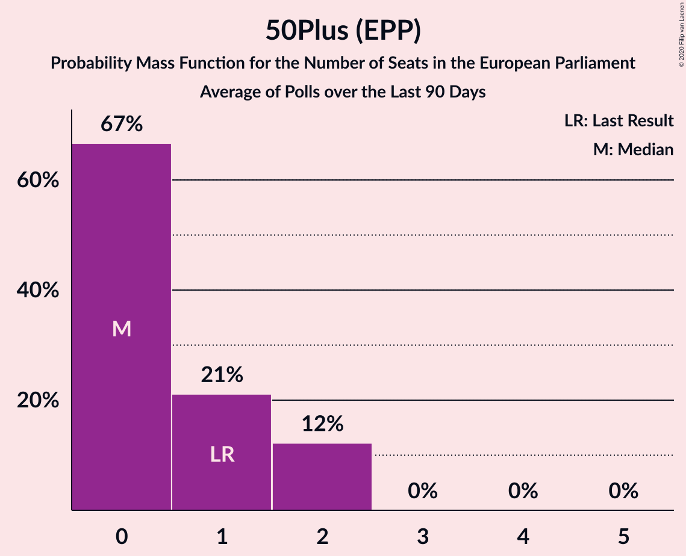

# 50Plus (EPP)

<a href="#voting-intentions">Voting Intentions</a> | <a href="#seats">Seats</a>

## Voting Intentions

Last result: **3.9%** (General Election of 23 May 2019)

### Confidence Intervals

| Period     | Polling firm/Commissioner(s) | Median | 80% Confidence Interval | 90% Confidence Interval | 95% Confidence Interval | 99% Confidence Interval |
|:----------:|:----------------:|:-----------:|:-----------------------:|:-----------------------:|:-----------------------:|:-----------------------:|
| N/A | [Poll Average](average.html) | 1.2% | 0.6–1.7% | 0.5–1.8% | 0.5–2.0% | 0.4–2.3% |
| [5 December 2020](2020-12-05-Peilnl.html) | Peil.nl | 1.3% | 1.1–1.6% | 1.0–1.7% | 1.0–1.8% | 0.9–2.0% |
| [27 November 2020](2020-11-27-Peilnl.html) | Peil.nl | 1.3% | 1.1–1.6% | 1.0–1.7% | 1.0–1.8% | 0.9–2.0% |
| [20–23 November 2020](2020-11-23-Ipsos.html) | Ipsos   EenVandaag | 1.0% | 0.7–1.6% | 0.7–1.7% | 0.6–1.9% | 0.5–2.2% |
| [20–21 November 2020](2020-11-21-Peilnl.html) | Peil.nl | 0.7% | 0.5–0.9% | 0.5–1.0% | 0.4–1.0% | 0.4–1.2% |
| [9–16 November 2020](2020-11-16-IOResearch.html) | I&O Research | 0.7% | 0.5–0.9% | 0.4–1.0% | 0.4–1.1% | 0.3–1.2% |
| [15 November 2020](2020-11-15-Peilnl.html) | Peil.nl | 0.7% | 0.5–0.9% | 0.5–1.0% | 0.4–1.0% | 0.4–1.2% |
| [8 November 2020](2020-11-08-Peilnl.html) | Peil.nl | 0.7% | 0.5–0.9% | 0.5–1.0% | 0.4–1.0% | 0.4–1.2% |
| [1 November 2020](2020-11-01-Peilnl.html) | Peil.nl | 0.7% | 0.5–0.9% | 0.5–1.0% | 0.4–1.0% | 0.4–1.2% |
| [23–26 October 2020](2020-10-26-Ipsos.html) | Ipsos   EenVandaag | 1.1% | 0.8–1.7% | 0.7–1.8% | 0.7–2.0% | 0.5–2.3% |
| [16–17 October 2020](2020-10-17-Peilnl.html) | Peil.nl | 1.3% | 1.1–1.6% | 1.0–1.7% | 1.0–1.8% | 0.9–2.0% |
| [9–12 October 2020](2020-10-12-IOResearch.html) | I&O Research | 1.0% | 0.7–1.3% | 0.7–1.4% | 0.6–1.5% | 0.5–1.7% |
| [11 October 2020](2020-10-11-Peilnl.html) | Peil.nl | 1.3% | 1.1–1.6% | 1.0–1.7% | 1.0–1.8% | 0.9–2.0% |
| [4 October 2020](2020-10-04-Peilnl.html) | Peil.nl | 1.3% | 1.1–1.6% | 1.0–1.7% | 1.0–1.8% | 0.9–2.0% |
| [25–29 September 2020](2020-09-29-KantarPublic.html) | Kantar Public | 1.4% | 1.0–1.9% | 0.9–2.1% | 0.8–2.2% | 0.7–2.5% |
| [27 September 2020](2020-09-27-Peilnl.html) | Peil.nl | 1.3% | 1.1–1.6% | 1.0–1.7% | 1.0–1.8% | 0.9–2.0% |
| [25–27 September 2020](2020-09-27-Ipsos.html) | Ipsos   EenVandaag | 1.5% | 1.1–2.1% | 1.0–2.3% | 0.9–2.5% | 0.8–2.8% |
| [18–19 September 2020](2020-09-19-Peilnl.html) | Peil.nl | 1.3% | 1.1–1.6% | 1.0–1.7% | 1.0–1.8% | 0.9–2.0% |
| [3–7 September 2020](2020-09-07-IOResearch.html) | I&O Research | 1.3% | 1.0–1.7% | 1.0–1.8% | 0.9–1.9% | 0.8–2.1% |
| [4–5 September 2020](2020-09-05-Peilnl.html) | Peil.nl | 0.7% | 0.5–0.9% | 0.5–1.0% | 0.4–1.0% | 0.4–1.2% |
| [28–29 August 2020](2020-08-29-Peilnl.html) | Peil.nl | 0.7% | 0.5–0.9% | 0.5–1.0% | 0.4–1.0% | 0.4–1.2% |
| [21–27 August 2020](2020-08-27-Ipsos.html) | Ipsos   EenVandaag | 1.2% | 0.9–1.8% | 0.8–2.0% | 0.7–2.1% | 0.6–2.4% |
| [23 August 2020](2020-08-23-Peilnl.html) | Peil.nl | 0.7% | 0.5–0.9% | 0.5–1.0% | 0.4–1.0% | 0.4–1.2% |
| [14–15 August 2020](2020-08-15-Peilnl.html) | Peil.nl | 0.7% | 0.5–0.9% | 0.5–1.0% | 0.4–1.0% | 0.4–1.2% |
| [9 August 2020](2020-08-09-IOResearch.html) | I&O Research | 0.7% | 0.5–1.1% | 0.4–1.2% | 0.4–1.3% | 0.3–1.5% |
| [26 July 2020](2020-07-26-Peilnl.html) | Peil.nl | 0.7% | 0.5–0.9% | 0.5–1.0% | 0.4–1.0% | 0.4–1.2% |
| [24–26 July 2020](2020-07-26-Ipsos.html) | Ipsos   EenVandaag | 1.9% | 1.4–2.6% | 1.3–2.7% | 1.2–2.9% | 1.1–3.3% |
| [19 July 2020](2020-07-19-Peilnl.html) | Peil.nl | 0.7% | 0.5–0.9% | 0.5–1.0% | 0.4–1.0% | 0.4–1.2% |
| [3–6 July 2020](2020-07-06-IOResearch.html) | I&O Research | 0.5% | 0.4–0.8% | 0.3–0.9% | 0.3–0.9% | 0.2–1.1% |
| [5 July 2020](2020-07-05-Peilnl.html) | Peil.nl | 0.7% | 0.5–0.9% | 0.5–1.0% | 0.4–1.0% | 0.4–1.2% |
| [27–30 June 2020](2020-06-30-Ipsos.html) | Ipsos   EenVandaag | 1.1% | 0.8–1.7% | 0.7–1.8% | 0.7–2.0% | 0.5–2.3% |
| [28 June 2020](2020-06-28-Peilnl.html) | Peil.nl | 0.7% | 0.5–0.9% | 0.5–1.0% | 0.4–1.0% | 0.4–1.2% |
| [23–26 June 2020](2020-06-26-KantarPublic.html) | Kantar Public | 1.3% | 1.0–2.0% | 0.9–2.1% | 0.8–2.3% | 0.6–2.7% |
| [21 June 2020](2020-06-21-Peilnl.html) | Peil.nl | 1.3% | 1.1–1.6% | 1.0–1.7% | 1.0–1.8% | 0.9–2.0% |
| [5–9 June 2020](2020-06-09-IOResearch.html) | I&O Research | 1.0% | 0.8–1.2% | 0.7–1.3% | 0.7–1.4% | 0.6–1.5% |
| [31 May 2020](2020-05-31-Peilnl.html) | Peil.nl | 0.7% | 0.5–0.9% | 0.5–1.0% | 0.4–1.0% | 0.4–1.2% |
| [22–24 May 2020](2020-05-24-Ipsos.html) | Ipsos   EenVandaag | 1.9% | 1.5–2.6% | 1.3–2.8% | 1.2–2.9% | 1.1–3.3% |
| [15–16 May 2020](2020-05-16-Peilnl.html) | Peil.nl | 0.7% | 0.5–0.9% | 0.5–1.0% | 0.4–1.0% | 0.4–1.2% |
| [7–12 May 2020](2020-05-12-IOResearch.html) | I&O Research | 0.7% | 0.5–1.0% | 0.5–1.1% | 0.4–1.2% | 0.4–1.4% |
| [8–9 May 2020](2020-05-09-Peilnl.html) | Peil.nl | 0.7% | 0.5–0.9% | 0.5–1.0% | 0.4–1.0% | 0.4–1.2% |
| [1–2 May 2020](2020-05-02-Peilnl.html) | Peil.nl | 4.0% | 3.6–4.5% | 3.4–4.6% | 3.4–4.8% | 3.2–5.0% |
| [26 April 2020](2020-04-26-Peilnl.html) | Peil.nl | 5.3% | 4.8–5.9% | 4.7–6.1% | 4.6–6.2% | 4.4–6.5% |
| [24–26 April 2020](2020-04-26-Ipsos.html) | Ipsos   EenVandaag | 5.2% | 4.4–6.2% | 4.2–6.5% | 4.0–6.8% | 3.7–7.3% |
| [27–30 March 2020](2020-03-30-Ipsos.html) | Ipsos   EenVandaag | 6.3% | 5.4–7.4% | 5.2–7.7% | 5.0–8.0% | 4.6–8.6% |
| [26–30 March 2020](2020-03-30-IOResearch.html) | I&O Research | 5.0% | 4.5–5.6% | 4.3–5.8% | 4.2–6.0% | 3.9–6.3% |
| [5–10 March 2020](2020-03-10-IOResearch.html) | I&O Research | 6.6% | 6.0–7.3% | 5.8–7.5% | 5.6–7.7% | 5.3–8.1% |
| [1–6 March 2020](2020-03-06-Peilnl.html) | Peil.nl | 6.7% | 6.1–7.3% | 6.0–7.5% | 5.8–7.6% | 5.6–7.9% |
| [23 February–1 March 2020](2020-03-01-Peilnl.html) | Peil.nl | 6.7% | 6.1–7.3% | 6.0–7.5% | 5.8–7.6% | 5.6–7.9% |
| [21–24 February 2020](2020-02-24-Ipsos.html) | Ipsos   EenVandaag | 6.8% | 5.9–7.9% | 5.6–8.2% | 5.4–8.5% | 5.0–9.1% |
| [18–23 February 2020](2020-02-23-Peilnl.html) | Peil.nl | 6.7% | 6.1–7.3% | 6.0–7.5% | 5.8–7.6% | 5.6–7.9% |
| [17–22 February 2020](2020-02-22-Peilnl.html) | Peil.nl | 6.7% | 6.1–7.3% | 6.0–7.5% | 5.8–7.6% | 5.6–7.9% |
| [9–14 February 2020](2020-02-14-Peilnl.html) | Peil.nl | 6.0% | 5.5–6.6% | 5.3–6.8% | 5.2–6.9% | 5.0–7.2% |
| [2–9 February 2020](2020-02-09-Peilnl.html) | Peil.nl | 6.0% | 5.5–6.6% | 5.3–6.8% | 5.2–6.9% | 5.0–7.2% |
| [27 January–1 February 2020](2020-02-01-Peilnl.html) | Peil.nl | 6.0% | 5.5–6.6% | 5.3–6.8% | 5.2–6.9% | 5.0–7.2% |
| [24–27 January 2020](2020-01-27-Ipsos.html) | Ipsos | 6.1% | 5.2–7.1% | 5.0–7.4% | 4.8–7.7% | 4.4–8.2% |
| [21–26 January 2020](2020-01-26-Peilnl.html) | Peil.nl | 6.0% | 5.5–6.6% | 5.3–6.8% | 5.2–6.9% | 5.0–7.2% |
| [10–18 January 2020](2020-01-18-Peilnl.html) | Peil.nl | 6.0% | 5.5–6.6% | 5.3–6.8% | 5.2–6.9% | 5.0–7.2% |
| [10–14 January 2020](2020-01-14-IOResearch.html) | I&O Research | 5.3% | 4.7–6.0% | 4.6–6.2% | 4.5–6.3% | 4.2–6.7% |
| [6–11 January 2020](2020-01-11-Peilnl.html) | Peil.nl | 6.0% | 5.5–6.6% | 5.3–6.8% | 5.2–6.9% | 5.0–7.2% |
| [16–21 December 2019](2019-12-21-Peilnl.html) | Peil.nl | 4.7% | 4.2–5.2% | 4.1–5.3% | 4.0–5.5% | 3.7–5.8% |
| [19–21 December 2019](2019-12-21-Ipsos.html) | Ipsos   EenVandaag | 6.0% | 5.1–7.0% | 4.9–7.3% | 4.7–7.6% | 4.3–8.1% |
| [9–14 December 2019](2019-12-14-Peilnl.html) | Peil.nl | 4.7% | 4.2–5.2% | 4.1–5.3% | 4.0–5.5% | 3.7–5.8% |
| [2–7 December 2019](2019-12-07-Peilnl.html) | Peil.nl | 4.7% | 4.2–5.2% | 4.1–5.3% | 4.0–5.5% | 3.7–5.8% |
| [25–30 November 2019](2019-11-30-Peilnl.html) | Peil.nl | 4.7% | 4.2–5.2% | 4.1–5.3% | 4.0–5.5% | 3.7–5.8% |
| [22–25 November 2019](2019-11-25-Ipsos.html) | Ipsos   EenVandaag | 5.6% | 4.8–6.6% | 4.5–6.9% | 4.3–7.2% | 4.0–7.7% |
| [18–23 November 2019](2019-11-23-Peilnl.html) | Peil.nl | 4.7% | 4.2–5.2% | 4.1–5.3% | 4.0–5.5% | 3.7–5.8% |
| [11–16 November 2019](2019-11-16-Peilnl.html) | Peil.nl | 4.7% | 4.2–5.2% | 4.1–5.3% | 4.0–5.5% | 3.7–5.8% |
| [15 November 2019](2019-11-15-KantarPublic.html) | Kantar Public | 4.0% | 3.3–4.9% | 3.1–5.2% | 2.9–5.4% | 2.6–5.9% |
| [7–13 November 2019](2019-11-13-IOResearch.html) | I&O Research | 4.0% | 3.4–4.8% | 3.2–5.0% | 3.1–5.2% | 2.8–5.6% |
| [4–9 November 2019](2019-11-09-Peilnl.html) | Peil.nl | 4.7% | 4.2–5.2% | 4.1–5.3% | 4.0–5.5% | 3.7–5.8% |
| [28 October–2 November 2019](2019-11-02-Peilnl.html) | Peil.nl | 4.7% | 4.2–5.2% | 4.1–5.3% | 4.0–5.5% | 3.7–5.8% |
| [25–28 October 2019](2019-10-28-Ipsos.html) | Ipsos   EenVandaag | 4.3% | 3.6–5.3% | 3.4–5.5% | 3.2–5.8% | 2.9–6.2% |
| [21–26 October 2019](2019-10-26-Peilnl.html) | Peil.nl | 4.0% | 3.6–4.5% | 3.5–4.7% | 3.4–4.8% | 3.2–5.1% |
| [14–19 October 2019](2019-10-19-Peilnl.html) | Peil.nl | 4.7% | 4.2–5.2% | 4.1–5.3% | 4.0–5.5% | 3.7–5.8% |
| [15 October 2019](2019-10-15-KantarPublic.html) | Kantar Public | 6.0% | 5.1–7.1% | 4.8–7.4% | 4.6–7.7% | 4.3–8.2% |
| [10–15 October 2019](2019-10-15-IOResearch.html) | I&O Research | 4.7% | 4.1–5.4% | 4.0–5.7% | 3.8–5.8% | 3.6–6.2% |
| [7–12 October 2019](2019-10-12-Peilnl.html) | Peil.nl | 4.0% | 3.6–4.5% | 3.4–4.6% | 3.4–4.8% | 3.2–5.0% |
| [30 September–5 October 2019](2019-10-05-Peilnl.html) | Peil.nl | 4.0% | 3.6–4.5% | 3.4–4.6% | 3.4–4.8% | 3.2–5.0% |
| [23–28 September 2019](2019-09-28-Peilnl.html) | Peil.nl | 4.0% | 3.6–4.5% | 3.4–4.6% | 3.4–4.8% | 3.2–5.0% |
| [20–23 September 2019](2019-09-23-Ipsos.html) | Ipsos   EenVandaag | 3.7% | 3.0–4.6% | 2.9–4.8% | 2.7–5.1% | 2.4–5.5% |
| [16–21 September 2019](2019-09-21-Peilnl.html) | Peil.nl | 4.0% | 3.6–4.5% | 3.4–4.6% | 3.4–4.8% | 3.2–5.0% |
| [15 September 2019](2019-09-15-KantarPublic.html) | Kantar Public | 6.0% | 5.1–7.1% | 4.8–7.4% | 4.6–7.7% | 4.3–8.2% |
| [9–14 September 2019](2019-09-14-Peilnl.html) | Peil.nl | 4.0% | 3.6–4.5% | 3.4–4.6% | 3.4–4.8% | 3.2–5.0% |
| [2–7 September 2019](2019-09-07-Peilnl.html) | Peil.nl | 4.0% | 3.6–4.5% | 3.4–4.6% | 3.4–4.8% | 3.2–5.0% |
| [29 August–3 September 2019](2019-09-03-IOResearch.html) | I&O Research | 4.8% | 4.2–5.5% | 4.0–5.7% | 3.8–5.9% | 3.6–6.3% |
| [30 August–2 September 2019](2019-09-02-Ipsos.html) | Ipsos   EenVandaag | 3.5% | 2.9–4.4% | 2.7–4.6% | 2.5–4.8% | 2.2–5.3% |
| [26–31 August 2019](2019-08-31-Peilnl.html) | Peil.nl | 4.0% | 3.6–4.5% | 3.4–4.6% | 3.4–4.8% | 3.2–5.0% |
| [19–24 August 2019](2019-08-24-Peilnl.html) | Peil.nl | 4.0% | 3.6–4.5% | 3.4–4.6% | 3.4–4.8% | 3.2–5.0% |
| [29 July–4 August 2019](2019-08-04-Peilnl.html) | Peil.nl | 3.3% | 2.9–3.8% | 2.8–3.9% | 2.7–4.0% | 2.6–4.3% |
| [29 July 2019](2019-07-29-Peilnl.html) | Peil.nl | 3.3% | 2.9–3.8% | 2.8–3.9% | 2.7–4.0% | 2.6–4.3% |
| [26–29 July 2019](2019-07-29-Ipsos.html) | Ipsos   EenVandaag | 3.8% | 3.1–4.7% | 2.9–4.9% | 2.8–5.2% | 2.5–5.6% |
| [5–9 July 2019](2019-07-09-IOResearch.html) | I&O Research | 3.3% | 2.9–3.9% | 2.8–4.0% | 2.7–4.2% | 2.5–4.4% |
| [1–7 July 2019](2019-07-07-Peilnl.html) | Peil.nl | 3.3% | 2.9–3.8% | 2.8–3.9% | 2.7–4.0% | 2.6–4.3% |
| [24–30 June 2019](2019-06-30-Peilnl.html) | Peil.nl | 3.3% | 2.9–3.8% | 2.8–3.9% | 2.7–4.0% | 2.6–4.3% |
| [21–24 June 2019](2019-06-24-Ipsos.html) | Ipsos   EenVandaag | 4.0% | 3.3–4.9% | 3.1–5.2% | 3.0–5.4% | 2.7–5.8% |
| [17–23 June 2019](2019-06-23-Peilnl.html) | Peil.nl | 3.3% | 2.9–3.8% | 2.8–3.9% | 2.7–4.0% | 2.6–4.3% |
| [10–16 June 2019](2019-06-16-Peilnl.html) | Peil.nl | 3.3% | 2.9–3.8% | 2.8–3.9% | 2.7–4.0% | 2.6–4.3% |
| [3–9 June 2019](2019-06-09-Peilnl.html) | Peil.nl | 3.3% | 2.9–3.8% | 2.8–3.9% | 2.7–4.0% | 2.6–4.3% |
| [27 May–2 June 2019](2019-06-02-Peilnl.html) | Peil.nl | 3.3% | 2.9–3.8% | 2.8–3.9% | 2.7–4.0% | 2.6–4.3% |

### Probability Mass Function

The following table shows the probability mass function per percentage block of voting intentions for the [poll average](average.html) for 50Plus (EPP).

| Voting Intentions | Probability | Accumulated | Special Marks |
|:-----------------:|:-----------:|:-----------:|:-------------:|
| 0.0–0.5% | 5% | 100% |  |
| 0.5–1.5% | 79% | 95% | Median |
| 1.5–2.5% | 16% | 16% |  |
| 2.5–3.5% | 0.1% | 0.1% |  |
| 3.5–4.5% | 0% | 0% | Last Result |

## Seats

Last result: **1** seats (General Election of 23 May 2019)

### Confidence Intervals

| Period     | Polling firm/Commissioner(s) | Median | 80% Confidence Interval | 90% Confidence Interval | 95% Confidence Interval | 99% Confidence Interval |
|:----------:|:----------------:|:------:|:-----------------------:|:-----------------------:|:-----------------------:|:-----------------------:|
| N/A | [Poll Average](average.html) | 0 | 0 | 0 | 0 | 0 |
| [5 December 2020](2020-12-05-Peilnl.html) | Peil.nl | 0 | 0 | 0 | 0 | 0 |
| [27 November 2020](2020-11-27-Peilnl.html) | Peil.nl | 0 | 0 | 0 | 0 | 0 |
| [20–23 November 2020](2020-11-23-Ipsos.html) | Ipsos   EenVandaag | 0 | 0 | 0 | 0 | 0 |
| [20–21 November 2020](2020-11-21-Peilnl.html) | Peil.nl | 0 | 0 | 0 | 0 | 0 |
| [9–16 November 2020](2020-11-16-IOResearch.html) | I&O Research | 0 | 0 | 0 | 0 | 0 |
| [15 November 2020](2020-11-15-Peilnl.html) | Peil.nl | 0 | 0 | 0 | 0 | 0 |
| [8 November 2020](2020-11-08-Peilnl.html) | Peil.nl | 0 | 0 | 0 | 0 | 0 |
| [1 November 2020](2020-11-01-Peilnl.html) | Peil.nl | 0 | 0 | 0 | 0 | 0 |
| [23–26 October 2020](2020-10-26-Ipsos.html) | Ipsos   EenVandaag | 0 | 0 | 0 | 0 | 0 |
| [16–17 October 2020](2020-10-17-Peilnl.html) | Peil.nl | 0 | 0 | 0 | 0 | 0 |
| [9–12 October 2020](2020-10-12-IOResearch.html) | I&O Research | 0 | 0 | 0 | 0 | 0 |
| [11 October 2020](2020-10-11-Peilnl.html) | Peil.nl | 0 | 0 | 0 | 0 | 0 |
| [4 October 2020](2020-10-04-Peilnl.html) | Peil.nl | 0 | 0 | 0 | 0 | 0 |
| [25–29 September 2020](2020-09-29-KantarPublic.html) | Kantar Public | 0 | 0 | 0 | 0 | 0 |
| [27 September 2020](2020-09-27-Peilnl.html) | Peil.nl | 0 | 0 | 0 | 0 | 0 |
| [25–27 September 2020](2020-09-27-Ipsos.html) | Ipsos   EenVandaag | 0 | 0 | 0 | 0 | 0 |
| [18–19 September 2020](2020-09-19-Peilnl.html) | Peil.nl | 0 | 0 | 0 | 0 | 0 |
| [3–7 September 2020](2020-09-07-IOResearch.html) | I&O Research | 0 | 0 | 0 | 0 | 0 |
| [4–5 September 2020](2020-09-05-Peilnl.html) | Peil.nl | 0 | 0 | 0 | 0 | 0 |
| [28–29 August 2020](2020-08-29-Peilnl.html) | Peil.nl | 0 | 0 | 0 | 0 | 0 |
| [21–27 August 2020](2020-08-27-Ipsos.html) | Ipsos   EenVandaag | 0 | 0 | 0 | 0 | 0 |
| [23 August 2020](2020-08-23-Peilnl.html) | Peil.nl | 0 | 0 | 0 | 0 | 0 |
| [14–15 August 2020](2020-08-15-Peilnl.html) | Peil.nl | 0 | 0 | 0 | 0 | 0 |
| [9 August 2020](2020-08-09-IOResearch.html) | I&O Research | 0 | 0 | 0 | 0 | 0 |
| [26 July 2020](2020-07-26-Peilnl.html) | Peil.nl | 0 | 0 | 0 | 0 | 0 |
| [24–26 July 2020](2020-07-26-Ipsos.html) | Ipsos   EenVandaag | 0 | 0 | 0 | 0 | 0 |
| [19 July 2020](2020-07-19-Peilnl.html) | Peil.nl | 0 | 0 | 0 | 0 | 0 |
| [3–6 July 2020](2020-07-06-IOResearch.html) | I&O Research | 0 | 0 | 0 | 0 | 0 |
| [5 July 2020](2020-07-05-Peilnl.html) | Peil.nl | 0 | 0 | 0 | 0 | 0 |
| [27–30 June 2020](2020-06-30-Ipsos.html) | Ipsos   EenVandaag | 0 | 0 | 0 | 0 | 0 |
| [28 June 2020](2020-06-28-Peilnl.html) | Peil.nl | 0 | 0 | 0 | 0 | 0 |
| [23–26 June 2020](2020-06-26-KantarPublic.html) | Kantar Public | 0 | 0 | 0 | 0 | 0 |
| [21 June 2020](2020-06-21-Peilnl.html) | Peil.nl | 0 | 0 | 0 | 0 | 0 |
| [5–9 June 2020](2020-06-09-IOResearch.html) | I&O Research | 0 | 0 | 0 | 0 | 0 |
| [31 May 2020](2020-05-31-Peilnl.html) | Peil.nl | 0 | 0 | 0 | 0 | 0 |
| [22–24 May 2020](2020-05-24-Ipsos.html) | Ipsos   EenVandaag | 0 | 0 | 0 | 0 | 0–1 |
| [15–16 May 2020](2020-05-16-Peilnl.html) | Peil.nl | 0 | 0 | 0 | 0 | 0 |
| [7–12 May 2020](2020-05-12-IOResearch.html) | I&O Research | 0 | 0 | 0 | 0 | 0 |
| [8–9 May 2020](2020-05-09-Peilnl.html) | Peil.nl | 0 | 0 | 0 | 0 | 0 |
| [1–2 May 2020](2020-05-02-Peilnl.html) | Peil.nl | 1 | 1 | 1 | 1 | 0–1 |
| [26 April 2020](2020-04-26-Peilnl.html) | Peil.nl | 1 | 1–2 | 1–2 | 1–2 | 1–2 |
| [24–26 April 2020](2020-04-26-Ipsos.html) | Ipsos   EenVandaag | 1 | 1–2 | 1–2 | 1–2 | 1–2 |
| [27–30 March 2020](2020-03-30-Ipsos.html) | Ipsos   EenVandaag | 2 | 2 | 1–2 | 1–2 | 1–3 |
| [26–30 March 2020](2020-03-30-IOResearch.html) | I&O Research | 1 | 1 | 1–2 | 1–2 | 1–2 |
| [5–10 March 2020](2020-03-10-IOResearch.html) | I&O Research | 2 | 2 | 2 | 2 | 1–2 |
| [1–6 March 2020](2020-03-06-Peilnl.html) | Peil.nl | 2 | 2 | 2 | 2 | 2 |
| [23 February–1 March 2020](2020-03-01-Peilnl.html) | Peil.nl | 2 | 2 | 2 | 2 | 2 |
| [21–24 February 2020](2020-02-24-Ipsos.html) | Ipsos   EenVandaag | 2 | 2 | 2 | 2 | 1–3 |
| [18–23 February 2020](2020-02-23-Peilnl.html) | Peil.nl | 2 | 2 | 2 | 2 | 2 |
| [17–22 February 2020](2020-02-22-Peilnl.html) | Peil.nl | 2 | 2 | 2 | 2 | 2 |
| [9–14 February 2020](2020-02-14-Peilnl.html) | Peil.nl | 2 | 1–2 | 1–2 | 1–2 | 1–2 |
| [2–9 February 2020](2020-02-09-Peilnl.html) | Peil.nl | 2 | 1–2 | 1–2 | 1–2 | 1–2 |
| [27 January–1 February 2020](2020-02-01-Peilnl.html) | Peil.nl | 1 | 1–2 | 1–2 | 1–2 | 1–2 |
| [24–27 January 2020](2020-01-27-Ipsos.html) | Ipsos | 2 | 2 | 1–2 | 1–2 | 1–2 |
| [21–26 January 2020](2020-01-26-Peilnl.html) | Peil.nl | 1 | 1–2 | 1–2 | 1–2 | 1–2 |
| [10–18 January 2020](2020-01-18-Peilnl.html) | Peil.nl | 1 | 1–2 | 1–2 | 1–2 | 1–2 |
| [10–14 January 2020](2020-01-14-IOResearch.html) | I&O Research | 1 | 1 | 1–2 | 1–2 | 1–2 |
| [6–11 January 2020](2020-01-11-Peilnl.html) | Peil.nl | 1 | 1–2 | 1–2 | 1–2 | 1–2 |
| [16–21 December 2019](2019-12-21-Peilnl.html) | Peil.nl | 1 | 1 | 1 | 1–2 | 1–2 |
| [19–21 December 2019](2019-12-21-Ipsos.html) | Ipsos   EenVandaag | 2 | 1–2 | 1–2 | 1–2 | 1–2 |
| [9–14 December 2019](2019-12-14-Peilnl.html) | Peil.nl | 1 | 1 | 1 | 1–2 | 1–2 |
| [2–7 December 2019](2019-12-07-Peilnl.html) | Peil.nl | 1 | 1 | 1 | 1 | 1–2 |
| [25–30 November 2019](2019-11-30-Peilnl.html) | Peil.nl | 1 | 1 | 1 | 1–2 | 1–2 |
| [22–25 November 2019](2019-11-25-Ipsos.html) | Ipsos   EenVandaag | 2 | 1–2 | 1–2 | 1–2 | 1–2 |
| [18–23 November 2019](2019-11-23-Peilnl.html) | Peil.nl | 1 | 1 | 1 | 1–2 | 1–2 |
| [11–16 November 2019](2019-11-16-Peilnl.html) | Peil.nl | 1 | 1 | 1 | 1–2 | 1–2 |
| [15 November 2019](2019-11-15-KantarPublic.html) | Kantar Public | 1 | 1 | 0–1 | 0–1 | 0–2 |
| [7–13 November 2019](2019-11-13-IOResearch.html) | I&O Research | 1 | 1 | 0–1 | 0–1 | 0–1 |
| [4–9 November 2019](2019-11-09-Peilnl.html) | Peil.nl | 1 | 1 | 1 | 1 | 1–2 |
| [28 October–2 November 2019](2019-11-02-Peilnl.html) | Peil.nl | 1 | 1 | 1 | 1 | 1 |
| [25–28 October 2019](2019-10-28-Ipsos.html) | Ipsos   EenVandaag | 1 | 1 | 0–1 | 0–1 | 0–2 |
| [21–26 October 2019](2019-10-26-Peilnl.html) | Peil.nl | 1 | 1 | 0–1 | 0–1 | 0–1 |
| [14–19 October 2019](2019-10-19-Peilnl.html) | Peil.nl | 1 | 1 | 1 | 1 | 1 |
| [15 October 2019](2019-10-15-KantarPublic.html) | Kantar Public | 2 | 1–2 | 1–2 | 1–2 | 1–2 |
| [10–15 October 2019](2019-10-15-IOResearch.html) | I&O Research | 1 | 1 | 1–2 | 1–2 | 1–2 |
| [7–12 October 2019](2019-10-12-Peilnl.html) | Peil.nl | 1 | 1 | 1 | 1 | 0–1 |
| [30 September–5 October 2019](2019-10-05-Peilnl.html) | Peil.nl | 1 | 1 | 1 | 1 | 0–1 |
| [23–28 September 2019](2019-09-28-Peilnl.html) | Peil.nl | 1 | 1 | 1 | 1 | 0–1 |
| [20–23 September 2019](2019-09-23-Ipsos.html) | Ipsos   EenVandaag | 1 | 0–1 | 0–1 | 0–1 | 0–1 |
| [16–21 September 2019](2019-09-21-Peilnl.html) | Peil.nl | 1 | 1 | 1 | 1 | 0–1 |
| [15 September 2019](2019-09-15-KantarPublic.html) | Kantar Public | 2 | 1–2 | 1–2 | 1–2 | 1–2 |
| [9–14 September 2019](2019-09-14-Peilnl.html) | Peil.nl | 1 | 0–1 | 0–1 | 0–1 | 0–1 |
| [2–7 September 2019](2019-09-07-Peilnl.html) | Peil.nl | 1 | 0–1 | 0–1 | 0–1 | 0–1 |
| [29 August–3 September 2019](2019-09-03-IOResearch.html) | I&O Research | 1 | 1 | 1–2 | 1–2 | 1–2 |
| [30 August–2 September 2019](2019-09-02-Ipsos.html) | Ipsos   EenVandaag | 1 | 0–1 | 0–1 | 0–1 | 0–1 |
| [26–31 August 2019](2019-08-31-Peilnl.html) | Peil.nl | 1 | 0–1 | 0–1 | 0–1 | 0–1 |
| [19–24 August 2019](2019-08-24-Peilnl.html) | Peil.nl | 1 | 0–1 | 0–1 | 0–1 | 0–1 |
| [29 July–4 August 2019](2019-08-04-Peilnl.html) | Peil.nl | 0 | 0–1 | 0–1 | 0–1 | 0–1 |
| [29 July 2019](2019-07-29-Peilnl.html) | Peil.nl | 0 | 0–1 | 0–1 | 0–1 | 0–1 |
| [26–29 July 2019](2019-07-29-Ipsos.html) | Ipsos   EenVandaag | 1 | 0–1 | 0–1 | 0–1 | 0–2 |
| [5–9 July 2019](2019-07-09-IOResearch.html) | I&O Research | 0 | 0–1 | 0–1 | 0–1 | 0–1 |
| [1–7 July 2019](2019-07-07-Peilnl.html) | Peil.nl | 1 | 0–1 | 0–1 | 0–1 | 0–1 |
| [24–30 June 2019](2019-06-30-Peilnl.html) | Peil.nl | 0 | 0–1 | 0–1 | 0–1 | 0–1 |
| [21–24 June 2019](2019-06-24-Ipsos.html) | Ipsos   EenVandaag | 1 | 0–1 | 0–1 | 0–1 | 0–2 |
| [17–23 June 2019](2019-06-23-Peilnl.html) | Peil.nl | 0 | 0–1 | 0–1 | 0–1 | 0–1 |
| [10–16 June 2019](2019-06-16-Peilnl.html) | Peil.nl | 0 | 0–1 | 0–1 | 0–1 | 0–1 |
| [3–9 June 2019](2019-06-09-Peilnl.html) | Peil.nl | 1 | 0–1 | 0–1 | 0–1 | 0–1 |
| [27 May–2 June 2019](2019-06-02-Peilnl.html) | Peil.nl | 1 | 0–1 | 0–1 | 0–1 | 0–1 |

### Probability Mass Function

The following table shows the probability mass function per seat for the [poll average](average.html) for 50Plus (EPP).

| Number of Seats | Probability | Accumulated | Special Marks |
|:---------------:|:-----------:|:-----------:|:-------------:|
| 0 | 100% | 100% | Median |
| 1 | 0% | 0% | Last Result |

