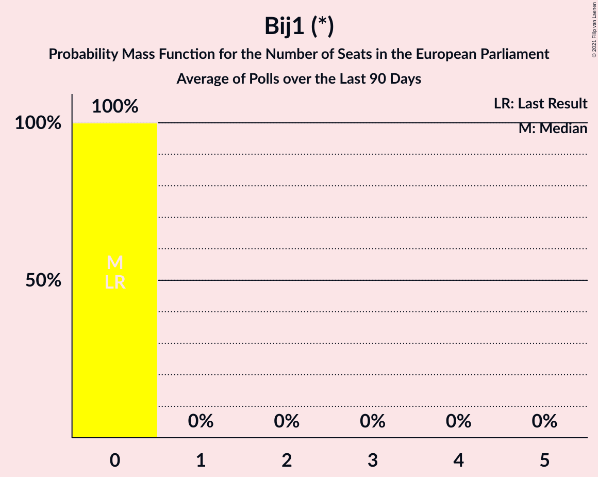

# Bij1 (*)

<a href="#voting-intentions">Voting Intentions</a> | <a href="#seats">Seats</a>

## Voting Intentions

Last result: **0.0%** (General Election of 23 May 2019)

### Confidence Intervals

| Period     | Polling firm/Commissioner(s) | Median | 80% Confidence Interval | 90% Confidence Interval | 95% Confidence Interval | 99% Confidence Interval |
|:----------:|:----------------:|:-----------:|:-----------------------:|:-----------------------:|:-----------------------:|:-----------------------:|
| N/A | [Poll Average](average.html) | 0.8% | 0.5–1.4% | 0.5–1.5% | 0.4–1.6% | 0.3–1.9% |
| [26–29 August 2022](2022-08-29-Ipsos.html) | Ipsos   EenVandaag | 0.7% | 0.5–1.2% | 0.4–1.3% | 0.3–1.4% | 0.2–1.7% |
| [26–27 August 2022](2022-08-27-Peilnl.html) | Peil.nl | 0.7% | 0.5–0.9% | 0.5–1.0% | 0.4–1.0% | 0.4–1.2% |
| [5–6 August 2022](2022-08-06-Peilnl.html) | Peil.nl | 1.3% | 1.1–1.6% | 1.0–1.7% | 1.0–1.8% | 0.9–2.0% |
| [22–25 July 2022](2022-07-25-Ipsos.html) | Ipsos   EenVandaag | 0.9% | 0.6–1.4% | 0.5–1.6% | 0.5–1.7% | 0.4–2.0% |
| [15–18 July 2022](2022-07-18-IOResearch.html) | I&O Research | 1.2% | 0.9–1.6% | 0.8–1.7% | 0.8–1.8% | 0.7–2.0% |
| [8–9 July 2022](2022-07-09-Peilnl.html) | Peil.nl | 1.3% | 1.1–1.6% | 1.0–1.7% | 1.0–1.8% | 0.9–2.0% |
| [24–27 June 2022](2022-06-27-Ipsos.html) | Ipsos   EenVandaag | 0.8% | 0.5–1.3% | 0.4–1.4% | 0.4–1.5% | 0.3–1.8% |
| [24–25 June 2022](2022-06-25-Peilnl.html) | Peil.nl | 1.3% | 1.1–1.6% | 1.0–1.7% | 1.0–1.8% | 0.9–2.0% |
| [17–18 June 2022](2022-06-18-Peilnl.html) | Peil.nl | 1.3% | 1.1–1.6% | 1.0–1.7% | 1.0–1.8% | 0.9–2.0% |
| [10–13 June 2022](2022-06-13-IOResearch.html) | I&O Research | 1.5% | 1.2–1.9% | 1.1–2.0% | 1.0–2.1% | 0.9–2.4% |
| [10–11 June 2022](2022-06-11-Peilnl.html) | Peil.nl | 1.3% | 1.1–1.6% | 1.0–1.7% | 1.0–1.8% | 0.9–2.0% |
| [27–30 May 2022](2022-05-30-Ipsos.html) | Ipsos   EenVandaag | 0.7% | 0.4–1.1% | 0.4–1.3% | 0.3–1.4% | 0.2–1.6% |
| [27–28 May 2022](2022-05-28-Peilnl.html) | Peil.nl | 1.3% | 1.1–1.6% | 1.0–1.7% | 1.0–1.8% | 0.9–2.0% |
| [25–27 May 2022](2022-05-27-Kantar.html) | Kantar | 1.0% | 0.7–1.5% | 0.6–1.7% | 0.6–1.8% | 0.5–2.1% |
| [13–16 May 2022](2022-05-16-IOResearch.html) | I&O Research | 1.0% | 0.8–1.4% | 0.7–1.5% | 0.6–1.6% | 0.5–1.9% |
| [13–14 May 2022](2022-05-14-Peilnl.html) | Peil.nl | 1.3% | 1.1–1.6% | 1.0–1.7% | 1.0–1.8% | 0.9–2.0% |
| [22–25 April 2022](2022-04-25-Ipsos.html) | Ipsos   EenVandaag | 0.8% | 0.5–1.3% | 0.5–1.4% | 0.4–1.6% | 0.3–1.8% |
| [22–23 April 2022](2022-04-23-Peilnl.html) | Peil.nl | 1.3% | 1.1–1.6% | 1.0–1.7% | 1.0–1.8% | 0.9–2.0% |
| [8–11 April 2022](2022-04-11-IOResearch.html) | I&O Research | 0.9% | 0.7–1.2% | 0.6–1.3% | 0.5–1.4% | 0.5–1.5% |
| [8–9 April 2022](2022-04-09-Peilnl.html) | Peil.nl | 0.7% | 0.5–0.9% | 0.5–1.0% | 0.4–1.0% | 0.4–1.2% |
| [1–2 April 2022](2022-04-02-Peilnl.html) | Peil.nl | 0.7% | N/A | N/A | N/A | N/A |
| [25–27 March 2022](2022-03-27-Ipsos.html) | Ipsos   EenVandaag | 0.9% | 0.6–1.4% | 0.5–1.5% | 0.5–1.6% | 0.4–1.9% |
| [25–26 March 2022](2022-03-26-Peilnl.html) | Peil.nl | 0.7% | 0.5–0.9% | 0.5–1.0% | 0.4–1.0% | 0.4–1.2% |
| [18–19 March 2022](2022-03-19-Peilnl.html) | Peil.nl | 0.7% | 0.5–0.9% | 0.5–1.0% | 0.4–1.0% | 0.4–1.2% |
| [11–12 March 2022](2022-03-12-Peilnl.html) | Peil.nl | 0.7% | N/A | N/A | N/A | N/A |
| [9–11 March 2022](2022-03-11-Kantar.html) | Kantar | 1.0% | N/A | N/A | N/A | N/A |
| [4–5 March 2022](2022-03-05-Peilnl.html) | Peil.nl | 0.7% | 0.5–0.9% | 0.5–1.0% | 0.4–1.0% | 0.4–1.2% |
| [25–28 February 2022](2022-02-28-Ipsos.html) | Ipsos   EenVandaag | 0.7% | 0.4–1.2% | 0.4–1.3% | 0.3–1.4% | 0.2–1.7% |
| [26–27 February 2022](2022-02-27-Peilnl.html) | Peil.nl | 0.7% | 0.5–0.9% | 0.5–1.0% | 0.4–1.0% | 0.4–1.2% |
| [18–19 February 2022](2022-02-19-Peilnl.html) | Peil.nl | 0.7% | 0.5–0.9% | 0.5–1.0% | 0.4–1.0% | 0.4–1.2% |
| [11–14 February 2022](2022-02-14-IOResearch.html) | I&O Research | 1.2% | 1.0–1.6% | 0.9–1.7% | 0.8–1.8% | 0.7–1.9% |
| [11–12 February 2022](2022-02-12-Peilnl.html) | Peil.nl | 0.7% | 0.5–0.9% | 0.5–1.0% | 0.4–1.0% | 0.4–1.2% |
| [4–5 February 2022](2022-02-05-Peilnl.html) | Peil.nl | 0.7% | N/A | N/A | N/A | N/A |
| [27–31 January 2022](2022-01-31-Kantar.html) | Kantar | 1.2% | 0.9–1.8% | 0.8–1.9% | 0.7–2.1% | 0.5–2.4% |
| [28–29 January 2022](2022-01-29-Peilnl.html) | Peil.nl | 0.7% | 0.5–0.9% | 0.5–1.0% | 0.4–1.0% | 0.4–1.2% |
| [21–24 January 2022](2022-01-24-Ipsos.html) | Ipsos   EenVandaag | 0.8% | 0.5–1.3% | 0.5–1.4% | 0.4–1.5% | 0.3–1.8% |
| [21–22 January 2022](2022-01-22-Peilnl.html) | Peil.nl | 0.7% | 0.5–0.9% | 0.5–1.0% | 0.4–1.0% | 0.4–1.2% |
| [14–17 January 2022](2022-01-17-IOResearch.html) | I&O Research | 1.3% | 1.0–1.7% | 1.0–1.8% | 0.9–1.9% | 0.8–2.1% |
| [14–15 January 2022](2022-01-15-Peilnl.html) | Peil.nl | 0.7% | N/A | N/A | N/A | N/A |
| [24–25 December 2021](2021-12-25-Peilnl.html) | Peil.nl | 0.7% | 0.5–0.9% | 0.5–1.0% | 0.4–1.0% | 0.4–1.2% |
| [15–20 December 2021](2021-12-20-Kantar.html) | Kantar | 1.0% | 0.7–1.5% | 0.6–1.7% | 0.5–1.8% | 0.4–2.1% |
| [17–20 December 2021](2021-12-20-Ipsos.html) | Ipsos   EenVandaag | 0.9% | 0.6–1.4% | 0.5–1.6% | 0.5–1.7% | 0.4–2.0% |
| [17–18 December 2021](2021-12-18-Peilnl.html) | Peil.nl | 0.7% | 0.5–0.9% | 0.5–1.0% | 0.4–1.0% | 0.4–1.2% |
| [12 December 2021](2021-12-12-Peilnl.html) | Peil.nl | 0.7% | 0.5–0.9% | 0.5–1.0% | 0.4–1.0% | 0.4–1.2% |
| [3–6 December 2021](2021-12-06-IOResearch.html) | I&O Research | 1.4% | 1.1–1.8% | 1.1–1.9% | 1.0–2.0% | 0.9–2.2% |
| [3–5 December 2021](2021-12-05-Peilnl.html) | Peil.nl | 0.7% | 0.5–0.9% | 0.5–1.0% | 0.4–1.0% | 0.4–1.2% |
| [26–29 November 2021](2021-11-29-Ipsos.html) | Ipsos   EenVandaag | 0.7% | 0.5–1.2% | 0.4–1.3% | 0.3–1.4% | 0.2–1.7% |
| [26–27 November 2021](2021-11-27-Peilnl.html) | Peil.nl | 0.7% | 0.5–0.9% | 0.5–1.0% | 0.4–1.0% | 0.4–1.2% |
| [19–20 November 2021](2021-11-20-Peilnl.html) | Peil.nl | 0.7% | 0.5–0.9% | 0.5–1.0% | 0.4–1.0% | 0.4–1.2% |
| [12–15 November 2021](2021-11-15-IOResearch.html) | I&O Research | 1.3% | 1.0–1.7% | 0.9–1.8% | 0.9–1.9% | 0.8–2.1% |
| [5–9 November 2021](2021-11-09-Kantar.html) | Kantar | 1.0% | 0.7–1.6% | 0.6–1.7% | 0.5–1.9% | 0.4–2.2% |
| [7 November 2021](2021-11-07-Peilnl.html) | Peil.nl | 0.7% | N/A | N/A | N/A | N/A |
| [29–30 October 2021](2021-10-30-Peilnl.html) | Peil.nl | 0.7% | 0.5–0.9% | 0.5–1.0% | 0.4–1.0% | 0.4–1.2% |
| [22–25 October 2021](2021-10-25-Ipsos.html) | Ipsos   EenVandaag | 1.1% | 0.8–1.6% | 0.7–1.8% | 0.6–1.9% | 0.5–2.2% |
| [15–16 October 2021](2021-10-16-Peilnl.html) | Peil.nl | 0.7% | N/A | N/A | N/A | N/A |
| [8–11 October 2021](2021-10-11-IOResearch.html) | I&O Research | 1.1% | N/A | N/A | N/A | N/A |
| [8–9 October 2021](2021-10-09-Peilnl.html) | Peil.nl | 0.7% | N/A | N/A | N/A | N/A |
| [1–2 October 2021](2021-10-02-Peilnl.html) | Peil.nl | 0.7% | N/A | N/A | N/A | N/A |
| [24–27 September 2021](2021-09-27-Ipsos.html) | Ipsos | 1.0% | N/A | N/A | N/A | N/A |
| [24–25 September 2021](2021-09-25-Peilnl.html) | Peil.nl | 0.7% | N/A | N/A | N/A | N/A |
| [17–20 September 2021](2021-09-20-Kantar.html) | Kantar | 0.7% | N/A | N/A | N/A | N/A |
| [17–18 September 2021](2021-09-18-Peilnl.html) | Peil.nl | 0.7% | N/A | N/A | N/A | N/A |
| [10–13 September 2021](2021-09-13-IOResearch.html) | I&O Research | 1.6% | N/A | N/A | N/A | N/A |
| [10–11 September 2021](2021-09-11-Peilnl.html) | Peil.nl | 0.7% | N/A | N/A | N/A | N/A |
| [3–4 September 2021](2021-09-04-Peilnl.html) | Peil.nl | 0.7% | N/A | N/A | N/A | N/A |
| [27–30 August 2021](2021-08-30-Ipsos.html) | Ipsos   EenVandaag | 0.7% | N/A | N/A | N/A | N/A |
| [20–21 August 2021](2021-08-21-Peilnl.html) | Peil.nl | 0.7% | N/A | N/A | N/A | N/A |
| [23–26 July 2021](2021-07-26-Ipsos.html) | Ipsos   EenVandaag | 1.0% | 0.7–1.5% | 0.6–1.7% | 0.5–1.8% | 0.4–2.1% |
| [23–24 July 2021](2021-07-24-Peilnl.html) | Peil.nl | 0.7% | 0.5–0.9% | 0.5–1.0% | 0.4–1.0% | 0.4–1.2% |
| [9–12 July 2021](2021-07-12-IOResearch.html) | I&O Research | 2.0% | 1.7–2.5% | 1.6–2.6% | 1.5–2.7% | 1.3–2.9% |
| [25–28 June 2021](2021-06-28-Ipsos.html) | Ipsos   EenVandaag | 0.7% | 0.5–1.2% | 0.4–1.3% | 0.3–1.4% | 0.2–1.7% |
| [27 June 2021](2021-06-27-Peilnl.html) | Peil.nl | 1.3% | 1.1–1.6% | 1.0–1.7% | 1.0–1.8% | 0.9–2.0% |
| [20 June 2021](2021-06-20-Peilnl.html) | Peil.nl | 1.3% | 1.1–1.6% | 1.0–1.7% | 1.0–1.8% | 0.9–2.0% |
| [12 June 2021](2021-06-12-Peilnl.html) | Peil.nl | 1.3% | 1.1–1.6% | 1.0–1.7% | 1.0–1.8% | 0.9–2.0% |
| [4–7 June 2021](2021-06-07-IOResearch.html) | I&O Research | 1.5% | 1.2–1.9% | 1.1–2.0% | 1.0–2.1% | 0.9–2.4% |
| [4–5 June 2021](2021-06-05-Peilnl.html) | Peil.nl | 1.3% | 1.1–1.6% | 1.0–1.7% | 1.0–1.8% | 0.9–2.0% |
| [28–29 May 2021](2021-05-29-Peilnl.html) | Peil.nl | 1.3% | 1.1–1.6% | 1.0–1.7% | 1.0–1.8% | 0.9–2.0% |
| [21–23 May 2021](2021-05-23-Ipsos.html) | Ipsos   EenVandaag | 0.8% | 0.5–1.3% | 0.5–1.4% | 0.4–1.6% | 0.3–1.8% |
| [21–22 May 2021](2021-05-22-Peilnl.html) | Peil.nl | 1.3% | 1.1–1.6% | 1.0–1.7% | 1.0–1.8% | 0.9–2.0% |
| [14–15 May 2021](2021-05-15-Peilnl.html) | Peil.nl | 1.3% | 1.1–1.6% | 1.0–1.7% | 1.0–1.8% | 0.9–2.0% |
| [7–9 May 2021](2021-05-09-Peilnl.html) | Peil.nl | 0.7% | 0.5–0.9% | 0.5–1.0% | 0.4–1.0% | 0.4–1.2% |
| [30 April–3 May 2021](2021-05-03-IOResearch.html) | I&O Research | 1.3% | 1.0–1.7% | 0.9–1.8% | 0.9–1.9% | 0.8–2.1% |
| [30 April–1 May 2021](2021-05-01-Peilnl.html) | Peil.nl | 0.7% | 0.5–0.9% | 0.5–1.0% | 0.4–1.0% | 0.4–1.2% |
| [23–24 April 2021](2021-04-24-Peilnl.html) | Peil.nl | 0.7% | 0.5–0.9% | 0.5–1.0% | 0.4–1.0% | 0.4–1.2% |
| [16–19 April 2021](2021-04-19-Ipsos.html) | Ipsos | 0.7% | 0.5–1.2% | 0.4–1.3% | 0.3–1.4% | 0.2–1.7% |
| [16–17 April 2021](2021-04-17-Peilnl.html) | Peil.nl | 0.7% | 0.5–0.9% | 0.5–1.0% | 0.4–1.0% | 0.4–1.2% |
| [9–12 April 2021](2021-04-12-IOResearch.html) | I&O Research | 1.1% | 0.8–1.4% | 0.8–1.6% | 0.7–1.6% | 0.6–1.8% |
| [9–10 April 2021](2021-04-10-Peilnl.html) | Peil.nl | 0.7% | 0.5–0.9% | 0.5–1.0% | 0.4–1.0% | 0.4–1.2% |
| [3–4 April 2021](2021-04-04-Peilnl.html) | Peil.nl | 0.7% | 0.5–0.9% | 0.5–1.0% | 0.4–1.0% | 0.4–1.2% |
| [26–27 March 2021](2021-03-27-Peilnl.html) | Peil.nl | 0.7% | 0.5–0.9% | 0.5–1.0% | 0.4–1.0% | 0.4–1.2% |
| [16 March 2021](2021-03-16-Peilnl.html) | Peil.nl | 0.7% | 0.5–0.9% | 0.5–1.0% | 0.4–1.0% | 0.4–1.2% |
| [14–16 March 2021](2021-03-16-KantarPublic.html) | Kantar Public | 0.7% | 0.5–0.9% | 0.5–1.0% | 0.4–1.0% | 0.4–1.2% |
| [15–16 March 2021](2021-03-16-Ipsos.html) | Ipsos   EenVandaag | 0.2% | 0.1–0.3% | 0.1–0.4% | 0.1–0.4% | 0.0–0.5% |
| [12–15 March 2021](2021-03-15-IOResearch.html) | I&O Research | 0.7% | 0.5–1.0% | 0.5–1.0% | 0.5–1.1% | 0.4–1.2% |
| [12–13 March 2021](2021-03-13-Peilnl.html) | Peil.nl | 0.7% | 0.5–0.9% | 0.5–1.0% | 0.4–1.0% | 0.4–1.2% |
| [6–8 March 2021](2021-03-08-KantarPublic.html) | Kantar Public | 0.0% | N/A | N/A | N/A | N/A |
| [5–8 March 2021](2021-03-08-Ipsos.html) | Ipsos   EenVandaag | 0.0% | N/A | N/A | N/A | N/A |
| [5–8 March 2021](2021-03-08-IOResearch.html) | I&O Research | 0.7% | 0.5–1.0% | 0.5–1.0% | 0.4–1.1% | 0.4–1.2% |
| [5–6 March 2021](2021-03-06-Peilnl.html) | Peil.nl | 0.7% | 0.5–0.9% | 0.5–1.0% | 0.4–1.0% | 0.4–1.2% |
| [1–2 March 2021](2021-03-02-Ipsos.html) | Ipsos   EenVandaag | 0.0% | N/A | N/A | N/A | N/A |
| [1–2 March 2021](2021-03-02-IOResearch.html) | I&O Research | 0.0% | N/A | N/A | N/A | N/A |
| [26–27 February 2021](2021-02-27-Peilnl.html) | Peil.nl | 0.7% | 0.5–0.9% | 0.5–1.0% | 0.4–1.0% | 0.4–1.2% |
| [22–24 February 2021](2021-02-24-KantarPublic.html) | Kantar Public | 0.0% | N/A | N/A | N/A | N/A |
| [19–20 February 2021](2021-02-20-Peilnl.html) | Peil.nl | 0.7% | 0.5–0.9% | 0.5–1.0% | 0.4–1.0% | 0.4–1.2% |
| [14–15 February 2021](2021-02-15-Ipsos.html) | Ipsos   EenVandaag | 0.0% | N/A | N/A | N/A | N/A |
| [12–15 February 2021](2021-02-15-IOResearch.html) | I&O Research | 0.0% | N/A | N/A | N/A | N/A |
| [12–13 February 2021](2021-02-13-Peilnl.html) | Peil.nl | 0.2% | 0.1–0.3% | 0.1–0.4% | 0.1–0.4% | 0.0–0.5% |
| [5–6 February 2021](2021-02-06-Peilnl.html) | Peil.nl | 0.0% | N/A | N/A | N/A | N/A |
| [29 January–2 February 2021](2021-02-02-IOResearch.html) | I&O Research   De Volkskrant | 0.2% | 0.1–0.4% | 0.1–0.4% | 0.1–0.5% | 0.0–0.6% |
| [29–30 January 2021](2021-01-30-Peilnl.html) | Peil.nl | 0.7% | 0.5–0.9% | 0.5–1.0% | 0.4–1.0% | 0.4–1.2% |
| [23–26 January 2021](2021-01-26-KantarPublic.html) | Kantar Public | 0.0% | N/A | N/A | N/A | N/A |
| [22–25 January 2021](2021-01-25-Ipsos.html) | Ipsos   EenVandaag | 0.0% | N/A | N/A | N/A | N/A |
| [22–25 January 2021](2021-01-25-IOResearch.html) | I&O Research | 0.0% | N/A | N/A | N/A | N/A |
| [22–23 January 2021](2021-01-23-Peilnl.html) | Peil.nl | 0.7% | 0.5–0.9% | 0.5–1.0% | 0.4–1.0% | 0.4–1.2% |
| [15–16 January 2021](2021-01-16-Peilnl.html) | Peil.nl | 0.7% | 0.5–0.9% | 0.5–1.0% | 0.4–1.0% | 0.4–1.2% |
| [8–12 January 2021](2021-01-12-KantarPublic.html) | Kantar Public | 0.0% | N/A | N/A | N/A | N/A |
| [8–11 January 2021](2021-01-11-IOResearch.html) | I&O Research | 0.0% | N/A | N/A | N/A | N/A |
| [8–9 January 2021](2021-01-09-Peilnl.html) | Peil.nl | 0.7% | 0.5–0.9% | 0.5–1.0% | 0.4–1.0% | 0.4–1.2% |
| [1–2 January 2021](2021-01-02-Peilnl.html) | Peil.nl | 0.7% | 0.5–0.9% | 0.5–1.0% | 0.4–1.0% | 0.4–1.2% |
| [18–21 December 2020](2020-12-21-KantarPublic.html) | Kantar Public | 0.0% | N/A | N/A | N/A | N/A |
| [18–21 December 2020](2020-12-21-Ipsos.html) | Ipsos   EenVandaag | 0.0% | N/A | N/A | N/A | N/A |
| [18–19 December 2020](2020-12-19-Peilnl.html) | Peil.nl | 0.0% | N/A | N/A | N/A | N/A |
| [11–14 December 2020](2020-12-14-IOResearch.html) | I&O Research | 0.0% | N/A | N/A | N/A | N/A |
| [11–12 December 2020](2020-12-12-Peilnl.html) | Peil.nl | 0.0% | N/A | N/A | N/A | N/A |
| [4–5 December 2020](2020-12-05-Peilnl.html) | Peil.nl | 0.0% | N/A | N/A | N/A | N/A |
| [26–27 November 2020](2020-11-27-Peilnl.html) | Peil.nl | 0.0% | N/A | N/A | N/A | N/A |
| [20–23 November 2020](2020-11-23-Ipsos.html) | Ipsos   EenVandaag | 0.0% | N/A | N/A | N/A | N/A |
| [20–21 November 2020](2020-11-21-Peilnl.html) | Peil.nl | 0.0% | N/A | N/A | N/A | N/A |
| [9–16 November 2020](2020-11-16-IOResearch.html) | I&O Research | 0.0% | N/A | N/A | N/A | N/A |
| [15 November 2020](2020-11-15-Peilnl.html) | Peil.nl | 0.0% | N/A | N/A | N/A | N/A |
| [7–15 November 2020](2020-11-15-KantarPublic.html) | Kantar Public | 0.0% | N/A | N/A | N/A | N/A |
| [8 November 2020](2020-11-08-Peilnl.html) | Peil.nl | 0.0% | N/A | N/A | N/A | N/A |
| [1 November 2020](2020-11-01-Peilnl.html) | Peil.nl | 0.0% | N/A | N/A | N/A | N/A |
| [23–26 October 2020](2020-10-26-Ipsos.html) | Ipsos   EenVandaag | 0.0% | N/A | N/A | N/A | N/A |
| [16–17 October 2020](2020-10-17-Peilnl.html) | Peil.nl | 0.0% | N/A | N/A | N/A | N/A |
| [9–12 October 2020](2020-10-12-IOResearch.html) | I&O Research | 0.0% | N/A | N/A | N/A | N/A |
| [11 October 2020](2020-10-11-Peilnl.html) | Peil.nl | 0.0% | N/A | N/A | N/A | N/A |
| [4 October 2020](2020-10-04-Peilnl.html) | Peil.nl | 0.0% | N/A | N/A | N/A | N/A |
| [25–29 September 2020](2020-09-29-KantarPublic.html) | Kantar Public | 0.0% | N/A | N/A | N/A | N/A |
| [27 September 2020](2020-09-27-Peilnl.html) | Peil.nl | 0.0% | N/A | N/A | N/A | N/A |
| [25–27 September 2020](2020-09-27-Ipsos.html) | Ipsos   EenVandaag | 0.0% | N/A | N/A | N/A | N/A |
| [18–19 September 2020](2020-09-19-Peilnl.html) | Peil.nl | 0.0% | N/A | N/A | N/A | N/A |
| [3–7 September 2020](2020-09-07-IOResearch.html) | I&O Research | 0.0% | N/A | N/A | N/A | N/A |
| [4–5 September 2020](2020-09-05-Peilnl.html) | Peil.nl | 0.0% | N/A | N/A | N/A | N/A |
| [28–29 August 2020](2020-08-29-Peilnl.html) | Peil.nl | 0.0% | N/A | N/A | N/A | N/A |
| [21–27 August 2020](2020-08-27-Ipsos.html) | Ipsos   EenVandaag | 0.0% | N/A | N/A | N/A | N/A |
| [23 August 2020](2020-08-23-Peilnl.html) | Peil.nl | 0.0% | N/A | N/A | N/A | N/A |
| [14–15 August 2020](2020-08-15-Peilnl.html) | Peil.nl | 0.0% | N/A | N/A | N/A | N/A |
| [9 August 2020](2020-08-09-IOResearch.html) | I&O Research | 0.0% | N/A | N/A | N/A | N/A |
| [26 July 2020](2020-07-26-Peilnl.html) | Peil.nl | 0.0% | N/A | N/A | N/A | N/A |
| [24–26 July 2020](2020-07-26-Ipsos.html) | Ipsos   EenVandaag | 0.0% | N/A | N/A | N/A | N/A |
| [19 July 2020](2020-07-19-Peilnl.html) | Peil.nl | 0.0% | N/A | N/A | N/A | N/A |
| [3–6 July 2020](2020-07-06-IOResearch.html) | I&O Research | 0.0% | N/A | N/A | N/A | N/A |
| [5 July 2020](2020-07-05-Peilnl.html) | Peil.nl | 0.0% | N/A | N/A | N/A | N/A |
| [27–30 June 2020](2020-06-30-Ipsos.html) | Ipsos   EenVandaag | 0.0% | N/A | N/A | N/A | N/A |
| [28 June 2020](2020-06-28-Peilnl.html) | Peil.nl | 0.0% | N/A | N/A | N/A | N/A |
| [23–26 June 2020](2020-06-26-KantarPublic.html) | Kantar Public | 0.0% | N/A | N/A | N/A | N/A |
| [21 June 2020](2020-06-21-Peilnl.html) | Peil.nl | 0.0% | N/A | N/A | N/A | N/A |
| [5–9 June 2020](2020-06-09-IOResearch.html) | I&O Research | 0.0% | N/A | N/A | N/A | N/A |
| [31 May 2020](2020-05-31-Peilnl.html) | Peil.nl | 0.0% | N/A | N/A | N/A | N/A |
| [22–24 May 2020](2020-05-24-Ipsos.html) | Ipsos   EenVandaag | 0.0% | N/A | N/A | N/A | N/A |
| [15–16 May 2020](2020-05-16-Peilnl.html) | Peil.nl | 0.0% | N/A | N/A | N/A | N/A |
| [7–12 May 2020](2020-05-12-IOResearch.html) | I&O Research | 0.0% | N/A | N/A | N/A | N/A |
| [8–9 May 2020](2020-05-09-Peilnl.html) | Peil.nl | 0.0% | N/A | N/A | N/A | N/A |
| [1–2 May 2020](2020-05-02-Peilnl.html) | Peil.nl | 0.0% | N/A | N/A | N/A | N/A |
| [26 April 2020](2020-04-26-Peilnl.html) | Peil.nl | 0.0% | N/A | N/A | N/A | N/A |
| [24–26 April 2020](2020-04-26-Ipsos.html) | Ipsos   EenVandaag | 0.0% | N/A | N/A | N/A | N/A |
| [27–30 March 2020](2020-03-30-Ipsos.html) | Ipsos   EenVandaag | 0.0% | N/A | N/A | N/A | N/A |
| [26–30 March 2020](2020-03-30-IOResearch.html) | I&O Research | 0.0% | N/A | N/A | N/A | N/A |
| [5–10 March 2020](2020-03-10-IOResearch.html) | I&O Research | 0.0% | N/A | N/A | N/A | N/A |
| [1–6 March 2020](2020-03-06-Peilnl.html) | Peil.nl | 0.0% | N/A | N/A | N/A | N/A |
| [23 February–1 March 2020](2020-03-01-Peilnl.html) | Peil.nl | 0.0% | N/A | N/A | N/A | N/A |
| [21–24 February 2020](2020-02-24-Ipsos.html) | Ipsos   EenVandaag | 0.0% | N/A | N/A | N/A | N/A |
| [18–23 February 2020](2020-02-23-Peilnl.html) | Peil.nl | 0.0% | N/A | N/A | N/A | N/A |
| [17–22 February 2020](2020-02-22-Peilnl.html) | Peil.nl | 0.0% | N/A | N/A | N/A | N/A |
| [9–14 February 2020](2020-02-14-Peilnl.html) | Peil.nl | 0.0% | N/A | N/A | N/A | N/A |
| [2–9 February 2020](2020-02-09-Peilnl.html) | Peil.nl | 0.0% | N/A | N/A | N/A | N/A |
| [27 January–1 February 2020](2020-02-01-Peilnl.html) | Peil.nl | 0.0% | N/A | N/A | N/A | N/A |
| [24–27 January 2020](2020-01-27-Ipsos.html) | Ipsos | 0.0% | N/A | N/A | N/A | N/A |
| [21–26 January 2020](2020-01-26-Peilnl.html) | Peil.nl | 0.0% | N/A | N/A | N/A | N/A |
| [10–18 January 2020](2020-01-18-Peilnl.html) | Peil.nl | 0.0% | N/A | N/A | N/A | N/A |
| [10–14 January 2020](2020-01-14-IOResearch.html) | I&O Research | 0.0% | N/A | N/A | N/A | N/A |
| [6–11 January 2020](2020-01-11-Peilnl.html) | Peil.nl | 0.0% | N/A | N/A | N/A | N/A |
| [16–21 December 2019](2019-12-21-Peilnl.html) | Peil.nl | 0.0% | N/A | N/A | N/A | N/A |
| [19–21 December 2019](2019-12-21-Ipsos.html) | Ipsos   EenVandaag | 0.0% | N/A | N/A | N/A | N/A |
| [9–14 December 2019](2019-12-14-Peilnl.html) | Peil.nl | 0.0% | N/A | N/A | N/A | N/A |
| [2–7 December 2019](2019-12-07-Peilnl.html) | Peil.nl | 0.0% | N/A | N/A | N/A | N/A |
| [25–30 November 2019](2019-11-30-Peilnl.html) | Peil.nl | 0.0% | N/A | N/A | N/A | N/A |
| [22–25 November 2019](2019-11-25-Ipsos.html) | Ipsos   EenVandaag | 0.0% | N/A | N/A | N/A | N/A |
| [18–23 November 2019](2019-11-23-Peilnl.html) | Peil.nl | 0.0% | N/A | N/A | N/A | N/A |
| [11–16 November 2019](2019-11-16-Peilnl.html) | Peil.nl | 0.0% | N/A | N/A | N/A | N/A |
| [15 November 2019](2019-11-15-KantarPublic.html) | Kantar Public | 0.0% | N/A | N/A | N/A | N/A |
| [7–13 November 2019](2019-11-13-IOResearch.html) | I&O Research | 0.0% | N/A | N/A | N/A | N/A |
| [4–9 November 2019](2019-11-09-Peilnl.html) | Peil.nl | 0.0% | N/A | N/A | N/A | N/A |
| [28 October–2 November 2019](2019-11-02-Peilnl.html) | Peil.nl | 0.0% | N/A | N/A | N/A | N/A |
| [25–28 October 2019](2019-10-28-Ipsos.html) | Ipsos   EenVandaag | 0.0% | N/A | N/A | N/A | N/A |
| [21–26 October 2019](2019-10-26-Peilnl.html) | Peil.nl | 0.0% | N/A | N/A | N/A | N/A |
| [14–19 October 2019](2019-10-19-Peilnl.html) | Peil.nl | 0.0% | N/A | N/A | N/A | N/A |
| [15 October 2019](2019-10-15-KantarPublic.html) | Kantar Public | 0.0% | N/A | N/A | N/A | N/A |
| [10–15 October 2019](2019-10-15-IOResearch.html) | I&O Research | 0.0% | N/A | N/A | N/A | N/A |
| [7–12 October 2019](2019-10-12-Peilnl.html) | Peil.nl | 0.0% | N/A | N/A | N/A | N/A |
| [30 September–5 October 2019](2019-10-05-Peilnl.html) | Peil.nl | 0.0% | N/A | N/A | N/A | N/A |
| [23–28 September 2019](2019-09-28-Peilnl.html) | Peil.nl | 0.0% | N/A | N/A | N/A | N/A |
| [20–23 September 2019](2019-09-23-Ipsos.html) | Ipsos   EenVandaag | 0.0% | N/A | N/A | N/A | N/A |
| [16–21 September 2019](2019-09-21-Peilnl.html) | Peil.nl | 0.0% | N/A | N/A | N/A | N/A |
| [15 September 2019](2019-09-15-KantarPublic.html) | Kantar Public | 0.0% | N/A | N/A | N/A | N/A |
| [9–14 September 2019](2019-09-14-Peilnl.html) | Peil.nl | 0.0% | N/A | N/A | N/A | N/A |
| [2–7 September 2019](2019-09-07-Peilnl.html) | Peil.nl | 0.0% | N/A | N/A | N/A | N/A |
| [29 August–3 September 2019](2019-09-03-IOResearch.html) | I&O Research | 0.0% | N/A | N/A | N/A | N/A |
| [30 August–2 September 2019](2019-09-02-Ipsos.html) | Ipsos   EenVandaag | 0.0% | N/A | N/A | N/A | N/A |
| [26–31 August 2019](2019-08-31-Peilnl.html) | Peil.nl | 0.0% | N/A | N/A | N/A | N/A |
| [19–24 August 2019](2019-08-24-Peilnl.html) | Peil.nl | 0.0% | N/A | N/A | N/A | N/A |
| [29 July–4 August 2019](2019-08-04-Peilnl.html) | Peil.nl | 0.0% | N/A | N/A | N/A | N/A |
| [29 July 2019](2019-07-29-Peilnl.html) | Peil.nl | 0.0% | N/A | N/A | N/A | N/A |
| [26–29 July 2019](2019-07-29-Ipsos.html) | Ipsos   EenVandaag | 0.0% | N/A | N/A | N/A | N/A |
| [5–9 July 2019](2019-07-09-IOResearch.html) | I&O Research | 0.0% | N/A | N/A | N/A | N/A |
| [1–7 July 2019](2019-07-07-Peilnl.html) | Peil.nl | 0.0% | N/A | N/A | N/A | N/A |
| [24–30 June 2019](2019-06-30-Peilnl.html) | Peil.nl | 0.0% | N/A | N/A | N/A | N/A |
| [21–24 June 2019](2019-06-24-Ipsos.html) | Ipsos   EenVandaag | 0.0% | N/A | N/A | N/A | N/A |
| [17–23 June 2019](2019-06-23-Peilnl.html) | Peil.nl | 0.0% | N/A | N/A | N/A | N/A |
| [10–16 June 2019](2019-06-16-Peilnl.html) | Peil.nl | 0.0% | N/A | N/A | N/A | N/A |
| [3–9 June 2019](2019-06-09-Peilnl.html) | Peil.nl | 0.0% | N/A | N/A | N/A | N/A |
| [27 May–2 June 2019](2019-06-02-Peilnl.html) | Peil.nl | 0.0% | N/A | N/A | N/A | N/A |

### Probability Mass Function

The following table shows the probability mass function per percentage block of voting intentions for the [poll average](average.html) for Bij1 (*).

| Voting Intentions | Probability | Accumulated | Special Marks |
|:-----------------:|:-----------:|:-----------:|:-------------:|
| 0.0–0.5% | 12% | 100% | Last Result |
| 0.5–1.5% | 85% | 88% | Median |
| 1.5–2.5% | 4% | 4% |  |
| 2.5–3.5% | 0% | 0% |  |

## Seats

Last result: **0** seats (General Election of 23 May 2019)

### Confidence Intervals

| Period     | Polling firm/Commissioner(s) | Median | 80% Confidence Interval | 90% Confidence Interval | 95% Confidence Interval | 99% Confidence Interval |
|:----------:|:----------------:|:------:|:-----------------------:|:-----------------------:|:-----------------------:|:-----------------------:|
| N/A | [Poll Average](average.html) | 0 | 0 | 0 | 0 | 0 |
| [26–29 August 2022](2022-08-29-Ipsos.html) | Ipsos   EenVandaag | 0 | 0 | 0 | 0 | 0 |
| [26–27 August 2022](2022-08-27-Peilnl.html) | Peil.nl | 0 | 0 | 0 | 0 | 0 |
| [5–6 August 2022](2022-08-06-Peilnl.html) | Peil.nl | 0 | 0 | 0 | 0 | 0 |
| [22–25 July 2022](2022-07-25-Ipsos.html) | Ipsos   EenVandaag | 0 | 0 | 0 | 0 | 0 |
| [15–18 July 2022](2022-07-18-IOResearch.html) | I&O Research | 0 | 0 | 0 | 0 | 0 |
| [8–9 July 2022](2022-07-09-Peilnl.html) | Peil.nl | 0 | 0 | 0 | 0 | 0 |
| [24–27 June 2022](2022-06-27-Ipsos.html) | Ipsos   EenVandaag | 0 | 0 | 0 | 0 | 0 |
| [24–25 June 2022](2022-06-25-Peilnl.html) | Peil.nl | 0 | 0 | 0 | 0 | 0 |
| [17–18 June 2022](2022-06-18-Peilnl.html) | Peil.nl | 0 | 0 | 0 | 0 | 0 |
| [10–13 June 2022](2022-06-13-IOResearch.html) | I&O Research | 0 | 0 | 0 | 0 | 0 |
| [10–11 June 2022](2022-06-11-Peilnl.html) | Peil.nl | 0 | 0 | 0 | 0 | 0 |
| [27–30 May 2022](2022-05-30-Ipsos.html) | Ipsos   EenVandaag | 0 | 0 | 0 | 0 | 0 |
| [27–28 May 2022](2022-05-28-Peilnl.html) | Peil.nl | 0 | 0 | 0 | 0 | 0 |
| [25–27 May 2022](2022-05-27-Kantar.html) | Kantar | 0 | 0 | 0 | 0 | 0 |
| [13–16 May 2022](2022-05-16-IOResearch.html) | I&O Research | 0 | 0 | 0 | 0 | 0 |
| [13–14 May 2022](2022-05-14-Peilnl.html) | Peil.nl | 0 | 0 | 0 | 0 | 0 |
| [22–25 April 2022](2022-04-25-Ipsos.html) | Ipsos   EenVandaag | 0 | 0 | 0 | 0 | 0 |
| [22–23 April 2022](2022-04-23-Peilnl.html) | Peil.nl | 0 | 0 | 0 | 0 | 0 |
| [8–11 April 2022](2022-04-11-IOResearch.html) | I&O Research | 0 | 0 | 0 | 0 | 0 |
| [8–9 April 2022](2022-04-09-Peilnl.html) | Peil.nl | 0 | 0 | 0 | 0 | 0 |
| [1–2 April 2022](2022-04-02-Peilnl.html) | Peil.nl |  |  |  |  |  |
| [25–27 March 2022](2022-03-27-Ipsos.html) | Ipsos   EenVandaag | 0 | 0 | 0 | 0 | 0 |
| [25–26 March 2022](2022-03-26-Peilnl.html) | Peil.nl | 0 | 0 | 0 | 0 | 0 |
| [18–19 March 2022](2022-03-19-Peilnl.html) | Peil.nl | 0 | 0 | 0 | 0 | 0 |
| [11–12 March 2022](2022-03-12-Peilnl.html) | Peil.nl |  |  |  |  |  |
| [9–11 March 2022](2022-03-11-Kantar.html) | Kantar |  |  |  |  |  |
| [4–5 March 2022](2022-03-05-Peilnl.html) | Peil.nl | 0 | 0 | 0 | 0 | 0 |
| [25–28 February 2022](2022-02-28-Ipsos.html) | Ipsos   EenVandaag | 0 | 0 | 0 | 0 | 0 |
| [26–27 February 2022](2022-02-27-Peilnl.html) | Peil.nl | 0 | 0 | 0 | 0 | 0 |
| [18–19 February 2022](2022-02-19-Peilnl.html) | Peil.nl | 0 | 0 | 0 | 0 | 0 |
| [11–14 February 2022](2022-02-14-IOResearch.html) | I&O Research | 0 | 0 | 0 | 0 | 0 |
| [11–12 February 2022](2022-02-12-Peilnl.html) | Peil.nl | 0 | 0 | 0 | 0 | 0 |
| [4–5 February 2022](2022-02-05-Peilnl.html) | Peil.nl |  |  |  |  |  |
| [27–31 January 2022](2022-01-31-Kantar.html) | Kantar | 0 | 0 | 0 | 0 | 0 |
| [28–29 January 2022](2022-01-29-Peilnl.html) | Peil.nl | 0 | 0 | 0 | 0 | 0 |
| [21–24 January 2022](2022-01-24-Ipsos.html) | Ipsos   EenVandaag | 0 | 0 | 0 | 0 | 0 |
| [21–22 January 2022](2022-01-22-Peilnl.html) | Peil.nl | 0 | 0 | 0 | 0 | 0 |
| [14–17 January 2022](2022-01-17-IOResearch.html) | I&O Research | 0 | 0 | 0 | 0 | 0 |
| [14–15 January 2022](2022-01-15-Peilnl.html) | Peil.nl |  |  |  |  |  |
| [24–25 December 2021](2021-12-25-Peilnl.html) | Peil.nl | 0 | 0 | 0 | 0 | 0 |
| [15–20 December 2021](2021-12-20-Kantar.html) | Kantar | 0 | 0 | 0 | 0 | 0 |
| [17–20 December 2021](2021-12-20-Ipsos.html) | Ipsos   EenVandaag | 0 | 0 | 0 | 0 | 0 |
| [17–18 December 2021](2021-12-18-Peilnl.html) | Peil.nl | 0 | 0 | 0 | 0 | 0 |
| [12 December 2021](2021-12-12-Peilnl.html) | Peil.nl | 0 | 0 | 0 | 0 | 0 |
| [3–6 December 2021](2021-12-06-IOResearch.html) | I&O Research | 0 | 0 | 0 | 0 | 0 |
| [3–5 December 2021](2021-12-05-Peilnl.html) | Peil.nl | 0 | 0 | 0 | 0 | 0 |
| [26–29 November 2021](2021-11-29-Ipsos.html) | Ipsos   EenVandaag | 0 | 0 | 0 | 0 | 0 |
| [26–27 November 2021](2021-11-27-Peilnl.html) | Peil.nl | 0 | 0 | 0 | 0 | 0 |
| [19–20 November 2021](2021-11-20-Peilnl.html) | Peil.nl | 0 | 0 | 0 | 0 | 0 |
| [12–15 November 2021](2021-11-15-IOResearch.html) | I&O Research | 0 | 0 | 0 | 0 | 0 |
| [5–9 November 2021](2021-11-09-Kantar.html) | Kantar | 0 | 0 | 0 | 0 | 0 |
| [7 November 2021](2021-11-07-Peilnl.html) | Peil.nl |  |  |  |  |  |
| [29–30 October 2021](2021-10-30-Peilnl.html) | Peil.nl | 0 | 0 | 0 | 0 | 0 |
| [22–25 October 2021](2021-10-25-Ipsos.html) | Ipsos   EenVandaag | 0 | 0 | 0 | 0 | 0 |
| [15–16 October 2021](2021-10-16-Peilnl.html) | Peil.nl |  |  |  |  |  |
| [8–11 October 2021](2021-10-11-IOResearch.html) | I&O Research |  |  |  |  |  |
| [8–9 October 2021](2021-10-09-Peilnl.html) | Peil.nl |  |  |  |  |  |
| [1–2 October 2021](2021-10-02-Peilnl.html) | Peil.nl |  |  |  |  |  |
| [24–27 September 2021](2021-09-27-Ipsos.html) | Ipsos |  |  |  |  |  |
| [24–25 September 2021](2021-09-25-Peilnl.html) | Peil.nl |  |  |  |  |  |
| [17–20 September 2021](2021-09-20-Kantar.html) | Kantar |  |  |  |  |  |
| [17–18 September 2021](2021-09-18-Peilnl.html) | Peil.nl |  |  |  |  |  |
| [10–13 September 2021](2021-09-13-IOResearch.html) | I&O Research |  |  |  |  |  |
| [10–11 September 2021](2021-09-11-Peilnl.html) | Peil.nl |  |  |  |  |  |
| [3–4 September 2021](2021-09-04-Peilnl.html) | Peil.nl |  |  |  |  |  |
| [27–30 August 2021](2021-08-30-Ipsos.html) | Ipsos   EenVandaag |  |  |  |  |  |
| [20–21 August 2021](2021-08-21-Peilnl.html) | Peil.nl |  |  |  |  |  |
| [23–26 July 2021](2021-07-26-Ipsos.html) | Ipsos   EenVandaag | 0 | 0 | 0 | 0 | 0 |
| [23–24 July 2021](2021-07-24-Peilnl.html) | Peil.nl | 0 | 0 | 0 | 0 | 0 |
| [9–12 July 2021](2021-07-12-IOResearch.html) | I&O Research | 0 | 0 | 0 | 0 | 0 |
| [25–28 June 2021](2021-06-28-Ipsos.html) | Ipsos   EenVandaag | 0 | 0 | 0 | 0 | 0 |
| [27 June 2021](2021-06-27-Peilnl.html) | Peil.nl | 0 | 0 | 0 | 0 | 0 |
| [20 June 2021](2021-06-20-Peilnl.html) | Peil.nl | 0 | 0 | 0 | 0 | 0 |
| [12 June 2021](2021-06-12-Peilnl.html) | Peil.nl | 0 | 0 | 0 | 0 | 0 |
| [4–7 June 2021](2021-06-07-IOResearch.html) | I&O Research | 0 | 0 | 0 | 0 | 0 |
| [4–5 June 2021](2021-06-05-Peilnl.html) | Peil.nl | 0 | 0 | 0 | 0 | 0 |
| [28–29 May 2021](2021-05-29-Peilnl.html) | Peil.nl | 0 | 0 | 0 | 0 | 0 |
| [21–23 May 2021](2021-05-23-Ipsos.html) | Ipsos   EenVandaag | 0 | 0 | 0 | 0 | 0 |
| [21–22 May 2021](2021-05-22-Peilnl.html) | Peil.nl | 0 | 0 | 0 | 0 | 0 |
| [14–15 May 2021](2021-05-15-Peilnl.html) | Peil.nl | 0 | 0 | 0 | 0 | 0 |
| [7–9 May 2021](2021-05-09-Peilnl.html) | Peil.nl | 0 | 0 | 0 | 0 | 0 |
| [30 April–3 May 2021](2021-05-03-IOResearch.html) | I&O Research | 0 | 0 | 0 | 0 | 0 |
| [30 April–1 May 2021](2021-05-01-Peilnl.html) | Peil.nl | 0 | 0 | 0 | 0 | 0 |
| [23–24 April 2021](2021-04-24-Peilnl.html) | Peil.nl | 0 | 0 | 0 | 0 | 0 |
| [16–19 April 2021](2021-04-19-Ipsos.html) | Ipsos | 0 | 0 | 0 | 0 | 0 |
| [16–17 April 2021](2021-04-17-Peilnl.html) | Peil.nl | 0 | 0 | 0 | 0 | 0 |
| [9–12 April 2021](2021-04-12-IOResearch.html) | I&O Research | 0 | 0 | 0 | 0 | 0 |
| [9–10 April 2021](2021-04-10-Peilnl.html) | Peil.nl | 0 | 0 | 0 | 0 | 0 |
| [3–4 April 2021](2021-04-04-Peilnl.html) | Peil.nl | 0 | 0 | 0 | 0 | 0 |
| [26–27 March 2021](2021-03-27-Peilnl.html) | Peil.nl | 0 | 0 | 0 | 0 | 0 |
| [16 March 2021](2021-03-16-Peilnl.html) | Peil.nl | 0 | 0 | 0 | 0 | 0 |
| [14–16 March 2021](2021-03-16-KantarPublic.html) | Kantar Public | 0 | 0 | 0 | 0 | 0 |
| [15–16 March 2021](2021-03-16-Ipsos.html) | Ipsos   EenVandaag | 0 | 0 | 0 | 0 | 0 |
| [12–15 March 2021](2021-03-15-IOResearch.html) | I&O Research | 0 | 0 | 0 | 0 | 0 |
| [12–13 March 2021](2021-03-13-Peilnl.html) | Peil.nl | 0 | 0 | 0 | 0 | 0 |
| [6–8 March 2021](2021-03-08-KantarPublic.html) | Kantar Public |  |  |  |  |  |
| [5–8 March 2021](2021-03-08-Ipsos.html) | Ipsos   EenVandaag |  |  |  |  |  |
| [5–8 March 2021](2021-03-08-IOResearch.html) | I&O Research | 0 | 0 | 0 | 0 | 0 |
| [5–6 March 2021](2021-03-06-Peilnl.html) | Peil.nl | 0 | 0 | 0 | 0 | 0 |
| [1–2 March 2021](2021-03-02-Ipsos.html) | Ipsos   EenVandaag |  |  |  |  |  |
| [1–2 March 2021](2021-03-02-IOResearch.html) | I&O Research |  |  |  |  |  |
| [26–27 February 2021](2021-02-27-Peilnl.html) | Peil.nl | 0 | 0 | 0 | 0 | 0 |
| [22–24 February 2021](2021-02-24-KantarPublic.html) | Kantar Public |  |  |  |  |  |
| [19–20 February 2021](2021-02-20-Peilnl.html) | Peil.nl | 0 | 0 | 0 | 0 | 0 |
| [14–15 February 2021](2021-02-15-Ipsos.html) | Ipsos   EenVandaag |  |  |  |  |  |
| [12–15 February 2021](2021-02-15-IOResearch.html) | I&O Research |  |  |  |  |  |
| [12–13 February 2021](2021-02-13-Peilnl.html) | Peil.nl | 0 | 0 | 0 | 0 | 0 |
| [5–6 February 2021](2021-02-06-Peilnl.html) | Peil.nl |  |  |  |  |  |
| [29 January–2 February 2021](2021-02-02-IOResearch.html) | I&O Research   De Volkskrant | 0 | 0 | 0 | 0 | 0 |
| [29–30 January 2021](2021-01-30-Peilnl.html) | Peil.nl | 0 | 0 | 0 | 0 | 0 |
| [23–26 January 2021](2021-01-26-KantarPublic.html) | Kantar Public |  |  |  |  |  |
| [22–25 January 2021](2021-01-25-Ipsos.html) | Ipsos   EenVandaag |  |  |  |  |  |
| [22–25 January 2021](2021-01-25-IOResearch.html) | I&O Research |  |  |  |  |  |
| [22–23 January 2021](2021-01-23-Peilnl.html) | Peil.nl | 0 | 0 | 0 | 0 | 0 |
| [15–16 January 2021](2021-01-16-Peilnl.html) | Peil.nl | 0 | 0 | 0 | 0 | 0 |
| [8–12 January 2021](2021-01-12-KantarPublic.html) | Kantar Public |  |  |  |  |  |
| [8–11 January 2021](2021-01-11-IOResearch.html) | I&O Research |  |  |  |  |  |
| [8–9 January 2021](2021-01-09-Peilnl.html) | Peil.nl | 0 | 0 | 0 | 0 | 0 |
| [1–2 January 2021](2021-01-02-Peilnl.html) | Peil.nl | 0 | 0 | 0 | 0 | 0 |
| [18–21 December 2020](2020-12-21-KantarPublic.html) | Kantar Public |  |  |  |  |  |
| [18–21 December 2020](2020-12-21-Ipsos.html) | Ipsos   EenVandaag |  |  |  |  |  |
| [18–19 December 2020](2020-12-19-Peilnl.html) | Peil.nl |  |  |  |  |  |
| [11–14 December 2020](2020-12-14-IOResearch.html) | I&O Research |  |  |  |  |  |
| [11–12 December 2020](2020-12-12-Peilnl.html) | Peil.nl |  |  |  |  |  |
| [4–5 December 2020](2020-12-05-Peilnl.html) | Peil.nl |  |  |  |  |  |
| [26–27 November 2020](2020-11-27-Peilnl.html) | Peil.nl |  |  |  |  |  |
| [20–23 November 2020](2020-11-23-Ipsos.html) | Ipsos   EenVandaag |  |  |  |  |  |
| [20–21 November 2020](2020-11-21-Peilnl.html) | Peil.nl |  |  |  |  |  |
| [9–16 November 2020](2020-11-16-IOResearch.html) | I&O Research |  |  |  |  |  |
| [15 November 2020](2020-11-15-Peilnl.html) | Peil.nl |  |  |  |  |  |
| [7–15 November 2020](2020-11-15-KantarPublic.html) | Kantar Public |  |  |  |  |  |
| [8 November 2020](2020-11-08-Peilnl.html) | Peil.nl |  |  |  |  |  |
| [1 November 2020](2020-11-01-Peilnl.html) | Peil.nl |  |  |  |  |  |
| [23–26 October 2020](2020-10-26-Ipsos.html) | Ipsos   EenVandaag |  |  |  |  |  |
| [16–17 October 2020](2020-10-17-Peilnl.html) | Peil.nl |  |  |  |  |  |
| [9–12 October 2020](2020-10-12-IOResearch.html) | I&O Research |  |  |  |  |  |
| [11 October 2020](2020-10-11-Peilnl.html) | Peil.nl |  |  |  |  |  |
| [4 October 2020](2020-10-04-Peilnl.html) | Peil.nl |  |  |  |  |  |
| [25–29 September 2020](2020-09-29-KantarPublic.html) | Kantar Public |  |  |  |  |  |
| [27 September 2020](2020-09-27-Peilnl.html) | Peil.nl |  |  |  |  |  |
| [25–27 September 2020](2020-09-27-Ipsos.html) | Ipsos   EenVandaag |  |  |  |  |  |
| [18–19 September 2020](2020-09-19-Peilnl.html) | Peil.nl |  |  |  |  |  |
| [3–7 September 2020](2020-09-07-IOResearch.html) | I&O Research |  |  |  |  |  |
| [4–5 September 2020](2020-09-05-Peilnl.html) | Peil.nl |  |  |  |  |  |
| [28–29 August 2020](2020-08-29-Peilnl.html) | Peil.nl |  |  |  |  |  |
| [21–27 August 2020](2020-08-27-Ipsos.html) | Ipsos   EenVandaag |  |  |  |  |  |
| [23 August 2020](2020-08-23-Peilnl.html) | Peil.nl |  |  |  |  |  |
| [14–15 August 2020](2020-08-15-Peilnl.html) | Peil.nl |  |  |  |  |  |
| [9 August 2020](2020-08-09-IOResearch.html) | I&O Research |  |  |  |  |  |
| [26 July 2020](2020-07-26-Peilnl.html) | Peil.nl |  |  |  |  |  |
| [24–26 July 2020](2020-07-26-Ipsos.html) | Ipsos   EenVandaag |  |  |  |  |  |
| [19 July 2020](2020-07-19-Peilnl.html) | Peil.nl |  |  |  |  |  |
| [3–6 July 2020](2020-07-06-IOResearch.html) | I&O Research |  |  |  |  |  |
| [5 July 2020](2020-07-05-Peilnl.html) | Peil.nl |  |  |  |  |  |
| [27–30 June 2020](2020-06-30-Ipsos.html) | Ipsos   EenVandaag |  |  |  |  |  |
| [28 June 2020](2020-06-28-Peilnl.html) | Peil.nl |  |  |  |  |  |
| [23–26 June 2020](2020-06-26-KantarPublic.html) | Kantar Public |  |  |  |  |  |
| [21 June 2020](2020-06-21-Peilnl.html) | Peil.nl |  |  |  |  |  |
| [5–9 June 2020](2020-06-09-IOResearch.html) | I&O Research |  |  |  |  |  |
| [31 May 2020](2020-05-31-Peilnl.html) | Peil.nl |  |  |  |  |  |
| [22–24 May 2020](2020-05-24-Ipsos.html) | Ipsos   EenVandaag |  |  |  |  |  |
| [15–16 May 2020](2020-05-16-Peilnl.html) | Peil.nl |  |  |  |  |  |
| [7–12 May 2020](2020-05-12-IOResearch.html) | I&O Research |  |  |  |  |  |
| [8–9 May 2020](2020-05-09-Peilnl.html) | Peil.nl |  |  |  |  |  |
| [1–2 May 2020](2020-05-02-Peilnl.html) | Peil.nl |  |  |  |  |  |
| [26 April 2020](2020-04-26-Peilnl.html) | Peil.nl |  |  |  |  |  |
| [24–26 April 2020](2020-04-26-Ipsos.html) | Ipsos   EenVandaag |  |  |  |  |  |
| [27–30 March 2020](2020-03-30-Ipsos.html) | Ipsos   EenVandaag |  |  |  |  |  |
| [26–30 March 2020](2020-03-30-IOResearch.html) | I&O Research |  |  |  |  |  |
| [5–10 March 2020](2020-03-10-IOResearch.html) | I&O Research |  |  |  |  |  |
| [1–6 March 2020](2020-03-06-Peilnl.html) | Peil.nl |  |  |  |  |  |
| [23 February–1 March 2020](2020-03-01-Peilnl.html) | Peil.nl |  |  |  |  |  |
| [21–24 February 2020](2020-02-24-Ipsos.html) | Ipsos   EenVandaag |  |  |  |  |  |
| [18–23 February 2020](2020-02-23-Peilnl.html) | Peil.nl |  |  |  |  |  |
| [17–22 February 2020](2020-02-22-Peilnl.html) | Peil.nl |  |  |  |  |  |
| [9–14 February 2020](2020-02-14-Peilnl.html) | Peil.nl |  |  |  |  |  |
| [2–9 February 2020](2020-02-09-Peilnl.html) | Peil.nl |  |  |  |  |  |
| [27 January–1 February 2020](2020-02-01-Peilnl.html) | Peil.nl |  |  |  |  |  |
| [24–27 January 2020](2020-01-27-Ipsos.html) | Ipsos |  |  |  |  |  |
| [21–26 January 2020](2020-01-26-Peilnl.html) | Peil.nl |  |  |  |  |  |
| [10–18 January 2020](2020-01-18-Peilnl.html) | Peil.nl |  |  |  |  |  |
| [10–14 January 2020](2020-01-14-IOResearch.html) | I&O Research |  |  |  |  |  |
| [6–11 January 2020](2020-01-11-Peilnl.html) | Peil.nl |  |  |  |  |  |
| [16–21 December 2019](2019-12-21-Peilnl.html) | Peil.nl |  |  |  |  |  |
| [19–21 December 2019](2019-12-21-Ipsos.html) | Ipsos   EenVandaag |  |  |  |  |  |
| [9–14 December 2019](2019-12-14-Peilnl.html) | Peil.nl |  |  |  |  |  |
| [2–7 December 2019](2019-12-07-Peilnl.html) | Peil.nl |  |  |  |  |  |
| [25–30 November 2019](2019-11-30-Peilnl.html) | Peil.nl |  |  |  |  |  |
| [22–25 November 2019](2019-11-25-Ipsos.html) | Ipsos   EenVandaag |  |  |  |  |  |
| [18–23 November 2019](2019-11-23-Peilnl.html) | Peil.nl |  |  |  |  |  |
| [11–16 November 2019](2019-11-16-Peilnl.html) | Peil.nl |  |  |  |  |  |
| [15 November 2019](2019-11-15-KantarPublic.html) | Kantar Public |  |  |  |  |  |
| [7–13 November 2019](2019-11-13-IOResearch.html) | I&O Research |  |  |  |  |  |
| [4–9 November 2019](2019-11-09-Peilnl.html) | Peil.nl |  |  |  |  |  |
| [28 October–2 November 2019](2019-11-02-Peilnl.html) | Peil.nl |  |  |  |  |  |
| [25–28 October 2019](2019-10-28-Ipsos.html) | Ipsos   EenVandaag |  |  |  |  |  |
| [21–26 October 2019](2019-10-26-Peilnl.html) | Peil.nl |  |  |  |  |  |
| [14–19 October 2019](2019-10-19-Peilnl.html) | Peil.nl |  |  |  |  |  |
| [15 October 2019](2019-10-15-KantarPublic.html) | Kantar Public |  |  |  |  |  |
| [10–15 October 2019](2019-10-15-IOResearch.html) | I&O Research |  |  |  |  |  |
| [7–12 October 2019](2019-10-12-Peilnl.html) | Peil.nl |  |  |  |  |  |
| [30 September–5 October 2019](2019-10-05-Peilnl.html) | Peil.nl |  |  |  |  |  |
| [23–28 September 2019](2019-09-28-Peilnl.html) | Peil.nl |  |  |  |  |  |
| [20–23 September 2019](2019-09-23-Ipsos.html) | Ipsos   EenVandaag |  |  |  |  |  |
| [16–21 September 2019](2019-09-21-Peilnl.html) | Peil.nl |  |  |  |  |  |
| [15 September 2019](2019-09-15-KantarPublic.html) | Kantar Public |  |  |  |  |  |
| [9–14 September 2019](2019-09-14-Peilnl.html) | Peil.nl |  |  |  |  |  |
| [2–7 September 2019](2019-09-07-Peilnl.html) | Peil.nl |  |  |  |  |  |
| [29 August–3 September 2019](2019-09-03-IOResearch.html) | I&O Research |  |  |  |  |  |
| [30 August–2 September 2019](2019-09-02-Ipsos.html) | Ipsos   EenVandaag |  |  |  |  |  |
| [26–31 August 2019](2019-08-31-Peilnl.html) | Peil.nl |  |  |  |  |  |
| [19–24 August 2019](2019-08-24-Peilnl.html) | Peil.nl |  |  |  |  |  |
| [29 July–4 August 2019](2019-08-04-Peilnl.html) | Peil.nl |  |  |  |  |  |
| [29 July 2019](2019-07-29-Peilnl.html) | Peil.nl |  |  |  |  |  |
| [26–29 July 2019](2019-07-29-Ipsos.html) | Ipsos   EenVandaag |  |  |  |  |  |
| [5–9 July 2019](2019-07-09-IOResearch.html) | I&O Research |  |  |  |  |  |
| [1–7 July 2019](2019-07-07-Peilnl.html) | Peil.nl |  |  |  |  |  |
| [24–30 June 2019](2019-06-30-Peilnl.html) | Peil.nl |  |  |  |  |  |
| [21–24 June 2019](2019-06-24-Ipsos.html) | Ipsos   EenVandaag |  |  |  |  |  |
| [17–23 June 2019](2019-06-23-Peilnl.html) | Peil.nl |  |  |  |  |  |
| [10–16 June 2019](2019-06-16-Peilnl.html) | Peil.nl |  |  |  |  |  |
| [3–9 June 2019](2019-06-09-Peilnl.html) | Peil.nl |  |  |  |  |  |
| [27 May–2 June 2019](2019-06-02-Peilnl.html) | Peil.nl |  |  |  |  |  |

### Probability Mass Function

The following table shows the probability mass function per seat for the [poll average](average.html) for Bij1 (*).

| Number of Seats | Probability | Accumulated | Special Marks |
|:---------------:|:-----------:|:-----------:|:-------------:|
| 0 | 100% | 100% | Last Result, Median |

