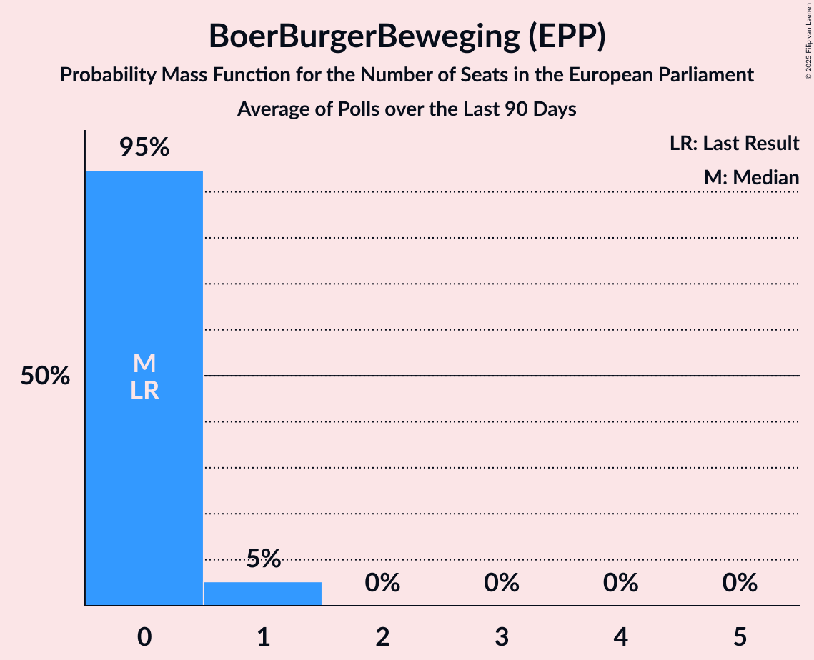

# BoerBurgerBeweging (EPP)

<a href="#voting-intentions">Voting Intentions</a> | <a href="#seats">Seats</a>

## Voting Intentions

Last result: **0.0%** (General Election of 6 June 2024)

### Confidence Intervals

| Period     | Polling firm/Commissioner(s) | Median | 80% Confidence Interval | 90% Confidence Interval | 95% Confidence Interval | 99% Confidence Interval |
|:----------:|:----------------:|:-----------:|:-----------------------:|:-----------------------:|:-----------------------:|:-----------------------:|
| N/A | [Poll Average](average.html) | 5.4% | 4.7–6.1% | 4.5–6.4% | 4.3–6.6% | 3.9–7.2% |
| [26–29 July 2024](2024-07-29-IpsosIO.html) | Ipsos I&O   EenVandaag | 5.3% | 4.5–6.3% | 4.3–6.6% | 4.1–6.9% | 3.7–7.4% |
| [6 July 2024](2024-07-06-Peilnl.html) | Peil.nl | 5.3% | 4.8–5.9% | 4.7–6.1% | 4.6–6.2% | 4.4–6.5% |
| [28–29 June 2024](2024-06-29-Peilnl.html) | Peil.nl | 5.3% | 4.8–5.9% | 4.7–6.1% | 4.6–6.2% | 4.4–6.5% |
| [21–24 June 2024](2024-06-24-IpsosIO.html) | Ipsos I&O   EenVandaag | 4.0% | 3.3–4.9% | 3.1–5.2% | 3.0–5.4% | 2.7–5.9% |
| [14–17 June 2024](2024-06-17-IpsosIO.html) | Ipsos I&O | 4.7% | N/A | N/A | N/A | N/A |

### Probability Mass Function

The following table shows the probability mass function per percentage block of voting intentions for the [poll average](average.html) for BoerBurgerBeweging (EPP).

| Voting Intentions | Probability | Accumulated | Special Marks |
|:-----------------:|:-----------:|:-----------:|:-------------:|
| 0.0–0.5% | 0% | 100% | Last Result |
| 0.5–1.5% | 0% | 100% |  |
| 1.5–2.5% | 0% | 100% |  |
| 2.5–3.5% | 0.1% | 100% |  |
| 3.5–4.5% | 7% | 99.9% |  |
| 4.5–5.5% | 57% | 93% | Median |
| 5.5–6.5% | 33% | 36% |  |
| 6.5–7.5% | 3% | 3% |  |
| 7.5–8.5% | 0.1% | 0.1% |  |
| 8.5–9.5% | 0% | 0% |  |

## Seats

Last result: **0** seats (General Election of 6 June 2024)

### Confidence Intervals

| Period     | Polling firm/Commissioner(s) | Median | 80% Confidence Interval | 90% Confidence Interval | 95% Confidence Interval | 99% Confidence Interval |
|:----------:|:----------------:|:------:|:-----------------------:|:-----------------------:|:-----------------------:|:-----------------------:|
| N/A | [Poll Average](average.html) | 2 | 2 | 2 | 2 | 1–2 |
| [26–29 July 2024](2024-07-29-IpsosIO.html) | Ipsos I&O   EenVandaag | 2 | 2 | 2 | 2 | 1–2 |
| [6 July 2024](2024-07-06-Peilnl.html) | Peil.nl | 2 | 2 | 2 | 2 | 1–2 |
| [28–29 June 2024](2024-06-29-Peilnl.html) | Peil.nl | 2 | 1–2 | 1–2 | 1–2 | 1–2 |
| [21–24 June 2024](2024-06-24-IpsosIO.html) | Ipsos I&O   EenVandaag | 1 | 1–2 | 1–2 | 0–2 | 0–2 |
| [14–17 June 2024](2024-06-17-IpsosIO.html) | Ipsos I&O |  |  |  |  |  |

### Probability Mass Function

The following table shows the probability mass function per seat for the [poll average](average.html) for BoerBurgerBeweging (EPP).

| Number of Seats | Probability | Accumulated | Special Marks |
|:---------------:|:-----------:|:-----------:|:-------------:|
| 0 | 0% | 100% | Last Result |
| 1 | 1.3% | 100% |  |
| 2 | 98.7% | 98.7% | Median |
| 3 | 0% | 0% |  |

