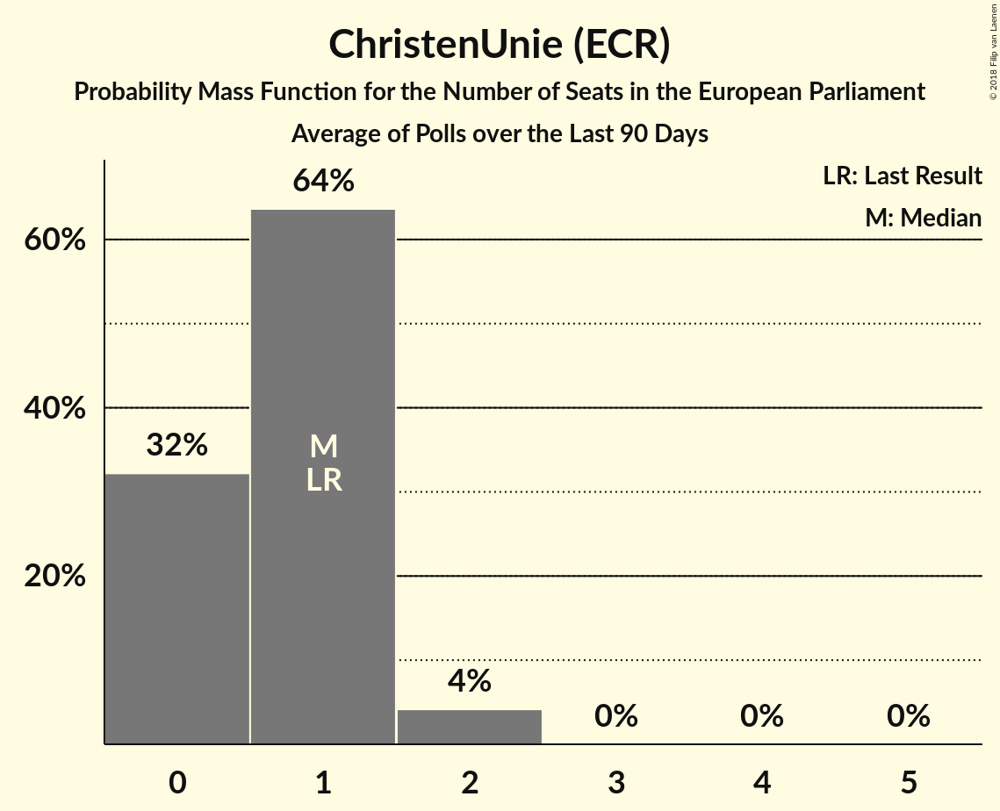

# ChristenUnie (ECR)

<a href="#voting-intentions">Voting Intentions</a> | <a href="#seats">Seats</a>

## Voting Intentions

Last result: **7.7%** (General Election of 22 May 2014)

### Confidence Intervals

| Period     | Polling firm/Commissioner(s) | Median | 80% Confidence Interval | 90% Confidence Interval | 95% Confidence Interval | 99% Confidence Interval |
|:----------:|:----------------:|:-----------:|:-----------------------:|:-----------------------:|:-----------------------:|:-----------------------:|
| N/A | [Poll Average](average.html) | 4.8% | 3.9–5.8% | 3.6–6.1% | 3.4–6.3% | 3.0–6.7% |
| [25–31 March 2019](2019-03-31-Peilnl.html) | Peil.nl | 4.7% | 4.2–5.2% | 4.1–5.3% | 4.0–5.5% | 3.7–5.8% |
| [18–24 March 2019](2019-03-24-Peilnl.html) | Peil.nl | 4.7% | 4.2–5.2% | 4.1–5.3% | 4.0–5.5% | 3.7–5.8% |
| [11–17 March 2019](2019-03-17-Peilnl.html) | Peil.nl | 4.7% | 4.2–5.2% | 4.1–5.3% | 4.0–5.5% | 3.7–5.8% |
| [8–12 March 2019](2019-03-12-IOResearch.html) | I&O Research | 5.5% | 4.9–6.2% | 4.8–6.4% | 4.6–6.6% | 4.3–6.9% |
| [4–10 March 2019](2019-03-10-Peilnl.html) | Peil.nl | 4.7% | 4.2–5.2% | 4.1–5.3% | 4.0–5.5% | 3.7–5.8% |
| [25 February–3 March 2019](2019-03-03-Peilnl.html) | Peil.nl | 4.7% | 4.2–5.2% | 4.1–5.3% | 4.0–5.5% | 3.7–5.8% |
| [22–26 February 2019](2019-02-26-IOResearch.html) | I&O Research | 4.7% | 4.1–5.4% | 4.0–5.5% | 3.8–5.7% | 3.6–6.1% |
| [18–24 February 2019](2019-02-24-Peilnl.html) | Peil.nl | 4.7% | 4.2–5.2% | 4.1–5.3% | 4.0–5.5% | 3.7–5.8% |
| [22–24 February 2019](2019-02-24-Ipsos.html) | Ipsos   EenVandaag | 4.2% | 3.5–5.1% | 3.3–5.4% | 3.1–5.6% | 2.8–6.1% |
| [11–17 February 2019](2019-02-17-Peilnl.html) | Peil.nl | 4.7% | 4.2–5.2% | 4.1–5.3% | 4.0–5.5% | 3.7–5.8% |
| [4–10 February 2019](2019-02-10-Peilnl.html) | Peil.nl | 4.7% | 4.2–5.2% | 4.1–5.3% | 4.0–5.5% | 3.7–5.8% |
| [28 January–3 February 2019](2019-02-03-Peilnl.html) | Peil.nl | 4.0% | 3.6–4.5% | 3.4–4.6% | 3.4–4.8% | 3.2–5.0% |
| [25–28 January 2019](2019-01-28-Ipsos.html) | Ipsos   EenVandaag | 4.7% | 3.9–5.7% | 3.7–5.9% | 3.5–6.2% | 3.2–6.7% |
| [21–27 January 2019](2019-01-27-Peilnl.html) | Peil.nl | 4.0% | 3.6–4.5% | 3.4–4.6% | 3.4–4.8% | 3.2–5.0% |
| [18–22 January 2019](2019-01-22-IOResearch.html) | I&O Research | 4.8% | 4.4–5.3% | 4.3–5.4% | 4.1–5.5% | 3.9–5.8% |
| [14–20 January 2019](2019-01-20-Peilnl.html) | Peil.nl | 4.0% | 3.6–4.5% | 3.4–4.6% | 3.4–4.8% | 3.2–5.0% |
| [7–13 January 2019](2019-01-13-Peilnl.html) | Peil.nl | 4.7% | 4.2–5.2% | 4.1–5.3% | 4.0–5.5% | 3.7–5.8% |
| [14–17 December 2018](2018-12-17-Ipsos.html) | Ipsos   EenVandaag | 4.4% | 3.7–5.4% | 3.5–5.7% | 3.3–5.9% | 3.0–6.4% |
| [10–16 December 2018](2018-12-16-Peilnl.html) | Peil.nl | 4.7% | 4.2–5.2% | 4.1–5.3% | 4.0–5.5% | 3.7–5.8% |
| [7–11 December 2018](2018-12-11-KantarPublic.html) | Kantar Public | 6.0% | 5.2–7.1% | 5.0–7.4% | 4.7–7.7% | 4.4–8.2% |
| [3–9 December 2018](2018-12-09-Peilnl.html) | Peil.nl | 4.7% | 4.2–5.2% | 4.1–5.3% | 4.0–5.5% | 3.7–5.8% |
| [26 November–2 December 2018](2018-12-02-Peilnl.html) | Peil.nl | 4.7% | 4.2–5.2% | 4.1–5.3% | 4.0–5.5% | 3.7–5.8% |
| [22–27 November 2018](2018-11-27-IOResearch.html) | I&O Research | 4.3% | 3.9–4.8% | 3.8–5.0% | 3.7–5.1% | 3.5–5.3% |
| [23–26 November 2018](2018-11-26-Ipsos.html) | Ipsos   EenVandaag | 4.3% | 3.6–5.2% | 3.4–5.5% | 3.2–5.7% | 2.9–6.2% |
| [19–25 November 2018](2018-11-25-Peilnl.html) | Peil.nl | 4.0% | 3.6–4.5% | 3.4–4.6% | 3.4–4.8% | 3.2–5.0% |
| [12–18 November 2018](2018-11-18-Peilnl.html) | Peil.nl | 3.3% | 2.9–3.8% | 2.8–3.9% | 2.7–4.0% | 2.6–4.3% |
| [5–11 November 2018](2018-11-11-Peilnl.html) | Peil.nl | 3.3% | 2.9–3.8% | 2.8–3.9% | 2.7–4.0% | 2.6–4.3% |
| [29 October–4 November 2018](2018-11-04-Peilnl.html) | Peil.nl | 3.3% | 2.9–3.8% | 2.8–3.9% | 2.7–4.0% | 2.6–4.3% |
| [26–29 October 2018](2018-10-29-Ipsos.html) | Ipsos   EenVandaag | 4.4% | 3.7–5.4% | 3.5–5.7% | 3.3–5.9% | 3.0–6.4% |
| [22–28 October 2018](2018-10-28-Peilnl.html) | Peil.nl | 4.0% | 3.6–4.5% | 3.4–4.6% | 3.4–4.8% | 3.2–5.0% |
| [15–21 October 2018](2018-10-21-Peilnl.html) | Peil.nl | 4.0% | 3.6–4.5% | 3.4–4.6% | 3.4–4.8% | 3.2–5.0% |
| [8–14 October 2018](2018-10-14-Peilnl.html) | Peil.nl | 4.0% | 3.6–4.5% | 3.4–4.6% | 3.4–4.8% | 3.2–5.0% |
| [1–7 October 2018](2018-10-07-Peilnl.html) | Peil.nl | 4.0% | 3.6–4.5% | 3.4–4.6% | 3.4–4.8% | 3.2–5.0% |
| [24–30 September 2018](2018-09-30-Peilnl.html) | Peil.nl | 4.0% | 3.6–4.5% | 3.4–4.6% | 3.4–4.8% | 3.2–5.0% |
| [17–23 September 2018](2018-09-23-Peilnl.html) | Peil.nl | 4.0% | 3.6–4.5% | 3.4–4.6% | 3.4–4.8% | 3.2–5.0% |
| [21–23 September 2018](2018-09-23-Ipsos.html) | Ipsos   EenVandaag | 4.1% | 3.4–5.0% | 3.2–5.3% | 3.0–5.5% | 2.8–5.9% |
| [10–16 September 2018](2018-09-16-Peilnl.html) | Peil.nl | 4.0% | 3.6–4.5% | 3.4–4.6% | 3.4–4.8% | 3.2–5.0% |
| [13–16 September 2018](2018-09-16-KantarPublic.html) | Kantar Public | 6.0% | 5.1–7.0% | 4.9–7.3% | 4.7–7.6% | 4.3–8.1% |
| [7–11 September 2018](2018-09-11-IOResearch.html) | I&O Research | 4.9% | 4.3–5.6% | 4.1–5.8% | 4.0–5.9% | 3.7–6.3% |
| [3–9 September 2018](2018-09-09-Peilnl.html) | Peil.nl | 4.0% | 3.6–4.5% | 3.4–4.6% | 3.4–4.8% | 3.2–5.0% |
| [31 August–3 September 2018](2018-09-03-Ipsos.html) | Ipsos   EenVandaag | 4.3% | 3.6–5.2% | 3.4–5.5% | 3.2–5.7% | 2.9–6.2% |
| [27 August–2 September 2018](2018-09-02-Peilnl.html) | Peil.nl | 4.0% | 3.6–4.5% | 3.4–4.6% | 3.4–4.8% | 3.2–5.0% |
| [20–26 August 2018](2018-08-26-Peilnl.html) | Peil.nl | 4.0% | 3.6–4.5% | 3.4–4.6% | 3.4–4.8% | 3.2–5.0% |
| [13–19 August 2018](2018-08-19-Peilnl.html) | Peil.nl | 4.0% | 3.6–4.5% | 3.4–4.6% | 3.4–4.8% | 3.2–5.0% |
| [27–30 July 2018](2018-07-30-Ipsos.html) | Ipsos   EenVandaag | 4.3% | 3.7–5.1% | 3.5–5.3% | 3.4–5.5% | 3.1–5.9% |
| [2–8 July 2018](2018-07-08-Peilnl.html) | Peil.nl | 4.0% | 3.6–4.5% | 3.4–4.6% | 3.4–4.8% | 3.2–5.0% |
| [25 June–1 July 2018](2018-07-01-Peilnl.html) | Peil.nl | 4.0% | 3.6–4.5% | 3.4–4.6% | 3.4–4.8% | 3.2–5.0% |
| [13–29 June 2018](2018-06-29-IOResearch.html) | I&O Research | 4.7% | 4.2–5.3% | 4.0–5.5% | 3.9–5.7% | 3.7–6.0% |
| [22–25 June 2018](2018-06-25-Ipsos.html) | Ipsos   EenVandaag | 4.2% | 3.5–5.1% | 3.3–5.3% | 3.2–5.5% | 2.9–6.0% |
| [18–24 June 2018](2018-06-24-Peilnl.html) | Peil.nl | 4.0% | 3.6–4.5% | 3.4–4.6% | 3.4–4.8% | 3.2–5.0% |
| [11–17 June 2018](2018-06-17-Peilnl.html) | Peil.nl | 4.0% | 3.6–4.5% | 3.4–4.6% | 3.4–4.8% | 3.2–5.0% |
| [13 June 2018](2018-06-13-KantarPublic.html) | Kantar Public | 5.4% | 4.6–6.4% | 4.3–6.7% | 4.1–6.9% | 3.8–7.4% |
| [4–10 June 2018](2018-06-10-Peilnl.html) | Peil.nl | 4.0% | 3.6–4.5% | 3.4–4.6% | 3.4–4.8% | 3.2–5.0% |
| [28 May–3 June 2018](2018-06-03-Peilnl.html) | Peil.nl | 4.0% | 3.6–4.5% | 3.4–4.6% | 3.4–4.8% | 3.2–5.0% |
| [25–28 May 2018](2018-05-28-Ipsos.html) | Ipsos   EenVandaag | 4.4% | 3.7–5.3% | 3.5–5.6% | 3.3–5.8% | 3.0–6.3% |
| [21–27 May 2018](2018-05-27-Peilnl.html) | Peil.nl | 4.0% | 3.6–4.5% | 3.4–4.6% | 3.4–4.8% | 3.2–5.0% |
| [14–20 May 2018](2018-05-20-Peilnl.html) | Peil.nl | 3.3% | 2.9–3.8% | 2.8–3.9% | 2.7–4.0% | 2.6–4.3% |
| [7–13 May 2018](2018-05-13-Peilnl.html) | Peil.nl | 3.3% | 2.9–3.8% | 2.8–3.9% | 2.7–4.0% | 2.6–4.3% |
| [30 April–6 May 2018](2018-05-06-Peilnl.html) | Peil.nl | 3.3% | 2.9–3.8% | 2.8–3.9% | 2.7–4.0% | 2.6–4.3% |
| [23–29 April 2018](2018-04-29-Peilnl.html) | Peil.nl | 3.3% | 2.9–3.8% | 2.8–3.9% | 2.7–4.0% | 2.6–4.3% |
| [20–23 April 2018](2018-04-23-Ipsos.html) | Ipsos   EenVandaag | 4.7% | 4.0–5.6% | 3.8–5.9% | 3.6–6.1% | 3.3–6.5% |
| [16–22 April 2018](2018-04-22-Peilnl.html) | Peil.nl | 4.0% | 3.6–4.5% | 3.4–4.6% | 3.4–4.8% | 3.2–5.0% |
| [9–15 April 2018](2018-04-15-Peilnl.html) | Peil.nl | 4.0% | 3.6–4.5% | 3.4–4.6% | 3.4–4.8% | 3.2–5.0% |
| [2–8 April 2018](2018-04-08-Peilnl.html) | Peil.nl | 4.0% | 3.6–4.5% | 3.4–4.6% | 3.4–4.8% | 3.2–5.0% |
| [26 March–1 April 2018](2018-04-01-Peilnl.html) | Peil.nl | 4.0% | 3.6–4.5% | 3.4–4.6% | 3.4–4.8% | 3.2–5.0% |
| [19–25 March 2018](2018-03-25-Peilnl.html) | Peil.nl | 4.0% | 3.6–4.5% | 3.4–4.6% | 3.4–4.8% | 3.2–5.0% |
| [19 March 2018](2018-03-19-Ipsos.html) | Ipsos   EenVandaag | 4.3% | 3.6–5.2% | 3.4–5.4% | 3.3–5.6% | 3.0–6.1% |
| [12–18 March 2018](2018-03-18-Peilnl.html) | Peil.nl | 4.7% | 4.2–5.2% | 4.1–5.3% | 4.0–5.5% | 3.7–5.8% |
| [8–12 March 2018](2018-03-12-IOResearch.html) | I&O Research | 5.0% | 4.6–5.5% | 4.4–5.7% | 4.3–5.8% | 4.1–6.1% |
| [5–11 March 2018](2018-03-11-Peilnl.html) | Peil.nl | 4.7% | 4.2–5.2% | 4.1–5.3% | 4.0–5.5% | 3.7–5.8% |
| [26 February–4 March 2018](2018-03-04-Peilnl.html) | Peil.nl | 4.7% | 4.2–5.2% | 4.1–5.3% | 4.0–5.5% | 3.7–5.8% |
| [27 February–4 March 2018](2018-03-04-KantarPublic.html) | Kantar Public | 4.0% | 3.3–4.9% | 3.1–5.2% | 3.0–5.4% | 2.7–5.9% |
| [23–26 February 2018](2018-02-26-Ipsos.html) | Ipsos   EenVandaag | 3.6% | 3.0–4.5% | 2.8–4.7% | 2.6–4.9% | 2.3–5.4% |
| [19–25 February 2018](2018-02-25-Peilnl.html) | Peil.nl | 4.7% | 4.2–5.2% | 4.1–5.3% | 4.0–5.5% | 3.7–5.8% |
| [12–18 February 2018](2018-02-18-Peilnl.html) | Peil.nl | 4.0% | 3.6–4.5% | 3.4–4.6% | 3.4–4.8% | 3.2–5.0% |
| [5–11 February 2018](2018-02-11-Peilnl.html) | Peil.nl | 3.3% | 2.9–3.8% | 2.8–3.9% | 2.7–4.0% | 2.6–4.3% |
| [2–6 February 2018](2018-02-06-IOResearch.html) | I&O Research | 4.3% | 3.9–4.8% | 3.7–4.9% | 3.7–5.0% | 3.5–5.2% |
| [29 January–4 February 2018](2018-02-04-Peilnl.html) | Peil.nl | 3.3% | 2.9–3.8% | 2.8–3.9% | 2.7–4.0% | 2.6–4.3% |
| [26–29 January 2018](2018-01-29-Ipsos.html) | Ipsos   EenVandaag | 3.4% | 2.7–4.2% | 2.6–4.4% | 2.4–4.6% | 2.2–5.1% |
| [22–28 January 2018](2018-01-28-Peilnl.html) | Peil.nl | 3.3% | 2.9–3.8% | 2.8–3.9% | 2.7–4.0% | 2.6–4.3% |
| [25–28 January 2018](2018-01-28-KantarPublic.html) | Kantar Public | 4.0% | 3.3–4.8% | 3.1–5.1% | 3.0–5.3% | 2.7–5.7% |
| [15–21 January 2018](2018-01-21-Peilnl.html) | Peil.nl | 3.3% | 2.9–3.8% | 2.8–3.9% | 2.7–4.0% | 2.6–4.3% |
| [8–14 January 2018](2018-01-14-Peilnl.html) | Peil.nl | 3.3% | 2.9–3.8% | 2.8–3.9% | 2.7–4.0% | 2.6–4.3% |
| [18–24 December 2017](2017-12-24-Peilnl.html) | Peil.nl | 3.3% | 2.9–3.8% | 2.8–3.9% | 2.7–4.0% | 2.6–4.3% |
| [15–18 December 2017](2017-12-18-GfK.html) | GfK   EenVandaag | 4.0% | 3.5–4.6% | 3.3–4.8% | 3.2–5.0% | 3.0–5.3% |

### Probability Mass Function

The following table shows the probability mass function per percentage block of voting intentions for the [poll average](average.html) for ChristenUnie (ECR).

| Voting Intentions | Probability | Accumulated | Special Marks |
|:-----------------:|:-----------:|:-----------:|:-------------:|
| 1.5–2.5% | 0% | 100% |  |
| 2.5–3.5% | 4% | 100% |  |
| 3.5–4.5% | 32% | 96% |  |
| 4.5–5.5% | 46% | 64% | Median |
| 5.5–6.5% | 17% | 18% |  |
| 6.5–7.5% | 1.0% | 1.0% |  |
| 7.5–8.5% | 0% | 0% | Last Result |

## Seats

Last result: **1** seats (General Election of 22 May 2014)

### Confidence Intervals

| Period     | Polling firm/Commissioner(s) | Median | 80% Confidence Interval | 90% Confidence Interval | 95% Confidence Interval | 99% Confidence Interval |
|:----------:|:----------------:|:------:|:-----------------------:|:-----------------------:|:-----------------------:|:-----------------------:|
| N/A | [Poll Average](average.html) | 1 | 1–2 | 1–2 | 0–2 | 0–2 |
| [25–31 March 2019](2019-03-31-Peilnl.html) | Peil.nl | 1 | 1 | 1 | 1 | 1–2 |
| [18–24 March 2019](2019-03-24-Peilnl.html) | Peil.nl | 1 | 1–2 | 1–2 | 1–2 | 1–2 |
| [11–17 March 2019](2019-03-17-Peilnl.html) | Peil.nl | 1 | 1 | 1 | 1 | 1–2 |
| [8–12 March 2019](2019-03-12-IOResearch.html) | I&O Research | 2 | 2 | 1–2 | 1–2 | 1–2 |
| [4–10 March 2019](2019-03-10-Peilnl.html) | Peil.nl | 1 | 1 | 1 | 1–2 | 1–2 |
| [25 February–3 March 2019](2019-03-03-Peilnl.html) | Peil.nl | 1 | 1 | 1 | 1–2 | 1–2 |
| [22–26 February 2019](2019-02-26-IOResearch.html) | I&O Research | 1 | 1 | 1–2 | 1–2 | 1–2 |
| [18–24 February 2019](2019-02-24-Peilnl.html) | Peil.nl | 1 | 1–2 | 1–2 | 1–2 | 1–2 |
| [22–24 February 2019](2019-02-24-Ipsos.html) | Ipsos   EenVandaag | 1 | 0–1 | 0–1 | 0–1 | 0–2 |
| [11–17 February 2019](2019-02-17-Peilnl.html) | Peil.nl | 1 | 1 | 1 | 1 | 1 |
| [4–10 February 2019](2019-02-10-Peilnl.html) | Peil.nl | 1 | 1 | 1 | 1 | 1 |
| [28 January–3 February 2019](2019-02-03-Peilnl.html) | Peil.nl | 1 | 0–1 | 0–1 | 0–1 | 0–1 |
| [25–28 January 2019](2019-01-28-Ipsos.html) | Ipsos   EenVandaag | 1 | 1 | 1–2 | 1–2 | 0–2 |
| [21–27 January 2019](2019-01-27-Peilnl.html) | Peil.nl | 1 | 0–1 | 0–1 | 0–1 | 0–1 |
| [18–22 January 2019](2019-01-22-IOResearch.html) | I&O Research | 1 | 1 | 1–2 | 1–2 | 1–2 |
| [14–20 January 2019](2019-01-20-Peilnl.html) | Peil.nl | 1 | 0–1 | 0–1 | 0–1 | 0–1 |
| [7–13 January 2019](2019-01-13-Peilnl.html) | Peil.nl | 1 | 1 | 1 | 1 | 1–2 |
| [14–17 December 2018](2018-12-17-Ipsos.html) | Ipsos   EenVandaag | 1 | 1 | 0–2 | 0–2 | 0–2 |
| [10–16 December 2018](2018-12-16-Peilnl.html) | Peil.nl | 1 | 1 | 1 | 1 | 1–2 |
| [7–11 December 2018](2018-12-11-KantarPublic.html) | Kantar Public | 2 | 2 | 2 | 1–2 | 1–2 |
| [3–9 December 2018](2018-12-09-Peilnl.html) | Peil.nl | 1 | 1 | 1 | 1 | 1–2 |
| [26 November–2 December 2018](2018-12-02-Peilnl.html) | Peil.nl | 1 | 1 | 1 | 1 | 1–2 |
| [22–27 November 2018](2018-11-27-IOResearch.html) | I&O Research | 1 | 1 | 1 | 0–1 | 0–1 |
| [23–26 November 2018](2018-11-26-Ipsos.html) | Ipsos   EenVandaag | 1 | 1–2 | 0–2 | 0–2 | 0–2 |
| [19–25 November 2018](2018-11-25-Peilnl.html) | Peil.nl | 1 | 0–1 | 0–1 | 0–1 | 0–1 |
| [12–18 November 2018](2018-11-18-Peilnl.html) | Peil.nl | 0 | 0–1 | 0–1 | 0–1 | 0–1 |
| [5–11 November 2018](2018-11-11-Peilnl.html) | Peil.nl | 0 | 0–1 | 0–1 | 0–1 | 0–1 |
| [29 October–4 November 2018](2018-11-04-Peilnl.html) | Peil.nl | 0 | 0–1 | 0–1 | 0–1 | 0–1 |
| [26–29 October 2018](2018-10-29-Ipsos.html) | Ipsos   EenVandaag | 1 | 1–2 | 1–2 | 0–2 | 0–2 |
| [22–28 October 2018](2018-10-28-Peilnl.html) | Peil.nl | 1 | 1 | 1 | 1 | 1 |
| [15–21 October 2018](2018-10-21-Peilnl.html) | Peil.nl | 1 | 1 | 1 | 1 | 1 |
| [8–14 October 2018](2018-10-14-Peilnl.html) | Peil.nl | 1 | 1 | 1 | 1 | 1 |
| [1–7 October 2018](2018-10-07-Peilnl.html) | Peil.nl | 1 | 1 | 1 | 1 | 1 |
| [24–30 September 2018](2018-09-30-Peilnl.html) | Peil.nl | 1 | 1 | 1 | 1 | 0–1 |
| [17–23 September 2018](2018-09-23-Peilnl.html) | Peil.nl | 1 | 1 | 1 | 1 | 0–1 |
| [21–23 September 2018](2018-09-23-Ipsos.html) | Ipsos   EenVandaag | 1 | 1 | 0–1 | 0–1 | 0–2 |
| [10–16 September 2018](2018-09-16-Peilnl.html) | Peil.nl | 1 | 1 | 1 | 1 | 1 |
| [13–16 September 2018](2018-09-16-KantarPublic.html) | Kantar Public | 2 | 2 | 2 | 2 | 1–2 |
| [7–11 September 2018](2018-09-11-IOResearch.html) | I&O Research | 1 | 1–2 | 1–2 | 1–2 | 1–2 |
| [3–9 September 2018](2018-09-09-Peilnl.html) | Peil.nl | 1 | 0–1 | 0–1 | 0–1 | 0–1 |
| [31 August–3 September 2018](2018-09-03-Ipsos.html) | Ipsos   EenVandaag | 1 | 1 | 0–1 | 0–2 | 0–2 |
| [27 August–2 September 2018](2018-09-02-Peilnl.html) | Peil.nl | 1 | 1 | 0–1 | 0–1 | 0–1 |
| [20–26 August 2018](2018-08-26-Peilnl.html) | Peil.nl | 1 | 1 | 0–1 | 0–1 | 0–1 |
| [13–19 August 2018](2018-08-19-Peilnl.html) | Peil.nl | 1 | 1 | 1 | 1 | 1 |
| [27–30 July 2018](2018-07-30-Ipsos.html) | Ipsos   EenVandaag | 1 | 1 | 1–2 | 1–2 | 0–2 |
| [2–8 July 2018](2018-07-08-Peilnl.html) | Peil.nl | 1 | 1 | 1 | 1 | 0–1 |
| [25 June–1 July 2018](2018-07-01-Peilnl.html) | Peil.nl | 1 | 1 | 1 | 1 | 1 |
| [13–29 June 2018](2018-06-29-IOResearch.html) | I&O Research | 1 | 1 | 1 | 1 | 1–2 |
| [22–25 June 2018](2018-06-25-Ipsos.html) | Ipsos   EenVandaag | 1 | 1 | 1 | 1–2 | 0–2 |
| [18–24 June 2018](2018-06-24-Peilnl.html) | Peil.nl | 1 | 1 | 1 | 1 | 1 |
| [11–17 June 2018](2018-06-17-Peilnl.html) | Peil.nl | 1 | 1 | 1 | 1 | 0–1 |
| [13 June 2018](2018-06-13-KantarPublic.html) | Kantar Public | 2 | 1–2 | 1–2 | 1–2 | 1–2 |
| [4–10 June 2018](2018-06-10-Peilnl.html) | Peil.nl | 1 | 1 | 1 | 1 | 0–1 |
| [28 May–3 June 2018](2018-06-03-Peilnl.html) | Peil.nl | 1 | 1 | 1 | 0–1 | 0–1 |
| [25–28 May 2018](2018-05-28-Ipsos.html) | Ipsos   EenVandaag | 1 | 1 | 1–2 | 0–2 | 0–2 |
| [21–27 May 2018](2018-05-27-Peilnl.html) | Peil.nl | 1 | 1 | 1 | 1 | 0–1 |
| [14–20 May 2018](2018-05-20-Peilnl.html) | Peil.nl | 1 | 1 | 1 | 1 | 1 |
| [7–13 May 2018](2018-05-13-Peilnl.html) | Peil.nl | 1 | 1 | 1 | 1 | 1 |
| [30 April–6 May 2018](2018-05-06-Peilnl.html) | Peil.nl | 0 | 0 | 0 | 0–1 | 0–1 |
| [23–29 April 2018](2018-04-29-Peilnl.html) | Peil.nl | 0 | 0 | 0 | 0–1 | 0–1 |
| [20–23 April 2018](2018-04-23-Ipsos.html) | Ipsos   EenVandaag | 1 | 1–2 | 1–2 | 1–2 | 0–2 |
| [16–22 April 2018](2018-04-22-Peilnl.html) | Peil.nl | 1 | 1 | 1 | 0–1 | 0–1 |
| [9–15 April 2018](2018-04-15-Peilnl.html) | Peil.nl | 1 | 1 | 1 | 0–1 | 0–1 |
| [2–8 April 2018](2018-04-08-Peilnl.html) | Peil.nl | 1 | 1 | 1 | 0–1 | 0–1 |
| [26 March–1 April 2018](2018-04-01-Peilnl.html) | Peil.nl | 1 | 1 | 1 | 1 | 1 |
| [19–25 March 2018](2018-03-25-Peilnl.html) | Peil.nl | 1 | 1 | 1 | 1 | 1 |
| [19 March 2018](2018-03-19-Ipsos.html) | Ipsos   EenVandaag | 1 | 1 | 1–2 | 1–2 | 0–2 |
| [12–18 March 2018](2018-03-18-Peilnl.html) | Peil.nl | 1 | 1–2 | 1–2 | 1–2 | 1–2 |
| [8–12 March 2018](2018-03-12-IOResearch.html) | I&O Research | 1 | 1 | 1 | 1–2 | 1–2 |
| [5–11 March 2018](2018-03-11-Peilnl.html) | Peil.nl | 1 | 1 | 1–2 | 1–2 | 1–2 |
| [26 February–4 March 2018](2018-03-04-Peilnl.html) | Peil.nl | 1 | 1 | 1 | 1 | 1 |
| [27 February–4 March 2018](2018-03-04-KantarPublic.html) | Kantar Public | 1 | 1 | 1 | 1 | 0–1 |
| [23–26 February 2018](2018-02-26-Ipsos.html) | Ipsos   EenVandaag | 0 | 0–1 | 0–1 | 0–1 | 0–1 |
| [19–25 February 2018](2018-02-25-Peilnl.html) | Peil.nl | 1 | 1 | 1 | 1 | 1 |
| [12–18 February 2018](2018-02-18-Peilnl.html) | Peil.nl | 1 | 1 | 1 | 1 | 1 |
| [5–11 February 2018](2018-02-11-Peilnl.html) | Peil.nl | 1 | 0–1 | 0–1 | 0–1 | 0–1 |
| [2–6 February 2018](2018-02-06-IOResearch.html) | I&O Research | 1 | 1 | 1 | 1 | 1 |
| [29 January–4 February 2018](2018-02-04-Peilnl.html) | Peil.nl | 1 | 0–1 | 0–1 | 0–1 | 0–1 |
| [26–29 January 2018](2018-01-29-Ipsos.html) | Ipsos   EenVandaag | 0 | 0–1 | 0–1 | 0–1 | 0–1 |
| [22–28 January 2018](2018-01-28-Peilnl.html) | Peil.nl | 1 | 0–1 | 0–1 | 0–1 | 0–1 |
| [25–28 January 2018](2018-01-28-KantarPublic.html) | Kantar Public | 1 | 0–1 | 0–1 | 0–1 | 0–1 |
| [15–21 January 2018](2018-01-21-Peilnl.html) | Peil.nl | 1 | 0–1 | 0–1 | 0–1 | 0–1 |
| [8–14 January 2018](2018-01-14-Peilnl.html) | Peil.nl | 1 | 0–1 | 0–1 | 0–1 | 0–1 |
| [18–24 December 2017](2017-12-24-Peilnl.html) | Peil.nl | 1 | 0–1 | 0–1 | 0–1 | 0–1 |
| [15–18 December 2017](2017-12-18-GfK.html) | GfK   EenVandaag | 1 | 1 | 1 | 0–1 | 0–1 |

### Probability Mass Function

The following table shows the probability mass function per seat for the [poll average](average.html) for ChristenUnie (ECR).

| Number of Seats | Probability | Accumulated | Special Marks |
|:---------------:|:-----------:|:-----------:|:-------------:|
| 0 | 5% | 100% |  |
| 1 | 63% | 95% | Last Result, Median |
| 2 | 32% | 32% |  |
| 3 | 0% | 0% |  |

