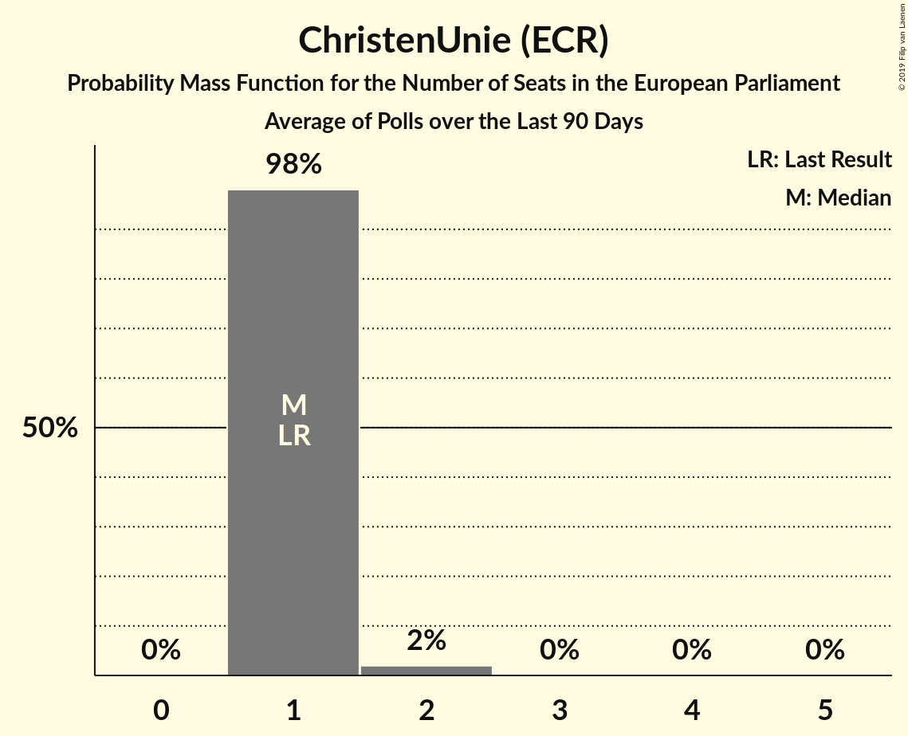

# ChristenUnie (ECR)

<a href="#voting-intentions">Voting Intentions</a> | <a href="#seats">Seats</a>

## Voting Intentions

Last result: **7.7%** (General Election of 22 May 2014)

### Confidence Intervals

| Period     | Polling firm/Commissioner(s) | Median | 80% Confidence Interval | 90% Confidence Interval | 95% Confidence Interval | 99% Confidence Interval |
|:----------:|:----------------:|:-----------:|:-----------------------:|:-----------------------:|:-----------------------:|:-----------------------:|
| N/A | [Poll Average](average.html) | 4.3% | 3.5–5.2% | 3.3–5.4% | 3.1–5.7% | 2.8–6.1% |
| [25–28 May 2018](2018-05-28-Ipsos.html) | Ipsos   EenVandaag | 4.4% | 3.7–5.3% | 3.5–5.6% | 3.3–5.8% | 3.0–6.3% |
| [20–23 April 2018](2018-04-23-Ipsos.html) | Ipsos   EenVandaag | 4.7% | 4.0–5.6% | 3.8–5.9% | 3.6–6.1% | 3.3–6.5% |
| [19 March 2018](2018-03-19-Ipsos.html) | Ipsos   EenVandaag | 4.3% | 3.6–5.2% | 3.4–5.4% | 3.3–5.6% | 3.0–6.1% |
| [27 February–4 March 2018](2018-03-04-KantarPublic.html) | Kantar Public | 4.0% | 3.3–4.9% | 3.1–5.2% | 3.0–5.4% | 2.7–5.9% |
| [23–26 February 2018](2018-02-26-Ipsos.html) | Ipsos   EenVandaag | 3.6% | 3.0–4.5% | 2.8–4.7% | 2.6–4.9% | 2.3–5.4% |
| [2–6 February 2018](2018-02-06-IOResearch.html) | I&O Research | 4.3% | 3.9–4.8% | 3.7–4.9% | 3.7–5.0% | 3.5–5.2% |
| [26–29 January 2018](2018-01-29-Ipsos.html) | Ipsos   EenVandaag | 3.4% | 2.7–4.2% | 2.6–4.4% | 2.4–4.6% | 2.2–5.1% |
| [25–28 January 2018](2018-01-28-KantarPublic.html) | Kantar Public | 4.0% | 3.3–4.8% | 3.1–5.1% | 3.0–5.3% | 2.7–5.7% |
| [15–18 December 2017](2017-12-18-GfK.html) | GfK   EenVandaag | 4.0% | 3.5–4.6% | 3.3–4.8% | 3.2–5.0% | 3.0–5.3% |

### Probability Mass Function

The following table shows the probability mass function per percentage block of voting intentions for the [poll average](average.html) for ChristenUnie (ECR).

| Voting Intentions | Probability | Accumulated | Special Marks |
|:-----------------:|:-----------:|:-----------:|:-------------:|
| 0.5–1.5% | 0% | 100% |  |
| 1.5–2.5% | 0.1% | 100% |  |
| 2.5–3.5% | 12% | 99.9% |  |
| 3.5–4.5% | 54% | 88% | Median |
| 4.5–5.5% | 30% | 33% |  |
| 5.5–6.5% | 3% | 4% |  |
| 6.5–7.5% | 0.1% | 0.1% |  |
| 7.5–8.5% | 0% | 0% | Last Result |

## Seats

Last result: **1** seats (General Election of 22 May 2014)

### Confidence Intervals

| Period     | Polling firm/Commissioner(s) | Median | 80% Confidence Interval | 90% Confidence Interval | 95% Confidence Interval | 99% Confidence Interval |
|:----------:|:----------------:|:------:|:-----------------------:|:-----------------------:|:-----------------------:|:-----------------------:|
| N/A | [Poll Average](average.html) | 1 | 1 | 1 | 0–2 | 0–2 |
| [25–28 May 2018](2018-05-28-Ipsos.html) | Ipsos   EenVandaag | 1 | 1 | 1–2 | 0–2 | 0–2 |
| [20–23 April 2018](2018-04-23-Ipsos.html) | Ipsos   EenVandaag | 1 | 1–2 | 1–2 | 1–2 | 0–2 |
| [19 March 2018](2018-03-19-Ipsos.html) | Ipsos   EenVandaag | 1 | 1 | 1–2 | 1–2 | 0–2 |
| [27 February–4 March 2018](2018-03-04-KantarPublic.html) | Kantar Public | 1 | 1 | 1 | 1 | 0–1 |
| [23–26 February 2018](2018-02-26-Ipsos.html) | Ipsos   EenVandaag | 0 | 0–1 | 0–1 | 0–1 | 0–1 |
| [2–6 February 2018](2018-02-06-IOResearch.html) | I&O Research | 1 | 1 | 1 | 1 | 1 |
| [26–29 January 2018](2018-01-29-Ipsos.html) | Ipsos   EenVandaag | 0 | 0–1 | 0–1 | 0–1 | 0–1 |
| [25–28 January 2018](2018-01-28-KantarPublic.html) | Kantar Public | 1 | 0–1 | 0–1 | 0–1 | 0–1 |
| [15–18 December 2017](2017-12-18-GfK.html) | GfK   EenVandaag | 1 | 1 | 1 | 0–1 | 0–1 |

### Probability Mass Function

The following table shows the probability mass function per seat for the [poll average](average.html) for ChristenUnie (ECR).

| Number of Seats | Probability | Accumulated | Special Marks |
|:---------------:|:-----------:|:-----------:|:-------------:|
| 0 | 3% | 100% |  |
| 1 | 93% | 97% | Last Result, Median |
| 2 | 4% | 4% |  |
| 3 | 0% | 0% |  |

