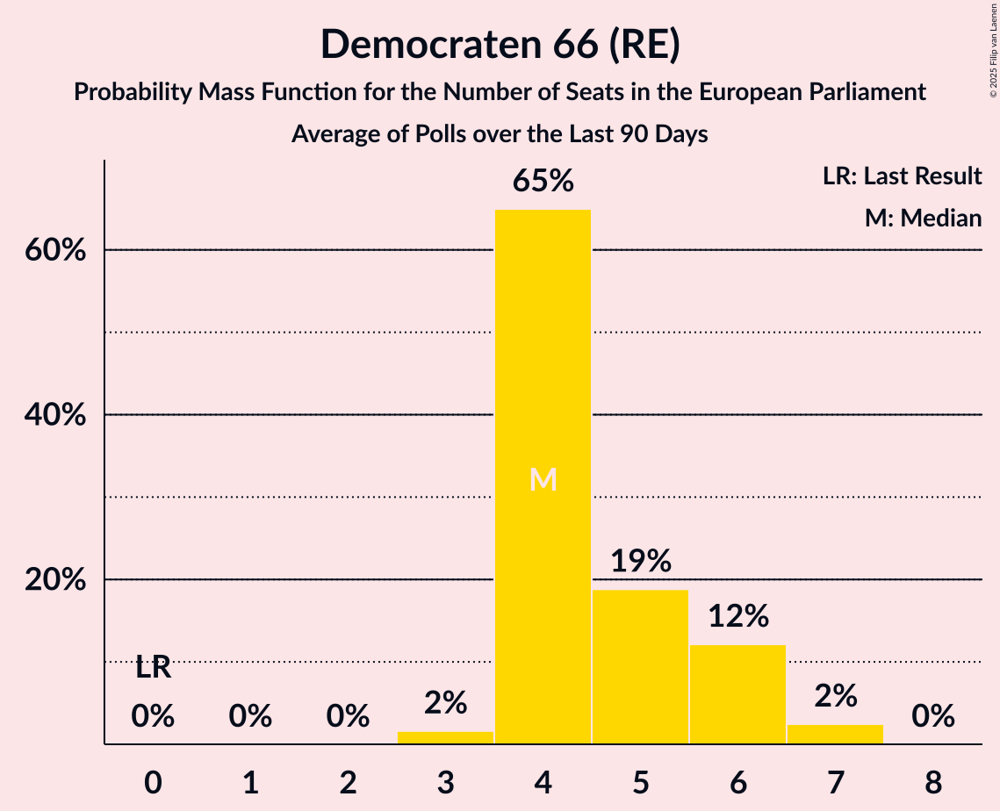

# Democraten 66 (RE)

<a href="#voting-intentions">Voting Intentions</a> | <a href="#seats">Seats</a>

## Voting Intentions

Last result: **7.1%** (General Election of 23 May 2019)

### Confidence Intervals

| Period     | Polling firm/Commissioner(s) | Median | 80% Confidence Interval | 90% Confidence Interval | 95% Confidence Interval | 99% Confidence Interval |
|:----------:|:----------------:|:-----------:|:-----------------------:|:-----------------------:|:-----------------------:|:-----------------------:|
| N/A | [Poll Average](average.html) | 8.9% | 7.5–10.1% | 7.1–10.5% | 6.8–10.8% | 6.3–11.6% |
| [3–7 September 2020](2020-09-07-IOResearch.html) | I&O Research | 8.6% | 7.9–9.5% | 7.7–9.7% | 7.5–9.9% | 7.1–10.3% |
| [4–5 September 2020](2020-09-05-Peilnl.html) | Peil.nl | 9.3% | 8.6–10.0% | 8.5–10.2% | 8.3–10.4% | 8.0–10.7% |
| [28–29 August 2020](2020-08-29-Peilnl.html) | Peil.nl | 9.3% | 8.6–10.0% | 8.5–10.2% | 8.3–10.4% | 8.0–10.7% |
| [21–27 August 2020](2020-08-27-Ipsos.html) | Ipsos   EenVandaag | 9.5% | 8.5–10.8% | 8.2–11.2% | 7.9–11.5% | 7.4–12.1% |
| [23 August 2020](2020-08-23-Peilnl.html) | Peil.nl | 8.0% | 7.4–8.7% | 7.2–8.9% | 7.1–9.0% | 6.8–9.4% |
| [14–15 August 2020](2020-08-15-Peilnl.html) | Peil.nl | 8.7% | 8.0–9.4% | 7.9–9.6% | 7.7–9.7% | 7.4–10.1% |
| [9 August 2020](2020-08-09-IOResearch.html) | I&O Research | 8.2% | 7.3–9.3% | 7.1–9.6% | 6.9–9.8% | 6.4–10.3% |
| [26 July 2020](2020-07-26-Peilnl.html) | Peil.nl | 9.3% | 8.7–10.1% | 8.5–10.3% | 8.3–10.4% | 8.0–10.8% |
| [24–26 July 2020](2020-07-26-Ipsos.html) | Ipsos   EenVandaag | 8.8% | 7.8–10.0% | 7.5–10.4% | 7.3–10.7% | 6.8–11.3% |
| [19 July 2020](2020-07-19-Peilnl.html) | Peil.nl | 9.3% | 8.7–10.1% | 8.5–10.3% | 8.3–10.4% | 8.0–10.8% |
| [3–6 July 2020](2020-07-06-IOResearch.html) | I&O Research | 9.1% | 8.3–10.0% | 8.1–10.2% | 7.9–10.4% | 7.6–10.8% |
| [5 July 2020](2020-07-05-Peilnl.html) | Peil.nl | 8.0% | 7.4–8.7% | 7.2–8.9% | 7.1–9.0% | 6.8–9.4% |
| [27–30 June 2020](2020-06-30-Ipsos.html) | Ipsos   EenVandaag | 9.1% | 8.0–10.3% | 7.8–10.7% | 7.5–11.0% | 7.0–11.6% |
| [28 June 2020](2020-06-28-Peilnl.html) | Peil.nl | 8.0% | 7.4–8.7% | 7.2–8.9% | 7.1–9.0% | 6.8–9.4% |
| [23–26 June 2020](2020-06-26-KantarPublic.html) | Kantar Public | 8.0% | 6.9–9.3% | 6.6–9.6% | 6.4–10.0% | 5.9–10.6% |
| [21 June 2020](2020-06-21-Peilnl.html) | Peil.nl | 6.7% | 6.1–7.3% | 6.0–7.5% | 5.8–7.6% | 5.6–7.9% |
| [5–9 June 2020](2020-06-09-IOResearch.html) | I&O Research | 7.2% | 6.6–7.8% | 6.5–8.0% | 6.4–8.1% | 6.1–8.4% |
| [31 May 2020](2020-05-31-Peilnl.html) | Peil.nl | 6.7% | 6.1–7.3% | 6.0–7.5% | 5.8–7.6% | 5.6–7.9% |
| [22–24 May 2020](2020-05-24-Ipsos.html) | Ipsos   EenVandaag | 6.7% | 5.8–7.8% | 5.5–8.1% | 5.3–8.4% | 4.9–8.9% |
| [15–16 May 2020](2020-05-16-Peilnl.html) | Peil.nl | 6.7% | 6.1–7.3% | 6.0–7.5% | 5.8–7.6% | 5.6–7.9% |
| [7–12 May 2020](2020-05-12-IOResearch.html) | I&O Research | 5.2% | 4.6–5.9% | 4.5–6.1% | 4.3–6.2% | 4.1–6.6% |
| [8–9 May 2020](2020-05-09-Peilnl.html) | Peil.nl | 6.7% | 6.1–7.3% | 6.0–7.5% | 5.8–7.6% | 5.6–7.9% |
| [1–2 May 2020](2020-05-02-Peilnl.html) | Peil.nl | 6.6% | 6.1–7.3% | 5.9–7.4% | 5.8–7.6% | 5.5–7.9% |
| [26 April 2020](2020-04-26-Peilnl.html) | Peil.nl | 7.3% | 6.8–8.0% | 6.6–8.2% | 6.4–8.3% | 6.2–8.6% |
| [24–26 April 2020](2020-04-26-Ipsos.html) | Ipsos   EenVandaag | 7.8% | 6.8–8.9% | 6.5–9.3% | 6.3–9.6% | 5.8–10.2% |
| [27–30 March 2020](2020-03-30-Ipsos.html) | Ipsos   EenVandaag | 8.2% | 7.2–9.4% | 6.9–9.8% | 6.7–10.1% | 6.2–10.7% |
| [26–30 March 2020](2020-03-30-IOResearch.html) | I&O Research | 5.7% | 5.1–6.4% | 5.0–6.6% | 4.8–6.8% | 4.6–7.1% |
| [5–10 March 2020](2020-03-10-IOResearch.html) | I&O Research | 6.5% | 5.9–7.3% | 5.7–7.5% | 5.5–7.6% | 5.3–8.0% |
| [1–6 March 2020](2020-03-06-Peilnl.html) | Peil.nl | 9.3% | 8.7–10.1% | 8.5–10.3% | 8.3–10.4% | 8.0–10.8% |
| [23 February–1 March 2020](2020-03-01-Peilnl.html) | Peil.nl | 9.3% | 8.7–10.1% | 8.5–10.3% | 8.3–10.4% | 8.0–10.8% |
| [21–24 February 2020](2020-02-24-Ipsos.html) | Ipsos   EenVandaag | 8.3% | 7.3–9.6% | 7.0–9.9% | 6.8–10.2% | 6.3–10.8% |
| [18–23 February 2020](2020-02-23-Peilnl.html) | Peil.nl | 9.3% | 8.7–10.1% | 8.5–10.3% | 8.3–10.4% | 8.0–10.8% |
| [17–22 February 2020](2020-02-22-Peilnl.html) | Peil.nl | 9.3% | 8.7–10.1% | 8.5–10.3% | 8.3–10.4% | 8.0–10.8% |
| [9–14 February 2020](2020-02-14-Peilnl.html) | Peil.nl | 8.7% | 8.0–9.4% | 7.9–9.6% | 7.7–9.7% | 7.4–10.1% |
| [2–9 February 2020](2020-02-09-Peilnl.html) | Peil.nl | 8.7% | 8.0–9.4% | 7.9–9.6% | 7.7–9.7% | 7.4–10.1% |
| [27 January–1 February 2020](2020-02-01-Peilnl.html) | Peil.nl | 8.7% | 8.0–9.4% | 7.9–9.6% | 7.7–9.7% | 7.4–10.1% |
| [24–27 January 2020](2020-01-27-Ipsos.html) | Ipsos | 8.1% | 7.1–9.3% | 6.8–9.6% | 6.6–9.9% | 6.1–10.5% |
| [21–26 January 2020](2020-01-26-Peilnl.html) | Peil.nl | 8.7% | 8.0–9.4% | 7.9–9.6% | 7.7–9.7% | 7.4–10.1% |
| [10–18 January 2020](2020-01-18-Peilnl.html) | Peil.nl | 8.7% | 8.0–9.4% | 7.9–9.6% | 7.7–9.7% | 7.4–10.1% |
| [10–14 January 2020](2020-01-14-IOResearch.html) | I&O Research | 7.3% | 6.6–8.1% | 6.4–8.3% | 6.3–8.5% | 6.0–8.8% |
| [6–11 January 2020](2020-01-11-Peilnl.html) | Peil.nl | 8.7% | 8.0–9.4% | 7.9–9.6% | 7.7–9.7% | 7.4–10.1% |
| [16–21 December 2019](2019-12-21-Peilnl.html) | Peil.nl | 8.0% | 7.4–8.7% | 7.2–8.9% | 7.1–9.0% | 6.8–9.4% |
| [19–21 December 2019](2019-12-21-Ipsos.html) | Ipsos   EenVandaag | 7.2% | 6.3–8.3% | 6.0–8.7% | 5.8–8.9% | 5.4–9.5% |
| [9–14 December 2019](2019-12-14-Peilnl.html) | Peil.nl | 8.0% | 7.4–8.7% | 7.2–8.9% | 7.1–9.0% | 6.8–9.4% |
| [2–7 December 2019](2019-12-07-Peilnl.html) | Peil.nl | 8.0% | 7.4–8.7% | 7.2–8.9% | 7.1–9.0% | 6.8–9.4% |
| [25–30 November 2019](2019-11-30-Peilnl.html) | Peil.nl | 8.0% | 7.4–8.7% | 7.2–8.9% | 7.1–9.0% | 6.8–9.4% |
| [22–25 November 2019](2019-11-25-Ipsos.html) | Ipsos   EenVandaag | 7.7% | 6.7–8.8% | 6.4–9.2% | 6.2–9.5% | 5.7–10.1% |
| [18–23 November 2019](2019-11-23-Peilnl.html) | Peil.nl | 8.7% | 8.0–9.4% | 7.9–9.6% | 7.7–9.7% | 7.4–10.1% |
| [11–16 November 2019](2019-11-16-Peilnl.html) | Peil.nl | 8.7% | 8.0–9.4% | 7.9–9.6% | 7.7–9.7% | 7.4–10.1% |
| [15 November 2019](2019-11-15-KantarPublic.html) | Kantar Public | 6.7% | 5.8–7.9% | 5.5–8.2% | 5.3–8.5% | 4.9–9.1% |
| [7–13 November 2019](2019-11-13-IOResearch.html) | I&O Research | 7.1% | 6.3–8.1% | 6.0–8.4% | 5.8–8.6% | 5.5–9.1% |
| [4–9 November 2019](2019-11-09-Peilnl.html) | Peil.nl | 8.7% | 8.0–9.4% | 7.9–9.6% | 7.7–9.7% | 7.4–10.1% |
| [28 October–2 November 2019](2019-11-02-Peilnl.html) | Peil.nl | 8.7% | 8.0–9.4% | 7.9–9.6% | 7.7–9.7% | 7.4–10.1% |
| [25–28 October 2019](2019-10-28-Ipsos.html) | Ipsos   EenVandaag | 9.0% | 8.0–10.3% | 7.7–10.6% | 7.4–11.0% | 6.9–11.6% |
| [21–26 October 2019](2019-10-26-Peilnl.html) | Peil.nl | 8.1% | 7.5–8.7% | 7.3–8.9% | 7.1–9.1% | 6.9–9.4% |
| [14–19 October 2019](2019-10-19-Peilnl.html) | Peil.nl | 8.7% | 8.0–9.4% | 7.9–9.6% | 7.7–9.7% | 7.4–10.1% |
| [15 October 2019](2019-10-15-KantarPublic.html) | Kantar Public | 7.3% | 6.4–8.6% | 6.1–8.9% | 5.9–9.2% | 5.4–9.8% |
| [10–15 October 2019](2019-10-15-IOResearch.html) | I&O Research | 7.5% | 6.8–8.4% | 6.5–8.6% | 6.4–8.9% | 6.0–9.3% |
| [7–12 October 2019](2019-10-12-Peilnl.html) | Peil.nl | 8.0% | 7.4–8.7% | 7.2–8.9% | 7.1–9.0% | 6.8–9.4% |
| [30 September–5 October 2019](2019-10-05-Peilnl.html) | Peil.nl | 8.0% | 7.4–8.7% | 7.2–8.9% | 7.1–9.0% | 6.8–9.4% |
| [23–28 September 2019](2019-09-28-Peilnl.html) | Peil.nl | 7.3% | 6.8–8.0% | 6.6–8.2% | 6.4–8.3% | 6.2–8.6% |
| [20–23 September 2019](2019-09-23-Ipsos.html) | Ipsos   EenVandaag | 9.9% | 8.8–11.2% | 8.5–11.6% | 8.2–11.9% | 7.7–12.6% |
| [16–21 September 2019](2019-09-21-Peilnl.html) | Peil.nl | 7.3% | 6.8–8.0% | 6.6–8.2% | 6.4–8.3% | 6.2–8.6% |
| [15 September 2019](2019-09-15-KantarPublic.html) | Kantar Public | 8.0% | 7.0–9.2% | 6.7–9.6% | 6.4–9.9% | 6.0–10.5% |
| [9–14 September 2019](2019-09-14-Peilnl.html) | Peil.nl | 7.3% | 6.8–8.0% | 6.6–8.2% | 6.4–8.3% | 6.2–8.6% |
| [2–7 September 2019](2019-09-07-Peilnl.html) | Peil.nl | 7.3% | 6.8–8.0% | 6.6–8.2% | 6.4–8.3% | 6.2–8.6% |
| [29 August–3 September 2019](2019-09-03-IOResearch.html) | I&O Research | 7.4% | 6.6–8.3% | 6.4–8.6% | 6.2–8.8% | 5.9–9.2% |
| [30 August–2 September 2019](2019-09-02-Ipsos.html) | Ipsos   EenVandaag | 8.4% | 7.4–9.6% | 7.1–10.0% | 6.8–10.3% | 6.4–10.9% |
| [26–31 August 2019](2019-08-31-Peilnl.html) | Peil.nl | 7.3% | 6.8–8.0% | 6.6–8.2% | 6.4–8.3% | 6.2–8.6% |
| [19–24 August 2019](2019-08-24-Peilnl.html) | Peil.nl | 7.3% | 6.8–8.0% | 6.6–8.2% | 6.4–8.3% | 6.2–8.6% |
| [29 July–4 August 2019](2019-08-04-Peilnl.html) | Peil.nl | 6.7% | 6.1–7.3% | 6.0–7.5% | 5.8–7.6% | 5.6–7.9% |
| [29 July 2019](2019-07-29-Peilnl.html) | Peil.nl | 6.7% | 6.1–7.3% | 6.0–7.5% | 5.8–7.6% | 5.6–7.9% |
| [26–29 July 2019](2019-07-29-Ipsos.html) | Ipsos   EenVandaag | 8.3% | 7.3–9.5% | 7.0–9.8% | 6.7–10.1% | 6.3–10.7% |
| [5–9 July 2019](2019-07-09-IOResearch.html) | I&O Research | 6.7% | 6.0–7.4% | 5.9–7.6% | 5.7–7.8% | 5.4–8.1% |
| [1–7 July 2019](2019-07-07-Peilnl.html) | Peil.nl | 6.0% | 5.5–6.6% | 5.3–6.8% | 5.2–6.9% | 5.0–7.2% |
| [24–30 June 2019](2019-06-30-Peilnl.html) | Peil.nl | 6.7% | 6.1–7.3% | 6.0–7.5% | 5.8–7.6% | 5.6–7.9% |
| [21–24 June 2019](2019-06-24-Ipsos.html) | Ipsos   EenVandaag | 7.6% | 6.6–8.7% | 6.3–9.1% | 6.1–9.4% | 5.7–10.0% |
| [17–23 June 2019](2019-06-23-Peilnl.html) | Peil.nl | 6.7% | 6.1–7.3% | 6.0–7.5% | 5.8–7.6% | 5.6–7.9% |
| [10–16 June 2019](2019-06-16-Peilnl.html) | Peil.nl | 6.7% | 6.1–7.3% | 6.0–7.5% | 5.8–7.6% | 5.6–7.9% |
| [3–9 June 2019](2019-06-09-Peilnl.html) | Peil.nl | 6.7% | 6.1–7.3% | 6.0–7.5% | 5.8–7.6% | 5.6–7.9% |
| [27 May–2 June 2019](2019-06-02-Peilnl.html) | Peil.nl | 6.7% | 6.1–7.3% | 6.0–7.5% | 5.8–7.6% | 5.6–7.9% |

### Probability Mass Function

The following table shows the probability mass function per percentage block of voting intentions for the [poll average](average.html) for Democraten 66 (RE).

| Voting Intentions | Probability | Accumulated | Special Marks |
|:-----------------:|:-----------:|:-----------:|:-------------:|
| 4.5–5.5% | 0% | 100% |  |
| 5.5–6.5% | 1.1% | 100% |  |
| 6.5–7.5% | 10% | 98.8% | Last Result |
| 7.5–8.5% | 27% | 89% |  |
| 8.5–9.5% | 38% | 61% | Median |
| 9.5–10.5% | 19% | 24% |  |
| 10.5–11.5% | 4% | 4% |  |
| 11.5–12.5% | 0.5% | 0.5% |  |
| 12.5–13.5% | 0% | 0% |  |

## Seats

Last result: **2** seats (General Election of 23 May 2019)

### Confidence Intervals

| Period     | Polling firm/Commissioner(s) | Median | 80% Confidence Interval | 90% Confidence Interval | 95% Confidence Interval | 99% Confidence Interval |
|:----------:|:----------------:|:------:|:-----------------------:|:-----------------------:|:-----------------------:|:-----------------------:|
| N/A | [Poll Average](average.html) | 3 | 2–3 | 2–3 | 2–3 | 2–3 |
| [3–7 September 2020](2020-09-07-IOResearch.html) | I&O Research | 3 | 2–3 | 2–3 | 2–3 | 2–3 |
| [4–5 September 2020](2020-09-05-Peilnl.html) | Peil.nl | 3 | 3 | 3 | 2–3 | 2–3 |
| [28–29 August 2020](2020-08-29-Peilnl.html) | Peil.nl | 3 | 3 | 3 | 3 | 2–3 |
| [21–27 August 2020](2020-08-27-Ipsos.html) | Ipsos   EenVandaag | 3 | 3 | 3 | 3 | 2–4 |
| [23 August 2020](2020-08-23-Peilnl.html) | Peil.nl | 2 | 2–3 | 2–3 | 2–3 | 2–3 |
| [14–15 August 2020](2020-08-15-Peilnl.html) | Peil.nl | 3 | 3 | 3 | 3 | 2–3 |
| [9 August 2020](2020-08-09-IOResearch.html) | I&O Research | 3 | 3 | 3 | 2–3 | 2–3 |
| [26 July 2020](2020-07-26-Peilnl.html) | Peil.nl | 3 | 3 | 3 | 3 | 2–3 |
| [24–26 July 2020](2020-07-26-Ipsos.html) | Ipsos   EenVandaag | 3 | 2–3 | 2–3 | 2–3 | 2–4 |
| [19 July 2020](2020-07-19-Peilnl.html) | Peil.nl | 3 | 3 | 3 | 3 | 2–3 |
| [3–6 July 2020](2020-07-06-IOResearch.html) | I&O Research | 3 | 3 | 3 | 2–3 | 2–3 |
| [5 July 2020](2020-07-05-Peilnl.html) | Peil.nl | 2 | 2–3 | 2–3 | 2–3 | 2–3 |
| [27–30 June 2020](2020-06-30-Ipsos.html) | Ipsos   EenVandaag | 3 | 2–3 | 2–3 | 2–4 | 2–4 |
| [28 June 2020](2020-06-28-Peilnl.html) | Peil.nl | 2 | 2–3 | 2–3 | 2–3 | 2–3 |
| [23–26 June 2020](2020-06-26-KantarPublic.html) | Kantar Public | 2 | 2–3 | 2–3 | 2–3 | 2–3 |
| [21 June 2020](2020-06-21-Peilnl.html) | Peil.nl | 2 | 2 | 2 | 2 | 2 |
| [5–9 June 2020](2020-06-09-IOResearch.html) | I&O Research | 2 | 2 | 2 | 2 | 2 |
| [31 May 2020](2020-05-31-Peilnl.html) | Peil.nl | 2 | 2 | 2 | 1–2 | 1–2 |
| [22–24 May 2020](2020-05-24-Ipsos.html) | Ipsos   EenVandaag | 2 | 1–2 | 1–2 | 1–2 | 1–3 |
| [15–16 May 2020](2020-05-16-Peilnl.html) | Peil.nl | 2 | 2 | 2 | 2 | 2 |
| [7–12 May 2020](2020-05-12-IOResearch.html) | I&O Research | 1 | 1–2 | 1–2 | 1–2 | 1–2 |
| [8–9 May 2020](2020-05-09-Peilnl.html) | Peil.nl | 2 | 2 | 2 | 2 | 2 |
| [1–2 May 2020](2020-05-02-Peilnl.html) | Peil.nl | 2 | 2 | 2 | 2 | 2 |
| [26 April 2020](2020-04-26-Peilnl.html) | Peil.nl | 2 | 2 | 2 | 2 | 2 |
| [24–26 April 2020](2020-04-26-Ipsos.html) | Ipsos   EenVandaag | 2 | 2–3 | 2–3 | 2–3 | 2–3 |
| [27–30 March 2020](2020-03-30-Ipsos.html) | Ipsos   EenVandaag | 2 | 2–3 | 2–3 | 2–3 | 2–3 |
| [26–30 March 2020](2020-03-30-IOResearch.html) | I&O Research | 2 | 1–2 | 1–2 | 1–2 | 1–2 |
| [5–10 March 2020](2020-03-10-IOResearch.html) | I&O Research | 2 | 2 | 2 | 2 | 1–2 |
| [1–6 March 2020](2020-03-06-Peilnl.html) | Peil.nl | 3 | 3 | 3 | 3 | 3 |
| [23 February–1 March 2020](2020-03-01-Peilnl.html) | Peil.nl | 3 | 3 | 3 | 3 | 3 |
| [21–24 February 2020](2020-02-24-Ipsos.html) | Ipsos   EenVandaag | 2 | 2–3 | 2–3 | 2–3 | 2–3 |
| [18–23 February 2020](2020-02-23-Peilnl.html) | Peil.nl | 3 | 3 | 3 | 3 | 3 |
| [17–22 February 2020](2020-02-22-Peilnl.html) | Peil.nl | 3 | 3 | 3 | 3 | 3 |
| [9–14 February 2020](2020-02-14-Peilnl.html) | Peil.nl | 3 | 3 | 2–3 | 2–3 | 2–3 |
| [2–9 February 2020](2020-02-09-Peilnl.html) | Peil.nl | 3 | 3 | 2–3 | 2–3 | 2–3 |
| [27 January–1 February 2020](2020-02-01-Peilnl.html) | Peil.nl | 3 | 2–3 | 2–3 | 2–3 | 2–3 |
| [24–27 January 2020](2020-01-27-Ipsos.html) | Ipsos | 2 | 2 | 2–3 | 2–3 | 2–3 |
| [21–26 January 2020](2020-01-26-Peilnl.html) | Peil.nl | 3 | 2–3 | 2–3 | 2–3 | 2–3 |
| [10–18 January 2020](2020-01-18-Peilnl.html) | Peil.nl | 3 | 2–3 | 2–3 | 2–3 | 2–3 |
| [10–14 January 2020](2020-01-14-IOResearch.html) | I&O Research | 2 | 2 | 2–3 | 2–3 | 2–3 |
| [6–11 January 2020](2020-01-11-Peilnl.html) | Peil.nl | 3 | 2–3 | 2–3 | 2–3 | 2–3 |
| [16–21 December 2019](2019-12-21-Peilnl.html) | Peil.nl | 2 | 2–3 | 2–3 | 2–3 | 2–3 |
| [19–21 December 2019](2019-12-21-Ipsos.html) | Ipsos   EenVandaag | 2 | 2 | 2–3 | 2–3 | 2–3 |
| [9–14 December 2019](2019-12-14-Peilnl.html) | Peil.nl | 2 | 2–3 | 2–3 | 2–3 | 2–3 |
| [2–7 December 2019](2019-12-07-Peilnl.html) | Peil.nl | 2 | 2–3 | 2–3 | 2–3 | 2–3 |
| [25–30 November 2019](2019-11-30-Peilnl.html) | Peil.nl | 2 | 2–3 | 2–3 | 2–3 | 2–3 |
| [22–25 November 2019](2019-11-25-Ipsos.html) | Ipsos   EenVandaag | 2 | 2 | 2–3 | 2–3 | 2–3 |
| [18–23 November 2019](2019-11-23-Peilnl.html) | Peil.nl | 3 | 2–3 | 2–3 | 2–3 | 2–3 |
| [11–16 November 2019](2019-11-16-Peilnl.html) | Peil.nl | 3 | 2–3 | 2–3 | 2–3 | 2–3 |
| [15 November 2019](2019-11-15-KantarPublic.html) | Kantar Public | 2 | 2 | 1–2 | 1–2 | 1–3 |
| [7–13 November 2019](2019-11-13-IOResearch.html) | I&O Research | 2 | 2 | 2–3 | 2–3 | 2–3 |
| [4–9 November 2019](2019-11-09-Peilnl.html) | Peil.nl | 3 | 3 | 2–3 | 2–3 | 2–3 |
| [28 October–2 November 2019](2019-11-02-Peilnl.html) | Peil.nl | 3 | 2–3 | 2–3 | 2–3 | 2–3 |
| [25–28 October 2019](2019-10-28-Ipsos.html) | Ipsos   EenVandaag | 3 | 3–4 | 3–4 | 2–4 | 2–4 |
| [21–26 October 2019](2019-10-26-Peilnl.html) | Peil.nl | 3 | 2–3 | 2–3 | 2–3 | 2–3 |
| [14–19 October 2019](2019-10-19-Peilnl.html) | Peil.nl | 3 | 2–3 | 2–3 | 2–3 | 2–3 |
| [15 October 2019](2019-10-15-KantarPublic.html) | Kantar Public | 2 | 2 | 2–3 | 2–3 | 1–3 |
| [10–15 October 2019](2019-10-15-IOResearch.html) | I&O Research | 2 | 2–3 | 2–3 | 2–3 | 2–3 |
| [7–12 October 2019](2019-10-12-Peilnl.html) | Peil.nl | 2 | 2–3 | 2–3 | 2–3 | 2–3 |
| [30 September–5 October 2019](2019-10-05-Peilnl.html) | Peil.nl | 2 | 2–3 | 2–3 | 2–3 | 2–3 |
| [23–28 September 2019](2019-09-28-Peilnl.html) | Peil.nl | 2 | 2 | 2 | 2 | 2–3 |
| [20–23 September 2019](2019-09-23-Ipsos.html) | Ipsos   EenVandaag | 3 | 3–4 | 3–4 | 2–4 | 2–4 |
| [16–21 September 2019](2019-09-21-Peilnl.html) | Peil.nl | 2 | 2 | 2 | 2 | 2–3 |
| [15 September 2019](2019-09-15-KantarPublic.html) | Kantar Public | 2 | 2–3 | 2–3 | 2–3 | 1–3 |
| [9–14 September 2019](2019-09-14-Peilnl.html) | Peil.nl | 2 | 2 | 2 | 2 | 2 |
| [2–7 September 2019](2019-09-07-Peilnl.html) | Peil.nl | 2 | 2 | 2 | 2 | 2 |
| [29 August–3 September 2019](2019-09-03-IOResearch.html) | I&O Research | 2 | 2–3 | 2–3 | 2–3 | 2–3 |
| [30 August–2 September 2019](2019-09-02-Ipsos.html) | Ipsos   EenVandaag | 3 | 2–3 | 2–3 | 2–3 | 2–4 |
| [26–31 August 2019](2019-08-31-Peilnl.html) | Peil.nl | 2 | 2–3 | 2–3 | 2–3 | 2–3 |
| [19–24 August 2019](2019-08-24-Peilnl.html) | Peil.nl | 2 | 2–3 | 2–3 | 2–3 | 2–3 |
| [29 July–4 August 2019](2019-08-04-Peilnl.html) | Peil.nl | 2 | 2 | 2 | 2 | 2 |
| [29 July 2019](2019-07-29-Peilnl.html) | Peil.nl | 2 | 2 | 2 | 2 | 2 |
| [26–29 July 2019](2019-07-29-Ipsos.html) | Ipsos   EenVandaag | 3 | 2–3 | 2–3 | 2–3 | 2–3 |
| [5–9 July 2019](2019-07-09-IOResearch.html) | I&O Research | 2 | 2 | 2 | 2 | 2 |
| [1–7 July 2019](2019-07-07-Peilnl.html) | Peil.nl | 2 | 1–2 | 1–2 | 1–2 | 1–2 |
| [24–30 June 2019](2019-06-30-Peilnl.html) | Peil.nl | 2 | 2 | 2 | 2 | 2 |
| [21–24 June 2019](2019-06-24-Ipsos.html) | Ipsos   EenVandaag | 2 | 2–3 | 2–3 | 2–3 | 1–3 |
| [17–23 June 2019](2019-06-23-Peilnl.html) | Peil.nl | 2 | 2 | 2 | 2 | 2 |
| [10–16 June 2019](2019-06-16-Peilnl.html) | Peil.nl | 2 | 2 | 2 | 2 | 2 |
| [3–9 June 2019](2019-06-09-Peilnl.html) | Peil.nl | 2 | 2 | 2 | 2 | 2 |
| [27 May–2 June 2019](2019-06-02-Peilnl.html) | Peil.nl | 2 | 2 | 2 | 2 | 2 |

### Probability Mass Function

The following table shows the probability mass function per seat for the [poll average](average.html) for Democraten 66 (RE).

| Number of Seats | Probability | Accumulated | Special Marks |
|:---------------:|:-----------:|:-----------:|:-------------:|
| 2 | 23% | 100% | Last Result |
| 3 | 76% | 77% | Median |
| 4 | 0.5% | 0.5% |  |
| 5 | 0% | 0% |  |

