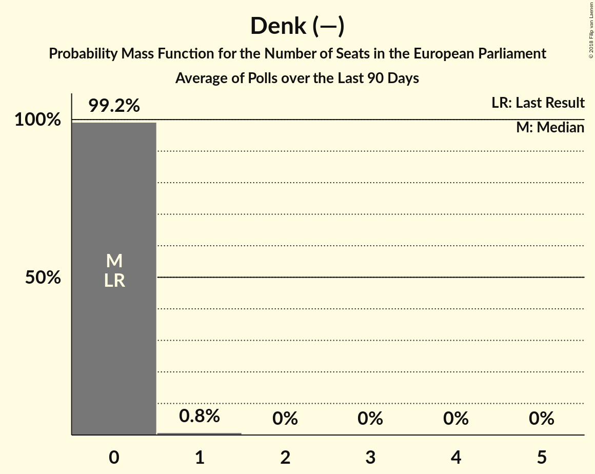

# Denk (—)

<a href="#voting-intentions">Voting Intentions</a> | <a href="#seats">Seats</a>

## Voting Intentions

Last result: **0.0%** (General Election of 22 May 2014)

### Confidence Intervals

| Period     | Polling firm/Commissioner(s) | Median | 80% Confidence Interval | 90% Confidence Interval | 95% Confidence Interval | 99% Confidence Interval |
|:----------:|:----------------:|:-----------:|:-----------------------:|:-----------------------:|:-----------------------:|:-----------------------:|
| N/A | [Poll Average](average.html) | 1.8% | 1.3–3.3% | 1.1–3.7% | 1.0–3.9% | 0.9–4.4% |
| [27 February–4 March 2018](2018-03-04-KantarPublic.html) | Kantar Public | 2.0% | 1.6–2.7% | 1.4–2.9% | 1.3–3.1% | 1.1–3.4% |
| [23–26 February 2018](2018-02-26-Ipsos.html) | Ipsos   EenVandaag | 3.1% | 2.5–3.9% | 2.3–4.2% | 2.2–4.4% | 2.0–4.8% |
| [2–6 February 2018](2018-02-06-IOResearch.html) | I&O Research | 1.6% | 1.4–1.9% | 1.3–2.0% | 1.2–2.1% | 1.1–2.2% |
| [26–29 January 2018](2018-01-29-Ipsos.html) | Ipsos   EenVandaag | 2.7% | 2.1–3.5% | 2.0–3.7% | 1.9–3.9% | 1.6–4.3% |
| [25–28 January 2018](2018-01-28-KantarPublic.html) | Kantar Public | 1.3% | 1.0–1.8% | 0.9–2.0% | 0.8–2.1% | 0.7–2.4% |
| [15–18 December 2017](2017-12-18-GfK.html) | GfK   EenVandaag | 1.3% | 1.0–1.7% | 0.9–1.8% | 0.9–1.9% | 0.8–2.1% |

### Probability Mass Function

The following table shows the probability mass function per percentage block of voting intentions for the [poll average](average.html) for Denk (—).

| Voting Intentions | Probability | Accumulated | Special Marks |
|:-----------------:|:-----------:|:-----------:|:-------------:|
| 0.0–0.5% | 0% | 100% | Last Result |
| 0.5–1.5% | 32% | 100% |  |
| 1.5–2.5% | 42% | 68% | Median |
| 2.5–3.5% | 20% | 26% |  |
| 3.5–4.5% | 6% | 6% |  |
| 4.5–5.5% | 0.3% | 0.3% |  |
| 5.5–6.5% | 0% | 0% |  |

## Seats

Last result: **0** seats (General Election of 22 May 2014)

### Confidence Intervals

| Period     | Polling firm/Commissioner(s) | Median | 80% Confidence Interval | 90% Confidence Interval | 95% Confidence Interval | 99% Confidence Interval |
|:----------:|:----------------:|:------:|:-----------------------:|:-----------------------:|:-----------------------:|:-----------------------:|
| N/A | [Poll Average](average.html) | 0 | 0 | 0 | 0 | 0–1 |
| [27 February–4 March 2018](2018-03-04-KantarPublic.html) | Kantar Public | 0 | 0 | 0 | 0 | 0 |
| [23–26 February 2018](2018-02-26-Ipsos.html) | Ipsos   EenVandaag | 0 | 0 | 0 | 0–1 | 0–1 |
| [2–6 February 2018](2018-02-06-IOResearch.html) | I&O Research | 0 | 0 | 0 | 0 | 0 |
| [26–29 January 2018](2018-01-29-Ipsos.html) | Ipsos   EenVandaag | 0 | 0 | 0 | 0–1 | 0–1 |
| [25–28 January 2018](2018-01-28-KantarPublic.html) | Kantar Public | 0 | 0 | 0 | 0 | 0 |
| [15–18 December 2017](2017-12-18-GfK.html) | GfK   EenVandaag | 0 | 0 | 0 | 0 | 0 |

### Probability Mass Function

The following table shows the probability mass function per seat for the [poll average](average.html) for Denk (—).

| Number of Seats | Probability | Accumulated | Special Marks |
|:---------------:|:-----------:|:-----------:|:-------------:|
| 0 | 99.0% | 100% | Last Result, Median |
| 1 | 1.0% | 1.0% |  |
| 2 | 0% | 0% |  |

