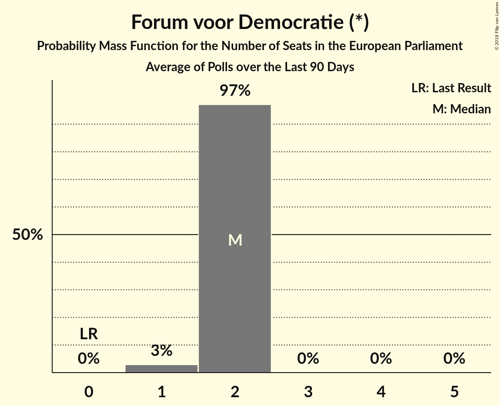

# Forum voor Democratie (*)

<a href="#voting-intentions">Voting Intentions</a> | <a href="#seats">Seats</a>

## Voting Intentions

Last result: **0.0%** (General Election of 22 May 2014)

### Confidence Intervals

| Period     | Polling firm/Commissioner(s) | Median | 80% Confidence Interval | 90% Confidence Interval | 95% Confidence Interval | 99% Confidence Interval |
|:----------:|:----------------:|:-----------:|:-----------------------:|:-----------------------:|:-----------------------:|:-----------------------:|
| N/A | [Poll Average](average.html) | 6.7% | 5.4–8.4% | 5.1–8.7% | 4.9–8.9% | 4.5–9.4% |
| [26–29 October 2018](2018-10-29-Ipsos.html) | Ipsos   EenVandaag | 6.3% | 5.4–7.4% | 5.2–7.7% | 5.0–8.0% | 4.6–8.6% |
| [21–23 September 2018](2018-09-23-Ipsos.html) | Ipsos   EenVandaag | 6.3% | 5.4–7.4% | 5.2–7.7% | 5.0–7.9% | 4.6–8.5% |
| [13–16 September 2018](2018-09-16-KantarPublic.html) | Kantar Public | 6.0% | 5.1–7.0% | 4.9–7.3% | 4.7–7.6% | 4.3–8.1% |
| [7–11 September 2018](2018-09-11-IOResearch.html) | I&O Research | 8.0% | 7.3–8.8% | 7.1–9.1% | 6.9–9.3% | 6.5–9.7% |
| [31 August–3 September 2018](2018-09-03-Ipsos.html) | Ipsos   EenVandaag | 5.7% | 4.9–6.8% | 4.7–7.1% | 4.5–7.3% | 4.1–7.8% |
| [27–30 July 2018](2018-07-30-Ipsos.html) | Ipsos   EenVandaag | 6.2% | 5.4–7.1% | 5.2–7.3% | 5.0–7.6% | 4.7–8.0% |
| [22–25 June 2018](2018-06-25-Ipsos.html) | Ipsos   EenVandaag | 6.0% | 5.2–7.0% | 4.9–7.3% | 4.7–7.5% | 4.4–8.0% |
| [13–29 May 2018](2018-05-29-IOResearch.html) | I&O Research | 7.1% | 6.4–7.8% | 6.3–8.1% | 6.1–8.2% | 5.8–8.6% |
| [25–28 May 2018](2018-05-28-Ipsos.html) | Ipsos   EenVandaag | 6.4% | 5.5–7.5% | 5.3–7.8% | 5.1–8.1% | 4.7–8.6% |
| [20–23 April 2018](2018-04-23-Ipsos.html) | Ipsos   EenVandaag | 6.4% | 5.6–7.4% | 5.3–7.7% | 5.2–8.0% | 4.8–8.5% |
| [19 March 2018](2018-03-19-Ipsos.html) | Ipsos   EenVandaag | 5.9% | 5.1–6.9% | 4.9–7.2% | 4.7–7.4% | 4.3–7.9% |
| [8–12 March 2018](2018-03-12-IOResearch.html) | I&O Research | 6.8% | 6.3–7.4% | 6.1–7.6% | 6.0–7.7% | 5.8–8.0% |
| [27 February–4 March 2018](2018-03-04-KantarPublic.html) | Kantar Public | 6.0% | 5.2–7.1% | 4.9–7.4% | 4.7–7.7% | 4.4–8.2% |
| [23–26 February 2018](2018-02-26-Ipsos.html) | Ipsos   EenVandaag | 7.7% | 6.7–8.9% | 6.4–9.2% | 6.2–9.5% | 5.8–10.1% |
| [2–6 February 2018](2018-02-06-IOResearch.html) | I&O Research | 8.6% | 8.0–9.2% | 7.8–9.4% | 7.7–9.6% | 7.4–9.9% |
| [26–29 January 2018](2018-01-29-Ipsos.html) | Ipsos   EenVandaag | 8.0% | 7.0–9.2% | 6.7–9.5% | 6.5–9.8% | 6.0–10.4% |
| [25–28 January 2018](2018-01-28-KantarPublic.html) | Kantar Public | 8.0% | 7.0–9.1% | 6.8–9.4% | 6.5–9.7% | 6.1–10.2% |
| [15–18 December 2017](2017-12-18-GfK.html) | GfK   EenVandaag | 6.7% | 6.0–7.5% | 5.8–7.7% | 5.6–7.9% | 5.3–8.3% |

### Probability Mass Function

The following table shows the probability mass function per percentage block of voting intentions for the [poll average](average.html) for Forum voor Democratie (*).

| Voting Intentions | Probability | Accumulated | Special Marks |
|:-----------------:|:-----------:|:-----------:|:-------------:|
| 0.0–0.5% | 0% | 100% | Last Result |
| 0.5–1.5% | 0% | 100% |  |
| 1.5–2.5% | 0% | 100% |  |
| 2.5–3.5% | 0% | 100% |  |
| 3.5–4.5% | 0.7% | 100% |  |
| 4.5–5.5% | 12% | 99.3% |  |
| 5.5–6.5% | 32% | 87% |  |
| 6.5–7.5% | 25% | 55% | Median |
| 7.5–8.5% | 23% | 30% |  |
| 8.5–9.5% | 7% | 7% |  |
| 9.5–10.5% | 0.3% | 0.3% |  |
| 10.5–11.5% | 0% | 0% |  |

## Seats

Last result: **0** seats (General Election of 22 May 2014)

### Confidence Intervals

| Period     | Polling firm/Commissioner(s) | Median | 80% Confidence Interval | 90% Confidence Interval | 95% Confidence Interval | 99% Confidence Interval |
|:----------:|:----------------:|:------:|:-----------------------:|:-----------------------:|:-----------------------:|:-----------------------:|
| N/A | [Poll Average](average.html) | 2 | 1–3 | 1–3 | 1–3 | 1–3 |
| [26–29 October 2018](2018-10-29-Ipsos.html) | Ipsos   EenVandaag | 2 | 1–2 | 1–2 | 1–3 | 1–3 |
| [21–23 September 2018](2018-09-23-Ipsos.html) | Ipsos   EenVandaag | 2 | 2 | 1–2 | 1–2 | 1–2 |
| [13–16 September 2018](2018-09-16-KantarPublic.html) | Kantar Public | 1 | 1–2 | 1–2 | 1–2 | 1–2 |
| [7–11 September 2018](2018-09-11-IOResearch.html) | I&O Research | 2 | 2–3 | 2–3 | 2–3 | 2–3 |
| [31 August–3 September 2018](2018-09-03-Ipsos.html) | Ipsos   EenVandaag | 1 | 1–2 | 1–2 | 1–2 | 1–2 |
| [27–30 July 2018](2018-07-30-Ipsos.html) | Ipsos   EenVandaag | 2 | 2 | 1–2 | 1–2 | 1–2 |
| [22–25 June 2018](2018-06-25-Ipsos.html) | Ipsos   EenVandaag | 2 | 2 | 2 | 1–2 | 1–2 |
| [13–29 May 2018](2018-05-29-IOResearch.html) | I&O Research | 2 | 2 | 2 | 2 | 2–3 |
| [25–28 May 2018](2018-05-28-Ipsos.html) | Ipsos   EenVandaag | 2 | 1–2 | 1–2 | 1–3 | 1–3 |
| [20–23 April 2018](2018-04-23-Ipsos.html) | Ipsos   EenVandaag | 2 | 1–2 | 1–2 | 1–2 | 1–2 |
| [19 March 2018](2018-03-19-Ipsos.html) | Ipsos   EenVandaag | 2 | 1–2 | 1–2 | 1–2 | 1–3 |
| [8–12 March 2018](2018-03-12-IOResearch.html) | I&O Research | 2 | 2 | 2 | 2 | 2 |
| [27 February–4 March 2018](2018-03-04-KantarPublic.html) | Kantar Public | 2 | 2 | 2 | 2 | 1–2 |
| [23–26 February 2018](2018-02-26-Ipsos.html) | Ipsos   EenVandaag | 2 | 2–3 | 2–3 | 2–3 | 2–3 |
| [2–6 February 2018](2018-02-06-IOResearch.html) | I&O Research | 3 | 2–3 | 2–3 | 2–3 | 2–3 |
| [26–29 January 2018](2018-01-29-Ipsos.html) | Ipsos   EenVandaag | 3 | 2–3 | 2–3 | 2–3 | 2–3 |
| [25–28 January 2018](2018-01-28-KantarPublic.html) | Kantar Public | 3 | 3 | 2–3 | 2–3 | 2–3 |
| [15–18 December 2017](2017-12-18-GfK.html) | GfK   EenVandaag | 2 | 2 | 2 | 1–2 | 1–2 |

### Probability Mass Function

The following table shows the probability mass function per seat for the [poll average](average.html) for Forum voor Democratie (*).

| Number of Seats | Probability | Accumulated | Special Marks |
|:---------------:|:-----------:|:-----------:|:-------------:|
| 0 | 0% | 100% | Last Result |
| 1 | 36% | 100% |  |
| 2 | 54% | 64% | Median |
| 3 | 10% | 10% |  |
| 4 | 0% | 0% |  |

