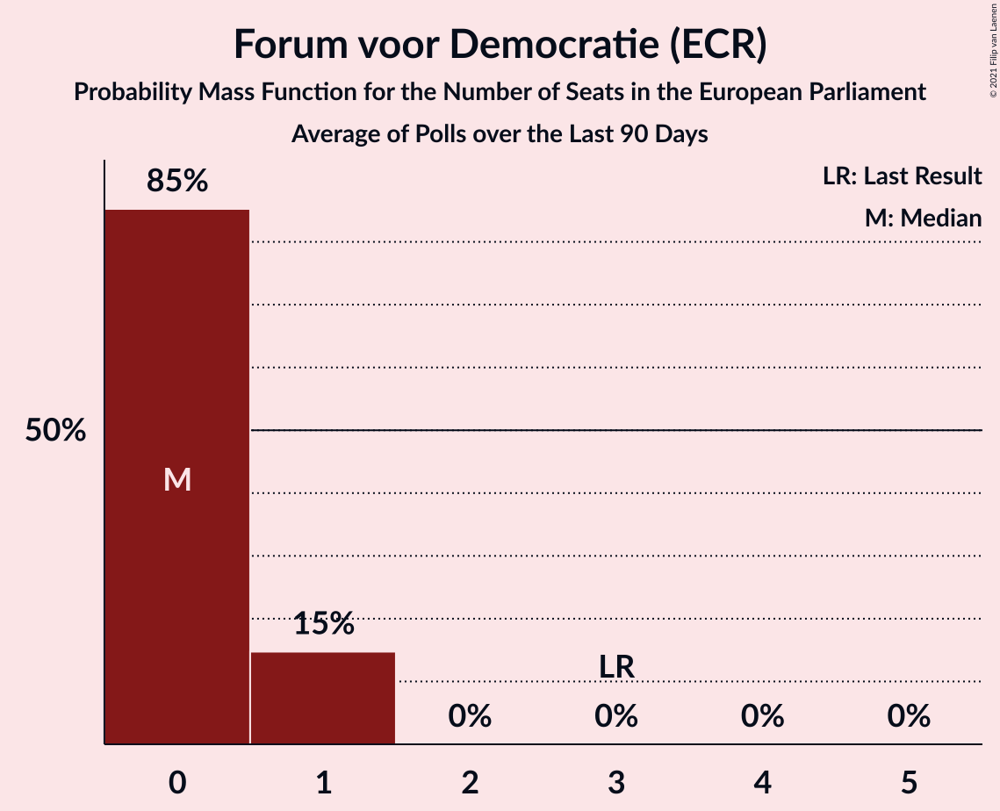

# Forum voor Democratie (ECR)

<a href="#voting-intentions">Voting Intentions</a> | <a href="#seats">Seats</a>

## Voting Intentions

Last result: **11.0%** (General Election of 23 May 2019)

### Confidence Intervals

| Period     | Polling firm/Commissioner(s) | Median | 80% Confidence Interval | 90% Confidence Interval | 95% Confidence Interval | 99% Confidence Interval |
|:----------:|:----------------:|:-----------:|:-----------------------:|:-----------------------:|:-----------------------:|:-----------------------:|
| N/A | [Poll Average](average.html) | 2.4% | 1.3–3.0% | 1.2–3.2% | 1.0–3.3% | 0.8–3.6% |
| [8–11 January 2021](2021-01-11-IOResearch.html) | I&O Research | 2.7% | 2.3–3.1% | 2.2–3.3% | 2.1–3.4% | 1.9–3.6% |
| [10 January 2021](2021-01-10-Peilnl.html) | Peil.nl | 2.7% | 2.3–3.1% | 2.2–3.2% | 2.1–3.3% | 2.0–3.5% |
| [1–2 January 2021](2021-01-02-Peilnl.html) | Peil.nl | 2.7% | 2.3–3.1% | 2.2–3.2% | 2.1–3.3% | 2.0–3.5% |
| [18–21 December 2020](2020-12-21-KantarPublic.html) | Kantar Public | 1.4% | 1.0–1.9% | 0.9–2.1% | 0.9–2.2% | 0.7–2.5% |
| [18–21 December 2020](2020-12-21-Ipsos.html) | Ipsos   EenVandaag | 2.3% | 1.8–3.0% | 1.6–3.2% | 1.5–3.4% | 1.3–3.8% |
| [18–19 December 2020](2020-12-19-Peilnl.html) | Peil.nl | 2.7% | 2.3–3.1% | 2.2–3.2% | 2.1–3.3% | 2.0–3.5% |
| [11–14 December 2020](2020-12-14-IOResearch.html) | I&O Research | 2.6% | 2.1–3.3% | 2.0–3.5% | 1.9–3.7% | 1.7–4.0% |
| [11–12 December 2020](2020-12-12-Peilnl.html) | Peil.nl | 2.7% | 2.3–3.1% | 2.2–3.2% | 2.1–3.3% | 2.0–3.5% |
| [4–5 December 2020](2020-12-05-Peilnl.html) | Peil.nl | 2.7% | 2.3–3.1% | 2.2–3.2% | 2.1–3.3% | 2.0–3.5% |
| [26–27 November 2020](2020-11-27-Peilnl.html) | Peil.nl | 2.0% | 1.7–2.4% | 1.6–2.5% | 1.6–2.6% | 1.4–2.8% |
| [20–23 November 2020](2020-11-23-Ipsos.html) | Ipsos   EenVandaag | 3.4% | 2.8–4.3% | 2.6–4.5% | 2.5–4.7% | 2.2–5.2% |
| [20–21 November 2020](2020-11-21-Peilnl.html) | Peil.nl | 5.3% | 4.8–5.9% | 4.7–6.1% | 4.6–6.2% | 4.4–6.5% |
| [9–16 November 2020](2020-11-16-IOResearch.html) | I&O Research | 4.0% | 3.5–4.6% | 3.4–4.7% | 3.2–4.9% | 3.0–5.2% |
| [15 November 2020](2020-11-15-Peilnl.html) | Peil.nl | 5.3% | 4.8–5.9% | 4.7–6.1% | 4.6–6.2% | 4.4–6.5% |
| [7–15 November 2020](2020-11-15-KantarPublic.html) | Kantar Public | 3.8% | 3.5–4.2% | 3.4–4.3% | 3.3–4.4% | 3.1–4.6% |
| [8 November 2020](2020-11-08-Peilnl.html) | Peil.nl | 5.3% | 4.8–5.9% | 4.7–6.1% | 4.6–6.2% | 4.4–6.5% |
| [1 November 2020](2020-11-01-Peilnl.html) | Peil.nl | 5.3% | 4.8–5.9% | 4.7–6.1% | 4.6–6.2% | 4.4–6.5% |
| [23–26 October 2020](2020-10-26-Ipsos.html) | Ipsos   EenVandaag | 3.3% | 2.7–4.2% | 2.5–4.4% | 2.4–4.6% | 2.1–5.0% |
| [16–17 October 2020](2020-10-17-Peilnl.html) | Peil.nl | 6.7% | 6.1–7.3% | 6.0–7.5% | 5.8–7.6% | 5.6–7.9% |
| [9–12 October 2020](2020-10-12-IOResearch.html) | I&O Research | 4.8% | 4.2–5.5% | 4.1–5.7% | 3.9–5.9% | 3.7–6.3% |
| [11 October 2020](2020-10-11-Peilnl.html) | Peil.nl | 6.6% | 6.1–7.3% | 5.9–7.4% | 5.8–7.6% | 5.5–7.9% |
| [4 October 2020](2020-10-04-Peilnl.html) | Peil.nl | 6.6% | 6.1–7.3% | 5.9–7.4% | 5.8–7.6% | 5.5–7.9% |
| [25–29 September 2020](2020-09-29-KantarPublic.html) | Kantar Public | 7.0% | 6.1–8.0% | 5.9–8.3% | 5.7–8.6% | 5.3–9.1% |
| [27 September 2020](2020-09-27-Peilnl.html) | Peil.nl | 6.6% | 6.1–7.3% | 5.9–7.4% | 5.8–7.6% | 5.5–7.9% |
| [25–27 September 2020](2020-09-27-Ipsos.html) | Ipsos   EenVandaag | 5.0% | 4.3–6.0% | 4.0–6.3% | 3.9–6.5% | 3.5–7.0% |
| [18–19 September 2020](2020-09-19-Peilnl.html) | Peil.nl | 6.6% | 6.1–7.3% | 5.9–7.4% | 5.8–7.6% | 5.5–7.9% |
| [3–7 September 2020](2020-09-07-IOResearch.html) | I&O Research | 6.7% | 6.1–7.5% | 5.9–7.7% | 5.7–7.9% | 5.4–8.3% |
| [4–5 September 2020](2020-09-05-Peilnl.html) | Peil.nl | 6.6% | 6.1–7.3% | 5.9–7.4% | 5.8–7.6% | 5.5–7.9% |
| [28–29 August 2020](2020-08-29-Peilnl.html) | Peil.nl | 6.6% | 6.1–7.3% | 5.9–7.4% | 5.8–7.6% | 5.5–7.9% |
| [21–27 August 2020](2020-08-27-Ipsos.html) | Ipsos   EenVandaag | 6.2% | 5.4–7.3% | 5.1–7.6% | 4.9–7.9% | 4.5–8.4% |
| [23 August 2020](2020-08-23-Peilnl.html) | Peil.nl | 7.3% | 6.8–8.0% | 6.6–8.2% | 6.4–8.3% | 6.2–8.6% |
| [14–15 August 2020](2020-08-15-Peilnl.html) | Peil.nl | 7.3% | 6.8–8.0% | 6.6–8.2% | 6.4–8.3% | 6.2–8.6% |
| [9 August 2020](2020-08-09-IOResearch.html) | I&O Research | 7.6% | 6.8–8.6% | 6.5–8.9% | 6.3–9.2% | 5.9–9.7% |
| [26 July 2020](2020-07-26-Peilnl.html) | Peil.nl | 8.0% | 7.4–8.7% | 7.2–8.9% | 7.1–9.0% | 6.8–9.4% |
| [24–26 July 2020](2020-07-26-Ipsos.html) | Ipsos   EenVandaag | 6.5% | 5.6–7.5% | 5.3–7.8% | 5.1–8.1% | 4.7–8.7% |
| [19 July 2020](2020-07-19-Peilnl.html) | Peil.nl | 8.0% | 7.4–8.7% | 7.2–8.9% | 7.1–9.0% | 6.8–9.4% |
| [3–6 July 2020](2020-07-06-IOResearch.html) | I&O Research | 7.9% | 7.2–8.7% | 7.0–8.9% | 6.8–9.1% | 6.5–9.5% |
| [5 July 2020](2020-07-05-Peilnl.html) | Peil.nl | 7.3% | 6.8–8.0% | 6.6–8.2% | 6.4–8.3% | 6.2–8.6% |
| [27–30 June 2020](2020-06-30-Ipsos.html) | Ipsos   EenVandaag | 5.9% | 5.0–6.9% | 4.8–7.2% | 4.6–7.5% | 4.2–8.0% |
| [28 June 2020](2020-06-28-Peilnl.html) | Peil.nl | 7.3% | 6.8–8.0% | 6.6–8.2% | 6.4–8.3% | 6.2–8.6% |
| [23–26 June 2020](2020-06-26-KantarPublic.html) | Kantar Public | 8.7% | 7.6–10.0% | 7.3–10.3% | 7.0–10.7% | 6.5–11.3% |
| [21 June 2020](2020-06-21-Peilnl.html) | Peil.nl | 7.3% | 6.8–8.0% | 6.6–8.2% | 6.4–8.3% | 6.2–8.6% |
| [5–9 June 2020](2020-06-09-IOResearch.html) | I&O Research | 7.4% | 6.8–8.0% | 6.7–8.2% | 6.6–8.4% | 6.3–8.6% |
| [31 May 2020](2020-05-31-Peilnl.html) | Peil.nl | 7.3% | 6.8–8.0% | 6.6–8.2% | 6.4–8.3% | 6.2–8.6% |
| [22–24 May 2020](2020-05-24-Ipsos.html) | Ipsos   EenVandaag | 7.7% | 6.8–8.9% | 6.5–9.2% | 6.3–9.5% | 5.8–10.1% |
| [15–16 May 2020](2020-05-16-Peilnl.html) | Peil.nl | 7.3% | 6.8–8.0% | 6.6–8.2% | 6.4–8.3% | 6.2–8.6% |
| [7–12 May 2020](2020-05-12-IOResearch.html) | I&O Research | 8.2% | 7.5–9.0% | 7.3–9.3% | 7.1–9.4% | 6.8–9.9% |
| [8–9 May 2020](2020-05-09-Peilnl.html) | Peil.nl | 7.3% | 6.8–8.0% | 6.6–8.2% | 6.4–8.3% | 6.2–8.6% |
| [1–2 May 2020](2020-05-02-Peilnl.html) | Peil.nl | 6.6% | 6.1–7.3% | 5.9–7.4% | 5.8–7.6% | 5.5–7.9% |
| [26 April 2020](2020-04-26-Peilnl.html) | Peil.nl | 8.0% | 7.4–8.7% | 7.2–8.9% | 7.1–9.0% | 6.8–9.4% |
| [24–26 April 2020](2020-04-26-Ipsos.html) | Ipsos   EenVandaag | 6.8% | 5.9–7.9% | 5.6–8.2% | 5.4–8.5% | 5.0–9.1% |
| [27–30 March 2020](2020-03-30-Ipsos.html) | Ipsos   EenVandaag | 6.8% | 5.9–7.9% | 5.6–8.3% | 5.4–8.5% | 5.0–9.1% |
| [26–30 March 2020](2020-03-30-IOResearch.html) | I&O Research | 7.7% | 7.1–8.5% | 6.9–8.7% | 6.7–8.9% | 6.4–9.3% |
| [5–10 March 2020](2020-03-10-IOResearch.html) | I&O Research | 9.8% | 9.0–10.7% | 8.8–10.9% | 8.6–11.1% | 8.3–11.6% |
| [1–6 March 2020](2020-03-06-Peilnl.html) | Peil.nl | 10.7% | 10.0–11.4% | 9.8–11.6% | 9.6–11.8% | 9.3–12.2% |
| [23 February–1 March 2020](2020-03-01-Peilnl.html) | Peil.nl | 10.6% | 9.9–11.4% | 9.7–11.6% | 9.6–11.8% | 9.3–12.2% |
| [21–24 February 2020](2020-02-24-Ipsos.html) | Ipsos   EenVandaag | 9.8% | 8.7–11.1% | 8.4–11.4% | 8.1–11.8% | 7.6–12.4% |
| [18–23 February 2020](2020-02-23-Peilnl.html) | Peil.nl | 10.6% | 9.9–11.4% | 9.7–11.6% | 9.6–11.8% | 9.3–12.2% |
| [17–22 February 2020](2020-02-22-Peilnl.html) | Peil.nl | 10.7% | 10.0–11.4% | 9.8–11.6% | 9.6–11.8% | 9.3–12.2% |
| [9–14 February 2020](2020-02-14-Peilnl.html) | Peil.nl | 10.7% | 10.0–11.4% | 9.8–11.6% | 9.6–11.8% | 9.3–12.2% |
| [2–9 February 2020](2020-02-09-Peilnl.html) | Peil.nl | 10.7% | 10.0–11.4% | 9.8–11.6% | 9.6–11.8% | 9.3–12.2% |
| [27 January–1 February 2020](2020-02-01-Peilnl.html) | Peil.nl | 11.3% | 10.6–12.1% | 10.4–12.3% | 10.2–12.5% | 9.9–12.9% |
| [24–27 January 2020](2020-01-27-Ipsos.html) | Ipsos | 10.6% | 9.5–12.0% | 9.2–12.3% | 8.9–12.7% | 8.4–13.3% |
| [21–26 January 2020](2020-01-26-Peilnl.html) | Peil.nl | 11.3% | 10.6–12.1% | 10.4–12.3% | 10.2–12.5% | 9.9–12.9% |
| [10–18 January 2020](2020-01-18-Peilnl.html) | Peil.nl | 11.3% | 10.6–12.1% | 10.4–12.3% | 10.2–12.5% | 9.9–12.9% |
| [10–14 January 2020](2020-01-14-IOResearch.html) | I&O Research | 9.2% | 8.4–10.0% | 8.2–10.3% | 8.0–10.5% | 7.7–10.9% |
| [6–11 January 2020](2020-01-11-Peilnl.html) | Peil.nl | 11.3% | 10.6–12.1% | 10.4–12.3% | 10.2–12.5% | 9.9–12.9% |
| [16–21 December 2019](2019-12-21-Peilnl.html) | Peil.nl | 12.0% | 11.3–12.8% | 11.1–13.0% | 10.9–13.2% | 10.5–13.6% |
| [19–21 December 2019](2019-12-21-Ipsos.html) | Ipsos   EenVandaag | 9.1% | 8.1–10.3% | 7.8–10.7% | 7.5–11.0% | 7.0–11.6% |
| [9–14 December 2019](2019-12-14-Peilnl.html) | Peil.nl | 12.0% | 11.3–12.8% | 11.1–13.0% | 10.9–13.2% | 10.5–13.6% |
| [2–7 December 2019](2019-12-07-Peilnl.html) | Peil.nl | 12.0% | 11.3–12.8% | 11.1–13.0% | 10.9–13.2% | 10.5–13.6% |
| [25–30 November 2019](2019-11-30-Peilnl.html) | Peil.nl | 11.3% | 10.6–12.1% | 10.4–12.3% | 10.2–12.5% | 9.9–12.9% |
| [22–25 November 2019](2019-11-25-Ipsos.html) | Ipsos   EenVandaag | 9.1% | 8.1–10.4% | 7.8–10.8% | 7.5–11.1% | 7.0–11.7% |
| [18–23 November 2019](2019-11-23-Peilnl.html) | Peil.nl | 11.3% | 10.6–12.1% | 10.4–12.3% | 10.2–12.5% | 9.9–12.9% |
| [11–16 November 2019](2019-11-16-Peilnl.html) | Peil.nl | 11.3% | 10.6–12.1% | 10.4–12.3% | 10.2–12.5% | 9.9–12.9% |
| [15 November 2019](2019-11-15-KantarPublic.html) | Kantar Public | 8.0% | 7.0–9.2% | 6.7–9.6% | 6.4–9.9% | 6.0–10.5% |
| [7–13 November 2019](2019-11-13-IOResearch.html) | I&O Research | 9.2% | 8.2–10.3% | 8.0–10.6% | 7.7–10.9% | 7.3–11.4% |
| [4–9 November 2019](2019-11-09-Peilnl.html) | Peil.nl | 10.0% | 9.3–10.7% | 9.1–10.9% | 9.0–11.1% | 8.7–11.5% |
| [28 October–2 November 2019](2019-11-02-Peilnl.html) | Peil.nl | 9.3% | 8.7–10.1% | 8.5–10.3% | 8.3–10.4% | 8.0–10.8% |
| [25–28 October 2019](2019-10-28-Ipsos.html) | Ipsos   EenVandaag | 7.9% | 7.0–9.1% | 6.7–9.5% | 6.4–9.8% | 6.0–10.4% |
| [21–26 October 2019](2019-10-26-Peilnl.html) | Peil.nl | 8.1% | 7.5–8.7% | 7.3–8.9% | 7.1–9.1% | 6.9–9.4% |
| [14–19 October 2019](2019-10-19-Peilnl.html) | Peil.nl | 9.3% | 8.7–10.1% | 8.5–10.3% | 8.3–10.4% | 8.0–10.8% |
| [15 October 2019](2019-10-15-KantarPublic.html) | Kantar Public | 8.7% | 7.6–10.0% | 7.3–10.4% | 7.1–10.7% | 6.6–11.3% |
| [10–15 October 2019](2019-10-15-IOResearch.html) | I&O Research | 7.8% | 7.0–8.7% | 6.8–8.9% | 6.6–9.2% | 6.3–9.6% |
| [7–12 October 2019](2019-10-12-Peilnl.html) | Peil.nl | 8.7% | 8.0–9.4% | 7.9–9.6% | 7.7–9.7% | 7.4–10.1% |
| [30 September–5 October 2019](2019-10-05-Peilnl.html) | Peil.nl | 8.7% | 8.0–9.4% | 7.9–9.6% | 7.7–9.7% | 7.4–10.1% |
| [23–28 September 2019](2019-09-28-Peilnl.html) | Peil.nl | 8.7% | 8.0–9.4% | 7.9–9.6% | 7.7–9.7% | 7.4–10.1% |
| [20–23 September 2019](2019-09-23-Ipsos.html) | Ipsos   EenVandaag | 7.1% | 6.2–8.3% | 5.9–8.6% | 5.7–8.9% | 5.2–9.4% |
| [16–21 September 2019](2019-09-21-Peilnl.html) | Peil.nl | 8.7% | 8.0–9.4% | 7.9–9.6% | 7.7–9.7% | 7.4–10.1% |
| [15 September 2019](2019-09-15-KantarPublic.html) | Kantar Public | 8.7% | 7.6–10.0% | 7.3–10.4% | 7.1–10.7% | 6.6–11.3% |
| [9–14 September 2019](2019-09-14-Peilnl.html) | Peil.nl | 9.3% | 8.7–10.1% | 8.5–10.3% | 8.3–10.4% | 8.0–10.8% |
| [2–7 September 2019](2019-09-07-Peilnl.html) | Peil.nl | 9.3% | 8.7–10.1% | 8.5–10.3% | 8.3–10.4% | 8.0–10.8% |
| [29 August–3 September 2019](2019-09-03-IOResearch.html) | I&O Research | 7.3% | 6.5–8.2% | 6.3–8.4% | 6.1–8.7% | 5.8–9.1% |
| [30 August–2 September 2019](2019-09-02-Ipsos.html) | Ipsos   EenVandaag | 7.3% | 6.3–8.5% | 6.1–8.8% | 5.8–9.1% | 5.4–9.7% |
| [26–31 August 2019](2019-08-31-Peilnl.html) | Peil.nl | 10.7% | 10.0–11.4% | 9.8–11.6% | 9.6–11.8% | 9.3–12.2% |
| [19–24 August 2019](2019-08-24-Peilnl.html) | Peil.nl | 10.7% | 10.0–11.4% | 9.8–11.6% | 9.6–11.8% | 9.3–12.2% |
| [29 July–4 August 2019](2019-08-04-Peilnl.html) | Peil.nl | 13.3% | 12.6–14.2% | 12.3–14.4% | 12.2–14.6% | 11.8–15.0% |
| [29 July 2019](2019-07-29-Peilnl.html) | Peil.nl | 13.3% | 12.6–14.2% | 12.3–14.4% | 12.2–14.6% | 11.8–15.0% |
| [26–29 July 2019](2019-07-29-Ipsos.html) | Ipsos   EenVandaag | 12.0% | 10.7–13.4% | 10.4–13.7% | 10.1–14.1% | 9.6–14.8% |
| [5–9 July 2019](2019-07-09-IOResearch.html) | I&O Research | 15.3% | 14.4–16.3% | 14.1–16.6% | 13.9–16.9% | 13.4–17.3% |
| [1–7 July 2019](2019-07-07-Peilnl.html) | Peil.nl | 14.7% | 13.9–15.5% | 13.6–15.8% | 13.4–16.0% | 13.1–16.4% |
| [24–30 June 2019](2019-06-30-Peilnl.html) | Peil.nl | 14.7% | 13.9–15.5% | 13.6–15.8% | 13.4–16.0% | 13.1–16.4% |
| [21–24 June 2019](2019-06-24-Ipsos.html) | Ipsos   EenVandaag | 13.2% | 11.9–14.7% | 11.6–15.1% | 11.3–15.5% | 10.7–16.2% |
| [17–23 June 2019](2019-06-23-Peilnl.html) | Peil.nl | 14.0% | 13.2–14.8% | 13.0–15.1% | 12.8–15.3% | 12.4–15.7% |
| [10–16 June 2019](2019-06-16-Peilnl.html) | Peil.nl | 14.0% | 13.2–14.8% | 13.0–15.1% | 12.8–15.3% | 12.4–15.7% |
| [3–9 June 2019](2019-06-09-Peilnl.html) | Peil.nl | 14.7% | 13.9–15.5% | 13.6–15.8% | 13.4–16.0% | 13.1–16.4% |
| [27 May–2 June 2019](2019-06-02-Peilnl.html) | Peil.nl | 14.7% | 13.9–15.5% | 13.6–15.8% | 13.4–16.0% | 13.1–16.4% |

### Probability Mass Function

The following table shows the probability mass function per percentage block of voting intentions for the [poll average](average.html) for Forum voor Democratie (ECR).

| Voting Intentions | Probability | Accumulated | Special Marks |
|:-----------------:|:-----------:|:-----------:|:-------------:|
| 0.0–0.5% | 0% | 100% |  |
| 0.5–1.5% | 17% | 100% |  |
| 1.5–2.5% | 41% | 83% | Median |
| 2.5–3.5% | 42% | 42% |  |
| 3.5–4.5% | 0.6% | 0.6% |  |
| 4.5–5.5% | 0% | 0% |  |
| 5.5–6.5% | 0% | 0% |  |
| 6.5–7.5% | 0% | 0% |  |
| 7.5–8.5% | 0% | 0% |  |
| 8.5–9.5% | 0% | 0% |  |
| 9.5–10.5% | 0% | 0% |  |
| 10.5–11.5% | 0% | 0% | Last Result |

## Seats

Last result: **3** seats (General Election of 23 May 2019)

### Confidence Intervals

| Period     | Polling firm/Commissioner(s) | Median | 80% Confidence Interval | 90% Confidence Interval | 95% Confidence Interval | 99% Confidence Interval |
|:----------:|:----------------:|:------:|:-----------------------:|:-----------------------:|:-----------------------:|:-----------------------:|
| N/A | [Poll Average](average.html) | 0 | 0 | 0 | 0 | 0–1 |
| [8–11 January 2021](2021-01-11-IOResearch.html) | I&O Research | 0 | 0 | 0 | 0 | 0–1 |
| [10 January 2021](2021-01-10-Peilnl.html) | Peil.nl | 0 | 0 | 0 | 0 | 0 |
| [1–2 January 2021](2021-01-02-Peilnl.html) | Peil.nl | 0 | 0 | 0 | 0 | 0 |
| [18–21 December 2020](2020-12-21-KantarPublic.html) | Kantar Public | 0 | 0 | 0 | 0 | 0 |
| [18–21 December 2020](2020-12-21-Ipsos.html) | Ipsos   EenVandaag | 0 | 0 | 0 | 0 | 0–1 |
| [18–19 December 2020](2020-12-19-Peilnl.html) | Peil.nl | 0 | 0 | 0 | 0 | 0 |
| [11–14 December 2020](2020-12-14-IOResearch.html) | I&O Research | 0 | 0 | 0–1 | 0–1 | 0–1 |
| [11–12 December 2020](2020-12-12-Peilnl.html) | Peil.nl | 0 | 0 | 0 | 0 | 0–1 |
| [4–5 December 2020](2020-12-05-Peilnl.html) | Peil.nl | 0 | 0 | 0 | 0–1 | 0–1 |
| [26–27 November 2020](2020-11-27-Peilnl.html) | Peil.nl | 0 | 0 | 0 | 0 | 0 |
| [20–23 November 2020](2020-11-23-Ipsos.html) | Ipsos   EenVandaag | 1 | 0–1 | 0–1 | 0–1 | 0–1 |
| [20–21 November 2020](2020-11-21-Peilnl.html) | Peil.nl | 2 | 1–2 | 1–2 | 1–2 | 1–2 |
| [9–16 November 2020](2020-11-16-IOResearch.html) | I&O Research | 0 | 0–1 | 0–1 | 0–1 | 0–1 |
| [15 November 2020](2020-11-15-Peilnl.html) | Peil.nl | 1 | 1–2 | 1–2 | 1–2 | 1–2 |
| [7–15 November 2020](2020-11-15-KantarPublic.html) | Kantar Public | 1 | 0–1 | 0–1 | 0–1 | 0–1 |
| [8 November 2020](2020-11-08-Peilnl.html) | Peil.nl | 1 | 1–2 | 1–2 | 1–2 | 1–2 |
| [1 November 2020](2020-11-01-Peilnl.html) | Peil.nl | 1 | 1–2 | 1–2 | 1–2 | 1–2 |
| [23–26 October 2020](2020-10-26-Ipsos.html) | Ipsos   EenVandaag | 1 | 0–1 | 0–1 | 0–1 | 0–1 |
| [16–17 October 2020](2020-10-17-Peilnl.html) | Peil.nl | 2 | 2 | 2 | 2 | 1–3 |
| [9–12 October 2020](2020-10-12-IOResearch.html) | I&O Research | 1 | 1 | 1 | 1–2 | 1–2 |
| [11 October 2020](2020-10-11-Peilnl.html) | Peil.nl | 2 | 2 | 2 | 2 | 2 |
| [4 October 2020](2020-10-04-Peilnl.html) | Peil.nl | 2 | 2 | 2 | 2 | 2 |
| [25–29 September 2020](2020-09-29-KantarPublic.html) | Kantar Public | 2 | 2 | 2 | 2 | 1–3 |
| [27 September 2020](2020-09-27-Peilnl.html) | Peil.nl | 2 | 2 | 2 | 2 | 2 |
| [25–27 September 2020](2020-09-27-Ipsos.html) | Ipsos   EenVandaag | 1 | 1–2 | 1–2 | 1–2 | 0–2 |
| [18–19 September 2020](2020-09-19-Peilnl.html) | Peil.nl | 2 | 2 | 2 | 2 | 2 |
| [3–7 September 2020](2020-09-07-IOResearch.html) | I&O Research | 2 | 2 | 2 | 1–2 | 1–3 |
| [4–5 September 2020](2020-09-05-Peilnl.html) | Peil.nl | 2 | 2 | 2 | 2 | 2 |
| [28–29 August 2020](2020-08-29-Peilnl.html) | Peil.nl | 2 | 1–2 | 1–2 | 1–2 | 1–2 |
| [21–27 August 2020](2020-08-27-Ipsos.html) | Ipsos   EenVandaag | 2 | 1–2 | 1–2 | 1–2 | 1–2 |
| [23 August 2020](2020-08-23-Peilnl.html) | Peil.nl | 2 | 2 | 2 | 2 | 2–3 |
| [14–15 August 2020](2020-08-15-Peilnl.html) | Peil.nl | 2 | 2 | 2 | 2 | 2–3 |
| [9 August 2020](2020-08-09-IOResearch.html) | I&O Research | 2 | 2 | 2 | 2 | 2–3 |
| [26 July 2020](2020-07-26-Peilnl.html) | Peil.nl | 2 | 2–3 | 2–3 | 2–3 | 2–3 |
| [24–26 July 2020](2020-07-26-Ipsos.html) | Ipsos   EenVandaag | 2 | 2 | 2 | 1–2 | 1–3 |
| [19 July 2020](2020-07-19-Peilnl.html) | Peil.nl | 2 | 2–3 | 2–3 | 2–3 | 2–3 |
| [3–6 July 2020](2020-07-06-IOResearch.html) | I&O Research | 2 | 2 | 2 | 2–3 | 2–3 |
| [5 July 2020](2020-07-05-Peilnl.html) | Peil.nl | 2 | 2 | 2 | 2 | 2–3 |
| [27–30 June 2020](2020-06-30-Ipsos.html) | Ipsos   EenVandaag | 2 | 1–2 | 1–2 | 1–2 | 1–2 |
| [28 June 2020](2020-06-28-Peilnl.html) | Peil.nl | 2 | 2 | 2 | 2 | 2–3 |
| [23–26 June 2020](2020-06-26-KantarPublic.html) | Kantar Public | 3 | 2–4 | 2–4 | 2–4 | 2–4 |
| [21 June 2020](2020-06-21-Peilnl.html) | Peil.nl | 2 | 2 | 2 | 2–3 | 2–3 |
| [5–9 June 2020](2020-06-09-IOResearch.html) | I&O Research | 2 | 2 | 2 | 2 | 2–3 |
| [31 May 2020](2020-05-31-Peilnl.html) | Peil.nl | 2 | 2 | 2 | 2 | 2 |
| [22–24 May 2020](2020-05-24-Ipsos.html) | Ipsos   EenVandaag | 2 | 2–3 | 2–3 | 2–3 | 2–3 |
| [15–16 May 2020](2020-05-16-Peilnl.html) | Peil.nl | 2 | 2 | 2 | 2 | 2–3 |
| [7–12 May 2020](2020-05-12-IOResearch.html) | I&O Research | 2 | 2–3 | 2–3 | 2–3 | 2–3 |
| [8–9 May 2020](2020-05-09-Peilnl.html) | Peil.nl | 2 | 2 | 2 | 2 | 2–3 |
| [1–2 May 2020](2020-05-02-Peilnl.html) | Peil.nl | 2 | 2 | 2 | 1–2 | 1–2 |
| [26 April 2020](2020-04-26-Peilnl.html) | Peil.nl | 3 | 2–3 | 2–3 | 2–3 | 2–3 |
| [24–26 April 2020](2020-04-26-Ipsos.html) | Ipsos   EenVandaag | 2 | 2 | 2 | 2 | 1–3 |
| [27–30 March 2020](2020-03-30-Ipsos.html) | Ipsos   EenVandaag | 2 | 2 | 2 | 1–2 | 1–3 |
| [26–30 March 2020](2020-03-30-IOResearch.html) | I&O Research | 2 | 2–3 | 2–3 | 2–3 | 2–3 |
| [5–10 March 2020](2020-03-10-IOResearch.html) | I&O Research | 3 | 3 | 3 | 3 | 3–4 |
| [1–6 March 2020](2020-03-06-Peilnl.html) | Peil.nl | 4 | 3–4 | 3–4 | 3–4 | 3–4 |
| [23 February–1 March 2020](2020-03-01-Peilnl.html) | Peil.nl | 3 | 3–4 | 3–4 | 3–4 | 3–4 |
| [21–24 February 2020](2020-02-24-Ipsos.html) | Ipsos   EenVandaag | 3 | 3 | 3–4 | 2–4 | 2–4 |
| [18–23 February 2020](2020-02-23-Peilnl.html) | Peil.nl | 3 | 3–4 | 3–4 | 3–4 | 3–4 |
| [17–22 February 2020](2020-02-22-Peilnl.html) | Peil.nl | 4 | 3–4 | 3–4 | 3–4 | 3–4 |
| [9–14 February 2020](2020-02-14-Peilnl.html) | Peil.nl | 3 | 3 | 3–4 | 3–4 | 3–4 |
| [2–9 February 2020](2020-02-09-Peilnl.html) | Peil.nl | 3 | 3 | 3–4 | 3–4 | 3–4 |
| [27 January–1 February 2020](2020-02-01-Peilnl.html) | Peil.nl | 4 | 3–4 | 3–4 | 3–4 | 3–4 |
| [24–27 January 2020](2020-01-27-Ipsos.html) | Ipsos | 3 | 3–4 | 3–4 | 3–4 | 3–4 |
| [21–26 January 2020](2020-01-26-Peilnl.html) | Peil.nl | 4 | 3–4 | 3–4 | 3–4 | 3–4 |
| [10–18 January 2020](2020-01-18-Peilnl.html) | Peil.nl | 4 | 3–4 | 3–4 | 3–4 | 3–4 |
| [10–14 January 2020](2020-01-14-IOResearch.html) | I&O Research | 3 | 3 | 3 | 3 | 2–3 |
| [6–11 January 2020](2020-01-11-Peilnl.html) | Peil.nl | 4 | 3–4 | 3–4 | 3–4 | 3–4 |
| [16–21 December 2019](2019-12-21-Peilnl.html) | Peil.nl | 4 | 4 | 4 | 3–4 | 3–4 |
| [19–21 December 2019](2019-12-21-Ipsos.html) | Ipsos   EenVandaag | 3 | 2–3 | 2–3 | 2–3 | 2–3 |
| [9–14 December 2019](2019-12-14-Peilnl.html) | Peil.nl | 4 | 4 | 4 | 3–4 | 3–4 |
| [2–7 December 2019](2019-12-07-Peilnl.html) | Peil.nl | 4 | 4 | 4 | 4 | 3–4 |
| [25–30 November 2019](2019-11-30-Peilnl.html) | Peil.nl | 4 | 4 | 3–4 | 3–4 | 3–4 |
| [22–25 November 2019](2019-11-25-Ipsos.html) | Ipsos   EenVandaag | 3 | 3 | 3–4 | 2–4 | 2–4 |
| [18–23 November 2019](2019-11-23-Peilnl.html) | Peil.nl | 4 | 3–4 | 3–4 | 3–4 | 3–4 |
| [11–16 November 2019](2019-11-16-Peilnl.html) | Peil.nl | 4 | 3–4 | 3–4 | 3–4 | 3–4 |
| [15 November 2019](2019-11-15-KantarPublic.html) | Kantar Public | 2 | 2–3 | 2–3 | 2–3 | 1–3 |
| [7–13 November 2019](2019-11-13-IOResearch.html) | I&O Research | 3 | 3 | 3 | 2–3 | 2–3 |
| [4–9 November 2019](2019-11-09-Peilnl.html) | Peil.nl | 3 | 3 | 3 | 3 | 3–4 |
| [28 October–2 November 2019](2019-11-02-Peilnl.html) | Peil.nl | 3 | 3 | 3 | 3 | 2–3 |
| [25–28 October 2019](2019-10-28-Ipsos.html) | Ipsos   EenVandaag | 2 | 2–3 | 2–3 | 2–3 | 2–3 |
| [21–26 October 2019](2019-10-26-Peilnl.html) | Peil.nl | 2 | 2–3 | 2–3 | 2–3 | 2–3 |
| [14–19 October 2019](2019-10-19-Peilnl.html) | Peil.nl | 3 | 3 | 3 | 3 | 2–3 |
| [15 October 2019](2019-10-15-KantarPublic.html) | Kantar Public | 2 | 2–3 | 2–3 | 2–3 | 2–3 |
| [10–15 October 2019](2019-10-15-IOResearch.html) | I&O Research | 2 | 2–3 | 2–3 | 2–3 | 2–3 |
| [7–12 October 2019](2019-10-12-Peilnl.html) | Peil.nl | 3 | 2–3 | 2–3 | 2–3 | 2–3 |
| [30 September–5 October 2019](2019-10-05-Peilnl.html) | Peil.nl | 3 | 2–3 | 2–3 | 2–3 | 2–3 |
| [23–28 September 2019](2019-09-28-Peilnl.html) | Peil.nl | 3 | 2–3 | 2–3 | 2–3 | 2–3 |
| [20–23 September 2019](2019-09-23-Ipsos.html) | Ipsos   EenVandaag | 2 | 2 | 2–3 | 2–3 | 1–3 |
| [16–21 September 2019](2019-09-21-Peilnl.html) | Peil.nl | 3 | 2–3 | 2–3 | 2–3 | 2–3 |
| [15 September 2019](2019-09-15-KantarPublic.html) | Kantar Public | 2 | 2–3 | 2–3 | 2–3 | 2–3 |
| [9–14 September 2019](2019-09-14-Peilnl.html) | Peil.nl | 3 | 3 | 3 | 3 | 2–3 |
| [2–7 September 2019](2019-09-07-Peilnl.html) | Peil.nl | 3 | 3 | 3 | 3 | 2–3 |
| [29 August–3 September 2019](2019-09-03-IOResearch.html) | I&O Research | 2 | 2 | 2–3 | 2–3 | 2–3 |
| [30 August–2 September 2019](2019-09-02-Ipsos.html) | Ipsos   EenVandaag | 2 | 2–3 | 2–3 | 2–3 | 1–3 |
| [26–31 August 2019](2019-08-31-Peilnl.html) | Peil.nl | 3 | 3–4 | 3–4 | 3–4 | 3–4 |
| [19–24 August 2019](2019-08-24-Peilnl.html) | Peil.nl | 3 | 3–4 | 3–4 | 3–4 | 3–4 |
| [29 July–4 August 2019](2019-08-04-Peilnl.html) | Peil.nl | 5 | 4–5 | 4–5 | 4–5 | 4–5 |
| [29 July 2019](2019-07-29-Peilnl.html) | Peil.nl | 5 | 4–5 | 4–5 | 4–5 | 4–5 |
| [26–29 July 2019](2019-07-29-Ipsos.html) | Ipsos   EenVandaag | 4 | 3–4 | 3–4 | 3–5 | 3–5 |
| [5–9 July 2019](2019-07-09-IOResearch.html) | I&O Research | 5 | 5 | 5 | 5 | 4–6 |
| [1–7 July 2019](2019-07-07-Peilnl.html) | Peil.nl | 5 | 5 | 5–6 | 4–6 | 4–6 |
| [24–30 June 2019](2019-06-30-Peilnl.html) | Peil.nl | 5 | 4–5 | 4–5 | 4–5 | 4–6 |
| [21–24 June 2019](2019-06-24-Ipsos.html) | Ipsos   EenVandaag | 4 | 4–5 | 4–5 | 4–5 | 3–6 |
| [17–23 June 2019](2019-06-23-Peilnl.html) | Peil.nl | 5 | 4–5 | 4–5 | 4–5 | 4–5 |
| [10–16 June 2019](2019-06-16-Peilnl.html) | Peil.nl | 5 | 4–5 | 4–5 | 4–5 | 4–5 |
| [3–9 June 2019](2019-06-09-Peilnl.html) | Peil.nl | 5 | 5 | 5 | 4–5 | 4–6 |
| [27 May–2 June 2019](2019-06-02-Peilnl.html) | Peil.nl | 5 | 5 | 5 | 4–5 | 4–6 |

### Probability Mass Function

The following table shows the probability mass function per seat for the [poll average](average.html) for Forum voor Democratie (ECR).

| Number of Seats | Probability | Accumulated | Special Marks |
|:---------------:|:-----------:|:-----------:|:-------------:|
| 0 | 99.1% | 100% | Median |
| 1 | 0.9% | 0.9% |  |
| 2 | 0% | 0% |  |
| 3 | 0% | 0% | Last Result |

