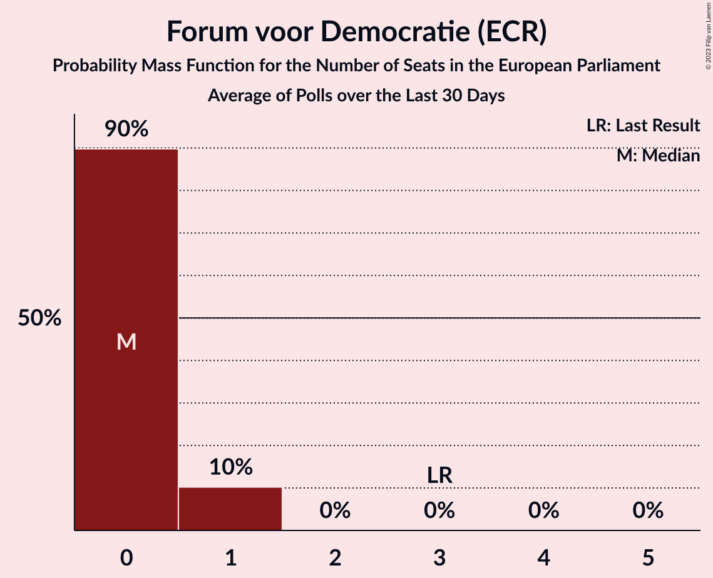

# Forum voor Democratie (ECR)

<a href="#voting-intentions">Voting Intentions</a> | <a href="#seats">Seats</a>

## Voting Intentions

Last result: **0.0%** (General Election of 23 May 2019)

### Confidence Intervals

| Period     | Polling firm/Commissioner(s) | Median | 80% Confidence Interval | 90% Confidence Interval | 95% Confidence Interval | 99% Confidence Interval |
|:----------:|:----------------:|:-----------:|:-----------------------:|:-----------------------:|:-----------------------:|:-----------------------:|
| N/A | [Poll Average](average.html) | 14.8% | 14.0–15.6% | 13.7–15.9% | 13.5–16.1% | 13.2–16.5% |
| [27 May–2 June 2019](2019-06-02-Peilnl.html) | Peil.nl | 14.8% | 14.0–15.6% | 13.7–15.9% | 13.5–16.1% | 13.2–16.5% |

### Probability Mass Function

The following table shows the probability mass function per percentage block of voting intentions for the [poll average](average.html) for Forum voor Democratie (ECR).

| Voting Intentions | Probability | Accumulated | Special Marks |
|:-----------------:|:-----------:|:-----------:|:-------------:|
| 0.0–0.5% | 0% | 100% | Last Result |
| 0.5–1.5% | 0% | 100% |  |
| 1.5–2.5% | 0% | 100% |  |
| 2.5–3.5% | 0% | 100% |  |
| 3.5–4.5% | 0% | 100% |  |
| 4.5–5.5% | 0% | 100% |  |
| 5.5–6.5% | 0% | 100% |  |
| 6.5–7.5% | 0% | 100% |  |
| 7.5–8.5% | 0% | 100% |  |
| 8.5–9.5% | 0% | 100% |  |
| 9.5–10.5% | 0% | 100% |  |
| 10.5–11.5% | 0% | 100% |  |
| 11.5–12.5% | 0% | 100% |  |
| 12.5–13.5% | 3% | 100% |  |
| 13.5–14.5% | 34% | 97% |  |
| 14.5–15.5% | 52% | 64% | Median |
| 15.5–16.5% | 12% | 12% |  |
| 16.5–17.5% | 0.4% | 0.4% |  |
| 17.5–18.5% | 0% | 0% |  |

## Seats

Last result: **0** seats (General Election of 23 May 2019)

### Confidence Intervals

| Period     | Polling firm/Commissioner(s) | Median | 80% Confidence Interval | 90% Confidence Interval | 95% Confidence Interval | 99% Confidence Interval |
|:----------:|:----------------:|:------:|:-----------------------:|:-----------------------:|:-----------------------:|:-----------------------:|
| N/A | [Poll Average](average.html) | 4 | 4–5 | 4–5 | 4–5 | 4–5 |
| [27 May–2 June 2019](2019-06-02-Peilnl.html) | Peil.nl | 4 | 4–5 | 4–5 | 4–5 | 4–5 |

### Probability Mass Function

The following table shows the probability mass function per seat for the [poll average](average.html) for Forum voor Democratie (ECR).

| Number of Seats | Probability | Accumulated | Special Marks |
|:---------------:|:-----------:|:-----------:|:-------------:|
| 0 | 0% | 100% | Last Result |
| 1 | 0% | 100% |  |
| 2 | 0% | 100% |  |
| 3 | 0% | 100% |  |
| 4 | 79% | 100% | Median |
| 5 | 21% | 21% |  |
| 6 | 0% | 0% |  |

